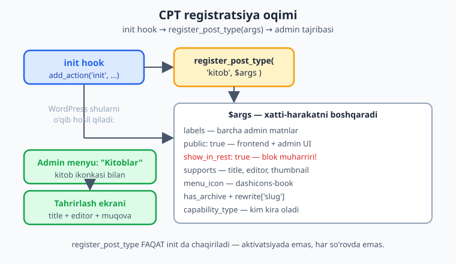
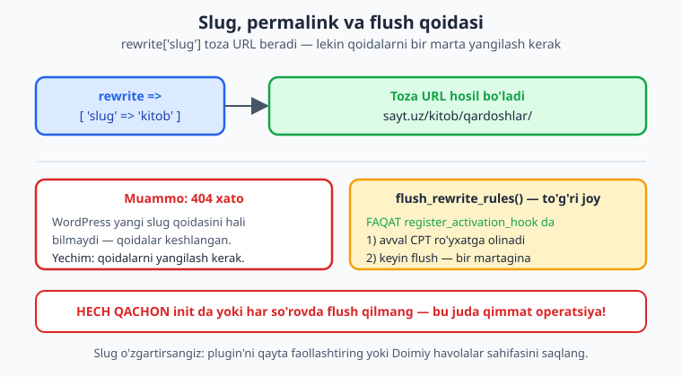
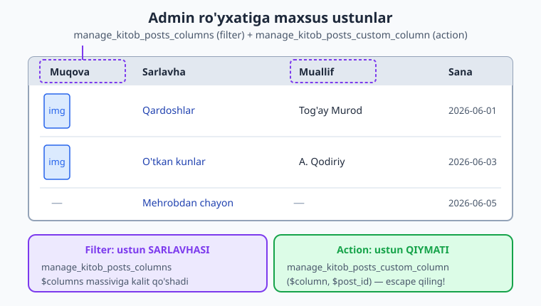

# 07 — Custom Post Type'lar

[⬅️ Oldingi: 06 — Settings API va admin sahifalar](./06-settings-api-admin.md) · [🏠 README](./README.md) · [Keyingi: 08 — Taxonomiyalar ➡️](./08-taxonomiyalar.md)

> **Bu bobda:** WordPress'ning standart `post` va `page` turlaridan tashqari o'z kontent turlaringizni — masalan `kitob` — yaratishni o'rganamiz: `register_post_type()` ni `init` hook'da to'g'ri argumentlar (`labels`, `public`, `show_in_rest`, `supports`, `rewrite`, `capability_type`) bilan chaqirish, slug/permalink uchun `flush_rewrite_rules()` ni FAQAT aktivatsiyada ishlatish, to'liq label'lar generatsiyasi va admin ro'yxatiga o'z ustunlaringizni (`manage_{cpt}_posts_columns` filter + `manage_{cpt}_posts_custom_column` action) qo'shish — hammasi "Kitoblar katalogi" plugin'i misolida.

---

## Muammo: blog post hammasiga yetmaydi

Tasavvur qiling, mijoz sizdan kutubxona sayti so'radi. Har bir kitobning nomi, muallifi, ISBN'i, muqovasi va tavsifi bor. "Oson-ku," deysiz, "har bir kitobni oddiy `post` qilib qo'yaman." Bir hafta o'tib muammolar boshlanadi:

- Kitoblar oddiy blog yozuvlari bilan aralashib ketdi — `wp-admin/edit.php` da ikkalasi bir ro'yxatda.
- Kitoblar uchun "Kategoriyalar" emas, "Janrlar" kerak edi, lekin ular oddiy postlar bilan teglarni bo'lishadi.
- URL `sayt.uz/2026/06/qardoshlar/` ko'rinishida — sana bilan, lekin kitobga sana mantiqsiz. Mijoz `sayt.uz/kitob/qardoshlar/` xohlaydi.
- Mijoz "yangi kitob qo'shish" tugmasini izlaydi, lekin "Yangi yozuv" yozuvi uni chalg'itadi.

Yechim — **Custom Post Type** (CPT, o'z kontent turi). Bu WordPress'ga "menda `post` va `page` dan tashqari yana bir kontent turi bor, uni `kitob` deb atayman, o'z menyusi, o'z URL'i va o'z admin ekrani bilan" deyishning rasmiy yo'li.

📌 **CPT nima?** WordPress ichida hamma narsa — yozuv, sahifa, hatto menyu elementi va biriktirma (attachment) — bitta `wp_posts` jadvalida saqlanadi. Ularni bir-biridan ajratuvchi maydon — `post_type` ustuni. Standart turlar: `post`, `page`, `attachment`, `revision`, `nav_menu_item`. **Custom Post Type** — shu ustunga o'z qiymatingizni (`kitob`) ro'yxatga olib, WordPress'dan unga to'liq admin tajribasi yaratishni so'rashdir.

### Nega temada emas, plugin'da?

Ko'p havaskor `register_post_type()` ni tema `functions.php`'ga yozadi. Bu — **xato**. Sababi oddiy: temani almashtirsangiz, kitoblaringiz ham yo'qoladi (aniqrog'i, ko'rinmay qoladi — `wp_posts` da turaveradi, lekin hech kim uni ro'yxatga olmaydi, shuning uchun admin va frontend uni ko'rsatmaydi).

> 💡 **Oltin qoida:** Kontent — bu **funksionallik**, dizayn emas. Funksionallik plugin'ga tegishli, tema esa faqat ko'rinish uchun. Kitoblaringiz tema'dan mustaqil yashashi kerak. Shuning uchun CPT har doim plugin'da ro'yxatga olinadi.

Biz uni shu kitobning izchil namuna plugin'i — **Kitoblar katalogi** (slug `kitoblar-katalogi`, namespace `Oqil\KitobKatalog`, text domain `kitoblar-katalogi`) ichiga qo'shamiz.

---

## `register_post_type()` — yagona kalit funksiya

CPT yaratishning butun siri — bitta funksiyada:

```php
register_post_type( string $post_type, array|string $args = [] );
```

Birinchi argument — CPT'ning ichki nomi (`post_type` ustuniga yoziladigan qiymat), masalan `kitob`. Ikkinchisi — uning xatti-harakatini boshqaradigan ulkan argumentlar massivi.

⚠️ **`post_type` nomi 20 belgidan oshmasin** va kichik harf, raqam, `_`/`-` dan iborat bo'lsin. WordPress ba'zi nomlarni (`post`, `page`, `revision`, `nav_menu_item`, `action`, `order`, `theme` va boshqalar) band qilgan — ularni ishlatmang. Konfliktdan qochish uchun o'z prefiksingizni qo'shish yaxshi amaliyot (masalan `kk_kitob`), lekin URL chiroyli bo'lishi uchun biz bu yerda sodda `kitob` ni ishlatamiz va slug'ni o'zimiz nazorat qilamiz.

### Eng muhim: qaysi hook'da chaqirish kerak?

📌 **`register_post_type()` ni FAQAT `init` hook'ida chaqiring.** Rasmiy hujjat aniq aytadi: post turini `init` dan oldin ro'yxatga olmang. `init` — WordPress to'liq yuklangan, lekin so'rov hali bajarilmagan payt. Plugin'lar, tema va WordPress yadrosi shu yerda o'z turlarini, taksonomiyalarini va shortcode'larini e'lon qiladi.

```php
add_action( 'init', 'oqil_kk_register_kitob_cpt' );
```

⚠️ **CPT'ni `init` da ro'yxatga oling, lekin `register_activation_hook` da EMAS.** Aktivatsiya hook'i faqat bir marta — plugin yoqilganda ishlaydi. Agar CPT'ni faqat o'sha yerda ro'yxatga olsangiz, keyingi har bir sahifa yuklanishida WordPress uni "bilmaydi". (Aktivatsiyada nimadir qilamiz, lekin u — `flush_rewrite_rules`, pastda ko'ramiz.)



---

## Args, bittalab: nimani nazorat qiladi?

Argumentlar massivi katta. Quyida `kitob` uchun eng muhimlarini izohlaymiz — har biri rasmiy [Code Reference](https://developer.wordpress.org/reference/functions/register_post_type/) bilan tasdiqlangan.

### `labels` — admindagi BARCHA matnlar

`labels` — bu CPT bilan bog'liq har bir admin matni: menyu nomi, "Yangi qo'shish" tugmasi, "Tahrirlash", bo'sh ro'yxat xabari va h.k. Ularni qo'lda bittalab yozish zerikarli, shuning uchun WordPress yordamchi funksiyaga ega:

📌 **`get_post_type_labels()`** singular va plural nomdan to'liq label massivini generatsiya qiladi — lekin u registratsiya ichida avtomatik chaqiriladi va faqat ingliz tilidan kelib chiqadi. Toza o'zbekcha (va tarjima qilinadigan) interfeys uchun biz label'larni **qo'lda, to'liq** beramiz. Bu — professional plugin belgisi.

```php
$labels = [
    'name'                  => __( 'Kitoblar', 'kitoblar-katalogi' ),
    'singular_name'         => __( 'Kitob', 'kitoblar-katalogi' ),
    'menu_name'             => __( 'Kitoblar', 'kitoblar-katalogi' ),
    'name_admin_bar'        => __( 'Kitob', 'kitoblar-katalogi' ),
    'add_new'               => __( 'Yangi qo\'shish', 'kitoblar-katalogi' ),
    'add_new_item'          => __( 'Yangi kitob qo\'shish', 'kitoblar-katalogi' ),
    'new_item'              => __( 'Yangi kitob', 'kitoblar-katalogi' ),
    'edit_item'             => __( 'Kitobni tahrirlash', 'kitoblar-katalogi' ),
    'view_item'             => __( 'Kitobni ko\'rish', 'kitoblar-katalogi' ),
    'view_items'            => __( 'Kitoblarni ko\'rish', 'kitoblar-katalogi' ),
    'all_items'             => __( 'Barcha kitoblar', 'kitoblar-katalogi' ),
    'search_items'          => __( 'Kitoblarni qidirish', 'kitoblar-katalogi' ),
    'not_found'             => __( 'Kitob topilmadi.', 'kitoblar-katalogi' ),
    'not_found_in_trash'    => __( 'Savatda kitob topilmadi.', 'kitoblar-katalogi' ),
    'featured_image'        => __( 'Muqova rasmi', 'kitoblar-katalogi' ),
    'set_featured_image'    => __( 'Muqova rasmini tanlash', 'kitoblar-katalogi' ),
    'remove_featured_image' => __( 'Muqovani olib tashlash', 'kitoblar-katalogi' ),
    'archives'              => __( 'Kitoblar arxivi', 'kitoblar-katalogi' ),
    'item_published'        => __( 'Kitob chop etildi.', 'kitoblar-katalogi' ),
    'item_updated'          => __( 'Kitob yangilandi.', 'kitoblar-katalogi' ),
];
```

> ℹ️ `__( 'Yangi qo\'shish', ... )` da apostrof `\'` bilan ekran qilingan — chunki PHP satri yagona tirnoq ichida. Bu PHP'ning oddiy qoidasi, WordPress'ga aloqasi yo'q. i18n (`__()` va text domain) ni 24-bobda chuqur ko'ramiz; hozircha har matnni `__()` ga o'rab, ikkinchi argument sifatida plugin text domain'ini berishni odat qiling.

### Asosiy xatti-harakat argumentlari

| Argument | `kitob` uchun | Nima qiladi |
|---|---|---|
| `public` | `true` | Bosh "kalit". `true` bo'lsa CPT frontend'da ko'rinadi, qidiruvga kiradi, admin UI hosil bo'ladi. Ko'p boshqa argumentlar shundan kelib chiqadi. |
| `show_ui` | `true` | Admin'da tahrirlash interfeysini hosil qiladi (odatda `public` dan meros oladi). |
| `show_in_menu` | `true` | Admin yon menyuda alohida element. `true` — yuqori daraja; `'edit.php?post_type=...'` — boshqa menyu ostida; `false` — yashirin. |
| `show_in_rest` | `true` | **MUHIM.** REST API'da va shuning hisobiga **blok muharririda** (Gutenberg) ochiladi. `false` bo'lsa eski klassik muharrir ishlaydi. Zamonaviy CPT uchun har doim `true`. |
| `menu_icon` | `'dashicons-book'` | Menyu yonidagi ikonka. WordPress'ga o'rnatilgan [Dashicons](https://developer.wordpress.org/resource/dashicons/) klassi, rasm URL'i yoki base64 SVG. |
| `menu_position` | `20` | Menyudagi tartib raqami (20 — "Sahifalar" yonida). `null` bo'lsa eng pastga tushadi. |
| `supports` | massiv (pastda) | CPT muharriri qaysi maydonlarni ko'rsatishi. |
| `has_archive` | `true` | CPT uchun arxiv sahifasini yoqadi (`sayt.uz/kitob/`). |
| `rewrite` | massiv (pastda) | URL/permalink tuzilishi. |
| `hierarchical` | `false` | `false` — `post` kabi tekis (ota-bola yo'q). `true` — `page` kabi (ota-bola, "Ota" tanlovi). Kitoblar uchun teks yetadi. |
| `capability_type` | `'post'` | CPT'ga kim kira oladi degan ruxsatlar (`edit_post`, `publish_posts` ...) qaysi turdan "klonlanadi". `'post'` — oddiy postlar bilan bir xil ruxsat. |

⚠️ **`show_in_rest` ni `true` qilishni unutmang.** Bu eng tez-tez uchraydigan xato: CPT yaratasiz, lekin blok muharriri ochilmaydi yoki REST endpoint `/wp/v2/kitob` bo'sh qaytaradi. Sababi — `show_in_rest` standart bo'yicha `false`. Zamonaviy WordPress'da REST = blok muharriri + headless + JS — shuning uchun uni yoqing.

### `supports` — muharrirda qaysi qutilar?

`supports` massivi CPT tahrirlash ekranida qaysi maydonlar chiqishini belgilaydi:

```php
'supports' => [ 'title', 'editor', 'thumbnail', 'excerpt', 'custom-fields' ],
```

- `title` — kitob nomi (sarlavha qatori).
- `editor` — asosiy kontent (tavsif, blok muharriri).
- `thumbnail` — **muqova rasmi** (Featured Image). Bu paydo bo'lishi uchun temada `add_theme_support( 'post-thumbnails' )` ham kerakligini eslang.
- `excerpt` — qisqacha tavsif.
- `custom-fields` — meta maydonlar uchun standart quti (ISBN, muallif kabilarni biz 09-bobda meta box bilan chiroyliroq qilamiz).

> 💡 Kerakmas maydonni qo'shmang. Masalan kitobga izoh kerak bo'lmasa, `comments` ni `supports` ga qo'shmang — admin sof bo'ladi.

---

## Slug, permalink va `rewrite`

Mijoz `sayt.uz/kitob/qardoshlar/` ko'rinishidagi toza URL'ni xohlagandi. Buni `rewrite` argumenti boshqaradi:

```php
'has_archive' => true,
'rewrite'     => [
    'slug'       => 'kitob',   // URL bo'lagi: /kitob/<nom>
    'with_front' => false,     // permalink prefiksini (masalan /blog) qo'shmaydi
],
```

- `slug` — URL'dagi bo'lak. `kitob` desangiz, har kitob `sayt.uz/kitob/qardoshlar/` bo'ladi, arxiv esa (`has_archive => true` tufayli) `sayt.uz/kitob/`.
- `with_front` — agar permalink sozlamalaringizda umumiy prefiks (`/blog`) bo'lsa, uni qo'shadimi. CPT uchun odatda `false` toza ko'rinadi.



### `flush_rewrite_rules()` — faqat aktivatsiyada!

URL qoidalari (rewrite rules) WordPress tomonidan keshlanadi. Yangi CPT'ni `slug` bilan qo'shganingizda, WordPress hali bu qoidalarni bilmaydi — `sayt.uz/kitob/qardoshlar/` ga kirsangiz **404** olasiz. Yechim — qoidalarni qaytadan generatsiya qilish: `flush_rewrite_rules()`.

⚠️ **`flush_rewrite_rules()` ni HECH QACHON `init` da yoki har so'rovda chaqirmang!** Rasmiy hujjat aniq ogohlantiradi: bu **juda qimmat** operatsiya (barcha qoidalarni o'chirib qaytadan quradi). Uni har sahifa yuklanishida chaqirsangiz, saytingiz sezilarli sekinlashadi. Bu — eng keng tarqalgan ishlash muammolaridan biri.

📌 **To'g'ri naqsh:** `flush_rewrite_rules()` ni FAQAT **aktivatsiya hook'ida** (`register_activation_hook`) chaqiring. Va muhimi — **avval CPT'ni ro'yxatga oling, keyin flush qiling**, aks holda flush qiladigan qoidalar hali mavjud bo'lmaydi.

```php
register_activation_hook( __FILE__, 'oqil_kk_activate' );

function oqil_kk_activate(): void {
    // 1) Avval CPT'ni ro'yxatga olamiz — qoidalar hosil bo'lsin.
    oqil_kk_register_kitob_cpt();
    // 2) Endi qoidalarni yangilaymiz (bir martagina, aktivatsiyada).
    flush_rewrite_rules();
}
```

> 💡 Deaktivatsiyada ham `flush_rewrite_rules()` chaqirib, CPT qoidalarini tozalash yaxshi odob (`register_deactivation_hook`). Aktivatsiya/deaktivatsiya hooklarini 03-bobda ko'rgandik.

⚠️ Plugin'ni allaqachon faollashtirgan bo'lsangiz va keyin `slug`'ni o'zgartirsangiz, aktivatsiya qayta ishlamaydi. O'sha paytda `Sozlamalar → Doimiy havolalar` (Permalinks) sahifasini ochib "Saqlash" bosish ham qoidalarni yangilaydi — bu rivojlanish paytida tez yo'l.

---

## To'liq registratsiya kodi

Endi hammasini birlashtiramiz. Bu — plugin'ingizning `includes/cpt.php` fayli bo'lishi mumkin:

```php
<?php
/**
 * Kitoblar katalogi — CPT registratsiyasi.
 *
 * @package Oqil\KitobKatalog
 */

declare( strict_types = 1 );

// To'g'ridan-to'g'ri kirishni bloklash.
if ( ! defined( 'ABSPATH' ) ) {
    exit;
}

/**
 * "kitob" Custom Post Type'ini ro'yxatga oladi.
 */
function oqil_kk_register_kitob_cpt(): void {
    $labels = [
        'name'               => __( 'Kitoblar', 'kitoblar-katalogi' ),
        'singular_name'      => __( 'Kitob', 'kitoblar-katalogi' ),
        'menu_name'          => __( 'Kitoblar', 'kitoblar-katalogi' ),
        'name_admin_bar'     => __( 'Kitob', 'kitoblar-katalogi' ),
        'add_new'            => __( 'Yangi qo\'shish', 'kitoblar-katalogi' ),
        'add_new_item'       => __( 'Yangi kitob qo\'shish', 'kitoblar-katalogi' ),
        'new_item'           => __( 'Yangi kitob', 'kitoblar-katalogi' ),
        'edit_item'          => __( 'Kitobni tahrirlash', 'kitoblar-katalogi' ),
        'view_item'          => __( 'Kitobni ko\'rish', 'kitoblar-katalogi' ),
        'all_items'          => __( 'Barcha kitoblar', 'kitoblar-katalogi' ),
        'search_items'       => __( 'Kitoblarni qidirish', 'kitoblar-katalogi' ),
        'not_found'          => __( 'Kitob topilmadi.', 'kitoblar-katalogi' ),
        'not_found_in_trash' => __( 'Savatda kitob topilmadi.', 'kitoblar-katalogi' ),
        'featured_image'     => __( 'Muqova rasmi', 'kitoblar-katalogi' ),
        'archives'           => __( 'Kitoblar arxivi', 'kitoblar-katalogi' ),
    ];

    $args = [
        'labels'        => $labels,
        'public'        => true,
        'show_ui'       => true,
        'show_in_menu'  => true,
        'show_in_rest'  => true, // Blok muharriri + REST API uchun.
        'menu_icon'     => 'dashicons-book',
        'menu_position' => 20,
        'supports'      => [ 'title', 'editor', 'thumbnail', 'excerpt', 'custom-fields' ],
        'has_archive'   => true,
        'hierarchical'  => false,
        'rewrite'       => [
            'slug'       => 'kitob',
            'with_front' => false,
        ],
        'capability_type' => 'post',
        'map_meta_cap'    => true,
    ];

    register_post_type( 'kitob', $args );
}
add_action( 'init', 'oqil_kk_register_kitob_cpt' );

/**
 * Aktivatsiya: CPT'ni ro'yxatga olib, rewrite qoidalarini bir marta yangilaydi.
 */
function oqil_kk_activate(): void {
    oqil_kk_register_kitob_cpt();
    flush_rewrite_rules();
}
register_activation_hook( __FILE__, 'oqil_kk_activate' );

/**
 * Deaktivatsiya: CPT qoidalarini tozalaydi.
 */
function oqil_kk_deactivate(): void {
    flush_rewrite_rules();
}
register_deactivation_hook( __FILE__, 'oqil_kk_deactivate' );
```

> ℹ️ **Jonli sinov (o'z saytingizda).** Bu kodni plugin'ingizga qo'shib, plugin'ni `wp-admin → Plugin'lar` da **qayta faollashtiring** (deaktivatsiya → aktivatsiya — yangi aktivatsiya hook ishga tushishi uchun). So'ng admin menyuda kitob ikonkali "Kitoblar" elementi paydo bo'ladi, "Yangi kitob qo'shish" bilan bir nechta kitob yarating va `sayt.uz/kitob/<nom>/` URL'ini ochib ko'ring. Bu natijalar ishlab turgan WordPress'ni talab qiladi — `php -l` faqat kodning sintaksisini tekshiradi.

📌 `'capability_type' => 'post'` va `'map_meta_cap' => true` birga — kitoblarga ruxsatlarni oddiy postlar kabi boshqaradi (`edit_posts`, `publish_posts` ...). Agar kitoblar uchun **alohida** ruxsatlar (masalan faqat "kutubxonachi" roli tahrirlaydigan) kerak bo'lsa, `capability_type` ni `[ 'kitob', 'kitoblar' ]` qilib custom capabilities yaratasiz — buni 11-bobda (Rollar va capabilities) ko'ramiz.

---

## Admin ro'yxatiga o'z ustunlaringiz

Standart CPT ro'yxati (`wp-admin → Kitoblar`) faqat "Sarlavha", "Sana" ustunlarini ko'rsatadi. Kutubxonachi har kitobning **muallifini** va **muqovasini** to'g'ridan-to'g'ri ro'yxatda ko'rishni xohlaydi. Buni ikkita hook hal qiladi.

### 1-qadam: ustun sarlavhalarini qo'shish — filter

📌 **`manage_{post_type}_posts_columns`** filter ustunlar massivini (kalit → sarlavha) oladi va o'zgartirilganini qaytaradi. `kitob` uchun hook nomi `manage_kitob_posts_columns` bo'ladi.

```php
/**
 * Kitob ro'yxatiga "Muqova" va "Muallif" ustunlarini qo'shadi.
 *
 * @param string[] $columns Mavjud ustunlar (kalit => sarlavha).
 * @return string[]
 */
function oqil_kk_kitob_columns( array $columns ): array {
    $new = [];
    foreach ( $columns as $key => $label ) {
        // "Sarlavha" dan oldin "Muqova"ni joylaymiz.
        if ( 'title' === $key ) {
            $new['kitob_muqova'] = __( 'Muqova', 'kitoblar-katalogi' );
        }
        $new[ $key ] = $label;
        // "Sarlavha" dan keyin "Muallif"ni joylaymiz.
        if ( 'title' === $key ) {
            $new['kitob_muallif'] = __( 'Muallif', 'kitoblar-katalogi' );
        }
    }
    return $new;
}
add_filter( 'manage_kitob_posts_columns', 'oqil_kk_kitob_columns' );
```

> 💡 To'g'ridan-to'g'ri `$columns['kitob_muallif'] = ...` desangiz ham bo'ladi, lekin u eng oxirga (Sana'dan keyin) tushadi. Yuqoridagi `foreach` tartibni aniq nazorat qilish uchun — ustunni xohlagan joyga qo'yamiz.

### 2-qadam: ustun qiymatlarini chizish — action

Filter faqat sarlavhalarni qo'shdi; har bir qatorda nima ko'rsatilishini esa **action** hal qiladi:

📌 **`manage_{post_type}_posts_custom_column`** action **ikkita** argument oladi: `$column` (ustun kaliti) va `$post_id` (joriy yozuv ID'si) — aynan shu tartibda. Shuning uchun `add_action` ning oxirgi argumenti `2` (accepted_args).

```php
/**
 * Maxsus ustunlar qiymatini chizadi.
 *
 * @param string $column  Ustun kaliti.
 * @param int    $post_id Yozuv ID'si.
 */
function oqil_kk_kitob_column_content( string $column, int $post_id ): void {
    switch ( $column ) {
        case 'kitob_muqova':
            if ( has_post_thumbnail( $post_id ) ) {
                // get_the_post_thumbnail xavfsiz HTML qaytaradi.
                echo get_the_post_thumbnail( $post_id, [ 50, 70 ] );
            } else {
                echo '<span aria-hidden="true">—</span>';
            }
            break;

        case 'kitob_muallif':
            // Muallif meta'da saqlangan deb faraz qilamiz (09-bobda kiritamiz).
            $muallif = get_post_meta( $post_id, '_kitob_muallif', true );
            if ( '' !== $muallif ) {
                // Matnli meta'ni KONTEKST bo'yicha escape qilamiz.
                echo esc_html( $muallif );
            } else {
                echo '<span aria-hidden="true">—</span>';
            }
            break;
    }
}
add_action( 'manage_kitob_posts_custom_column', 'oqil_kk_kitob_column_content', 10, 2 );
```

⚠️ **Har doim escape qiling.** Meta'dan kelgan matnni (`$muallif`) to'g'ridan-to'g'ri `echo` qilmang — XSS xavfi. Matn kontekstida `esc_html()` ishlating. `get_the_post_thumbnail()` esa allaqachon xavfsiz `` HTML'ini qaytargani uchun uni qo'shimcha escape qilish shart emas (aks holda HTML buziladi). Escaping kontekstini 12-bobda chuqur ko'ramiz.



> 💡 **Ustunni saralanadigan (sortable) qilish.** `manage_edit-kitob_sortable_columns` filteri bilan ustunni bosib saralashni yoqishingiz mumkin, so'ng `pre_get_posts` da `orderby` ni meta'ga ulaysiz. Bu — `meta_query`/`meta_value` orqali, lekin katta kataloglarda ishlash xarajati borligini unutmang (26-bob). Hozircha ko'rsatish yetarli.

---

## Tez-tez uchraydigan xatolar

⚠️ **404 har yangi kitobda.** Demak rewrite qoidalari yangilanmagan. Plugin'ni qayta faollashtiring yoki `Doimiy havolalar` sahifasini saqlang. Va `flush_rewrite_rules()` ni `init` ga qo'ymaganingizni tekshiring.

⚠️ **Blok muharriri ochilmaydi / REST bo'sh.** `show_in_rest => true` qo'yilmagan.

⚠️ **CPT yo'qoladi.** Registratsiyani `init` da emas, faqat aktivatsiyada qoldirgansiz. CPT har so'rovda `init` da ro'yxatga olinishi shart.

⚠️ **Menyu ikonkasi ko'rinmaydi.** `menu_icon` da noto'g'ri Dashicons klassi. To'g'ri ro'yxat — [Dashicons](https://developer.wordpress.org/resource/dashicons/) sahifasida (`dashicons-` prefiksi bilan).

📌 **Tayanch bilim.** Bu bobning kodlari sof PHP funksiyalari va massivlarga tayanadi (`declare(strict_types=1)`, tip e'lonlari, `match`/`switch`). Agar bu sizga notanish bo'lsa, [PHP — Mutlaqo Noldan](../php/README.md) va [PHP — Ekspert Darajasi](../php-expert/README.md) kitoblariga qaytib oling.

---

## Xulosa

- CPT — `wp_posts` jadvalidagi `post_type` ustuniga o'z qiymatingizni (`kitob`) ro'yxatga olib, unga to'liq admin tajribasini olishdir.
- CPT har doim **plugin'da**, tema'da emas — kontent funksionallik, dizayn emas.
- `register_post_type( 'kitob', $args )` ni **faqat `init`** hook'ida chaqiring.
- Muhim args: `labels` (to'liq, tarjima qilingan), `public`, `show_in_rest` (**`true`!**), `supports`, `menu_icon`, `has_archive`, `rewrite['slug']`, `hierarchical`, `capability_type`.
- `flush_rewrite_rules()` — **qimmat**; uni FAQAT aktivatsiyada, CPT'ni ro'yxatga olgandan KEYIN chaqiring.
- Admin ustunlari: `manage_kitob_posts_columns` filter (sarlavhalar) + `manage_kitob_posts_custom_column` action (qiymatlar, `accepted_args = 2`), va qiymatlarni escape qiling.

Keyingi bobda kitoblarni **janrlarga** ajratamiz — bu uchun Custom Taxonomy yaratamiz va uni `kitob` CPT'ga bog'laymiz.

---

## 07-bob mashqlari

> Mashqlarni o'z lokal WordPress saytingizda (02-bob: `wp-env`/Docker) bajaring. Har plugin'ni teringan, faollashtirgan va admin'da ko'rgan bo'ling.

**1 (Oson).** `register_post_type()` ning birinchi argumenti nima va u qaysi maksimal uzunlikda bo'lishi kerak? Nima uchun ba'zi nomlar (`post`, `page`) band?

**2 (Oson).** `register_post_type()` qaysi hook'da chaqirilishi kerak va nega aynan o'sha hook?

**3 (Oson).** `show_in_rest` ni `true` qilmasangiz nima ishlamay qoladi? Kamida ikkita oqibatini ayting.

**4 (Oson).** `public => true` qaysi boshqa argumentlarni avtomatik o'zgartiradi? Kamida uchtasini sanang.

**5 (O'rta).** `film` nomli CPT yarating: `supports` da `title`, `editor`, `thumbnail`; slug `film`; menyu ikonkasi `dashicons-video-alt2`; blok muharririda ochilsin; arxivi bo'lsin.

<details markdown="1">
<summary>Yechim</summary>

```php
function oqil_kk_register_film_cpt(): void {
    $args = [
        'labels'        => [
            'name'          => __( 'Filmlar', 'kitoblar-katalogi' ),
            'singular_name' => __( 'Film', 'kitoblar-katalogi' ),
            'add_new_item'  => __( 'Yangi film qo\'shish', 'kitoblar-katalogi' ),
            'edit_item'     => __( 'Filmni tahrirlash', 'kitoblar-katalogi' ),
            'not_found'     => __( 'Film topilmadi.', 'kitoblar-katalogi' ),
        ],
        'public'        => true,
        'show_in_rest'  => true,
        'menu_icon'     => 'dashicons-video-alt2',
        'supports'      => [ 'title', 'editor', 'thumbnail' ],
        'has_archive'   => true,
        'rewrite'       => [ 'slug' => 'film', 'with_front' => false ],
    ];
    register_post_type( 'film', $args );
}
add_action( 'init', 'oqil_kk_register_film_cpt' );
```

`public => true` `show_ui`, `show_in_menu`, `publicly_queryable` va boshqalarni o'zi yoqadi, shuning uchun ularni qaytadan yozish shart emas. Slug'ni yangiladingiz, demak plugin'ni qayta faollashtiring (yoki Doimiy havolalarni saqlang).
</details>

**6 (O'rta).** Nima uchun `flush_rewrite_rules()` ni `init` hook'da chaqirish xato? Texnik sababini (ishlash + qoidalar generatsiyasi) tushuntiring.

**7 (O'rta).** `hierarchical => true` va `hierarchical => false` orasidagi farqni misol bilan ayting. `kitob` uchun qaysi biri to'g'ri va nega?

**8 (O'rta).** `kitob` ro'yxatiga "ISBN" nomli ustun qo'shing (sarlavhadan keyin), qiymati `_kitob_isbn` meta'sidan olinsin va escape qilinsin. Meta bo'sh bo'lsa `—` ko'rsatilsin.

<details markdown="1">
<summary>Yechim</summary>

```php
// Sarlavhalar (filter).
function oqil_kk_kitob_isbn_column( array $columns ): array {
    $new = [];
    foreach ( $columns as $key => $label ) {
        $new[ $key ] = $label;
        if ( 'title' === $key ) {
            $new['kitob_isbn'] = __( 'ISBN', 'kitoblar-katalogi' );
        }
    }
    return $new;
}
add_filter( 'manage_kitob_posts_columns', 'oqil_kk_kitob_isbn_column' );

// Qiymat (action) — accepted_args = 2.
function oqil_kk_kitob_isbn_value( string $column, int $post_id ): void {
    if ( 'kitob_isbn' !== $column ) {
        return;
    }
    $isbn = get_post_meta( $post_id, '_kitob_isbn', true );
    echo '' !== $isbn ? esc_html( $isbn ) : '<span aria-hidden="true">—</span>';
}
add_action( 'manage_kitob_posts_custom_column', 'oqil_kk_kitob_isbn_value', 10, 2 );
```

Diqqat: action callback'i ikki argument oladi (`$column`, `$post_id`), shuning uchun `add_action` da `accepted_args` `2` bo'lishi shart. ISBN'ni escape qildik — XSS xavfini bartaraf etish uchun.
</details>

**9 (O'rta).** `menu_position` ni `5` va `100` qilib sinab ko'ring. Menyuda CPT qayerda paydo bo'ladi? `null` bo'lsa-chi? (Lokal saytingizda kuzating.)

**10 (Qiyin).** To'liq mini-plugin yozing: header bilan, `tadbir` (event) CPT'sini ro'yxatga oladi (`supports`: `title`, `editor`, `thumbnail`, `excerpt`; slug `tadbir`; ikonka `dashicons-calendar-alt`; REST'da; arxivli), aktivatsiyada `flush_rewrite_rules` ni to'g'ri naqsh bilan chaqiradi va admin ro'yxatiga "Boshlanish sanasi" (`_tadbir_sana` meta'dan) ustunini qo'shadi.

<details markdown="1">
<summary>Yechim</summary>

```php
<?php
/**
 * Plugin Name: Tadbirlar
 * Description: "tadbir" Custom Post Type'i va admin ustuni.
 * Version: 1.0.0
 * Requires at least: 7.0
 * Requires PHP: 8.3
 * Text Domain: tadbirlar
 *
 * @package Oqil\Tadbirlar
 */

declare( strict_types = 1 );

if ( ! defined( 'ABSPATH' ) ) {
    exit;
}

function oqil_tadbir_register(): void {
    $args = [
        'labels'       => [
            'name'          => __( 'Tadbirlar', 'tadbirlar' ),
            'singular_name' => __( 'Tadbir', 'tadbirlar' ),
            'add_new_item'  => __( 'Yangi tadbir qo\'shish', 'tadbirlar' ),
            'edit_item'     => __( 'Tadbirni tahrirlash', 'tadbirlar' ),
            'not_found'     => __( 'Tadbir topilmadi.', 'tadbirlar' ),
        ],
        'public'       => true,
        'show_in_rest' => true,
        'menu_icon'    => 'dashicons-calendar-alt',
        'supports'     => [ 'title', 'editor', 'thumbnail', 'excerpt' ],
        'has_archive'  => true,
        'rewrite'      => [ 'slug' => 'tadbir', 'with_front' => false ],
    ];
    register_post_type( 'tadbir', $args );
}
add_action( 'init', 'oqil_tadbir_register' );

function oqil_tadbir_activate(): void {
    oqil_tadbir_register();
    flush_rewrite_rules();
}
register_activation_hook( __FILE__, 'oqil_tadbir_activate' );

function oqil_tadbir_deactivate(): void {
    flush_rewrite_rules();
}
register_deactivation_hook( __FILE__, 'oqil_tadbir_deactivate' );

function oqil_tadbir_columns( array $columns ): array {
    $new = [];
    foreach ( $columns as $key => $label ) {
        $new[ $key ] = $label;
        if ( 'title' === $key ) {
            $new['tadbir_sana'] = __( 'Boshlanish sanasi', 'tadbirlar' );
        }
    }
    return $new;
}
add_filter( 'manage_tadbir_posts_columns', 'oqil_tadbir_columns' );

function oqil_tadbir_column_value( string $column, int $post_id ): void {
    if ( 'tadbir_sana' !== $column ) {
        return;
    }
    $sana = get_post_meta( $post_id, '_tadbir_sana', true );
    echo '' !== $sana ? esc_html( $sana ) : '<span aria-hidden="true">—</span>';
}
add_action( 'manage_tadbir_posts_custom_column', 'oqil_tadbir_column_value', 10, 2 );
```

Aktivatsiyada avval `oqil_tadbir_register()` chaqirilib, keyin `flush_rewrite_rules()` — to'g'ri tartib. Ustun action'i `accepted_args = 2` bilan ulangan, qiymat escape qilingan, `ABSPATH` tekshiruvi to'g'ridan-to'g'ri kirishni bloklaydi.
</details>

**11 (Qiyin).** `kitob` CPT'siga maxsus capabilities qo'shing: `capability_type => [ 'kitob', 'kitoblar' ]` va `map_meta_cap => true`. So'ng administrator roliga `edit_kitoblar`, `publish_kitoblar`, `edit_others_kitoblar` kabi ruxsatlarni bering. Nima uchun aks holda hech kim (hatto admin ham) kitob qo'sha olmaydi?

<details markdown="1">
<summary>Yechim</summary>

```php
function oqil_kk_register_kitob_cpt(): void {
    $args = [
        'labels'          => [ /* ... oldingidek ... */ ],
        'public'          => true,
        'show_in_rest'    => true,
        'supports'        => [ 'title', 'editor', 'thumbnail' ],
        'has_archive'     => true,
        'rewrite'         => [ 'slug' => 'kitob' ],
        'capability_type' => [ 'kitob', 'kitoblar' ],
        'map_meta_cap'    => true,
    ];
    register_post_type( 'kitob', $args );
}
add_action( 'init', 'oqil_kk_register_kitob_cpt' );

// Aktivatsiyada admin roliga kitob ruxsatlarini beramiz.
function oqil_kk_add_caps(): void {
    $role = get_role( 'administrator' );
    if ( null === $role ) {
        return;
    }
    $caps = [
        'edit_kitob', 'read_kitob', 'delete_kitob',
        'edit_kitoblar', 'edit_others_kitoblar', 'publish_kitoblar',
        'read_private_kitoblar', 'delete_kitoblar',
    ];
    foreach ( $caps as $cap ) {
        $role->add_cap( $cap );
    }
}

function oqil_kk_activate(): void {
    oqil_kk_register_kitob_cpt();
    oqil_kk_add_caps();
    flush_rewrite_rules();
}
register_activation_hook( __FILE__, 'oqil_kk_activate' );
```

`capability_type` ni `[ 'kitob', 'kitoblar' ]` qilganingizda WordPress endi `edit_posts` emas, `edit_kitoblar` ruxsatini tekshiradi. Bu ruxsat hech qaysi rolda yo'q — shuning uchun hatto admin ham menyuni ko'rmaydi, toki uni qo'lda bermaguningizcha. Rollar va capabilities chuqur 11-bobda; bu yerda asosiy tushuncha — custom capability'lar avtomatik berilmaydi.
</details>

**12 (Qiyin).** "Sarlavha"ga bosib o'tmasdan ham `kitob` ustunidagi "Muallif" bo'yicha saralash mumkin bo'lsin: `manage_edit-kitob_sortable_columns` filteri va `pre_get_posts` action'i bilan amalga oshiring. Katta katalogda bu naqshning ishlash xavfini ayting.

<details markdown="1">
<summary>Yechim</summary>

```php
// Ustunni saralanadigan qilamiz.
function oqil_kk_sortable( array $columns ): array {
    $columns['kitob_muallif'] = 'kitob_muallif';
    return $columns;
}
add_filter( 'manage_edit-kitob_sortable_columns', 'oqil_kk_sortable' );

// Saralashni meta'ga ulaymiz.
function oqil_kk_sort_query( \WP_Query $query ): void {
    if ( ! is_admin() || ! $query->is_main_query() ) {
        return;
    }
    if ( 'kitob_muallif' === $query->get( 'orderby' ) ) {
        $query->set( 'meta_key', '_kitob_muallif' );
        $query->set( 'orderby', 'meta_value' );
    }
}
add_action( 'pre_get_posts', 'oqil_kk_sort_query' );
```

Saralash kaliti (filter'da bergan `'kitob_muallif'`) `orderby` ga aylanadi; `pre_get_posts` da uni `meta_key` + `orderby => meta_value` ga bog'laymiz.

⚠️ **Ishlash xavfi:** `meta_value` bo'yicha saralash `wp_postmeta` jadvaliga JOIN qiladi va bu jadval indekslanmagan `meta_value` ustuni bo'yicha sekin bo'lishi mumkin. Minglab kitobli katalogda bu sezilarli sekinlik beradi. Yechim — muallifni alohida ustun/jadvalda saqlash yoki taxonomiya qilish (08-bob), yoki keshlash (26-bob). Bu yerda `meta_value` qisqalik uchun; ishlab chiqarishda o'lchang.
</details>

---

[⬅️ Oldingi: 06 — Settings API va admin sahifalar](./06-settings-api-admin.md) · [🏠 README](./README.md) · [Keyingi: 08 — Taxonomiyalar ➡️](./08-taxonomiyalar.md)
