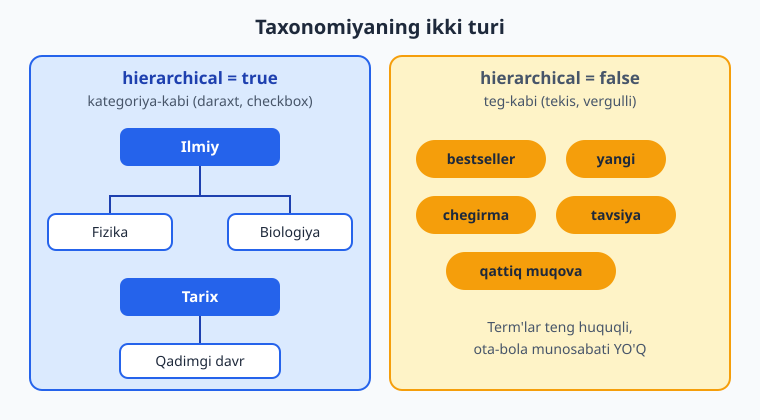
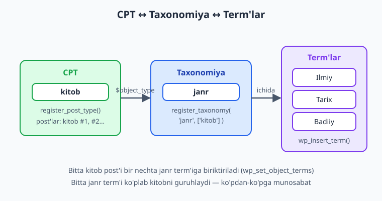
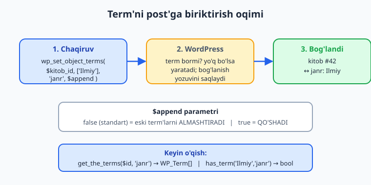

# 08 — Taxonomiyalar

[⬅️ Oldingi: 07 — Custom Post Type'lar](./07-custom-post-types.md) · [🏠 README](./README.md) · [Keyingi: 09 — Meta box va custom fields ➡️](./09-meta-box-custom-fields.md)

> **Bu bobda:** kontentni guruhlash va tasniflash uchun o'z **taxonomiya**laringizni `register_taxonomy()` bilan ro'yxatdan o'tkazishni — ierarxik (kategoriya-kabi daraxt) va tekis (teg-kabi) farqini, namuna plugin uchun `kitob` CPT'iga `janr` va `kitob_teg` taxonomiyalarini ulashni, `wp_insert_term`/`get_terms`/`wp_set_object_terms`/`get_the_terms`/`has_term` bilan **term**lar ustida ishlashni, admin'da ustun va filtr ko'rsatishni hamda mavjud taxonomiyani `register_taxonomy_for_object_type` bilan CPT'ga qo'shishni — boshidan oxirigacha o'rganasiz.

---

## Muammo: post'lar ko'p, ularni qanday tartibga solamiz?

07-bobda biz `kitob` Custom Post Type'ini yaratdik. Endi katalogimizda yuzlab kitob bor. Foydalanuvchi "barcha ilmiy kitoblarni ko'rsat" desa, yoki admin "faqat tarixiy kitoblarni tahrirlamoqchiman" desa — nima qilamiz? Har bir kitobning sarlavhasidan qidirishmi? Bu ishlamaydi.

WordPress'da kontentni **guruhlash va tasniflash** uchun maxsus mexanizm bor — u **taxonomy** (taksonomiya) deb ataladi. Aslida siz uni har kuni ishlatasiz: oddiy post'lardagi **Category** (rukn) va **Tag** (teg) — bular WordPress yadrosiga o'rnatilgan ikkita standart taxonomiya, xolos.

> 📌 **Taxonomiya — bu post'larni guruhlash tizimi.** Bitta taxonomiya ichida ko'plab **term** (atama) bo'ladi. Masalan `janr` taxonomiyasi, uning term'lari: "Ilmiy", "Tarix", "Badiiy". Har bir kitob bir yoki bir nechta term'ga tegishli bo'lishi mumkin.

Atamalarni aralashtirmaylik:

- **Taxonomiya (taxonomy)** — tasniflash *tizimi*. Misol: `category`, `post_tag`, bizning `janr`.
- **Term (atama)** — taxonomiya ichidagi *bitta qiymat*. Misol: "Ilmiy", "Texnologiya".
- **Object** — taxonomiya bog'langan *narsa*. Odatda post (yoki CPT, yoki foydalanuvchi).

Standart `category` va `post_tag` bizga yetmaydi: ular `post` turiga bog'langan va ma'noviy jihatdan kitob janri uchun mos emas. Shuning uchun biz **o'z taxonomiyamiz**ni yaratamiz.



---

## Ierarxik vs tekis: ikki xil taxonomiya

`register_taxonomy()`'ning eng muhim argumenti — `hierarchical`. U taxonomiyaning butun xulq-atvorini belgilaydi:

- **`hierarchical => true`** — **kategoriya-kabi**. Term'lar ota-bola munosabatida daraxt hosil qiladi (masalan "Ilmiy" ostida "Fizika", "Biologiya"). Admin'da **checkbox** ro'yxati bilan ko'rinadi. Bizning **janr** uchun mos.
- **`hierarchical => false`** (standart) — **teg-kabi**. Term'lar tekis, ota-bolasi yo'q. Admin'da **erkin matn maydoni** (vergul bilan ajratilgan) bilan ko'rinadi. Bizning **kitob teglari** ("bestseller", "yangi", "chegirmada") uchun mos.

> 💡 Tanlash mezoni sodda: agar term'lar bir-birining ichiga joylashadi (ota/bola) — `hierarchical => true`. Agar ular faqat "yorliq" bo'lib, teng huquqli bo'lsa — `false`. `hierarchical`ning standart qiymati `false` (rasmiy hujjat: "Default false").

⚠️ `hierarchical`ni keyinroq o'zgartirsangiz, allaqachon kiritilgan term'lar yo'qolmaydi, lekin admin UI va URL tuzilishi o'zgaradi — buni loyihaning boshida hal qiling.

---

## `register_taxonomy()` — sintaksis va imzo

Rasmiy imzo (developer.wordpress.org Code Reference bilan tasdiqlangan):

```php
register_taxonomy(
    string       $taxonomy,     // taxonomiya nomi (kalit, <= 32 belgi, kichik harf/raqam/_)
    array|string $object_type,  // qaysi post turi(lari)ga bog'lanadi: 'kitob' yoki ['kitob','post']
    array|string $args = array() // sozlamalar
): WP_Taxonomy|WP_Error
```

> ⚠️ **Argument tartibiga DIQQAT.** Ko'p odam `register_post_type()` bilan adashtiradi. Yodda tuting: `register_taxonomy()`'da **birinchi** — taxonomiya nomi, **ikkinchi** — qaysi CPT'ga bog'lanishi (`$object_type`), uchinchi — `$args`. CPT registratsiyasida esa birinchi — post turi nomi.

Taxonomiya `init` hook'ida ro'yxatdan o'tkaziladi (hujjat aniq aytadi: "Do not use before the 'init' hook"). CPT bilan **bir xil** `init` hook'ida — odatda CPT'dan keyin yoki yonida — chaqiriladi.

### Eng muhim `$args` kalitlari

| Kalit | Vazifa |
|---|---|
| `labels` | Admin'dagi barcha matnlar (nom, "Yangi qo'shish", ...). |
| `hierarchical` | `true` = daraxt (checkbox), `false` = tekis (teg). Standart `false`. |
| `public` | Taxonomiyani ommaga ko'rsatish (frontend so'rovlari + admin UI). |
| `publicly_queryable` | Frontend'da `?janr=ilmiy` kabi so'rovga ruxsat. |
| `show_ui` | Admin'da tahrirlash interfeysini ko'rsatish. |
| `show_in_menu` | Admin menyusida ko'rsatish (`show_ui`ga tayanadi). |
| `show_in_rest` | **REST API + blok muharririda** ko'rsatish. Gutenberg'da panelda chiqishi uchun **shart**. |
| `show_admin_column` | Post ro'yxati jadvalida alohida **ustun** chiqaradi. |
| `show_tagcloud` | Teglar buluti vidjetida ko'rsatish. |
| `rewrite` | URL slug'i: `['slug' => 'janr']`. `false` — chiroyli URL o'chadi. |
| `query_var` | URL so'rov o'zgaruvchisi (`?janr=...`). |
| `capabilities` | Term'larni boshqarish uchun ruxsatlar (rol/cap). |
| `default_term` | Bo'sh post uchun avtomatik biriktiriladigan standart term. |
| `meta_box_cb` | Tahrirlash sahifasidagi meta box'ning callback'i (`false` — yashiradi). |

> 📌 **`show_in_rest => true` ni unutmang.** Blok muharririda (Gutenberg) taxonomiya paneli ko'rinishi va REST orqali term'larni o'qish-yozish uchun bu shart. 2026'da deyarli har doim `true` qo'yiladi.

---

## Namuna: `janr` taxonomiyasini `kitob` CPT'iga ulash

Endi kitob bo'ylab izchil namuna plugin'imizni — **Kitoblar katalogi** (`Oqil\KitobKatalog` namespace, `kitoblar-katalogi` text domain) — kengaytiramiz. `kitob` CPT'iga ierarxik **janr** taxonomiyasini qo'shamiz.

```php
<?php
namespace Oqil\KitobKatalog;

/**
 * janr taxonomiyasini ro'yxatdan o'tkazadi (ierarxik, kategoriya-kabi).
 */
function register_janr_taxonomy(): void {
    $labels = [
        'name'              => _x( 'Janrlar', 'taxonomy general name', 'kitoblar-katalogi' ),
        'singular_name'     => _x( 'Janr', 'taxonomy singular name', 'kitoblar-katalogi' ),
        'search_items'      => __( 'Janrlarni qidirish', 'kitoblar-katalogi' ),
        'all_items'         => __( 'Barcha janrlar', 'kitoblar-katalogi' ),
        'parent_item'       => __( 'Ota janr', 'kitoblar-katalogi' ),
        'parent_item_colon' => __( 'Ota janr:', 'kitoblar-katalogi' ),
        'edit_item'         => __( 'Janrni tahrirlash', 'kitoblar-katalogi' ),
        'update_item'       => __( 'Janrni yangilash', 'kitoblar-katalogi' ),
        'add_new_item'      => __( 'Yangi janr qo\'shish', 'kitoblar-katalogi' ),
        'new_item_name'     => __( 'Yangi janr nomi', 'kitoblar-katalogi' ),
        'menu_name'         => __( 'Janrlar', 'kitoblar-katalogi' ),
    ];

    $args = [
        'labels'            => $labels,
        'hierarchical'      => true,   // kategoriya-kabi daraxt
        'public'            => true,
        'show_ui'           => true,
        'show_in_menu'      => true,
        'show_in_rest'      => true,   // blok muharriri + REST uchun SHART
        'show_admin_column' => true,   // kitob ro'yxatida "Janrlar" ustuni
        'show_tagcloud'     => false,
        'query_var'         => true,
        'rewrite'           => [ 'slug' => 'janr' ],
    ];

    register_taxonomy( 'janr', [ 'kitob' ], $args );
}
add_action( 'init', __NAMESPACE__ . '\\register_janr_taxonomy' );
```

📌 E'tibor bering: `register_taxonomy( 'janr', [ 'kitob' ], $args )` — birinchi taxonomiya nomi, ikkinchi **qaysi CPT'ga** (`['kitob']`), uchinchi `$args`. Bog'lanish shu yerda — `$object_type` argumenti orqali — sodir bo'ladi.

> ⚠️ **Permalink'ni yangilang.** `rewrite` ishlashi uchun, plugin'ni aktivatsiya qilgandan so'ng **Sozlamalar → Doimiy havolalar (Permalinks)** sahifasini bir marta saqlang (yoki `flush_rewrite_rules()` ni faqat aktivatsiya hook'ida chaqiring — har `init`'da emas, chunki u qimmat). Bu — **o'z saytingizda** bajariladigan illustrativ qadam.



### Tekis teg taxonomiyasi ham qo'shamiz

Janr — daraxt. Lekin kitobga "bestseller", "yangi" kabi erkin yorliqlar ham kerak. Bu uchun tekis (`hierarchical => false`) taxonomiya yaratamiz:

```php
<?php
namespace Oqil\KitobKatalog;

/**
 * kitob_teg taxonomiyasini ro'yxatdan o'tkazadi (tekis, teg-kabi).
 */
function register_kitob_teg_taxonomy(): void {
    $args = [
        'labels'            => [
            'name'          => _x( 'Kitob teglari', 'taxonomy general name', 'kitoblar-katalogi' ),
            'singular_name' => _x( 'Kitob tegi', 'taxonomy singular name', 'kitoblar-katalogi' ),
            'add_new_item'  => __( 'Yangi teg qo\'shish', 'kitoblar-katalogi' ),
            'menu_name'     => __( 'Teglar', 'kitoblar-katalogi' ),
        ],
        'hierarchical'      => false,  // teg-kabi tekis ro'yxat
        'public'            => true,
        'show_in_rest'      => true,
        'show_admin_column' => true,
        'rewrite'           => [ 'slug' => 'kitob-teg' ],
    ];

    register_taxonomy( 'kitob_teg', [ 'kitob' ], $args );
}
add_action( 'init', __NAMESPACE__ . '\\register_kitob_teg_taxonomy' );
```

> 💡 Bitta `init` callback'ida CPT va ikkala taxonomiyani birga ro'yxatdan o'tkazsangiz ham bo'ladi. Muhimi — hammasi `init`'da ishlasin. Ko'p odam alohida funksiyalarga ajratadi (toza kod uchun).

---

## Mavjud taxonomiyani CPT'ga qo'shish

Ba'zan taxonomiya allaqachon ro'yxatdan o'tgan (sizniki yoki yadronikidir), va siz uni *boshqa* CPT'ga ham bog'lamoqchisiz. Buning uchun `register_taxonomy_for_object_type()` bor:

```php
register_taxonomy_for_object_type( string $taxonomy, string $object_type ): bool
```

Masalan, standart `post_tag` (oddiy teglar) ni `kitob` CPT'iga ham ishlatmoqchimiz:

```php
<?php
namespace Oqil\KitobKatalog;

function attach_post_tags_to_kitob(): void {
    register_taxonomy_for_object_type( 'post_tag', 'kitob' );
}
add_action( 'init', __NAMESPACE__ . '\\attach_post_tags_to_kitob' );
```

> ℹ️ `register_taxonomy_for_object_type()` mavjud taxonomiyaga *qo'shimcha* bog'lanish qo'shadi; muvaffaqiyatda `true` qaytaradi. Lekin u to'liq ishlashi uchun ham `init`'da chaqirilsin, va kerak bo'lsa `register_post_type($args['taxonomies'])` ro'yxatiga ham qo'shing — eng ishonchli yo'l shu funksiyani ishlatish.

---

## Term'lar bilan ishlash (kod orqali)

Admin'da term qo'shish — qulay, lekin plugin importi, migratsiya yoki avtomatlashtirish uchun term'larni **kod orqali** boshqarishni bilish shart. Mana asosiy funksiyalar.

### `wp_insert_term()` — yangi term qo'shish

Rasmiy imzo (Code Reference bilan tasdiqlangan):

```php
wp_insert_term(
    string       $term,           // term NOMI (masalan 'Ilmiy')
    string       $taxonomy,       // qaysi taxonomiyaga ('janr')
    array|string $args = array()  // description, parent, slug, alias_of
): array|WP_Error
```

> ⚠️ **Tartib: `term`, `taxonomy`, `args`.** Birinchi — *nom*, ikkinchi — *taxonomiya*. Adashtirmang.

Muvaffaqiyatda `['term_id' => int, 'term_taxonomy_id' => int]` massivini, xatoda `WP_Error` ni qaytaradi (masalan term allaqachon mavjud bo'lsa). Shuning uchun har doim natijani tekshiramiz:

```php
<?php
namespace Oqil\KitobKatalog;

/**
 * Plugin aktivatsiyasida boshlang'ich janrlarni yaratadi.
 * Faqat term mavjud bo'lmasagina qo'shadi (term_exists tekshiruvi).
 */
function seed_default_janrlar(): void {
    $janrlar = [ 'Ilmiy', 'Tarix', 'Badiiy', 'Texnologiya' ];

    foreach ( $janrlar as $nom ) {
        // term_exists() term bor-yo'qligini tekshiradi (takror oldini olamiz)
        if ( ! term_exists( $nom, 'janr' ) ) {
            $natija = wp_insert_term( $nom, 'janr' );

            if ( is_wp_error( $natija ) ) {
                // WP_Error -> log; soxta natija yozmaymiz
                error_log( 'janr term xatosi: ' . $natija->get_error_message() );
                continue;
            }
            // $natija['term_id'] endi yangi term ID'si
        }
    }
}
```

Ota-bola (ierarxik) term qo'shish — `parent` argumenti orqali:

```php
$ilmiy = wp_insert_term( 'Ilmiy', 'janr' );

if ( ! is_wp_error( $ilmiy ) ) {
    // 'Fizika' ni 'Ilmiy' ostiga joylashtiramiz
    wp_insert_term( 'Fizika', 'janr', [
        'parent'      => $ilmiy['term_id'],
        'description' => 'Fizikaga oid kitoblar',
        'slug'        => 'fizika',
    ] );
}
```

### `get_terms()` — term'larni olish

Zamonaviy imzo (4.5.0'dan beri) — **bitta `$args` massivi**, taxonomiya esa `'taxonomy'` kaliti orqali beriladi (rasmiy hujjat shuni tavsiya qiladi):

```php
get_terms( array|string $args = array(), array|string $deprecated = '' ): array|int|string|WP_Error
```

```php
<?php
namespace Oqil\KitobKatalog;

// Barcha janrlarni olamiz (bo'sh bo'lganlari ham)
$janrlar = get_terms( [
    'taxonomy'   => 'janr',
    'hide_empty' => false,   // bironta kitob bog'lanmagan janrni ham ko'rsat
    'orderby'    => 'name',
    'order'      => 'ASC',
] );

if ( ! is_wp_error( $janrlar ) ) {
    foreach ( $janrlar as $term ) {
        // $term -> WP_Term obyekti: term_id, name, slug, count, parent ...
        printf(
            '<li>%s (%d ta kitob)</li>',
            esc_html( $term->name ),
            (int) $term->count
        );
    }
}
```

> 📌 **Eski usuldan voz keching.** `get_terms( 'janr', $args )` (taxonomiya birinchi argument sifatida) — **eskirgan** (4.5.0'gacha bo'lgan). Yangi kodda har doim `'taxonomy' => 'janr'` ni `$args` ichida bering.

Foydali `$args` kalitlari: `hide_empty` (standart `true`), `orderby` (`name`/`count`/`term_id`), `order`, `number` (chegara), `parent`, `child_of`, `slug`, `include`, `exclude`.

### `wp_set_object_terms()` — post'ga term biriktirish

Bu — eng muhim funksiya: kitobni janr(lar)ga **bog'laydi**.

```php
wp_set_object_terms(
    int                 $object_id,  // post (kitob) ID'si
    string|int|array    $terms,      // term: ID, nom/slug yoki ularning massivi
    string              $taxonomy,   // 'janr'
    bool                $append = false // false=almashtir, true=qo'sh
): array|WP_Error
```

> ⚠️ **`$append`ga DIQQAT.** Standart `false` — mavjud term'lar **almashtiriladi** (eskirari olib tashlanadi). `true` — yangilari **qo'shiladi**, eskilari qoladi. Noto'g'ri qiymat bog'lanishlarni ovsiz o'chirib yuborishi mumkin.

```php
<?php
namespace Oqil\KitobKatalog;

$kitob_id = 42;

// Kitobga ikkita janr biriktiramiz (oldingilari almashtiriladi)
$natija = wp_set_object_terms( $kitob_id, [ 'Ilmiy', 'Texnologiya' ], 'janr' );

if ( is_wp_error( $natija ) ) {
    error_log( 'Term biriktirishda xato: ' . $natija->get_error_message() );
}

// Mavjudlariga qo'shimcha biriktirish (almashtirmasdan): $append = true
wp_set_object_terms( $kitob_id, [ 'Tarix' ], 'janr', true );
```

> 💡 `$terms` ga **nom** ham, **slug** ham, **term_id** ham berish mumkin. Agar nom/slug bo'yicha term hali mavjud bo'lmasa — WordPress uni avtomatik yaratadi (juda qulay import uchun).

### `get_the_terms()` va `has_term()` — o'qish va tekshirish

`get_the_terms()` — bitta post'ning term'larini oladi:

```php
get_the_terms( int|WP_Post $post, string $taxonomy ): WP_Term[]|false|WP_Error
```

```php
<?php
namespace Oqil\KitobKatalog;

$janrlar = get_the_terms( $kitob_id, 'janr' );

// false = term yo'q; WP_Error = xato; shu sababli ikkalasini tekshiramiz
if ( $janrlar && ! is_wp_error( $janrlar ) ) {
    $nomlar = wp_list_pluck( $janrlar, 'name' ); // faqat nomlar massivi
    echo esc_html( implode( ', ', $nomlar ) );
}
```

`has_term()` — post berilgan term'ga tegishlimi (shartli mantiq uchun):

```php
has_term( string|int|array $term = '', string $taxonomy = '', int|WP_Post|null $post = null ): bool
```

```php
<?php
namespace Oqil\KitobKatalog;

// Joriy kitob "Ilmiy" janriga tegishlimi?
if ( has_term( 'Ilmiy', 'janr', $kitob_id ) ) {
    echo '<span class="badge">Ilmiy nashr</span>';
}

// Bir nechta term'dan biri bormi (massiv)?
if ( has_term( [ 'Ilmiy', 'Texnologiya' ], 'janr' ) ) {
    // joriy post'da (loop ichida) tekshiradi
}
```



---

## CPT bilan to'liq bog'lanish va admin ko'rinishi

`show_admin_column => true` qo'yganimiz uchun, **o'z saytingizda** kitob ro'yxati jadvalida avtomatik **"Janrlar"** ustuni paydo bo'ladi (alohida kod yozish shart emas). Bu — illustrativ natija; uni wp-admin'da ko'rasiz.

Ierarxik taxonomiyada (`janr`) WordPress yuqorida **filtr dropdown**ini ham avtomatik chiqaradi. Tekis taxonomiya (`kitob_teg`) uchun esa filtr avtomatik kelmaydi — uni `restrict_manage_posts` hook'i bilan qo'shamiz:

```php
<?php
namespace Oqil\KitobKatalog;

/**
 * kitob ro'yxati ustida kitob_teg taxonomiyasi uchun filtr dropdown qo'shadi.
 */
function add_kitob_teg_filter( string $post_type ): void {
    if ( 'kitob' !== $post_type ) {
        return;
    }

    $taxonomy = 'kitob_teg';
    $tanlangan = isset( $_GET[ $taxonomy ] )
        ? sanitize_key( wp_unslash( $_GET[ $taxonomy ] ) )
        : '';

    $terms = get_terms( [ 'taxonomy' => $taxonomy, 'hide_empty' => false ] );

    if ( is_wp_error( $terms ) || empty( $terms ) ) {
        return;
    }

    echo '<select name="' . esc_attr( $taxonomy ) . '">';
    echo '<option value="">' . esc_html__( 'Barcha teglar', 'kitoblar-katalogi' ) . '</option>';

    foreach ( $terms as $term ) {
        printf(
            '<option value="%s"%s>%s</option>',
            esc_attr( $term->slug ),
            selected( $tanlangan, $term->slug, false ),
            esc_html( $term->name )
        );
    }

    echo '</select>';
}
add_action( 'restrict_manage_posts', __NAMESPACE__ . '\\add_kitob_teg_filter' );
```

> 💡 `$_GET`'dan o'qiganda **doim** `wp_unslash()` + sanitize (`sanitize_key`) ishlatamiz — 12-bobda xavfsizlik chuqur ochiladi. `selected()` esa tanlangan optionga `selected` atributini xavfsiz qo'yadi.

Ierarxik taxonomiya admin'da daraxt-checkbox bilan, tekis taxonomiya esa vergulli matn maydoni bilan ko'rinadi — bu farqni siz wp-admin'da kitob tahrirlash sahifasida ko'rasiz (illustrativ).

---

## Xulosa

- **Taxonomiya** — post'larni guruhlash tizimi; uning ichidagi qiymatlar — **term**. Standartlari: `category`, `post_tag`.
- `register_taxonomy( $taxonomy, $object_type, $args )` ni **`init`** hook'ida chaqiring. Argument tartibi: nom, qaysi CPT, args.
- `hierarchical => true` — daraxt (kategoriya-kabi, checkbox); `false` (standart) — tekis (teg-kabi).
- `show_in_rest => true` — blok muharriri va REST uchun shart; `show_admin_column => true` — ro'yxatda ustun.
- Term funksiyalari: `wp_insert_term($term, $taxonomy, $args)`, `get_terms(['taxonomy'=>...])`, `wp_set_object_terms($id, $terms, $taxonomy, $append)`, `get_the_terms($post, $taxonomy)`, `has_term($term, $taxonomy, $post)`.
- `$append` standart `false` — almashtiradi; `true` — qo'shadi. `WP_Error`ni har doim `is_wp_error()` bilan tekshiring.
- `register_taxonomy_for_object_type($taxonomy, $object_type)` — mavjud taxonomiyani CPT'ga qo'shadi.

Keyingi bobda har bir kitobga "muallif", "ISBN", "sahifalar soni" kabi **maxsus maydonlar** qo'shamiz — **meta box** va **custom fields**.

---

## 08-bob mashqlari

> Mashqlarni o'zingiz bajaring. Kodni mktemp faylda `php -l` bilan, mantiqni **o'z WordPress saytingizda** (02-bobdagi `wp-env`) sinab ko'ring. Har bir CPT/taxonomiya `init`'da ro'yxatdan o'tsin.

**1. (Oson)** `register_taxonomy()`'ning birinchi va ikkinchi argumenti nima? `register_post_type()`'dan farqini bitta jumlada ayting.

**2. (Oson)** `hierarchical => true` va `hierarchical => false` admin interfeysida qanday ko'rinadi? Har biriga bittadan misol term keltiring.

**3. (Oson)** `show_in_rest => true` nima uchun kerak? Uni `false` qo'ysangiz blok muharririda nima yo'qoladi?

**4. (Oson)** Quyidagi qatordagi xatoni toping: `register_taxonomy( ['kitob'], 'janr', $args );`. To'g'risini yozing.

**5. (O'rta)** `kitob` CPT'iga `nashriyot` nomli **ierarxik** taxonomiya yarating (slug `nashriyot`, REST'da ko'rinsin, admin ustuni bo'lsin).

<details markdown="1"><summary>Yechim</summary>

```php
<?php
namespace Oqil\KitobKatalog;

function register_nashriyot_taxonomy(): void {
    register_taxonomy( 'nashriyot', [ 'kitob' ], [
        'labels'            => [
            'name'          => _x( 'Nashriyotlar', 'taxonomy general name', 'kitoblar-katalogi' ),
            'singular_name' => _x( 'Nashriyot', 'taxonomy singular name', 'kitoblar-katalogi' ),
            'menu_name'     => __( 'Nashriyotlar', 'kitoblar-katalogi' ),
        ],
        'hierarchical'      => true,
        'public'            => true,
        'show_in_rest'      => true,
        'show_admin_column' => true,
        'rewrite'           => [ 'slug' => 'nashriyot' ],
    ] );
}
add_action( 'init', __NAMESPACE__ . '\\register_nashriyot_taxonomy' );
```

`hierarchical => true` — daraxt; `show_in_rest` — Gutenberg paneli; `show_admin_column` — ro'yxat ustuni; `rewrite` — chiroyli URL (`/nashriyot/...`). Aktivatsiyadan keyin permalink'ni bir marta saqlang.
</details>

**6. (O'rta)** `wp_insert_term()` bilan `janr` taxonomiyasiga "Detektiv" term'ini qo'shing, lekin **avval `term_exists()` bilan tekshirib**, takrorlanishning oldini oling va `WP_Error`ni log qiling.

<details markdown="1"><summary>Yechim</summary>

```php
<?php
namespace Oqil\KitobKatalog;

function qoshish_detektiv(): void {
    if ( term_exists( 'Detektiv', 'janr' ) ) {
        return; // allaqachon bor
    }
    $natija = wp_insert_term( 'Detektiv', 'janr', [
        'description' => 'Detektiv janridagi kitoblar',
        'slug'        => 'detektiv',
    ] );
    if ( is_wp_error( $natija ) ) {
        error_log( 'Detektiv term: ' . $natija->get_error_message() );
        return;
    }
    // $natija['term_id'] -> yangi ID
}
```

`term_exists()` takrorni oldini oladi, `is_wp_error()` xatoni tutadi — soxta natija yozmaymiz.
</details>

**7. (O'rta)** `get_terms()` yordamida `janr` taxonomiyasining **barcha** term'larini (bo'sh bo'lganlarini ham), nom bo'yicha tartiblab oling va `<ul>` ro'yxat sifatida xavfsiz chiqaring.

<details markdown="1"><summary>Yechim</summary>

```php
<?php
namespace Oqil\KitobKatalog;

function janrlar_royxati(): string {
    $terms = get_terms( [
        'taxonomy'   => 'janr',
        'hide_empty' => false,
        'orderby'    => 'name',
        'order'      => 'ASC',
    ] );

    if ( is_wp_error( $terms ) || empty( $terms ) ) {
        return '';
    }

    $html = '<ul class="janrlar">';
    foreach ( $terms as $term ) {
        $html .= sprintf(
            '<li>%s (%d)</li>',
            esc_html( $term->name ),
            (int) $term->count
        );
    }
    return $html . '</ul>';
}
```

`'taxonomy' => 'janr'` — zamonaviy imzo. `esc_html()` — XSS himoyasi. `count` — shu term'dagi post soni.
</details>

**8. (O'rta)** `wp_set_object_terms()` bilan ID'si 10 bo'lgan kitobni "Ilmiy" va "Texnologiya" janrlariga biriktiring. So'ng `$append = true` bilan "Tarix" ni **qo'shimcha** biriktiring. `$append` ikkala holatda nima qiladi?

<details markdown="1"><summary>Yechim</summary>

```php
<?php
namespace Oqil\KitobKatalog;

$kitob_id = 10;

// $append = false (standart): mavjudlarni ALMASHTIRADI
wp_set_object_terms( $kitob_id, [ 'Ilmiy', 'Texnologiya' ], 'janr' );

// $append = true: mavjudlariga QO'SHADI (eskilari qoladi)
wp_set_object_terms( $kitob_id, [ 'Tarix' ], 'janr', true );
```

`false` (standart) — eski bog'lanishlar o'chadi, faqat berilganlari qoladi. `true` — eskilari saqlanadi, yangilari qo'shiladi. Natijada kitob 3 janrda.
</details>

**9. (O'rta)** `has_term()` va `get_the_terms()` farqini tushuntiring. Qaysi biri `bool`, qaysi biri obyektlar massivi qaytaradi? Har biriga bittadan foydalanish holati keltiring.

<details markdown="1"><summary>Yechim</summary>

- `has_term( $term, $taxonomy, $post )` -> **`bool`**. "Bu post 'Ilmiy' janridami?" kabi shartli mantiq uchun: `if ( has_term( 'Ilmiy', 'janr' ) ) { ... }`.
- `get_the_terms( $post, $taxonomy )` -> **`WP_Term[]|false|WP_Error`**. Post'ning barcha term'larini ro'yxatlash/ko'rsatish uchun: `$terms = get_the_terms( $id, 'janr' );` so'ng `foreach`.

`get_the_terms` `false` (term yo'q) yoki `WP_Error` qaytarishi mumkin — shuning uchun `if ( $terms && ! is_wp_error( $terms ) )` bilan ikkalasini tekshiring.
</details>

**10. (O'rta)** `register_taxonomy_for_object_type()` qachon kerak bo'ladi? Standart `category` taxonomiyasini `kitob` CPT'iga qo'shadigan kodni yozing.

<details markdown="1"><summary>Yechim</summary>

```php
<?php
namespace Oqil\KitobKatalog;

function kategoriyani_kitobga_ulash(): void {
    register_taxonomy_for_object_type( 'category', 'kitob' );
}
add_action( 'init', __NAMESPACE__ . '\\kategoriyani_kitobga_ulash' );
```

Bu funksiya **allaqachon ro'yxatdan o'tgan** taxonomiyani (yadronikidir yoki sizniki) boshqa post turiga qo'shganda kerak — qaytadan `register_taxonomy()` chaqirish shart bo'lmaganda. `init`'da, taxonomiya ro'yxatga olingach chaqiriladi.
</details>

**11. (Qiyin)** `janr` taxonomiyasiga **boshlang'ich term'lar** (Ilmiy, Tarix, Badiiy) ni faqat **plugin aktivatsiyasida** bir marta yaratadigan to'liq kod yozing. Takrorlanishni oldini oling, `WP_Error`ni log qiling. (Eslatma: aktivatsiya hook'ida taxonomiya hali ro'yxatda bo'lishi uchun avval uni qo'lda ro'yxatdan o'tkazing yoki `init`'ni chaqiring.)

<details markdown="1"><summary>Yechim</summary>

```php
<?php
namespace Oqil\KitobKatalog;

/**
 * Aktivatsiyada janr term'larini ekadi.
 * Taxonomiya init'da ro'yxatga olinadi; aktivatsiya hook'i admin so'rovi
 * davomida init'dan KEYIN ishlaydi, shuning uchun 'janr' allaqachon mavjud.
 */
function activate_seed_janrlar(): void {
    // Ehtiyot uchun taxonomiya borligini tekshiramiz
    if ( ! taxonomy_exists( 'janr' ) ) {
        register_janr_taxonomy(); // o'sha init callback'imiz
    }

    $boshlangich = [ 'Ilmiy', 'Tarix', 'Badiiy' ];
    foreach ( $boshlangich as $nom ) {
        if ( term_exists( $nom, 'janr' ) ) {
            continue;
        }
        $natija = wp_insert_term( $nom, 'janr' );
        if ( is_wp_error( $natija ) ) {
            error_log( 'Seed janr xatosi: ' . $natija->get_error_message() );
        }
    }
}
// Asosiy plugin faylida:
register_activation_hook( __FILE__, __NAMESPACE__ . '\\activate_seed_janrlar' );
```

`taxonomy_exists()` + `register_janr_taxonomy()` — taxonomiyaning aktivatsiya paytida tayyor bo'lishini kafolatlaydi. `term_exists()` + `is_wp_error()` — xavfsiz ekish. Bu **o'z saytingizda** aktivatsiyada bir marta ishlaydi.
</details>

**12. (Qiyin)** Tekis `kitob_teg` taxonomiyasi uchun `restrict_manage_posts` bilan admin filtr dropdown qo'shing (faqat `kitob` ro'yxatida), tanlangan qiymatni xavfsiz o'qing va `selected()` bilan belgilang.

<details markdown="1"><summary>Yechim</summary>

```php
<?php
namespace Oqil\KitobKatalog;

function kitob_teg_filtri( string $post_type ): void {
    if ( 'kitob' !== $post_type ) {
        return;
    }
    $tax = 'kitob_teg';
    $tanlangan = isset( $_GET[ $tax ] )
        ? sanitize_key( wp_unslash( $_GET[ $tax ] ) )
        : '';

    $terms = get_terms( [ 'taxonomy' => $tax, 'hide_empty' => false ] );
    if ( is_wp_error( $terms ) || empty( $terms ) ) {
        return;
    }

    echo '<select name="' . esc_attr( $tax ) . '">';
    echo '<option value="">' . esc_html__( 'Barcha teglar', 'kitoblar-katalogi' ) . '</option>';
    foreach ( $terms as $t ) {
        printf(
            '<option value="%s"%s>%s</option>',
            esc_attr( $t->slug ),
            selected( $tanlangan, $t->slug, false ),
            esc_html( $t->name )
        );
    }
    echo '</select>';
}
add_action( 'restrict_manage_posts', __NAMESPACE__ . '\\kitob_teg_filtri' );
```

`restrict_manage_posts` ro'yxat ustidagi filtr maydonida ishlaydi. `wp_unslash()`+`sanitize_key()` — xavfsiz input; `esc_attr`/`esc_html` — xavfsiz chiqish; `selected(...,...,false)` — `false` 3-argument matnni qaytaradi (echo qilmaydi). Filtr o'zi `WP_Query`'ni avtomatik filtrlaydi (taxonomiya query_var orqali).
</details>

**13. (Qiyin)** Bitta kitobning barcha `janr` term'larini, agar ota term bo'lsa "Ota > Bola" ko'rinishida, vergul bilan ajratib xavfsiz chiqaradigan funksiya yozing.

<details markdown="1"><summary>Yechim</summary>

```php
<?php
namespace Oqil\KitobKatalog;

function kitob_janrlari_yoli( int $kitob_id ): string {
    $terms = get_the_terms( $kitob_id, 'janr' );
    if ( ! $terms || is_wp_error( $terms ) ) {
        return '';
    }

    $qatorlar = [];
    foreach ( $terms as $term ) {
        $yol = [ $term->name ];
        $parent = $term->parent;
        // Ota zanjirini yuqoriga ko'tarilib yig'amiz
        while ( $parent ) {
            $ota = get_term( $parent, 'janr' );
            if ( is_wp_error( $ota ) || ! $ota ) {
                break;
            }
            array_unshift( $yol, $ota->name );
            $parent = $ota->parent;
        }
        $qatorlar[] = esc_html( implode( ' > ', $yol ) );
    }

    return implode( ', ', $qatorlar );
}
```

`get_the_terms()` post term'larini, `get_term( $id, $tax )` esa ota term'ni oladi. `while` orqali ota zanjirini yuqoriga ko'tarilamiz; `esc_html()` har bir nomni himoya qiladi. `false`/`WP_Error` ikkala holat tekshirilgan.
</details>

**14. (Qiyin)** `janr` taxonomiyasi bo'yicha frontend so'rovi yozing: faqat "Ilmiy" janridagi kitoblarni `WP_Query` + `tax_query` bilan oling va sarlavhalarini xavfsiz chiqaring.

<details markdown="1"><summary>Yechim</summary>

```php
<?php
namespace Oqil\KitobKatalog;

function ilmiy_kitoblar(): string {
    $q = new \WP_Query( [
        'post_type'      => 'kitob',
        'posts_per_page' => 10,
        'tax_query'      => [
            [
                'taxonomy' => 'janr',
                'field'    => 'slug',   // slug bo'yicha qidiramiz
                'terms'    => [ 'ilmiy' ],
            ],
        ],
    ] );

    if ( ! $q->have_posts() ) {
        return '<p>' . esc_html__( 'Kitob topilmadi.', 'kitoblar-katalogi' ) . '</p>';
    }

    $html = '<ul>';
    while ( $q->have_posts() ) {
        $q->the_post();
        $html .= '<li>' . esc_html( get_the_title() ) . '</li>';
    }
    wp_reset_postdata(); // global $post ni tiklash SHART
    return $html . '</ul>';
}
```

`tax_query` taxonomiya bo'yicha filtr; `field => 'slug'` + `terms => ['ilmiy']`. Loopdan keyin `wp_reset_postdata()` global `$post`ni tiklaydi (unutilsa keyingi loop'lar buziladi). `query_posts()` ishlatmang — `WP_Query` afzal.
</details>

**15. (Qiyin)** Plugin **deaktivatsiyasi**da taxonomiyani tozalash kerakmi? `flush_rewrite_rules()` qachon va qayerda chaqirilishi kerak? Tushuntiring va kod skeletini yozing.

<details markdown="1"><summary>Yechim</summary>

```php
<?php
namespace Oqil\KitobKatalog;

// AKTIVATSIYA: avval taxonomiya/CPT ro'yxatga olinsin, KEYIN rewrite flush
function activate(): void {
    register_janr_taxonomy();       // taxonomiyani ro'yxatga olamiz
    register_kitob_teg_taxonomy();
    flush_rewrite_rules();          // chiroyli URL'lar yangilanadi (QIMMAT, faqat shu yerda)
}
register_activation_hook( __FILE__, __NAMESPACE__ . '\\activate' );

// DEAKTIVATSIYA: rewrite qoidalarini tozalaymiz
function deactivate(): void {
    flush_rewrite_rules();
}
register_deactivation_hook( __FILE__, __NAMESPACE__ . '\\deactivate' );
```

`flush_rewrite_rules()` **qimmat** — faqat aktivatsiya/deaktivatsiyada chaqiriladi, **hech qachon** `init`'da har so'rovda emas. Taxonomiya **term'lari**ni odatda deaktivatsiyada o'chirmaymiz (foydalanuvchi ma'lumotini yo'qotmaslik uchun) — to'liq tozalash faqat `uninstall.php`'da, ataylab qilinadi. Bu — **o'z saytingizda** aktivatsiyada sinaladi.
</details>

---

[⬅️ Oldingi: 07 — Custom Post Type'lar](./07-custom-post-types.md) · [🏠 README](./README.md) · [Keyingi: 09 — Meta box va custom fields ➡️](./09-meta-box-custom-fields.md)
