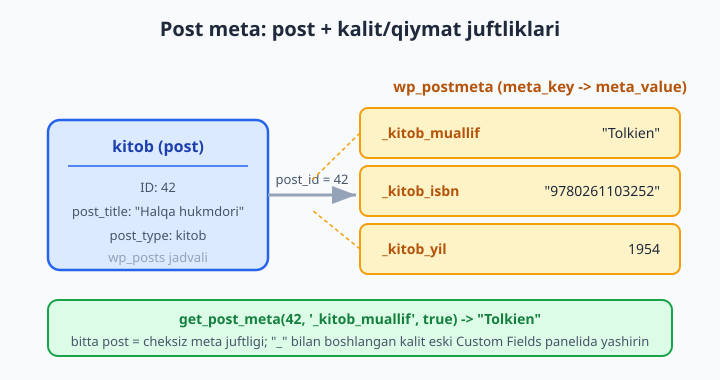
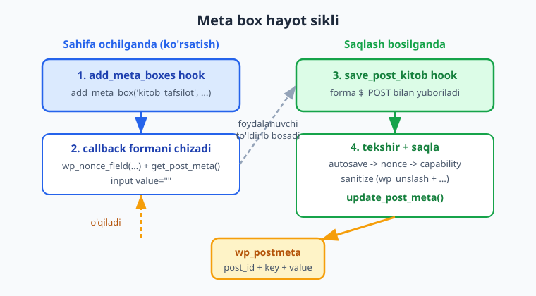
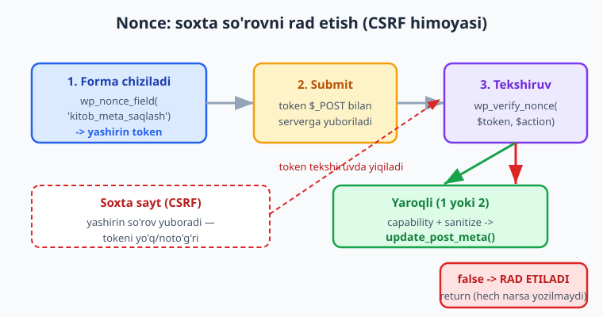

# 09 — Meta box va custom fields

[⬅️ Oldingi: 08 — Taxonomiyalar](./08-taxonomiyalar.md) · [🏠 README](./README.md) · [Keyingi: 10 — Ma'lumotlar bazasi: $wpdb, options, transients ➡️](./10-malumotlar-bazasi.md)

> **Bu bobda:** post'ga qo'shimcha tuzilgan ma'lumot biriktirishni — `kitob` CPT'ga muallif, ISBN va nashr yili kabi maydonlarni — o'rganasiz: `add_meta_box` bilan tahrirlash sahifasiga forma chiqarish, `save_post_{cpt}` hook'ida `update_post_meta` orqali xavfsiz saqlash (nonce + `current_user_can` + autosave tekshiruvi + sanitize + escape — bularning HAR BIRI majburiy), `get_post_meta`/`update_post_meta`/`delete_post_meta` bilan ishlash, va `register_post_meta` orqali meta'ni REST API hamda blok muharririga ochish (zamonaviy yo'l) — oxirida custom fields va ACF qisqa taqqoslanadi.

---

## Muammo: post'ga "qo'shimcha qadoq" kerak

07-bobda `kitob` Custom Post Type'ini yaratdik, 08-bobda unga `janr` taxonomiyasini bog'ladik. Lekin haqiqiy kitobning **muallifi**, **ISBN** raqami, **nashr yili** va **narxi** bor. Bularni qayerga yozamiz?

- Sarlavha — `post_title`. Tavsif — `post_content`. Janr — taxonomiya. Bular tayyor.
- Ammo "muallif" — bu na sarlavha, na taksonomiya. Bu post'ga **biriktirilgan qo'shimcha qiymat**.

WordPress'da bunday qiymatlar **post meta** (custom fields) deb ataladi. Har bir post'ga cheksiz miqdorda `kalit → qiymat` juftliklarini biriktirish mumkin. Tasavvur qiling: post — bu paket, meta — paketga yopishtirilgan **stikerlar** ("Muallif: Anvar", "ISBN: 978...", "Yil: 2026").

📌 **Post meta `wp_postmeta` jadvalida saqlanadi.** Har bir juftlik alohida qator: `post_id`, `meta_key`, `meta_value`. Shuning uchun bitta post'ning o'nlab meta'si bo'lishi mumkin.



Endi savol — bu meta'ni admin foydalanuvchi qanday **kiritadi**? Tahrirlash sahifasida unga forma kerak. Aynan shu yerda **meta box** keladi.

---

## Meta box nima?

Post tahrirlash sahifasini ochsangiz — sarlavha, kontent muharriri (blok muharriri), o'ng tomonda "Publish", "Kategoriyalar", "Teglar" qutilarini ko'rasiz. Ana shu **qutilarning har biri — meta box**. WordPress yadrosining o'zi ham meta box'lardan foydalanadi.

Biz ham o'z qutimizni qo'shamiz: "Kitob tafsilotlari" deb nomlangan, ichida muallif/ISBN/yil maydonlari bo'lgan forma.

Meta box ikki bo'lakdan iborat:

1. **Ro'yxatdan o'tkazish** — `add_meta_box()` chaqirig'i (qachon, qayerda, qaysi funksiya formani chizadi).
2. **Saqlash** — forma yuborilganda kiritilgan qiymatlarni `wp_postmeta`'ga yozish.

Eng muhim haqiqat: meta box **avtomatik saqlamaydi**. `add_meta_box` faqat forma **ko'rsatadi**. Saqlashni siz `save_post` hook'ida qo'lda yozasiz. Boshlovchilar shu yerda qoqiladi.



---

## `add_meta_box` imzosi

```php
add_meta_box(
    string $id,                    // qutining HTML id'si (noyob)
    string $title,                 // foydalanuvchi ko'radigan sarlavha
    callable $callback,            // formani echo qiluvchi funksiya
    string|array|WP_Screen $screen = null,  // qaysi ekran(lar): 'kitob', 'post'...
    string $context = 'advanced',  // 'normal' | 'side' | 'advanced'
    string $priority = 'default',  // 'high' | 'core' | 'default' | 'low'
    array $callback_args = null    // callback'ga $args sifatida uzatiladi
);
```

`add_meta_box` ni **`add_meta_boxes` action** ichida chaqirish kerak — bu hook tahrirlash ekrani yig'ilayotganda ishga tushadi.

- `$context` — qutining joyi: `'normal'` (kontent ostida, keng), `'side'` (o'ng ustun, tor), `'advanced'` (normal ostida).
- `$priority` — bir kontekst ichidagi tartib: `'high'` yuqorida, `'low'` pastda.
- `$callback` — formani **echo** qiladigan funksiya. Unga birinchi argument sifatida joriy `WP_Post` obyekti keladi.

ℹ️ Imzo developer.wordpress.org Code Reference bilan tasdiqlangan: `add_meta_box( $id, $title, $callback, $screen, $context, $priority, $callback_args )`.

### Eng oddiy meta box (yon ustunda eslatma)

Avval kichik, prefiks'li (`kk_`) misol — yon ustunda bitta `textarea`:

```php
add_action( 'add_meta_boxes', 'kk_oddiy_meta_box' );

function kk_oddiy_meta_box(): void {
	add_meta_box(
		'kk_eslatma',                 // ID
		'Tahrirchi eslatmasi',        // sarlavha
		'kk_eslatma_render',          // callback
		'kitob',                      // faqat 'kitob' CPT ekranida
		'side'                        // o'ng ustun
	);
}

function kk_eslatma_render( $post ): void {
	$qiymat = get_post_meta( $post->ID, '_kk_eslatma', true );
	echo '<textarea name="kk_eslatma" rows="3" class="widefat">'
		. esc_textarea( $qiymat ) . '</textarea>';
}
```

Diqqat: chiqishni `esc_textarea()` bilan **escape** qildik — meta'da kiritilgan matn `</textarea>` kabi belgilar saqlasa, ularni "sindirib" XSS qilmasligi uchun. Lekin bu misol hali **saqlamaydi** — keyingi bo'limda to'liq, xavfsiz versiyani yozamiz.

---

## To'liq, xavfsiz meta box: `kitob` tafsilotlari

Endi izchil namuna plugin'imizning haqiqiy qismini quramiz. Namespace `Oqil\KitobKatalog`, text domain `kitoblar-katalogi`. Meta kalitlarni `_` bilan boshlaymiz (masalan `_kitob_muallif`) — pastki chiziq bilan boshlangan meta kalit WordPress'ning eski "Custom Fields" panelida **yashirin** bo'ladi (faqat bizning meta box'imiz orqali tahrirlanadi).

### 1-qism: formani ro'yxatdan o'tkazish va chizish

```php
namespace Oqil\KitobKatalog;

// Meta box'larni ro'yxatdan o'tkazish
add_action( 'add_meta_boxes', __NAMESPACE__ . '\\add_kitob_meta_box' );

function add_kitob_meta_box(): void {
	add_meta_box(
		'kitob_tafsilot',                                 // ID
		__( 'Kitob tafsilotlari', 'kitoblar-katalogi' ),  // sarlavha
		__NAMESPACE__ . '\\render_kitob_meta_box',        // callback
		'kitob',                                          // ekran (CPT slug)
		'normal',                                         // kontekst
		'high'                                            // prioritet
	);
}

function render_kitob_meta_box( \WP_Post $post ): void {
	// Nonce maydonini chiqaramiz (CSRF himoyasi) — pastda batafsil
	wp_nonce_field( 'kitob_meta_saqlash', 'kitob_meta_nonce' );

	// Mavjud qiymatlarni o'qiymiz
	$muallif = get_post_meta( $post->ID, '_kitob_muallif', true );
	$isbn    = get_post_meta( $post->ID, '_kitob_isbn', true );
	$yil     = get_post_meta( $post->ID, '_kitob_yil', true );
	?>
	<p>
		<label for="kitob_muallif"><strong><?php esc_html_e( 'Muallif', 'kitoblar-katalogi' ); ?></strong></label><br>
		<input type="text" id="kitob_muallif" name="kitob_muallif"
		       value="<?php echo esc_attr( $muallif ); ?>" class="widefat">
	</p>
	<p>
		<label for="kitob_isbn"><strong><?php esc_html_e( 'ISBN', 'kitoblar-katalogi' ); ?></strong></label><br>
		<input type="text" id="kitob_isbn" name="kitob_isbn"
		       value="<?php echo esc_attr( $isbn ); ?>" class="widefat">
	</p>
	<p>
		<label for="kitob_yil"><strong><?php esc_html_e( 'Nashr yili', 'kitoblar-katalogi' ); ?></strong></label><br>
		<input type="number" id="kitob_yil" name="kitob_yil"
		       value="<?php echo esc_attr( (string) $yil ); ?>" min="0" max="2100">
	</p>
	<?php
}
```

Bu yerda allaqachon ikki xavfsizlik qoidasi bor:

- ⚠️ **Escape (chiqishda).** Har bir qiymatni HTML atributiga qo'yganda `esc_attr()` ishlatdik. Meta'da `" onmouseover="alert(1)` kabi qiymat saqlangan bo'lsa, escape'siz u atributdan "chiqib ketib" XSS qiladi. `esc_attr` uni xavfsiz qiladi.
- 📌 **`wp_nonce_field()`** formaga yashirin xavfsizlik tokeni qo'shadi. Bu — keyingi qadam (saqlash) uchun "bu forma haqiqatan bizning saytimizdan yuborildi" deb tasdiqlash usuli.

### 2-qism: xavfsiz saqlash

Endi eng muhim qism. Forma yuborilganda WordPress `save_post` (va `save_post_{cpt}`) hook'ini ishga tushiradi. Biz aynan `save_post_kitob` ga ulanmiz — u faqat `kitob` post turi saqlanganda chaqiriladi, shuning uchun ortiqcha "bu kitobmi?" tekshiruvi kerak emas.

```php
namespace Oqil\KitobKatalog;

// Saqlash — faqat 'kitob' CPT uchun. accepted_args=2: $post_id va $post
add_action( 'save_post_kitob', __NAMESPACE__ . '\\save_kitob_meta', 10, 2 );

function save_kitob_meta( int $post_id, \WP_Post $post ): void {
	// 1. Autosave/revisiyani o'tkazib yuboramiz
	if ( wp_is_post_autosave( $post_id ) || wp_is_post_revision( $post_id ) ) {
		return;
	}

	// 2. Nonce tekshiruvi (CSRF himoyasi)
	if ( ! isset( $_POST['kitob_meta_nonce'] )
	     || ! wp_verify_nonce( sanitize_key( $_POST['kitob_meta_nonce'] ), 'kitob_meta_saqlash' ) ) {
		return;
	}

	// 3. Ruxsat tekshiruvi
	if ( ! current_user_can( 'edit_post', $post_id ) ) {
		return;
	}

	// 4. Sanitize + saqlash
	if ( isset( $_POST['kitob_muallif'] ) ) {
		$muallif = sanitize_text_field( wp_unslash( $_POST['kitob_muallif'] ) );
		update_post_meta( $post_id, '_kitob_muallif', $muallif );
	}

	if ( isset( $_POST['kitob_isbn'] ) ) {
		$isbn = sanitize_text_field( wp_unslash( $_POST['kitob_isbn'] ) );
		update_post_meta( $post_id, '_kitob_isbn', $isbn );
	}

	if ( isset( $_POST['kitob_yil'] ) ) {
		$yil = absint( $_POST['kitob_yil'] ); // 0 yoki musbat butun son
		if ( $yil > 0 ) {
			update_post_meta( $post_id, '_kitob_yil', $yil );
		} else {
			delete_post_meta( $post_id, '_kitob_yil' );
		}
	}
}
```

📌 **Saqlashning "to'rt darvozasi" — har biri majburiy:**

1. **Autosave/revisiya.** WordPress siz yozayotganda avtomatik saqlaydi (autosave) va har saqlashda eski nusxa (revision) yaratadi. Bu paytda `$_POST`'da forma maydonlari **bo'lmaydi**, shuning uchun ularni tekshirmasak — mavjud meta'ni **bo'sh qiymat bilan o'chirib yuborishimiz** mumkin. `wp_is_post_autosave()` va `wp_is_post_revision()` shundan himoya qiladi.
2. **Nonce.** Forma haqiqatan bizning saytimizdan kelganini tasdiqlaydi (CSRF). Pastda batafsil.
3. **Capability.** `current_user_can( 'edit_post', $post_id )` — bu foydalanuvchi aynan shu post'ni tahrirlash huquqiga egami? Bo'lmasa — to'xta.
4. **Sanitize.** Tashqaridan kelgan hech qaysi qiymatga ishonmaymiz. Matnni `sanitize_text_field()`, sonni `absint()` bilan tozalaymiz. `wp_unslash()` — WordPress `$_POST`'ga qo'shgan ortiqcha `\` slesh'larni olib tashlaydi (buni sanitize'dan **oldin** qilish kerak).

⚠️ **Bu to'rttasidan bittasi yo'q bo'lsa — plugin'ingiz zaif.** Nonce'siz meta box — eng keng tarqalgan WordPress zaifligi. Spec'da ham `add_meta_box` nonce'siz — ❌ eskirgan/xato amaliyot deb belgilangan.

---

## Nonce: soxta so'rovni qanday rad etadi

**Nonce** ("number used once") — formaga biriktiriladigan, harakatga va foydalanuvchiga bog'langan, vaqt bilan cheklangan xavfsizlik tokeni. Maqsadi — **CSRF** (Cross-Site Request Forgery) hujumini to'sish.

Tasavvur qiling: zararli sayt foydalanuvchiga "g'olib bo'ldingiz!" tugmasini ko'rsatadi, lekin u aslida sizning saytingizga yashirin forma yuboradi (foydalanuvchi sizning saytga login bo'lgan holatda). Nonce'siz bu so'rov o'tib ketadi. Nonce bilan — server "bu token mendan chiqmagan" deb **rad etadi**.



Ikki funksiya:

```php
// Formada — yashirin maydon chiqaradi:
wp_nonce_field( 'kitob_meta_saqlash', 'kitob_meta_nonce' );
//             ^ action (kontekst)    ^ maydon nomi

// Saqlashda — tekshiradi:
wp_verify_nonce( $nonce, $action );
// 1 = 0-12 soat oldin yaratilgan, 2 = 12-24 soat, false = yaroqsiz
```

Imzolar (docs bilan tasdiqlangan):

- `wp_nonce_field( int|string $action = -1, string $name = '_wpnonce', bool $referer = true, bool $display = true ): string`
- `wp_verify_nonce( string $nonce, string|int $action = -1 ): int|false`

💡 **Muqobil — `check_admin_referer()`.** Aksariyat admin formalar uchun qulayroq usul: u nonce'ni tekshiradi va yaroqsiz bo'lsa so'rovni **o'zi to'xtatadi** (`die`). Saqlashdagi nonce blokini shunday qisqartirsa bo'ladi:

```php
// wp_verify_nonce o'rniga (xohlasangiz):
if ( ! isset( $_POST['kitob_meta_nonce'] ) ) {
	return;
}
check_admin_referer( 'kitob_meta_saqlash', 'kitob_meta_nonce' );
// bu yergacha yetib kelsa — nonce yaroqli; aks holda WP avval to'xtatgan
```

Meta box'da `wp_verify_nonce` + `return` ko'proq ishlatiladi, chunki saqlash bir nechta hook bilan zanjir bo'lib ketishi mumkin va biz "jim qaytish" ni xohlaymiz. Ikkalasi ham to'g'ri.

---

## Meta'ni o'qish, yozish, o'chirish

Meta box'dan tashqarida ham (frontend shablon, REST callback, boshqa hook) meta bilan ishlaysiz. To'rtta asosiy funksiya:

```php
// O'QISH — bitta qiymat (single):
$muallif = get_post_meta( $post_id, '_kitob_muallif', true );  // string qaytaradi

// O'QISH — barcha meta (kalit => [qiymatlar] massivi):
$barchasi = get_post_meta( $post_id );

// O'QISH — bir kalitning HAMMA qiymatlari (single=false):
$janrlar = get_post_meta( $post_id, '_kitob_qoshimcha_janr', false ); // massiv

// YOZISH/YANGILASH — kalit yo'q bo'lsa yaratadi, bor bo'lsa yangilaydi:
update_post_meta( $post_id, '_kitob_yil', 2026 );

// QO'SHISH — bitta kalitga BIR NECHTA qiymat (single emas):
add_post_meta( $post_id, '_kitob_qoshimcha_janr', 'fantastika' );

// O'CHIRISH:
delete_post_meta( $post_id, '_kitob_yil' );
```

📌 **`$single` parametri — eng ko'p chalkashtiradigan joy.** `get_post_meta( $id, $key, true )` — to'g'ridan-to'g'ri qiymatni qaytaradi (sizga kerak bo'lgani). `get_post_meta( $id, $key, false )` — qiymatlar **massivini** qaytaradi (bir kalitga ko'p qiymat yozgan bo'lsangiz). Aralashtirmang: bitta qiymat uchun doim `true`.

⚠️ **Chiqarganda escape qiling.** Meta'ni frontend'da ko'rsatganda kontekstga mos escape shart:

```php
// Frontend shablon (single.php yoki shortcode):
echo esc_html( get_post_meta( $post_id, '_kitob_muallif', true ) );
```

`update_post_meta` imzosi (docs bilan tasdiqlangan): `update_post_meta( int $post_id, string $meta_key, mixed $meta_value, mixed $prev_value = '' ): int|bool`. To'rtinchi argument — agar bir kalitda bir nechta qiymat bo'lsa, qaysi birini yangilashni belgilaydi (odatda kerak emas).

---

## `register_post_meta`: meta'ni REST va blok muharririga ochish (ZAMONAVIY)

Yuqoridagi meta box — klassik (eski blok muharriri yon panelidan tashqari) usul. Lekin 2026'da meta'ni **blok muharriri** va **REST API** ham ko'rishi kerak: zamonaviy plugin'lar meta'ni React-asosli sidebar panellaridan tahrirlaydi (23-bobda ko'ramiz), `wp/v2/kitob` REST endpoint'i esa meta'ni JSON ichida qaytarishi kerak.

Buning kaliti — **`register_post_meta()`**. U meta kalitni "ro'yxatdan o'tkazadi": tipini, sanitize qoidasini va REST'da ko'rinishini e'lon qiladi.

```php
namespace Oqil\KitobKatalog;

add_action( 'init', __NAMESPACE__ . '\\register_kitob_meta' );

function register_kitob_meta(): void {
	register_post_meta(
		'kitob',           // post turi
		'_kitob_muallif',  // meta kalit
		[
			'show_in_rest'      => true,                 // REST + blok muharririga ochiq
			'single'            => true,                 // bitta qiymat
			'type'              => 'string',             // 'string'|'integer'|'number'|'boolean'|'array'|'object'
			'default'           => '',
			'sanitize_callback' => 'sanitize_text_field',
			'auth_callback'     => static fn(): bool => current_user_can( 'edit_posts' ),
		]
	);

	register_post_meta(
		'kitob',
		'_kitob_yil',
		[
			'show_in_rest'      => true,
			'single'            => true,
			'type'              => 'integer',
			'default'           => 0,
			'sanitize_callback' => 'absint',
			'auth_callback'     => static fn(): bool => current_user_can( 'edit_posts' ),
		]
	);
}
```

📌 **Nima beradi `register_post_meta`?**

- `show_in_rest => true` — meta `wp/v2/kitob` javobining `meta` obyektida paydo bo'ladi va REST orqali **yangilanadi**.
- `sanitize_callback` — meta REST yoki blok muharriri orqali yozilganda WordPress **avtomatik** tozalaydi (meta box'dagi qo'lda sanitize bu yo'lni qoplamaydi).
- `auth_callback` — meta'ni REST orqali kim yangilashi mumkinligini hal qiladi. Imzo: `register_post_meta( string $post_type, string $meta_key, array $args ): bool` (docs bilan tasdiqlangan; `$args` kalitlari `register_meta()` bilan bir xil: `type`, `single`, `default`, `sanitize_callback`, `auth_callback`, `show_in_rest`).

⚠️ **Pastki chiziqli (`_`) kalitlar va REST.** `_` bilan boshlangan "himoyalangan" meta kalitni REST orqali ochish uchun **`auth_callback` SHART** — aks holda WordPress uni REST'da yangilashga ruxsat bermaydi. Yuqorida shuning uchun `auth_callback` berdik.

💡 **Meta box bilan `register_post_meta` birga.** Eng kuchli yondashuv — ikkalasi: meta box klassik tahrirlash tajribasini, `register_post_meta` esa REST/blok integratsiyasini beradi. Klassik meta box'da sanitize'ni **o'zingiz** qilasiz; REST yo'lida `sanitize_callback` ishlaydi. Ikkala yo'l ham himoyalangan bo'lishi kerak.

---

## OOP variant (izchil arxitektura)

05-bobdagi OOP yondashuvni eslang — meta box'ni sinf ichiga yig'ib, nonce action/name'ni konstanta qilamiz. Bu kattaroq plugin'da toza:

```php
namespace Oqil\KitobKatalog\Admin;

final class KitobMetaBox {

	private const NONCE_ACTION = 'kitob_meta_saqlash';
	private const NONCE_NAME   = 'kitob_meta_nonce';

	public function register(): void {
		add_action( 'add_meta_boxes', [ $this, 'add' ] );
		add_action( 'save_post_kitob', [ $this, 'save' ], 10, 2 );
	}

	public function add(): void {
		add_meta_box(
			'kitob_tafsilot',
			__( 'Kitob tafsilotlari', 'kitoblar-katalogi' ),
			[ $this, 'render' ],
			'kitob',
			'normal',
			'high'
		);
	}

	public function render( \WP_Post $post ): void {
		wp_nonce_field( self::NONCE_ACTION, self::NONCE_NAME );
		$muallif = get_post_meta( $post->ID, '_kitob_muallif', true );
		printf(
			'<p><label>%s<br><input type="text" name="kitob_muallif" value="%s" class="widefat"></label></p>',
			esc_html__( 'Muallif', 'kitoblar-katalogi' ),
			esc_attr( $muallif )
		);
	}

	public function save( int $post_id, \WP_Post $post ): void {
		if ( wp_is_post_autosave( $post_id ) || wp_is_post_revision( $post_id ) ) {
			return;
		}
		if ( ! isset( $_POST[ self::NONCE_NAME ] )
		     || ! wp_verify_nonce( sanitize_key( $_POST[ self::NONCE_NAME ] ), self::NONCE_ACTION ) ) {
			return;
		}
		if ( ! current_user_can( 'edit_post', $post_id ) ) {
			return;
		}
		if ( isset( $_POST['kitob_muallif'] ) ) {
			update_post_meta(
				$post_id,
				'_kitob_muallif',
				sanitize_text_field( wp_unslash( $_POST['kitob_muallif'] ) )
			);
		}
	}
}

( new KitobMetaBox() )->register();
```

ℹ️ **O'z saytingizda sinab ko'ring.** Bu kod sintaktik to'g'ri va docs bilan tasdiqlangan, lekin meta box admin'da ko'rinishi, formani to'ldirib saqlash, REST'da meta'ni ko'rish kabi natijalar **ishlab turgan WordPress saytini** talab qiladi (02-bobdagi `wp-env`). Plugin'ni aktivatsiya qiling, yangi `kitob` qo'shing — "Kitob tafsilotlari" qutisi paydo bo'ladi.

---

## Custom fields vs ACF (qisqacha)

Ko'p loyihalarda **ACF** (Advanced Custom Fields) plugini ishlatiladi. ACF — bu meta maydonlarni **kod yozmasdan**, admin interfeysidan yaratish imkonini beradigan plugin: drag-and-drop bilan maydon turlari (matn, rasm, takrorlanuvchi, munosabat) qo'shasiz.

| Jihat | Qo'lda (`add_meta_box` + meta) | ACF |
|---|---|---|
| Boshqaruv | To'liq sizda, kod | Admin UI, kamroq kod |
| Bog'liqlik | Yo'q (yadro funksiyalari) | Tashqi plugin'ga bog'liqlik |
| Maydon turlari | O'zingiz yozasiz | Tayyor o'nlab tur |
| Distribution plugin | Tavsiya etiladi | Mijoz saytini ACF'siz qoldirmaslik kerak |

📌 **Qachon nima?** Mijozning bitta sayti uchun tez ish — ACF qulay. **Tarqatiladigan (wordpress.org) plugin** yozayotgan bo'lsangiz — qo'lda yozing: foydalanuvchini boshqa plugin'ga majburlamang. Bu kitob "expert plugin muhandisi" yetishtirgani uchun **qo'lda usulni chuqur** o'rganamiz; ACF'ni esa endi "qopqoq ostida nima borligini" bilib ishlatasiz.

---

## Xulosa

- **Post meta** — post'ga biriktirilgan `kalit → qiymat` qo'shimcha ma'lumot (`wp_postmeta` jadvali).
- **Meta box** — `add_meta_box()` (`add_meta_boxes` hook'da) tahrirlash sahifasiga forma qo'yadi; saqlashni **o'zingiz** `save_post_{cpt}` da yozasiz.
- **Saqlashning to'rt darvozasi:** autosave/revisiya tekshiruvi → nonce → capability → sanitize. Hammasi majburiy.
- **Escape (chiqishda) + sanitize (kirishda)** — meta box formasida `esc_attr`/`esc_textarea`, saqlashda `sanitize_text_field`/`absint` + `wp_unslash`.
- `get_post_meta`/`update_post_meta`/`delete_post_meta` — meta bilan ishlash; `$single=true` bitta qiymat uchun.
- **`register_post_meta`** meta'ni REST + blok muharririga ochadi (`show_in_rest`, `sanitize_callback`, `auth_callback`) — zamonaviy plugin'da deyarli har doim kerak.
- **ACF** — tez UI yechimi; tarqatiladigan plugin uchun qo'lda yozing.

Keyingi bobda meta'dan ham chuqurroq — `$wpdb` bilan o'z jadvallaringiz, Options va Transients API'ni o'rganamiz.

---

## 09-bob mashqlari

> Quyidagi mashqlar `kitoblar-katalogi` plugini ustida ishlaydi (namespace `Oqil\KitobKatalog`, CPT `kitob`). Har bir kod misolini o'z saytingizda aktivatsiya qilib sinab ko'ring.

### Oson

1. **(Oson)** `kitob` CPT'ga `side` kontekstda "Eslatma" nomli meta box qo'shing, ichida bitta `textarea`. Faqat formani chizing (saqlamasdan). Chiqishni `esc_textarea` bilan escape qiling.
2. **(Oson)** `get_post_meta( $id, $key, true )` va `get_post_meta( $id, $key, false )` farqini ayting: qaysi biri stringni, qaysi biri massivni qaytaradi?
3. **(Oson)** Nima uchun `wp_nonce_field` ni **formada**, `wp_verify_nonce` ni esa **saqlashda** ishlatamiz? Nonce qaysi hujum turidan himoya qiladi?
4. **(Oson)** Quyidagi qatorda xato bor — toping: `<input value="<?php echo $muallif; ?>">`. To'g'rilang.
5. **(Oson)** `update_post_meta` va `add_post_meta` qachon farq qiladi? Bitta kalitga ikki marta `update_post_meta` chaqirilsa nima bo'ladi?

### O'rta

6. **(O'rta)** `kitob` meta box'iga "Narx" (`_kitob_narx`) maydonini qo'shing. Saqlashda butun songa `absint`, yoki o'nli son uchun `floatval` ishlating. Manfiy qiymatni rad eting.

<details markdown="1"><summary>Yechim</summary>

Formaga (render funksiyasiga) qo'shing:

```php
$narx = get_post_meta( $post->ID, '_kitob_narx', true );
?>
<p>
	<label for="kitob_narx"><strong><?php esc_html_e( 'Narx (so\'m)', 'kitoblar-katalogi' ); ?></strong></label><br>
	<input type="number" id="kitob_narx" name="kitob_narx" step="0.01" min="0"
	       value="<?php echo esc_attr( (string) $narx ); ?>" class="widefat">
</p>
```

Saqlash funksiyasiga (to'rt darvozadan keyin) qo'shing:

```php
if ( isset( $_POST['kitob_narx'] ) ) {
	$narx = (float) wp_unslash( $_POST['kitob_narx'] );
	if ( $narx >= 0 ) {
		update_post_meta( $post_id, '_kitob_narx', $narx );
	}
}
```

`(float)` kast son bo'lmagan kiritmani `0.0` ga aylantiradi; manfiy bo'lsa yozmaymiz. O'nli son uchun `absint` (butun) emas, `(float)` to'g'ri.
</details>

7. **(O'rta)** Meta box saqlash funksiyasidagi **to'rt tekshiruvni** to'g'ri tartibda yozing (autosave, nonce, capability, sanitize) va har birini bir jumla bilan izohlang.

<details markdown="1"><summary>Yechim</summary>

```php
function save_kitob_meta( int $post_id, \WP_Post $post ): void {
	// 1) Autosave/revisiya: $_POST bo'sh, mavjud meta'ni o'chirmaslik uchun chiqamiz
	if ( wp_is_post_autosave( $post_id ) || wp_is_post_revision( $post_id ) ) {
		return;
	}
	// 2) Nonce: forma haqiqatan bizning saytdan kelganini tasdiqlaydi (CSRF)
	if ( ! isset( $_POST['kitob_meta_nonce'] )
	     || ! wp_verify_nonce( sanitize_key( $_POST['kitob_meta_nonce'] ), 'kitob_meta_saqlash' ) ) {
		return;
	}
	// 3) Capability: bu foydalanuvchi shu post'ni tahrirlay oladimi?
	if ( ! current_user_can( 'edit_post', $post_id ) ) {
		return;
	}
	// 4) Sanitize: tashqi qiymatni unslash + tozalab saqlaymiz
	if ( isset( $_POST['kitob_muallif'] ) ) {
		update_post_meta( $post_id, '_kitob_muallif',
			sanitize_text_field( wp_unslash( $_POST['kitob_muallif'] ) ) );
	}
}
```

Tartib muhim: og'ir ishni (sanitize/saqlash) faqat barcha xavfsizlik darvozalaridan o'tgandan keyin bajaramiz.
</details>

8. **(O'rta)** `_kitob_muallif` va `_kitob_yil` meta'ni `register_post_meta` bilan REST'ga oching (`show_in_rest`, mos `type`, `sanitize_callback`, `auth_callback`). Nega `_` bilan boshlangan kalitda `auth_callback` shart?

<details markdown="1"><summary>Yechim</summary>

```php
add_action( 'init', function (): void {
	register_post_meta( 'kitob', '_kitob_muallif', [
		'show_in_rest'      => true,
		'single'            => true,
		'type'              => 'string',
		'sanitize_callback' => 'sanitize_text_field',
		'auth_callback'     => static fn(): bool => current_user_can( 'edit_posts' ),
	] );
	register_post_meta( 'kitob', '_kitob_yil', [
		'show_in_rest'      => true,
		'single'            => true,
		'type'              => 'integer',
		'sanitize_callback' => 'absint',
		'auth_callback'     => static fn(): bool => current_user_can( 'edit_posts' ),
	] );
} );
```

`_` bilan boshlangan kalit "himoyalangan" hisoblanadi: WordPress uni REST orqali yozishga standart holatda ruxsat bermaydi. `auth_callback` kim yozishi mumkinligini aniq belgilab beradi, shusiz REST yangilash bloklanadi.
</details>

9. **(O'rta)** ISBN'ni tozalaydigan sof PHP funksiya yozing: faqat raqamlar va `X`/`x` belgilarini qoldirsin, qolganini olib tashlasin, natijani katta harf qilsin. WP'siz `php -r` bilan sinaladigan bo'lsin.

<details markdown="1"><summary>Yechim</summary>

```php
function kk_sanitize_isbn( string $raw ): string {
	$faqat = preg_replace( '/[^0-9Xx]/', '', $raw );
	return strtoupper( $faqat );
}

var_dump( kk_sanitize_isbn( '978-0-13-468599-1' ) ); // "9780134685991"
var_dump( kk_sanitize_isbn( '0-306-40615-x' ) );     // "030640615X"
```

Bu funksiya WordPress'siz ishlaydi (`php` bilan to'g'ridan-to'g'ri ishga tushadi). Meta box saqlashda esa: `update_post_meta( $post_id, '_kitob_isbn', kk_sanitize_isbn( wp_unslash( $_POST['kitob_isbn'] ) ) );`.
</details>

10. **(O'rta)** `kitob` CPT'ning admin ro'yxat jadvaliga "Muallif" ustunini qo'shing (`manage_kitob_posts_columns` filtri + `manage_kitob_posts_custom_column` action). Qiymatni `esc_html` bilan chiqaring.

<details markdown="1"><summary>Yechim</summary>

```php
add_filter( 'manage_kitob_posts_columns', function ( array $columns ): array {
	$columns['kitob_muallif'] = __( 'Muallif', 'kitoblar-katalogi' );
	return $columns;
} );

add_action( 'manage_kitob_posts_custom_column', function ( string $column, int $post_id ): void {
	if ( 'kitob_muallif' === $column ) {
		echo esc_html( get_post_meta( $post_id, '_kitob_muallif', true ) );
	}
}, 10, 2 );
```

Filter ustun sarlavhalarini, action esa har qatordagi qiymatni boshqaradi. Chiqishni doim escape qiling.
</details>

### Qiyin

11. **(Qiyin)** To'liq, xavfsiz meta box yozing: `kitob` uchun muallif (matn), ISBN (yuqoridagi `kk_sanitize_isbn` bilan) va yil (`absint`, 0 bo'lsa o'chiriladi). Nonce + capability + autosave + escape bilan to'liq.

<details markdown="1"><summary>Yechim</summary>

```php
namespace Oqil\KitobKatalog;

add_action( 'add_meta_boxes', __NAMESPACE__ . '\\add_kitob_meta_box' );
add_action( 'save_post_kitob', __NAMESPACE__ . '\\save_kitob_meta', 10, 2 );

function add_kitob_meta_box(): void {
	add_meta_box(
		'kitob_tafsilot',
		__( 'Kitob tafsilotlari', 'kitoblar-katalogi' ),
		__NAMESPACE__ . '\\render_kitob_meta_box',
		'kitob', 'normal', 'high'
	);
}

function kk_sanitize_isbn( string $raw ): string {
	return strtoupper( preg_replace( '/[^0-9Xx]/', '', $raw ) );
}

function render_kitob_meta_box( \WP_Post $post ): void {
	wp_nonce_field( 'kitob_meta_saqlash', 'kitob_meta_nonce' );
	$muallif = get_post_meta( $post->ID, '_kitob_muallif', true );
	$isbn    = get_post_meta( $post->ID, '_kitob_isbn', true );
	$yil     = get_post_meta( $post->ID, '_kitob_yil', true );
	?>
	<p><label><strong><?php esc_html_e( 'Muallif', 'kitoblar-katalogi' ); ?></strong><br>
	<input type="text" name="kitob_muallif" value="<?php echo esc_attr( $muallif ); ?>" class="widefat"></label></p>
	<p><label><strong>ISBN</strong><br>
	<input type="text" name="kitob_isbn" value="<?php echo esc_attr( $isbn ); ?>" class="widefat"></label></p>
	<p><label><strong><?php esc_html_e( 'Nashr yili', 'kitoblar-katalogi' ); ?></strong><br>
	<input type="number" name="kitob_yil" min="0" max="2100" value="<?php echo esc_attr( (string) $yil ); ?>"></label></p>
	<?php
}

function save_kitob_meta( int $post_id, \WP_Post $post ): void {
	if ( wp_is_post_autosave( $post_id ) || wp_is_post_revision( $post_id ) ) {
		return;
	}
	if ( ! isset( $_POST['kitob_meta_nonce'] )
	     || ! wp_verify_nonce( sanitize_key( $_POST['kitob_meta_nonce'] ), 'kitob_meta_saqlash' ) ) {
		return;
	}
	if ( ! current_user_can( 'edit_post', $post_id ) ) {
		return;
	}
	if ( isset( $_POST['kitob_muallif'] ) ) {
		update_post_meta( $post_id, '_kitob_muallif',
			sanitize_text_field( wp_unslash( $_POST['kitob_muallif'] ) ) );
	}
	if ( isset( $_POST['kitob_isbn'] ) ) {
		update_post_meta( $post_id, '_kitob_isbn',
			kk_sanitize_isbn( wp_unslash( $_POST['kitob_isbn'] ) ) );
	}
	if ( isset( $_POST['kitob_yil'] ) ) {
		$yil = absint( $_POST['kitob_yil'] );
		$yil > 0
			? update_post_meta( $post_id, '_kitob_yil', $yil )
			: delete_post_meta( $post_id, '_kitob_yil' );
	}
}
```

Har bir maydon mustaqil `isset` bilan tekshiriladi; yil 0 bo'lsa meta o'chiriladi (eski yilni qoldirmaslik uchun).
</details>

12. **(Qiyin)** Meta box'ni `final class` ichida yig'ing (OOP). Nonce action/name'ni konstanta qiling, `register()` metodi ikkala hook'ni ulasin. Render va save metodlarini to'liq yozing.

<details markdown="1"><summary>Yechim</summary>

```php
namespace Oqil\KitobKatalog\Admin;

final class KitobMetaBox {

	private const NONCE_ACTION = 'kitob_meta_saqlash';
	private const NONCE_NAME   = 'kitob_meta_nonce';

	public function register(): void {
		add_action( 'add_meta_boxes', [ $this, 'add' ] );
		add_action( 'save_post_kitob', [ $this, 'save' ], 10, 2 );
	}

	public function add(): void {
		add_meta_box(
			'kitob_tafsilot',
			__( 'Kitob tafsilotlari', 'kitoblar-katalogi' ),
			[ $this, 'render' ],
			'kitob', 'normal', 'high'
		);
	}

	public function render( \WP_Post $post ): void {
		wp_nonce_field( self::NONCE_ACTION, self::NONCE_NAME );
		$muallif = get_post_meta( $post->ID, '_kitob_muallif', true );
		printf(
			'<p><label>%s<br><input type="text" name="kitob_muallif" value="%s" class="widefat"></label></p>',
			esc_html__( 'Muallif', 'kitoblar-katalogi' ),
			esc_attr( $muallif )
		);
	}

	public function save( int $post_id, \WP_Post $post ): void {
		if ( wp_is_post_autosave( $post_id ) || wp_is_post_revision( $post_id ) ) {
			return;
		}
		if ( ! isset( $_POST[ self::NONCE_NAME ] )
		     || ! wp_verify_nonce( sanitize_key( $_POST[ self::NONCE_NAME ] ), self::NONCE_ACTION ) ) {
			return;
		}
		if ( ! current_user_can( 'edit_post', $post_id ) ) {
			return;
		}
		if ( isset( $_POST['kitob_muallif'] ) ) {
			update_post_meta( $post_id, '_kitob_muallif',
				sanitize_text_field( wp_unslash( $_POST['kitob_muallif'] ) ) );
		}
	}
}

( new KitobMetaBox() )->register();
```

Konstanta nonce action/name'ni render va save'da bir manbadan oladi — xato (turli string) ehtimoli yo'qoladi.
</details>

13. **(Qiyin)** Quyidagi meta box'da **uchta** xavfsizlik nuqsoni bor. Hammasini toping va to'g'rilangan kodni yozing.

```php
add_action( 'save_post', 'kk_save' );
function kk_save( $post_id ) {
	update_post_meta( $post_id, '_kitob_muallif', $_POST['kitob_muallif'] );
}
```

<details markdown="1"><summary>Yechim</summary>

Nuqsonlar:

1. **Nonce yo'q** — har qanday so'rov (CSRF) meta'ni o'zgartira oladi.
2. **Capability tekshiruvi yo'q** — ruxsatsiz foydalanuvchi ham yozadi.
3. **Sanitize/unslash yo'q** — `$_POST` to'g'ridan-to'g'ri saqlanadi (saqlangan XSS xavfi). Bonus: autosave tekshiruvi ham yo'q, `isset` ham yo'q.

To'g'rilangan:

```php
add_action( 'save_post_kitob', 'kk_save', 10, 2 );
function kk_save( int $post_id, \WP_Post $post ): void {
	if ( wp_is_post_autosave( $post_id ) || wp_is_post_revision( $post_id ) ) {
		return;
	}
	if ( ! isset( $_POST['kitob_meta_nonce'] )
	     || ! wp_verify_nonce( sanitize_key( $_POST['kitob_meta_nonce'] ), 'kitob_meta_saqlash' ) ) {
		return;
	}
	if ( ! current_user_can( 'edit_post', $post_id ) ) {
		return;
	}
	if ( isset( $_POST['kitob_muallif'] ) ) {
		update_post_meta( $post_id, '_kitob_muallif',
			sanitize_text_field( wp_unslash( $_POST['kitob_muallif'] ) ) );
	}
}
```

Render funksiyasida `wp_nonce_field( 'kitob_meta_saqlash', 'kitob_meta_nonce' );` ham bo'lishi shart.
</details>

14. **(Qiyin)** Meta box'ni ham klassik forma, ham `register_post_meta` bilan REST'ga ochish strategiyasini tasvirlang: ikkalasi qachon ishlaydi, sanitize qaysi yo'lda qayerda bajariladi, va nima uchun ikkala yo'lni ham himoyalash kerak?

<details markdown="1"><summary>Yechim</summary>

- **Klassik forma yo'li** (eski/klassik tahrirlash, meta box): qiymat `$_POST` orqali keladi → siz `save_post_kitob` da qo'lda nonce + capability + `sanitize_text_field`/`absint` qilasiz. `register_post_meta` ning `sanitize_callback` bu yo'lda **ishlamaydi**.
- **REST/blok yo'li** (sidebar paneli, `wp/v2/kitob`): qiymat REST request orqali keladi → WordPress `register_post_meta` dagi `sanitize_callback` va `auth_callback` ni **avtomatik** qo'llaydi.
- **Nega ikkalasi ham?** Hujumchi qaysi yo'lni tanlashini siz nazorat qilmaysiz. Faqat formani himoyalab REST'ni ochiq qoldirsangiz — meta'ni REST orqali tozalanmagan/ruxsatsiz yozish mumkin bo'ladi. Shuning uchun: formada qo'lda himoya, `register_post_meta` da `sanitize_callback` + `auth_callback`. Ikkala eshik ham qulflanadi.
</details>

15. **(Qiyin)** `_kitob_qoshimcha_janr` kalitiga **bir nechta** qiymat (ko'p qiymatli meta) saqlaydigan va o'qiydigan kod yozing: `add_post_meta`/`get_post_meta($id, $key, false)` ishlating, eski qiymatlarni qayta yozishdan oldin tozalang.

<details markdown="1"><summary>Yechim</summary>

```php
// Saqlash: avval eski hammasini o'chir, keyin yangilarini qo'sh (unique=false)
function kk_save_qoshimcha_janrlar( int $post_id, array $janrlar ): void {
	delete_post_meta( $post_id, '_kitob_qoshimcha_janr' ); // hamma eski qiymat
	foreach ( $janrlar as $janr ) {
		$toza = sanitize_text_field( $janr );
		if ( '' !== $toza ) {
			add_post_meta( $post_id, '_kitob_qoshimcha_janr', $toza, false );
		}
	}
}

// O'qish: barcha qiymatlar massivi (single=false)
$janrlar = get_post_meta( $post_id, '_kitob_qoshimcha_janr', false );
foreach ( $janrlar as $janr ) {
	echo esc_html( $janr ) . '<br>';
}
```

`add_post_meta(..., false)` — bir kalitga ko'p qator yozadi; `delete_post_meta` (qiymatsiz) shu kalitning **barcha** qatorlarini o'chiradi. O'qishda `false` massiv qaytaradi. (Eslatma: ko'pincha bunday holatda `taxonomy` to'g'riroq tanlov — meta faqat tartiblanmaydigan, qidirilmaydigan qo'shimcha uchun.)
</details>

---

[⬅️ Oldingi: 08 — Taxonomiyalar](./08-taxonomiyalar.md) · [🏠 README](./README.md) · [Keyingi: 10 — Ma'lumotlar bazasi: $wpdb, options, transients ➡️](./10-malumotlar-bazasi.md)
