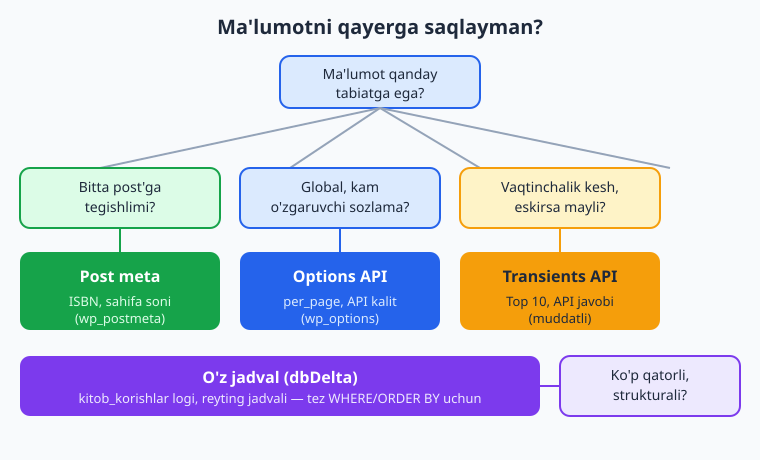
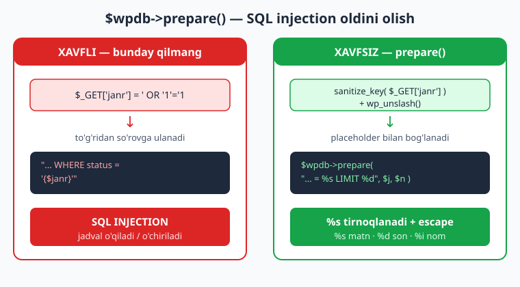
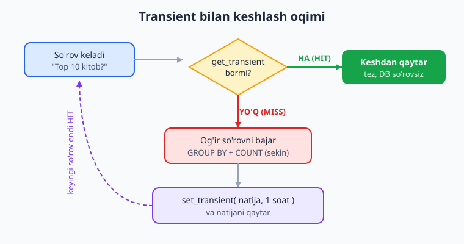

# 10 — Ma'lumotlar bazasi: $wpdb, options, transients

[⬅️ Oldingi: 09 — Meta box va custom fields](./09-meta-box-custom-fields.md) · [🏠 README](./README.md) · [Keyingi: 11 — Foydalanuvchi, rol va capabilities ➡️](./11-rollar-capabilities.md)

> **Bu bobda:** WordPress ma'lumotni qayerga saqlaydi va siz qaysi mexanizmni qachon tanlashingiz kerakligini — post meta, Options API, Transients API yoki o'z jadvalingiz — o'rganamiz; `$wpdb` orqali xavfsiz so'rov yozish (`prepare()` MAJBURIY — SQL injection'dan himoya), `dbDelta()` bilan o'z jadvalingizni yaratish va migratsiya qilish, `get_option`/`update_option` ning `autoload` nuanslari, hamda `set_transient` bilan og'ir so'rovlar va tashqi API natijalarini keshlashni amalda qilib chiqamiz.

---

## Muammo: ma'lumotni qayerga qo'yaman?

Faraz qiling, "Kitoblar katalogi" plugin'ingiz endi yaxshigina shaklga kirdi: `kitob` CPT bor (07-bob), `janr` taxonomiyasi bor (08-bob), har bir kitobga meta'lar (ISBN, sahifa soni) qo'shdingiz (09-bob). Endi yangi talablar keladi:

- Sayt egasi **global sozlama** xohlaydi: "katalogda har sahifada nechta kitob ko'rsatilsin?".
- Har kitob ko'rilganida **statistika** yozmoqchisiz: qaysi kitob nechta marta ochildi.
- Bosh sahifada **"Eng ommabop 10 kitob"** ro'yxati bor — buni hisoblash og'ir SQL so'rov, har sahifa yuklanishida qayta hisoblash saytni sekinlashtiradi.

Bularning har biri — boshqa joyga to'g'ri keladi. WordPress'da ma'lumot saqlashning bir nechta yo'li bor va **noto'g'ri yo'lni tanlash** — sekin sayt, ishlamaydigan kesh yoki SQL injection zaifligi degani. Bu bob aynan shu tanlovni va har birini xavfsiz amalga oshirishni o'rgatadi.

📌 **Oltin qoida:** avval o'zingizdan so'rang — "bu ma'lumot bitta post'ga tegishlimi, global sozlamami, vaqtinchalik keshmi yoki ko'p qatorli o'z strukturamimi?". Javob saqlash joyini aniqlaydi.



---

## WordPress DB tuzilishi — qisqacha xarita

WordPress standart o'rnatishda MySQL/MariaDB'da bir nechta jadval yaratadi. Ularning hammasi **prefiks** bilan boshlanadi (odatda `wp_`, lekin sayt egasi o'zgartirishi mumkin — shuning uchun hech qachon `wp_` ni qo'lda yozmang, `$wpdb->prefix` ishlating). Asosiylari:

| Jadval | Nima saqlaydi |
|---|---|
| `wp_posts` | Postlar, sahifalar, **barcha CPT** (`kitob` ham shu yerda), revisions, menyu elementlari |
| `wp_postmeta` | Post meta — `post_id` + `meta_key` + `meta_value` (09-bobdagi ISBN shu yerda) |
| `wp_options` | Sayt sozlamalari, plugin sozlamalari, **transient'lar** ham (vaqtincha) |
| `wp_users` / `wp_usermeta` | Foydalanuvchilar va ularning meta'lari (11-bob) |
| `wp_terms` / `wp_term_taxonomy` / `wp_term_relationships` | Taxonomiya termlari (`janr`) va ularning postlarga bog'lanishi |
| `wp_comments` / `wp_commentmeta` | Izohlar va izoh meta'lari |

ℹ️ Diqqat qiling: `wp_posts` va `wp_postmeta` — bu **kalit-qiymat** (key-value) modeli. Bu juda moslashuvchan, lekin ko'p ustunli, indekslangan, tez qidiriladigan struktura kerak bo'lsa (masalan har sahifa ko'rishni log qilish) — bu noto'g'ri tanlov. Shunda o'z jadvalingiz kerak bo'ladi.

### To'rt yo'l — qachon qaysi

| Saqlash usuli | Qachon ishlating | Misol (Kitoblar katalogi) |
|---|---|---|
| **Post meta** (09-bob) | Ma'lumot **bitta post'ga** tegishli | Kitobning ISBN, sahifa soni, nashriyot |
| **Options API** | **Global**, kam o'zgaradigan sozlama; butun saytga bitta qiymat | "Har sahifada nechta kitob", API kaliti, plugin versiyasi |
| **Transients API** | **Vaqtinchalik kesh**: hisoblash qimmat, ma'lumot eskirsa ham mayli | "Eng ommabop 10 kitob", tashqi API javobi |
| **O'z jadval** | **Ko'p qatorli**, strukturali, tez qidiriladigan ma'lumot; post tushunchasiga to'g'ri kelmaydi | Har kitob ko'rishni log qilish, reyting/baholar jadvali |

⚠️ Eng keng tarqalgan xato — **hamma narsani post meta'ga tiqish**. Agar sizda minglab qatorli, `WHERE`/`ORDER BY` bilan tez-tez so'raladigan ma'lumot bo'lsa, post meta bilan `meta_query` sekin va og'ir bo'ladi (26-bobda batafsil). Bunday holatda o'z jadvalingiz — to'g'ri yechim.

---

## `$wpdb`: WordPress'ning ma'lumotlar bazasi qatlami

`$wpdb` — WordPress'ning DB bilan ishlash uchun **global obyekti**. U `wpdb` sinfining namunasi va PDO/`mysqli` ustida ishlaydi. Siz hech qachon to'g'ridan-to'g'ri `mysqli_*` yoki `mysql_*` funksiyalarini ishlatmaysiz — bu eskirgan va xavfli (`mysql_*` umuman olib tashlangan).

```php
function kitoblar_katalogi_jami_kitoblar(): int {
	global $wpdb; // $wpdb ni funksiya ichida ishlatish uchun global e'lon SHART

	// $wpdb->posts — to'liq prefiks bilan jadval nomi (masalan wp_posts)
	$soni = $wpdb->get_var(
		"SELECT COUNT(*) FROM {$wpdb->posts} WHERE post_type = 'kitob' AND post_status = 'publish'"
	);

	return (int) $soni;
}
```

📌 `$wpdb` xususiyatlari:

- `$wpdb->prefix` — joriy saytning prefiksi (masalan `wp_`). **O'z jadvalingiz nomini har doim shundan quring:** `$wpdb->prefix . 'kitob_korishlar'`.
- `$wpdb->posts`, `$wpdb->postmeta`, `$wpdb->options`, `$wpdb->users`, `$wpdb->usermeta`, `$wpdb->terms` — yadro jadvallari uchun tayyor, prefiksli nomlar. Bularni qo'lda yozmang.
- `$wpdb->last_error` — oxirgi xato matni (debug uchun).
- `$wpdb->insert_id` — oxirgi `INSERT` da yaratilgan `AUTO_INCREMENT` ID.

### So'rov metodlari

| Metod | Nima qaytaradi | Qachon |
|---|---|---|
| `get_var($query)` | Bitta qiymat (birinchi qator, birinchi ustun) | `COUNT(*)`, bitta maydon |
| `get_row($query, $output)` | Bitta qator (default `OBJECT`) | Bitta yozuv |
| `get_col($query)` | Bitta ustun massiv sifatida | ID'lar ro'yxati |
| `get_results($query, $output)` | Qatorlar massivi (default `OBJECT`) | Ko'p yozuv |
| `query($query)` | Ta'sir qilingan qatorlar soni | `INSERT`/`UPDATE`/`DELETE`/`CREATE` |

`$output` parametri: `OBJECT` (default — har qator obyekt), `ARRAY_A` (assotsiativ massiv: `ustun => qiymat`), `ARRAY_N` (raqamli indeksli massiv), `OBJECT_K` (birinchi ustun qiymati kalit bo'lgan obyektlar massivi).

```php
function kitoblar_katalogi_oxirgi_kitoblar( int $limit = 5 ): array {
	global $wpdb;

	// DIQQAT: $limit foydalanuvchidan kelishi mumkin -> prepare() bilan bog'laymiz
	$qatorlar = $wpdb->get_results(
		$wpdb->prepare(
			"SELECT ID, post_title FROM {$wpdb->posts}
			 WHERE post_type = %s AND post_status = %s
			 ORDER BY post_date DESC
			 LIMIT %d",
			'kitob',
			'publish',
			$limit
		),
		ARRAY_A
	);

	return $qatorlar ?: [];
}
```

ℹ️ **Lekin to'xtang** — agar sizga shunchaki postlarni olish kerak bo'lsa, ko'p hollarda `WP_Query` yoki `get_posts()` to'g'ri tanlovdir: u keshlanadi, hooks'lar bilan kengaytiriladi va xavfsizroq. `$wpdb` ni faqat `WP_Query` qo'lidan kelmaydigan holatlarda — o'z jadvalingiz, murakkab `JOIN`, agregatsiya (`COUNT`/`SUM`/`GROUP BY`) uchun ishlating.

---

## `$wpdb->prepare()` — SQL injection'dan himoya (MAJBURIY)

Bu — butun bobning eng muhim qismi. **Har qanday** foydalanuvchi kiritmasi (GET/POST so'rov, URL parametri, forma maydoni) SQL so'rovga tushishidan oldin `$wpdb->prepare()` orqali o'tishi **SHART**.

### Nima uchun? Anti-misol

```php
// ❌ HECH QACHON BUNDAY QILMANG — SQL INJECTION zaifligi!
function kitob_qidir_xavfli() {
	global $wpdb;
	$janr = $_GET['janr']; // foydalanuvchidan to'g'ridan-to'g'ri

	// $janr to'g'ridan so'rovga ulanmoqda — falokat
	$natija = $wpdb->get_results(
		"SELECT * FROM {$wpdb->posts} WHERE post_type = 'kitob' AND post_status = '{$janr}'"
	);
	return $natija;
}
```

Agar hujumchi `?janr=' OR '1'='1` yoki yomonroq `?janr='; DROP TABLE wp_posts; --` yuborsa, sizning so'rovingiz buziladi yoki butun jadval o'chiriladi. Bu — eng keng tarqalgan WordPress zaifligi.

### To'g'ri yo'l: `prepare()` bilan

```php
// ✅ TO'G'RI — prepare() qiymatni xavfsiz bog'laydi va escape qiladi
function kitob_qidir_xavfsiz(): array {
	global $wpdb;

	// 1) Avval sanitize (12-bob): kutilmagan belgilarni tozalaymiz
	$janr = isset( $_GET['janr'] ) ? sanitize_key( wp_unslash( $_GET['janr'] ) ) : '';

	if ( $janr === '' ) {
		return [];
	}

	// 2) prepare(): %s placeholder qiymatni tirnoqlab, escape qilib qo'yadi
	$natija = $wpdb->get_results(
		$wpdb->prepare(
			"SELECT p.ID, p.post_title
			 FROM {$wpdb->posts} AS p
			 INNER JOIN {$wpdb->term_relationships} AS tr ON p.ID = tr.object_id
			 INNER JOIN {$wpdb->term_taxonomy} AS tt ON tr.term_taxonomy_id = tt.term_taxonomy_id
			 INNER JOIN {$wpdb->terms} AS t ON tt.term_id = t.term_id
			 WHERE p.post_type = %s
			   AND p.post_status = %s
			   AND tt.taxonomy = %s
			   AND t.slug = %s",
			'kitob',
			'publish',
			'janr',
			$janr
		)
	);

	return $natija ?: [];
}
```



### Placeholder'lar

`prepare()` `sprintf`'ga o'xshaydi, lekin WordPress'ning o'z placeholder'lari bor:

| Placeholder | Nima uchun |
|---|---|
| `%s` | **String** (matn) — qiymat avtomatik tirnoqlanadi va escape qilinadi |
| `%d` | **Integer** (butun son) |
| `%f` | **Float** (kasr son) |
| `%i` | **Identifikator** — jadval/ustun nomi (WP 6.2.0+ dan) |

📌 **Qoidalar (rasmiy hujjatdan):**

- Placeholder'larni so'rovda **tirnoqqa olmang.** `prepare()` `%s` ni o'zi tirnoqlaydi. `'%s'` deb yozish — xato.
- Har bir placeholder uchun mos argument berilishi **shart**.
- So'rovdagi **haqiqiy** foiz belgisini `%%` deb yozing (masalan `LIKE` da).
- Argumentlarni alohida parametr sifatida **yoki** bitta massiv sifatida bering — ikkalasini aralashtirmang.

```php
// %i — ustun/jadval nomi uchun (WP 6.2+). Foydalanuvchidan kelgan ustun nomini
// HECH QACHON to'g'ridan ulashtirmang; %i bilan xavfsiz bog'lang yoki allowlist ishlating.
$natija = $wpdb->get_results(
	$wpdb->prepare(
		"SELECT * FROM %i WHERE post_status = %s",
		$wpdb->posts,
		'publish'
	)
);

// LIKE so'rovi: maxsus belgilarni esc_like() bilan ekranlash + %% kerak emas,
// chunki % ni biz qo'shamiz, prepare %s ni tirnoqlaydi.
$qidiruv = '%' . $wpdb->esc_like( 'PHP' ) . '%';
$natija = $wpdb->get_results(
	$wpdb->prepare(
		"SELECT ID, post_title FROM {$wpdb->posts}
		 WHERE post_type = %s AND post_title LIKE %s",
		'kitob',
		$qidiruv
	)
);
```

⚠️ **`prepare()` faqat QIYMATLAR uchun.** Jadval/ustun nomlari, `ASC`/`DESC`, `LIMIT` raqamlarini `%i`/`%d` bilan bog'lang yoki o'zingiz tasdiqlangan ro'yxatdan (allowlist) tanlang. `ORDER BY {$_GET['sort']}` — har doim xavfli; uni `$sort === 'asc' ? 'ASC' : 'DESC'` kabi qat'iy tanlovga aylantiring.

💡 `insert()`, `update()`, `delete()` metodlari `prepare()` ni **ichida o'zi** chaqiradi — siz format massivini berasiz, qiymatlarni qo'lda escape qilish shart emas:

```php
function kitob_korish_yoz( int $kitob_id, int $user_id ): void {
	global $wpdb;
	$wpdb->insert(
		$wpdb->prefix . 'kitob_korishlar',
		[
			'kitob_id'   => $kitob_id,
			'user_id'    => $user_id,
			'korilgan_at' => current_time( 'mysql' ),
		],
		[ '%d', '%d', '%s' ] // format massivi — har ustun uchun tip
	);
}
```

---

## O'z jadvalingiz: `dbDelta()` bilan yaratish

Endi "har kitob ko'rishni log qilish" talabiga qaytamiz. Bu — minglab qator, `kitob_id` bo'yicha tez `COUNT`, sana bo'yicha indeks. Bu post meta'ga to'g'ri kelmaydi — o'z jadvalingiz kerak.

Jadvalni plugin **aktivatsiyasida** yaratamiz (03-bob, `register_activation_hook`). Yaratish uchun to'g'ridan `$wpdb->query("CREATE TABLE ...")` emas, balki **`dbDelta()`** ishlatiladi — u jadval mavjud bo'lsa farqni hisoblab, faqat kerakli o'zgarishni qiladi (migratsiyaga ham yaraydi).

```php
// kitoblar-katalogi/includes/class-database.php
namespace Oqil\KitobKatalog;

class Database {

	const DB_VERSION = '1.0.0';
	const DB_VERSION_OPTION = 'kitoblar_katalogi_db_version';

	public static function jadval_nomi(): string {
		global $wpdb;
		return $wpdb->prefix . 'kitob_korishlar';
	}

	public static function jadval_yarat(): void {
		global $wpdb;

		$jadval  = self::jadval_nomi();
		$collate = $wpdb->get_charset_collate(); // to'g'ri CHARSET va COLLATE

		// dbDelta() QAT'IY format talab qiladi (pastdagi izohga qarang):
		$sql = "CREATE TABLE {$jadval} (
  id bigint(20) unsigned NOT NULL AUTO_INCREMENT,
  kitob_id bigint(20) unsigned NOT NULL,
  user_id bigint(20) unsigned NOT NULL DEFAULT 0,
  korilgan_at datetime NOT NULL DEFAULT '0000-00-00 00:00:00',
  PRIMARY KEY  (id),
  KEY kitob_id (kitob_id),
  KEY korilgan_at (korilgan_at)
) {$collate};";

		require_once ABSPATH . 'wp-admin/includes/upgrade.php'; // dbDelta() shu yerda
		\dbDelta( $sql );

		update_option( self::DB_VERSION_OPTION, self::DB_VERSION );
	}
}
```

📌 **`dbDelta()` ning QAT'IY format qoidalari** (rasmiy hujjat — bularning birortasi buzilsa, jadval jimgina noto'g'ri yaratiladi):

1. Har bir **ustun alohida qatorda** bo'lishi shart.
2. Ustunlarni `dbDelta` to'g'ri o'qishi uchun chiroyli **2 probel** chekinish (kod ichida ko'rinadi).
3. `PRIMARY KEY` dan keyin **ikkita probel**, so'ng qavs: `PRIMARY KEY  (id)`.
4. Indekslar uchun `INDEX` emas, **`KEY`** so'zini ishlating: `KEY kitob_id (kitob_id)`.
5. Tip nomlarini **kichik harfda** yozing (`bigint`, `varchar`, `datetime`) — katta harf deadlock'ga sabab bo'lishi mumkin.
6. **`IF NOT EXISTS` YO'Q** — dbDelta o'zi solishtiradi; bu kalit so'z migratsiyani buzadi.
7. **`FOREIGN KEY` YO'Q**, ustun/kalitda `COMMENT` YO'Q.
8. `CREATE TABLE` statement ichida **bo'sh qator qoldirmang.**

⚠️ `dbDelta()` ABSPATH'dagi `wp-admin/includes/upgrade.php` faylida joylashgan — uni ishlatishdan oldin `require_once` bilan ulashingiz **shart**, aks holda "undefined function" xatosi chiqadi.

### Aktivatsiyada chaqirish va migratsiya

```php
// kitoblar-katalogi/kitoblar-katalogi.php (asosiy fayl)
use Oqil\KitobKatalog\Database;

register_activation_hook( __FILE__, [ Database::class, 'jadval_yarat' ] );

// Har yuklanishda versiyani tekshirib, kerak bo'lsa migratsiya qilish:
add_action( 'plugins_loaded', function (): void {
	$joriy = get_option( Database::DB_VERSION_OPTION );
	if ( $joriy !== Database::DB_VERSION ) {
		// Sxema o'zgargan — dbDelta o'zi farqni qo'shadi (yangi ustun/indeks)
		Database::jadval_yarat();
	}
} );
```

💡 **Migratsiya naqshi:** sxemani o'zgartirsangiz (masalan yangi ustun qo'shsangiz), `DB_VERSION` ni oshiring (`1.0.0` → `1.1.0`) va `CREATE TABLE` ni yangilang. `dbDelta()` mavjud jadvalga faqat **yangi ustun/indeksni** qo'shadi, ma'lumotni o'chirmaydi. `register_activation_hook` faqat aktivatsiyada ishlaydi — plugin yangilanganda emas; shuning uchun versiya tekshiruvi `plugins_loaded` da ham kerak.

⚠️ **Halol eslatma:** jadval yaratish va `INSERT`/`SELECT` natijalari faqat **ishlab turgan WordPress saytida** ko'rinadi. Yuqoridagi kod sintaktik to'g'ri va `dbDelta` qoidalariga mos, lekin uni o'z saytingizda plugin'ni aktivatsiya qilib sinab ko'ring — `phpMyAdmin` yoki `wp db query` (WP-CLI) bilan jadval yaratilganini tasdiqlang.

---

## Options API: global sozlamalar

"Har sahifada nechta kitob ko'rsatilsin?" — bu **butun saytga bitta qiymat**, kam o'zgaradi. Bu — Options API uchun klassik holat. Options'lar `wp_options` jadvalida `option_name` + `option_value` sifatida saqlanadi (serializatsiya avtomatik: massiv/obyektni ham saqlay olasiz).

| Funksiya | Imzo | Vazifa |
|---|---|---|
| `get_option` | `get_option($option, $default_value = false)` | O'qish; yo'q bo'lsa default qaytaradi |
| `add_option` | `add_option($option, $value = '', $deprecated = '', $autoload = null)` | Yangi qo'shish (mavjud bo'lsa hech narsa qilmaydi) |
| `update_option` | `update_option($option, $value, $autoload = null)` | Yangilash; yo'q bo'lsa yaratadi |
| `delete_option` | `delete_option($option)` | O'chirish |

```php
namespace Oqil\KitobKatalog;

class Settings {

	const OPTION = 'kitoblar_katalogi_sozlamalar';

	public static function defaultlar(): array {
		return [
			'per_page'   => 12,
			'show_genre' => true,
		];
	}

	public static function olish(): array {
		$saqlangan = get_option( self::OPTION, [] );
		// wp_parse_args: yetishmagan kalitlarni default bilan to'ldiradi
		return wp_parse_args( $saqlangan, self::defaultlar() );
	}

	public static function saqlash( array $yangi ): void {
		// Sanitize (12-bob): har qiymatni tipiga keltiramiz
		$toza = [
			'per_page'   => max( 1, absint( $yangi['per_page'] ?? 12 ) ),
			'show_genre' => ! empty( $yangi['show_genre'] ),
		];
		update_option( self::OPTION, $toza );
	}
}
```

💡 **Bitta option, ko'p qiymat.** Har sozlama uchun alohida option o'rniga (`kitoblar_per_page`, `kitoblar_show_genre`...), bitta **massiv** option saqlang (`kitoblar_katalogi_sozlamalar`). Bu `wp_options` jadvalini toza tutadi va Settings API bilan (06-bob) qulay ishlaydi.

### `autoload` — performance nuansi

Bu — ko'pchilik o'tkazib yuboradigan, lekin muhim detal. WordPress har sahifa yuklanganda `autoload = 'yes'` bo'lgan **barcha** options'ni bitta so'rovda yuklab, xotiraga oladi (`wp_load_alloptions()`). Bu tez-tez kerak bo'ladigan options uchun zo'r, lekin...

⚠️ Agar siz **katta** (masalan keshlangan API javobi, uzun ro'yxat) yoki **kam ishlatiladigan** ma'lumotni `autoload = true` bilan saqlasangiz, u **har** sahifa yuklanishida keraksiz xotiraga olinadi — sayt sekinlashadi. `alloptions` shishib ketishi — keng tarqalgan performance muammosi (26-bob).

```php
// Tez-tez kerak bo'ladigan kichik sozlama -> autoload = true (default)
update_option( 'kitoblar_katalogi_sozlamalar', $sozlamalar, true );

// Kam kerak bo'ladigan / katta ma'lumot -> autoload = false (faqat so'ralganda yuklanadi)
update_option( 'kitoblar_katalogi_import_log', $katta_log, false );
```

📌 `autoload` parametri **`bool|null`** (WP 6.7.0 dan): `true` (har doim yukla), `false` (faqat kerak bo'lganda), `null` (WordPress o'zi qaror qilsin — yangi standart). Eski `'yes'`/`'no'` string qiymatlari 6.7.0 dan **eskirgan** — ishlatmang.

💡 **Tozalash:** `uninstall.php` (03-bob) da plugin o'chirilganda options'laringizni `delete_option()` bilan tozalang — "orfan" sozlamalar qoldirmang.

---

## Transients API: vaqtinchalik keshlash

Oxirgi talab: bosh sahifadagi **"Eng ommabop 10 kitob"** ro'yxati. Buni hisoblash uchun `kitob_korishlar` jadvalini `GROUP BY` + `ORDER BY COUNT` qilamiz — og'ir so'rov. Har sahifa yuklanishida buni qayta hisoblash — isrof. Yechim: natijani **transient** sifatida keshlab, masalan 1 soatga saqlash.

Transient — bu **muddatli** option: siz qiymat + amal qilish vaqtini (sekundlarda) berasiz, muddat tugaganda WordPress uni o'chirilgan deb hisoblaydi.

| Funksiya | Imzo | Vazifa |
|---|---|---|
| `set_transient` | `set_transient($transient, $value, $expiration = 0)` | Saqlash; `$expiration` — sekundda (0 = muddatsiz) |
| `get_transient` | `get_transient($transient)` | O'qish; yo'q/muddati tugagan bo'lsa `false` |
| `delete_transient` | `delete_transient($transient)` | Qo'lda o'chirish (kesh eskirganda) |

📌 Transient nomi **172 belgidan oshmasligi** kerak (yaxshisi qisqa, prefiksli `slug` ishlating).

```php
namespace Oqil\KitobKatalog;

class Popular {

	const KESH_KALIT = 'kitoblar_katalogi_top10';
	const KESH_MUDDAT = HOUR_IN_SECONDS; // WP konstantasi = 3600 sekund

	public static function top_kitoblar(): array {
		// 1) Avval keshdan o'qishga harakat
		$kesh = get_transient( self::KESH_KALIT );
		if ( false !== $kesh ) {
			return $kesh; // KESH HIT — og'ir so'rovni o'tkazib yuboramiz
		}

		// 2) KESH MISS — og'ir so'rovni bajaramiz
		global $wpdb;
		$jadval = Database::jadval_nomi();
		$natija = $wpdb->get_results(
			$wpdb->prepare(
				"SELECT kitob_id, COUNT(*) AS korishlar
				 FROM {$jadval}
				 GROUP BY kitob_id
				 ORDER BY korishlar DESC
				 LIMIT %d",
				10
			),
			ARRAY_A
		);
		$natija = $natija ?: [];

		// 3) Natijani 1 soatga keshlaymiz
		set_transient( self::KESH_KALIT, $natija, self::KESH_MUDDAT );

		return $natija;
	}

	// Ma'lumot o'zgarganda keshni majburan tozalash (masalan yangi ko'rish yozilganda)
	public static function keshni_tozala(): void {
		delete_transient( self::KESH_KALIT );
	}
}
```



📌 **`get_transient` qaytaruvini doim `false !== $kesh` bilan tekshiring.** Agar `if ( $kesh )` deb yozsangiz, keshlangan **bo'sh massiv** yoki `0` qiymatni "yo'q" deb hisoblab, har safar og'ir so'rovni bajarib qolasiz.

💡 **WordPress vaqt konstantalari** — sehrli raqamlar o'rniga: `MINUTE_IN_SECONDS`, `HOUR_IN_SECONDS`, `DAY_IN_SECONDS`, `WEEK_IN_SECONDS`. `5 * MINUTE_IN_SECONDS` — `300` dan o'qilishliroq.

### Transient va Object Cache farqi

- **Transient (default):** `wp_options` jadvalida saqlanadi (`_transient_NOM` va `_transient_timeout_NOM`). Bu — **doimiy** (persistent): server qayta ishga tushsa ham qoladi.
- **Object Cache** mavjud bo'lsa (Redis/Memcached — drop-in plugin): transient'lar avtomatik **xotira-keshda** saqlanadi, DB'ga yozilmaydi — tezroq. Sizning kodingiz **o'zgarmaydi** — `set_transient`/`get_transient` o'zi to'g'ri qatlamga yozadi.

ℹ️ Demak: **doimiy** kesh kerak bo'lsa (server qayta ishga tushsa ham qolsin) — `set_transient`. Faqat **bitta so'rov davomida** kesh kerak bo'lsa — `wp_cache_set`/`wp_cache_get` (object cache; persistent backend bo'lmasa, so'rov tugagach yo'qoladi). Tashqi API yoki og'ir hisoblash uchun deyarli har doim **transient** to'g'ri tanlov (18-bobda HTTP API bilan birga ko'ramiz).

⚠️ **Halol eslatma:** kesh xatti-harakati (HIT/MISS, object cache mavjudligi) faqat ishlaydigan saytda ko'rinadi. Yuqoridagi mantiq to'g'ri yozilgan; uni o'z saytingizda Query Monitor bilan kuzating (26-bob) — kesh ishlayotganini so'rovlar sonidan ko'rasiz.

---

## Birga qo'yamiz: tanlov xulosasi

"Kitoblar katalogi" plugin'imizda endi to'rt mexanizm ham bor:

- **Post meta** — kitob ISBN, sahifa soni (09-bob).
- **Options API** — "har sahifada nechta kitob", `show_genre` (massiv option, `autoload` to'g'ri).
- **O'z jadval** (`kitob_korishlar`) — har ko'rishni log qilish (`dbDelta`, `prepare`).
- **Transient** — "Top 10" og'ir so'rov natijasi (1 soatlik kesh).

Har biri to'g'ri joyda: bu — tez, xavfsiz va kengaytiriladigan plugin asosidir. Keyingi bobda foydalanuvchilar, rollar va `current_user_can` bilan **kim** nima qila olishini boshqaramiz.

---

## 10-bob mashqlari

### Oson

1. **(Oson)** `global $wpdb` yordamida saytdagi `publish` holatdagi `kitob` postlari sonini `get_var` bilan qaytaradigan funksiya yozing. Jadval nomini `$wpdb->posts` orqali oling.
2. **(Oson)** `get_option('kitoblar_katalogi_sozlamalar', [])` yordamida sozlamalarni o'qing va `wp_parse_args` bilan default qiymatlar (`per_page => 12`) bilan birlashtiring.
3. **(Oson)** Quyidagi xavfli so'rovning nima uchun zaifligini bir jumlada tushuntiring: `"... WHERE id = {$_GET['id']}"`. To'g'ri variantini `prepare()` bilan yozing.
4. **(Oson)** `set_transient('test_kesh', 'salom', 5 * MINUTE_IN_SECONDS)` yozing va `get_transient` bilan o'qing. `MINUTE_IN_SECONDS` qiymati nechaga teng?
5. **(Oson)** Qaysi saqlash usulini tanlaysiz: (a) "saytning Google Analytics ID si", (b) "har bir kitobning muqova rangi", (c) "tashqi narx API javobi 30 daqiqaga", (d) "10000 qatorli yuklab olishlar tarixi"? Har biriga sabab bilan javob bering.

### O'rta

6. **(O'rta)** `kitob_korishlar` jadvali uchun `dbDelta()` ga mos `CREATE TABLE` SQL yozing: `id` (PK, auto-increment), `kitob_id`, `user_id`, `korilgan_at` (datetime), `kitob_id` va `korilgan_at` ga indeks. `dbDelta` ning qaysi 3 ta format qoidasini eslab qoldingiz?
7. **(O'rta)** `update_option` ni `autoload = false` bilan chaqiring va nima uchun katta/kam ishlatiladigan ma'lumot uchun bu muhimligini tushuntiring.
8. **(O'rta)** `prepare()` da `%s`, `%d`, `%i` qachon ishlatilishini bittadan misol bilan ko'rsating. `%i` qaysi WordPress versiyasidan beri mavjud?
9. **(O'rta)** Transient'ni o'qiyotganda `if ( $kesh )` o'rniga nega `if ( false !== $kesh )` yozish kerak? Qaysi qiymatlar muammo keltirib chiqaradi?

### Qiyin

10. **(Qiyin)** "Eng ommabop 10 kitob" funksiyasini yozing: avval transient'dan o'qisin, kesh bo'lmasa `kitob_korishlar` jadvalidan `GROUP BY` + `ORDER BY COUNT` so'rovini bajarsin va natijani 1 soatga keshlasin.

    <details markdown="1"><summary>Yechim</summary>

    ```php
    namespace Oqil\KitobKatalog;

    function top_10_kitob(): array {
    	$kalit = 'kitoblar_katalogi_top10';

    	// 1) Keshni tekshirish (false !== bilan, bo'sh massivni ham hurmat qilamiz)
    	$kesh = get_transient( $kalit );
    	if ( false !== $kesh ) {
    		return $kesh; // KESH HIT
    	}

    	// 2) KESH MISS -> og'ir so'rov
    	global $wpdb;
    	$jadval = $wpdb->prefix . 'kitob_korishlar';
    	$natija = $wpdb->get_results(
    		$wpdb->prepare(
    			"SELECT kitob_id, COUNT(*) AS korishlar
    			 FROM {$jadval}
    			 GROUP BY kitob_id
    			 ORDER BY korishlar DESC
    			 LIMIT %d",
    			10
    		),
    		ARRAY_A
    	);
    	$natija = $natija ?: [];

    	// 3) Keshga 1 soatga saqlash
    	set_transient( $kalit, $natija, HOUR_IN_SECONDS );

    	return $natija;
    }
    ```

    **Tushuntirish:** `prepare()` bilan `LIMIT %d` bog'lanadi (garchi bu yerda raqam o'zgarmas bo'lsa-da, odat foydali). `false !== $kesh` — keshlangan bo'sh massivni "yo'q" deb hisoblamaslik uchun. Jadval nomi `$wpdb->prefix` dan quriladi. Kesh muddati `HOUR_IN_SECONDS` (3600).
    </details>

11. **(Qiyin)** Plugin aktivatsiyasida `dbDelta()` bilan jadval yaratadigan to'liq sinf yozing: `register_activation_hook` ga ulang, `$wpdb->get_charset_collate()` ishlating, `dbVersion` ni option'da saqlang va `plugins_loaded` da versiya o'zgargan bo'lsa migratsiya qiling.

    <details markdown="1"><summary>Yechim</summary>

    ```php
    // includes/class-database.php
    namespace Oqil\KitobKatalog;

    class Database {
    	const DB_VERSION = '1.0.0';
    	const VERSION_OPTION = 'kitoblar_katalogi_db_version';

    	public static function jadval_nomi(): string {
    		global $wpdb;
    		return $wpdb->prefix . 'kitob_korishlar';
    	}

    	public static function jadval_yarat(): void {
    		global $wpdb;
    		$jadval  = self::jadval_nomi();
    		$collate = $wpdb->get_charset_collate();

    		$sql = "CREATE TABLE {$jadval} (
  id bigint(20) unsigned NOT NULL AUTO_INCREMENT,
  kitob_id bigint(20) unsigned NOT NULL,
  user_id bigint(20) unsigned NOT NULL DEFAULT 0,
  korilgan_at datetime NOT NULL DEFAULT '0000-00-00 00:00:00',
  PRIMARY KEY  (id),
  KEY kitob_id (kitob_id),
  KEY korilgan_at (korilgan_at)
) {$collate};";

    		require_once ABSPATH . 'wp-admin/includes/upgrade.php';
    		\dbDelta( $sql );

    		update_option( self::VERSION_OPTION, self::DB_VERSION );
    	}

    	public static function migratsiya_tekshir(): void {
    		if ( get_option( self::VERSION_OPTION ) !== self::DB_VERSION ) {
    			self::jadval_yarat(); // dbDelta yangi ustun/indeksni qo'shadi
    		}
    	}
    }

    // Asosiy plugin faylida:
    // register_activation_hook( __FILE__, [ Database::class, 'jadval_yarat' ] );
    // add_action( 'plugins_loaded', [ Database::class, 'migratsiya_tekshir' ] );
    ```

    **Tushuntirish:** `dbDelta` ABSPATH'dagi `upgrade.php` ni talab qiladi. Format qat'iy: har ustun alohida qatorda, `PRIMARY KEY  (id)` 2 probel bilan, `KEY` (INDEX emas), tiplar kichik harf, `IF NOT EXISTS` yo'q. `register_activation_hook` faqat aktivatsiyada; yangilanishda `plugins_loaded` dagi versiya tekshiruvi migratsiyani ushlaydi.
    </details>

12. **(Qiyin)** `kitob_korishlar` jadvaliga xavfsiz yozadigan funksiya yozing (`$wpdb->insert` format massivi bilan) va keshni (`top10` transient) yozuvdan keyin tozalang — shunda "Top 10" yangi ma'lumotni aks ettiradi.

    <details markdown="1"><summary>Yechim</summary>

    ```php
    namespace Oqil\KitobKatalog;

    function kitob_korish_yoz( int $kitob_id, int $user_id = 0 ): bool {
    	global $wpdb;

    	$natija = $wpdb->insert(
    		$wpdb->prefix . 'kitob_korishlar',
    		[
    			'kitob_id'    => $kitob_id,
    			'user_id'     => $user_id,
    			'korilgan_at' => current_time( 'mysql' ),
    		],
    		[ '%d', '%d', '%s' ] // format massivi -> insert() o'zi prepare qiladi
    	);

    	if ( false !== $natija ) {
    		// Yangi ko'rish yozildi -> "Top 10" kesh endi eskirdi, tozalaymiz
    		delete_transient( 'kitoblar_katalogi_top10' );
    	}

    	return false !== $natija;
    }
    ```

    **Tushuntirish:** `$wpdb->insert()` qiymatlarni format massivi (`%d`/`%s`) bo'yicha o'zi `prepare` qiladi — qo'lda escape shart emas. `current_time('mysql')` — WordPress vaqt zonasidagi `Y-m-d H:i:s`. Yozuvdan keyin `delete_transient` keshni bekor qiladi, shunda keyingi "Top 10" so'rovi yangi ma'lumot bilan qayta hisoblanadi (cache invalidation).
    </details>

13. **(Qiyin)** Foydalanuvchi `?qidiruv=...` orqali kitob sarlavhasini qidiradi. `LIKE` so'rovini `$wpdb->esc_like()` + `prepare('%s')` bilan **xavfsiz** yozing. Nima uchun `esc_like` kerak?

    <details markdown="1"><summary>Yechim</summary>

    ```php
    function kitob_qidir( string $soz ): array {
    	global $wpdb;

    	$soz = sanitize_text_field( wp_unslash( $soz ) ); // 12-bob: input tozalash
    	if ( '' === $soz ) {
    		return [];
    	}

    	// esc_like: foydalanuvchi kiritgan % va _ belgilarini LIKE wildcard sifatida emas,
    	// oddiy belgi sifatida qabul qilish uchun ekranlaydi.
    	$pattern = '%' . $wpdb->esc_like( $soz ) . '%';

    	return $wpdb->get_results(
    		$wpdb->prepare(
    			"SELECT ID, post_title FROM {$wpdb->posts}
    			 WHERE post_type = %s AND post_status = %s AND post_title LIKE %s",
    			'kitob',
    			'publish',
    			$pattern
    		),
    		ARRAY_A
    	) ?: [];
    }
    ```

    **Tushuntirish:** `prepare('%s')` SQL injection'dan himoya qiladi (qiymatni escape qiladi), lekin `%` va `_` belgilari `LIKE` da maxsus wildcard ma'nosini saqlaydi. Agar foydalanuvchi `50%` deb qidirsa, `%` har narsaga mos kelib qoladi. `$wpdb->esc_like()` bu belgilarni ekranlab, ularni oddiy matn sifatida qidiradi. Tartib: avval `esc_like`, keyin `%...%` ni qo'shamiz, so'ng `prepare`.
    </details>

14. **(Qiyin)** Plugin o'chirilganda (`uninstall.php`) options va o'z jadvalingizni tozalaydigan kod yozing. Nima uchun `$wpdb->query` da jadval nomini `prepare` bilan emas, `$wpdb->prefix` dan qurib ishlatamiz?

    <details markdown="1"><summary>Yechim</summary>

    ```php
    // kitoblar-katalogi/uninstall.php
    if ( ! defined( 'WP_UNINSTALL_PLUGIN' ) ) {
    	exit; // To'g'ridan ochilishdan himoya
    }

    // 1) Options'larni tozalash
    delete_option( 'kitoblar_katalogi_sozlamalar' );
    delete_option( 'kitoblar_katalogi_db_version' );

    // 2) Transient'larni tozalash
    delete_transient( 'kitoblar_katalogi_top10' );

    // 3) O'z jadvalimizni o'chirish
    global $wpdb;
    $jadval = $wpdb->prefix . 'kitob_korishlar';
    // Jadval nomi BIZNING nazoratimizda (foydalanuvchi kiritmasi emas), $wpdb->prefix dan
    // qurilgan -> SQLi xavfi yo'q. prepare() qiymatlar uchun; %i ham mumkin (WP 6.2+).
    $wpdb->query( "DROP TABLE IF EXISTS {$jadval}" );
    ```

    **Tushuntirish:** `uninstall.php` faqat plugin **o'chirilganda** ishlaydi (delete, deactivate emas). `WP_UNINSTALL_PLUGIN` tekshiruvi — to'g'ridan-to'g'ri ochishdan himoya. Jadval nomi foydalanuvchi kiritmasidan emas, `$wpdb->prefix` (ishonchli) dan qurilgani uchun `DROP TABLE` da `prepare` shart emas — `prepare` foydalanuvchi **qiymatlari** uchun. Agar paranoik bo'lsangiz, `%i` (identifikator placeholder, WP 6.2+) bilan ham yozishingiz mumkin.
    </details>

15. **(Qiyin)** Tashqi narx API'sidan kitob narxini olib, javobni 30 daqiqaga keshlaydigan funksiyaning **kesh qatlamini** yozing (HTTP qismi 18-bobda; bu yerda faqat transient mantiq). Kesh kaliti har kitob uchun alohida bo'lsin.

    <details markdown="1"><summary>Yechim</summary>

    ```php
    function kitob_narxi( int $kitob_id ): ?float {
    	// Har kitob uchun alohida kesh kaliti (172 belgidan oshmaydi)
    	$kalit = 'kitoblar_katalogi_narx_' . $kitob_id;

    	$kesh = get_transient( $kalit );
    	if ( false !== $kesh ) {
    		return ( null === $kesh ) ? null : (float) $kesh; // KESH HIT
    	}

    	// KESH MISS -> tashqi API (18-bob: wp_remote_get). Bu yerda soxta qiymat:
    	$narx = kitoblar_katalogi_narxni_apidan_ol( $kitob_id ); // ?float qaytaradi

    	// Natijani 30 daqiqaga keshlash (xato/null bo'lsa qisqaroq saqlash ham mumkin)
    	set_transient( $kalit, ( null === $narx ) ? null : $narx, 30 * MINUTE_IN_SECONDS );

    	return $narx;
    }
    ```

    **Tushuntirish:** kesh kaliti `..._narx_{$kitob_id}` — har kitobga alohida, lekin 172 belgi chegarasida. `false !== $kesh` MISS'ni HIT'dan ajratadi; `null` (narx topilmadi) ham haqiqiy keshlanadigan qiymat, shuning uchun alohida ishlanadi. `30 * MINUTE_IN_SECONDS` o'qilishli. Haqiqiy HTTP chaqiruvi 18-bobda `wp_remote_get` bilan to'ldiriladi.
    </details>

---

[⬅️ Oldingi: 09 — Meta box va custom fields](./09-meta-box-custom-fields.md) · [🏠 README](./README.md) · [Keyingi: 11 — Foydalanuvchi, rol va capabilities ➡️](./11-rollar-capabilities.md)
