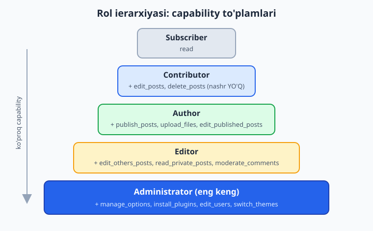
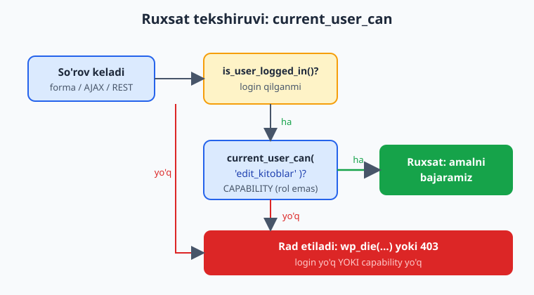
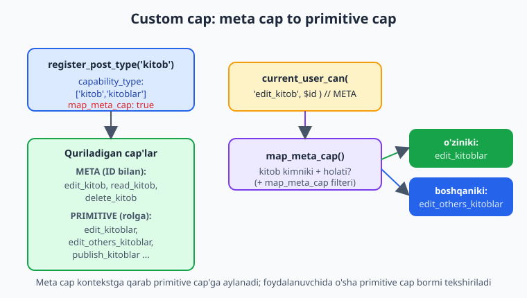

# 11 — Foydalanuvchi, rol va capabilities

[⬅️ Oldingi: 10 — Ma'lumotlar bazasi: $wpdb, options, transients](./10-malumotlar-bazasi.md) · [🏠 README](./README.md) · [Keyingi: 12 — Xavfsizlik asoslari: nonce, sanitize, escape ➡️](./12-xavfsizlik-asoslari.md)

> **Bu bobda:** WordPress'da "kim nima qila oladi?" degan savolga javob beruvchi butun ruxsat tizimini — rol va capability farqini, beshta standart rol (subscriber, contributor, author, editor, administrator) va ularning capability to'plamlarini, ruxsatni tekshirishning asosiy usuli `current_user_can($capability, ...$args)` ni (rolni emas, aynan CAPABILITY ni tekshirish), `user_can`/`wp_get_current_user`/`is_user_logged_in` yordamchilarini, aktivatsiyada `add_role`/`get_role`/`$role->add_cap` bilan rol va capability boshqarishni, hamda `kitob` CPT uchun maxsus capability'larni (`capability_type` + `map_meta_cap` => true, `edit_kitob` meta cap'i `map_meta_cap` filteri orqali primitive cap'ga aylanishi) o'rganamiz; oxirida multisite super admin haqida qisqacha to'xtalamiz.

---

## Muammo: kim qaysi kitobni tahrirlay oladi?

"Kitoblar katalogi" plugin'imiz endi to'liq ishlaydi: `kitob` CPT (07-bob), `janr` taxonomiyasi (08-bob), meta'lar (09-bob), o'z jadval va kesh (10-bob). Lekin saytda bir nechta xil foydalanuvchi bor:

- **Tashrif buyuruvchi** (login qilmagan) — faqat kitoblarni o'qiy oladi.
- **Mualliflar** — o'z kitoblarini qo'sha va tahrirlay oladi, lekin boshqalarnikiga tegmasligi kerak.
- **Kontent muharriri** — barcha kitoblarni tahrirlay va nashr qila oladi.
- **Administrator** — hamma narsani.

Endi savol: kodingizda foydalanuvchi shu amalni bajarishga **haqimi-yo'qmi** ni qanday aniqlaysiz? Boshlovchining birinchi instinkti — "rolini tekshiraman": `if ($user->roles == 'editor')`. Bu **xato** va xavfli. Bu bob nima uchun xato ekanini va to'g'ri yo'l — capability tekshiruvini — o'rgatadi.

📌 **Oltin qoida:** WordPress'da hech qachon **rolni** tekshirmang. Har doim **capability** ni tekshiring: `current_user_can('edit_others_posts')`. Rol — bu shunchaki capability'lar to'plamiga berilgan nom; rollar sayt egasi yoki boshqa plugin tomonidan o'zgartirilishi mumkin, capability esa aniq bir amalni bildiradi.

---

## Rol va capability: farqi nimada?

Bu ikki tushunchani aralashtirish — eng keng tarqalgan yangi boshlovchi xatosi. Soddagina:

- **Capability** (qobiliyat) — bitta aniq amalga ruxsat. Masalan `edit_posts` ("postlarni tahrirlash"), `publish_posts` ("nashr qilish"), `manage_options` ("sozlamalarni boshqarish"), `delete_users` ("foydalanuvchi o'chirish"). Bu — tizimning eng kichik ruxsat birligi.
- **Rol** (lavozim) — capability'lar **to'plamiga** berilgan qulay nom. Masalan `editor` roli — bu `edit_posts`, `edit_others_posts`, `publish_posts`, `delete_posts` va yana o'nlab capability'larning birgalikdagi nomi.

O'xshatish: capability — bu kalit (eshik ochadi), rol — bu kalit dastasi (bir nechta kalit bir joyda). Siz eshikni "Aziz dastasi"ga ega-yo'qligi bilan emas, balki **o'sha aniq kalit** uning qo'lida bor-yo'qligi bilan ochasiz. Sayt egasi dastaga yangi kalit qo'shishi yoki olib tashlashi mumkin — shuning uchun dastaning nomiga emas, kalitning o'ziga ishonasiz.



### Beshta standart rol

WordPress standart o'rnatishda beshta rol bilan keladi (kichikdan kattaga):

| Rol | Slug | Asosiy capability'lar | Tipik foydalanuvchi |
|---|---|---|---|
| Subscriber | `subscriber` | `read` | Faqat o'qiydigan ro'yxatdan o'tgan foydalanuvchi |
| Contributor | `contributor` | `read`, `edit_posts`, `delete_posts` | O'z postini yozadi, lekin **nashr qila olmaydi** |
| Author | `author` | + `publish_posts`, `upload_files`, `edit_published_posts`, `delete_published_posts` | O'z postini yozadi va **nashr qiladi** |
| Editor | `editor` | + `edit_others_posts`, `delete_others_posts`, `read_private_posts`, `manage_categories`, `moderate_comments` | **Barcha** postlarni boshqaradi |
| Administrator | `administrator` | Yuqoridagilarning hammasi + `manage_options`, `install_plugins`, `edit_users`, `switch_themes`, ... | Saytni to'liq boshqaradi |

📌 Diqqat qiling: rollar **kümülativ** (to'planadigan) emas — texnik jihatdan har rol o'zining capability massiviga ega. Lekin amalda yuqori rollar quyilarining capability'larini ham o'z ichiga oladi (editor author qila oladigan hamma narsani qiladi va undan ko'p). Ierarxiya — bu konvensiya, qat'iy meros emas.

⚠️ **Eng nozik farq:** Contributor `edit_posts` ga ega, lekin `publish_posts` ga ega EMAS. Demak u draft yoza oladi, ammo nashr eta olmaydi — postini editor/admin ko'rib chiqib nashr qiladi. Author esa `publish_posts` ga ham ega. Mana shuning uchun rolni emas, aniq capability ni tekshirish kerak.

💡 **`administrator` ko'pincha barcha custom capability'larni avtomatik OLMAYDI.** Siz yangi `edit_kitob` capability'sini yaratsangiz, administratorga uni **aniq berishingiz** kerak (yoki CPT'ni `capability_type` + `map_meta_cap` bilan to'g'ri ro'yxatdan o'tkazsangiz, admin standart sxema bo'yicha oladi — pastda ko'ramiz). "Admin hamma narsa qila oladi" degan tasavvur — `is_super_admin` (multisite) holatida to'g'ri, oddiy saytda esa admin shunchaki eng keng capability to'plamiga ega rol, xolos.

---

## `current_user_can()` — ruxsat tekshiruvining asosiy usuli

Plugin kodingizda **har** himoyalanishi kerak bo'lgan amaldan oldin — forma yuborishni qayta ishlash, admin sahifani ko'rsatish, AJAX/REST so'rovini bajarish, o'chirish tugmasi — `current_user_can()` bilan ruxsatni tekshirasiz.

```php
function kitoblar_katalogi_oz_jadval_tozala(): void {
	// Faqat sozlamalarni boshqara oladigan (odatda administrator) foydalanuvchi
	if ( ! current_user_can( 'manage_options' ) ) {
		wp_die( esc_html__( 'Sizda bu amalni bajarish uchun ruxsat yo\'q.', 'kitoblar-katalogi' ) );
	}

	// ... bu yerga faqat ruxsatli foydalanuvchi yetib keladi
}
```

`current_user_can()` ning imzosi (rasmiy hujjatdan):

```php
current_user_can( string $capability, ...$args ): bool
```

- **`$capability`** — tekshiriladigan capability nomi (string). Masalan `'edit_posts'`, `'manage_options'`.
- **`...$args`** — ixtiyoriy qo'shimcha argumentlar, **odatda obyekt ID bilan boshlanadi**. Bu — "meta capability" tekshiruvi uchun (pastda).

📌 **Asosiy qoida: rolni emas, CAPABILITY ni tekshiring.**

```php
// ❌ NOTO'G'RI — rolni tekshirish. Mo'rt va xavfli.
$user = wp_get_current_user();
if ( in_array( 'editor', (array) $user->roles, true ) ) {
	// ... admin yoki maxsus rol bu yerga TUSHMAY qoladi, garchi haqli bo'lsa-da
}

// ✅ TO'G'RI — capability tekshirish. Rol nima atalishidan qat'i nazar ishlaydi.
if ( current_user_can( 'edit_others_posts' ) ) {
	// ... bu capability'ga ega HAR KIM (editor, admin, maxsus rol) o'tadi
}
```

`in_array('editor', ...)` yondashuvi nega yomon? Chunki:

1. Administrator `editor` rolida emas — u tekshiruvdan o'tmay qoladi, garchi u barcha postlarni tahrirlay olsa ham.
2. Boshqa plugin "Kontent menejeri" degan maxsus rol qo'shishi mumkin — u ham `edit_others_posts` ga ega bo'lib, lekin sizning tekshiruvingizdan o'tmaydi.
3. Sayt egasi `editor` rolidan `edit_others_posts` ni olib tashlashi mumkin — endi rol nomi bor, lekin haqiqiy ruxsat yo'q. `current_user_can` buni to'g'ri ushlaydi, `in_array` esa yo'q.



### Meta capability: aniq obyektni tekshirish

Ba'zan "postlarni tahrirlay oladimi?" emas, "**ANA SHU** kitobni tahrirlay oladimi?" deb so'rash kerak. Bu yerda `$args` ishga tushadi — obyekt ID ni uzatasiz:

```php
function kitoblar_katalogi_tahrir_havolasi( int $kitob_id ): string {
	// "edit_post" — meta capability; ikkinchi argument — aniq post ID.
	// WordPress map_meta_cap orqali buni "bu post muallifimisan?" ga aylantiradi:
	// muallif bo'lsa edit_posts, boshqaning posti bo'lsa edit_others_posts kerak.
	if ( ! current_user_can( 'edit_post', $kitob_id ) ) {
		return ''; // ruxsat yo'q -> havola ko'rsatilmaydi
	}

	$url = get_edit_post_link( $kitob_id );

	return sprintf(
		'<a href="%s">%s</a>',
		esc_url( $url ),
		esc_html__( 'Tahrirlash', 'kitoblar-katalogi' )
	);
}
```

📌 **Meta cap vs primitive cap.** `edit_post` (yakka, ID bilan), `read_post`, `delete_post` — bular **meta capability**: ular to'g'ridan-to'g'ri foydalanuvchiga berilmaydi, balki kontekstga qarab (post kimniki, qanday holatda) **primitive capability**'ga (`edit_posts`, `edit_others_posts`, `publish_posts`...) `map_meta_cap()` orqali aylantiriladi. Shuning uchun yakka post ruxsatini tekshirayotganda **doim ID uzating** (`current_user_can('edit_post', $id)`), aks holda tekshiruv noto'g'ri ishlaydi.

⚠️ **`current_user_can('edit_post')` ni ID'siz chaqirmang.** ID'siz meta cap to'g'ri map qilinmaydi va kutilmagan natija beradi. ID bilan: `current_user_can('edit_post', $kitob_id)`.

---

## Yordamchi funksiyalar: `wp_get_current_user`, `user_can`, `is_user_logged_in`

`current_user_can` joriy foydalanuvchi haqida. Atrofidagi yordamchilar:

| Funksiya | Imzo | Vazifa |
|---|---|---|
| `is_user_logged_in()` | `is_user_logged_in(): bool` | Foydalanuvchi login qilganmi? Hech qanday argumentsiz |
| `wp_get_current_user()` | `wp_get_current_user(): WP_User` | Joriy foydalanuvchi obyekti (login qilmagan bo'lsa ID = 0 bo'lgan bo'sh WP_User) |
| `current_user_can()` | `current_user_can($cap, ...$args): bool` | Joriy foydalanuvchi shu capability'ga egami? |
| `user_can()` | `user_can($user, $cap, ...$args): bool` | **Berilgan** (joriy emas) foydalanuvchi shu capability'ga egami? |

```php
function kitoblar_katalogi_kim_korsin(): void {
	if ( ! is_user_logged_in() ) {
		echo esc_html__( 'Kitob qo\'shish uchun tizimga kiring.', 'kitoblar-katalogi' );
		return;
	}

	$user = wp_get_current_user();

	// Salomlashish (display_name escape qilingan — 12-bob)
	printf(
		'<p>%s</p>',
		esc_html(
			sprintf(
				/* translators: %s: foydalanuvchi nomi */
				__( 'Xush kelibsiz, %s!', 'kitoblar-katalogi' ),
				$user->display_name
			)
		)
	);

	if ( current_user_can( 'publish_posts' ) ) {
		echo '<p>' . esc_html__( 'Siz kitob nashr qila olasiz.', 'kitoblar-katalogi' ) . '</p>';
	} else {
		echo '<p>' . esc_html__( 'Sizning kitobingiz muharrir tasdig\'idan o\'tadi.', 'kitoblar-katalogi' ) . '</p>';
	}
}
```

`user_can()` — boshqa foydalanuvchi haqida tekshirish kerak bo'lganda (masalan administrator boshqa foydalanuvchining ruxsatini ko'rmoqchi):

```php
// Berilgan foydalanuvchi (ID yoki WP_User obyekti) ANA SHU kitobni tahrirlay oladimi?
if ( user_can( $boshqa_user_id, 'edit_post', $kitob_id ) ) {
	// ...
}
```

⚠️ `wp_get_current_user()` login qilmagan tashrif buyuruvchi uchun **xato bermaydi** — u ID = 0, capability'larsiz bo'sh `WP_User` qaytaradi. Shuning uchun `current_user_can` bunday foydalanuvchi uchun `read` dan boshqa deyarli hamma narsaga `false` qaytaradi. Bu xavfsiz default.

---

## Rol va capability boshqarish: aktivatsiyada bir marta

Endi o'z rol va capability'laringizni yaratishni ko'ramiz. Eng muhim qoida darrov:

📌 **Rol/capability o'zgartirishni FAQAT aktivatsiyada (bir marta) qiling, har so'rovda EMAS.** `add_role`, `add_cap`, `remove_cap` o'zgarishni **ma'lumotlar bazasiga** (`wp_options` dagi `wp_user_roles`) yozadi — bu doimiy. Agar buni `init` da har sahifa yuklanishida chaqirsangiz, keraksiz DB yozuvi va chalkashlik bo'ladi.

### `add_role` — yangi rol yaratish

`add_role()` imzosi (rasmiy hujjatdan):

```php
add_role( string $role, string $display_name, array $capabilities = array() ): WP_Role|void
```

- Muvaffaqiyatda `WP_Role` obyekti, rol allaqachon mavjud bo'lsa yoki nom bo'sh bo'lsa `void` (`null`) qaytaradi — shuning uchun qayta chaqirilsa zarar qilmaydi (idempotent).

"Kitob muharriri" rolini yarataylik — u faqat `kitob` CPT bilan ishlaydi (oddiy postlarga tegmaydi):

```php
// kitoblar-katalogi/kitoblar-katalogi.php (asosiy fayl)
use Oqil\KitobKatalog\Roles;

register_activation_hook( __FILE__, [ Roles::class, 'rollar_qosh' ] );
register_deactivation_hook( __FILE__, [ Roles::class, 'rollar_olib_tashla' ] );
```

```php
// kitoblar-katalogi/includes/class-roles.php
namespace Oqil\KitobKatalog;

class Roles {

	const ROL = 'kitob_muharriri';

	/**
	 * Aktivatsiyada chaqiriladi (bir marta). "Kitob muharriri" rolini yaratadi.
	 */
	public static function rollar_qosh(): void {
		// add_role mavjud rolga teginmaydi -> qayta aktivatsiyada xavfsiz
		add_role(
			self::ROL,
			__( 'Kitob muharriri', 'kitoblar-katalogi' ),
			[
				'read'                  => true, // admin paneliga kirish uchun minimal
				'edit_kitoblar'         => true,
				'edit_others_kitoblar'  => true,
				'publish_kitoblar'      => true,
				'read_private_kitoblar' => true,
				'delete_kitoblar'       => true,
				'upload_files'          => true, // muqova rasmi yuklash uchun
			]
		);
	}

	/**
	 * Deaktivatsiyada chaqiriladi. Biz qo'shgan rolni tozalaymiz.
	 */
	public static function rollar_olib_tashla(): void {
		remove_role( self::ROL );
	}
}
```

💡 **`read => true` nima uchun?** `read` capability'siz foydalanuvchi wp-admin paneliga umuman kira olmaydi (WordPress uni saytning oldingi qismiga yo'naltiradi). Admin'da ishlaydigan har bir rolga `read` kerak.

⚠️ **Deaktivatsiyada rolni olib tashlang, lekin ehtiyot bo'ling.** Agar foydalanuvchilar shu rolda bo'lsa, rol olib tashlanganda ular "rolsiz" qoladi. Ko'p plugin'lar rolni **uninstall.php** da (butunlay o'chirishda) olib tashlaydi, deaktivatsiyada esa qoldiradi — bu sizning xohishingiz. Bu yerda misol uchun deaktivatsiyada olib tashladik.

### `get_role` + `add_cap`/`remove_cap` — mavjud rolga capability qo'shish

Ko'pincha yangi rol yaratish shart emas — mavjud rolga (masalan administrator yoki editor) custom capability qo'shasiz.

`get_role()` imzosi:

```php
get_role( string $role ): WP_Role|null
```

`WP_Role` obyektining metodlari:

```php
WP_Role::add_cap( string $cap, bool $grant = true ): void
WP_Role::remove_cap( string $cap ): void
```

```php
public static function adminga_caplar_ber(): void {
	$caplar = [
		'edit_kitob',
		'read_kitob',
		'delete_kitob',
		'edit_kitoblar',
		'edit_others_kitoblar',
		'publish_kitoblar',
		'read_private_kitoblar',
		'delete_kitoblar',
		'delete_others_kitoblar',
		'delete_private_kitoblar',
		'delete_published_kitoblar',
		'edit_private_kitoblar',
		'edit_published_kitoblar',
	];

	// Administrator va editor'ga kitob capability'larini beramiz
	foreach ( [ 'administrator', 'editor' ] as $rol_nomi ) {
		$rol = get_role( $rol_nomi ); // WP_Role|null
		if ( null === $rol ) {
			continue; // rol mavjud emas (kamdan-kam) -> o'tkazib yuboramiz
		}
		foreach ( $caplar as $cap ) {
			$rol->add_cap( $cap ); // $grant default true
		}
	}
}
```

📌 `get_role()` rol topilmasa `null` qaytaradi — shuning uchun `$rol->add_cap(...)` chaqirishdan oldin `null !== $rol` ni doim tekshiring (aks holda "method on null" fatal xatosi).

💡 `add_cap($cap, false)` — capability'ni **aniq rad etish** uchun (true emas, false bilan saqlanadi). Bu kamdan-kam kerak; odatda kerakmas capability'ni umuman qo'shmaysiz yoki `remove_cap` bilan olib tashlaysiz.

---

## Custom capability: `kitob` CPT uchun

Endi eng kuchli qism. 07-bobda `kitob` CPT'ni standart `capability_type => 'post'` bilan ro'yxatdan o'tkazgan edik — demak kitoblarni boshqarish oddiy postlarni boshqarish bilan **bir xil** capability'lar (`edit_posts`...) ni talab qiladi. Bu ko'p holatda yetarli. Lekin biz **alohida** ruxsat xohlaymiz: "Kitob muharriri" oddiy postlarga tegmasdan faqat kitoblarni boshqarsin.

Buning uchun CPT'ni o'z `capability_type` bilan ro'yxatdan o'tkazamiz:

```php
function kitoblar_katalogi_cpt_royxat(): void {
	register_post_type(
		'kitob',
		[
			'labels'       => [
				'name'          => __( 'Kitoblar', 'kitoblar-katalogi' ),
				'singular_name' => __( 'Kitob', 'kitoblar-katalogi' ),
			],
			'public'       => true,
			'show_in_rest' => true,
			'menu_icon'    => 'dashicons-book',

			// MUHIM: kitob uchun ALOHIDA capability oilasi.
			// 'kitob' (yakka) va 'kitoblar' (ko'plik) dan capability'lar quriladi:
			//   edit_kitob, read_kitob, delete_kitob (meta cap'lar),
			//   edit_kitoblar, edit_others_kitoblar, publish_kitoblar,
			//   read_private_kitoblar (primitive cap'lar).
			'capability_type' => [ 'kitob', 'kitoblar' ],

			// map_meta_cap => true: WordPress meta cap'larni (edit_kitob)
			// kontekstga qarab primitive cap'larga avtomatik aylantiradi.
			// Bu qo'shimcha delete_*/edit_published_* cap'larni ham faollashtiradi.
			'map_meta_cap' => true,
		]
	);
}
add_action( 'init', 'kitoblar_katalogi_cpt_royxat' );
```

📌 **`capability_type` qanday ishlaydi (rasmiy hujjatdan).** `capability_type` — capability'larni qurish uchun **asos** (base). Standart `'post'` quyidagilarni beradi: `edit_post`, `read_post`, `delete_post` (meta cap'lar) hamda `edit_posts`, `edit_others_posts`, `publish_posts`, `read_private_posts` (primitive cap'lar). Biz `['kitob', 'kitoblar']` berib, ularning kitob-versiyalarini olamiz: `edit_kitob`, `read_kitob`, `delete_kitob`, `edit_kitoblar`, `edit_others_kitoblar`, `publish_kitoblar`, `read_private_kitoblar`. Ko'plik shaklini aniq berish kerak — aks holda WordPress `'kitob' . 's'` = `kitobs` deb noto'g'ri quradi.

📌 **`map_meta_cap => true` nima qiladi.** U yoqilganda WordPress yana qo'shimcha primitive cap'larni faollashtiradi: `read`, `delete_kitoblar`, `delete_private_kitoblar`, `delete_published_kitoblar`, `delete_others_kitoblar`, `edit_private_kitoblar`, `edit_published_kitoblar`. Va eng muhimi — `edit_kitob` (meta cap, ID bilan) ni kontekstga qarab to'g'ri primitive cap'ga **avtomatik** aylantiradi. `map_meta_cap` => true' siz meta cap'lar to'g'ri ishlamaydi.

### Meta cap → primitive cap: `map_meta_cap` zanjiri

Bu — ko'pchilik tushunmaydigan, lekin butun tizimning yuragi bo'lgan jarayon. Ketma-ketlik:

1. Kodingiz `current_user_can('edit_kitob', $kitob_id)` chaqiradi (meta cap + obyekt ID).
2. WordPress `map_meta_cap()` ni ishga soladi: u kitobni kim yozganini, qanday holatda ekanini tekshiradi.
3. Natijaga qarab meta cap **bir yoki bir nechta primitive cap**'ga aylanadi:
   - Kitob **joriy foydalanuvchiniki** bo'lsa → `edit_kitoblar` talab qilinadi.
   - Kitob **boshqaning**iki bo'lsa → `edit_others_kitoblar` talab qilinadi.
   - Kitob **nashr etilgan** bo'lsa → yana `edit_published_kitoblar` ham talab qilinadi.
4. WordPress foydalanuvchida o'sha primitive cap'lar bor-yo'qini tekshiradi va `true`/`false` qaytaradi.



### `map_meta_cap` filteri bilan o'z mantiqingiz

Ba'zan standart map yetarli emas — masalan "premium kitob"ni faqat maxsus capability'ga ega foydalanuvchi tahrirlasin desangiz. Buni `map_meta_cap` **filteri** bilan qilasiz.

Filter imzosi (rasmiy hujjatdan):

```php
apply_filters( 'map_meta_cap', string[] $caps, string $cap, int $user_id, array $args )
```

- **`$caps`** — talab qilinadigan primitive capability'lar (massiv). Siz buni o'zgartirib qaytarasiz.
- **`$cap`** — tekshirilayotgan capability nomi (string).
- **`$user_id`** — foydalanuvchi ID.
- **`$args`** — kontekst, odatda obyekt ID bilan boshlanadi (`$args[0]` = post ID).

```php
namespace Oqil\KitobKatalog;

class Capabilities {

	public static function init(): void {
		add_filter( 'map_meta_cap', [ self::class, 'premium_kitob_mapi' ], 10, 4 );
	}

	/**
	 * "Premium" deb belgilangan kitobni tahrirlash uchun maxsus
	 * 'edit_premium_kitoblar' capability'sini talab qilamiz.
	 *
	 * @param string[] $caps    Talab qilinadigan primitive cap'lar.
	 * @param string   $cap     Tekshirilayotgan cap.
	 * @param int      $user_id Foydalanuvchi ID.
	 * @param array    $args    Kontekst ($args[0] = post ID).
	 * @return string[]
	 */
	public static function premium_kitob_mapi(
		array $caps,
		string $cap,
		int $user_id,
		array $args
	): array {
		// Faqat 'edit_kitob' meta cap'iga aralashamiz
		if ( 'edit_kitob' !== $cap ) {
			return $caps;
		}

		// $args[0] bo'lmasa (ID berilmagan) -> tegmaymiz
		if ( empty( $args[0] ) ) {
			return $caps;
		}

		$kitob_id = (int) $args[0];

		// Bu kitob "premium"mi? (meta — 09-bob)
		if ( get_post_meta( $kitob_id, '_kitob_premium', true ) ) {
			// Standart talablarning ustiga maxsus cap'ni qo'shamiz
			$caps[] = 'edit_premium_kitoblar';
		}

		return $caps;
	}
}
add_action( 'init', [ \Oqil\KitobKatalog\Capabilities::class, 'init' ] );
```

⚠️ **`map_meta_cap` filteri HAR ruxsat tekshiruvida ishlaydi** — uni iloji boricha yengil tuting. Tekshirayotgan `$cap` siznikiga teng emasligini **darrov** qaytarib (early return), keraksiz ishni o'tkazib yuboring. Filterda og'ir DB so'rovi qilmang.

💡 Yangi `edit_premium_kitoblar` capability'sini kerakli rollarga aktivatsiyada `add_cap` bilan bering (yuqoridagi `Roles` sinfi kabi), aks holda hech kim premium kitobni tahrirlay olmaydi (hatto admin ham).

---

## Multisite: super admin

Agar saytingiz **multisite** (bir WordPress o'rnatishida ko'p sayt) bo'lsa, yuqorida **tarmoq darajasidagi** rol — **super admin** mavjud. Super admin barcha saytlarni va tarmoq sozlamalarini boshqaradi.

```php
// Joriy foydalanuvchi super adminmi?
if ( is_super_admin() ) {
	// faqat tarmoq darajasidagi amal (masalan saytlarni boshqarish)
}

// Berilgan foydalanuvchi super adminmi?
if ( is_super_admin( $user_id ) ) {
	// ...
}
```

`is_super_admin()` imzosi (rasmiy hujjatdan):

```php
is_super_admin( int|false $user_id = false ): bool
```

- Argumentsiz — joriy foydalanuvchini tekshiradi.

📌 **Lekin baribir capability ni tekshiring.** Single-site'da `is_super_admin` shunchaki "administratormi?" ga teng. Ruxsat mantig'i uchun deyarli har doim `current_user_can('manage_network_options')` kabi aniq capability afzal — u single va multisite'da bir xil to'g'ri ishlaydi. `is_super_admin` ni faqat haqiqatan tarmoq darajasidagi mantiqni ajratish kerak bo'lganda ishlating.

⚠️ **Halol eslatma:** rol/capability'lar va `is_super_admin` xatti-harakatini faqat **ishlab turgan WordPress saytida** to'liq sinab ko'rasiz — kim qaysi amalga ruxsat olishini o'z saytingizda turli rolli foydalanuvchilar bilan tekshiring (masalan test "Kitob muharriri" foydalanuvchisi yaratib, u oddiy postga tegmasligini, lekin kitoblarni boshqara olishini ko'ring). Multisite uchun esa tarmoq o'rnatilishi kerak. Bu bobdagi PHP kodi sintaktik to'g'ri va WP funksiya imzolari rasmiy hujjat bilan tasdiqlangan; lekin ruxsatning amaldagi natijasi jonli muhitda namoyon bo'ladi.

---

## Birga qo'yamiz: "Kitoblar katalogi" ruxsat modeli

Plugin'imizning ruxsat tizimi endi to'liq:

- **Custom CPT capability'lar:** `kitob` CPT `capability_type => ['kitob','kitoblar']` + `map_meta_cap => true` bilan ro'yxatdan o'tgan — endi kitoblarni boshqarish oddiy postlardan **ajralgan**.
- **Yangi rol:** "Kitob muharriri" (`kitob_muharriri`) — faqat kitob capability'lariga ega, oddiy postga tegmaydi (aktivatsiyada `add_role`).
- **Mavjud rollarga cap:** administrator va editor `add_cap` bilan barcha kitob capability'larini oldi.
- **Tekshiruv:** har himoyalangan amalda `current_user_can('edit_kitob', $id)` (yakka) yoki `current_user_can('edit_kitoblar')` (ro'yxat) — rol emas, capability.
- **Maxsus mantiq:** `map_meta_cap` filteri bilan "premium kitob" uchun qo'shimcha cap talabi.

Keyingi bobda ruxsat bilan chambarchas bog'liq bo'lgan xavfsizlikning qolgan ustunlarini — **nonce** (so'rov haqiqiyligini tasdiqlash), **sanitize** (kirishni tozalash) va **escape** (chiqishni xavfsizlash) ni o'rganamiz. `current_user_can` "kim?" ga javob beradi, nonce esa "bu so'rov haqiqatan o'sha foydalanuvchidanmi?" ga.

---

## 11-bob mashqlari

### Oson

1. **(Oson)** Rol va capability farqini bir-ikki jumlada o'z so'zlaringiz bilan tushuntiring. `editor` — rolmi yoki capability? `edit_others_posts` — chi?
2. **(Oson)** Quyidagi kodning nima uchun **xato** ekanini ayting va to'g'rilang: `if ( $user->roles[0] === 'administrator' ) { /* sozlamalarni saqla */ }`.
3. **(Oson)** `current_user_can` yordamida "faqat `manage_options` capability'siga ega foydalanuvchi davom etsin, aks holda `wp_die`" mantig'ini yozing. Xabar matnini `esc_html__` bilan i18n qiling.
4. **(Oson)** `is_user_logged_in()`, `wp_get_current_user()` va `current_user_can()` — har birining bitta gapda vazifasini yozing. `wp_get_current_user()` login qilmagan foydalanuvchi uchun nimani qaytaradi?
5. **(Oson)** Contributor va Author rollari orasidagi asosiy capability farqini ayting (qaysi capability Author'da bor, Contributor'da yo'q?). Bu amalda nimani anglatadi?

### O'rta

6. **(O'rta)** `current_user_can('edit_post', $kitob_id)` va `current_user_can('edit_posts')` orasidagi farqni tushuntiring. Qaysi biri "meta capability", qaysi biri "primitive capability"? Nima uchun birinchisiga ID kerak?

    <details markdown="1"><summary>Yechim</summary>

    `current_user_can('edit_posts')` — **primitive** capability tekshiruvi: "foydalanuvchi umuman postlarni tahrirlay oladimi?". Bu obyektga bog'liq emas, shuning uchun ID kerak emas.

    `current_user_can('edit_post', $kitob_id)` — **meta** capability tekshiruvi: "foydalanuvchi **ANA SHU** postni tahrirlay oladimi?". Bu obyektga bog'liq, shuning uchun ID **shart**. WordPress `map_meta_cap()` orqali bu meta cap'ni kontekstga qarab primitive cap'ga aylantiradi: post foydalanuvchiniki bo'lsa `edit_posts`, boshqaning posti bo'lsa `edit_others_posts`, nashr etilgan bo'lsa qo'shimcha `edit_published_posts` talab qiladi. ID'siz bu map noto'g'ri ishlaydi.
    </details>

7. **(O'rta)** "Kitob nazoratchisi" (`kitob_nazoratchisi`) degan yangi rol yarating: u kitoblarni o'qiy va tahrirlay oladi (`edit_kitoblar`), lekin nashr qila va o'chira **olmaydi**. `add_role` bilan aktivatsiyada qo'shing, deaktivatsiyada `remove_role` bilan olib tashlang.

    <details markdown="1"><summary>Yechim</summary>

    ```php
    namespace Oqil\KitobKatalog;

    class NazoratchiRol {
    	const ROL = 'kitob_nazoratchisi';

    	public static function qosh(): void {
    		add_role(
    			self::ROL,
    			__( 'Kitob nazoratchisi', 'kitoblar-katalogi' ),
    			[
    				'read'          => true,           // admin panelga kirish uchun
    				'edit_kitoblar' => true,           // o'z kitobini tahrirlash
    				// publish_kitoblar va delete_kitoblar QO'SHILMADI -> nashr/o'chirish yo'q
    			]
    		);
    	}

    	public static function olib_tashla(): void {
    		remove_role( self::ROL );
    	}
    }

    // Asosiy faylda:
    // register_activation_hook( __FILE__, [ NazoratchiRol::class, 'qosh' ] );
    // register_deactivation_hook( __FILE__, [ NazoratchiRol::class, 'olib_tashla' ] );
    ```

    **Tushuntirish:** `publish_kitoblar` va `delete_kitoblar` ni umuman qo'shmaganimiz uchun bu rol nashr eta va o'chira olmaydi. `read` admin paneliga kirish uchun minimal shart. `add_role` mavjud rolga teginmaydi (idempotent), shuning uchun qayta aktivatsiyada xavfsiz.
    </details>

8. **(O'rta)** `get_role('editor')` ga `delete_kitoblar` capability'sini qo'shadigan funksiya yozing. `get_role` `null` qaytarishi mumkinligini hisobga olib, xavfsiz tekshiruv qo'shing. Bu funksiya qachon chaqirilishi kerak — `init` da har so'rovda yoki aktivatsiyada? Nega?

    <details markdown="1"><summary>Yechim</summary>

    ```php
    function kitoblar_katalogi_editorga_cap_ber(): void {
    	$rol = get_role( 'editor' ); // WP_Role|null
    	if ( null === $rol ) {
    		return; // 'editor' roli mavjud emas -> hech narsa qilmaymiz
    	}
    	$rol->add_cap( 'delete_kitoblar' );
    }

    // Aktivatsiyada chaqiriladi:
    // register_activation_hook( __FILE__, 'kitoblar_katalogi_editorga_cap_ber' );
    ```

    **Tushuntirish:** `add_cap` o'zgarishni **DB'ga** (`wp_user_roles` option) yozadi — bu doimiy. Shuning uchun uni **aktivatsiyada bir marta** chaqirish kerak, `init` da har so'rovda **EMAS** (har sahifa yuklanishida keraksiz DB yozuvi va resurs isrofi bo'ladi). `null` tekshiruvi "method on null" fatal xatosidan saqlaydi.
    </details>

9. **(O'rta)** Tashrif buyuruvchi (login qilmagan) uchun "Kirish" havolasini, login qilgan va `publish_kitoblar` ga ega foydalanuvchi uchun "Yangi kitob qo'shish" havolasini, qolganlar uchun esa hech narsa ko'rsatmaydigan funksiya yozing. `is_user_logged_in` va `current_user_can` ni birga ishlating.

    <details markdown="1"><summary>Yechim</summary>

    ```php
    function kitoblar_katalogi_amal_havolasi(): string {
    	if ( ! is_user_logged_in() ) {
    		return sprintf(
    			'<a href="%s">%s</a>',
    			esc_url( wp_login_url() ),
    			esc_html__( 'Kirish', 'kitoblar-katalogi' )
    		);
    	}

    	if ( current_user_can( 'publish_kitoblar' ) ) {
    		return sprintf(
    			'<a href="%s">%s</a>',
    			esc_url( admin_url( 'post-new.php?post_type=kitob' ) ),
    			esc_html__( 'Yangi kitob qo\'shish', 'kitoblar-katalogi' )
    		);
    	}

    	return ''; // login qilgan, lekin nashr huquqi yo'q -> hech narsa
    }
    ```

    **Tushuntirish:** avval `is_user_logged_in` bilan login holatini, keyin `current_user_can('publish_kitoblar')` bilan aniq capability'ni tekshiramiz. Barcha URL'lar `esc_url`, matnlar `esc_html__` bilan xavfsizlangan (12-bob). Rolni emas, capability'ni tekshirganimiz uchun bu kod admin, editor va "Kitob muharriri" rollarining hammasi uchun to'g'ri ishlaydi.
    </details>

### Qiyin

10. **(Qiyin)** `kitob` CPT'ni o'z `capability_type => ['kitob', 'kitoblar']` va `map_meta_cap => true` bilan ro'yxatdan o'tkazadigan to'liq funksiya yozing. Hosil bo'ladigan meta cap'lar va primitive cap'lar nomlarini izohda sanab o'ting. Nima uchun ko'plik shaklini aniq berish kerak?

    <details markdown="1"><summary>Yechim</summary>

    ```php
    function kitoblar_katalogi_cpt_capli(): void {
    	register_post_type(
    		'kitob',
    		[
    			'labels'          => [
    				'name'          => __( 'Kitoblar', 'kitoblar-katalogi' ),
    				'singular_name' => __( 'Kitob', 'kitoblar-katalogi' ),
    			],
    			'public'          => true,
    			'show_in_rest'    => true,
    			'menu_icon'       => 'dashicons-book',

    			// Yakka 'kitob' va ko'plik 'kitoblar' dan cap'lar quriladi.
    			// META cap'lar (ID bilan ishlatiladi, map_meta_cap aylantiradi):
    			//   edit_kitob, read_kitob, delete_kitob
    			// PRIMITIVE cap'lar (rollarga beriladi):
    			//   edit_kitoblar, edit_others_kitoblar, publish_kitoblar,
    			//   read_private_kitoblar
    			// map_meta_cap => true qo'shimcha primitive cap'larni faollashtiradi:
    			//   delete_kitoblar, delete_private_kitoblar, delete_published_kitoblar,
    			//   delete_others_kitoblar, edit_private_kitoblar, edit_published_kitoblar
    			'capability_type' => [ 'kitob', 'kitoblar' ],
    			'map_meta_cap'    => true,
    		]
    	);
    }
    add_action( 'init', 'kitoblar_katalogi_cpt_capli' );
    ```

    **Tushuntirish:** ko'plik shaklini aniq bermasak, WordPress `'kitob' . 's'` = `kitobs` deb noto'g'ri quradi (o'zbekcha ko'plik `s` bilan emas). `['kitob', 'kitoblar']` massivi bilan yakka va ko'plik shakllarini aniq belgilaymiz. `map_meta_cap => true` siz meta cap'lar (`edit_kitob`) to'g'ri primitive cap'ga aylanmaydi va `delete_*`/`edit_published_*` cap'lari faollashmaydi.
    </details>

11. **(Qiyin)** "Premium kitob" (`_kitob_premium` meta'si bor) ni tahrirlash uchun standart talablarning ustiga `edit_premium_kitoblar` capability'sini qo'shadigan `map_meta_cap` filteri yozing. Faqat `edit_kitob` meta cap'iga aralashing, boshqalariga tegmang. Filter callback'ining to'rt parametri nima?

    <details markdown="1"><summary>Yechim</summary>

    ```php
    /**
     * @param string[] $caps    Talab qilinadigan primitive cap'lar.
     * @param string   $cap     Tekshirilayotgan capability nomi.
     * @param int      $user_id Foydalanuvchi ID.
     * @param array    $args    Kontekst; $args[0] = post ID.
     * @return string[]
     */
    function kitoblar_katalogi_premium_cap_map(
    	array $caps,
    	string $cap,
    	int $user_id,
    	array $args
    ): array {
    	// Faqat edit_kitob ga aralashamiz -> qolganini darrov qaytaramiz (yengil)
    	if ( 'edit_kitob' !== $cap || empty( $args[0] ) ) {
    		return $caps;
    	}

    	$kitob_id = (int) $args[0];

    	if ( get_post_meta( $kitob_id, '_kitob_premium', true ) ) {
    		$caps[] = 'edit_premium_kitoblar'; // standart talab ustiga qo'shamiz
    	}

    	return $caps;
    }
    add_filter( 'map_meta_cap', 'kitoblar_katalogi_premium_cap_map', 10, 4 );
    ```

    **Tushuntirish:** filter callback to'rt parametr oladi: `$caps` (talab qilinadigan primitive cap'lar massivi — uni o'zgartirib qaytaramiz), `$cap` (tekshirilayotgan cap nomi), `$user_id` (foydalanuvchi ID), `$args` (kontekst, `$args[0]` = post ID). `'edit_kitob' !== $cap` bilan early return qilib filterni yengil tutamiz — u har ruxsat tekshiruvida ishlaydi. `add_filter` ning to'rtinchi argumenti `4` — callback to'rtta argument qabul qilishini bildiradi. Yangi `edit_premium_kitoblar` cap'ini kerakli rollarga aktivatsiyada `add_cap` bilan berishni unutmang.
    </details>

12. **(Qiyin)** "Kitob muharriri" rolini aktivatsiyada yaratadigan, deaktivatsiyada olib tashlaydigan, va administrator + editor rollariga barcha kitob primitive capability'larini beradigan to'liq `Roles` sinfini yozing. Aktivatsiya hook'lariga ulang.

    <details markdown="1"><summary>Yechim</summary>

    ```php
    // includes/class-roles.php
    namespace Oqil\KitobKatalog;

    class Roles {
    	const ROL = 'kitob_muharriri';

    	/** Barcha kitob primitive cap'lari (meta cap'lar bu yerda emas) */
    	private static function kitob_caplar(): array {
    		return [
    			'edit_kitoblar',
    			'edit_others_kitoblar',
    			'edit_private_kitoblar',
    			'edit_published_kitoblar',
    			'publish_kitoblar',
    			'read_private_kitoblar',
    			'delete_kitoblar',
    			'delete_others_kitoblar',
    			'delete_private_kitoblar',
    			'delete_published_kitoblar',
    		];
    	}

    	/** Aktivatsiyada: yangi rol + mavjud rollarga cap */
    	public static function aktivatsiya(): void {
    		// 1) "Kitob muharriri" roli
    		$caplar = [ 'read' => true, 'upload_files' => true ];
    		foreach ( self::kitob_caplar() as $cap ) {
    			$caplar[ $cap ] = true;
    		}
    		add_role( self::ROL, __( 'Kitob muharriri', 'kitoblar-katalogi' ), $caplar );

    		// 2) administrator va editor'ga kitob cap'larini berish
    		foreach ( [ 'administrator', 'editor' ] as $rol_nomi ) {
    			$rol = get_role( $rol_nomi );
    			if ( null === $rol ) {
    				continue;
    			}
    			foreach ( self::kitob_caplar() as $cap ) {
    				$rol->add_cap( $cap );
    			}
    		}
    	}

    	/** Deaktivatsiyada: o'z rolimizni olib tashlaymiz */
    	public static function deaktivatsiya(): void {
    		remove_role( self::ROL );
    		// Eslatma: admin/editor'dan cap'larni olib tashlash ixtiyoriy.
    		// Bu yerda qoldiramiz (ular foydali); to'liq tozalash uchun
    		// uninstall.php da remove_cap bilan olib tashlash mumkin.
    	}
    }

    // Asosiy plugin faylida:
    // register_activation_hook( __FILE__, [ Roles::class, 'aktivatsiya' ] );
    // register_deactivation_hook( __FILE__, [ Roles::class, 'deaktivatsiya' ] );
    ```

    **Tushuntirish:** rol/cap o'zgarishlari **DB'ga** yoziladi, shuning uchun faqat aktivatsiyada bajariladi. `add_role` idempotent (qayta aktivatsiyada zarar qilmaydi). `get_role` `null` tekshiruvi bilan himoyalangan. Deaktivatsiyada o'z rolimizni olib tashlaymiz, lekin admin/editor cap'larini qoldiramiz (ularni olib tashlash mantiqan uninstall'ga to'g'ri keladi). Meta cap'lar (`edit_kitob`) rollarga **berilmaydi** — ular `map_meta_cap` orqali avtomatik primitive cap'ga aylanadi.
    </details>

13. **(Qiyin)** AJAX yoki forma yuborishni qayta ishlovchi funksiyada **ikki bosqichli** himoya yozing: avval `current_user_can` bilan ruxsatni, keyin (12-bobning oldindan ko'rinishi sifatida) nonce'ni tekshiring. Nima uchun ikkalasi ham kerak — bittasi yetarli emasmi?

    <details markdown="1"><summary>Yechim</summary>

    ```php
    function kitoblar_katalogi_kitob_ochir_handler(): void {
    	$kitob_id = isset( $_POST['kitob_id'] ) ? absint( $_POST['kitob_id'] ) : 0;

    	// 1) RUXSAT: bu foydalanuvchi ANA SHU kitobni o'chira oladimi? (meta cap + ID)
    	if ( ! $kitob_id || ! current_user_can( 'delete_kitob', $kitob_id ) ) {
    		wp_die(
    			esc_html__( 'Sizda bu kitobni o\'chirishga ruxsat yo\'q.', 'kitoblar-katalogi' ),
    			403
    		);
    	}

    	// 2) NONCE (12-bob): so'rov haqiqatan shu foydalanuvchining formasidanmi?
    	check_admin_referer( 'kitob_ochir_' . $kitob_id );

    	// Ikkala tekshiruvdan o'tdi -> xavfsiz o'chiramiz
    	wp_delete_post( $kitob_id, true );
    }
    ```

    **Tushuntirish:** **ruxsat** (`current_user_can`) "bu foydalanuvchi **umuman** shu amalga haqlimi?" ga javob beradi. **Nonce** (`check_admin_referer`) "bu so'rov haqiqatan **shu foydalanuvchining** ongli harakatidanmi, yoki uni boshqa saytdagi yashirin forma aldab yuborganmi (CSRF)?" ga javob beradi. Faqat capability bo'lsa: haqli foydalanuvchini CSRF hujumi orqali bilmagan holda o'chirishga majburlash mumkin. Faqat nonce bo'lsa: ruxsatsiz foydalanuvchi ham (agar nonce'ni qo'lga kiritsa) amalni bajaradi. Ikkalasi birga — to'liq himoya. 12-bobda buni chuqur ko'ramiz.
    </details>

14. **(Qiyin)** `user_can()` (joriy emas, **berilgan** foydalanuvchi) yordamida: administrator panelida har bir foydalanuvchi ro'yxati yonida "bu foydalanuvchi kitob nashr qila oladimi?" belgisini ("ha"/"yo'q") ko'rsatadigan funksiya yozing. `WP_User` obyektlari massivini qabul qilsin.

    <details markdown="1"><summary>Yechim</summary>

    ```php
    /**
     * @param \WP_User[] $foydalanuvchilar
     * @return string HTML jadval
     */
    function kitoblar_katalogi_nashr_huquqi_jadvali( array $foydalanuvchilar ): string {
    	$qatorlar = '';
    	foreach ( $foydalanuvchilar as $u ) {
    		// user_can: BERILGAN foydalanuvchi (current emas) cap'ga egami?
    		$ega   = user_can( $u, 'publish_kitoblar' );
    		$belgi = $ega
    			? esc_html__( 'ha', 'kitoblar-katalogi' )
    			: esc_html__( 'yo\'q', 'kitoblar-katalogi' );

    		$qatorlar .= sprintf(
    			'<tr><td>%s</td><td>%s</td></tr>',
    			esc_html( $u->display_name ),
    			$belgi
    		);
    	}

    	return '<table><thead><tr><th>'
    		. esc_html__( 'Foydalanuvchi', 'kitoblar-katalogi' )
    		. '</th><th>'
    		. esc_html__( 'Nashr huquqi', 'kitoblar-katalogi' )
    		. '</th></tr></thead><tbody>' . $qatorlar . '</tbody></table>';
    }
    ```

    **Tushuntirish:** `user_can($u, 'publish_kitoblar')` — `current_user_can` dan farqli, **berilgan** foydalanuvchi haqida (birinchi argument WP_User obyekti yoki ID). Bu boshqa foydalanuvchilarning ruxsatini ko'rib chiqish kerak bo'lganda (admin paneli, foydalanuvchi boshqaruvi) ishlatiladi. Har bir `display_name` `esc_html` bilan xavfsizlangan (12-bob). Bu funksiyaning o'zini ko'rsatadigan admin sahifa, albatta, `current_user_can('list_users')` bilan himoyalangan bo'lishi kerak.
    </details>

15. **(Qiyin)** Single-site va multisite'da bir xil to'g'ri ishlaydigan "tarmoq/sayt sozlamasini boshqarish" ruxsat tekshiruvini yozing. `is_super_admin` va `current_user_can` ni solishtiring — qaysi birini va nima uchun afzal ko'rasiz?

    <details markdown="1"><summary>Yechim</summary>

    ```php
    function kitoblar_katalogi_sozlama_saqlash_mumkinmi(): bool {
    	// Afzal: capability tekshiruvi — single va multisite'da to'g'ri ishlaydi.
    	// Single-site'da manage_options odatda faqat administratorda bor.
    	// Multisite'da tarmoq sozlamasi uchun manage_network_options ishlatiladi.
    	if ( is_multisite() ) {
    		return current_user_can( 'manage_network_options' );
    	}
    	return current_user_can( 'manage_options' );
    }
    ```

    **Tushuntirish:** `is_super_admin()` ni ruxsat mantig'i uchun ishlatish tavsiya etilmaydi, chunki: (1) single-site'da u shunchaki "administratormi?" ga teng, capability semantikasini yo'qotadi; (2) u capability tizimini chetlab o'tadi — plugin'lar va sayt egasi capability'larni o'zgartira oladi, `is_super_admin` esa qattiq kodlangan rolga bog'lanadi. `current_user_can('manage_network_options')` (multisite) yoki `current_user_can('manage_options')` (single) — aniq capability ni tekshiradi va ikkala muhitda to'g'ri ishlaydi. `is_super_admin` ni faqat haqiqatan "bu foydalanuvchi tarmoq super adminimi?" degan **identifikatsiya** kerak bo'lganda (ruxsat mantig'i emas) ishlating.
    </details>

---

[⬅️ Oldingi: 10 — Ma'lumotlar bazasi: $wpdb, options, transients](./10-malumotlar-bazasi.md) · [🏠 README](./README.md) · [Keyingi: 12 — Xavfsizlik asoslari: nonce, sanitize, escape ➡️](./12-xavfsizlik-asoslari.md)
