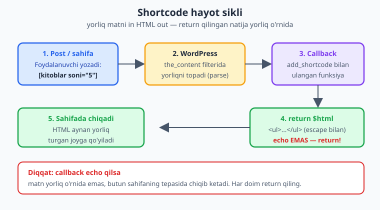
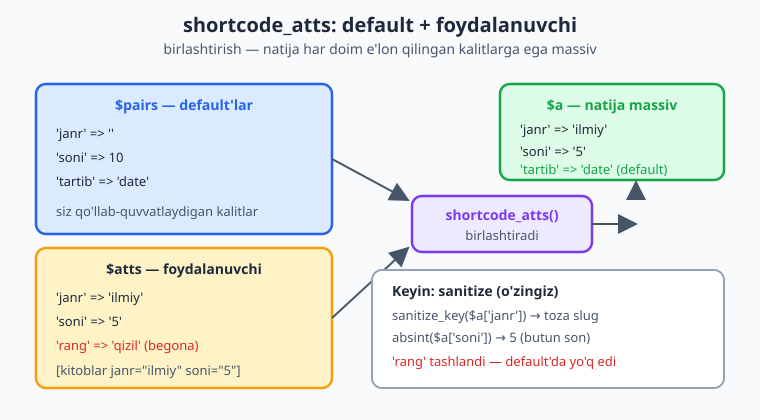
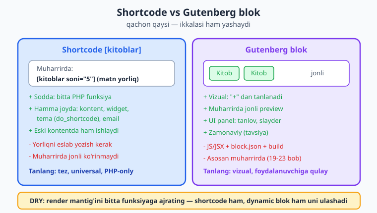

# 13 — Shortcode'lar

[⬅️ Oldingi: 12 — Xavfsizlik asoslari: nonce, sanitize, escape](./12-xavfsizlik-asoslari.md) · [🏠 README](./README.md) · [Keyingi: 14 — Skript va stillarni ulash (enqueue) ➡️](./14-enqueue-assets.md)

> **Bu bobda:** foydalanuvchi post yoki sahifaga oddiy matn yorlig'ini — masalan `[kitoblar janr="ilmiy" soni="5"]` — qo'yib, dinamik HTML chiqaradigan **shortcode** mexanizmini noldan o'rganamiz: `add_shortcode( $tag, $callback )` bilan ro'yxatga olish, callback'ning `($atts, $content, $tag)` imzosi va eng muhim qoida — `return` qilish (`echo` EMAS), `shortcode_atts()` bilan atributlarni default'lar bilan birlashtirish va sanitize qilish, `[kitkat]...[/kitkat]` ko'rinishidagi yopiluvchi (enclosing) shortcode'da `$content` va `do_shortcode()` ni ishlatish, `do_shortcode`/`shortcode_exists`/`remove_shortcode` yordamchilari, chiqishni kontekst bo'yicha escape qilish (`esc_html`/`esc_url`/`wp_kses_post`) hamda shortcode'ni Gutenberg blok bilan taqqoslab "qachon qaysi" degan savolga javob — barchasi "Kitoblar katalogi" plugin'ining `[kitoblar]` ro'yxati misolida.

---

## Muammo: foydalanuvchi HTML yoza olmaydi

Mijoz — kutubxona xodimi — sizga shunday vazifa beradi: "Men 'Biz haqimizda' sahifasining o'rtasiga, oddiy matn orasiga, eng so'nggi 5 ta ilmiy kitobning ro'yxatini joylashtirmoqchiman. Lekin men dasturchi emasman — PHP yoza olmayman, sahifa muharririga `<?php new WP_Query(...) ?>` deb yozish menga mumkin emas."

Va u haq. WordPress sahifa muharriri PHP'ni bajarmaydi — agar foydalanuvchi kontentga PHP kod yozsa, u oddiy matn bo'lib ko'rinadi (yoki o'chiriladi). Demak bizga kerak: **foydalanuvchi yoza oladigan oddiy, qisqa yorliq**, uni WordPress o'zi PHP funksiyaga aylantirib, natijasini o'sha joyga qo'yadi.

Aynan shu — **shortcode**. Foydalanuvchi kontentga `[kitoblar janr="ilmiy" soni="5"]` deb yozadi, WordPress uni o'qib, sizning PHP funksiyangizni chaqiradi, funksiya HTML qaytaradi va o'sha HTML yorliq turgan joyga qo'yiladi.

📌 **Shortcode nima?** Shortcode — kvadrat qavslar ichidagi yorliq (`[tag]`), uni WordPress kontent ichida topib, ro'yxatga olingan PHP callback'ingiz chaqiradi va callback qaytargan matn/HTML bilan **almashtiradi**. Ya'ni statik matn ichiga dinamik mazmun "ekishning" foydalanuvchiga qulay usuli.

WordPress'ning o'zida ham shortcode'lar bor: `[gallery]`, `[caption]`, `[embed]`, `[playlist]`. Biz endi o'zimizning `[kitoblar]` shortcode'ni yaratamiz.

> 💡 **Tayanch.** Bu bob sof PHP funksiyalari, massivlar va string ishlovi (`shortcode_atts`, ternary, `absint`) ga tayanadi. Notanish bo'lsa [PHP — Mutlaqo Noldan](../php/README.md) ga qaytib oling. Chiqishni escape qilish 12-bobda chuqur ko'rsatilgan.



---

## `add_shortcode()` — shortcode'ni ro'yxatga olish

Shortcode yaratishning yagona kaliti — bitta funksiya:

```php
add_shortcode( string $tag, callable $callback );
```

- `$tag` — yorliq nomi (kvadrat qavslar ichidagi so'z). `[kitoblar]` uchun `$tag` = `'kitoblar'`.
- `$callback` — yorliq topilganda chaqiriladigan funksiya (callable).

Eng oddiy misol — statik matn qaytaruvchi shortcode:

```php
<?php
declare( strict_types = 1 );

if ( ! defined( 'ABSPATH' ) ) {
    exit;
}

/**
 * [kitoblar_salom] — oddiy statik shortcode.
 */
function oqil_kk_salom_shortcode(): string {
    return '<p class="kk-salom">Kitoblar katalogiga xush kelibsiz!</p>';
}
add_shortcode( 'kitoblar_salom', 'oqil_kk_salom_shortcode' );
```

Endi foydalanuvchi istalgan post yoki sahifaga `[kitoblar_salom]` deb yozsa, o'sha joyda `<p>Kitoblar katalogiga...</p>` paydo bo'ladi.

⚠️ **`add_shortcode()` ni qaysi hook'da chaqirish kerak?** Eng xavfsizi — `init` hook'i (CPT va boshqa registratsiyalar bilan bir xil payt). To'g'ridan-to'g'ri plugin faylida (hook'siz) chaqirish ham odatda ishlaydi, chunki kontent shortcode'lari faqat so'rov payti (`the_content` filteri vaqtida) qayta ishlanadi — bu ancha kech. Lekin izchillik uchun biz `init` da ro'yxatga olamiz:

```php
add_action( 'init', static function (): void {
    add_shortcode( 'kitoblar_salom', 'oqil_kk_salom_shortcode' );
} );
```

### Eng muhim qoida: `return`, `echo` EMAS

Bu — yangi boshlovchilar eng ko'p qiladigan xato, shuning uchun alohida ta'kidlaymiz.

📌 **Shortcode callback'i natijani `return` qilishi SHART — `echo` qilmasin.** Rasmiy hujjat aniq aytadi: *"Shortcode chaqiradigan funksiya hech qanday chiqish ishlab chiqarmasligi kerak. Shortcode funksiyalari shortcode'ni almashtirish uchun ishlatiladigan matnni QAYTARISHI kerak. Chiqishni to'g'ridan-to'g'ri ishlab chiqarish kutilmagan natijalarga olib keladi."*

Nega? Chunki WordPress shortcode'ni `the_content` filteri ichida, butun post matni allaqachon to'plangan paytda qayta ishlaydi. Agar siz `echo` qilsangiz, matn shu zahoti **butun sahifaning eng tepasiga** (yoki kutilmagan joyga) chiqib ketadi — chunki u hali yig'ilayotgan kontent o'rniga, to'g'ridan-to'g'ri brauzerga yuboriladi. Yorliq turgan joyda esa hech narsa (yoki `1` — `echo` ning qaytgan qiymati) ko'rinadi.

```php
// ❌ XATO — echo qiladi: matn noto'g'ri joyda (odatda sahifa tepasida) chiqadi.
function oqil_kk_yomon_shortcode() {
    echo '<p>Bu matn noto\'g\'ri joyga chiqadi!</p>'; // YOMON
}

// ✅ TO'G'RI — return qiladi: matn aynan yorliq turgan joyda chiqadi.
function oqil_kk_yaxshi_shortcode(): string {
    return '<p>Bu matn to\'g\'ri joyda chiqadi.</p>';
}
```

> 💡 **Agar kodingiz ko'p `echo` qilsa-chi?** Buffer ishlating: callback boshida `ob_start()`, oxirida `return ob_get_clean();`. Bu `echo` qilingan hamma narsani string'ga to'playdi va uni qaytaradi. Lekin imkon bo'lsa, to'g'ridan-to'g'ri string yig'ish (`$html .= ...`) toza va tezroq.

---

## Callback imzosi: `$atts`, `$content`, `$tag`

WordPress har bir shortcode callback'iga uchta argument uzatadi — aynan shu tartibda:

```php
function callback( $atts, $content = null, $tag = '' ) { /* ... */ }
```

- `$atts` — foydalanuvchi yozgan atributlar massivi. **Diqqat:** atribut umuman bo'lmasa, `$atts` massiv emas, **bo'sh string `''`** bo'ladi (WordPress'ning tarixiy o'ziga xosligi). Shuning uchun `shortcode_atts()` ishlatamiz — u buni o'zi to'g'ri qabul qiladi.
- `$content` — yopiluvchi shortcode'da ichki matn (`[tag]...bu yer...[/tag]`); o'z-o'zidan yopiluvchi `[tag]` uchun `null`.
- `$tag` — yorliqning o'zi (`'kitoblar'`). Bitta callback bir nechta shortcode'ga ulanganda foydali.

⚠️ Ko'p qo'llanmalarda uchinchi parametr `$shortcode_tag` deb ataladi — bu shunchaki nom; rasmiy imzo "atributlar massivi, kontent yoki null, va nihoyat shortcode'ning o'zi — shu tartibda" deydi. Tartib muhim, nom emas.

---

## Atributlar: `shortcode_atts()` bilan default'lar va sanitize

Foydalanuvchi `[kitoblar janr="ilmiy" soni="5"]` yozadi. Sizga kerak: agar u `soni` ni yozmasa — standart `10`; agar `janr` ni yozmasa — barcha janrlar. Bundan tashqari, foydalanuvchi kiritgan qiymatlarga **ishonib bo'lmaydi** — ularni sanitize qilish kerak (foydalanuvchi roli past bo'lishi yoki qiymat zararli bo'lishi mumkin).

Buni `shortcode_atts()` hal qiladi:

```php
shortcode_atts( array $pairs, array $atts, string $shortcode = '' ): array;
```

- `$pairs` — qo'llab-quvvatlanadigan barcha atributlar va ularning **default** qiymatlari (massiv).
- `$atts` — foydalanuvchi yozgan atributlar (callback'dagi `$atts`).
- `$shortcode` — (ixtiyoriy) shortcode nomi; berilsa, `shortcode_atts_{$shortcode}` filteri yoqiladi (boshqa kodlar atributlarni dasturiy o'zgartira oladi).

Ishlash mantig'i: `shortcode_atts()` `$pairs` (default'lar) bilan `$atts` (foydalanuvchi qiymatlari) ni **birlashtiradi** — faqat siz default'da e'lon qilgan kalitlar qoladi (begona atributlar tashlanadi), foydalanuvchi bergan kalitlar default'ni almashtiradi.

```php
function oqil_kk_kitoblar_shortcode( $atts ): string {
    // 1) Default'lar bilan birlashtiramiz — natija HAR DOIM shu kalitlarga ega massiv.
    $a = shortcode_atts(
        [
            'janr' => '',   // bo'sh = barcha janrlar
            'soni' => 10,   // standart 10 ta
        ],
        $atts,
        'kitoblar'          // filter konteksti uchun
    );

    // 2) Endi qiymatlarni SANITIZE qilamiz — foydalanuvchiga ishonmaymiz.
    $janr = sanitize_key( $a['janr'] ); // faqat kichik harf, raqam, _, -
    $soni = absint( $a['soni'] );        // manfiy bo'lmagan butun son
    if ( 0 === $soni ) {
        $soni = 10; // 0 yoki yaroqsiz bo'lsa, standartga qaytamiz
    }

    return sprintf(
        '<p>Janr: %s, soni: %d</p>',
        esc_html( $janr ),
        $soni
    );
}
add_shortcode( 'kitoblar', 'oqil_kk_kitoblar_shortcode' );
```

📌 **`shortcode_atts()` sanitize QILMAYDI** — u faqat default'lar bilan birlashtiradi. Sanitize'ni o'zingiz qilasiz: `sanitize_key()`, `absint()`, `sanitize_text_field()` va h.k. (12-bobdagi qoidalar). Bu — eng tez unutiladigan xavfsizlik nuqtasi.



⚠️ Atribut qiymatlari **har doim string** bo'lib keladi — `[kitoblar soni="5"]` da `$atts['soni']` = `"5"` (string), `5` (int) emas. Shuning uchun `absint()` yoki `(int)` bilan o'giring. Mantiqiy (boolean) atributlar uchun `filter_var( $a['flag'], FILTER_VALIDATE_BOOLEAN )` ishlating, chunki `"false"` (string) PHP'da `true` deb baholanadi.

---

## To'liq namuna: `[kitoblar]` — janr bo'yicha ro'yxat

Endi haqiqiy ish: `[kitoblar janr="ilmiy" soni="5"]` 7-bobdagi `kitob` CPT va 8-bobdagi `janr` taxonomiyasidan foydalanib, kitoblar ro'yxatini chiqarsin. So'rov uchun `WP_Query` ishlatamiz (`query_posts()` EMAS — u global so'rovni buzadi).

```php
<?php
/**
 * Kitoblar katalogi — [kitoblar] shortcode.
 *
 * @package Oqil\KitobKatalog
 */

declare( strict_types = 1 );

if ( ! defined( 'ABSPATH' ) ) {
    exit;
}

/**
 * [kitoblar janr="ilmiy" soni="5"] — janr bo'yicha kitoblar ro'yxati.
 *
 * @param array|string $atts Foydalanuvchi atributlari (atribut yo'q bo'lsa '').
 * @return string Yorliq o'rniga qo'yiladigan HTML.
 */
function oqil_kk_kitoblar_shortcode( $atts ): string {
    // 1) Default'lar bilan birlashtirish.
    $a = shortcode_atts(
        [
            'janr'   => '',
            'soni'   => 10,
            'tartib' => 'date', // date | title
        ],
        $atts,
        'kitoblar'
    );

    // 2) Sanitize — foydalanuvchi kiritmasiga ishonmaymiz.
    $janr   = sanitize_key( $a['janr'] );
    $soni   = absint( $a['soni'] );
    $soni   = ( $soni > 0 && $soni <= 50 ) ? $soni : 10; // 1..50 oralig'i
    $tartib = in_array( $a['tartib'], [ 'date', 'title' ], true ) ? $a['tartib'] : 'date';

    // 3) WP_Query argumentlari.
    $args = [
        'post_type'           => 'kitob',
        'post_status'         => 'publish',
        'posts_per_page'      => $soni,
        'orderby'             => $tartib,
        'order'               => ( 'title' === $tartib ) ? 'ASC' : 'DESC',
        'ignore_sticky_posts' => true,
        'no_found_rows'       => true, // sahifalash kerak emas — tezroq (26-bob).
    ];

    // Janr berilgan bo'lsa, taxonomiya bo'yicha filtrlash.
    if ( '' !== $janr ) {
        $args['tax_query'] = [
            [
                'taxonomy' => 'janr',
                'field'    => 'slug',
                'terms'    => $janr,
            ],
        ];
    }

    $query = new WP_Query( $args );

    if ( ! $query->have_posts() ) {
        return '<p class="kk-bosh">' . esc_html__( 'Kitob topilmadi.', 'kitoblar-katalogi' ) . '</p>';
    }

    // 4) HTML'ni string'ga yig'amiz va kontekst bo'yicha escape qilamiz.
    $html = '<ul class="kk-kitoblar">';
    while ( $query->have_posts() ) {
        $query->the_post();
        $html .= sprintf(
            '<li><a href="%1$s">%2$s</a></li>',
            esc_url( get_permalink() ),   // URL konteksti
            esc_html( get_the_title() )    // matn konteksti
        );
    }
    $html .= '</ul>';

    // 5) Global post holatini tiklash — SHART (aks holda keyingi loop buziladi).
    wp_reset_postdata();

    return $html;
}
add_action( 'init', static function (): void {
    add_shortcode( 'kitoblar', 'oqil_kk_kitoblar_shortcode' );
} );
```

📌 **Uchta hayotiy muhim nuqta bu kodda:**

1. **Chiqishni escape qiling.** Hatto sarlavha/permalink WordPress'dan kelsa ham — ularni `esc_html()` / `esc_url()` bilan o'rang. Bu — chuqur mudofaa (12-bob): hech narsaga ishonmang.
2. **`wp_reset_postdata()`** ni `WP_Query` loop'idan keyin chaqiring. Shortcode `the_content` ichida ishlaydi — agar global `$post` ni tiklamasangiz, shortcode'dan keyingi kontent noto'g'ri postga tegishli bo'lib qoladi.
3. **`return $html`** — string qaytaramiz, `echo` qilmaymiz. Yuqoridagi eng muhim qoida.

> ℹ️ **Jonli sinov (o'z saytingizda).** Bu kodni plugin'ingizga qo'shing, bir nechta `kitob` yozuvi va `janr` term'ini yarating, so'ng istalgan sahifaga `[kitoblar janr="ilmiy" soni="3"]` yozib chop eting. Sahifada o'sha 3 ta kitob ro'yxati paydo bo'ladi. `php -l` faqat sintaksisni tekshiradi — natijani ko'rish uchun ishlab turgan WordPress kerak.

⚠️ **`echo do_shortcode()` ni temada ishlatish.** Agar shortcode'ni post kontentida emas, balki **tema fayli** ichida (masalan `single-kitob.php`) ishlatmoqchi bo'lsangiz, `echo do_shortcode( '[kitoblar soni="5"]' );` yozasiz — chunki tema PHP'si shortcode'ni avtomatik qayta ishlamaydi (faqat `the_content` qiladi).

---

## Yopiluvchi (enclosing) shortcode: `$content` va `do_shortcode()`

Hozirgacha o'z-o'zidan yopiluvchi `[kitoblar]` ni ko'rdik. WordPress yana **yopiluvchi** (enclosing) shortcode'ni qo'llab-quvvatlaydi — ochuvchi va yopuvchi yorliq orasiga kontent qo'yiladi:

```text
[kitkat_quti turi="ogohlantirish"]
Bu kitob hozircha mavjud emas.
[/kitkat_quti]
```

Bu yerda yorliqlar orasidagi matn callback'ga **`$content`** sifatida keladi. Foydalanuvchi matnni "o'rab" qo'yadigan shortcode'lar (xabar qutilari, akkordeon, ustun) uchun ideal.

```php
/**
 * [kitkat_quti turi="..."]matn[/kitkat_quti] — kontentni qutiga o'raydi.
 *
 * @param array|string $atts    Atributlar.
 * @param string|null  $content Yorliqlar orasidagi kontent.
 * @return string
 */
function oqil_kk_quti_shortcode( $atts, $content = null ): string {
    $a = shortcode_atts(
        [ 'turi' => 'info' ],
        $atts,
        'kitkat_quti'
    );

    // Faqat ruxsat etilgan turlardan birini tanlaymiz (whitelist).
    $turi  = in_array( $a['turi'], [ 'info', 'ogohlantirish', 'xato' ], true ) ? $a['turi'] : 'info';
    $klass = 'kk-quti kk-quti--' . $turi;

    // $content NULL bo'lishi mumkin — bo'sh string'ga aylantiramiz.
    $content = (string) $content;

    return sprintf(
        '<div class="%1$s">%2$s</div>',
        esc_attr( $klass ),            // class atributi konteksti
        wp_kses_post( do_shortcode( $content ) ) // ichki shortcode + xavfsiz HTML
    );
}
add_action( 'init', static function (): void {
    add_shortcode( 'kitkat_quti', 'oqil_kk_quti_shortcode' );
} );
```

📌 **Ikkita kalit nuqta yopiluvchi shortcode'da:**

1. **`do_shortcode( $content )`** — ichki kontentdagi boshqa shortcode'larni qayta ishlash uchun. Agar foydalanuvchi `[kitkat_quti]Mana: [kitoblar soni="2"][/kitkat_quti]` yozsa, ichidagi `[kitoblar]` ham bajariladi. `do_shortcode()` siz u oddiy matn bo'lib qolardi.
2. **`wp_kses_post( $content )`** — kontent foydalanuvchidan keladi, demak unga ishonmaymiz. `wp_kses_post()` faqat post kontentida ruxsat etilgan HTML teglarini qoldiradi (`<script>` va xavfli atributlarni olib tashlaydi). Bu — boy matn (HTML) chiqaradigan joyda to'g'ri escape funksiyasi.

⚠️ **`esc_html( $content )` qilmang** bunday joyda — u foydalanuvchi yozgan `<strong>` ni ham matnga aylantiradi (`&lt;strong&gt;`). Boy matn uchun `wp_kses_post()`, oddiy matn uchun `esc_html()`. Kontekst hal qiladi (12-bob).

> 💡 **`$content` bo'sh bo'lishi mumkin.** Foydalanuvchi `[kitkat_quti][/kitkat_quti]` (ichi bo'sh) yoki o'z-o'zidan yopiluvchi `[kitkat_quti]` yozsa, `$content` mos ravishda `''` yoki `null` bo'ladi. `(string) $content` bilan himoyalanamiz.

---

## Yordamchi funksiyalar: `do_shortcode`, `shortcode_exists`, `remove_shortcode`

WordPress shortcode'lar bilan ishlash uchun yana bir nechta foydali funksiya beradi:

| Funksiya | Imzo | Nima qiladi |
|---|---|---|
| `do_shortcode()` | `do_shortcode( string $content, bool $ignore_html = false ): string` | Matn ichidagi shortcode'larni topib bajaradi va natija bilan almashtiradi. Temada qo'lda shortcode "ijro etish" uchun. |
| `shortcode_exists()` | `shortcode_exists( string $tag ): bool` | Berilgan nomli shortcode ro'yxatga olinganmi — `true`/`false`. |
| `remove_shortcode()` | `remove_shortcode( string $tag ): void` | Ro'yxatga olingan shortcode'ni o'chiradi (masalan boshqa plugin'nikini bekor qilish). |

```php
// Shortcode ro'yxatda bormi — tekshirib, keyin qayta ulaymiz.
if ( shortcode_exists( 'kitoblar' ) ) {
    remove_shortcode( 'kitoblar' );
}
add_shortcode( 'kitoblar', 'oqil_kk_kitoblar_shortcode' );

// Temada (the_content tashqarisida) shortcode'ni bajarish.
echo do_shortcode( '[kitoblar janr="ilmiy" soni="3"]' );
```

⚠️ **`do_shortcode()` chiqishini ham escape qiling** agar u foydalanuvchi kiritmasidan kelgan bo'lsa. `do_shortcode()` ishonchli emas — natija shortcode callback'lariga bog'liq. Tema ichida o'z ishonchli shortcode'ingizni bajarsangiz, qo'shimcha escape shart emas (callback ichida allaqachon escape qildingiz); foydalanuvchi matnini `do_shortcode` qilsangiz, `wp_kses_post()` bilan o'rang (yuqoridagi `[kitkat_quti]` misolidagidek).

> ℹ️ `do_shortcode()` ning ikkinchi argumenti `$ignore_html` — `true` bo'lsa, HTML elementlari ichidagi shortcode'lar o'tkazib yuboriladi. Kamdan-kam kerak; standart `false` ko'pchilik holatga to'g'ri keladi.

---

## Shortcode vs Gutenberg blok: qachon qaysi?

WordPress 5.0 dan beri **Gutenberg blok muharriri** shortcode'larning zamonaviy alternativasi. Tabiiy savol: yangi loyihada qaysi birini tanlash?



| Jihat | Shortcode `[kitoblar]` | Gutenberg blok |
|---|---|---|
| Foydalanuvchi tajribasi | Matn yorlig'ini eslab yozish kerak | Vizual, "+" tugmasidan tanlanadi, jonli ko'rinish |
| Muharrirda ko'rinish | Faqat yorliq matni (`[kitoblar]`) | Real natija (yoki preview) muharrirda ko'rinadi |
| Yozish murakkabligi | Bir PHP funksiya — **oddiy** | JS/JSX + `block.json` + build (19-23 boblar) |
| Qayerda ishlaydi | **Hamma joyda**: kontent, widget, tema (`do_shortcode`), email, eski post | Asosan blok muharririda |
| Atributlar | Matnli (`janr="ilmiy"`) | UI panel (tanlovlar, slayderlar) |
| Eski kontentga moslik | Yillar davomidagi postlarda ishlaydi | Yangi |

📌 **Amaliy qoida (2026):** Yangi, foydalanuvchiga qulay vizual element kerak bo'lsa — **blok** zamonaviyroq va tavsiya etiladi. Lekin shortcode **hali ham keng tarqalgan va o'lmagan**: u soddaroq (faqat PHP), hamma joyda (widget, tema fayllari, hatto email shablonlari) ishlaydi va eski kontentni qo'llab-quvvatlaydi. Ko'p plugin'lar **ikkalasini** beradi: bir xil PHP render mantig'ini ham shortcode, ham **dynamic blok** (21-bob) `render_callback` orqali ulashadi.

> 💡 **DRY yondashuv.** Render mantig'ini bitta funksiyaga (`oqil_kk_kitoblar_render( array $args ): string`) ajrating. So'ng shortcode callback'i ham, dynamic blok `render_callback` i ham shu bitta funksiyani chaqiradi. Bir marta yozasiz — ikki joyda ishlatasiz. Dynamic bloklarni 21-bobda ko'ramiz.

⚠️ Gutenberg muharririda **klassik "Shortcode" bloki** ham bor — foydalanuvchi shortcode'ni shu blokka yozadi. Ya'ni sizning shortcode'ingiz blok muharririda ham, klassik muharrirda ham, widget'da ham bemalol ishlaydi. Shu sababli shortcode hamon "universal" yechim.

---

## Tez-tez uchraydigan xatolar

⚠️ **Matn yorliq o'rniga sahifa tepasida chiqadi.** Callback `echo` qilyapti — `return` ga o'zgartiring.

⚠️ **`[kitoblar]` yorliq matn sifatida ko'rinadi (qayta ishlanmaydi).** Shortcode ro'yxatga olinmagan (`add_shortcode` chaqirilmagan yoki tag nomi mos kelmaydi), yoki uni `the_content` filteri qayta ishlamaydigan joyga (masalan custom field, `do_shortcode`'siz tema fayli) yozgansiz.

⚠️ **Shortcode'dan keyingi kontent noto'g'ri postga tegishli.** `WP_Query` loop'idan keyin `wp_reset_postdata()` ni unutgansiz.

⚠️ **`$atts` bo'yicha `array_map`/`foreach` xato beradi.** Atribut bo'lmasa `$atts` — bo'sh string, massiv emas. Har doim avval `shortcode_atts()` orqali o'tkazing — u massivni kafolatlaydi.

⚠️ **Atribut soni har doim string.** `[kitoblar soni="5"]` da `$atts['soni']` = `"5"`. `absint()`/`(int)` bilan o'giring; boolean uchun `FILTER_VALIDATE_BOOLEAN`.

📌 **Eskirgan/yomon amaliyotlar (QILMANG):** shortcode ichida `query_posts()` (global so'rovni buzadi — `WP_Query` ishlating); chiqishni escape qilmaslik (XSS); `echo` qilish; `extract( $atts )` (o'zgaruvchilarni yashirin yaratadi, o'qishni qiyinlashtiradi — tushunarli `$a['kalit']` ishlating).

---

## Xulosa

- **Shortcode** — `[kitoblar]` kabi yorliq; foydalanuvchi kontentga yozadi, WordPress uni PHP callback'ingiz qaytargan HTML bilan almashtiradi.
- `add_shortcode( $tag, $callback )` bilan ro'yxatga olinadi (odatda `init` da).
- Callback imzosi: `function( $atts, $content = null, $tag = '' )` — aynan shu tartib.
- **Eng muhim qoida:** callback natijani **`return`** qiladi, **`echo` qilmaydi** (echo bo'lsa kontent noto'g'ri joyda chiqadi).
- `shortcode_atts( $defaults, $atts, $shortcode )` — default'lar bilan birlashtiradi (sanitize QILMAYDI — uni o'zingiz qiling: `sanitize_key`, `absint`, `sanitize_text_field`).
- Yopiluvchi shortcode'da `$content` ishlatiladi; ichki shortcode'lar uchun `do_shortcode( $content )`, xavfsiz boy matn uchun `wp_kses_post()`.
- Chiqishni **kontekst bo'yicha escape** qiling: `esc_html` (matn), `esc_url` (URL), `esc_attr` (atribut), `wp_kses_post` (boy HTML).
- Yordamchilar: `do_shortcode()`, `shortcode_exists()`, `remove_shortcode()`.
- Shortcode vs blok: blok zamonaviyroq va vizual, lekin shortcode soddaroq va hamma joyda ishlaydi — render mantig'ini ajratib, ikkalasiga ulashing.

Keyingi bobda shortcode'imiz chiqargan HTML'ga **stil va skript** ulashni — `wp_enqueue_style` / `wp_enqueue_script` ni to'g'ri ishlatishni — o'rganamiz.

---

## 13-bob mashqlari

> Mashqlarni o'z lokal WordPress saytingizda (02-bob: `wp-env`/Docker) bajaring. Har bir PHP misolni `php -l` bilan sintaksis jihatdan tekshiring, natijani esa ishlab turgan saytda ko'ring.

**1 (Oson).** Shortcode callback'i natijani `echo` qilsa nima bo'ladi va nima uchun? To'g'ri yondashuv qanday?

**2 (Oson).** `add_shortcode()` ning ikkita argumenti nima? `[kitoblar]` shortcode'i uchun birinchi argument qanday qiymat bo'ladi?

**3 (Oson).** Callback imzosidagi uchta parametrni tartibi bilan ayting. Atribut umuman berilmasa, birinchi parametr (`$atts`) qaysi turdagi qiymat bo'ladi?

**4 (Oson).** `[salom]` nomli shortcode yozing: u doim `<p>Assalomu alaykum!</p>` qaytarsin. To'g'ri (`return`) yondashuvni ishlating.

<details markdown="1">
<summary>Yechim</summary>

```php
function oqil_kk_salom( $atts ): string {
    return '<p>Assalomu alaykum!</p>';
}
add_action( 'init', static function (): void {
    add_shortcode( 'salom', 'oqil_kk_salom' );
} );
```

`return` ishlatdik — `echo` emas, shuning uchun matn aynan yorliq turgan joyda chiqadi.
</details>

**5 (O'rta).** `shortcode_atts()` ning vazifasi nima va u sanitize qiladimi? `[kitoblar soni="5"]` da `$atts['soni']` qaysi turdagi qiymat bo'ladi va nega `absint()` kerak?

**6 (O'rta).** `[matn rang="qizil" olcham="katta"]` shortcode yozing: `rang` default `qora`, `olcham` default `urta`. Ikkala atributni `sanitize_key()` bilan tozalang va `<span style="...">` ichida emas, balki CSS klass (`matn--qizil matn--katta`) sifatida chiqaring (escape bilan).

<details markdown="1">
<summary>Yechim</summary>

```php
function oqil_kk_matn_shortcode( $atts, $content = null ): string {
    $a = shortcode_atts(
        [ 'rang' => 'qora', 'olcham' => 'urta' ],
        $atts,
        'matn'
    );
    $rang   = sanitize_key( $a['rang'] );
    $olcham = sanitize_key( $a['olcham'] );
    $klass  = sprintf( 'matn--%s matn--%s', $rang, $olcham );

    return sprintf(
        '<span class="%1$s">%2$s</span>',
        esc_attr( $klass ),
        wp_kses_post( (string) $content )
    );
}
add_action( 'init', static function (): void {
    add_shortcode( 'matn', 'oqil_kk_matn_shortcode' );
} );
```

Inline `style` o'rniga CSS klass — bu xavfsizroq va stillarni 14-bobda (enqueue) markazlashtirib boshqarish imkonini beradi. Klass `esc_attr()` bilan, kontent `wp_kses_post()` bilan escape qilingan.
</details>

**7 (O'rta).** Yopiluvchi shortcode `[diqqat]...[/diqqat]` yozing: ichki matnni `<div class="kk-diqqat">` ichiga o'rasin, ichidagi boshqa shortcode'lar ham ishlasin (`do_shortcode`) va kontent `wp_kses_post()` bilan xavfsiz chiqsin.

<details markdown="1">
<summary>Yechim</summary>

```php
function oqil_kk_diqqat_shortcode( $atts, $content = null ): string {
    return sprintf(
        '<div class="kk-diqqat">%s</div>',
        wp_kses_post( do_shortcode( (string) $content ) )
    );
}
add_action( 'init', static function (): void {
    add_shortcode( 'diqqat', 'oqil_kk_diqqat_shortcode' );
} );
```

`do_shortcode( $content )` ichki shortcode'larni qayta ishlaydi, `wp_kses_post()` xavfli HTML'ni olib tashlaydi, `(string)` esa `$content` `null` bo'lganda himoya qiladi.
</details>

**8 (O'rta).** Nima uchun `WP_Query` loop'idan keyin `wp_reset_postdata()` chaqirish shart? Uni unutib qo'ysangiz, shortcode'dan keyingi kontentda qanday muammo paydo bo'ladi?

**9 (O'rta).** `[kitkat_soni]` shortcode yozing: u `wp_count_posts( 'kitob' )` yordamida chop etilgan kitoblar sonini qaytarsin (masalan "Katalogda 42 ta kitob bor."). Sonni `absint()` bilan o'rang.

<details markdown="1">
<summary>Yechim</summary>

```php
function oqil_kk_soni_shortcode( $atts ): string {
    $hisob = wp_count_posts( 'kitob' );
    // wp_count_posts obyekt qaytaradi; publish — chop etilganlar soni.
    $soni  = isset( $hisob->publish ) ? absint( $hisob->publish ) : 0;

    return sprintf(
        '<p class="kk-soni">%s</p>',
        esc_html( sprintf(
            /* translators: %d — kitoblar soni. */
            __( 'Katalogda %d ta kitob bor.', 'kitoblar-katalogi' ),
            $soni
        ) )
    );
}
add_action( 'init', static function (): void {
    add_shortcode( 'kitkat_soni', 'oqil_kk_soni_shortcode' );
} );
```

`wp_count_posts()` obyekt qaytaradi (`publish`, `draft`, ...). Sonni `absint()` bilan tozaladik, butun matnni `esc_html()` bilan o'radik. `sprintf` + `__()` i18n uchun (24-bob).
</details>

**10 (Qiyin).** To'liq, ishlaydigan `[kitoblar]` shortcode yozing (bobdagi namuna asosida): `janr`, `soni` (1..20, default 10), `tartib` (`date`/`title`) atributlarini qabul qilsin; `WP_Query` bilan `kitob` CPT'dan tortib olsin; ro'yxatni `<ul>` da har bir element havola (`esc_url` + `esc_html`) bilan chiqarsin; kitob topilmasa do'stona xabar bersin; `wp_reset_postdata()` ni chaqirsin; barchasi `return` qilinsin.

<details markdown="1">
<summary>Yechim</summary>

```php
function oqil_kk_kitoblar_shortcode( $atts ): string {
    $a = shortcode_atts(
        [ 'janr' => '', 'soni' => 10, 'tartib' => 'date' ],
        $atts,
        'kitoblar'
    );

    $janr   = sanitize_key( $a['janr'] );
    $soni   = absint( $a['soni'] );
    $soni   = ( $soni >= 1 && $soni <= 20 ) ? $soni : 10;
    $tartib = in_array( $a['tartib'], [ 'date', 'title' ], true ) ? $a['tartib'] : 'date';

    $args = [
        'post_type'           => 'kitob',
        'post_status'         => 'publish',
        'posts_per_page'      => $soni,
        'orderby'             => $tartib,
        'order'               => ( 'title' === $tartib ) ? 'ASC' : 'DESC',
        'ignore_sticky_posts' => true,
        'no_found_rows'       => true,
    ];

    if ( '' !== $janr ) {
        $args['tax_query'] = [
            [
                'taxonomy' => 'janr',
                'field'    => 'slug',
                'terms'    => $janr,
            ],
        ];
    }

    $query = new WP_Query( $args );

    if ( ! $query->have_posts() ) {
        return '<p class="kk-bosh">' . esc_html__( 'Kitob topilmadi.', 'kitoblar-katalogi' ) . '</p>';
    }

    $html = '<ul class="kk-kitoblar">';
    while ( $query->have_posts() ) {
        $query->the_post();
        $html .= sprintf(
            '<li><a href="%1$s">%2$s</a></li>',
            esc_url( get_permalink() ),
            esc_html( get_the_title() )
        );
    }
    $html .= '</ul>';

    wp_reset_postdata();

    return $html;
}
add_action( 'init', static function (): void {
    add_shortcode( 'kitoblar', 'oqil_kk_kitoblar_shortcode' );
} );
```

Diqqat qiling: atributlar sanitize qilingan va oraliqqa siqilgan; `tax_query` faqat janr berilganda qo'shilgan; har element `esc_url`/`esc_html` bilan escape qilingan; `wp_reset_postdata()` global postni tiklaydi; va hammasi `return` qilingan.
</details>

**11 (Qiyin).** "DRY" tamoyilini qo'llang: render mantig'ini `oqil_kk_kitoblar_render( array $args ): string` funksiyasiga ajrating, so'ng shortcode callback'i shu funksiyani chaqirsin. Bu keyinchalik (21-bob) dynamic blok `render_callback`'i uchun ham qanday qayta ishlatilishini izohlang.

<details markdown="1">
<summary>Yechim</summary>

```php
/**
 * Yagona render mantig'i — shortcode VA dynamic blok shu funksiyani ulashadi.
 *
 * @param array{janr:string,soni:int,tartib:string} $args Tozalangan argumentlar.
 * @return string HTML.
 */
function oqil_kk_kitoblar_render( array $args ): string {
    $q_args = [
        'post_type'           => 'kitob',
        'post_status'         => 'publish',
        'posts_per_page'      => $args['soni'],
        'orderby'             => $args['tartib'],
        'order'               => ( 'title' === $args['tartib'] ) ? 'ASC' : 'DESC',
        'ignore_sticky_posts' => true,
        'no_found_rows'       => true,
    ];
    if ( '' !== $args['janr'] ) {
        $q_args['tax_query'] = [
            [ 'taxonomy' => 'janr', 'field' => 'slug', 'terms' => $args['janr'] ],
        ];
    }

    $query = new WP_Query( $q_args );
    if ( ! $query->have_posts() ) {
        return '<p class="kk-bosh">' . esc_html__( 'Kitob topilmadi.', 'kitoblar-katalogi' ) . '</p>';
    }

    $html = '<ul class="kk-kitoblar">';
    while ( $query->have_posts() ) {
        $query->the_post();
        $html .= sprintf(
            '<li><a href="%1$s">%2$s</a></li>',
            esc_url( get_permalink() ),
            esc_html( get_the_title() )
        );
    }
    $html .= '</ul>';
    wp_reset_postdata();

    return $html;
}

/**
 * Shortcode — faqat atributlarni tozalab, render funksiyasiga uzatadi.
 */
function oqil_kk_kitoblar_shortcode( $atts ): string {
    $a    = shortcode_atts( [ 'janr' => '', 'soni' => 10, 'tartib' => 'date' ], $atts, 'kitoblar' );
    $soni = absint( $a['soni'] );

    return oqil_kk_kitoblar_render( [
        'janr'   => sanitize_key( $a['janr'] ),
        'soni'   => ( $soni >= 1 && $soni <= 20 ) ? $soni : 10,
        'tartib' => in_array( $a['tartib'], [ 'date', 'title' ], true ) ? $a['tartib'] : 'date',
    ] );
}
add_action( 'init', static function (): void {
    add_shortcode( 'kitoblar', 'oqil_kk_kitoblar_shortcode' );
} );
```

Endi `oqil_kk_kitoblar_render()` so'rov va HTML mantig'ini bitta joyda saqlaydi. 21-bobda dynamic blok yaratganimizda, blok `render_callback`'i ham aynan shu funksiyani chaqiradi — bir xil natija, nol takrorlanish. Shortcode va blok faqat "kirish" (atributlar) ni tayyorlaydi, render esa umumiy.
</details>

**12 (Qiyin).** Ishonchli (whitelist) boshqaruv shortcode yozing: `[kitkat_quti turi="..."]...[/kitkat_quti]` faqat `info`, `ogohlantirish`, `xato` turlaridan birini qabul qilsin (boshqasi `info` ga tushsin), kontentni `do_shortcode` + `wp_kses_post` bilan chiqarsin, klassni `esc_attr` bilan escape qilsin. Nega `turi` ni whitelist qilish kerak — `esc_attr` o'zi yetmaydimi?

<details markdown="1">
<summary>Yechim</summary>

```php
function oqil_kk_quti_shortcode( $atts, $content = null ): string {
    $a    = shortcode_atts( [ 'turi' => 'info' ], $atts, 'kitkat_quti' );
    $turi = in_array( $a['turi'], [ 'info', 'ogohlantirish', 'xato' ], true ) ? $a['turi'] : 'info';

    return sprintf(
        '<div class="kk-quti kk-quti--%1$s">%2$s</div>',
        esc_attr( $turi ),
        wp_kses_post( do_shortcode( (string) $content ) )
    );
}
add_action( 'init', static function (): void {
    add_shortcode( 'kitkat_quti', 'oqil_kk_quti_shortcode' );
} );
```

`esc_attr()` faqat **chiqish xavfsizligi**ni ta'minlaydi (tirnoq/qavslarni neytrallaydi, HTML buzilmaydi). Lekin u **qiymatni cheklamaydi** — foydalanuvchi `turi="qornli-buzgunchi"` yozsa, `esc_attr` uni bemalol o'tkazadi va CSS klassingiz `kk-quti--qornli-buzgunchi` bo'ladi (stilsiz, lekin zararsiz). Whitelist (`in_array(..., true)`) esa qiymatni **ma'lum, ruxsat etilgan** to'plamga cheklaydi — bu validatsiya, escape emas. To'g'ri amaliyot: validatsiya (whitelist) + escape (`esc_attr`) **birga**.
</details>

---

[⬅️ Oldingi: 12 — Xavfsizlik asoslari: nonce, sanitize, escape](./12-xavfsizlik-asoslari.md) · [🏠 README](./README.md) · [Keyingi: 14 — Skript va stillarni ulash (enqueue) ➡️](./14-enqueue-assets.md)
