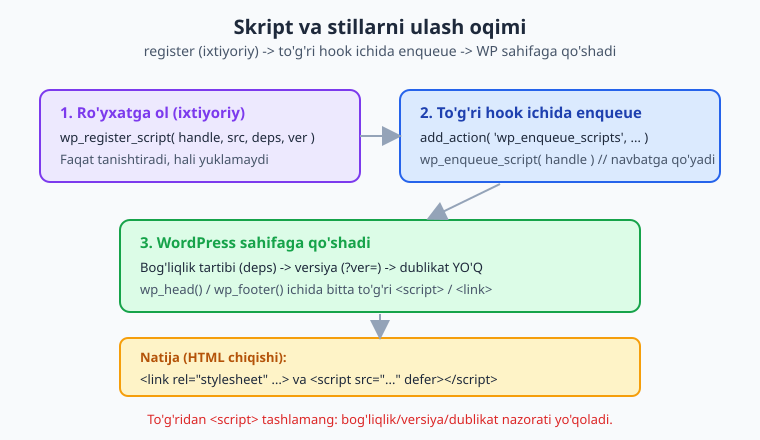
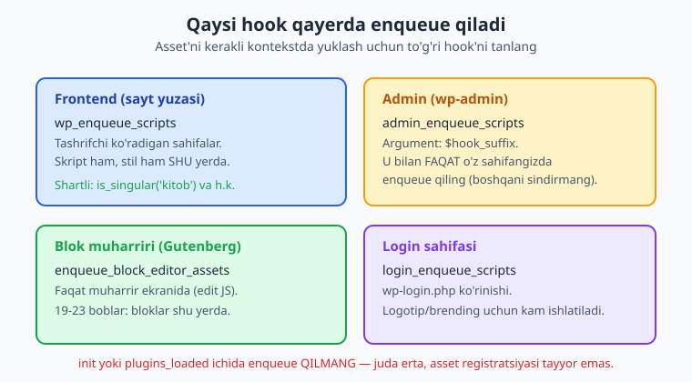
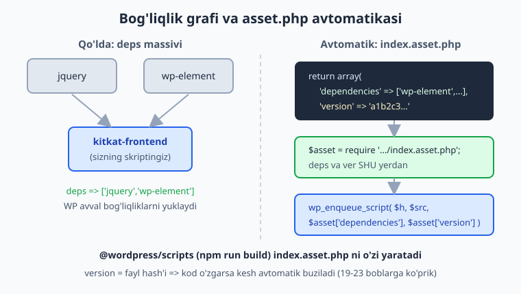

# 14 — Skript va stillarni ulash (enqueue)

[⬅️ Oldingi: 13 — Shortcode'lar](./13-shortcode.md) · [🏠 README](./README.md) · [Keyingi: 15 — AJAX (admin-ajax va zamonaviy) ➡️](./15-ajax.md)

> **Bu bobda:** plugin'imizning CSS va JavaScript fayllarini WordPress'ga TO'G'RI yo'l bilan ulashni o'rganamiz — nega to'g'ridan `<script>`/`<link>` tashlash xato ekanini, `wp_enqueue_script()`/`wp_enqueue_style()` imzolarini (jumladan WP 6.3+ `$args` massivi — `in_footer`, `strategy` => `defer`/`async`), `wp_register_*` bilan ro'yxatga olib keyin shartli enqueue qilishni, to'g'ri hook'larni (`wp_enqueue_scripts` frontend, `admin_enqueue_scripts` admin, `enqueue_block_editor_assets` blok muharriri, `login_enqueue_scripts`), `filemtime()`/plugin versiyasi bilan kesh buzishni, PHP'dan JS'ga ma'lumot uzatishning zamonaviy yo'lini (`wp_add_inline_script`; `wp_localize_script` endi faqat i18n/URL uchun), va `@wordpress/scripts` ning `index.asset.php` ko'prigini "Kitoblar katalogi" plugin'imiz misolida ko'ramiz.

---

## Muammo: plugin'ga o'z CSS va JS kerak

`kitoblar-katalogi` plugin'imiz endi shortcode bilan kitoblar ro'yxatini chiqaradi ([13-bob](./13-shortcode.md)). Lekin u **chiroyli** emas — kartochkalarni joylash uchun CSS, "ko'proq yuklash" tugmasi uchun JavaScript kerak.

Birinchi xayolga keladigan yo'l — kodga to'g'ridan teg yozish:

```php
// ❌ HECH QACHON SHUNDAY QILMANG
function kk_bad_assets(): void {
    echo '<link rel="stylesheet" href="' . plugins_url( 'assets/katalog.css', __FILE__ ) . '">';
    echo '<script src="' . plugins_url( 'assets/katalog.js', __FILE__ ) . '"></script>';
}
add_action( 'wp_head', 'kk_bad_assets' );
```

Bu **bir nechta jiddiy muammo** keltiradi:

1. **Bog'liqlik (dependency) yo'q.** JS'ingiz jQuery'ga tayanadimi? Boshqa skriptdan keyin yuklanishi kerakmi? To'g'ridan teg buni bilmaydi — skriptlar noto'g'ri tartibda yuklanib, xato beradi.
2. **Dublikat.** Ikki plugin bir kutubxonani (masalan jQuery) shu yo'l bilan tashlasa, u ikki marta yuklanadi. WordPress tizimi esa bir handle'ni bir marta yuklaydi.
3. **Versiya/kesh.** Brauzer eski faylni keshda ushlab qoladi; sizda versiya nazorati yo'q.
4. **Joylashuv nazorati yo'q.** Skriptni footer'ga, `defer` bilan qo'yish — qo'lda qiyin.
5. **O'chirib bo'lmaydi.** Boshqa plugin yoki tema sizning asset'ingizni `wp_dequeue_*` bilan o'chira olmaydi.

To'g'ri yo'l — WordPress'ning **enqueue tizimi**. Siz asset'ni "navbatga qo'yasiz" (enqueue = navbatga qo'yish), WordPress esa bog'liqlik, tartib, versiya, dublikat va joylashuvni **o'zi** hal qilib, bitta to'g'ri teg chiqaradi.



> 📌 **Asosiy qoida.** WordPress'da CSS/JS hech qachon to'g'ridan `echo '<script>'` bilan qo'shilmaydi. Har doim `wp_enqueue_script()` / `wp_enqueue_style()` ishlatiladi va ular **enqueue hook'i ichida** chaqiriladi.

---

## `wp_enqueue_style()` — stil ulash

Stil oddiyroq, shundan boshlaymiz. Imzosi (argument tartibiga DIQQAT):

```php
wp_enqueue_style(
    string $handle,                    // noyob nom (identifikator)
    string $src = '',                  // faylning to'liq URL'i
    array $deps = array(),             // bog'liq stil handle'lari
    string|bool|null $ver = false,     // versiya (kesh buzish uchun)
    string $media = 'all'              // 'all' | 'screen' | 'print' | media query
): void
```

`kitoblar-katalogi` uchun frontend stilini ulaymiz:

```php
<?php
namespace Oqil\KitobKatalog;

add_action( 'wp_enqueue_scripts', __NAMESPACE__ . '\\enqueue_frontend_styles' );

function enqueue_frontend_styles(): void {
    wp_enqueue_style(
        'kitkat-frontend',                                   // handle
        plugins_url( 'assets/css/katalog.css', __FILE__ ),   // src
        [],                                                  // deps (bog'liqlik yo'q)
        '1.0.0',                                             // ver
        'all'                                                // media
    );
}
```

📌 Diqqat qiladigan nuqtalar:

- **`$handle`** — butun saytda noyob bo'lishi shart. Prefiks qo'ying: `kitkat-frontend`, `kitkat-admin`. Boshqa plugin handle'ingizga bog'lanishi yoki uni o'chirishi shu nom orqali bo'ladi.
- **`$src`** — faylning to'liq URL'i. **Hech qachon yo'lni qo'lda yozmang** (`/wp-content/plugins/...`) — `plugins_url( 'nisbiy/yo'l', __FILE__ )` ishlatib, WordPress to'g'ri URL'ni o'zi tuzsin (saytlar turli papkada bo'lishi mumkin).
- **`$ver`** — kesh buzish uchun. Quyida `filemtime()` bilan chuqurroq ko'ramiz.

> 💡 **`plugins_url( $path, $plugin_file )`.** Ikkinchi argument `__FILE__` — joriy fayl. WordPress shu fayl turgan plugin papkasini topib, `$path` ni unga nisbatan qo'shadi. Natija: `https://sayt.uz/wp-content/plugins/kitoblar-katalogi/assets/css/katalog.css`.

---

## `wp_enqueue_script()` — skript ulash va WP 6.3+ `$args`

Skript imzosi stilga o'xshaydi, lekin oxirgi argument boshqacha — bu eng muhim yangilik:

```php
wp_enqueue_script(
    string $handle,
    string $src = '',
    array $deps = array(),
    string|bool|null $ver = false,
    array|bool $args = array()         // WP 6.3+ massiv (eski: bool $in_footer)
): void
```

`$args` (massiv) ichida (WP 6.3 dan beri):

| Kalit | Tur | Default | Izoh |
|---|---|---|---|
| `in_footer` | bool | `false` | `true` => skript `</body>` oldidan (footer'da) chiqadi. |
| `strategy` | string | yo'q | `'defer'` yoki `'async'` — yuklash strategiyasi. |

```php
add_action( 'wp_enqueue_scripts', __NAMESPACE__ . '\\enqueue_frontend_script' );

function enqueue_frontend_script(): void {
    wp_enqueue_script(
        'kitkat-frontend',                                   // handle
        plugins_url( 'assets/js/katalog.js', __FILE__ ),     // src
        [],                                                  // deps
        '1.0.0',                                             // ver
        [
            'in_footer' => true,        // footer'da yuklash (tavsiya etiladi)
            'strategy'  => 'defer',     // DOM tayyor bo'lgach, tartibni saqlab ishga tushadi
        ]
    );
}
```

📌 **`strategy` qiymatlari:**

- **`'defer'`** — skript HTML bilan parallel yuklanadi, lekin DOM tahlili tugagach, **e'lon tartibida** ishga tushadi. Ko'pchilik plugin skripti uchun eng yaxshi tanlov.
- **`'async'`** — yuklangan zahoti, tartibsiz ishga tushadi. Faqat boshqa skriptga bog'liq bo'lmagan, mustaqil skript uchun (masalan analitika).

> 💡 **`defer` vs `in_footer`.** Avval skriptni footer'ga tashlash sahifa renderini tezlashtirardi. Hozir `'strategy' => 'defer'` ko'pincha undan ham yaxshi: brauzer faylni erta yuklab qo'yadi, lekin DOM tayyor bo'lgach ishga tushiradi. Ikkalasini birga ishlatish ham mumkin va xavfsiz.

### Eski bool `$in_footer` — eslab qo'ying

WP 6.3 gacha (va hozir ham orqaga moslik uchun) beshinchi argument oddiy `bool` edi:

```php
// Eski uslub — hali ishlaydi, lekin strategy berolmaysiz:
wp_enqueue_script( 'kitkat-frontend', $src, [], '1.0.0', true ); // true = footer
```

⚠️ **Adashtirmang.** Agar beshinchi argumentga `true` bersangiz — bu eski "footer'da" ma'nosini bildiradi. `strategy` kerak bo'lsa, massiv shaklini ishlating: `[ 'in_footer' => true, 'strategy' => 'defer' ]`. Yangi kodda har doim massiv afzal.

---

## To'g'ri hook: enqueue qaerda chaqiriladi?

Eng ko'p uchraydigan boshlovchi xatosi — asset'ni **noto'g'ri vaqtda** (masalan `init` yoki `plugins_loaded`'da) enqueue qilish. Har kontekstning o'z hook'i bor:



| Hook | Qayerda ishlaydi | Argument |
|---|---|---|
| `wp_enqueue_scripts` | **Frontend** (sayt yuzasi) — skript ham, stil ham | — |
| `admin_enqueue_scripts` | **wp-admin** (admin panel) | `$hook_suffix` (sahifa identifikatori) |
| `enqueue_block_editor_assets` | **Blok muharriri** (Gutenberg) | — |
| `login_enqueue_scripts` | **wp-login.php** (login sahifasi) | — |

⚠️ **`wp_enqueue_scripts` — "scripts" deyilsa ham, frontend STIL uchun ham shu hook.** Nomi chalg'itadi: bu frontend asset hook'i, ham CSS ham JS shu yerda. Frontend uchun alohida stil hook'i yo'q.

> 📌 **`init`'da enqueue QILMANG.** `init` juda erta ishlaydi — asset registratsiya tizimi hali to'liq tayyor emas va WordPress "wp_enqueue_script ... incorrectly" ogohlantirishini beradi. Har doim yuqoridagi to'rt hook'dan birini ishlating.

### Admin: `$hook_suffix` bilan shartli ulash

Admin'da asset'ni **faqat o'z sahifangizda** yuklash juda muhim — aks holda butun wp-admin'ga keraksiz yuk solib, boshqa pluginlarni sindirishingiz mumkin. `admin_enqueue_scripts` hook'i sizga `$hook_suffix` beradi:

```php
add_action( 'admin_enqueue_scripts', __NAMESPACE__ . '\\enqueue_admin_assets' );

function enqueue_admin_assets( string $hook_suffix ): void {
    // Bizning sozlamalar sahifamiz (06-bob): add_menu_page 'kitoblar-katalogi'
    // top-level sahifasining hook_suffix'i 'toplevel_page_kitoblar-katalogi'.
    if ( 'toplevel_page_kitoblar-katalogi' !== $hook_suffix ) {
        return; // boshqa admin sahifasida — hech narsa qo'shmaymiz
    }

    wp_enqueue_style(
        'kitkat-admin',
        plugins_url( 'assets/css/admin.css', __FILE__ ),
        [],
        '1.0.0'
    );
    wp_enqueue_script(
        'kitkat-admin',
        plugins_url( 'assets/js/admin.js', __FILE__ ),
        [ 'jquery' ],          // admin'da jQuery mavjud — unga bog'laymiz
        '1.0.0',
        [ 'in_footer' => true ]
    );
}
```

> 💡 **`$hook_suffix`'ni qanday bilish mumkin?** `add_menu_page()` va boshqa menyu funksiyalari (06-bob) hook_suffix'ni **qaytaradi**. Uni o'zgaruvchiga saqlab solishtirish eng ishonchli: `$page = add_menu_page(...)` keyin `if ( $hook_suffix === $page )`. Yoki vaqtincha `error_log( $hook_suffix )` qilib, log'dan aniq qiymatni o'qib oling. CPT tahrirlash ekranlari uchun `get_current_screen()` ham yordam beradi.

⚠️ Bu yerda admin sahifasi va asset'lar **jonli** — ular faqat ishlab turgan WordPress saytida ko'rinadi. Kodni o'z saytingizga qo'yib, sozlamalar sahifasini ochib tekshiring.

---

## `wp_register_*` + shartli enqueue

Ba'zan asset'ni **darhol yuklamasdan**, faqat "tanishtirib" qo'yish kerak — keyin bir necha joyda shart bo'yicha enqueue qilasiz. Buning uchun avval `wp_register_script()` / `wp_register_style()`, keyin kerakli joyda `wp_enqueue_script( $handle )` (faqat handle bilan).

```php
add_action( 'wp_enqueue_scripts', __NAMESPACE__ . '\\register_assets' );

function register_assets(): void {
    // 1. Ro'yxatga olamiz (hali yuklanmaydi)
    wp_register_style(
        'kitkat-frontend',
        plugins_url( 'assets/css/katalog.css', __FILE__ ),
        [],
        '1.0.0'
    );
    wp_register_script(
        'kitkat-frontend',
        plugins_url( 'assets/js/katalog.js', __FILE__ ),
        [],
        '1.0.0',
        [ 'in_footer' => true, 'strategy' => 'defer' ]
    );

    // 2. FAQAT kitob sahifasida yoki shortcode bo'lganda enqueue qilamiz
    if ( is_singular( 'kitob' ) || is_post_type_archive( 'kitob' ) ) {
        wp_enqueue_style( 'kitkat-frontend' );   // handle yetarli — qolgani ro'yxatdan
        wp_enqueue_script( 'kitkat-frontend' );
    }
}
```

💡 **Nega register/enqueue ajratiladi?** Registratsiya — "bu asset bor, mana uning manzili"; enqueue — "uni shu sahifada chinakam yukla". Bu sizga **bir joyda ta'riflab, ko'p joyda shartli ulash** imkonini beradi. Shortcode ichidan ham `wp_enqueue_script( 'kitkat-frontend' )` chaqirsangiz, WordPress avval ro'yxatdan ma'lumotni topadi (shortcode + enqueue naqshini 15-bobda kengaytiramiz).

> ℹ️ Agar asset'ni faqat bir joyda ishlatsangiz, registratsiya shart emas — to'g'ridan `wp_enqueue_script()` ga hamma argumentni bering (u ichida avtomatik registratsiya ham qiladi). Register/enqueue ajratish ko'p marta shartli ulash kerak bo'lganda foydali.

### `wp_dequeue_*` — o'chirish

Ro'yxatdan o'tgan yoki navbatga qo'yilgan asset'ni o'chirish ham bor: `wp_dequeue_script( $handle )` / `wp_dequeue_style( $handle )` (navbatdan oladi), `wp_deregister_script( $handle )` (ro'yxatdan butunlay o'chiradi). Bu boshqa plugin/tema asset'i muammo tug'dirganda asqotadi:

```php
// Misol: ortiqcha yuklanayotgan begona stilni o'z sahifamizda o'chirish
add_action( 'wp_enqueue_scripts', function (): void {
    if ( is_singular( 'kitob' ) ) {
        wp_dequeue_style( 'begona-plugin-stil' );
    }
}, 100 ); // kech priority — boshqa plugin enqueue qilgandan KEYIN o'chiramiz
```

⚠️ **Priority muhim.** Dequeue qilish uchun avval o'sha asset enqueue qilingan bo'lishi kerak. Shuning uchun kechroq priority (masalan `100`) bering — aks holda hali navbatga qo'shilmagan asset'ni "o'chirishga" urinasiz va hech narsa bo'lmaydi.

---

## Versiyalash va kesh buzish

`$ver` argumenti URL oxiriga `?ver=...` qo'shadi: `katalog.css?ver=1.0.0`. Brauzer URL bo'yicha keshlaydi — versiya o'zgarmasa, eski faylni ko'rsatadi. Shuning uchun fayl o'zgarganda versiyani ham o'zgartirish kerak.

Uchta yondashuv:

```php
// 1. Plugin versiyasi (relizlarda qo'lda oshasiz) — production uchun yaxshi
const KK_VERSION = '1.4.0';
wp_enqueue_style( 'kitkat-frontend', $src, [], KK_VERSION );

// 2. filemtime() — fayl o'zgarish vaqti (development uchun ideal)
$path = plugin_dir_path( __FILE__ ) . 'assets/css/katalog.css';
$ver  = file_exists( $path ) ? (string) filemtime( $path ) : KK_VERSION;
wp_enqueue_style( 'kitkat-frontend', plugins_url( 'assets/css/katalog.css', __FILE__ ), [], $ver );

// 3. ❌ false (default) — WordPress yadrosi versiyasi qo'shiladi.
//    Plugin asset'i uchun NOTO'G'RI: faylni o'zgartirsangiz ham ver o'zgarmaydi.
wp_enqueue_style( 'kitkat-frontend', $src, [], false ); // kesh buzilmaydi!
```

📌 **`filemtime()` — eng ishonchli kesh buzish.** U faylning oxirgi o'zgartirilgan vaqtini (Unix timestamp) qaytaradi. Faylni har tahrirlaganingizda `?ver=` o'zgaradi, brauzer yangi versiyani majburan yuklaydi. Development paytida juda qulay; production'da plugin versiyasi ham yetadi.

> 💡 **`plugin_dir_path()` vs `plugins_url()`.** `filemtime()` ga **disk yo'li** kerak (`plugin_dir_path( __FILE__ )` — `/var/www/.../plugins/kitoblar-katalogi/`), `$src` ga esa **URL** kerak (`plugins_url()`). Ikkalasini adashtirmang: `filemtime()` URL bilan ishlamaydi.

> ⚠️ **`$ver = null` — versiyani umuman qo'shmaydi.** `?ver=` qo'shilmaydi. Bu faqat versiyani boshqa joyda (masalan asset URL'i ichida) boshqarayotganda kerak; odatda `null` ishlatmaysiz.

`filemtime()` faylni o'zgartirsa ?ver ham o'zgarishini sof PHP'da tekshirib ko'rsa bo'ladi — funksiya WordPress'siz ishlaydi.

---

## PHP'dan JS'ga ma'lumot uzatish

JS'ingizga ko'pincha PHP tomonidan ma'lumot kerak bo'ladi: AJAX/REST URL'i, nonce, sozlama qiymatlari, tarjima matnlari. Buni qilishning **ikki yo'li** bor — va qaysi biri qachon ekanini bilish muhim.



### Zamonaviy yo'l: `wp_add_inline_script()` — ma'lumot uchun

Ma'lumot (config, URL, nonce) uzatish uchun **zamonaviy** usul — `wp_add_inline_script()`. U registratsiya qilingan handle'ga inline JS qo'shadi:

```php
wp_add_inline_script(
    string $handle,             // qaysi skriptga ulanadi
    string $data,               // JS kodi (matn)
    string $position = 'after'  // 'before' yoki 'after'
): bool
```

`kitoblar-katalogi` frontend skriptiga config uzatamiz:

```php
function enqueue_frontend_script(): void {
    wp_enqueue_script(
        'kitkat-frontend',
        plugins_url( 'assets/js/katalog.js', __FILE__ ),
        [],
        '1.0.0',
        [ 'in_footer' => true, 'strategy' => 'defer' ]
    );

    // PHP'dan JS'ga config — zamonaviy yo'l:
    $config = [
        'restUrl'  => esc_url_raw( rest_url( 'kitkat/v1/kitoblar' ) ),
        'nonce'    => wp_create_nonce( 'wp_rest' ),
        'perPage'  => 12,
    ];
    wp_add_inline_script(
        'kitkat-frontend',
        'const kitkatConfig = ' . wp_json_encode( $config ) . ';',
        'before' // asosiy skriptdan OLDIN, shunda u kitkatConfig'ni ko'radi
    );
}
```

JS tarafda esa `kitkatConfig.restUrl`, `kitkatConfig.nonce` global mavjud bo'ladi.

📌 Muhim nuqtalar:

- **`wp_json_encode()`** — `json_encode()` o'rniga WordPress variantini ishlating: u xavfsiz va to'g'ri sozlangan (UTF-8, escape).
- **`'before'`** — config'ni asosiy skriptdan **oldin** qo'yamiz, shunda `katalog.js` ishga tushganda `kitkatConfig` allaqachon mavjud bo'ladi.
- **URL'lar:** `rest_url()` (REST baza URL'i), `admin_url( 'admin-ajax.php' )` (eski AJAX), `home_url()`. Hammasini `esc_url_raw()` bilan tozalang.
- **nonce:** REST uchun `wp_create_nonce( 'wp_rest' )` (16-bob), admin-ajax uchun o'z action nomingiz (15-bob).

⚠️ **Sirni JS'ga uzatmang.** `wp_add_inline_script` chiqishi sahifa HTML'ida ochiq ko'rinadi. API kalitlari, parol, maxfiy ma'lumot — hech qachon. Faqat nonce, URL, ochiq sozlama.

### Eski yo'l: `wp_localize_script()` — endi faqat i18n/URL

`wp_localize_script()` ni avval **ma'lumot uzatish** uchun ishlatilar edi (chunki yagona rasmiy yo'l shu edi), lekin WP 4.5 dan beri buning uchun `wp_add_inline_script()` tavsiya etiladi. Bugun `wp_localize_script()` asosan **tarjima qatorlari va asset URL'lari** uchun qoladi:

```php
wp_localize_script(
    string $handle,
    string $object_name,   // JS obyekt nomi (dash ishlatmang, camelCase/underscore)
    array $l10n            // PHP massivi -> JS obyektga aylanadi
): bool
```

```php
// Faqat i18n/URL uchun — JS'da PHP funksiyasi ishlamaganida tarjima berish:
wp_localize_script( 'kitkat-frontend', 'kitkatI18n', [
    'yuklash'   => __( 'Ko\'proq yuklash', 'kitoblar-katalogi' ),
    'yuklanmoqda' => __( 'Yuklanmoqda...', 'kitoblar-katalogi' ),
    'xato'      => __( 'Xatolik yuz berdi', 'kitoblar-katalogi' ),
] );
```

📌 **Qoidani aniq eslab qoling:** murakkab config/ma'lumot => `wp_add_inline_script` + `wp_json_encode`. Tarjima matnlari/URL => `wp_localize_script` (yoki blok JS'da `@wordpress/i18n`, 24-bob). `wp_localize_script` ni umumiy ma'lumot uzatish uchun ishlatish — endi **eskirgan** odat.

> ℹ️ **Blok muharriri JS'i** uchun tarjima `@wordpress/i18n` paketining `__()` funksiyasi orqali beriladi va `wp_set_script_translations()` bilan ulanadi (24-bobda i18n chuqur). Bu yerda biz frontend/admin asset'lariga e'tibor qaratdik.

---

## `@wordpress/scripts` va `index.asset.php` — blok boblariga ko'prik

Blok muharriri (19-23 boblar) uchun asset'lar **bilroq usulda** ulanadi. `@wordpress/scripts` (`npm run build`) sizning JSX'ingizni qurganda, har bir build fayli yonida `*.asset.php` faylini ham yaratadi. Bu faylda ikki narsa bor: **dependencies** (skript qaysi `wp-*` paketlarga bog'liq) va **version** (fayl hash'i).

`index.asset.php` taxminan shunday ko'rinadi (build avtomatik yaratadi):

```php
<?php return array(
    'dependencies' => array( 'react', 'wp-block-editor', 'wp-blocks', 'wp-element', 'wp-i18n' ),
    'version'      => 'a1b2c3d4e5f6a7b8c9d0',
);
```

Uni enqueue'da shunday ishlatasiz — deps va ver'ni **qo'lda yozmaysiz**:

```php
add_action( 'enqueue_block_editor_assets', __NAMESPACE__ . '\\enqueue_block_editor' );

function enqueue_block_editor(): void {
    $asset_path = plugin_dir_path( __FILE__ ) . 'build/index.asset.php';
    if ( ! file_exists( $asset_path ) ) {
        return; // hali build qilinmagan
    }
    $asset = require $asset_path;

    wp_enqueue_script(
        'kitkat-blok-editor',
        plugins_url( 'build/index.js', __FILE__ ),
        $asset['dependencies'], // avtomatik — wp-blocks, wp-element, ...
        $asset['version'],      // avtomatik hash — kesh o'zi buziladi
        [ 'in_footer' => true ]
    );
}
```

📌 **Nega bu zo'r:** dependencies'ni qo'lda kuzatib borish xatoga moyil (yangi `import` qo'shsangiz, deps'ni yangilashni unutasiz). `@wordpress/scripts` JS import'laringizni tahlil qilib, kerakli `wp-*` handle'larni **o'zi** aniqlaydi. Version esa fayl hash'i bo'lgani uchun kod o'zgarganda kesh **avtomatik** buziladi — `filemtime()` ni qo'lda qilishingiz shart emas.

> ℹ️ Aksariyat hollarda blok uchun siz `register_block_type( __DIR__ . '/build' )` chaqirasiz va u `block.json` orqali asset'larni **o'zi** enqueue qiladi (19-bob). Yuqoridagi qo'lda enqueue — `block.json` tashqarisidagi qo'shimcha editor skriptlari (masalan blok variations, format API) uchun asqotadi.

---

## Yig'ib qo'yamiz: izchil naqsh

`kitoblar-katalogi` plugin'ida asset ulash naqshi:

1. **Frontend:** `wp_enqueue_scripts` hook -> `wp_enqueue_style`/`wp_enqueue_script` (shartli: faqat kerakli sahifada).
2. **Admin:** `admin_enqueue_scripts` hook -> `$hook_suffix` bilan FAQAT o'z sahifangizda.
3. **Blok muharriri:** `enqueue_block_editor_assets` + `index.asset.php` (yoki `block.json` orqali avtomatik).
4. **Versiya:** `filemtime()` (dev) yoki plugin versiyasi (production) — hech qachon `false`.
5. **Ma'lumot uzatish:** `wp_add_inline_script` + `wp_json_encode` (config/URL/nonce); `wp_localize_script` faqat i18n.

Bu naqsh deyarli har plugin'da bir xil. Keyingi bobda ([15 — AJAX](./15-ajax.md)) shu ulangan skriptga **nonce + AJAX/REST URL** uzatib, serverga so'rov yuborishni o'rganamiz — enqueue va `wp_add_inline_script` o'sha yerda to'liq ishga tushadi.

---

## 14-bob mashqlari

> Har mashqni o'z lokal WordPress'ingizda (02-bob) sinab ko'ring. Slug/namespace izchil: `kitoblar-katalogi` / `Oqil\KitobKatalog`, prefiks `kitkat_`/`kitkat-`.

**Oson**

1. **(Oson)** Nega to'g'ridan `echo '<script src="...">'` yozish xato? Kamida uchta muammoni sanang.

2. **(Oson)** `wp_enqueue_style()` ning beshta argumentini tartib bilan nomlang va har birini bir jumla bilan tushuntiring.

3. **(Oson)** Frontend uchun qaysi hook ishlatiladi? Nega uning nomi ("scripts") chalg'itadi?

4. **(Oson)** `plugins_url( 'assets/js/app.js', __FILE__ )` nima qaytaradi va nega yo'lni qo'lda yozish ("/wp-content/plugins/...") xato?

**O'rta**

5. **(O'rta)** `kitkat-frontend` skriptini `defer` strategiyasi bilan va footer'da yuklang. WP 6.3+ massiv shaklini ishlating.

   <details markdown="1"><summary>Yechim</summary>

   ```php
   add_action( 'wp_enqueue_scripts', function (): void {
       wp_enqueue_script(
           'kitkat-frontend',
           plugins_url( 'assets/js/katalog.js', __FILE__ ),
           [],
           '1.0.0',
           [
               'in_footer' => true,
               'strategy'  => 'defer',
           ]
       );
   } );
   ```
   `$args` massivida `in_footer => true` skriptni footer'ga, `strategy => 'defer'` esa DOM tayyor bo'lgach (e'lon tartibini saqlab) ishga tushiradi. Eski `..., true)` faqat footer beradi, strategy bermaydi.
   </details>

6. **(O'rta)** Skriptingizni `'jquery'` ga bog'lang (deps) va tushuntiring: WordPress endi nimani kafolatlaydi?

   <details markdown="1"><summary>Yechim</summary>

   ```php
   wp_enqueue_script(
       'kitkat-frontend',
       plugins_url( 'assets/js/katalog.js', __FILE__ ),
       [ 'jquery' ],          // deps
       '1.0.0',
       [ 'in_footer' => true ]
   );
   ```
   `deps`'da `'jquery'` bo'lgani uchun WordPress sizning skriptingizdan **oldin** jQuery'ni yuklashni kafolatlaydi. `jquery` — WordPress yadrosida ro'yxatga olingan handle, qo'shimcha registratsiya kerak emas. Tartib avtomatik to'g'ri bo'ladi.
   </details>

7. **(O'rta)** `filemtime()` bilan kesh buzish qo'shing. Nega `$ver = false` (default) bunda yaramaydi?

   <details markdown="1"><summary>Yechim</summary>

   ```php
   $rel  = 'assets/css/katalog.css';
   $path = plugin_dir_path( __FILE__ ) . $rel;
   $ver  = file_exists( $path ) ? (string) filemtime( $path ) : '1.0.0';
   wp_enqueue_style(
       'kitkat-frontend',
       plugins_url( $rel, __FILE__ ),
       [],
       $ver
   );
   ```
   `filemtime()` faylning o'zgarish vaqtini (timestamp) qaytaradi — faylni tahrirlasangiz `?ver=` o'zgaradi, brauzer yangi versiyani yuklaydi. `$ver = false` esa WordPress YADROSI versiyasini qo'shadi: yadro yangilanmaguncha `?ver=` o'zgarmaydi, shuning uchun siz CSS'ni o'zgartirsangiz ham brauzer eski keshlangan faylni ko'rsatib turadi. `filemtime()` ga URL emas, **disk yo'li** (`plugin_dir_path`) berilishiga e'tibor bering.
   </details>

8. **(O'rta)** Admin asset'ini faqat o'z sozlamalar sahifangizda yuklang (`$hook_suffix` bilan). Boshqa admin sahifalarida nima bo'lishi kerak?

   <details markdown="1"><summary>Yechim</summary>

   ```php
   add_action( 'admin_enqueue_scripts', function ( string $hook_suffix ): void {
       if ( 'toplevel_page_kitoblar-katalogi' !== $hook_suffix ) {
           return; // boshqa sahifa — hech narsa qo'shilmaydi
       }
       wp_enqueue_style( 'kitkat-admin', plugins_url( 'assets/css/admin.css', __FILE__ ), [], '1.0.0' );
   } );
   ```
   Boshqa admin sahifalarida asset **umuman yuklanmasligi** kerak — aks holda butun wp-admin sekinlashadi va boshqa plugin sahifalarini sindirish xavfi bor. `$hook_suffix` mos kelmasa, `return` bilan erta chiqamiz. Aniq qiymatni bilish uchun `add_menu_page()` qaytargan hook_suffix'ni saqlab solishtirish eng ishonchli.
   </details>

**Qiyin**

9. **(Qiyin)** `register` + shartli `enqueue` naqshini yozing: skriptni `wp_register_script` bilan ro'yxatga oling, lekin uni FAQAT `is_singular('kitob')` bo'lganda enqueue qiling. Nega bu register/enqueue ajratish foydali?

   <details markdown="1"><summary>Yechim</summary>

   ```php
   add_action( 'wp_enqueue_scripts', function (): void {
       wp_register_script(
           'kitkat-frontend',
           plugins_url( 'assets/js/katalog.js', __FILE__ ),
           [],
           '1.0.0',
           [ 'in_footer' => true, 'strategy' => 'defer' ]
       );

       if ( is_singular( 'kitob' ) || is_post_type_archive( 'kitob' ) ) {
           wp_enqueue_script( 'kitkat-frontend' ); // handle yetarli
       }
   } );
   ```
   **Nega foydali:** asset'ni **bir joyda** to'liq ta'riflaysiz (src, deps, ver, args), keyin **ko'p joyda** faqat handle bilan shartli enqueue qilasiz — masalan shortcode callback ichidan ham `wp_enqueue_script( 'kitkat-frontend' )` chaqirib. Bu takror kodni oldini oladi va asset faqat chinakam kerak bo'lgan sahifada yuklanadi (performance). `is_singular('kitob')` — bizning CPT (07-bob).
   </details>

10. **(Qiyin)** Frontend skriptiga `wp_add_inline_script` + `wp_json_encode` bilan REST URL, nonce va `perPage` config'ini uzating. Nega `'before'` pozitsiyasi va nega `wp_localize_script` emas?

    <details markdown="1"><summary>Yechim</summary>

    ```php
    add_action( 'wp_enqueue_scripts', function (): void {
        wp_enqueue_script(
            'kitkat-frontend',
            plugins_url( 'assets/js/katalog.js', __FILE__ ),
            [],
            '1.0.0',
            [ 'in_footer' => true, 'strategy' => 'defer' ]
        );
        $config = [
            'restUrl' => esc_url_raw( rest_url( 'kitkat/v1/kitoblar' ) ),
            'nonce'   => wp_create_nonce( 'wp_rest' ),
            'perPage' => 12,
        ];
        wp_add_inline_script(
            'kitkat-frontend',
            'const kitkatConfig = ' . wp_json_encode( $config ) . ';',
            'before'
        );
    } );
    ```
    **`'before'`:** config'ni asosiy skriptdan oldin chiqaramiz, shunda `katalog.js` ishga tushganda `kitkatConfig` allaqachon mavjud bo'ladi. **Nega `wp_add_inline_script`:** umumiy ma'lumot/config uzatish uchun zamonaviy yo'l shu (`wp_json_encode` bilan to'g'ri JSON beradi). `wp_localize_script` endi faqat i18n/URL uchun qoladi — uni umumiy config uchun ishlatish eskirgan odat. `nonce` ochiq ko'rinadi, shuning uchun faqat nonce/URL kabi maxfiy bo'lmagan ma'lumot uzatiladi.
    </details>

11. **(Qiyin)** Blok muharriri skriptini `enqueue_block_editor_assets` + `index.asset.php` bilan ulang. `index.asset.php` ichida nima bor va nega deps/ver ni qo'lda yozish kerak emas?

    <details markdown="1"><summary>Yechim</summary>

    ```php
    add_action( 'enqueue_block_editor_assets', function (): void {
        $asset_path = plugin_dir_path( __FILE__ ) . 'build/index.asset.php';
        if ( ! file_exists( $asset_path ) ) {
            return;
        }
        $asset = require $asset_path; // ['dependencies'=>[...], 'version'=>'hash']

        wp_enqueue_script(
            'kitkat-blok-editor',
            plugins_url( 'build/index.js', __FILE__ ),
            $asset['dependencies'],
            $asset['version'],
            [ 'in_footer' => true ]
        );
    } );
    ```
    `index.asset.php` ni `@wordpress/scripts` (`npm run build`) avtomatik yaratadi. Ichida: `dependencies` (JS import'lardan aniqlangan `wp-*` handle'lar) va `version` (fayl hash'i). **Qo'lda yozish kerak emas:** yangi `import` qo'shsangiz deps avtomatik yangilanadi (xatoga moyil qo'lda kuzatuv yo'q), version esa hash bo'lgani uchun kod o'zgarsa kesh o'zi buziladi. Bu blok boblariga (19-23) ko'prik.
    </details>

12. **(Qiyin)** Boshqa plugin frontend'da og'ir stilini hamma sahifaga yuklayapti. O'z `kitob` sahifangizda uni `wp_dequeue_style` bilan o'chiring. Nega priority `100` (kech) muhim?

    <details markdown="1"><summary>Yechim</summary>

    ```php
    add_action( 'wp_enqueue_scripts', function (): void {
        if ( is_singular( 'kitob' ) ) {
            wp_dequeue_style( 'begona-plugin-stil' );  // navbatdan oladi
            // butunlay o'chirish kerak bo'lsa:
            // wp_deregister_style( 'begona-plugin-stil' );
        }
    }, 100 );
    ```
    **Nega kech priority (`100`):** dequeue qilish uchun stil avval enqueue qilingan bo'lishi shart. Agar siz default priority (`10`) bilan ishlasangiz, begona plugin hali enqueue qilmagan bo'lishi mumkin — sizning dequeue'ngiz "hech narsani" o'chiradi, keyin u plugin enqueue qiladi va stil baribir yuklanadi. `100` priority bilan siz **boshqa plugin enqueue qilgandan keyin** ishlaysiz, shuning uchun dequeue chinakam ta'sir qiladi. `wp_dequeue_style` navbatdan oladi (ro'yxatda qoldiradi), `wp_deregister_style` esa butunlay o'chiradi.
    </details>

13. **(Qiyin)** `'defer'` va `'async'` strategiyalari orasidagi farqni tushuntiring. Kitoblar katalogi "ko'proq yuklash" tugmasi skripti uchun qaysi biri to'g'ri va nega?

    <details markdown="1"><summary>Yechim</summary>

    - **`'defer'`** — skript HTML bilan parallel yuklanadi, lekin DOM tahlili tugagach, **e'lon tartibida** ishga tushadi. Bir-biriga bog'liq skriptlar tartibi saqlanadi.
    - **`'async'`** — yuklangan zahoti, **tartibsiz** ishga tushadi. Boshqa skriptga bog'liq bo'lmagan mustaqil skript uchun (analitika, reklama).

    Kitoblar katalogi "ko'proq yuklash" tugmasi DOM elementlariga (tugma, ro'yxat konteyneri) tayanadi va, ehtimol, config (`kitkatConfig`) yoki boshqa skriptga bog'liq. Shuning uchun **`'defer'`** to'g'ri: DOM tayyor bo'lishini kafolatlaydi va tartibni saqlaydi. `'async'` bilan skript DOM tayyor bo'lishidan oldin ishga tushib, "element topilmadi" xatosini berishi mumkin.
    </details>

14. **(Qiyin)** Bir asset'ni ham frontend, ham admin'da kerak bo'lsa, kodni qanday tashkil qilasiz? DRY (takrorlamaslik) qoidasiga rioya qiling.

    <details markdown="1"><summary>Yechim</summary>

    Umumiy enqueue mantig'ini bitta funksiyaga ajratib, ikki hook'dan chaqiring:

    ```php
    function kk_enqueue_shared(): void {
        wp_enqueue_style(
            'kitkat-shared',
            plugins_url( 'assets/css/shared.css', __FILE__ ),
            [],
            '1.0.0'
        );
    }

    // Frontend
    add_action( 'wp_enqueue_scripts', __NAMESPACE__ . '\\kk_enqueue_shared' );

    // Admin — faqat o'z sahifamizda
    add_action( 'admin_enqueue_scripts', function ( string $hook_suffix ): void {
        if ( 'toplevel_page_kitoblar-katalogi' === $hook_suffix ) {
            kk_enqueue_shared();
        }
    } );
    ```
    Umumiy `kk_enqueue_shared()` funksiyasi src/deps/ver ni bir joyda saqlaydi. Frontend hook uni to'g'ridan chaqiradi; admin hook esa `$hook_suffix` tekshiruvidan keyin chaqiradi (admin'da hamma sahifaga emas, faqat o'zimizniki). Handle bir xil bo'lgani uchun WordPress dublikatni ham oldini oladi.
    </details>

[⬅️ Oldingi: 13 — Shortcode'lar](./13-shortcode.md) · [🏠 README](./README.md) · [Keyingi: 15 — AJAX (admin-ajax va zamonaviy) ➡️](./15-ajax.md)
