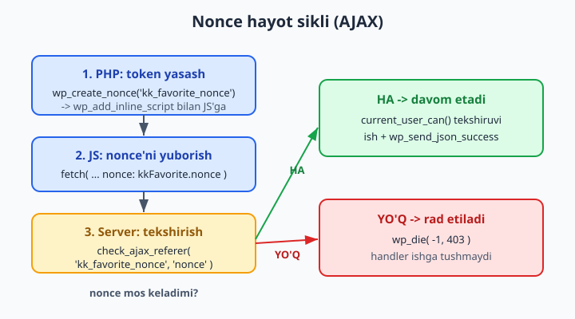
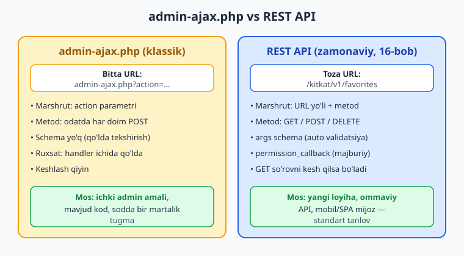

# 15 — AJAX (admin-ajax va zamonaviy)

[⬅️ Oldingi: 14 — Skript va stillarni ulash (enqueue)](./14-enqueue-assets.md) · [🏠 README](./README.md) · [Keyingi: 16 — REST API: o'z endpoint'laringiz ➡️](./16-rest-api.md)

> **Bu bobda:** sahifani qayta yuklamasdan server bilan gaplashishni — AJAX'ni — WordPress yo'li bilan o'rganamiz: klassik `admin-ajax.php` mexanizmi (`wp_ajax_{action}` login qilganlar uchun, `wp_ajax_nopriv_{action}` mehmonlar uchun), klientdan `action` + nonce yuborish (`fetch` va `jQuery.post`), serverda `check_ajax_referer()` bilan nonce'ni va `current_user_can()` bilan ruxsatni tekshirish, `wp_send_json_success()`/`wp_send_json_error()` bilan toza JSON qaytarish; nonce'ni 14-bobdagi `wp_add_inline_script` orqali skriptga uzatish; nega ko'p hollarda zamonaviy REST API (16-bob) afzal va admin-ajax qachon hali ham mos kelishini ko'rib, "kitobni sevimliga qo'shish" tugmasini to'liq yasaymiz.

---

## Muammo: tugmani bossam, sahifa qayta yuklanmasin

`kitoblar-katalogi` plugin'imiz endi katalog chiqaradi (shortcode, 13-bob). Foydalanuvchi yoqqan kitob yonidagi **"Sevimliga qo'shish"** tugmasini bossin deylik. Klassik PHP yo'lida tugma bosilsa — forma yuboriladi, **butun sahifa qayta yuklanadi**, ekran "sakraydi", foydalanuvchi joyini yo'qotadi. Yomon tajriba.

Kerakli narsa: tugma bosiladi, brauzer **fon rejimida** serverga "shu kitobni sevimliga qo'sh" deb so'rov yuboradi, server qisqa javob qaytaradi, sahifa esa joyida turib faqat tugma "Sevimlida ✓" ga o'zgaradi. Mana shu — **AJAX**.

AJAX (Asynchronous JavaScript And XML) — tarixiy nom; bugun XML emas, deyarli har doim **JSON** ishlatiladi. Mohiyati: **JavaScript fon so'rovi bilan sahifani qayta yuklamasdan serverdan ma'lumot olish yoki serverga ma'lumot yuborish**.

WordPress'da buni qilishning **ikki yo'li** bor:

1. **Klassik `admin-ajax.php`** — WordPress'ning eski, lekin hamon ishlaydigan mexanizmi. Bu bob asosan shu haqida (chunki ko'p tayyor kod va plugin shunday yozilgan).
2. **REST API** — zamonaviy, toza yo'l (16-bob). Ko'p yangi loyihada **afzal**. Bob oxirida qaysi birini qachon tanlashni ko'ramiz.

> ℹ️ Bu bob JavaScript va PHP'ni birlashtiradi. Tayanch JS uchun [JavaScript — Noldan](../js/README.md) kitobi bor. Skript ulashni ([14-bob](./14-enqueue-assets.md)) bilgan bo'lsangiz qulayroq bo'ladi — nonce'ni skriptga uzatish o'sha bobdagi `wp_add_inline_script`'ga tayanadi.

---

## admin-ajax.php: umumiy oqim

Klassik AJAX'da **barcha** so'rovlar bitta faylga boradi: `wp-admin/admin-ajax.php`. Bu fayl mehmonlar uchun ham ochiq (nomidagi `admin` adashtirmasin — u frontend so'rovlarini ham qabul qiladi).

So'rov qaysi kodga borishini **`action` parametri** hal qiladi. Siz so'rovga `action=kk_add_favorite` deb yuborasiz, WordPress esa shu nomdan **hook nomi** yasaydi va o'sha hook'ga ulangan funksiyangizni chaqiradi.


To'liq zanjir:

1. **Klient (JS):** `fetch`/`jQuery.post` bilan `admin-ajax.php` ga `action` + ma'lumot + **nonce** yuboradi.
2. **WordPress:** `action` qiymatidan hook nomi yasaydi:
   - login qilgan foydalanuvchi uchun — `wp_ajax_{action}`
   - login qilmagan (mehmon) uchun — `wp_ajax_nopriv_{action}`
3. **Handler (PHP):** o'sha hook'ga ulangan funksiyangiz ishga tushadi. U nonce'ni va ruxsatni tekshiradi, ishni bajaradi, **JSON** qaytaradi.
4. **Klient (JS):** JSON javobni qabul qilib UI'ni yangilaydi.

> 📌 **`action` — bog'lovchi ip.** Klientdagi `action` qiymati (`kk_add_favorite`) serverdagi hook nomi (`wp_ajax_kk_add_favorite`) bilan **aniq mos** bo'lishi shart. Bittasini o'zgartirsangiz, ikkalasini ham o'zgartiring — aks holda WordPress `0` (yoki `-1`) qaytaradi va "hech narsa bo'lmaydi".

---

## Serverdagi ikki hook: `wp_ajax_` va `wp_ajax_nopriv_`

WordPress AJAX handler'ini hook orqali ro'yxatdan o'tkazasiz. Ikki variant bor, chunki **login qilgan** va **mehmon** foydalanuvchilar uchun alohida hook'lar mavjud:

```php
// Login qilgan foydalanuvchilar uchun
add_action( 'wp_ajax_{action}', $callback );

// Login qilmagan (mehmon) foydalanuvchilar uchun
add_action( 'wp_ajax_nopriv_{action}', $callback );
```

`{action}` o'rniga klient yuborgan `action` qiymati keladi. Bizning misolda `action=kk_add_favorite`, demak hook'lar `wp_ajax_kk_add_favorite` va `wp_ajax_nopriv_kk_add_favorite`.

📌 Qaysi hook'ni qachon ulaysiz:

| Holat | Ulaysiz |
|---|---|
| Faqat login qilganlar (masalan admin amali, profil) | **Faqat** `wp_ajax_{action}` |
| Faqat mehmonlar | **Faqat** `wp_ajax_nopriv_{action}` |
| Hamma (login ham, mehmon ham) | **Ikkalasi** ham |

"Sevimliga qo'shish"ni **faqat login qilganlar** uchun cheklaymiz (sevimli ro'yxat foydalanuvchiga bog'liq). Shuning uchun faqat `wp_ajax_kk_add_favorite` ulaymiz. Mehmon bu so'rovni yuborsa, WordPress hech qaysi handler topmaydi va `0` qaytaradi — bu xavfsiz standart.

```php
<?php
namespace Oqil\KitobKatalog;

// Faqat login qilgan foydalanuvchilar sevimliga qo'sha oladi.
add_action( 'wp_ajax_kk_add_favorite', __NAMESPACE__ . '\\handle_add_favorite' );
// Mehmonlar uchun ataylab ulamaymiz — ular qila olmaydi.
```

⚠️ **Faqat `wp_ajax_` (nopriv'siz) ulash — himoya EMAS.** Bu shunchaki "mehmon bu action'ni chaqira olmaydi" degani. Login qilgan **har qanday** foydalanuvchi (hatto eng past rolli abonent) bu hook'ga yetadi. Shuning uchun ruxsatni handler ICHIDA `current_user_can()` bilan alohida tekshirish kerak — pastda ko'ramiz.

---

## Klient: nonce'ni skriptga uzatish (14-bobga tayanib)

Endpoint manzili va nonce **PHP tomonda** ma'lum, lekin so'rovni **JavaScript** yuboradi. Demak ularni JS'ga uzatish kerak. 14-bobda ko'rganimizdek, zamonaviy yo'l — `wp_add_inline_script` bilan skriptdan **oldin** kichik global obyekt joylash:

```php
<?php
namespace Oqil\KitobKatalog;

add_action( 'wp_enqueue_scripts', __NAMESPACE__ . '\\enqueue_favorite_script' );

function enqueue_favorite_script(): void {
    // Skriptni ro'yxatdan o'tkazib ulaymiz (handle: kk-favorite).
    wp_enqueue_script(
        'kk-favorite',
        plugins_url( 'assets/favorite.js', __FILE__ ),
        [],          // bog'liqliklar (jQuery kerak bo'lsa: ['jquery'])
        '1.0.0',
        true         // <footer> ichida yuklash
    );

    // Endpoint URL + nonce ni JS'ga uzatamiz.
    $data = [
        'ajaxUrl' => admin_url( 'admin-ajax.php' ),          // admin-ajax.php manzili
        'nonce'   => wp_create_nonce( 'kk_favorite_nonce' ), // nonce qiymati
    ];

    wp_add_inline_script(
        'kk-favorite',
        'window.kkFavorite = ' . wp_json_encode( $data ) . ';',
        'before' // asosiy skriptdan OLDIN ishga tushsin
    );
}
```

📌 Diqqat qiladigan nuqtalar:

- **`admin_url( 'admin-ajax.php' )`** — endpoint to'liq URL'ini yasaydi (`https://sayt.uz/wp-admin/admin-ajax.php`). URL'ni hech qachon qo'lda yozmang — sayt boshqa papkada bo'lishi mumkin.
- **`wp_create_nonce( 'kk_favorite_nonce' )`** — bu so'rov uchun **bir martalik token** (nonce = "number used once"). Uni serverda `check_ajax_referer()` tekshiradi. Token nomi (`kk_favorite_nonce`) ikki tomonda bir xil bo'lsin.
- **`wp_json_encode()`** — massivni xavfsiz JSON'ga aylantiradi (oddiy `json_encode` o'rniga WordPress varianti; u to'g'ri sozlamalar bilan ishlaydi).
- **`'before'`** — inline kod asosiy skriptdan **oldin** joylashadi, shunda `favorite.js` ishga tushganda `window.kkFavorite` allaqachon mavjud bo'ladi.

> 💡 **Nega `wp_localize_script` emas?** Tarixan nonce/URL `wp_localize_script` bilan uzatilardi. U hamon ishlaydi, lekin nomidan ko'rinib turibdiki, u **lokalizatsiya** (tarjima) uchun yaratilgan — ma'lumot uzatish yon ta'siri edi. Zamonaviy tavsiya (SPEC, 14-bob): ma'lumot uchun `wp_add_inline_script`, `wp_localize_script` esa faqat i18n/asset URL uchun.

---

## Klient: `fetch` bilan so'rov yuborish

Endi `assets/favorite.js`. Zamonaviy, jQuery'siz `fetch` bilan yozamiz. admin-ajax.php `application/x-www-form-urlencoded` (oddiy forma) ma'lumotini kutadi, shuning uchun `URLSearchParams` ishlatamiz:

```js
// assets/favorite.js
document.addEventListener('click', (event) => {
  const button = event.target.closest('.kk-fav-btn');
  if (!button) {
    return;
  }

  event.preventDefault();
  button.disabled = true;

  const bookId = button.dataset.bookId;

  // admin-ajax.php forma-kodlangan ma'lumot kutadi.
  const body = new URLSearchParams({
    action: 'kk_add_favorite',     // hook nomini hal qiladi
    nonce: window.kkFavorite.nonce, // xavfsizlik tokeni
    book_id: bookId,                // qo'shimcha ma'lumot
  });

  fetch(window.kkFavorite.ajaxUrl, {
    method: 'POST',
    credentials: 'same-origin', // login cookie'larini yuborish uchun MUHIM
    body,
  })
    .then((response) => response.json())
    .then((result) => {
      if (result.success) {
        button.textContent = 'Sevimlida ✓';
      } else {
        // wp_send_json_error dan kelgan xabar
        button.disabled = false;
        const message = result.data && result.data.message
          ? result.data.message
          : 'Xatolik yuz berdi';
        window.alert(message);
      }
    })
    .catch(() => {
      button.disabled = false;
      window.alert('Tarmoq xatosi');
    });
});
```

📌 Muhim nuqtalar:

- **`action: 'kk_add_favorite'`** — serverdagi `wp_ajax_kk_add_favorite` hook'iga mos. Eng muhim parametr.
- **`credentials: 'same-origin'`** — login qilingan foydalanuvchi sifatida so'rov yuborish uchun cookie'lar yuborilsin. `wp_ajax_` (nopriv emas) hook ishlashi uchun bu SHART; usiz WordPress sizni mehmon deb biladi.
- **`result.success`** — `wp_send_json_success()` javobi `{ "success": true, "data": ... }`, `wp_send_json_error()` esa `{ "success": false, "data": ... }` qaytaradi. Shu kalit bilan muvaffaqiyat/xatoni ajratamiz.
- **`textContent`** — tugma matnini xavfsiz o'zgartiradi (`innerHTML` emas — XSS xavfi yo'q). "Sevimlida" matnidagi belgi shunchaki vizual ishora.

> 💡 **jQuery varianti.** Eski kod ko'pincha `jQuery.post` ishlatadi. Bog'liqlikka `'jquery'` qo'shsangiz, ekvivalenti:
> ```js
> jQuery.post(window.kkFavorite.ajaxUrl, {
>   action: 'kk_add_favorite',
>   nonce: window.kkFavorite.nonce,
>   book_id: bookId,
> }, (result) => { /* ... */ }, 'json');
> ```
> Yangi kodda `fetch` afzal — jQuery bog'liqligi kerak emas.

HTML tomonda tugma `data-book-id` atributi bilan chiqariladi (shortcode/template ichida):

```php
printf(
    '<button class="kk-fav-btn" data-book-id="%d">%s</button>',
    (int) $book_id,
    esc_html__( 'Sevimliga qo\'shish', 'kitoblar-katalogi' )
);
```

⚠️ Bu UI o'zgarishi (tugma "Sevimlida ✓" ga aylanishi) faqat ishlab turgan WordPress'da, brauzerda ko'rinadi — kodni o'z saytingizga qo'yib sinab ko'ring. Bu yerdagi mantiq to'g'ri, lekin jonli natija illustrativ.

---

## Server: handler, nonce va ruxsat tekshiruvi

Endi eng muhim qism — handler. U **uch bosqichli xavfsizlik** bilan boshlanadi: nonce, ruxsat, kirishni tozalash. So'ngra ishni bajaradi va JSON qaytaradi.

```php
<?php
namespace Oqil\KitobKatalog;

function handle_add_favorite(): void {
    // 1) NONCE: so'rov haqiqiy formadan kelganini tekshirish (CSRF himoyasi).
    //    Birinchi argument — nonce nomi (PHP'da yaratilgani bilan bir xil),
    //    ikkinchi — so'rovdagi kalit nomi (biz JS'da 'nonce' deb yubordik).
    check_ajax_referer( 'kk_favorite_nonce', 'nonce' );

    // 2) RUXSAT: login qilgan har kim emas, faqat o'qiy oladigan foydalanuvchi.
    if ( ! is_user_logged_in() || ! current_user_can( 'read' ) ) {
        wp_send_json_error(
            [ 'message' => __( 'Ruxsat yo\'q.', 'kitoblar-katalogi' ) ],
            403
        );
    }

    // 3) KIRISHNI TOZALASH: $_POST ishonchsiz; unslash + sanitize.
    $book_id = isset( $_POST['book_id'] )
        ? absint( wp_unslash( $_POST['book_id'] ) )
        : 0;

    if ( 0 === $book_id || 'kitob' !== get_post_type( $book_id ) ) {
        wp_send_json_error(
            [ 'message' => __( 'Kitob topilmadi.', 'kitoblar-katalogi' ) ],
            400
        );
    }

    // 4) ISHNI BAJARISH: joriy foydalanuvchining sevimli ro'yxatiga qo'shish.
    $user_id   = get_current_user_id();
    $favorites = get_user_meta( $user_id, 'kk_favorites', true );
    $favorites = is_array( $favorites ) ? $favorites : [];

    if ( ! in_array( $book_id, $favorites, true ) ) {
        $favorites[] = $book_id;
        update_user_meta( $user_id, 'kk_favorites', $favorites );
    }

    // 5) JAVOB: toza JSON. wp_send_json_success o'zi wp_die() chaqiradi.
    wp_send_json_success(
        [
            'message'   => __( 'Sevimliga qo\'shildi.', 'kitoblar-katalogi' ),
            'bookId'    => $book_id,
            'favorites' => count( $favorites ),
        ]
    );
}
```

Bu handler'ning har qatori muhim. Birma-bir ko'rib chiqamiz.

### 1. `check_ajax_referer()` — nonce'ni tekshirish

Imzo (developer.wordpress.org bilan tasdiqlangan):

```php
check_ajax_referer( int|string $action = -1, false|string $query_arg = false, bool $stop = true ): int|false
```

- **`$action`** — nonce nomi, PHP'da `wp_create_nonce( 'kk_favorite_nonce' )` da bergan nom bilan **bir xil**.
- **`$query_arg`** — so'rovdagi (`$_REQUEST`) qaysi kalitda nonce yotgani. Biz JS'da `nonce: ...` deb yubordik, demak `'nonce'`. (Standart kalitlar `_ajax_nonce` yoki `_wpnonce` — ularda bu argumentni tashlab ketsa ham bo'ladi.)
- **`$stop`** — `true` (standart) bo'lsa, nonce yaroqsiz bo'lsa funksiya o'zi `wp_die( -1, 403 )` qiladi va skript to'xtaydi. Shuning uchun pastdagi kodga yetilmaydi — bu xavfsiz.

📌 `check_ajax_referer()` muvaffaqiyatda `1` yoki `2` (nonce yoshiga qarab), yaroqsizda `false` qaytaradi. `$stop = true` bo'lgani uchun yaroqsizda umuman davom etmaydi.



> ⚠️ **Nonce — CSRF himoyasi, autentifikatsiya emas.** Nonce so'rov **sizning saytingiz formasidan** kelganini isbotlaydi (boshqa sayt foydalanuvchini aldab so'rov yuborolmaydi). Lekin u "kim" ekanini va "ruxsati bor-yo'qligini" bilmaydi — buni `current_user_can()` qiladi. Ikkalasi ham kerak.

### 2. `current_user_can()` — ruxsat

Nonce o'tdi, lekin foydalanuvchining bu amalga **ruxsati** bormi? `current_user_can( 'read' )` — eng past darajadagi tekshiruv (har bir registratsiyalangan foydalanuvchida bor). O'chirish kabi xavfli amal bo'lsa, kuchliroq capability talab qiling (`edit_posts`, `manage_options` — 11-bob).

> 📌 **AJAX handler'da har doim ikkalasini ham:** nonce (`check_ajax_referer`) **va** ruxsat (`current_user_can`). Faqat `wp_ajax_` (nopriv'siz) hook'ga ulash himoya emas — login qilgan istalgan rol unga yetadi.

### 3. Kirishni tozalash

`$_POST` — to'liq ishonchsiz. WordPress `$_POST`/`$_GET`'ga avtomatik slesh qo'shadi, shuning uchun avval **`wp_unslash()`**, keyin turga mos **sanitize**: bu yerda `book_id` — son, demak `absint()`. So'ng mantiqiy tekshiruv: bu ID haqiqatan `kitob` CPT'mi (`get_post_type()`). Faqat son ekanini tekshirish yetarli emas — boshqa post turi ID'sini ham qabul qilib qo'ymaslik kerak.

### 4. JSON javob: `wp_send_json_*`

Uch funksiya bor, hammasi **o'zi `wp_die()` chaqiradi** (demak ulardan keyin `return` yoki `exit` yozish shart emas):

| Funksiya | Imzo | Javob |
|---|---|---|
| `wp_send_json_success()` | `wp_send_json_success( mixed $value = null, int $status_code = null, int $flags = 0 )` | `{ "success": true, "data": ... }` |
| `wp_send_json_error()` | `wp_send_json_error( mixed $value = null, int $status_code = null, int $flags = 0 )` | `{ "success": false, "data": ... }` |
| `wp_send_json()` | `wp_send_json( mixed $response, int $status_code = null, int $flags = 0 )` | sizning massivingiz aynan JSON bo'lib (qo'shimcha o'rashsiz) |

Ular `Content-Type: application/json` sarlavhasini to'g'ri qo'yadi va `json_encode` qiladi — siz `echo json_encode(...)` qilib `wp_die()` yozishingiz shart emas. Ikkinchi argument — HTTP status kodi (xato uchun `400`/`403` foydali).

> 💡 **`wp_send_json_success` vs `wp_send_json`.** `success`/`error` variantlari javobni `{success, data}` "konverti"ga o'raydi — klientda `result.success` bilan tekshirish qulay. Konvertsiz xom JSON kerak bo'lsa (masalan tashqi tizim aniq formatni kutsa) `wp_send_json()` ishlating. Yangi kodda `_success`/`_error` afzal — izchil va o'qiladigan.

⚠️ Jonli AJAX javobi (sevimli haqiqatan saqlanishi, `update_user_meta` ishlashi) faqat ishlab turgan WordPress'da bo'ladi — kodni o'z saytingizga qo'yib, brauzer Network panelida `admin-ajax.php` javobini ko'ring.

---

## Zamonaviy alternativa: admin-ajax vs REST API

admin-ajax.php hamon ishlaydi, lekin **ko'p yangi loyihada REST API (16-bob) afzal**. Nima farqi bor?



| Jihat | `admin-ajax.php` | REST API (16-bob) |
|---|---|---|
| URL | Bitta umumiy: `admin-ajax.php?action=...` | Toza, mazmunli: `/kitkat/v1/favorites` |
| HTTP metod | Odatda har doim `POST` | `GET`/`POST`/`PUT`/`DELETE` — amalga mos |
| Marshrutlash | `action` parametri orqali | URL yo'li + metod orqali |
| Sxema (schema) | Yo'q — qo'lda tekshirasiz | `args` bilan validatsiya/sanitize avtomatik |
| Ruxsat | Handler ichida qo'lda | `permission_callback` — alohida, majburiy |
| Tashqi mijoz | Noqulay | Tabiiy (mobil ilova, JS SPA) |
| Keshlash | Qiyin (har doim POST) | `GET` so'rovlarni kesh qilsa bo'ladi |

📌 **Qachon qaysi:**

- ✅ **REST API** — yangi funksiya, ommaviy ma'lumot, mobil/SPA mijoz, toza API kerak bo'lsa. Standart tanlov.
- ✅ **admin-ajax** — tezkor, ichki admin amali; mavjud kod allaqachon shunday; jamoa REST'ni hali bilmaydi; juda sodda bir martalik tugma.
- ❌ Yangi katta loyihada hamma narsani admin-ajax'ga qurish — bugun tavsiya etilmaydi.

> 💡 **Bilim ko'chadi.** Diqqat qiling: nonce, `current_user_can`, sanitize, JSON javob — bu tushunchalar REST'da ham **aynan o'sha**. admin-ajax'ni o'rgansangiz, 16-bobdagi REST sizga tanish tuyuladi; farq asosan "marshrutlash" va "schema"da.

---

## Yig'ib qo'yamiz: to'liq AJAX naqshi

`kitoblar-katalogi` plugin'ining "Sevimliga qo'shish" qismi endi to'liq:

1. **Enqueue (PHP):** `wp_enqueue_script` + `wp_add_inline_script` bilan `ajaxUrl` va `nonce`ni JS'ga uzatish.
2. **Klient (JS):** `fetch` bilan `admin-ajax.php` ga `action` + `nonce` + `book_id` yuborish, `credentials: 'same-origin'`.
3. **Hook (PHP):** `add_action( 'wp_ajax_kk_add_favorite', ... )` (faqat login qilganlar).
4. **Handler (PHP):** `check_ajax_referer` -> `current_user_can` -> `wp_unslash`+sanitize -> ish -> `wp_send_json_success`/`_error`.

Bu naqsh deyarli har bir AJAX funksiyasida bir xil. Faqat `action` nomi, yuboriladigan ma'lumot va handler mantig'i o'zgaradi. Keyingi bobda ([16](./16-rest-api.md)) xuddi shu "sevimli" amalini REST API bilan toza URL va schema bilan qayta quramiz — taqqoslab ko'rasiz.

---

## 15-bob mashqlari

> Har mashqni o'z lokal WordPress'ingizda (02-bob) sinab ko'ring. Slug/namespace izchil: `kitoblar-katalogi` / `Oqil\KitobKatalog`, prefiks `kk_`/`kitkat_`.

**Oson**

1. **(Oson)** `action=kk_add_favorite` yuborilganda WordPress qaysi ikkita hook nomini yasaydi? Login qilgan va mehmon foydalanuvchi uchun qaysi biri ishlaydi?
2. **(Oson)** `admin_url( 'admin-ajax.php' )` nima qaytaradi va nega URL'ni qo'lda yozmaslik kerak?
3. **(Oson)** `wp_send_json_success( ['x' => 1] )` va `wp_send_json_error( ['x' => 1] )` qanday JSON struktura qaytaradi? Klientda farqni qaysi kalit bilan bilasiz?
4. **(Oson)** `fetch` so'rovida `credentials: 'same-origin'` nima uchun kerak? Uni unutsangiz `wp_ajax_` (nopriv'siz) handler nima qiladi?

**O'rta**

5. **(O'rta)** "Sevimlidan o'chirish" uchun yangi AJAX amal qo'shing: `action=kk_remove_favorite`. Hook'ni ulang va handler skeletini (nonce + ruxsat + sanitize) yozing.

   <details markdown="1"><summary>Yechim</summary>

   ```php
   add_action( 'wp_ajax_kk_remove_favorite', __NAMESPACE__ . '\\handle_remove_favorite' );

   function handle_remove_favorite(): void {
       check_ajax_referer( 'kk_favorite_nonce', 'nonce' );

       if ( ! is_user_logged_in() || ! current_user_can( 'read' ) ) {
           wp_send_json_error( [ 'message' => __( 'Ruxsat yo\'q.', 'kitoblar-katalogi' ) ], 403 );
       }

       $book_id = isset( $_POST['book_id'] ) ? absint( wp_unslash( $_POST['book_id'] ) ) : 0;
       if ( 0 === $book_id ) {
           wp_send_json_error( [ 'message' => __( 'Noto\'g\'ri kitob.', 'kitoblar-katalogi' ) ], 400 );
       }

       $user_id   = get_current_user_id();
       $favorites = get_user_meta( $user_id, 'kk_favorites', true );
       $favorites = is_array( $favorites ) ? $favorites : [];
       $favorites = array_values( array_diff( $favorites, [ $book_id ] ) );
       update_user_meta( $user_id, 'kk_favorites', $favorites );

       wp_send_json_success( [ 'favorites' => count( $favorites ) ] );
   }
   ```
   Bir xil nonce nomidan (`kk_favorite_nonce`) foydalanish mumkin — u amalga emas, formaga bog'liq. `array_diff` bilan ID'ni olib tashlab, `array_values` bilan kalitlarni qayta tartibga solamiz.
   </details>

6. **(O'rta)** Klientdagi `fetch` kodini "Sevimlidan o'chirish" tugmasi (`.kk-unfav-btn`) uchun moslab yozing. Muvaffaqiyatda tugma matnini "Sevimliga qo'shish"ga qaytaring.

   <details markdown="1"><summary>Yechim</summary>

   ```js
   document.addEventListener('click', (event) => {
     const button = event.target.closest('.kk-unfav-btn');
     if (!button) {
       return;
     }
     event.preventDefault();
     button.disabled = true;

     const body = new URLSearchParams({
       action: 'kk_remove_favorite',
       nonce: window.kkFavorite.nonce,
       book_id: button.dataset.bookId,
     });

     fetch(window.kkFavorite.ajaxUrl, { method: 'POST', credentials: 'same-origin', body })
       .then((r) => r.json())
       .then((result) => {
         button.disabled = false;
         if (result.success) {
           button.textContent = 'Sevimliga qo\'shish';
           button.classList.replace('kk-unfav-btn', 'kk-fav-btn');
         }
       });
   });
   ```
   `action` qiymatini va tanlovchi (selector)ni o'zgartirdik; qolgan naqsh bir xil.
   </details>

7. **(O'rta)** Handler ichidan `check_ajax_referer( 'kk_favorite_nonce', 'nonce' )` ni olib tashlasangiz qanday xavf paydo bo'ladi? Hujum stsenariysini bir jumlada tasvirlang.

   <details markdown="1"><summary>Yechim</summary>

   Nonce tekshiruvisiz amal **CSRF** (Cross-Site Request Forgery) ga ochiq bo'ladi: zararli sayt login qilgan foydalanuvchini (cookie'lari brauzerda bor) o'zi bilmagan holda `admin-ajax.php` ga so'rov yuborishga majburlashi mumkin (masalan yashirin forma yoki rasm orqali), natijada foydalanuvchi nomidan amal bajariladi. Nonce so'rov haqiqatan sizning saytingiz sahifasidan kelganini isbotlaydi, shuning uchun u SHART.
   </details>

8. **(O'rta)** `wp_send_json_success`, `wp_send_json_error` va `wp_send_json` o'rtasidagi farqni ayting. Har biri qachon mos keladi?

   <details markdown="1"><summary>Yechim</summary>

   - `wp_send_json_success( $data, $status )` -> `{ success: true, data: $data }`. Muvaffaqiyatli amal.
   - `wp_send_json_error( $data, $status )` -> `{ success: false, data: $data }`. Xato (xabar + status kodi: 400/403/404).
   - `wp_send_json( $response, $status )` -> sizning massivingiz aynan, "konvert"siz. Tashqi tizim aniq JSON formatni kutganda.
   Uchchalasi ham `Content-Type: application/json` qo'yadi va o'zi `wp_die()` chaqiradi — keyin kod yozish shart emas. Yangi kodda `_success`/`_error` afzal, chunki klientda `result.success` bilan izchil tekshiriladi.
   </details>

**Qiyin**

9. **(Qiyin)** "Sevimli sonini olish" uchun **mehmonlar ham** ko'ra oladigan AJAX amal yozing: `action=kk_favorite_count`. Ikkala hook'ni ulang va nega bu holatda nopriv ham kerakligini tushuntiring. Faqat o'qish bo'lgani uchun nonce shartmi?

   <details markdown="1"><summary>Yechim</summary>

   ```php
   add_action( 'wp_ajax_kk_favorite_count', __NAMESPACE__ . '\\handle_favorite_count' );
   add_action( 'wp_ajax_nopriv_kk_favorite_count', __NAMESPACE__ . '\\handle_favorite_count' );

   function handle_favorite_count(): void {
       $book_id = isset( $_GET['book_id'] ) ? absint( wp_unslash( $_GET['book_id'] ) ) : 0;
       if ( 0 === $book_id ) {
           wp_send_json_error( [ 'message' => __( 'Noto\'g\'ri kitob.', 'kitoblar-katalogi' ) ], 400 );
       }
       // Faraz: har kitob meta'sida umumiy sevimli soni saqlanadi.
       $count = (int) get_post_meta( $book_id, 'kk_favorite_count', true );
       wp_send_json_success( [ 'bookId' => $book_id, 'count' => $count ] );
   }
   ```
   **Nega nopriv ham:** ommaviy son mehmonga ham ko'rinishi kerak, shuning uchun login qilmaganlar uchun ham `wp_ajax_nopriv_` hook kerak; usiz mehmon `0` javob oladi. **Nonce:** bu **faqat o'qish** (ma'lumotni o'zgartirmaydi) va ommaviy bo'lgani uchun nonce shart emas — nonce asosan **yozuvchi/o'zgartiruvchi** amallar uchun. Lekin agar ma'lumot maxfiy bo'lsa, o'qish uchun ham ruxsat tekshiruvi kerak bo'lardi.
   </details>

10. **(Qiyin)** AJAX javobi sekin (og'ir SQL) bo'lsa, har bosishda qayta hisoblamaslik uchun handler ichida `set_transient()` bilan keshlang (5 daqiqa). To'liq handler yozing.

    <details markdown="1"><summary>Yechim</summary>

    ```php
    add_action( 'wp_ajax_kk_popular', __NAMESPACE__ . '\\handle_popular' );
    add_action( 'wp_ajax_nopriv_kk_popular', __NAMESPACE__ . '\\handle_popular' );

    function handle_popular(): void {
        $cache_key = 'kk_popular_books';
        $cached    = get_transient( $cache_key );
        if ( false !== $cached ) {
            wp_send_json_success( [ 'books' => $cached, 'cached' => true ] );
        }

        // Og'ir hisob (illustrativ): eng ko'p ko'rilgan 10 kitob.
        $query = new \WP_Query( [
            'post_type'      => 'kitob',
            'posts_per_page' => 10,
            'meta_key'       => 'kk_view_count',
            'orderby'        => 'meta_value_num',
            'order'          => 'DESC',
            'fields'         => 'ids',
        ] );
        $ids = $query->posts;

        set_transient( $cache_key, $ids, 5 * MINUTE_IN_SECONDS );
        wp_send_json_success( [ 'books' => $ids, 'cached' => false ] );
    }
    ```
    `get_transient` `false` qaytarsa (kesh yo'q/eskirgan), qayta hisoblab `set_transient` bilan 5 daqiqaga saqlaymiz (`MINUTE_IN_SECONDS` — WordPress konstantasi). Keyingi so'rovlar keshdan keladi. Transient'lar haqida 10-bobda batafsil.
    </details>

11. **(Qiyin)** AJAX so'rovi `0` yoki `-1` qaytarib "ishlamayapti". Sabablarni topish bo'yicha **diagnostika ketma-ketligini** (checklist) yozing.

    <details markdown="1"><summary>Yechim</summary>

    `admin-ajax.php` standart javoblari: handler topilmasa `0`, nonce yaroqsiz bo'lsa `-1`. Tekshirish ketma-ketligi:
    1. **`action` mos kelyaptimi?** JS'dagi `action` qiymati (`kk_add_favorite`) hook nomidagi qism bilan aniq bir xilmi (`wp_ajax_kk_add_favorite`)? Kichik xato (`_` vs `-`) `0` beradi.
    2. **Hook ulanganmi?** `add_action` to'g'ri faylda, plugin yuklanganda chaqirilyaptimi? Login qilmagan bo'lsangiz `nopriv` hook kerakmi?
    3. **`credentials` bormi?** `fetch`'da `credentials: 'same-origin'` yo'q bo'lsa, login cookie yuborilmaydi -> `wp_ajax_` ishlamaydi.
    4. **Nonce to'g'rimi?** `-1` bo'lsa: `check_ajax_referer` nomi (`kk_favorite_nonce`) `wp_create_nonce` nomi bilan bir xilmi? `$query_arg` (`'nonce'`) JS'dagi kalit bilan mos kelyaptimi? Nonce eskirgan bo'lishi mumkin (sahifa uzoq ochiq turgan).
    5. **URL to'g'rimi?** `window.kkFavorite.ajaxUrl` `admin_url('admin-ajax.php')` dan kelyaptimi (inline script yuklanganmi)?
    6. **Network panel:** brauzer DevTools -> Network -> `admin-ajax.php` so'rovini ochib, Status, Request payload va Response'ni ko'ring.
    </details>

12. **(Qiyin)** Bir xil "sevimli" amalini admin-ajax o'rniga REST API bilan qilsangiz, kod qanday o'zgaradi? `register_rest_route` skeletini yozing va admin-ajax'ga nisbatan ikkita afzallikni ayting.

    <details markdown="1"><summary>Yechim</summary>

    ```php
    add_action( 'rest_api_init', function (): void {
        register_rest_route( 'kitkat/v1', '/favorites', [
            'methods'             => 'POST',
            'callback'            => __NAMESPACE__ . '\\rest_add_favorite',
            'permission_callback' => function (): bool {
                return is_user_logged_in() && current_user_can( 'read' );
            },
            'args'                => [
                'book_id' => [
                    'required'          => true,
                    'type'              => 'integer',
                    'sanitize_callback' => 'absint',
                ],
            ],
        ] );
    } );

    function rest_add_favorite( \WP_REST_Request $request ): \WP_REST_Response {
        $book_id = (int) $request['book_id'];
        // ... sevimliga qo'shish ...
        return new \WP_REST_Response( [ 'favorites' => 1 ], 200 );
    }
    ```
    **Afzalliklar:** (1) toza, mazmunli URL (`/kitkat/v1/favorites`) — bitta `admin-ajax.php?action=...` o'rniga; (2) `permission_callback` ruxsatni alohida, **majburiy** joyda hal qiladi va `args` schema kirishni avtomatik validatsiya/sanitize qiladi — handler tozaroq bo'ladi. Qo'shimcha: HTTP metodlar (`GET`/`DELETE`) amalga mos keladi va REST nonce'ni (`X-WP-Nonce`) ham qo'llaydi. To'liq tafsilot — 16-bobda.
    </details>

[⬅️ Oldingi: 14 — Skript va stillarni ulash (enqueue)](./14-enqueue-assets.md) · [🏠 README](./README.md) · [Keyingi: 16 — REST API: o'z endpoint'laringiz ➡️](./16-rest-api.md)
