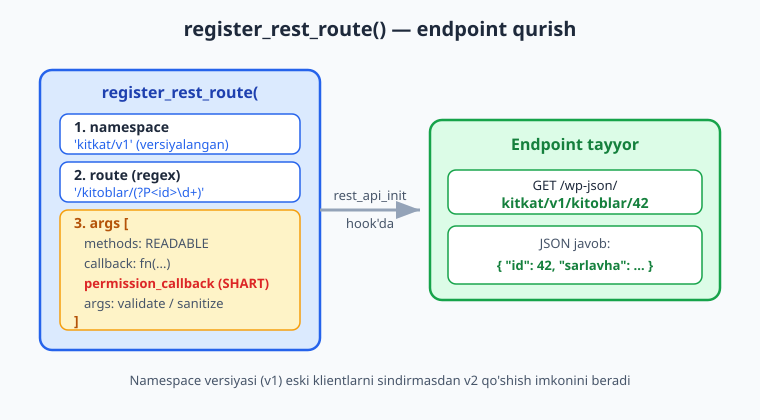
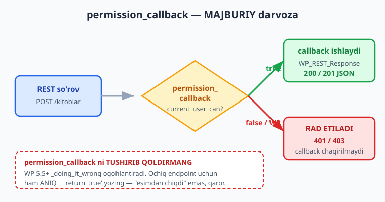
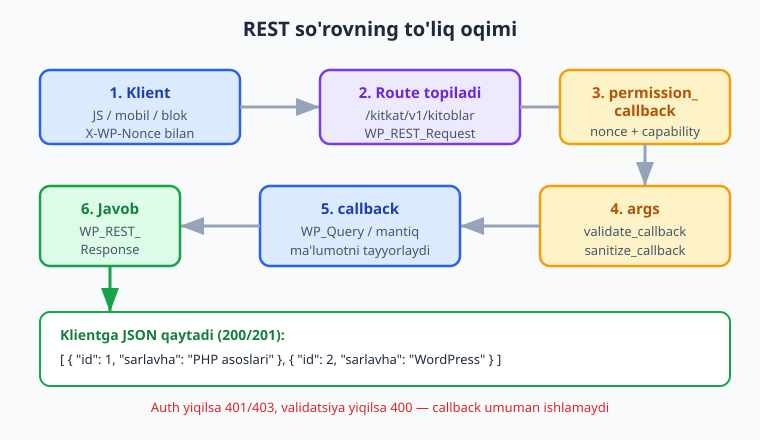

# 16 — REST API: o'z endpoint'laringiz

[⬅️ Oldingi: 15 — AJAX (admin-ajax va zamonaviy)](./15-ajax.md) · [🏠 README](./README.md) · [Keyingi: 17 — WP-Cron va fon vazifalari ➡️](./17-wp-cron.md)

> **Bu bobda:** WordPress REST API nima va nega u zamonaviy WP integratsiyasining markazi ekanini (blok muharriri, mobil ilovalar, JS frontend shularga tayanadi) tushunib, `register_rest_route()` bilan `rest_api_init` hook'da o'z endpoint'laringizni — namespace versiyalash (`kitkat/v1`), route regex (`/kitoblar`, `/kitoblar/(?P<id>\d+)`), `methods`/`callback`/`permission_callback`/`args` — ro'yxatdan o'tkazamiz; `permission_callback` nima uchun MAJBURIY ekanini, callback'da `WP_REST_Request` dan parametr olib `WP_REST_Response` yoki `WP_Error` qaytarishni, har parametrni `validate_callback`/`sanitize_callback`/`required`/`default` bilan tekshirishni, hamda cookie + `X-WP-Nonce` autentifikatsiyasini "Kitoblar katalogi" plugin'imizga `GET`/`POST`/`GET {id}` endpoint'lar qo'shib amalda ko'rsatamiz.

---

## Muammo: plugin'ingizga "tashqi eshik" kerak

"Kitoblar katalogi" plugin'ingiz endi kuchli: `kitob` CPT (07-bob), `janr` taxonomiyasi (08-bob), meta'lar (09-bob), o'z jadvalingiz va kesh (10-bob), shortcode (13-bob), AJAX (15-bob). Lekin endi yangi talablar keladi:

- Frontend'da **React/Vue komponenti** kitoblar ro'yxatini ko'rsatadi va sahifalansin (paginate).
- **Mobil ilova** sizning saytingizdan kitoblarni o'qishi kerak.
- Blok muharriridagi blokingiz (19-bob) kitoblarni **jonli** chaqirib ko'rsatishi kerak.
- Boshqa sayt sizning kataloggingizdan ma'lumot **import** qilmoqchi.

15-bobdagi `admin-ajax.php` buni qisman uddalaydi, lekin u eski, struktura-siz va faqat WordPress'ning o'z so'rovlari uchun qulay. Zamonaviy javob — **REST API**: izchil, hujjatlangan, JSON qaytaradigan, standart HTTP metodlari (`GET`/`POST`/`PUT`/`DELETE`) bilan ishlaydigan **dasturlash interfeysi**.

📌 **Asosiy g'oya:** REST API — bu sizning ma'lumotingizning HTTP orqali ochilgan "darvozasi". Klient (brauzer JS, mobil ilova, boshqa server) `https://saytingiz.uz/wp-json/kitkat/v1/kitoblar` manziliga so'rov yuboradi, siz JSON qaytarasiz. WordPress yo'naltirish, autentifikatsiya va serializatsiyani o'z bo'yniga oladi — siz faqat **endpoint** va **callback** yozasiz.

---

## REST API nima va nega muhim

WordPress REST API — yadroga kiritilgan (4.7 dan beri) HTTP interfeys. U `/wp-json/` ostidagi manzillarda yashaydi va WordPress'ni shunchaki sayt emas, **ilova platformasi** (application platform) ga aylantiradi.

Bugun REST API'siz WordPress'ni tasavvur qilib bo'lmaydi:

- **Blok muharriri (Gutenberg)** har bir postni `/wp/v2/posts` orqali saqlaydi va o'qiydi.
- **JS frontend** (React, Vue) ma'lumotni REST'dan oladi (headless WordPress).
- **Mobil ilovalar** xuddi shu interfeysga tayanadi.
- Sizning **bloklaringiz** (19-23 boblar) jonli ma'lumotni REST orqali chaqiradi.

ℹ️ Yadroning o'z endpoint'lari `wp/v2` namespace'da: `/wp-json/wp/v2/posts`, `/wp-json/wp/v2/users` va h.k. Siz **o'z** namespace'ingizni (`kitkat/v1`) qo'shasiz — yadronikiga tegmasdan.

### AJAX (15-bob) va REST — qaysi birini tanlayman?

| Jihat | `admin-ajax.php` (15-bob) | REST API (bu bob) |
|---|---|---|
| Manzil | Bitta: `admin-ajax.php?action=...` | Strukturali: `/wp-json/kitkat/v1/kitoblar/5` |
| HTTP metodlar | Asosan POST | `GET`/`POST`/`PUT`/`DELETE` (semantik) |
| Javob | O'zingiz formatlaysiz | JSON, standart status kodlari |
| Validatsiya | Qo'lda | `args` sxemasi (deklarativ) |
| Hujjat / introspeksiya | Yo'q | O'z-o'zini hujjatlaydi (`/wp-json/`) |
| Kim ishlatadi | Klassik tema JS | Blok muharriri, ilovalar, JS frontend |

📌 **Qoida (2026):** yangi kod uchun deyarli har doim **REST API**'ni tanlang. `admin-ajax.php` ni faqat eski kod yoki juda sodda admin-ichi so'rovlar uchun qoldiring. REST strukturali, kengaytiriladigan va kelajakka mos.

---

## `register_rest_route()` — endpoint ro'yxatga olish

O'z endpoint'ingiz `register_rest_route()` bilan ro'yxatdan o'tkaziladi va u **`rest_api_init`** hook'da chaqirilishi shart (REST yuklanmaganda keraksiz ishlamasligi uchun).

Rasmiy imzo (developer.wordpress.org bilan tasdiqlangan):

```php
register_rest_route(
	string $route_namespace,  // 'kitkat/v1'
	string $route,            // '/kitoblar'
	array  $args = array(),   // ['methods'=>, 'callback'=>, 'permission_callback'=>, 'args'=>]
	bool   $override = false
): bool
```



### Namespace — versiyalash uchun

Namespace `vendor/vN` shaklida bo'ladi: birinchi qism — sizning loyihangiz (boshqa plugin bilan to'qnashmasligi uchun), ikkinchi qism — **versiya**. Biz `kitkat/v1` ishlatamiz.

📌 **Nega versiya?** Ertaga endpoint'ingizning javob shaklini buzib o'zgartirishingiz kerak bo'lsa — eski klientlarni sindirib qo'ymaslik uchun `kitkat/v2` ni qo'shasiz, `v1` esa eskirgan klientlar uchun ishlab tursin. Bu — ommaviy API'ning oltin qoidasi.

### Route — regex bilan

`$route` — namespace'dan keyingi qism. U **regex** bo'lishi mumkin, shu bilan URL'dan parametr ushlab olasiz:

| Route | Tegishli URL | Izoh |
|---|---|---|
| `/kitoblar` | `/wp-json/kitkat/v1/kitoblar` | Ro'yxat (kolleksiya) |
| `/kitoblar/(?P<id>\d+)` | `/wp-json/kitkat/v1/kitoblar/42` | Bitta kitob (id ushlanadi) |

`(?P<id>\d+)` — **nomlangan guruh**: `\d+` (bir yoki ko'p raqam) ni `id` nomi bilan ushlaydi. Callback'da uni `$req['id']` yoki `$req->get_param('id')` orqali olasiz.

⚠️ Route'ni `/` bilan boshlang. Namespace va route'da yakuniy `/` qo'ymang (`/kitoblar/` emas, `/kitoblar`).

### Eng sodda endpoint

```php
namespace Oqil\KitobKatalog;

const REST_NAMESPACE = 'kitkat/v1';

add_action( 'rest_api_init', function (): void {
	register_rest_route(
		REST_NAMESPACE,
		'/salom',
		[
			'methods'             => \WP_REST_Server::READABLE, // 'GET'
			'callback'            => __NAMESPACE__ . '\\rest_salom',
			'permission_callback' => '__return_true', // ochiq endpoint
		]
	);
} );

function rest_salom( \WP_REST_Request $req ): \WP_REST_Response {
	return new \WP_REST_Response( [ 'xabar' => 'Salom, Kitoblar katalogi!' ], 200 );
}
```

Endi `GET /wp-json/kitkat/v1/salom` so'rovi `{"xabar":"Salom, Kitoblar katalogi!"}` qaytaradi.

⚠️ **Halol eslatma:** jonli REST javobini faqat ishlaydigan saytda ko'rasiz. O'z saytingizda brauzerda `/wp-json/kitkat/v1/salom` manzilini oching yoki `curl https://saytingiz.uz/wp-json/kitkat/v1/salom` bilan sinab ko'ring. Bu bobdagi barcha JSON javoblar — **illustrativ** (ko'rsatma uchun); kodning o'zi `php -l` va rasmiy hujjat bilan tasdiqlangan.

---

## `$args` — endpoint'ning ta'rifi

`register_rest_route()` ning uchinchi argumenti — endpoint xatti-harakatini belgilaydigan massiv:

| Kalit | Vazifa |
|---|---|
| `methods` | Qaysi HTTP metod(lar)ga javob beradi |
| `callback` | So'rovni qayta ishlaydigan funksiya |
| `permission_callback` | Ruxsat tekshiruvi — **MAJBURIY** (pastda) |
| `args` | Parametrlar sxemasi (`required`, `validate_callback`, `sanitize_callback`, `default`) |
| `schema` | (Ixtiyoriy) javob sxemasi — hujjat va validatsiya uchun |

### `methods` — `WP_REST_Server` konstantalari

HTTP metodni xom satr (`'GET'`) sifatida ham yozish mumkin, lekin **konstantalar** o'qilishliroq va bir nechta metodni birlashtiradi:

| Konstanta | HTTP metod | Semantik |
|---|---|---|
| `WP_REST_Server::READABLE` | `GET` | O'qish (ro'yxat, bitta yozuv) |
| `WP_REST_Server::CREATABLE` | `POST` | Yangi yaratish |
| `WP_REST_Server::EDITABLE` | `POST, PUT, PATCH` | Mavjudni tahrirlash |
| `WP_REST_Server::DELETABLE` | `DELETE` | O'chirish |
| `WP_REST_Server::ALLMETHODS` | Barchasi | (Kam) |

ℹ️ `EDITABLE` uchta metodni qamrab oladi — chunki klientlar tahrir uchun har xil metoddan foydalanishi mumkin; WordPress hammasini bitta callback'ga yo'naltiradi.

### Bir route'ga bir nechta metod

Bitta route'ga turli metodlar uchun alohida konfiguratsiya berish mumkin — `register_rest_route()` ga **massivlar massivi** uzating. Quyida `/kitoblar` ga `GET` (ro'yxat) va `POST` (qo'shish) ni biriktiramiz:

```php
register_rest_route(
	REST_NAMESPACE,
	'/kitoblar',
	[
		[
			'methods'             => \WP_REST_Server::READABLE,  // GET ro'yxat
			'callback'            => __NAMESPACE__ . '\\rest_kitoblar_royxat',
			'permission_callback' => '__return_true',
			'args'                => kitoblar_royxat_args(),
		],
		[
			'methods'             => \WP_REST_Server::CREATABLE, // POST qo'shish
			'callback'            => __NAMESPACE__ . '\\rest_kitob_qoshish',
			'permission_callback' => __NAMESPACE__ . '\\rest_yozish_ruxsati',
			'args'                => kitob_qoshish_args(),
		],
	]
);
```

---

## `permission_callback` — MAJBURIY darvoza

Bu — butun bobning eng muhim qoidasi. Har bir route uchun `permission_callback` **berilishi shart**.

⚠️ **`permission_callback` ni HECH QACHON tushirib qoldirmang.** WordPress 5.5 dan beri uni qoldirsangiz `_doing_it_wrong()` ogohlantirishi chiqadi: *"The REST API route definition is missing the required `permission_callback` argument."* U bo'sh qolsa, endpoint'ingiz **hammaga ochiq** bo'lib qolishi xavfi bor — bu jiddiy xavfsizlik teshigi.

`permission_callback` — har so'rovdan **oldin** ishlaydigan darvoza. U `true` qaytarsa, asosiy `callback` ishlaydi; `false` qaytarsa, WordPress `401`/`403` xato qaytaradi va callback umuman chaqirilmaydi.



```php
// Ochiq endpoint (hamma o'qiy oladi) — __return_true ANIQ niyatni bildiradi
'permission_callback' => '__return_true',

// Faqat tahrirchilar yoza oladi
function rest_yozish_ruxsati( \WP_REST_Request $req ): bool {
	// current_user_can: joriy foydalanuvchining qobiliyatini (capability) tekshiradi (11-bob)
	return current_user_can( 'edit_posts' );
}
```

📌 **Ochiq endpoint ham `permission_callback` talab qiladi.** Agar endpoint chindan ochiq bo'lsa, `'__return_true'` deb **aniq** yozing — "esimdan chiqibdi" bilan "ataylab ochiq" ni ajratish uchun. Bo'sh qoldirilgan callback xato, `__return_true` esa qaror.

💡 `permission_callback` `WP_Error` ham qaytarishi mumkin — shunda o'zingizning status kodingiz va xabaringizni berasiz:

```php
function rest_yozish_ruxsati( \WP_REST_Request $req ): bool|\WP_Error {
	if ( ! current_user_can( 'edit_posts' ) ) {
		return new \WP_Error(
			'rest_forbidden',
			__( 'Sizda kitob qo\'shish ruxsati yo\'q.', 'kitoblar-katalogi' ),
			[ 'status' => rest_authorization_required_code() ] // 401 yoki 403
		);
	}
	return true;
}
```

---

## Callback: `WP_REST_Request` dan `WP_REST_Response` ga

Asosiy `callback` bitta argument oladi — `WP_REST_Request` obyekti — va `WP_REST_Response` (yoki xom ma'lumot, yoki `WP_Error`) qaytaradi.

### So'rovdan ma'lumot olish

`WP_REST_Request` — kelgan so'rovning hamma narsasi:

| Metod | Nima qaytaradi |
|---|---|
| `$req->get_param( 'id' )` | Bitta parametr (URL, query yoki body — barchasidan) |
| `$req['id']` | Yuqoridagining qisqasi (`ArrayAccess`) |
| `$req->get_params()` | Barcha parametrlar massivi |
| `$req->get_json_params()` | JSON body (POST so'rovda) |
| `$req->get_header( 'X-WP-Nonce' )` | So'rov sarlavhasi |

### Javob qaytarish: uch yo'l

```php
// 1) WP_REST_Response — status va sarlavhalarni nazorat qilish uchun (eng aniq)
return new \WP_REST_Response( $malumot, 200 );

// 2) Xom ma'lumot — WordPress uni 200 bilan o'raydi; rest_ensure_response ishonchli
return rest_ensure_response( $malumot );

// 3) WP_Error — xato holatida, status kodi bilan
return new \WP_Error( 'kitkat_topilmadi', 'Kitob topilmadi', [ 'status' => 404 ] );
```

📌 Callback ichida `wp_send_json()` yoki `echo` ishlatmang — **qaytaring** (`return`). WordPress serializatsiyani, sarlavhalarni va status kodini o'zi to'g'ri bajaradi. To'g'ridan chiqarish JSON'ni buzadi.

💡 `rest_ensure_response()` — qulaylik funksiyasi: agar siz xom massiv qaytarsangiz, uni `WP_REST_Response` ga o'raydi; agar allaqachon `WP_REST_Response` bo'lsa, o'zini qaytaradi. Shubha bo'lsa, shuni ishlating.

### To'liq oqim



---

## Namuna: `GET /kitkat/v1/kitoblar` — ro'yxat

Endi haqiqiy endpoint'ni quramiz. Birinchisi — kitoblar ro'yxati, `per_page` va `page` parametrlari bilan (sahifalash).

```php
namespace Oqil\KitobKatalog;

// args sxemasi: har parametr deklarativ tekshiriladi
function kitoblar_royxat_args(): array {
	return [
		'per_page' => [
			'description'       => __( 'Har sahifadagi kitoblar soni.', 'kitoblar-katalogi' ),
			'type'              => 'integer',
			'default'           => 10,
			'required'          => false,
			'sanitize_callback' => 'absint', // manfiy/kasrni butun musbatga keltiradi
			'validate_callback' => function ( $value ): bool {
				return is_numeric( $value ) && (int) $value >= 1 && (int) $value <= 100;
			},
		],
		'page'     => [
			'description'       => __( 'Sahifa raqami.', 'kitoblar-katalogi' ),
			'type'              => 'integer',
			'default'           => 1,
			'sanitize_callback' => 'absint',
		],
	];
}

function rest_kitoblar_royxat( \WP_REST_Request $req ): \WP_REST_Response {
	// args dan o'tgan -> qiymatlar allaqachon sanitize qilingan va validatsiyadan o'tgan
	$per_page = (int) $req->get_param( 'per_page' );
	$page     = (int) $req->get_param( 'page' );

	$soraysh = new \WP_Query( [
		'post_type'      => 'kitob',
		'post_status'    => 'publish',
		'posts_per_page' => $per_page,
		'paged'          => $page,
	] );

	$kitoblar = [];
	foreach ( $soraysh->posts as $post ) {
		$kitoblar[] = kitob_uchun_javob( $post ); // pastda
	}

	$javob = new \WP_REST_Response( $kitoblar, 200 );
	// Sahifalash metadatasini sarlavhada berish — REST konvensiyasi
	$javob->header( 'X-WP-Total', (string) $soraysh->found_posts );
	$javob->header( 'X-WP-TotalPages', (string) $soraysh->max_num_pages );

	return $javob;
}

// Bitta kitobni JSON shakliga keltirish (output escape EMAS — bu ma'lumot, HTML emas)
function kitob_uchun_javob( \WP_Post $post ): array {
	return [
		'id'      => $post->ID,
		'sarlavha' => get_the_title( $post ),
		'havola'  => get_permalink( $post ),
		'isbn'    => get_post_meta( $post->ID, '_kitkat_isbn', true ),
		'janrlar' => wp_get_post_terms( $post->ID, 'janr', [ 'fields' => 'names' ] ),
	];
}
```

📌 **`args` sxemasi ikki bosqichda ishlaydi:** avval `validate_callback` qiymat **yaroqlimi** deb tekshiradi (yaroqsiz bo'lsa `400 Bad Request`), keyin `sanitize_callback` uni **tozalaydi**. Callback'ga yetganda qiymat allaqachon ishonchli — bu deklarativ, takrorlanmaydigan validatsiya.

💡 `WP_Query` (`get_posts` emas) — chunki bizga `found_posts`/`max_num_pages` (sahifalash uchun) kerak. `$wpdb` (10-bob) o'rniga `WP_Query` ishlatamiz: u keshlanadi va hook'lar bilan kengayadi.

---

## Namuna: `GET /kitkat/v1/kitoblar/{id}` — bitta kitob

Route'da `(?P<id>\d+)` bilan ID'ni ushlaymiz. `args` da `id` ni `validate_callback` bilan tekshiramiz.

```php
namespace Oqil\KitobKatalog;

add_action( 'rest_api_init', function (): void {
	register_rest_route(
		REST_NAMESPACE,
		'/kitoblar/(?P<id>\d+)', // \d+ -> faqat raqam
		[
			'methods'             => \WP_REST_Server::READABLE,
			'callback'            => __NAMESPACE__ . '\\rest_kitob_bitta',
			'permission_callback' => '__return_true',
			'args'                => [
				'id' => [
					'description'       => __( 'Kitob ID si.', 'kitoblar-katalogi' ),
					'type'              => 'integer',
					'required'          => true,
					'sanitize_callback' => 'absint',
					'validate_callback' => function ( $value ): bool {
						return is_numeric( $value ) && (int) $value > 0;
					},
				],
			],
		]
	);
} );

function rest_kitob_bitta( \WP_REST_Request $req ): \WP_REST_Response|\WP_Error {
	$id   = (int) $req->get_param( 'id' );
	$post = get_post( $id );

	// Topilmasa yoki noto'g'ri tip bo'lsa -> 404 WP_Error
	if ( ! $post instanceof \WP_Post || 'kitob' !== $post->post_type || 'publish' !== $post->post_status ) {
		return new \WP_Error(
			'kitkat_topilmadi',
			__( 'Bunday kitob topilmadi.', 'kitoblar-katalogi' ),
			[ 'status' => 404 ]
		);
	}

	return new \WP_REST_Response( kitob_uchun_javob( $post ), 200 );
}
```

ℹ️ E'tibor bering: route'da `\d+` allaqachon faqat raqamni o'tkazadi, lekin `validate_callback` qo'shimcha himoya (`> 0`) beradi — qatlamlangan ishonch (defense in depth). Topilmagan kitob uchun `WP_Error` bilan `404` — bu REST'da to'g'ri xulq.

---

## Namuna: `POST /kitkat/v1/kitoblar` — qo'shish (auth)

Yozadigan endpoint — eng nozigi: bu yerda **autentifikatsiya**, **nonce**, **capability**, **sanitize** birga ishlaydi.

```php
namespace Oqil\KitobKatalog;

function kitob_qoshish_args(): array {
	return [
		'sarlavha' => [
			'description'       => __( 'Kitob sarlavhasi.', 'kitoblar-katalogi' ),
			'type'              => 'string',
			'required'          => true,
			'sanitize_callback' => 'sanitize_text_field', // 12-bob
			'validate_callback' => function ( $value ): bool {
				return is_string( $value ) && '' !== trim( $value );
			},
		],
		'isbn'     => [
			'description'       => __( 'ISBN raqami.', 'kitoblar-katalogi' ),
			'type'              => 'string',
			'required'          => false,
			'default'           => '',
			'sanitize_callback' => 'sanitize_text_field',
		],
	];
}

// Permission: faqat post tahrirlay oladigan foydalanuvchi
function rest_yozish_ruxsati( \WP_REST_Request $req ): bool {
	return current_user_can( 'edit_posts' );
}

function rest_kitob_qoshish( \WP_REST_Request $req ): \WP_REST_Response|\WP_Error {
	// args dan o'tgan -> sarlavha sanitize qilingan va bo'sh emas
	$sarlavha = (string) $req->get_param( 'sarlavha' );
	$isbn     = (string) $req->get_param( 'isbn' );

	$kitob_id = wp_insert_post(
		[
			'post_type'   => 'kitob',
			'post_title'  => $sarlavha, // wp_insert_post o'zi escape qiladi
			'post_status' => 'publish',
		],
		true // $wp_error = true -> xato bo'lsa WP_Error qaytaradi
	);

	if ( is_wp_error( $kitob_id ) ) {
		// Yaratishda xato -> 500 bilan qaytaramiz
		return new \WP_Error(
			'kitkat_yaratilmadi',
			$kitob_id->get_error_message(),
			[ 'status' => 500 ]
		);
	}

	if ( '' !== $isbn ) {
		update_post_meta( $kitob_id, '_kitkat_isbn', $isbn );
	}

	// Yaratilgan resurs -> 201 Created + yangi obyekt
	$post = get_post( $kitob_id );
	return new \WP_REST_Response( kitob_uchun_javob( $post ), 201 );
}
```

📌 **`201 Created`** — yangi resurs yaratilganda to'g'ri status kodi (`200` emas). REST semantik status kodlaridan foydalaning: `200` (OK), `201` (Created), `400` (Bad Request), `401`/`403` (auth), `404` (Not Found), `500` (Server Error).

---

## Autentifikatsiya: cookie + `X-WP-Nonce`

`POST` endpoint'imiz `current_user_can()` ni tekshiradi — lekin REST API **kim** ekanini qayerdan biladi? Ikki asosiy usul bor.

### 1. Cookie + nonce (saytning o'z JS'i uchun)

Bu — **brauzer ichidagi** JS uchun standart usul (blokingiz, admin JS, frontend skript). Foydalanuvchi allaqachon WordPress'ga kirgan (cookie bor), lekin REST API CSRF'dan himoya uchun **nonce** ham talab qiladi.

Server tomonda nonce yaratib, JS'ga uzatasiz (14-bobdagi `wp_enqueue_script` + `wp_add_inline_script`):

```php
add_action( 'wp_enqueue_scripts', function (): void {
	wp_enqueue_script(
		'kitkat-frontend',
		plugins_url( 'assets/frontend.js', __FILE__ ),
		[ 'wp-api-fetch' ], // @wordpress/api-fetch — REST uchun qulay kutubxona
		'1.0.0',
		true
	);

	// REST URL va nonce ni JS'ga xavfsiz uzatish (wp_localize_script EMAS - bu ma'lumot)
	$data = [
		'root'  => esc_url_raw( rest_url( 'kitkat/v1/' ) ),
		'nonce' => wp_create_nonce( 'wp_rest' ), // REST uchun aynan 'wp_rest' action
	];
	wp_add_inline_script(
		'kitkat-frontend',
		'window.kitkatRest = ' . wp_json_encode( $data ) . ';',
		'before'
	);
} );
```

Klient tomonda nonce'ni `X-WP-Nonce` sarlavhasida yuborasiz:

```js
// assets/frontend.js — fetch bilan (illustrativ, o'z saytingizda ishlaydi)
fetch( window.kitkatRest.root + 'kitoblar', {
	method: 'POST',
	headers: {
		'Content-Type': 'application/json',
		'X-WP-Nonce': window.kitkatRest.nonce, // server shuni tekshiradi
	},
	body: JSON.stringify( { sarlavha: 'Yangi kitob', isbn: '978-0' } ),
} )
	.then( ( r ) => r.json() )
	.then( ( kitob ) => console.log( 'Yaratildi:', kitob ) );
```

💡 Eng qulayi — `@wordpress/api-fetch` (`wp-api-fetch` handle): u nonce'ni **avtomatik** qo'shadi, JSON'ni o'zi serializatsiya qiladi:

```js
import apiFetch from '@wordpress/api-fetch';

apiFetch( { path: '/kitkat/v1/kitoblar', method: 'POST', data: { sarlavha: 'Yangi kitob' } } )
	.then( ( kitob ) => console.log( kitob ) );
```

📌 **`wp_create_nonce( 'wp_rest' )`** — REST API cookie autentifikatsiyasi aynan `'wp_rest'` action nomli nonce'ni kutadi. Boshqa nom bermang. `X-WP-Nonce` sarlavhasi bilan yuboring (yoki `_wpnonce` parametri sifatida).

### 2. Application Passwords (tashqi klientlar uchun)

Mobil ilova yoki tashqi server cookie'ga ega bo'lolmaydi. Ular uchun WordPress **Application Passwords** beradi (5.6 dan yadroda): foydalanuvchi profilida maxsus parol yaratiladi va klient uni **HTTP Basic Auth** orqali yuboradi (`Authorization: Basic ...`). Server tomonda kodingiz **o'zgarmaydi** — `current_user_can()` baribir to'g'ri ishlaydi.

⚠️ Application Passwords faqat **HTTPS** orqali xavfsiz (parol har so'rovda yuboriladi). Saytingiz HTTPS bo'lishi shart.

ℹ️ Application Passwords sozlash va sinash faqat ishlaydigan saytda bo'ladi — o'z saytingizda profil sahifasidan parol yarating va `curl -u foydalanuvchi:parol https://saytingiz.uz/wp-json/kitkat/v1/kitoblar` (yoki Postman) bilan sinab ko'ring.

---

## Schema — qisqacha

`schema` — endpoint javobining tuzilishini tasvirlaydi (JSON Schema formatida). U ikki narsa beradi: **introspeksiya** (`OPTIONS` so'rovi sxemani qaytaradi) va `args` uchun avtomatik validatsiya/sanitize.

```php
function kitob_schema(): array {
	return [
		'$schema'    => 'http://json-schema.org/draft-04/schema#',
		'title'      => 'kitob',
		'type'       => 'object',
		'properties' => [
			'id'       => [ 'type' => 'integer', 'readonly' => true ],
			'sarlavha' => [ 'type' => 'string' ],
			'isbn'     => [ 'type' => 'string' ],
		],
	];
}
// register_rest_route( ..., [ 'schema' => __NAMESPACE__ . '\\kitob_schema' ] );
```

💡 Sxema majburiy emas, lekin ommaviy/jiddiy API uchun juda foydali: u hujjat vazifasini bajaradi va `args` tekshiruvini avtomatlashtiradi. Boshlash uchun `args` sxemasi (`type`/`required`/`validate_callback`) ham yetarli.

---

## Birga qo'yamiz: REST kontroller sinfi

Endi endpoint'larni toza sinfga jamlaymiz (05-bobdagi OOP idiom):

```php
// includes/class-rest-controller.php
namespace Oqil\KitobKatalog;

class Rest_Controller {

	const NAMESPACE = 'kitkat/v1';

	public function ulan(): void {
		add_action( 'rest_api_init', [ $this, 'route_royxat' ] );
	}

	public function route_royxat(): void {
		register_rest_route( self::NAMESPACE, '/kitoblar', [
			[
				'methods'             => \WP_REST_Server::READABLE,
				'callback'            => [ $this, 'royxat' ],
				'permission_callback' => '__return_true',
				'args'                => kitoblar_royxat_args(),
			],
			[
				'methods'             => \WP_REST_Server::CREATABLE,
				'callback'            => [ $this, 'qoshish' ],
				'permission_callback' => [ $this, 'yozish_ruxsati' ],
				'args'                => kitob_qoshish_args(),
			],
		] );

		register_rest_route( self::NAMESPACE, '/kitoblar/(?P<id>\d+)', [
			'methods'             => \WP_REST_Server::READABLE,
			'callback'            => [ $this, 'bitta' ],
			'permission_callback' => '__return_true',
			'args'                => [
				'id' => [ 'type' => 'integer', 'required' => true, 'sanitize_callback' => 'absint' ],
			],
		] );
	}

	public function yozish_ruxsati( \WP_REST_Request $req ): bool {
		return current_user_can( 'edit_posts' );
	}

	public function royxat( \WP_REST_Request $req ): \WP_REST_Response { /* ... */ return rest_ensure_response( [] ); }
	public function bitta( \WP_REST_Request $req ): \WP_REST_Response { /* ... */ return rest_ensure_response( [] ); }
	public function qoshish( \WP_REST_Request $req ): \WP_REST_Response { /* ... */ return rest_ensure_response( [] ); }
}

// Asosiy plugin faylida:
// ( new Rest_Controller() )->ulan();
```

📌 **Yakuniy nazorat ro'yxati (har endpoint uchun):** namespace versiyalangan (`kitkat/v1`) · `rest_api_init` da ro'yxatga olingan · `permission_callback` BERILGAN (ochiq bo'lsa `__return_true`) · har parametr `validate_callback`+`sanitize_callback` bilan · javob `WP_REST_Response`/`WP_Error` (status bilan) · yozish endpoint'i auth + capability bilan himoyalangan · JS nonce'ni `X-WP-Nonce` bilan yuboradi.

Keyingi bobda fon vazifalari — WP-Cron bilan rejalashtirilgan ishlarni (masalan har kuni keshni yangilash) bajaramiz.

---

## 16-bob mashqlari

### Oson

1. **(Oson)** `register_rest_route()` ning to'rtta argumenti nima va tartibi qanday? Namespace nima uchun versiya (`/v1`) bilan yoziladi?
2. **(Oson)** `register_rest_route()` qaysi hook'da chaqirilishi shart? Nima uchun aynan o'sha hook?
3. **(Oson)** `WP_REST_Server::READABLE`, `CREATABLE`, `EDITABLE`, `DELETABLE` konstantalari qaysi HTTP metodlarga to'g'ri keladi?
4. **(Oson)** Ochiq (hammaga ko'rinadigan) endpoint uchun `permission_callback` ga nima beriladi? Uni umuman bermaslik (bo'sh qoldirish) nima uchun xato?
5. **(Oson)** `(?P<id>\d+)` route regex'ida `id` va `\d+` nimani anglatadi? Callback'da bu qiymatni qanday olasiz?

### O'rta

6. **(O'rta)** `args` massivida `validate_callback` va `sanitize_callback` qaysi tartibda ishlaydi va har biri nima qiladi? Bittadan misol yozing.
7. **(O'rta)** Callback ichida nima uchun `echo`/`wp_send_json()` emas, `return` ishlatiladi? `rest_ensure_response()` qachon foydali?
8. **(O'rta)** Cookie autentifikatsiyasida nonce qaysi action nomi bilan yaratiladi va qaysi HTTP sarlavhada yuboriladi? Application Passwords cookie'siz klientlar uchun qanday ishlaydi?
9. **(O'rta)** Topilmagan kitob uchun nima qaytarasiz: status kodi va qaytariladigan tur (type)? Yangi yaratilgan resurs uchun-chi?

### Qiyin

10. **(Qiyin)** `GET /kitkat/v1/kitoblar` endpoint'ini yozing: `per_page` (1..100, default 10) va `page` (default 1) parametrlari bilan `WP_Query` orqali `kitob` ro'yxatini qaytarsin, `X-WP-Total` va `X-WP-TotalPages` sarlavhalarini qo'shsin.

    <details markdown="1"><summary>Yechim</summary>

    ```php
    namespace Oqil\KitobKatalog;

    add_action( 'rest_api_init', function (): void {
    	register_rest_route( 'kitkat/v1', '/kitoblar', [
    		'methods'             => \WP_REST_Server::READABLE,
    		'callback'            => __NAMESPACE__ . '\\rest_kitoblar_royxat',
    		'permission_callback' => '__return_true',
    		'args'                => [
    			'per_page' => [
    				'type'              => 'integer',
    				'default'           => 10,
    				'sanitize_callback' => 'absint',
    				'validate_callback' => function ( $v ): bool {
    					return is_numeric( $v ) && (int) $v >= 1 && (int) $v <= 100;
    				},
    			],
    			'page'     => [
    				'type'              => 'integer',
    				'default'           => 1,
    				'sanitize_callback' => 'absint',
    			],
    		],
    	] );
    } );

    function rest_kitoblar_royxat( \WP_REST_Request $req ): \WP_REST_Response {
    	$q = new \WP_Query( [
    		'post_type'      => 'kitob',
    		'post_status'    => 'publish',
    		'posts_per_page' => (int) $req->get_param( 'per_page' ),
    		'paged'          => (int) $req->get_param( 'page' ),
    	] );

    	$royxat = array_map(
    		fn( \WP_Post $p ): array => [ 'id' => $p->ID, 'sarlavha' => get_the_title( $p ) ],
    		$q->posts
    	);

    	$javob = new \WP_REST_Response( $royxat, 200 );
    	$javob->header( 'X-WP-Total', (string) $q->found_posts );
    	$javob->header( 'X-WP-TotalPages', (string) $q->max_num_pages );
    	return $javob;
    }
    ```

    **Tushuntirish:** `args` da `per_page` `validate_callback` bilan 1..100 oralig'iga cheklanadi (yaroqsiz qiymat `400` beradi), `absint` bilan tozalanadi. `WP_Query` `found_posts`/`max_num_pages` beradi — ularni sahifalash sarlavhalariga qo'yamiz (REST konvensiyasi). `__return_true` — ochiq endpoint uchun ANIQ niyat.
    </details>

11. **(Qiyin)** `POST /kitkat/v1/kitoblar` endpoint'ini yozing: faqat `edit_posts` qobiliyatiga ega foydalanuvchi `kitob` yaratsin (`sarlavha` majburiy va sanitize qilingan), `201` bilan yangi obyektni qaytarsin, xatoda `WP_Error` bersin.

    <details markdown="1"><summary>Yechim</summary>

    ```php
    namespace Oqil\KitobKatalog;

    add_action( 'rest_api_init', function (): void {
    	register_rest_route( 'kitkat/v1', '/kitoblar', [
    		'methods'             => \WP_REST_Server::CREATABLE,
    		'callback'            => __NAMESPACE__ . '\\rest_kitob_qoshish',
    		'permission_callback' => function (): bool {
    			return current_user_can( 'edit_posts' ); // auth + capability
    		},
    		'args'                => [
    			'sarlavha' => [
    				'type'              => 'string',
    				'required'          => true,
    				'sanitize_callback' => 'sanitize_text_field',
    				'validate_callback' => function ( $v ): bool {
    					return is_string( $v ) && '' !== trim( $v );
    				},
    			],
    		],
    	] );
    } );

    function rest_kitob_qoshish( \WP_REST_Request $req ): \WP_REST_Response|\WP_Error {
    	$kitob_id = wp_insert_post( [
    		'post_type'   => 'kitob',
    		'post_title'  => (string) $req->get_param( 'sarlavha' ),
    		'post_status' => 'publish',
    	], true );

    	if ( is_wp_error( $kitob_id ) ) {
    		return new \WP_Error( 'kitkat_yaratilmadi', $kitob_id->get_error_message(), [ 'status' => 500 ] );
    	}

    	return new \WP_REST_Response(
    		[ 'id' => $kitob_id, 'sarlavha' => get_the_title( $kitob_id ) ],
    		201
    	);
    }
    ```

    **Tushuntirish:** `permission_callback` `edit_posts` ni tekshiradi — bu ham autentifikatsiya (kirgan foydalanuvchi), ham avtorizatsiya (huquq). `sarlavha` `validate_callback` bilan bo'sh emasligi tasdiqlanadi, `sanitize_text_field` bilan tozalanadi. `wp_insert_post( ..., true )` xatoda `WP_Error` qaytaradi — uni `is_wp_error` bilan ushlab, `500` beramiz. Muvaffaqiyatda `201 Created`.
    </details>

12. **(Qiyin)** `GET /kitkat/v1/kitoblar/(?P<id>\d+)` endpoint'ini yozing: ID bo'yicha kitobni topib qaytarsin; topilmasa yoki tip `kitob` bo'lmasa `404` `WP_Error` bersin.

    <details markdown="1"><summary>Yechim</summary>

    ```php
    namespace Oqil\KitobKatalog;

    add_action( 'rest_api_init', function (): void {
    	register_rest_route( 'kitkat/v1', '/kitoblar/(?P<id>\d+)', [
    		'methods'             => \WP_REST_Server::READABLE,
    		'callback'            => __NAMESPACE__ . '\\rest_kitob_bitta',
    		'permission_callback' => '__return_true',
    		'args'                => [
    			'id' => [
    				'type'              => 'integer',
    				'required'          => true,
    				'sanitize_callback' => 'absint',
    				'validate_callback' => fn( $v ): bool => is_numeric( $v ) && (int) $v > 0,
    			],
    		],
    	] );
    } );

    function rest_kitob_bitta( \WP_REST_Request $req ): \WP_REST_Response|\WP_Error {
    	$post = get_post( (int) $req->get_param( 'id' ) );

    	if ( ! $post instanceof \WP_Post || 'kitob' !== $post->post_type || 'publish' !== $post->post_status ) {
    		return new \WP_Error(
    			'kitkat_topilmadi',
    			__( 'Bunday kitob topilmadi.', 'kitoblar-katalogi' ),
    			[ 'status' => 404 ]
    		);
    	}

    	return new \WP_REST_Response( [
    		'id'       => $post->ID,
    		'sarlavha' => get_the_title( $post ),
    		'isbn'     => get_post_meta( $post->ID, '_kitkat_isbn', true ),
    	], 200 );
    }
    ```

    **Tushuntirish:** Route'da `\d+` faqat raqam o'tkazadi; `validate_callback` (`> 0`) qatlamlangan himoya. `get_post()` topmasa `null` yoki noto'g'ri tipni qaytarishi mumkin — `instanceof \WP_Post` va `post_type` tekshiruvi shart. Topilmasa `404` `WP_Error` — REST'da to'g'ri xulq. Topilsa `200` bilan JSON.
    </details>

13. **(Qiyin)** Frontend JS uchun REST'ga yozish: serverdan nonce'ni JS'ga uzating (`wp_create_nonce('wp_rest')` + `wp_add_inline_script`) va JS'da `fetch` bilan `X-WP-Nonce` sarlavhasini yuboring. Nima uchun nonce kerak?

    <details markdown="1"><summary>Yechim</summary>

    ```php
    // PHP: nonce va REST URL ni JS'ga uzatish
    add_action( 'wp_enqueue_scripts', function (): void {
    	wp_enqueue_script( 'kitkat-front', plugins_url( 'assets/front.js', __FILE__ ), [], '1.0.0', true );
    	wp_add_inline_script(
    		'kitkat-front',
    		'window.kitkatRest = ' . wp_json_encode( [
    			'root'  => esc_url_raw( rest_url( 'kitkat/v1/' ) ),
    			'nonce' => wp_create_nonce( 'wp_rest' ),
    		] ) . ';',
    		'before'
    	);
    } );
    ```

    ```js
    // assets/front.js
    fetch( window.kitkatRest.root + 'kitoblar', {
    	method: 'POST',
    	headers: {
    		'Content-Type': 'application/json',
    		'X-WP-Nonce': window.kitkatRest.nonce,
    	},
    	body: JSON.stringify( { sarlavha: 'Yangi kitob' } ),
    } )
    	.then( ( r ) => r.json() )
    	.then( ( kitob ) => console.log( kitob ) );
    ```

    **Tushuntirish:** Cookie foydalanuvchi kirganini bildiradi, lekin yolg'iz cookie CSRF'ga zaif. `wp_create_nonce('wp_rest')` — REST aynan shu action nomli nonce'ni kutadi. JS uni `X-WP-Nonce` sarlavhasida yuboradi; server `permission_callback`'gacha nonce'ni tekshiradi. Nonce — boshqa saytdagi soxta forma sizning nomingizdan yoza olmasligini ta'minlaydi (12-bob). `wp_localize_script` o'rniga `wp_add_inline_script` — ma'lumot uzatish uchun zamonaviy yo'l.
    </details>

14. **(Qiyin)** Endpoint'larni `Rest_Controller` sinfiga jamlang: `ulan()` `rest_api_init` ga ulasin, route'lar sinf metodlariga (`[ $this, 'metod' ]`) bog'lansin, `permission_callback` ham metod bo'lsin.

    <details markdown="1"><summary>Yechim</summary>

    ```php
    namespace Oqil\KitobKatalog;

    class Rest_Controller {
    	const NS = 'kitkat/v1';

    	public function ulan(): void {
    		add_action( 'rest_api_init', [ $this, 'route_royxat' ] );
    	}

    	public function route_royxat(): void {
    		register_rest_route( self::NS, '/kitoblar', [
    			[
    				'methods'             => \WP_REST_Server::READABLE,
    				'callback'            => [ $this, 'royxat' ],
    				'permission_callback' => '__return_true',
    			],
    			[
    				'methods'             => \WP_REST_Server::CREATABLE,
    				'callback'            => [ $this, 'qoshish' ],
    				'permission_callback' => [ $this, 'yozish_ruxsati' ],
    				'args'                => [
    					'sarlavha' => [
    						'type'              => 'string',
    						'required'          => true,
    						'sanitize_callback' => 'sanitize_text_field',
    					],
    				],
    			],
    		] );
    	}

    	public function yozish_ruxsati( \WP_REST_Request $req ): bool {
    		return current_user_can( 'edit_posts' );
    	}

    	public function royxat( \WP_REST_Request $req ): \WP_REST_Response {
    		$q = new \WP_Query( [ 'post_type' => 'kitob', 'post_status' => 'publish' ] );
    		return rest_ensure_response(
    			array_map( fn( $p ) => [ 'id' => $p->ID, 'sarlavha' => get_the_title( $p ) ], $q->posts )
    		);
    	}

    	public function qoshish( \WP_REST_Request $req ): \WP_REST_Response|\WP_Error {
    		$id = wp_insert_post( [
    			'post_type'   => 'kitob',
    			'post_title'  => (string) $req->get_param( 'sarlavha' ),
    			'post_status' => 'publish',
    		], true );
    		if ( is_wp_error( $id ) ) {
    			return new \WP_Error( 'kitkat_xato', $id->get_error_message(), [ 'status' => 500 ] );
    		}
    		return new \WP_REST_Response( [ 'id' => $id ], 201 );
    	}
    }

    // ( new Rest_Controller() )->ulan();
    ```

    **Tushuntirish:** Sinf endpoint mantiqini bir joyga jamlaydi (05-bob OOP). `callback`/`permission_callback` ga `[ $this, 'metod' ]` (callable massiv) beriladi. `ulan()` plugin yuklanganda chaqiriladi va o'zi `rest_api_init` ga ulanadi. `__return_true` ochiq `GET` uchun, `yozish_ruxsati` (capability) yopiq `POST` uchun.
    </details>

15. **(Qiyin)** `permission_callback` `false` o'rniga `WP_Error` qaytarsin — ruxsat yo'q bo'lganda o'zingizning xabaringiz va to'g'ri status kodi bilan. `rest_authorization_required_code()` nima qiladi?

    <details markdown="1"><summary>Yechim</summary>

    ```php
    namespace Oqil\KitobKatalog;

    function rest_yozish_ruxsati( \WP_REST_Request $req ): bool|\WP_Error {
    	if ( ! current_user_can( 'edit_posts' ) ) {
    		return new \WP_Error(
    			'rest_forbidden',
    			__( 'Sizda kitob qo\'shish ruxsati yo\'q.', 'kitoblar-katalogi' ),
    			// 401 (kirmagan) yoki 403 (kirgan, lekin huquqi yo'q) — o'zi tanlaydi
    			[ 'status' => rest_authorization_required_code() ]
    		);
    	}
    	return true;
    }
    ```

    **Tushuntirish:** `permission_callback` `bool` yoki `WP_Error` qaytarishi mumkin. `WP_Error` qaytarsangiz, klient sizning aniq xabaringizni va status kodingizni oladi (shunchaki quruq `403` emas). `rest_authorization_required_code()` — qulay yordamchi: agar foydalanuvchi **kirmagan** bo'lsa `401` (Unauthorized), **kirgan lekin huquqi yo'q** bo'lsa `403` (Forbidden) qaytaradi. Bu — REST'ning to'g'ri auth semantikasi.
    </details>

---

[⬅️ Oldingi: 15 — AJAX (admin-ajax va zamonaviy)](./15-ajax.md) · [🏠 README](./README.md) · [Keyingi: 17 — WP-Cron va fon vazifalari ➡️](./17-wp-cron.md)
