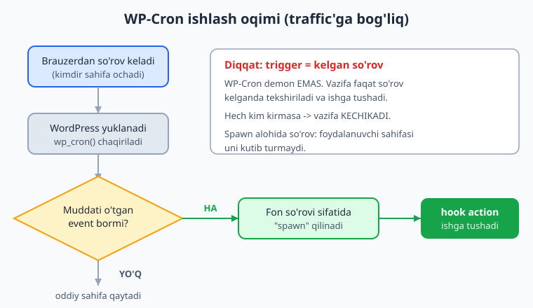
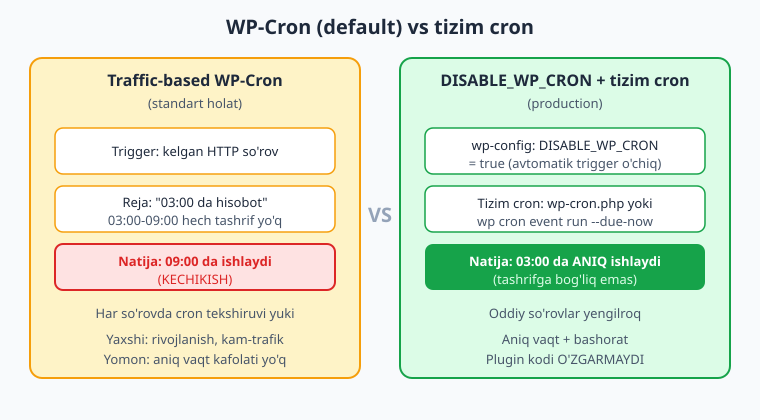
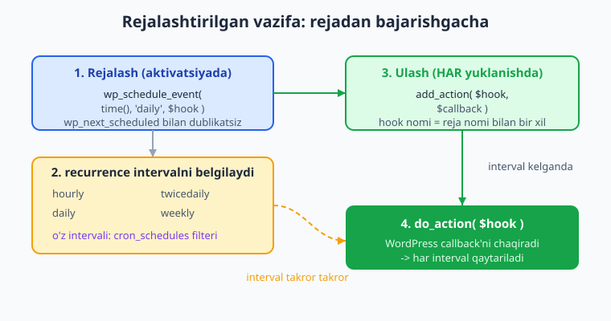

# 17 — WP-Cron va fon vazifalari

[⬅️ Oldingi: 16 — REST API: o'z endpoint'laringiz](./16-rest-api.md) · [🏠 README](./README.md) · [Keyingi: 18 — Email, HTTP API va keshlash ➡️](./18-email-http-cache.md)

> **Bu bobda:** WordPress'da rejalashtirilgan (scheduled) fon vazifalarini WP-Cron bilan qanday yozishni — `wp_schedule_event` orqali takrorlanuvchi vazifa rejalash, hook'ga `add_action` ulash, `wp_next_scheduled` bilan dublikatni oldini olish, aktivatsiyada rejalash va deaktivatsiyada `wp_clear_scheduled_hook` bilan tozalash, `cron_schedules` filteri bilan o'z intervalingizni (masalan har 5 daqiqa) qo'shish, `wp_schedule_single_event` bilan bir martalik vazifa — o'rganamiz; eng muhimi, WP-Cron "haqiqiy cron" EMASligini (u tashrif/traffic'ga bog'liq) tushunib, production'da `DISABLE_WP_CRON` + tizim cron bilan ishonchli, aniq vaqtli ishga tushirishni sozlaymiz va katta hajmli vazifalar uchun Action Scheduler'ga ham qisqacha to'xtalamiz.

---

## Muammo: "har kuni eski kitoblarni yangila"

"Kitoblar katalogi" plugin'imiz o'sib bormoqda. Sayt egasi yangi talab qo'yadi:

> "Har kuni tunda eski kitoblarning holatini tekshir: chop etilganiga 1 yildan oshgan kitoblarga `eski` belgisini qo'y, hamda menga kunlik hisobot email'i yubor."

Bu — **fon vazifasi** (background task). Uni hech kim "tugmani bosib" ishga tushirmaydi; u **vaqt bo'yicha** o'zi ishlashi kerak. PHP'da odatda buni operatsion tizimning **cron** (Linux) yoki Task Scheduler (Windows) bilan qilamiz. Lekin plugin yozayotganda siz mijozning serveriga kira olmaysiz — har bir sayt boshqa hosting'da. WordPress bunga **WP-Cron** degan o'z yechimini beradi.

📌 **Asosiy g'oya:** WP-Cron — bu vazifalarni "kelajakda falon vaqtda, falon takrorlanish bilan ishga tushir" deb **rejalash** mexanizmi. Lekin uning ishlash usuli klassik cron'dan tubdan farq qiladi — buni tushunmaslik eng katta xato manbai. Avval shuni hal qilamiz.

---

## WP-Cron "haqiqiy cron" EMAS

Klassik Linux cron — bu tizim demoni: u soatni kuzatadi va belgilangan daqiqa kelganda vazifani **aniq** ishga tushiradi, sayt'ga hech kim kirmasa ham.

WP-Cron boshqacha ishlaydi. WordPress demon emas — u faqat **so'rov** (HTTP request) kelganda jonlanadigan PHP ilovasi. Shuning uchun WP-Cron **traffic'ga asoslangan** (traffic-based): har safar saytingizga so'rov kelganda (kimdir sahifa ochganda), WordPress "muddati o'tgan rejalashtirilgan vazifa bormi?" deb tekshiradi va bo'lsa, uni ishga tushiradi.



Bu degani:

- ⚠️ **Kam tashrifli saytda vazifa kechikadi.** Agar siz vazifani "soat 03:00 da" rejalasangiz, lekin 03:00 dan 09:00 gacha saytga hech kim kirmasa, vazifa faqat **09:00 da** — birinchi so'rov kelganda — ishga tushadi.
- ⚠️ **Aniq vaqt kafolati yo'q.** "Har soatda" degan vazifa, agar 90 daqiqa hech tashrif bo'lmasa, 90 daqiqada bir marta ishlaydi.
- ℹ️ **So'rov kelishi sekinlashmaydi:** WP-Cron alohida, fon HTTP so'rovi sifatida ("spawn") ishga tushiriladi — foydalanuvchining sahifasi uni kutib turmaydi. Lekin baribir trigger — bu kelgan so'rov.

💡 Buni shunday tasavvur qiling: klassik cron — devordagi soatga qarab vazifa bajaradigan **ishchi**. WP-Cron — eshikdan **kimdir kirganda** "ie, falon ishni qilish vaqti o'tib ketibdi-ku" deb eslab, o'shanda bajaradigan ishchi. Hech kim kirmasa — ish kechikadi.



📌 Shuning uchun: **rivojlanish va kam-trafik saytlar uchun WP-Cron qulay**, lekin **production va aniq vaqt talab qilinganda** — tizim cron bilan to'g'rilaymiz (bu bobning oxirida). Avval rejalashni o'rganamiz, chunki kod ikkala holatda ham bir xil.

---

## Vazifa rejalash: `wp_schedule_event`

Takrorlanuvchi (recurring) vazifa rejalash uchun `wp_schedule_event` ishlatiladi. Rasmiy imzosi (developer.wordpress.org):

```php
wp_schedule_event(
    int $timestamp,      // birinchi ishga tushish vaqti (Unix timestamp, UTC)
    string $recurrence,  // takrorlanish: 'hourly' | 'twicedaily' | 'daily' | 'weekly'
    string $hook,        // ishga tushganda chaqiriladigan action hook nomi
    array $args = [],     // hook callback'iga uzatiladigan argumentlar (ixtiyoriy)
    bool $wp_error = false // xatoda WP_Error qaytarsinmi (ixtiyoriy)
): bool|WP_Error
```

Ish ikki qismdan iborat, **ularni adashtirmang**:

1. **Rejalash** (`wp_schedule_event`) — "falon vaqtda, falon takrorlanish bilan, falon **hook** ishlasin" deb yozib qo'yish.
2. **Hook'ga ish ulash** (`add_action`) — o'sha hook ishga tushganda **nima qilinishi** kerakligini belgilash.

Rejalash bir marta qilinadi (odatda plugin aktivatsiyasida). `add_action` esa **har** yuklanishda ro'yxatdan o'tishi kerak — chunki vazifa ishga tushganda WordPress shu hook'ni `do_action` qiladi va sizning callback'ingiz ro'yxatda turishi shart.



### To'liq misol: kunlik vazifa

```php
namespace Oqil\KitobKatalog;

class Cron {

	// Hook nomi — prefiksli, izchil. Rejalash ham, add_action ham SHU nomni ishlatadi.
	const KUNLIK_HOOK = 'kitoblar_katalogi_kunlik_vazifa';

	/**
	 * Hook'ni callback'ga ulash. HAR yuklanishda chaqiriladi (init/plugins_loaded).
	 * Vazifa ishga tushganda WordPress shu callback'ni chaqiradi.
	 */
	public static function registratsiya(): void {
		add_action( self::KUNLIK_HOOK, [ self::class, 'kunlik_ishni_bajar' ] );
	}

	/**
	 * Aktivatsiyada chaqiriladi: agar hali rejalashtirilmagan bo'lsa, rejalaymiz.
	 */
	public static function rejalashtir(): void {
		// DUBLIKAT oldini olish: faqat rejalashtirilmagan bo'lsa rejalaymiz
		if ( ! wp_next_scheduled( self::KUNLIK_HOOK ) ) {
			wp_schedule_event( time(), 'daily', self::KUNLIK_HOOK );
		}
	}

	/**
	 * Deaktivatsiyada chaqiriladi: rejani tozalaymiz.
	 */
	public static function tozala(): void {
		wp_clear_scheduled_hook( self::KUNLIK_HOOK );
	}

	/**
	 * Asl ish: eski kitoblarni belgilash + hisobot.
	 */
	public static function kunlik_ishni_bajar(): void {
		$bir_yil_oldin = time() - YEAR_IN_SECONDS;

		$eskilar = get_posts( [
			'post_type'      => 'kitob',
			'post_status'    => 'publish',
			'posts_per_page' => 50, // bir martada cheklab, og'irlikni nazorat qilamiz
			'date_query'     => [
				[ 'before' => gmdate( 'Y-m-d', $bir_yil_oldin ) ],
			],
			'fields'         => 'ids',
		] );

		foreach ( $eskilar as $kitob_id ) {
			update_post_meta( $kitob_id, '_kitkat_eski', '1' );
		}

		// Hisobotni log qilamiz (email 18-bobda wp_mail bilan)
		error_log( sprintf( '[kitoblar-katalogi] %d ta eski kitob belgilandi', count( $eskilar ) ) );
	}
}
```

Asosiy plugin faylida ulaymiz:

```php
// kitoblar-katalogi/kitoblar-katalogi.php
use Oqil\KitobKatalog\Cron;

// Har yuklanishda hook -> callback bog'lanishi SHART
add_action( 'init', [ Cron::class, 'registratsiya' ] );

// Aktivatsiyada rejalaymiz, deaktivatsiyada tozalaymiz
register_activation_hook( __FILE__, [ Cron::class, 'rejalashtir' ] );
register_deactivation_hook( __FILE__, [ Cron::class, 'tozala' ] );
```

📌 **Uch qoidani yodda tuting:**

1. **`add_action` har doim** (har yuklanishda) ro'yxatdan o'tadi — aks holda vazifa ishga tushganda callback topilmaydi.
2. **Rejalash aktivatsiyada**, `wp_next_scheduled` tekshiruvi bilan — dublikat rejani oldini oladi.
3. **Tozalash deaktivatsiyada** — `wp_clear_scheduled_hook` bilan "orfan" reja qoldirmaymiz.

⚠️ **`add_action` ni `register_activation_hook` ichiga QO'YMANG.** Aktivatsiya bir marta ishlaydi; ulanish esa har so'rovda kerak. Ularni aralashtirsangiz, vazifa rejalanadi-yu, lekin ishga tushganda hech narsa bajarilmaydi (callback ulanmagan).

### Dublikat reja nega xavfli

`wp_next_scheduled($hook)` — agar shu hook rejalashtirilgan bo'lsa, keyingi ishga tushish vaqtini (Unix timestamp) qaytaradi; bo'lmasa `false`. Rasmiy imzo:

```php
wp_next_scheduled( string $hook, array $args = [] ): int|false
```

Agar tekshiruvsiz har aktivatsiyada `wp_schedule_event` chaqirsangiz, **bir nechta bir xil reja** paydo bo'ladi va vazifa har intervalda bir necha marta ishlaydi. `if ( ! wp_next_scheduled(...) )` — buning oldini oladi.

⚠️ **`$args` mosligi:** `wp_next_scheduled` (va `wp_unschedule_event`) rejani topish uchun `$args` ni ham hisobga oladi — WordPress ichida `md5( serialize( $args ) )` orqali hash hisoblanadi. Agar rejalashda `wp_schedule_event( time(), 'daily', $hook, [ 5 ] )` deb argument bersangiz, tekshirishda ham **aynan o'sha** `wp_next_scheduled( $hook, [ 5 ] )` ni bering. Tip ham muhim: `[ 5 ]` (int) va `[ '5' ]` (string) — boshqa hash.

---

## Standart takrorlanish qiymatlari

`$recurrence` faqat ro'yxatdan o'tgan nomli intervallardan biri bo'lishi mumkin. WordPress yadrosida tayyor turadiganlari (rasmiy hujjat):

| Qiymat | Interval |
|---|---|
| `'hourly'` | Har soatda (3600 s) |
| `'twicedaily'` | Kuniga ikki marta (12 soat) |
| `'daily'` | Har kuni (24 soat) |
| `'weekly'` | Har hafta (7 kun) — WP 5.4 dan yadroda |

📌 `$recurrence` ga **to'g'ridan-to'g'ri sekund yoki ixtiyoriy matn berib bo'lmaydi** — u nomli jadvalga (`wp_get_schedules()`) murojaat qiladi. O'z intervalingiz kerak bo'lsa, avval uni `cron_schedules` filteri bilan ro'yxatga qo'shishingiz shart (keyingi bo'lim).

---

## O'z intervalingiz: `cron_schedules` filteri

"Har 5 daqiqada narxlarni yangila" kabi vazifa uchun standart intervallar yetmaydi. `cron_schedules` filteri jadvalga yangi nomli interval qo'shadi. Filter callback'i mavjud `$schedules` massivini oladi, unga o'z elementini **qo'shadi** va massivni qaytaradi.

Har bir interval ikki kalitdan iborat: `interval` (sekundda, **int**) va `display` (odamga ko'rinadigan nom, **string**).

```php
namespace Oqil\KitobKatalog;

add_filter( 'cron_schedules', static function ( array $schedules ): array {
	// MUHIM: mavjud jadvalga QO'SHAMIZ, qayta yozmaymiz (boshqa plagin intervallarini saqlab)
	$schedules['kitkat_5min'] = [
		'interval' => 5 * MINUTE_IN_SECONDS, // 300 sekund
		'display'  => __( 'Har 5 daqiqada', 'kitoblar-katalogi' ),
	];
	return $schedules;
} );
```

Endi shu nomdan rejalashda foydalanamiz:

```php
if ( ! wp_next_scheduled( 'kitkat_narx_yangilash' ) ) {
	wp_schedule_event( time(), 'kitkat_5min', 'kitkat_narx_yangilash' );
}
add_action( 'kitkat_narx_yangilash', 'kitkat_narxlarni_yangila' );
```

⚠️ **Tartib muhim:** `cron_schedules` filteri **rejalashdan oldin** ro'yxatdan o'tishi kerak. Eng ishonchli yo'l — filterni plugin yuklanishida (fayl yuqorisida yoki `init` da emas, balki har so'rovda bajariladigan joyda) ulash. Filter ulanmagan paytda noma'lum `$recurrence` bilan rejalasangiz, `wp_schedule_event` `false` qaytaradi va vazifa **rejalanmaydi**.

💡 ⚠️ **Juda qisqa interval — past anti-naqsh.** `kitkat_5min` ni traffic-based WP-Cron bilan ishlatsangiz, u **faqat har 5 daqiqada kamida bitta tashrif bo'lsa** ishlaydi. Bunday tez-tez bajariladigan vazifalar uchun pastdagi tizim cron yondashuvi shart (yoki Action Scheduler).

---

## Bir martalik vazifa: `wp_schedule_single_event`

Ba'zan vazifa **bir marta**, kelajakdagi biror vaqtda bajarilishi kerak — takrorlanmasdan. Masalan: foydalanuvchi yangi kitob qo'shganda, 10 daqiqadan keyin tashqi API'dan muqovani yuklab olishni rejalash (so'rovni sekinlashtirmaslik uchun fonga surish).

```php
wp_schedule_single_event(
    int $timestamp,        // qachon ishlasin (Unix timestamp, UTC)
    string $hook,          // ishga tushadigan action hook
    array $args = [],       // callback'ga argumentlar
    bool $wp_error = false  // xatoda WP_Error qaytarsinmi
): bool|WP_Error
```

```php
namespace Oqil\KitobKatalog;

// Kitob saqlanganda -> 10 daqiqadan keyin muqovani fonda yuklab olishni rejala
add_action( 'save_post_kitob', static function ( int $post_id ): void {
	// Autosave/revision'larni o'tkazib yuboramiz
	if ( wp_is_post_autosave( $post_id ) || wp_is_post_revision( $post_id ) ) {
		return;
	}

	// Bir martalik vazifa: hook'ga kitob ID sini argument qilib uzatamiz
	wp_schedule_single_event(
		time() + 10 * MINUTE_IN_SECONDS,
		'kitkat_muqova_yuklash',
		[ $post_id ]
	);
}, 10, 1 );

// Hook callback'i HAR yuklanishda ulanadi; argumentni qabul qiladi
add_action( 'kitkat_muqova_yuklash', static function ( int $post_id ): void {
	// 18-bob: wp_remote_get bilan muqovani yuklab, attachment qilib saqlash
	error_log( "Kitob {$post_id} uchun muqova fonda yuklanmoqda" );
}, 10, 1 );
```

📌 `wp_schedule_single_event` ham `$args` ni hash'ga qo'shadi: bir xil `$hook` + bir xil `$args` bilan **takroriy** bir martalik vazifa qo'shsangiz (10 daqiqa ichida), WordPress dublikatni rad etadi. Bu odatda foydali — masalan bir kitob bir necha marta saqlansa, muqova faqat bir marta yuklanadi.

💡 Bir martalik vazifani ishlamasdan oldin bekor qilish kerak bo'lsa, `wp_unschedule_event( $timestamp, $hook, $args )` ishlatiladi:

```php
wp_unschedule_event(
    int $timestamp, string $hook, array $args = [], bool $wp_error = false
): bool|WP_Error
```

`$timestamp` ni `wp_next_scheduled( $hook, $args )` dan olishingiz mumkin.

---

## Tozalash: `wp_clear_scheduled_hook` vs `wp_unschedule_event`

Plugin deaktivatsiya qilinganda barcha rejalaringizni tozalash **shart** — aks holda plugin o'chsa ham WordPress uning hook'ini ishga tushirishga urinaveradi (hook callback'i endi yo'q — sokin xatolik yoki keraksiz yuk).

| Funksiya | Imzo | Qachon |
|---|---|---|
| `wp_clear_scheduled_hook` | `wp_clear_scheduled_hook($hook, $args = [], $wp_error = false): int\|false\|WP_Error` | Hook bo'yicha **barcha** rejalarni o'chirish (deaktivatsiyada) |
| `wp_unschedule_event` | `wp_unschedule_event($timestamp, $hook, $args = [], $wp_error = false): bool\|WP_Error` | **Bitta aniq** rejani (timestamp bo'yicha) o'chirish |

```php
register_deactivation_hook( __FILE__, static function (): void {
	wp_clear_scheduled_hook( 'kitoblar_katalogi_kunlik_vazifa' );
	wp_clear_scheduled_hook( 'kitkat_narx_yangilash' );
	// Bir martalik 'kitkat_muqova_yuklash' lar ham bo'lsa, ularni ham tozalang:
	wp_clear_scheduled_hook( 'kitkat_muqova_yuklash' );
} );
```

📌 `wp_clear_scheduled_hook` **nechta** reja o'chirilganini (int) qaytaradi — `0` bo'lsa, shu hook+args bilan reja yo'q edi. Agar rejalashda `$args` bergan bo'lsangiz, tozalashda ham **aynan o'sha** `$args` ni bering, aks holda reja topilmaydi va o'chmaydi.

---

## Production: WP-Cron'ni "haqiqiy" cron'ga aylantirish

Endi muammoning ildiziga qaytamiz. Traffic-based WP-Cron ikki sababdan production'ga to'liq mos emas:

- **Aniqlik yo'q:** kam tashrifda vazifa kechikadi.
- **Har so'rovda tekshiruv yuki:** WordPress har sahifa yuklanishida cron'ni tekshirib spawn qiladi — yuqori trafikda bu keraksiz qo'shimcha so'rovlar (ba'zan bir vaqtda bir nechta spawn).

To'g'ri yondashuv ikki qadam:

**1-qadam — `wp-config.php` da WP-Cron'ning avtomatik trigerini o'chiring:**

```php
// wp-config.php (foydalanuvchi o'z saytida qiladi, plugin EMAS)
define( 'DISABLE_WP_CRON', true );
```

Bu WordPress'ga "har so'rovda cron'ni o'zing tekshirma" deydi. Endi rejalashtirilgan vazifalar **avtomatik ishlamaydi** — ularni tashqaridan biz ishga tushiramiz.

**2-qadam — tizim cron'ni `wp-cron.php` ni aniq vaqtda chaqirishga sozlang.** Endi vazifani ishga tushiradigan — operatsion tizimning haqiqiy cron'i, demak **aniq vaqt** kafolatlanadi.

Linux/macOS crontab (har 5 daqiqada `wp-cron.php` ni so'rab turadi):

```bash
# crontab -e ichida, har 5 daqiqada wp-cron.php ni chaqir
*/5 * * * * wget -q -O - https://saytingiz.uz/wp-cron.php?doing_wp_cron >/dev/null 2>&1
```

yoki WP-CLI bilan (ishonchliroq — HTTP sarlama yuki yo'q, faqat **muddati kelgan** vazifalarni ishga tushiradi):

```bash
# Har 5 daqiqada, muddati kelgan barcha vazifalarni ishga tushir
*/5 * * * * cd /var/www/saytingiz && wp cron event run --due-now >/dev/null 2>&1
```

Windows Server'da Task Scheduler bilan PowerShell orqali `Invoke-WebRequest https://saytingiz.uz/wp-cron.php` ni chaqirish mumkin.

📌 **Nega production'da shu afzal:**

- ⏱️ **Aniq vaqt:** vazifa belgilangan daqiqada ishlaydi — tashrifga bog'liq emas.
- ⚡ **Performance:** oddiy so'rovlar endi cron tekshiruvini ko'tarmaydi — sayt yengilroq.
- 🔁 **Bashorat:** "tunda 03:00 da hisobot" haqiqatan 03:00 da ishlaydi (cron'ni o'sha vaqtga moslab).

💡 Ko'p professional hosting (managed WordPress) buni **avtval** sozlab qo'ygan: ular `DISABLE_WP_CRON` ni yoqib, o'z tizim cron'ini ulaydi. Plugin sifatida siz buni majburlay olmaysiz — lekin `readme.txt` (28-bob) yoki sozlamalar sahifasida foydalanuvchiga **tavsiya** qilishingiz mumkin. Plugin kodi **ikkala holatda ham** o'zgarmaydi: siz baribir `wp_schedule_event` bilan rejalaysiz; faqat **trigger** manbasi farq qiladi.

ℹ️ **`wp_doing_cron()`** funksiyasi — joriy so'rov cron so'rovi ekanini (`DOING_CRON` konstantasi orqali) `bool` qaytaradi. Vazifa ichida "men cron kontekstidamanmi?" deb tekshirish kerak bo'lsa foydali (masalan ortiqcha vaqt chegarasini oshirish uchun).

⚠️ **Halol eslatma:** WP-Cron'ning jonli triggeri (so'rov kelganda spawn, tizim cron chaqiruvi, vazifaning haqiqatan ishga tushishi) faqat **ishlab turgan WordPress saytida** ko'rinadi. Yuqoridagi kod docs bilan tasdiqlangan va sintaktik to'g'ri; uni o'z saytingizda sinab ko'ring: WP-CLI bilan `wp cron event list` rejalarni ko'rsatadi, `wp cron event run --due-now` esa muddati kelganlarni qo'lda ishga tushiradi. WP Crontrol plagini esa admin'da rejalarni grafik ko'rsatadi.

---

## Katta hajm uchun: Action Scheduler (kirish)

WP-Cron ko'p, og'ir yoki **navbatli** (queue) vazifalar uchun mo'ljallanmagan. Agar sizda 10 000 ta kitobni navbat bilan qayta ishlash, yoki minglab fon vazifasini ishonchli (xatoda qayta urinish, jurnal bilan) bajarish kerak bo'lsa — **Action Scheduler** kerak bo'ladi.

Action Scheduler — bu o'z DB jadvallariga ega bo'lgan, WordPress ustida ishlaydigan ishonchli navbat kutubxonasi. Uni **WooCommerce** keng ishlatadi (buyurtmalar, email'lar, hisobotlar — yuz minglab vazifa). U:

- Vazifalarni **o'z jadvallarida** saqlaydi (`wp_options` ni shishirmaydi — WP-Cron'da ko'p reja bo'lsa `cron` option og'irlashadi).
- **Partiyalab** (batch) ishlaydi — bir so'rovda hammasini emas, qism-qism.
- **Jurnal va qayta urinish** beradi — qaysi vazifa qachon ishladi/xato bo'ldi ko'rinadi.

```php
// Action Scheduler ulangan bo'lsa (kompozer yoki WooCommerce orqali):
// Bir martalik vazifa
as_schedule_single_action( time() + HOUR_IN_SECONDS, 'kitkat_katta_import', [ $batch_id ] );

// Takrorlanuvchi vazifa (interval sekundda)
as_schedule_recurring_action( time(), DAY_IN_SECONDS, 'kitoblar_katalogi_kunlik_vazifa' );

// Hook'ga ulanish odatdagidek add_action bilan
add_action( 'kitkat_katta_import', 'kitkat_import_partiyasini_bajar', 10, 1 );
```

📌 **Qoidaga aylantiring:** oddiy, kam sonli, vaqti tig'iz bo'lmagan vazifalar — **WP-Cron**. Ko'p sonli, og'ir, ishonchlilik talab qiladigan navbat ishlari — **Action Scheduler**. Ikkalasining ham hook'ga ulanishi `add_action` bilan bir xil; farqi — rejalash va bajarish dvigatelida.

ℹ️ Action Scheduler — alohida kutubxona; uni plugin'ingizga Composer bilan qo'shasiz yoki WooCommerce mavjud bo'lsa allaqachon bor. Bu bobda chuqur kirmaymiz, lekin "WP-Cron yetmay qoldi" degan signalni tanib olishingiz muhim.

---

## Birga qo'yamiz

"Kitoblar katalogi" plugin'ida endi fon vazifalari bor:

- **Kunlik vazifa** (`daily`) — eski kitoblarni belgilash + hisobot (`wp_schedule_event`, aktivatsiyada `wp_next_scheduled` bilan, deaktivatsiyada `wp_clear_scheduled_hook`).
- **O'z intervali** (`kitkat_5min`) — `cron_schedules` filteri orqali tez-tez bajariladigan vazifa uchun.
- **Bir martalik vazifa** — kitob saqlanganda muqovani fonga surish (`wp_schedule_single_event`).
- **Production** — `DISABLE_WP_CRON` + tizim cron bilan aniq vaqt va yengil so'rovlar.

Eng muhim saboq: WP-Cron — qulay, lekin **traffic'ga bog'liq**; aniqlik kerak bo'lganda uni tizim cron bilan to'g'rilang, katta navbat kerak bo'lganda Action Scheduler'ga o'ting. Keyingi bobda fon vazifalari ko'pincha hamroh bo'ladigan ishlarni — email yuborish (`wp_mail`), tashqi API'ga HTTP so'rov (`wp_remote_get`) va natijalarni keshlashni — o'rganamiz.

---

## 17-bob mashqlari

### Oson

1. **(Oson)** O'z so'zingiz bilan tushuntiring: nima uchun "soat 03:00 da" rejalangan WP-Cron vazifasi kam tashrifli saytda 03:00 da emas, balki keyinroq ishlashi mumkin?
2. **(Oson)** `wp_schedule_event` ning birinchi uchta majburiy parametri nima va ular qanday tartibda keladi?
3. **(Oson)** `wp_next_scheduled('falon_hook')` qaysi ikki turdagi qiymatni qaytarishi mumkin va har biri nimani bildiradi?
4. **(Oson)** Standart WordPress takrorlanish qiymatlaridan to'rttasini sanab bering. `'every_minute'` ulardan birimi?
5. **(Oson)** `add_action` ni hook'ga ulashni nima uchun aktivatsiya emas, **har yuklanish** (masalan `init`) da qilish kerak?

### O'rta

6. **(O'rta)** `cron_schedules` filteri bilan "har 10 daqiqada" intervalini qo'shing. `interval` va `display` kalitlarining tiplari qanday? Filterda nima uchun `$schedules` massiviga **qo'shish** (qayta yozmaslik) muhim?

    <details markdown="1"><summary>Yechim</summary>

    ```php
    add_filter( 'cron_schedules', static function ( array $schedules ): array {
    	$schedules['kitkat_10min'] = [
    		'interval' => 10 * MINUTE_IN_SECONDS, // int, sekundda (600)
    		'display'  => __( 'Har 10 daqiqada', 'kitoblar-katalogi' ), // string
    	];
    	return $schedules; // QO'SHIB qaytaramiz
    } );
    ```

    **Tushuntirish:** `interval` — int (sekund), `display` — string (odamga ko'rinadigan nom). `$schedules` ni qayta yozsangiz (`return [ ... ]`), boshqa plugin va yadro intervallari (`hourly`, `daily`...) yo'qoladi — shuning uchun mavjud massivga element qo'shib, butun massivni qaytaramiz.
    </details>

7. **(O'rta)** `wp_schedule_single_event` va `wp_schedule_event` o'rtasidagi farq nima? Har biriga bittadan amaliy misol holatini ayting.
8. **(O'rta)** Nima uchun `wp_next_scheduled` va `wp_clear_scheduled_hook` ga rejalashda ishlatgan **aynan o'sha `$args`** ni berish kerak? WordPress rejani qanday identifikatsiya qiladi?
9. **(O'rta)** Production saytda `define('DISABLE_WP_CRON', true)` qilingach, rejalashtirilgan vazifalar ishlashda davom etishi uchun yana nima sozlanishi kerak? Bir crontab qatori yozing.

    <details markdown="1"><summary>Yechim</summary>

    ```bash
    # Har 5 daqiqada muddati kelgan vazifalarni WP-CLI bilan ishga tushir
    */5 * * * * cd /var/www/saytingiz && wp cron event run --due-now >/dev/null 2>&1
    ```

    yoki HTTP orqali:

    ```bash
    */5 * * * * wget -q -O - https://saytingiz.uz/wp-cron.php?doing_wp_cron >/dev/null 2>&1
    ```

    **Tushuntirish:** `DISABLE_WP_CRON` so'rovga bog'liq avtomatik trigerni o'chiradi; endi vazifalarni tizim cron'i `wp-cron.php` ni yoki `wp cron event run --due-now` ni aniq vaqtda chaqirib ishga tushiradi. WP-CLI varianti faqat muddati kelganlarini bajaradi va HTTP yuki yo'q.
    </details>

### Qiyin

10. **(Qiyin)** "Kitoblar katalogi" uchun to'liq `Cron` sinfini yozing: `daily` takrorlanish bilan hook rejalansin (aktivatsiyada, `wp_next_scheduled` bilan dublikatdan himoyalangan), hook `init` da callback'ga ulansin, deaktivatsiyada `wp_clear_scheduled_hook` bilan tozalansin. Callback eski kitoblarni `_kitkat_eski` meta bilan belgilasin.

    <details markdown="1"><summary>Yechim</summary>

    ```php
    namespace Oqil\KitobKatalog;

    class Cron {
    	const HOOK = 'kitoblar_katalogi_kunlik_vazifa';

    	public static function init(): void {
    		// HAR yuklanishda hook -> callback ulanishi
    		add_action( self::HOOK, [ self::class, 'bajar' ] );
    	}

    	public static function rejalashtir(): void {
    		// Dublikatdan himoya: faqat rejalashtirilmagan bo'lsa
    		if ( ! wp_next_scheduled( self::HOOK ) ) {
    			wp_schedule_event( time(), 'daily', self::HOOK );
    		}
    	}

    	public static function tozala(): void {
    		wp_clear_scheduled_hook( self::HOOK );
    	}

    	public static function bajar(): void {
    		$eskilar = get_posts( [
    			'post_type'      => 'kitob',
    			'post_status'    => 'publish',
    			'posts_per_page' => 50,
    			'fields'         => 'ids',
    			'date_query'     => [
    				[ 'before' => gmdate( 'Y-m-d', time() - YEAR_IN_SECONDS ) ],
    			],
    		] );

    		foreach ( $eskilar as $id ) {
    			update_post_meta( $id, '_kitkat_eski', '1' );
    		}
    	}
    }

    // Asosiy faylda:
    // add_action( 'init', [ Cron::class, 'init' ] );
    // register_activation_hook( __FILE__, [ Cron::class, 'rejalashtir' ] );
    // register_deactivation_hook( __FILE__, [ Cron::class, 'tozala' ] );
    ```

    **Tushuntirish:** `init()` har yuklanishda hook'ni callback'ga ulaydi (vazifa ishga tushganda callback topilishi uchun). `rejalashtir()` aktivatsiyada, `wp_next_scheduled` bilan dublikatni oldini olib rejalaydi. `tozala()` deaktivatsiyada barcha rejalarni o'chiradi. `gmdate` UTC sanasini beradi (cron timestamp'lari UTC).
    </details>

11. **(Qiyin)** `cron_schedules` ga `kitkat_5min` (har 5 daqiqa) qo'shing va shu interval bilan `kitkat_narx_yangilash` hook'ini rejalang. Filter va rejalash tartibi nima uchun muhimligini izohlang.

    <details markdown="1"><summary>Yechim</summary>

    ```php
    namespace Oqil\KitobKatalog;

    // 1) Avval intervalni ro'yxatga qo'shamiz (har so'rovda)
    add_filter( 'cron_schedules', static function ( array $schedules ): array {
    	$schedules['kitkat_5min'] = [
    		'interval' => 5 * MINUTE_IN_SECONDS,
    		'display'  => __( 'Har 5 daqiqada', 'kitoblar-katalogi' ),
    	];
    	return $schedules;
    } );

    // 2) Hook'ni callback'ga ulaymiz (har so'rovda)
    add_action( 'kitkat_narx_yangilash', static function (): void {
    	// narxlarni yangilash mantiqi (18-bob: wp_remote_get)
    } );

    // 3) Rejalash (masalan aktivatsiyada yoki init da, dublikatdan himoyalangan)
    function kitkat_narx_rejalashtir(): void {
    	if ( ! wp_next_scheduled( 'kitkat_narx_yangilash' ) ) {
    		// 'kitkat_5min' filter ULANGAN bo'lishi SHART, aks holda false qaytadi
    		wp_schedule_event( time(), 'kitkat_5min', 'kitkat_narx_yangilash' );
    	}
    }
    ```

    **Tushuntirish:** `wp_schedule_event` `$recurrence` ni `wp_get_schedules()` jadvalidan qidiradi. Agar `cron_schedules` filteri hali ulanmagan bo'lsa, `kitkat_5min` topilmaydi va rejalash `false` qaytarib, vazifa rejalanmaydi. Shuning uchun filter — rejalashdan oldin, har so'rovda ulanishi kerak. ⚠️ Bunday tez interval faqat tizim cron yoki yetarli trafik bilan ishonchli ishlaydi.
    </details>

12. **(Qiyin)** Kitob saqlanganda (`save_post_kitob`) 15 daqiqadan keyin muqovani fonda yuklab oladigan **bir martalik** vazifa rejalang. Autosave/revision'ni o'tkazib yuboring va hook callback'i kitob ID sini argument sifatida qabul qilsin. Dublikat bir martalik vazifa qanday oldini olinishini izohlang.

    <details markdown="1"><summary>Yechim</summary>

    ```php
    namespace Oqil\KitobKatalog;

    add_action( 'save_post_kitob', static function ( int $post_id ): void {
    	if ( wp_is_post_autosave( $post_id ) || wp_is_post_revision( $post_id ) ) {
    		return; // texnik saqlashlarni o'tkazib yuboramiz
    	}

    	// Bir martalik vazifa: 15 daqiqadan keyin, kitob ID si argument bilan
    	wp_schedule_single_event(
    		time() + 15 * MINUTE_IN_SECONDS,
    		'kitkat_muqova_yuklash',
    		[ $post_id ]
    	);
    }, 10, 1 );

    // Callback HAR yuklanishda ulanadi va argumentni qabul qiladi
    add_action( 'kitkat_muqova_yuklash', static function ( int $post_id ): void {
    	// 18-bob: wp_remote_get bilan muqovani yuklab, attachment qilib saqlash
    	error_log( "Kitob {$post_id} muqovasi fonda yuklanmoqda" );
    }, 10, 1 );
    ```

    **Tushuntirish:** `wp_schedule_single_event` `$hook` + `$args` (`[ $post_id ]`) ni `md5( serialize( $args ) )` bilan hash qiladi. Bir kitob 15 daqiqa ichida bir necha marta saqlansa, bir xil hash tufayli takror reja qo'shilmaydi — muqova faqat bir marta yuklanadi. `add_action` ga `, 10, 1` — callback bitta argument (`$post_id`) qabul qilishini bildiradi.
    </details>

13. **(Qiyin)** WP-Cron'ni production'da to'g'rilashning to'liq rejasini yozing: `wp-config.php` da nima o'zgartiriladi, tizim cron qatori qanday bo'ladi (WP-CLI bilan), va nima uchun bu traffic-based variantdan afzal. Plugin kodi o'zgaradimi?

    <details markdown="1"><summary>Yechim</summary>

    **1) `wp-config.php` (foydalanuvchi o'z saytida):**
    ```php
    define( 'DISABLE_WP_CRON', true );
    ```

    **2) Tizim cron (crontab -e), har 5 daqiqada:**
    ```bash
    */5 * * * * cd /var/www/saytingiz && wp cron event run --due-now >/dev/null 2>&1
    ```

    **3) Nega afzal:**
    - **Aniq vaqt:** vazifa tashrifga bog'liq emas — tizim cron belgilangan vaqtda ishlaydi.
    - **Performance:** oddiy so'rovlar endi cron tekshiruvi yukini ko'tarmaydi; yuqori trafikda bir vaqtda ko'p spawn bo'lmaydi.
    - **Bashorat:** "tunda hisobot" haqiqatan tunda ishlaydi.

    **4) Plugin kodi o'zgarmaydi:** siz baribir `wp_schedule_event`/`wp_schedule_single_event` bilan rejalaysiz va `add_action` bilan ulaysiz. Faqat **trigger** manbasi (so'rov o'rniga tizim cron) farq qiladi.

    **Tushuntirish:** WP-Cron traffic-based — so'rovsiz ishlamaydi. `DISABLE_WP_CRON` avtomatik trigerni o'chiradi va tizim cron'i `wp cron event run --due-now` ni aniq vaqtda chaqirib, faqat muddati kelgan vazifalarni ishonchli bajaradi. Bu plugin mantiqiga emas, faqat ishga tushirish dvigateliga ta'sir qiladi.
    </details>

14. **(Qiyin)** Quyidagi kodda **ikki** xato bor. Ularni toping va tuzating: vazifa rejalanadi-yu, lekin ishga tushganda hech narsa bajarilmaydi; hamda har aktivatsiyada yangi reja qo'shiladi.

    ```php
    register_activation_hook( __FILE__, function () {
    	wp_schedule_event( time(), 'daily', 'kitkat_kunlik' );
    	add_action( 'kitkat_kunlik', 'kitkat_kunlik_ish' );
    } );
    ```

    <details markdown="1"><summary>Yechim</summary>

    **Xato 1:** `add_action` aktivatsiya ichida — u faqat aktivatsiya so'rovida ulanadi, keyingi so'rovlarda emas. Vazifa ishga tushganda (boshqa so'rovda) callback ulanmagan, hech narsa bajarilmaydi. `add_action` har yuklanishda (masalan `init` da yoki fayl yuqorisida) ulanishi kerak.

    **Xato 2:** `wp_next_scheduled` tekshiruvi yo'q — har aktivatsiyada yangi `daily` reja qo'shiladi (dublikat).

    **To'g'ri variant:**
    ```php
    // HAR yuklanishda hook -> callback
    add_action( 'kitkat_kunlik', 'kitkat_kunlik_ish' );

    // Aktivatsiyada, faqat rejalashtirilmagan bo'lsa rejala
    register_activation_hook( __FILE__, static function (): void {
    	if ( ! wp_next_scheduled( 'kitkat_kunlik' ) ) {
    		wp_schedule_event( time(), 'daily', 'kitkat_kunlik' );
    	}
    } );

    // Deaktivatsiyada tozala (orfan reja qoldirmaslik uchun)
    register_deactivation_hook( __FILE__, static function (): void {
    	wp_clear_scheduled_hook( 'kitkat_kunlik' );
    } );
    ```

    **Tushuntirish:** `add_action` aktivatsiyadan tashqariga chiqarildi (har so'rovda ulanadi); `wp_next_scheduled` dublikatni oldini oladi; `register_deactivation_hook` + `wp_clear_scheduled_hook` tozalashni qo'shadi.
    </details>

15. **(Qiyin)** Qachon WP-Cron yetarli emas va Action Scheduler kerak bo'ladi? Kamida uchta belgi ayting va Action Scheduler'ning WP-Cron'dan uchta texnik afzalligini sanang.

    <details markdown="1"><summary>Yechim</summary>

    **WP-Cron yetmaydigan belgilar:**
    - **Ko'p sonli vazifa:** minglab/yuz minglab fon ishi (masalan har foydalanuvchiga email) — `wp_options` dagi `cron` reja og'irlashadi.
    - **Navbatli, partiyalanadigan ish:** 10 000 yozuvni qism-qism qayta ishlash kerak; bitta so'rovda hammasi PHP vaqt chegarasiga uriladi.
    - **Ishonchlilik talab:** xatoda qayta urinish, qaysi vazifa qachon ishladi degan jurnal kerak.

    **Action Scheduler afzalliklari:**
    - **O'z DB jadvallari** — `wp_options` ni shishirmaydi, ko'p vazifani masshtablab saqlaydi.
    - **Partiyalab bajarish** (batch) — yukni so'rovlar bo'ylab taqsimlaydi, vaqt chegarasiga urilmaydi.
    - **Jurnal va qayta urinish** — har vazifaning holati ko'rinadi, xatoda avtomatik retry.

    **Tushuntirish:** WP-Cron — oddiy, kam sonli vazifalar uchun; Action Scheduler (WooCommerce ishlatadi) — og'ir, ishonchli navbat uchun. Hook'ga ulanish ikkalasida ham `add_action` bilan bir xil; farqi rejalash/bajarish dvigatelida (`as_schedule_*` vs `wp_schedule_*`).
    </details>

---

[⬅️ Oldingi: 16 — REST API: o'z endpoint'laringiz](./16-rest-api.md) · [🏠 README](./README.md) · [Keyingi: 18 — Email, HTTP API va keshlash ➡️](./18-email-http-cache.md)
