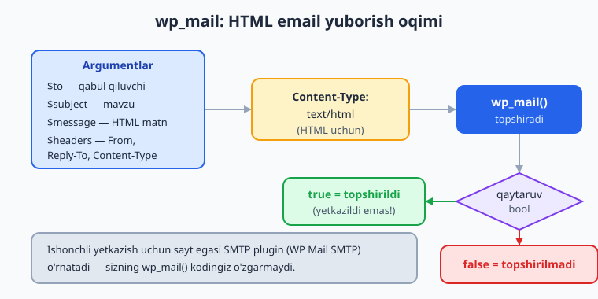
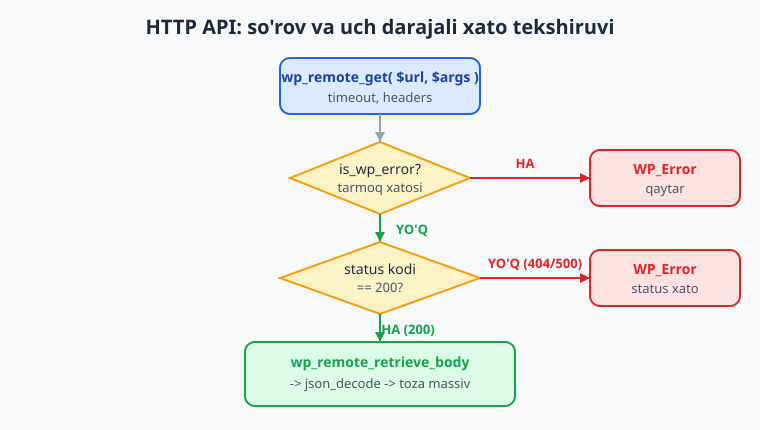
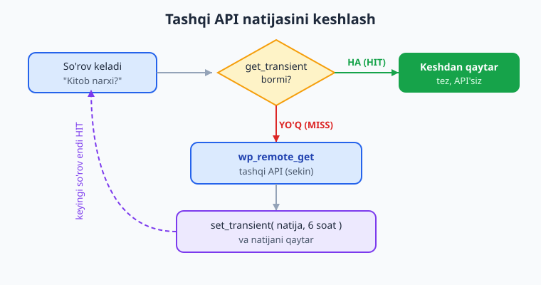

# 18 — Email, HTTP API va keshlash

[⬅️ Oldingi: 17 — WP-Cron va fon vazifalari](./17-wp-cron.md) · [🏠 README](./README.md) · [Keyingi: 19 — Blok muharririga kirish va create-block ➡️](./19-blok-kirish-create-block.md)

> **Bu bobda:** plugin'ingiz tashqi dunyo bilan qanday "gaplashishini" o'rganamiz — `wp_mail()` bilan (HTML email, `From`/`Reply-To` header, `wp_mail_content_type` filter, va nega yetkazib berish ishonchsiz, SMTP plugin tavsiyasi), `wp_remote_get()`/`wp_remote_post()`/`wp_remote_request()` bilan tashqi API'ga `curl` o'rniga WordPress'cha xavfsiz so'rov yuborish, javobni `wp_remote_retrieve_body`/`wp_remote_retrieve_response_code` bilan o'qib `is_wp_error` va `WP_Error` orqali xatoni to'g'ri ushlash, hamda tashqi API natijasini har so'rovda qayta tortmaslik uchun Transients (10-bob) bilan keshlash naqshini — "Kitoblar katalogi" plugin'imizga tashqi kitob API'sidan ma'lumot olib keshlash va yangi kitob qo'shilganda admin'ga email yuborishni qo'shib amalda qilib chiqamiz.

---

## Muammo: plugin saytdan tashqariga chiqishi kerak

"Kitoblar katalogi" plugin'imiz hozircha o'z ichida yopiq: CPT, taxonomiya, meta, o'z jadval, REST endpoint — barchasi sayt ichida. Lekin haqiqiy plugin'lar deyarli har doim **tashqi dunyo** bilan bog'lanadi:

- Yangi kitob qo'shilganda sayt egasiga **email** kelishi kerak ("Yangi kitob: 'PHP asoslari' qo'shildi").
- Kitobning narxi yoki muqovasini **tashqi API'dan** (masalan Open Library yoki o'zingizning katalog serveringizdan) olib kelmoqchisiz.
- Bu tashqi so'rov **sekin** (tarmoq orqali, 200-2000 ms) — uni har sahifa yuklanishida takrorlash saytni o'ldiradi, demak **keshlash** shart.

PHP'da bularni `mail()`, `curl_*` yoki `file_get_contents('http://...')` bilan qilish mumkin. **Lekin WordPress'da bunday qilmang.** WordPress o'zining qatlamlarini beradi: ular hooks bilan kengaytiriladi, proxy/SSL sozlamalarini hurmat qiladi, xatolarni `WP_Error` bilan birxil qaytaradi va xavfsizroq. Bu bob aynan shu uch qatlamni — email, HTTP, kesh — birga o'rgatadi, chunki ular ko'pincha bitta vazifada uchrashadi.

📌 **Oltin qoida:** WordPress ichida tashqi resurs bilan ishlaganda **PHP'ning xom funksiyasini emas, WordPress'ning ekvivalentini** ishlating: `mail()` emas `wp_mail()`, `curl`/`file_get_contents` emas `wp_remote_*`, har og'ir tashqi so'rovni `transient` bilan o'rang.

---

## Email: `wp_mail()`

PHP'ning `mail()` funksiyasi qo'pol: header'lar bilan kurashasiz, xatoni bilmaysiz, plugin'lar aralasholmaydi. WordPress `wp_mail()` ni beradi — u ichida PHPMailer ustida ishlaydi va `wp_mail` filterlari orqali kengaytiriladi.

Rasmiy imzo (developer.wordpress.org bilan tasdiqlangan):

```php
wp_mail(
    string|string[] $to,                  // qabul qiluvchi(lar)
    string          $subject,             // mavzu
    string          $message,             // xat matni
    string|string[] $headers = '',        // qo'shimcha header'lar (ixtiyoriy)
    string|string[] $attachments = []     // ilova fayllar (ixtiyoriy)
): bool                                    // true = topshirildi, false = xato
```

⚠️ **`wp_mail()` ning `true` qaytishi "yetkazib berildi" degani EMAS.** U faqat xatni mail tizimiga **topshirilgani**ni anglatadi (PHP `mail()` yoki SMTP). Xat spam'ga tushishi yoki umuman yetib bormasligi mumkin — bu bobning oxirida shu haqida.

### Eng oddiy email

```php
$natija = wp_mail(
    'admin@misol.uz',
    'Yangi kitob qo\'shildi',
    "Saytga yangi kitob qo'shildi. Tekshirib ko'ring."
);

if ( ! $natija ) {
    // wp_mail false qaytardi -> mail tizimiga topshirilmadi
    error_log( 'Kitoblar katalogi: email topshirilmadi' );
}
```

ℹ️ `$message` — oddiy matn (plain text). Standart `Content-Type` — `text/plain`, shuning uchun bu yerda HTML teglari **matn sifatida** ko'rinadi, render qilinmaydi. HTML xat uchun pastdagi bo'limga qarang.

### Header'lar: `From`, `Reply-To`, `Cc`, `Bcc`

Header'larni **massiv** sifatida berish eng tushunarli yo'l (har element — bitta header satri):

```php
$headers = [
    'From: Kitoblar katalogi <noreply@misol.uz>',
    'Reply-To: Muallif <muallif@misol.uz>',
    'Cc: muharrir@misol.uz',
];

wp_mail( 'admin@misol.uz', 'Yangi kitob', "Matn...", $headers );
```

📌 `From` header — xat **kimdan** kelgani. Agar bermasangiz, WordPress standart `wordpress@<sizning-domeningiz>` ni ishlatadi (ko'pincha mavjud bo'lmagan manzil — spam filtrlari yoqtirmaydi). To'g'ri `From` qo'yish yetkazib berishni yaxshilaydi. `Reply-To` — foydalanuvchi "Javob" bosganda **qaysi manzilga** ketishi.

💡 `From` ni global o'zgartirmoqchi bo'lsangiz (har email uchun), header berish o'rniga `wp_mail_from` va `wp_mail_from_name` filterlaridan foydalaning — lekin bu butun saytga ta'sir qiladi, ehtiyot bo'ling.

### HTML email

Ikki yo'l bor. **Birinchi (afzal) — header orqali**, faqat shu xatga ta'sir qiladi:

```php
namespace Oqil\KitobKatalog;

function kitkat_html_email( string $to, string $subject, string $html ): bool {
    $headers = [
        'Content-Type: text/html; charset=UTF-8',
        'From: Kitoblar katalogi <noreply@misol.uz>',
    ];

    return wp_mail( $to, $subject, $html, $headers );
}
```

**Ikkinchi — `wp_mail_content_type` filter.** Bu **global** (filter qo'shilgan vaqtdagi har bir `wp_mail`'ga ta'sir qiladi), shuning uchun xatdan keyin **darhol olib tashlang**:

```php
namespace Oqil\KitobKatalog;

function kitkat_html_email_filter( string $to, string $subject, string $html ): bool {
    // 1) Content-Type ni text/html ga o'zgartiruvchi filterni qo'shamiz
    $turi = static fn( string $content_type ): string => 'text/html';
    add_filter( 'wp_mail_content_type', $turi );

    // 2) Xatni yuboramiz
    $natija = wp_mail( $to, $subject, $html );

    // 3) Filterni DARHOL olib tashlaymiz -> keyingi xatlar yana text/plain
    remove_filter( 'wp_mail_content_type', $turi );

    return $natija;
}
```

⚠️ Agar `wp_mail_content_type` filterini olib tashlamasangiz, undan keyingi **barcha** email'lar (parol tiklash, izoh xabarnomalari) HTML deb yuboriladi va buzilib ko'rinishi mumkin. Shuning uchun header usuli (faqat bitta xatga ta'sir qiladi) ko'p hollarda xavfsizroq.

📌 HTML xatda matnni **tayyorlaganda escape qiling.** Foydalanuvchi kiritgan ma'lumot (kitob nomi, izoh) HTML'ga tushsa, `esc_html()` bilan tozalang — aks holda XSS yoki buzilgan razmetka chiqadi.



### Plugin'imizga ulaymiz: yangi kitob qo'shilganda email

CPT bilan (07-bob) `kitob` post nashr qilinganda admin'ga xabar yuboramiz. `publish_kitob` hook'i (`publish_{$post_type}`) aynan shu post turi `publish` holatga o'tganda ishga tushadi:

```php
namespace Oqil\KitobKatalog;

add_action( 'publish_kitob', __NAMESPACE__ . '\\yangi_kitob_email', 10, 2 );

function yangi_kitob_email( int $post_id, \WP_Post $post ): void {
    // Faqat birinchi marta publish bo'lganda email kerak (qayta saqlashda emas).
    // Oddiylik uchun bu yerda har publish'da yuboramiz; real holatda
    // post_meta bilan "email yuborilgan" bayrog'ini qo'yish mumkin.

    $admin_email = get_option( 'admin_email' ); // sayt admin manzili (WP core option)
    $sarlavha    = get_the_title( $post );

    $subject = sprintf(
        /* translators: %s: kitob nomi */
        __( 'Yangi kitob qo\'shildi: %s', 'kitoblar-katalogi' ),
        $sarlavha
    );

    // HTML xat matni — foydalanuvchi ma'lumotini esc_html bilan tozalaymiz
    $html = sprintf(
        '<h2>%1$s</h2><p>%2$s</p><p><a href="%3$s">%4$s</a></p>',
        esc_html( $sarlavha ),
        esc_html__( 'Saytga yangi kitob qo\'shildi.', 'kitoblar-katalogi' ),
        esc_url( get_edit_post_link( $post_id, 'raw' ) ?? '' ),
        esc_html__( 'Tahrirlash', 'kitoblar-katalogi' )
    );

    $headers = [
        'Content-Type: text/html; charset=UTF-8',
        'From: Kitoblar katalogi <noreply@' . wp_parse_url( home_url(), PHP_URL_HOST ) . '>',
    ];

    wp_mail( $admin_email, $subject, $html, $headers );
}
```

⚠️ **Halol eslatma:** real email yuborilishi faqat **ishlaydigan saytda** ko'rinadi (mail serveri sozlangan bo'lsa). Yuqoridagi kod docs bilan tasdiqlangan va sintaktik to'g'ri, lekin natijani o'z saytingizda kuzating — masalan **MailHog** (lokal SMTP tutqich, `wp-env`'da ulanadi, 02-bob) yoki **WP Mail Logging** plugin'i bilan yuborilgan xatlarni ko'ring.

### Nega email ko'pincha yetib bormaydi — SMTP plugin

Bu — yangi plugin yozuvchilarni kutilmaganda urib ketadigan masala. `wp_mail()` standart holatda PHP'ning `mail()` funksiyasidan foydalanadi, u esa serverning lokal `sendmail` dasturiga tayanadi. Ko'pchilik shared hosting va bulut serverlarida:

- Lokal `sendmail` umuman sozlanmagan yoki o'chirilgan.
- Xat yuborilsa ham, `From` manzili domenga mos kelmaydi (SPF/DKIM yo'q) — Gmail/Outlook uni **spam**ga tashlaydi yoki rad etadi.

Shuning uchun amaliyotda **SMTP plugin** ishlatiladi: u `wp_mail()` ni real SMTP server (SendGrid, Mailgun, Amazon SES, Gmail SMTP) orqali yuborishga ulaydi. Eng mashhuri — **WP Mail SMTP**.

📌 Siz plugin muallifi sifatida `wp_mail()` ni to'g'ri ishlatasiz (xolos) — SMTP'ni **sayt egasi** o'rnatadi. Sizning kodingiz **o'zgarmaydi**: WP Mail SMTP `wp_mail` qatlamiga ulanadi, sizning `wp_mail()` chaqiruvingiz avtomatik SMTP orqali ketadi. Bu — WordPress hook arxitekturasining go'zalligi.

💡 Plugin hujjatingizda ("o'z saytingizda") sayt egasiga maslahat bering: "Email kelmasa, WP Mail SMTP kabi SMTP plugin o'rnating va to'g'ri `From` domenini sozlang."

---

## HTTP API: tashqi serverga so'rov

Endi kitob ma'lumotini tashqi API'dan olamiz. PHP'da `curl` yoki `file_get_contents` ishlatardingiz — WordPress'da **HTTP API** bor. U bitta birxil interfeys ostida server muhitiga qarab `curl`, `streams` yoki boshqasini tanlaydi, proxy/timeout/SSL sozlamalarini hurmat qiladi va xatoni `WP_Error` bilan qaytaradi.

| Funksiya | Vazifa | Imzo |
|---|---|---|
| `wp_remote_get` | GET so'rov | `wp_remote_get( $url, $args = [] ): array\|WP_Error` |
| `wp_remote_post` | POST so'rov | `wp_remote_post( $url, $args = [] ): array\|WP_Error` |
| `wp_remote_request` | Ixtiyoriy metod (`$args['method']`) | `wp_remote_request( $url, $args = [] ): array\|WP_Error` |
| `wp_remote_head` | HEAD so'rov | `wp_remote_head( $url, $args = [] ): array\|WP_Error` |

💡 `wp_remote_get`/`wp_remote_post` — `wp_remote_request` ustidagi qulay o'ramlar (`method` ni o'zlari belgilaydi). Uchchovi ham bir xil javob qaytaradi.

⚠️ **URL foydalanuvchidan kelsa**, `wp_remote_get` o'rniga `wp_safe_remote_get` ishlating (SSRF himoyasi: ichki manzillarga so'rov yuborishni bloklaydi). Tashqi, o'zingiz biladigan API uchun `wp_remote_get` yetarli.

### `$args` — so'rov parametrlari

Eng ko'p ishlatiladigan kalitlar (rasmiy hujjatdan):

| Kalit | Ma'no | Default |
|---|---|---|
| `timeout` | Necha sekund kutish | `5` |
| `headers` | So'rov header'lari (massiv) | `[]` |
| `body` | So'rov tanasi (string yoki massiv) | `null` |
| `method` | HTTP metod (`wp_remote_request` uchun) | `'GET'` |
| `redirection` | Ruxsat etilgan redirect soni | `5` |
| `sslverify` | SSL sertifikat tekshiruvi | `true` |

📌 **`timeout` ni ataylab qo'ying.** Standart 5 sekund — agar tashqi API sekin bo'lsa, sizning saytingiz **shu 5 sekund kutib turadi** (foydalanuvchi sahifa yuklanishini kutadi). Shuning uchun: (a) timeout'ni oqilona qo'ying, (b) natijani **keshlang** (pastda), (c) iloji bo'lsa og'ir tashqi chaqiruvni WP-Cron (17-bob) fon vazifasiga o'tkazing.

### Javobni o'qish va xatoni tekshirish

Bu — eng muhim qism. `wp_remote_get` **ikki xil** narsa qaytaradi: muvaffaqiyatda — **massiv** (`headers`, `body`, `response` kalitlari bilan), xatoda (tarmoq uzilishi, DNS, timeout) — **`WP_Error`** obyekti. Shuning uchun **avval `is_wp_error()` bilan tekshiring**, keyingina javobni o'qing.

```php
namespace Oqil\KitobKatalog;

function kitkat_api_soro( string $url ): array|\WP_Error {
    $javob = wp_remote_get( $url, [
        'timeout' => 8,
        'headers' => [
            'Accept'     => 'application/json',
            'User-Agent' => 'KitoblarKatalogi/1.0; ' . home_url(),
        ],
    ] );

    // 1) Tarmoq darajasidagi xato? (DNS, timeout, ulanish uzildi)
    if ( is_wp_error( $javob ) ) {
        // WP_Error'dan kod va xabarni olamiz
        return $javob; // chaqiruvchiga WP_Error'ni qaytaramiz
    }

    // 2) HTTP status kodi — 200 oralig'idami?
    $kod = wp_remote_retrieve_response_code( $javob ); // int|string
    if ( 200 !== (int) $kod ) {
        return new \WP_Error(
            'kitkat_api_status',
            sprintf(
                /* translators: %d: HTTP status kodi */
                __( 'API kutilmagan status qaytardi: %d', 'kitoblar-katalogi' ),
                (int) $kod
            ),
            [ 'status' => $kod ]
        );
    }

    // 3) Tanani o'qiymiz va JSON'ni dekodlaymiz
    $tana   = wp_remote_retrieve_body( $javob ); // string (bo'sh bo'lishi mumkin)
    $malumot = json_decode( $tana, true );        // assotsiativ massiv

    if ( null === $malumot && JSON_ERROR_NONE !== json_last_error() ) {
        return new \WP_Error(
            'kitkat_api_json',
            __( 'API noto\'g\'ri JSON qaytardi.', 'kitoblar-katalogi' )
        );
    }

    return $malumot; // toza, dekodlangan massiv
}
```



📌 **Uch darajali tekshiruv (yodda saqlang):**

1. **`is_wp_error($javob)`** — tarmoq darajasi (so'rov umuman bormadi: DNS, timeout, ulanish). Buni o'tkazib yuborib `wp_remote_retrieve_body` chaqirsangiz, `WP_Error`'ga bo'sh string qaytadi va xatoni payqamaysiz.
2. **`wp_remote_retrieve_response_code()`** — HTTP darajasi (so'rov bordi, lekin server `404`/`500`/`429` qaytardi). `200 OK` ekanini tekshiring.
3. **`json_decode` + `json_last_error()`** — ma'lumot darajasi (server javob berdi, lekin tana buzuq yoki kutilgan format emas).

💡 `wp_remote_retrieve_body` va `wp_remote_retrieve_response_code` `WP_Error`'ni ham xavfsiz qabul qiladi (`is_wp_error` bo'lsa bo'sh qiymat qaytaradi) — lekin **bu sizni xatoni e'tibordan chetda qoldirmasin.** Doim avval `is_wp_error` bilan ajrating.

### `WP_Error` bilan ishlash

`WP_Error` — WordPress'ning standart xato obyekti (`new WP_Error($code, $message, $data)`). Undan ma'lumot olish:

```php
$natija = kitkat_api_soro( 'https://api.misol.uz/kitob/123' );

if ( is_wp_error( $natija ) ) {
    $kod    = $natija->get_error_code();    // string|int: masalan 'kitkat_api_status'
    $xabar  = $natija->get_error_message(); // string: birinchi xato xabari
    $data   = $natija->get_error_data();    // mixed: uzatilgan qo'shimcha ma'lumot

    error_log( "Kitoblar katalogi API xatosi [{$kod}]: {$xabar}" );
    // Foydalanuvchiga: "Hozircha ma'lumot olib bo'lmadi, keyinroq urinib ko'ring."
} else {
    // $natija — toza massiv, ishlatishimiz mumkin
}
```

📌 `WP_Error` naqshi WordPress bo'ylab izchil: `wp_remote_*`, `register_rest_route` callback'lari (16-bob), ko'p core funksiyalar xatoda `WP_Error` qaytaradi. Shuning uchun `is_wp_error()` — eng tez-tez ishlatiladigan tekshiruvlardan biri.

---

## Keshlash: tashqi so'rovni har safar tortmaslik

Tasavvur qiling, kitob sahifasi har ochilganda tashqi API'ga so'rov ketadi. 8 sekundlik timeout, 500 ms javob, kuniga minglab ko'rish — bu **falokat**: sayt sekin, API rate-limit (`429`) qaytaradi, foydalanuvchi kutadi. Yechim — javobni **transient** (10-bob) bilan keshlash.

Naqsh oddiy va kuchli: **avval keshdan o'qishga harakat qiling — bor bo'lsa qaytaring; yo'q bo'lsa tashqi so'rov yuboring va natijani keshga yozing.**

```php
namespace Oqil\KitobKatalog;

function kitkat_kitob_apidan( int $kitob_id ): array|\WP_Error {
    // 1) Kesh kaliti — har kitobga alohida (transient nomi <= 172 belgi)
    $kalit = 'kitkat_api_kitob_' . $kitob_id;

    // 2) Avval keshni tekshiramiz (false !== bilan: bo'sh massivni ham hurmat qilamiz)
    $kesh = get_transient( $kalit );
    if ( false !== $kesh ) {
        return $kesh; // KESH HIT -> tashqi so'rovsiz, tez
    }

    // 3) KESH MISS -> tashqi API'ga so'rov
    $url     = sprintf( 'https://api.misol.uz/kitob/%d', $kitob_id );
    $natija  = kitkat_api_soro( $url ); // yuqoridagi funksiya: massiv yoki WP_Error

    // 4) Xato bo'lsa -> KESHLAMAYMIZ (yoki qisqa muddatga), shunda keyingi
    //    so'rovda qayta urinish imkoni qoladi. Xatoni qaytaramiz.
    if ( is_wp_error( $natija ) ) {
        // Ixtiyoriy: "negativ kesh" -> qisqa muddatga xatoni eslab, API'ni bombardimon
        // qilmaslik. Bu yerda 1 daqiqaga.
        set_transient( $kalit, $natija, MINUTE_IN_SECONDS );
        return $natija;
    }

    // 5) Muvaffaqiyat -> natijani 6 soatga keshlaymiz
    set_transient( $kalit, $natija, 6 * HOUR_IN_SECONDS );

    return $natija;
}
```



📌 **Kesh muddatini ma'lumot "yangilik darajasi"ga qarab tanlang.** Kitob narxi tez o'zgarsa — 30 daqiqa; tavsif/muqova kam o'zgarsa — 6-24 soat. WordPress konstantalaridan foydalaning: `MINUTE_IN_SECONDS`, `HOUR_IN_SECONDS`, `DAY_IN_SECONDS`.

⚠️ **`get_transient` qaytaruvini doim `false !== $kesh` bilan tekshiring**, `if ( $kesh )` emas. Aks holda keshlangan bo'sh massiv yoki `0` "yo'q" deb hisoblanib, har safar tashqi so'rov ketadi — kesh ishlamaydi.

💡 **Negativ kesh** (4-qadam) — nozik, lekin foydali: tashqi API uzilganda xatoni qisqa muddatga (1 daqiqa) eslab, har sahifa yuklanishida o'lik API'ga urilmaslik. Aks holda API down bo'lsa, sizning saytingiz ham har so'rovda 8 sekund kutadi.

### Object cache va transient — qaysi birini?

10-bobda ko'rgan farqni eslang:

- **Transient (`set_transient`/`get_transient`)** — **doimiy** (persistent). Object cache (Redis/Memcached) bo'lsa xotira-keshda, bo'lmasa `wp_options` jadvalida saqlanadi. Server qayta ishga tushsa ham qoladi. **Tashqi API natijasi uchun deyarli har doim shu to'g'ri tanlov** — minutlar/soatlar davom etishi kerak.
- **Object cache (`wp_cache_set`/`wp_cache_get`)** — persistent backend bo'lmasa, faqat **bitta so'rov davomida** yashaydi. Bitta sahifa yuklanishida bir necha marta kerak bo'ladigan, lekin keyingi so'rovda yangilanaversa ham mayli bo'lgan ma'lumot uchun.

📌 Tashqi HTTP natijasi sekin va so'rovlar orasida ham foydali — **transient ishlating**. Object cache faqat bitta so'rov ichidagi takror hisoblashlarni tejaydi.

⚠️ **Halol eslatma:** kesh HIT/MISS, real HTTP javoblari va object cache mavjudligi faqat **ishlaydigan saytda** ko'rinadi. Yuqoridagi mantiq docs bilan tasdiqlangan va to'g'ri yozilgan — o'z saytingizda **Query Monitor** plugin'i bilan HTTP API chaqiruvlarini va so'rovlar sonini kuzating (26-bob): kesh ishlasa, ikkinchi sahifa yuklanishida tashqi so'rov yo'qoladi.

---

## Birga qo'yamiz: to'liq servis sinfi

Endi email, HTTP va keshni bitta toza sinfga yig'amiz — "Kitoblar katalogi" plugin'imizning tashqi-aloqa qatlami:

```php
// kitoblar-katalogi/includes/class-tashqi-servis.php
namespace Oqil\KitobKatalog;

class TashqiServis {

    /** Tashqi API'dan kitob ma'lumotini (keshlangan) oladi. */
    public static function kitob_malumoti( int $kitob_id ): array|\WP_Error {
        $kalit = 'kitkat_api_kitob_' . $kitob_id;

        $kesh = get_transient( $kalit );
        if ( false !== $kesh ) {
            return $kesh;
        }

        $javob = wp_remote_get(
            sprintf( 'https://api.misol.uz/kitob/%d', $kitob_id ),
            [
                'timeout' => 8,
                'headers' => [ 'Accept' => 'application/json' ],
            ]
        );

        if ( is_wp_error( $javob ) ) {
            set_transient( $kalit, $javob, MINUTE_IN_SECONDS ); // negativ kesh
            return $javob;
        }

        $kod = (int) wp_remote_retrieve_response_code( $javob );
        if ( 200 !== $kod ) {
            return new \WP_Error( 'kitkat_status', "API status: {$kod}", [ 'status' => $kod ] );
        }

        $malumot = json_decode( wp_remote_retrieve_body( $javob ), true );
        if ( ! is_array( $malumot ) ) {
            return new \WP_Error( 'kitkat_json', 'Noto\'g\'ri JSON' );
        }

        set_transient( $kalit, $malumot, 6 * HOUR_IN_SECONDS );
        return $malumot;
    }

    /** Yangi kitob publish bo'lganda admin'ga HTML email yuboradi. */
    public static function publish_xabar( int $post_id, \WP_Post $post ): void {
        $headers = [
            'Content-Type: text/html; charset=UTF-8',
            'From: Kitoblar katalogi <noreply@' . wp_parse_url( home_url(), PHP_URL_HOST ) . '>',
        ];

        $html = sprintf(
            '<h2>%s</h2><p>%s</p>',
            esc_html( get_the_title( $post ) ),
            esc_html__( 'Saytga yangi kitob qo\'shildi.', 'kitoblar-katalogi' )
        );

        wp_mail(
            get_option( 'admin_email' ),
            esc_html__( 'Yangi kitob qo\'shildi', 'kitoblar-katalogi' ),
            $html,
            $headers
        );
    }

    /** Hook'larni ulaydi. */
    public static function boshla(): void {
        add_action( 'publish_kitob', [ self::class, 'publish_xabar' ], 10, 2 );
    }
}
```

Asosiy plugin faylida: `\Oqil\KitobKatalog\TashqiServis::boshla();`.

💡 Bu sinf uch g'oyani birlashtiradi: (1) `wp_mail` to'g'ri header bilan, (2) `wp_remote_get` uch darajali xato tekshiruvi bilan, (3) transient keshi (musbat + negativ). Aynan shu — ishonchli plugin'ning tashqi-aloqa qatlami.

---

## Xulosa

- **Email:** `wp_mail($to, $subject, $message, $headers, $attachments)`. HTML uchun `Content-Type: text/html` header (afzal) yoki `wp_mail_content_type` filter (global — darhol olib tashlang). `From`/`Reply-To` header yetkazib berishni yaxshilaydi. `true` = topshirildi (yetkazildi emas) — ishonchli yetkazish uchun sayt egasi **SMTP plugin** (WP Mail SMTP) o'rnatadi, sizning kodingiz o'zgarmaydi.
- **HTTP API:** `wp_remote_get`/`wp_remote_post`/`wp_remote_request` — `curl`/`file_get_contents` o'rniga. `$args` da `timeout`/`headers`/`body`. Uch darajali xato tekshiruvi: `is_wp_error` -> `wp_remote_retrieve_response_code` -> `json_decode`/`json_last_error`. Xatoni `WP_Error` bilan birxil qaytaring.
- **Keshlash:** har og'ir tashqi so'rovni transient bilan o'rang — `get_transient` (`false !== ` bilan) -> bor bo'lsa qaytar : `wp_remote_get` -> `set_transient`. Musbat va negativ kesh. Tashqi API uchun transient (object cache emas).

Keyingi bobda butunlay yangi olamga — **Gutenberg blok muharririga** kiramiz: `@wordpress/create-block` bilan birinchi blokimizni scaffold qilamiz.

---

## 18-bob mashqlari

### Oson

1. **(Oson)** `wp_mail()` ning beshta parametrini tartibi bilan yozing va har birining tipini ayting. Funksiya nima qaytaradi va bu qaytaruv "yetkazib berildi" deganimi?
2. **(Oson)** Admin manziliga ("Salom") mavzuli oddiy matnli email yuboruvchi bitta `wp_mail()` chaqiruvi yozing. Admin manzilini qaysi funksiya/option'dan olasiz?
3. **(Oson)** HTML email yuborishning ikki yo'lini ayting. Nima uchun header usuli `wp_mail_content_type` filteridan ko'pincha xavfsizroq?
4. **(Oson)** `wp_remote_get('https://misol.uz/data')` chaqiring va javobning **tarmoq xatosimi** ekanini tekshiruvchi `if` yozing. Qaysi funksiya bilan tekshirasiz?
5. **(Oson)** `wp_remote_retrieve_body` va `wp_remote_retrieve_response_code` nima qaytaradi (tip)? Ulardan oldin nega `is_wp_error` tekshirilishi kerak?
6. **(Oson)** Tashqi API natijasini keshlash uchun transient kalitini yozing (har kitobga alohida). Transient nomi necha belgidan oshmasligi kerak?

### O'rta

7. **(O'rta)** `from`/`reply-to` header'li va `Content-Type: text/html` li email yuboruvchi funksiya yozing. `From` manzilini sayt domenidan quring.
8. **(O'rta)** `wp_remote_get` ga `timeout`, `headers` (`Accept: application/json`) va 8 sekundlik kutish bilan `$args` bering. Nima uchun `timeout` ni ataylab qo'yish muhim?
9. **(O'rta)** `wp_remote_get` javobidan HTTP status kodini oling va `200` emasligini tekshirib `WP_Error` qaytaring. `WP_Error` konstruktorining uch argumenti nima?
10. **(O'rta)** `wp_mail_content_type` filterini qo'shib, email yuborib, keyin filterni **olib tashlovchi** to'liq funksiya yozing. Nega olib tashlash shart?

### Qiyin

11. **(Qiyin)** Tashqi API'dan kitob ma'lumotini olib **6 soatga keshlaydigan** funksiya yozing: avval transient'dan o'qisin, kesh bo'lmasa `wp_remote_get` qilsin, uch darajali xato tekshiruvini (`is_wp_error` -> status kodi -> JSON) bajarsin va muvaffaqiyatda natijani keshlasin.

    <details markdown="1"><summary>Yechim</summary>

    ```php
    namespace Oqil\KitobKatalog;

    function kitob_apidan( int $kitob_id ): array|\WP_Error {
        $kalit = 'kitkat_api_kitob_' . $kitob_id;

        // 1) Kesh (false !== bilan, bo'sh massivni ham hurmat qilamiz)
        $kesh = get_transient( $kalit );
        if ( false !== $kesh ) {
            return $kesh; // KESH HIT
        }

        // 2) KESH MISS -> tashqi so'rov
        $javob = wp_remote_get(
            sprintf( 'https://api.misol.uz/kitob/%d', $kitob_id ),
            [ 'timeout' => 8, 'headers' => [ 'Accept' => 'application/json' ] ]
        );

        // 3a) Tarmoq xatosi
        if ( is_wp_error( $javob ) ) {
            return $javob;
        }

        // 3b) HTTP status
        $kod = (int) wp_remote_retrieve_response_code( $javob );
        if ( 200 !== $kod ) {
            return new \WP_Error( 'kitkat_status', "API status: {$kod}", [ 'status' => $kod ] );
        }

        // 3c) JSON
        $malumot = json_decode( wp_remote_retrieve_body( $javob ), true );
        if ( ! is_array( $malumot ) ) {
            return new \WP_Error( 'kitkat_json', 'Noto\'g\'ri JSON javob' );
        }

        // 4) Muvaffaqiyat -> keshlash
        set_transient( $kalit, $malumot, 6 * HOUR_IN_SECONDS );
        return $malumot;
    }
    ```

    **Tushuntirish:** uch darajali tekshiruv tartibi muhim — `is_wp_error` (tarmoq) eng avval, chunki keyingi `wp_remote_retrieve_*` funksiyalari `WP_Error`'ga bo'sh qiymat qaytaradi va xatoni yashiradi. `false !== $kesh` keshlangan bo'sh massivni "yo'q" deb hisoblamaslik uchun. Muvaffaqiyat 6 soatga keshlanadi; xato keshlanmaydi (keyingi so'rovda qayta urinish imkoni qoladi).
    </details>

12. **(Qiyin)** `wp_remote_post` bilan tashqi API'ga JSON tana yuboruvchi funksiya yozing: `Content-Type: application/json` header, `body` ni `wp_json_encode` bilan kodlang, javobni dekodlang.

    <details markdown="1"><summary>Yechim</summary>

    ```php
    namespace Oqil\KitobKatalog;

    function kitob_apiga_yubor( array $payload ): array|\WP_Error {
        $javob = wp_remote_post( 'https://api.misol.uz/kitob', [
            'timeout' => 10,
            'headers' => [ 'Content-Type' => 'application/json' ],
            'body'    => wp_json_encode( $payload ), // massivni JSON'ga
        ] );

        if ( is_wp_error( $javob ) ) {
            return $javob;
        }

        $kod = (int) wp_remote_retrieve_response_code( $javob );
        if ( $kod < 200 || $kod >= 300 ) {
            return new \WP_Error( 'kitkat_post', "POST muvaffaqiyatsiz: {$kod}" );
        }

        $natija = json_decode( wp_remote_retrieve_body( $javob ), true );
        return is_array( $natija ) ? $natija : [];
    }
    ```

    **Tushuntirish:** `wp_remote_post` `body` ni POST tanasi sifatida yuboradi. JSON yuborganda `Content-Type: application/json` header SHART, aks holda server tanani form-data deb o'qiydi. `wp_json_encode` — WordPress'ning xavfsiz JSON kodlash o'ramidir. Status `2xx` oralig'ini tekshiramiz (POST'da `201 Created` ham normal).
    </details>

13. **(Qiyin)** Yangi `kitob` publish bo'lganda admin'ga **HTML email** yuboruvchi to'liq hook + funksiya yozing. Kitob nomini `esc_html` bilan tozalang, `From` header bering, tahrirlash havolasini qo'shing.

    <details markdown="1"><summary>Yechim</summary>

    ```php
    namespace Oqil\KitobKatalog;

    add_action( 'publish_kitob', __NAMESPACE__ . '\\kitob_publish_email', 10, 2 );

    function kitob_publish_email( int $post_id, \WP_Post $post ): void {
        $nom    = get_the_title( $post );
        $tahrir = get_edit_post_link( $post_id, 'raw' ) ?? '';

        $headers = [
            'Content-Type: text/html; charset=UTF-8',
            'From: Kitoblar katalogi <noreply@' . wp_parse_url( home_url(), PHP_URL_HOST ) . '>',
        ];

        $html = sprintf(
            '<h2>%1$s</h2><p>%2$s</p><p><a href="%3$s">%4$s</a></p>',
            esc_html( $nom ),
            esc_html__( 'Saytga yangi kitob qo\'shildi.', 'kitoblar-katalogi' ),
            esc_url( $tahrir ),
            esc_html__( 'Tahrirlash', 'kitoblar-katalogi' )
        );

        wp_mail(
            get_option( 'admin_email' ),
            esc_html__( 'Yangi kitob qo\'shildi', 'kitoblar-katalogi' ),
            $html,
            $headers
        );
    }
    ```

    **Tushuntirish:** `publish_kitob` — `publish_{$post_type}` hook'i, `kitob` CPT publish bo'lganda ishlaydi. `WP_Post` ikkinchi argument (`accepted_args=2`). HTML xat uchun `Content-Type` header. `esc_html`/`esc_url` foydalanuvchi ma'lumotini tozalaydi (XSS himoyasi). Email faqat ishlaydigan saytda real yuboriladi — lokalda MailHog bilan kuzating.
    </details>

14. **(Qiyin)** **Negativ kesh** qo'shing: tashqi API xato qaytarsa, xatoni 1 daqiqaga keshlab, API uzilganda har so'rovda qayta urinmaslik. 11-mashq yechimini shu bilan kengaytiring.

    <details markdown="1"><summary>Yechim</summary>

    ```php
    namespace Oqil\KitobKatalog;

    function kitob_apidan_negativ( int $kitob_id ): array|\WP_Error {
        $kalit = 'kitkat_api_kitob_' . $kitob_id;

        $kesh = get_transient( $kalit );
        if ( false !== $kesh ) {
            return $kesh; // HIT: musbat YOKI keshlangan WP_Error
        }

        $javob = wp_remote_get(
            sprintf( 'https://api.misol.uz/kitob/%d', $kitob_id ),
            [ 'timeout' => 8 ]
        );

        // Xatoni QISQA muddatga keshlaymiz -> o'lik API'ni bombardimon qilmaymiz
        if ( is_wp_error( $javob ) ) {
            set_transient( $kalit, $javob, MINUTE_IN_SECONDS );
            return $javob;
        }

        $kod = (int) wp_remote_retrieve_response_code( $javob );
        if ( 200 !== $kod ) {
            $xato = new \WP_Error( 'kitkat_status', "API status: {$kod}" );
            set_transient( $kalit, $xato, MINUTE_IN_SECONDS );
            return $xato;
        }

        $malumot = json_decode( wp_remote_retrieve_body( $javob ), true );
        if ( ! is_array( $malumot ) ) {
            return new \WP_Error( 'kitkat_json', 'Noto\'g\'ri JSON' );
        }

        // Muvaffaqiyat -> uzoq muddat
        set_transient( $kalit, $malumot, 6 * HOUR_IN_SECONDS );
        return $malumot;
    }
    ```

    **Tushuntirish:** `WP_Error` ham serializatsiya qilinadigan obyekt, shuning uchun uni transient'ga saqlash mumkin. Xato 1 daqiqaga keshlanadi: API down bo'lsa, keyingi 60 sekund davomida sayt tashqi so'rov yubormaydi (`8s` timeout'da osilmaydi), 1 daqiqadan keyin avtomatik qayta uriniladi. Bu — "circuit breaker"ning sodda ko'rinishi. Diqqat: `get_transient` HIT bo'lsa qaytgan qiymat `WP_Error` bo'lishi mumkin — chaqiruvchi baribir `is_wp_error` bilan tekshiradi.
    </details>

15. **(Qiyin)** Sof-PHP funksiya yozing (WordPress'siz ishlaydi): JSON string'ni qabul qilib, dekodlab, agar `price` kaliti bo'lsa uni `float` qilib qaytarsin, aks holda `null`. Buni `php -r` bilan haqiqatan ishga tushirib tekshiring.

    <details markdown="1"><summary>Yechim</summary>

    ```php
    function narxni_ajrat( string $json ): ?float {
        $data = json_decode( $json, true );
        if ( ! is_array( $data ) || ! isset( $data['price'] ) ) {
            return null;
        }
        return (float) $data['price'];
    }

    // Test (php -r bilan ishlaydi, WP kerak emas):
    var_dump( narxni_ajrat( '{"price": "49.90"}' ) ); // float(49.9)
    var_dump( narxni_ajrat( '{"title": "PHP"}' ) );    // NULL
    var_dump( narxni_ajrat( 'buzuq json' ) );          // NULL
    ```

    **Tushuntirish:** bu funksiya WordPress funksiyalariga tayanmaydi — `json_decode` sof PHP. Shuning uchun uni `php -r` yoki faylga yozib `php` bilan **haqiqatan** ishga tushirish mumkin (HTTP qatlami — `wp_remote_get` — esa WordPress'ni talab qiladi, faqat `php -l` bilan tekshiriladi). Yomon JSON `json_decode` `null` qaytaradi, `is_array` tekshiruvi uni ushlaydi. Bu — keshlangan API javobini parslashning izolyatsiya qilingan, testlanadigan qismi.
    </details>

---

[⬅️ Oldingi: 17 — WP-Cron va fon vazifalari](./17-wp-cron.md) · [🏠 README](./README.md) · [Keyingi: 19 — Blok muharririga kirish va create-block ➡️](./19-blok-kirish-create-block.md)
