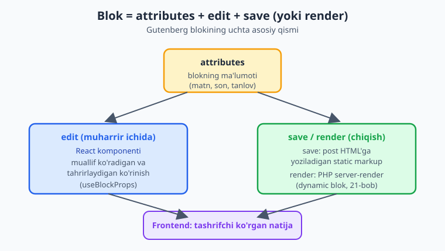
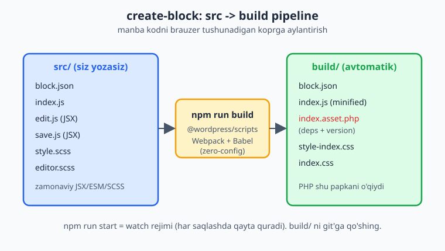
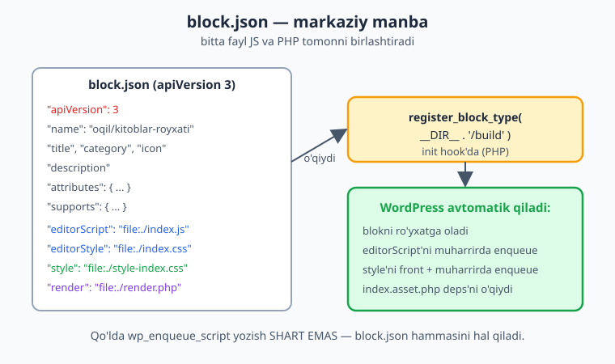

# 19 — Blok muharririga kirish va create-block

[⬅️ Oldingi: 18 — Email, HTTP API va keshlash](./18-email-http-cache.md) · [🏠 README](./README.md) · [Keyingi: 20 — Static blok: edit, save, attributes ➡️](./20-static-blok.md)

> **Bu bobda:** WordPress'ning blok muharriri (Gutenberg) qanday ishlashini — kontent bloklardan tashkil topishini va har blok `attributes` + `edit` + (`save` yoki dynamic `render`) dan iboratligini tushunamiz; nega shortcode va meta box o'rniga zamonaviy blok yozish kerakligini ko'ramiz; `@wordpress/create-block` bilan to'liq blok plugin'ini scaffold qilamiz; `block.json` (apiVersion **3**) ning har maydonini o'rganamiz; `@wordpress/scripts` (`npm run build` / `npm run start`) zero-config qurish quvurini ishga tushiramiz; va PHP tomonda `register_block_type( __DIR__ . '/build' )` bilan blokni `init` hook'da ro'yxatga olib, asset'larni avtomatik enqueue qildiramiz — hammasi "Kitoblar katalogi" plugin'imiz uchun "kitoblar ro'yxati" blokining poydevorini quradi.

---

## Muammo: shortcode endi yetmaydi

13-bobda kitoblar ro'yxatini ko'rsatish uchun `[kitoblar]` shortcode'i yozgandik. U ishlaydi, lekin mijoz — yoki kontent muharriri — uchun u **ko'rinmas**. Tasavvur qiling:

- Muharrir sahifaga `[kitoblar janr="roman" soni="5"]` deb yozadi. Atribut nomlarini eslab qolishi, qo'lda terishi kerak. Bitta harf xato — shortcode buziladi yoki bo'sh chiqadi.
- Yozayotganda u **hech narsa ko'rmaydi** — faqat kvadrat qavs ichidagi matn. Natija qanday chiqishini bilish uchun sahifani saqlab, oldindan ko'rishni ochishi kerak.
- "Romanlar 5 ta" emas, "10 ta" qilmoqchi bo'lsa, yana qavslarni qidirib, sonni qo'lda almashtiradi.

Bu — 2010-yillarning usuli. Zamonaviy WordPress'da kontent **bloklardan** quriladi. Muharrir "Kitoblar ro'yxati" blokini qo'shadi, yon paneldan janrni ochiladigan ro'yxatdan tanlaydi, sonni slayder bilan o'zgartiradi va natijani **darhol, joyida ko'radi**. Bu — blok muharriri (Gutenberg).

📌 **Blok muharriri (Gutenberg) nima?** WordPress 5.0 dan beri standart kontent muharriri. Post yoki sahifa endi bitta katta HTML maydoni emas — u **bloklar** ketma-ketligi: paragraf bloki, sarlavha bloki, rasm bloki, ro'yxat bloki va h.k. Har blok — mustaqil, qayta ishlatiladigan, sozlanadigan birlik. "Gutenberg" — loyihaning kod nomi; rasmiy nom — **Block Editor**.

---

## Blok aslida nima? Uch qism

Texnik jihatdan, blok — bu uchta narsaning birlashmasi:



1. **`attributes`** — blokning **ma'lumoti**. Masalan, "Kitoblar ro'yxati" bloki uchun: qaysi janr tanlangan (`janr`), nechta kitob ko'rsatish (`soni`). Bu — blokning holati, post ichida saqlanadi.
2. **`edit`** — blok **muharrir ichida** qanday ko'rinishi. Bu React komponenti: muallif ko'radigan va o'zaro ishlaydigan ko'rinish (ochiladigan ro'yxat, slayder, jonli oldindan ko'rish).
3. **`save`** yoki **`render`** — blok **chiqishi**:
   - **Static blok** (`save`): muharrirda yaratilgan natija HTML ko'rinishida bevosita post kontentiga yoziladi. Frontend uni shundayligicha ko'rsatadi. (20-bob.)
   - **Dynamic blok** (`render`): post'ga faqat "bu yerda shu blok bor" belgisi saqlanadi; frontend yuklanganda PHP `render.php` har safar yangi HTML generatsiya qiladi. Ma'lumot o'zgarib turadigan bloklar (masalan, eng so'nggi kitoblar) uchun. (21-bob.)

💡 **O'xshatish:** blokni LEGO bo'lagiga o'xshating. `attributes` — bo'lakning rangi va o'lchami (xususiyatlari). `edit` — uni qutida, yig'ish paytida qanday ushlab, aylantirib ko'rishingiz. `save`/`render` — tayyor konstruksiyada u qanday turishi.

### Nega blok? (shortcode/meta box o'rniga)

| Jihat | Shortcode / meta box | Blok |
|---|---|---|
| Muharrir ko'rinishi | Ko'rinmas matn / alohida quti | Vizual, jonli oldindan ko'rish |
| Sozlash | Qo'lda atribut terish | Tugma, slayder, ochiladigan ro'yxat |
| Qayta ishlatish | Nusxa-joylash | Blok namunalari (patterns), variations |
| Ma'lumot tuzilishi | Matn ichida | Tartibli JSON (`attributes`) |
| Kelajak | Eski (lekin ishlaydi) | WordPress'ning asosiy yo'nalishi |

📌 Shortcode va meta box **o'lmagan** — ular hali ham haqiqiy. Lekin yangi, foydalanuvchiga yo'naltirilgan funksiya uchun blok — zamonaviy, tavsiya etilgan yo'l. Bizning "Kitoblar katalogi" plugin'imiz uchun "kitoblar ro'yxati"ni endi blok sifatida quramiz.

> ℹ️ **Tayanch.** Bloklar React (JSX) bilan yoziladi. Agar JavaScript va JSX sizga notanish bo'lsa, [JavaScript kitobi](../js/README.md) ga qarab oling. Yaxshi yangilik: bu bobda blokni **scaffold** qilib, asosan PHP tomonni — ro'yxatga olishni — qilamiz. JSX'ga chuqur kirishni 20-bobdan boshlaymiz.

---

## `@wordpress/create-block` — blokning rasmiy scaffolderi

Blok yozish uchun JS qurish quvuri (Webpack, Babel, JSX kompilyatori) kerak. Buni qo'lda sozlash mashaqqatli. Yaxshiyamki WordPress jamoasi rasmiy scaffolder beradi: **`@wordpress/create-block`**. Bitta buyruq to'liq, ishlaydigan blok plugin'ini yaratadi.

```bash
npx @wordpress/create-block@latest kitoblar-royxati --namespace oqil
```

Bu nima qiladi:

- `npx` — paketni global o'rnatmasdan, vaqtincha yuklab ishga tushiradi (Node 18+ kerak; biz Node 24 ishlatamiz).
- `kitoblar-royxati` — blok (va plugin) slug'i.
- `--namespace oqil` — blok nomi prefiksi. Natijada blok to'liq nomi `oqil/kitoblar-royxati` bo'ladi.

Buyruq sizdan bir nechta savol so'rashi yoki standart qiymatlar bilan davom etishi mumkin. Yakunda u to'liq plugin papkasini yaratadi va `npm install` ni o'zi bajaradi.

💡 **Mavjud plugin ichiga blok qo'shish.** Bizda allaqachon "Kitoblar katalogi" plugin'i bor. Yangi plugin emas, faqat blok kerak bo'lsa, plugin papkangizda `--no-plugin` bilan ishlating:

```bash
# kitoblar-katalogi plugin papkasi ichida:
npx @wordpress/create-block@latest kitoblar-royxati --namespace oqil --no-plugin
```

Bu faqat `src/` papkasi va blokni quradi, alohida plugin header yaratmaydi — blokni o'z plugin'ingizga qo'shasiz.

### Loyiha tuzilishi

Scaffold qilingan plugin shunday ko'rinadi:

```text
kitoblar-royxati/
├── kitoblar-royxati.php      ← plugin header + register_block_type
├── package.json              ← npm bog'liqliklar va skriptlar
├── readme.txt                ← WordPress.org uchun
├── src/                      ← SIZ TAHRIRLAYDIGAN manba kod
│   ├── block.json            ← blok metadatasi (markaziy fayl)
│   ├── index.js              ← blokni JS'da ro'yxatga oladi
│   ├── edit.js               ← muharrirdagi ko'rinish (JSX)
│   ├── save.js               ← saqlanadigan markup (JSX)
│   ├── style.scss            ← front + muharrir stillari
│   ├── editor.scss           ← faqat muharrir stillari
│   └── view.js               ← (ixtiyoriy) frontend skripti
└── build/                    ← npm run build NATIJASI (tahrirlam!)
```

📌 **Eng muhim qoida:** siz faqat `src/` ni tahrirlaysiz. `build/` — kompilyatsiya natijasi, uni qo'lda o'zgartirmaysiz (keyingi `build` uni qayta yozadi). PHP esa `build/` ni o'qiydi.



---

## `block.json` — blokning yuragi

`src/block.json` — blokning markaziy, deklarativ ta'rifi. U JS va PHP tomonni birlashtiradi: ikkala tomon ham shu bitta fayldan blok haqidagi ma'lumotni oladi. Scaffold qilingan fayl taxminan shunday:

```json
{
	"$schema": "https://schemas.wp.org/trunk/block.json",
	"apiVersion": 3,
	"name": "oqil/kitoblar-royxati",
	"version": "0.1.0",
	"title": "Kitoblar ro'yxati",
	"category": "widgets",
	"icon": "book",
	"description": "Katalogdagi kitoblarni ro'yxat ko'rinishida chiqaradi.",
	"example": {},
	"supports": {
		"html": false
	},
	"textdomain": "kitoblar-royxati",
	"editorScript": "file:./index.js",
	"editorStyle": "file:./index.css",
	"style": "file:./style-index.css",
	"viewScript": "file:./view.js"
}
```

⚠️ **`apiVersion` ALBATTA `3` bo'lsin.** Bu — blok API'sining versiyasi (WordPress 6.3 dan beri eng so'nggi). Eski apiVersion 1/2 bloklari muharrir ichida `iframe` muhitiga to'g'ri joylashmaydi va zamonaviy imkoniyatlardan mahrum. Yangi blok har doim apiVersion 3.

### Maydonlar, bittalab

Har bir maydon rasmiy [Block Metadata (block.json)](https://developer.wordpress.org/block-editor/reference-guides/block-api/block-metadata/) hujjati bilan tasdiqlangan:

| Maydon | Nima qiladi |
|---|---|
| `apiVersion` | Blok API versiyasi. Har doim `3`. |
| `name` | Blokning yagona identifikatori: `namespace/blok` (`oqil/kitoblar-royxati`). Kichik harf, raqam, `-`. |
| `title` | Muharrirning blok qo'shish panelida ko'rinadigan nom. |
| `category` | Blok qaysi guruhda: `text`, `media`, `design`, `widgets`, `theme`, `embed`. |
| `icon` | Dashicons nomi (`book`) yoki SVG. Blok inserterida ko'rinadi. |
| `description` | Blok haqida qisqa izoh (insert panelida va sozlamalarda). |
| `attributes` | Blok ma'lumotining tuzilishi (keyingi bobda chuqur). |
| `supports` | Blok qaysi umumiy imkoniyatlarni qo'llab-quvvatlaydi (rang, hoshiya, `html` tahriri). |
| `textdomain` | i18n uchun matn domeni (24-bob). |
| `editorScript` | **Faqat muharrirda** yuklanadigan JS — blokni ro'yxatga oluvchi kod. `file:./index.js`. |
| `editorStyle` | Faqat muharrirdagi stillar. |
| `style` | Front **va** muharrirda yuklanadigan stillar. |
| `viewScript` | **Faqat frontendda** yuklanadigan JS (interaktivlik uchun). |
| `render` | Dynamic blok uchun server-render PHP fayli (`file:./render.php`) — 21-bob. |

📌 **`file:` prefiksi.** Asset maydonlari (`editorScript`, `style`, `render` ...) `file:./...` bilan **nisbiy** fayl yo'lini ko'rsatadi. WordPress bu yo'lni o'qib, asset'ni avtomatik registratsiya va enqueue qiladi — sizga `wp_enqueue_script` yozish shart emas.

💡 `block.json` — shunchaki JSON. Uni JSON validatori bilan tekshiring (`python -m json.tool` yoki muharriringizning JSON tekshiruvi). Bitta vergul xatosi blokni butunlay ishlamas qiladi.



---

## `@wordpress/scripts` — qurish quvuri

`src/` dagi JSX va SCSS'ni brauzer tushunadigan koodga aylantirish kerak. Buni **`@wordpress/scripts`** paketi qiladi — Webpack va Babel'ni **zero-config** (sozlashsiz) o'rab beradi. Scaffold qilingan `package.json` da ikkita asosiy skript bor:

```json
{
	"scripts": {
		"build": "wp-scripts build",
		"start": "wp-scripts start"
	}
}
```

- **`npm run build`** — production qurilish. `src/` ni o'qiydi, minifikatsiya qilingan natijani `build/` ga yozadi. Plugin'ni tarqatishdan oldin **albatta** ishga tushiriladi.
- **`npm run start`** — watch (kuzatuv) rejimi. Fayllarni kuzatadi, har saqlashda `build/` ni **avtomatik** qayta quradi. Rivojlanish paytida shuni ishlatasiz.

```bash
# bir martalik production qurilish:
npm run build

# rivojlanish (kuzatuv) rejimi:
npm run start
```

### `index.asset.php` — avtomatik bog'liqliklar

`npm run build` `build/` ichiga `index.asset.php` faylini ham chiqaradi. U shunday ko'rinadi:

```php
<?php return array('dependencies' => array('react-jsx-runtime', 'wp-block-editor', 'wp-blocks', 'wp-i18n'), 'version' => 'a1b2c3...');
```

📌 **Bu fayl nima uchun muhim?** U blokingiz qaysi WordPress JS paketlariga (`wp-blocks`, `wp-block-editor`, `wp-i18n` ...) bog'liqligini va kontent versiyasini (kesh buzish uchun) **avtomatik** sanab beradi. `register_block_type` shu ro'yxatni o'qib, kerakli WordPress skriptlarini to'g'ri tartibda yuklaydi. Demak siz bog'liqliklarni qo'lda boshqarmaysiz — bu eski usulning eng zerikarli qismi edi.

⚠️ **React global emas.** Blok JS'ida `import React from 'react'` yozmaysiz. Buning o'rniga WordPress paketlaridan import qilasiz: `@wordpress/element` (React o'rami), `@wordpress/blocks`, `@wordpress/block-editor`, `@wordpress/components`. `wp-scripts` bu importlarni `index.asset.php` dagi bog'liqliklarga avtomatik bog'laydi.

### 2026 yangiligi: `--blocks-manifest`

Bitta plugin ko'p blokli bo'lsa, har birini alohida `register_block_type` qilish o'rniga **manifest** ishlatish mumkin. `wp-scripts build --blocks-manifest` `blocks-manifest.php` faylini chiqaradi, so'ng PHP'da bitta chaqiruv barcha bloklarni ro'yxatga oladi:

```bash
wp-scripts build --blocks-manifest
```

```php
// WordPress 6.8+ : bitta papkadagi barcha bloklarni manifest bilan ro'yxatga olish.
wp_register_block_types_from_metadata_collection(
    __DIR__ . '/build',
    __DIR__ . '/build/blocks-manifest.php'
);
```

> ℹ️ Bizning plugin'da bitta blok bor, shuning uchun oddiy `register_block_type` yetadi. Ko'p blokli katta plugin'larda (masalan, 30-bob kapston) manifest tezroq va tartibliroq. `wp_register_block_types_from_metadata_collection()` WordPress 6.8 da kiritilgan.

---

## PHP tomon: blokni ro'yxatga olish

Endi eng muhim qism — PHP. Scaffold qilingan plugin faylida (`kitoblar-royxati.php`) blok shunday ro'yxatga olinadi:

```php
<?php
/**
 * Plugin Name:       Kitoblar ro'yxati
 * Description:        Katalogdagi kitoblarni ro'yxat blokida chiqaradi.
 * Version:           0.1.0
 * Requires at least: 7.0
 * Requires PHP:      8.3
 * Text Domain:       kitoblar-royxati
 *
 * @package Oqil\KitobKatalog
 */

declare( strict_types = 1 );

// To'g'ridan-to'g'ri kirishni bloklash.
if ( ! defined( 'ABSPATH' ) ) {
    exit;
}

/**
 * "kitoblar-royxati" blokini build/ papkasidagi block.json'dan ro'yxatga oladi.
 */
function oqil_kk_register_blok(): void {
    register_block_type( __DIR__ . '/build' );
}
add_action( 'init', 'oqil_kk_register_blok' );
```

Diqqat qiling — bu juda kam kod, lekin u juda ko'p ish qiladi:

📌 **`register_block_type( __DIR__ . '/build' )`** ga papka yo'lini berasiz, blok nomini emas. WordPress shu papkadagi `block.json` ni topib o'qiydi, undagi barcha maydonlarni (`name`, `attributes`, `supports`, asset yo'llari) oladi va:

- blokni `oqil/kitoblar-royxati` nomi bilan ro'yxatga oladi;
- `editorScript` (index.js) ni muharrirda enqueue qiladi;
- `style` ni front + muharrirda enqueue qiladi;
- `index.asset.php` dagi bog'liqliklarni hisobga oladi.

Bularning hammasi — bitta qatordan. Bu zamonaviy blok API'sining kuchi.

⚠️ **`init` hook'da, build/ yo'li bilan.** Ikki tez-tez uchraydigan xato:
- Blokni `init` dan oldin ro'yxatga olish — WordPress hali tayyor emas. Har doim `add_action( 'init', ... )`.
- `src/` yo'lini berish (`__DIR__ . '/src'`). Yo'q! `src/` da kompilyatsiyalanmagan JSX bor — brauzer uni tushunmaydi. Har doim `build/` ni ko'rsating va avval `npm run build` qiling.

📌 `register_block_type()` ning birinchi argumenti — blok nomi (`oqil/kitoblar-royxati`), `block.json` fayl yo'li **yoki** `block.json` joylashgan **papka** yo'li bo'lishi mumkin. Funksiya muvaffaqiyatda `WP_Block_Type` obyektini, xatoda `false` qaytaradi. (Rasmiy [Code Reference](https://developer.wordpress.org/reference/functions/register_block_type/).)

> ℹ️ **Jonli sinov (o'z saytingizda).** Plugin'ni `npm run build` bilan qurib, `wp-admin → Plugin'lar` da faollashtiring. So'ng yangi post oching, "+" tugmasini bosib "Kitoblar ro'yxati" blokini qidiring va qo'shing. Hozircha u faqat "Salom Dunyo" matnini ko'rsatadi (scaffold standarti) — keyingi bobda uni haqiqiy kitoblar ro'yxatiga aylantiramiz. Bu natijalar ishlab turgan WordPress'ni talab qiladi; `php -l` faqat sintaksisni, `npm run build` esa JS qurilishini tekshiradi.

---

## Birinchi blokingiz — to'liq oqim

Boshidan oxirigacha:

```bash
# 1) Blok plugin'ini scaffold qiling
npx @wordpress/create-block@latest kitoblar-royxati --namespace oqil

# 2) Papkaga kiring
cd kitoblar-royxati

# 3) Production qurilish (build/ ni hosil qiladi)
npm run build

# 4) (rivojlanish uchun) kuzatuv rejimi
npm run start
```

Keyin plugin'ni WordPress'ga ko'chirib (yoki `wp-content/plugins/` da yaratib), faollashtiring. Blok muharririda blokingiz tayyor.

💡 **`build/` ni git'ga qo'shasizmi?** WordPress.org plugin katalogiga yuklash uchun `build/` **kerak** (foydalanuvchida `npm` yo'q). Shuning uchun `build/` ni odatda repozitoriyga qo'shadilar (yoki CI'da quradilar). `node_modules/` esa hech qachon git'ga kirmaydi — uni `.gitignore` ga qo'shing (scaffold buni avtomatik qiladi).

---

## Tez-tez uchraydigan xatolar

⚠️ **Blok inserterda ko'rinmaydi.** Sabablar: (1) `npm run build` qilinmagan — `build/` bo'sh yoki eski; (2) `register_block_type` `init` da emas; (3) plugin faollashtirilmagan; (4) `block.json` da JSON sintaksis xatosi.

⚠️ **"Bu blokda kutilmagan xato" (muharrirda).** Odatda `save` chiqishi saqlangan markup bilan mos kelmaydi ("block validation") — buni 20-bobda ko'ramiz. Yoki `npm run build` eski: yangilab qayta quring.

⚠️ **Stillar qo'llanmaydi.** `block.json` da `style`/`editorStyle` yo'llari noto'g'ri yoki `.scss` qurilmagan. `npm run build` ishlatib, `build/` da `.css` borligini tekshiring.

⚠️ **`src/` yo'lini ro'yxatga olganman.** `register_block_type( __DIR__ . '/src' )` ishlamaydi — kompilyatsiyalanmagan JSX. Har doim `/build`.

📌 **Tayanch bilim.** Bu bob JSX va React'ga tegib o'tdi. Agar bu sizga notanish bo'lsa, [JavaScript kitobi](../js/README.md) yordam beradi. PHP tomoni esa oddiy: `register_block_type` chaqiruvi va `init` hook (04-bob).

---

## Xulosa

- Blok muharriri (Gutenberg) kontentni **bloklardan** quradi; har blok = `attributes` (ma'lumot) + `edit` (muharrir UI) + `save`/`render` (chiqish).
- Blok — shortcode/meta box o'rniga zamonaviy, vizual, qayta ishlatiladigan yo'l.
- **`@wordpress/create-block`** to'liq blok plugin'ini scaffold qiladi: `src/` (block.json, index.js, edit.js, save.js, scss) va `build/`.
- **`block.json`** (apiVersion **3**) — markaziy fayl: `name`, `title`, `category`, `icon`, `attributes`, `supports`, asset yo'llari (`file:./...`), `render`. JS va PHP tomonni birlashtiradi.
- **`@wordpress/scripts`** — zero-config Webpack/Babel: `npm run build` (production), `npm run start` (watch). `build/index.asset.php` bog'liqliklarni avtomatik beradi.
- PHP'da **`register_block_type( __DIR__ . '/build' )`** ni **`init`** hook'da chaqirasiz — block.json o'qilib, asset'lar avtomatik enqueue bo'ladi.
- React global emas: `@wordpress/element`/`@wordpress/blocks`/`@wordpress/block-editor` dan import qilasiz.

Keyingi bobda shu blokni **haqiqiy** static blokga aylantiramiz: `attributes` ta'riflaymiz, `edit.js` da `useBlockProps` va yon panel sozlamalarini quramiz, `save.js` da markupni saqlaymiz.

---

## 19-bob mashqlari

> Mashqlarni o'z lokal WordPress saytingizda (02-bob: `wp-env`/Docker) va Node 18+ muhitida bajaring. Har blokni scaffold qiling, `npm run build` qiling va muharrirda ko'ring.

**1 (Oson).** Blokning uchta asosiy qismini nomlang va har biri nima uchun ekanini bir jumlada ayting.

**2 (Oson).** Static blok (`save`) va dynamic blok (`render`) orasidagi farq nima? Qaysi biri har so'rovda PHP'da qayta generatsiya qilinadi?

**3 (Oson).** `block.json` da `apiVersion` nechchi bo'lishi kerak va nega eski versiyalar tavsiya etilmaydi?

**4 (Oson).** `@wordpress/create-block` ni `--no-plugin` bayrog'i bilan ishga tushirsangiz nima farq qiladi? Qachon foydali?

**5 (O'rta).** `npm run build` va `npm run start` orasidagi farqni tushuntiring. Qaysi birini rivojlanishda, qaysi birini tarqatishdan oldin ishlatasiz?

**6 (O'rta).** `register_block_type()` ga `src/` papkasini bersangiz nima bo'ladi va nega? To'g'ri yo'l qaysi?

<details markdown="1">
<summary>Yechim</summary>

`register_block_type( __DIR__ . '/src' )` ishlamaydi (yoki blok buzilib ishlaydi), chunki `src/` da kompilyatsiyalanmagan **JSX** bor — brauzer JSX'ni tushunmaydi, uni Babel oddiy JS'ga aylantirishi kerak. `@wordpress/scripts` (`npm run build`) aynan shuni qiladi va natijani `build/` ga yozadi. Shuning uchun PHP har doim `build/` ni ko'rsatishi kerak:

```php
function oqil_kk_register_blok(): void {
    register_block_type( __DIR__ . '/build' );
}
add_action( 'init', 'oqil_kk_register_blok' );
```

Va eslang: `register_block_type` ni `init` dan oldin chaqirmang.
</details>

**7 (O'rta).** `build/index.asset.php` fayli nima uchun kerak? Uni qo'lda yozish o'rniga nima generatsiya qiladi va u qanday ma'lumotni o'z ichiga oladi?

**8 (O'rta).** Blok JS'ida `import React from 'react'` yozish kerakmi? Yo'q bo'lsa, React komponentlarini qaerdan import qilasiz?

<details markdown="1">
<summary>Yechim</summary>

Yo'q. WordPress blok muharririda React **global emas** va to'g'ridan-to'g'ri `'react'` paketidan import qilinmaydi. Buning o'rniga WordPress o'z paketlaridan import qilasiz:

```js
import { registerBlockType } from '@wordpress/blocks';
import { useBlockProps } from '@wordpress/block-editor';
import { __ } from '@wordpress/i18n';
```

`@wordpress/scripts` bu importlarni `index.asset.php` ichidagi bog'liqliklarga (`wp-blocks`, `wp-block-editor`, `wp-i18n`) avtomatik bog'laydi, shuning uchun WordPress kerakli skriptlarni to'g'ri yuklaydi. JSX'ning React'i esa `react-jsx-runtime` orqali avtomatik ulanadi (apiVersion 3 da `@wordpress/element` ham hali ishlaydi).
</details>

**9 (O'rta).** `block.json` dagi `editorScript`, `style` va `viewScript` maydonlari orasidagi farqni ayting: har biri qayerda (muharrir/front) yuklanadi?

**10 (Qiyin).** `@wordpress/create-block` bilan `mening-blogim` namespace'i va `eng-songgi-postlar` slug'i bilan yangi blok plugin'ini scaffold qiling. So'ng `npm run build` ni ishga tushiring va `build/` ichida qaysi fayllar hosil bo'lganini sanang. Blokning to'liq nomi qanday bo'ladi?

<details markdown="1">
<summary>Yechim</summary>

```bash
npx @wordpress/create-block@latest eng-songgi-postlar --namespace mening-blogim
cd eng-songgi-postlar
npm run build
```

Blokning to'liq nomi: **`mening-blogim/eng-songgi-postlar`** (`block.json` dagi `name`).

`npm run build` dan keyin `build/` ichida odatda quyidagilar bo'ladi:

```text
build/
├── block.json          (src dan nusxalangan)
├── index.js            (edit/save kompilyatsiyasi, minified)
├── index.asset.php     (bog'liqliklar + version)
├── index.css           (editorStyle, editor.scss dan)
├── style-index.css     (style, style.scss dan)
└── view.js + view.asset.php  (viewScript bo'lsa)
```

`index.asset.php` blok qaysi WordPress paketlariga bog'liqligini avtomatik beradi.
</details>

**11 (Qiyin).** "Kitoblar katalogi" plugin'imizga blok qo'shing. To'liq plugin faylini yozing: header (Plugin Name, Requires at least 7.0, Requires PHP 8.3, Text Domain), `ABSPATH` himoyasi, `declare(strict_types=1)`, va `register_block_type( __DIR__ . '/build' )` ni `init` hook'da. Blok namespace `oqil`, slug `kitoblar-royxati`.

<details markdown="1">
<summary>Yechim</summary>

```php
<?php
/**
 * Plugin Name:       Kitoblar katalogi
 * Plugin URI:        https://ioqil.uz/kitoblar-katalogi
 * Description:        Kitoblar katalogi: CPT, taksonomiya va bloklar.
 * Version:           1.0.0
 * Requires at least: 7.0
 * Requires PHP:      8.3
 * Author:            Oqil Imomnazarov
 * Text Domain:       kitoblar-katalogi
 *
 * @package Oqil\KitobKatalog
 */

declare( strict_types = 1 );

// To'g'ridan-to'g'ri kirishni bloklash.
if ( ! defined( 'ABSPATH' ) ) {
    exit;
}

/**
 * "oqil/kitoblar-royxati" blokini build/ papkasidagi block.json'dan ro'yxatga oladi.
 *
 * register_block_type build/block.json ni o'qib, editorScript va style
 * asset'larini avtomatik enqueue qiladi.
 */
function oqil_kk_register_blocks(): void {
    register_block_type( __DIR__ . '/build' );
}
add_action( 'init', 'oqil_kk_register_blocks' );
```

Diqqat: `register_block_type` `init` hook'da, `build/` papkasiga ishora qiladi. `block.json` dagi `name` (`oqil/kitoblar-royxati`) va `editorScript`/`style` yo'llari hammasini hal qiladi — qo'lda `wp_enqueue_script` yozish shart emas. `php -l` bu kodning sintaksisini tasdiqlaydi.
</details>

**12 (Qiyin).** Ko'p blokli plugin uchun `--blocks-manifest` yondashuvini tushuntiring: qaysi build buyrug'i va qaysi PHP funksiyasi ishlatiladi, va u oddiy `register_block_type` dan nimasi bilan farq qiladi?

<details markdown="1">
<summary>Yechim</summary>

Bitta plugin ichida ko'p blok bo'lsa, har birini alohida `register_block_type` qilish o'rniga **manifest** dan foydalanish samaraliroq.

Build buyrug'i `blocks-manifest.php` faylini generatsiya qiladi (barcha bloklarning metadatasini bitta PHP massiviga jamlaydi):

```bash
wp-scripts build --blocks-manifest
```

So'ng PHP'da bitta chaqiruv barcha bloklarni ro'yxatga oladi (WordPress 6.8+):

```php
function oqil_kk_register_all_blocks(): void {
    // build/ ostidagi har bir blokni manifest orqali ro'yxatga oladi.
    wp_register_block_types_from_metadata_collection(
        __DIR__ . '/build',
        __DIR__ . '/build/blocks-manifest.php'
    );
}
add_action( 'init', 'oqil_kk_register_all_blocks' );
```

Farqi: oddiy `register_block_type( $path )` har blok uchun fayl tizimidan `block.json` ni alohida o'qiydi. `wp_register_block_types_from_metadata_collection()` esa metadatani **bitta** manifest fayldan oladi — bu ko'p blokli plugin'da fayl tizimiga murojaatlarni kamaytirib, ro'yxatga olishni tezlashtiradi. Bitta blokli plugin'da farq sezilmaydi, shuning uchun oddiy `register_block_type` yetadi.
</details>

---

[⬅️ Oldingi: 18 — Email, HTTP API va keshlash](./18-email-http-cache.md) · [🏠 README](./README.md) · [Keyingi: 20 — Static blok: edit, save, attributes ➡️](./20-static-blok.md)
