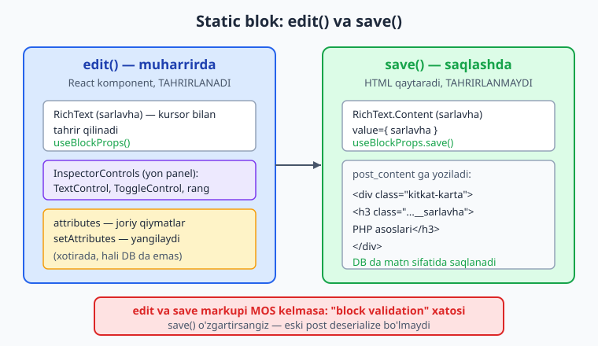
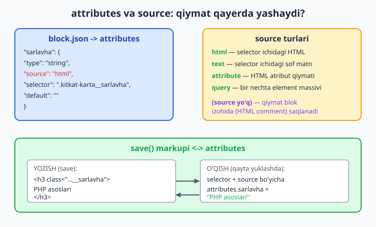
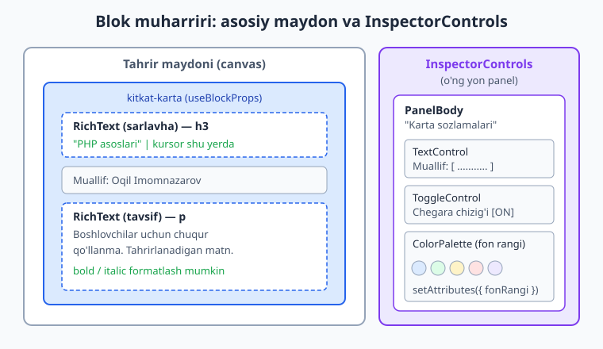

# 20 — Static blok: edit, save, attributes

[⬅️ Oldingi: 19 — Blok muharririga kirish va create-block](./19-blok-kirish-create-block.md) · [🏠 README](./README.md) · [Keyingi: 21 — Dynamic blok va PHP-only registratsiya ➡️](./21-dynamic-blok.md)

> **Bu bobda:** static (statik) blokni 0 dan to'liq quramiz — `edit()` funksiyasi muharrirdagi tahrirlanadigan ko'rinishni JSX bilan chizadi, `save()` esa `post_content` ga yoziladigan HTML markupini qaytaradi (DB da matn sifatida saqlanadi, dynamic blokdan farqi shu); `useBlockProps()` va `useBlockProps.save()` majburiy wrapper props'ini, `@wordpress/element`/`@wordpress/components`/`@wordpress/block-editor` paketlarini, `block.json` dagi `attributes` (`type`, `source` `html`/`text`/`attribute`/`query`, `selector`, `default`) va `attributes`/`setAttributes` mexanikasini, `RichText` (muharrirda) va `RichText.Content` (save'da) ni, `InspectorControls` + `PanelBody` + `TextControl`/`ToggleControl`/`ColorPalette` yon panelini, hamda `supports` (color/spacing/typography/align) orqali yadro UI'ni avtomatik olishni o'rganamiz — natijada izchil namuna plugin'imizga "Kitob kartasi" static blokini qo'shamiz.

---

## Muammo: kontentga "tayyor qadoq" kerak

19-bobda blok muharriri arxitekturasini ko'rdik, `@wordpress/create-block` bilan blok scaffold qildik va uni `register_block_type` bilan ro'yxatdan o'tkazdik. Lekin o'sha blok faqat "salom dunyo" matnini ko'rsatardi. Endi haqiqiy ish: foydalanuvchi **o'zi to'ldiradigan** blok kerak.

Tasavvur qiling — bloggerimiz har postda kitob tavsiya qiladi: sarlavha, muallif, qisqa tavsif, rangli karta. Buni har safar HTML bilan qo'lda yozish — azob. Buning o'rniga **"Kitob kartasi"** blokini beramiz: foydalanuvchi blokni qo'shadi, maydonlarni to'ldiradi, rangni tanlaydi — tayyor.

Eng muhim qaror: bu **static** blok bo'ladimi yoki **dynamic**? Farqi — ma'lumot **qayerda** yashashida:

- **Static blok** (bu bob): `save()` funksiyasi tayyor HTML ni qaytaradi, WordPress uni `post_content` ga **matn sifatida** yozadi. Sahifa ko'rsatilganda PHP hech narsa hisoblamaydi — HTML allaqachon DB da. Tez, sodda, mustaqil.
- **Dynamic blok** (21-bob): `save()` `null` qaytaradi (yoki minimal), HTML har so'rovda PHP (`render.php`) tomonidan **qayta hisoblanadi**. "Eng so'nggi 5 ta kitob" kabi o'zgaruvchan ma'lumot uchun.

📌 **Qachon static?** Ma'lumot bir marta kiritiladi va o'zgarmaydi (kitob kartasi, ogohlantirish qutisi, iqtibos). Ma'lumot vaqt o'tishi bilan yoki boshqa joydan o'zgarsa — dynamic. Kitob kartamiz static: bir marta to'ldirilgan kitob ma'lumoti o'zgarmaydi.



---

## `edit` va `save`: blokning ikki yuzi

Har bir blok `registerBlockType` ga ikkita funksiya beradi (19-bobdan `index.js` ni eslang):

```js
registerBlockType( metadata.name, {
	edit: Edit,  // muharrirda nima ko'rinadi (tahrirlanadi)
	save,        // post_content ga nima yoziladi (HTML)
} );
```

- **`edit`** — React komponent. Muharrirda blok tanlanganda WordPress shuni render qiladi. Foydalanuvchi shu yerda **tahrir** qiladi.
- **`save`** — sof funksiya. Foydalanuvchi postni saqlaganda WordPress `save()` ni chaqirib, qaytgan JSX ni **HTML stringga** aylantiradi va `post_content` ga yozadi.

⚠️ **`save` "jonli" emas.** `save()` muharrirda yoki frontendda *ishlamaydi* — u faqat saqlash payti markupni **bir marta** ishlab chiqaradi. Shuning uchun `save()` ichida hodisa (`onClick`), holat (`useState`) yoki effekt bo'lmaydi: u faqat statik HTML qaytaradi. Interaktivlik kerak bo'lsa — frontend uchun alohida `viewScript` (`view.js`) yoki dynamic blok.

### React global emas — import qiling

⚠️ Blok muharririda `React` global o'zgaruvchi sifatida **mavjud emas**. Hamma narsa `@wordpress/*` paketlaridan import qilinadi va `@wordpress/scripts` (webpack) ularni `wp.element`, `wp.blockEditor` kabi global'larga ulaydi. JSX'ni React o'rniga `@wordpress/element` quvvatlaydi (u React'ning yupqa o'ramasi). Asosiy paketlar:

| Paket | Nima beradi |
|---|---|
| `@wordpress/element` | React abstraktsiyasi (`useState`, `Fragment`, JSX runtime) |
| `@wordpress/block-editor` | `useBlockProps`, `RichText`, `InspectorControls`, `BlockControls` |
| `@wordpress/components` | UI: `PanelBody`, `TextControl`, `ToggleControl`, `ColorPalette` |
| `@wordpress/i18n` | `__()` — JS tarjimasi |
| `@wordpress/blocks` | `registerBlockType` |

ℹ️ `@wordpress/scripts` import qilingan har bir `@wordpress/*` paketni avtomatik aniqlaydi va `build/<blok>/index.asset.php` fayliga **bog'liqliklarni** yozadi (masalan `wp-block-editor`, `wp-components`, `wp-i18n`). WordPress shu fayl asosida kerakli skriptlarni yuklaydi — siz qo'lda enqueue qilmaysiz.

---

## `useBlockProps`: majburiy wrapper

Blokning eng tashqi elementiga **`useBlockProps()`** dan kelgan props'ni tarqatish **majburiy**. U WordPress kutadigan `class`, `id`, tekislash (align), rang, bo'shliq kabi atributlarni qo'shadi. Busiz blok tanlanmaydi, `supports` ishlamaydi va muharrir ogohlantirish beradi.

```jsx
import { useBlockProps } from '@wordpress/block-editor';

export default function Edit() {
	const blockProps = useBlockProps();      // muharrirda
	return <div { ...blockProps }>Salom</div>;
}
```

`save()` da esa **`useBlockProps.save()`** (statik variant — hook emas, lekin shu nom bilan):

```jsx
export default function save() {
	const blockProps = useBlockProps.save(); // saqlanadigan markupda
	return <div { ...blockProps }>Salom</div>;
}
```

📌 **`useBlockProps()` muharrirda, `useBlockProps.save()` save'da.** Ikkalasiga ham xohlasangiz qo'shimcha props berasiz: `useBlockProps( { className: 'kitkat-karta', style: {...} } )`. Bu sizning class'ingizni yadro class'lari bilan **birlashtiradi** (ustiga yozmaydi).

⚠️ `useBlockProps` ni faqat eng tashqi (root) elementga bering — ichki elementlarga emas. Har blokda **bitta** root element bo'ladi.

---

## Attributes: blok ma'lumotini saqlash

Blok foydalanuvchi kiritgan ma'lumotni qayerda saqlaydi? **`attributes`** da. `block.json` ning `attributes` bo'limi har bir maydonni e'lon qiladi: tipi, qiymat qayerdan o'qilishi va sukut (default) qiymati.

```json
"attributes": {
	"sarlavha": {
		"type": "string",
		"source": "html",
		"selector": ".kitkat-karta__sarlavha",
		"default": ""
	},
	"muallif": {
		"type": "string",
		"default": ""
	},
	"chegaraKorinsin": {
		"type": "boolean",
		"default": true
	},
	"fonRangi": {
		"type": "string",
		"default": "#dbeafe"
	}
}
```

Har bir attribute'ning kalitlari:

- **`type`** — `"string"`, `"number"`, `"integer"`, `"boolean"`, `"array"`, `"object"` (JSON Schema tiplari).
- **`source`** — qiymat **qayerdan o'qiladi** (sahifa qayta yuklanganda):
  - `"html"` — `selector` topgan element ichidagi **HTML** (formatlangan matn).
  - `"text"` — `selector` ichidagi **sof matn** (teglarsiz).
  - `"attribute"` — element atributining qiymati (`attribute: "href"`).
  - `"query"` — bir nechta elementdan **massiv** (masalan ro'yxat).
  - **`source` yo'q** (eng oddiy) — qiymat markup'dan **o'qilmaydi**; u blok izohida (HTML comment) JSON sifatida saqlanadi.
- **`selector`** — `source` bilan ishlatiladigan CSS selektor (qaysi elementdan o'qish).
- **`default`** — boshlang'ich qiymat.



### `source` bilan va `source`siz: ikki saqlash usuli

Bu — eng chalkash, lekin eng muhim tushuncha. Static blokda attribute qiymati **ikki joydan** birida yashashi mumkin:

1. **`source` bilan (markup ichida).** Qiymat `save()` chizgan HTML ichida yashaydi. Qayta yuklanganda WordPress `selector` + `source` bo'yicha uni markup'dan **qayta o'qiydi**. `RichText` bilan ishlatiladigan `sarlavha`/`tavsif` shunday.

2. **`source`siz (blok izohida).** Qiymat HTML'da ko'rinmaydi; u blok izohida JSON sifatida saqlanadi:
   ```html
   <!-- wp:oqil/kitob-kartasi {"muallif":"Oqil","fonRangi":"#dbeafe"} -->
   <div class="wp-block-oqil-kitob-kartasi kitkat-karta">...</div>
   <!-- /wp:oqil/kitob-kartasi -->
   ```
   `muallif`, `chegaraKorinsin`, `fonRangi` shunday — ular HTML'ga matn sifatida chiqmasligi mumkin, lekin blokda saqlanadi.

📌 **Qoida:** tahrirlanadigan **matn** (`RichText`) odatda `source: "html"` bilan markup'dan o'qiladi (toza, qidiriladi, boshqa muharrirlar ham ko'radi). Sozlama qiymatlari (rang, toggle, son) odatda `source`siz — blok izohida. Ikkalasi bitta blokda birga yashashi normal.

### `attributes` va `setAttributes` `edit` ichida

`edit` komponent ikkita prop oladi (boshqalari ham bor): `attributes` (joriy qiymatlar obyekti) va `setAttributes` (yangilash funksiyasi).

```jsx
export default function Edit( { attributes, setAttributes } ) {
	const { sarlavha, muallif } = attributes;

	return (
		<input
			value={ muallif }
			onChange={ ( e ) => setAttributes( { muallif: e.target.value } ) }
		/>
	);
}
```

⚠️ **`attributes` ni to'g'ridan-to'g'ri o'zgartirmang** (`attributes.muallif = '...'` — XATO). Faqat `setAttributes({ muallif: '...' })`. Bu React holat yangilash qoidasi: `setAttributes` faqat berilgan kalitlarni **birlashtiradi** (qolganini saqlaydi) va qayta render'ni triggerlaydi.

---

## `RichText`: tahrirlanadigan matn

Oddiy `<input>` faqat sof matn beradi. Lekin foydalanuvchi sarlavhada qalin (`bold`) yoki kursiv (`italic`) ishlatmoqchi bo'lsa-chi? Buning uchun **`RichText`** — WordPress'ning tahrirlanadigan, formatlanadigan matn komponenti.

```jsx
import { RichText } from '@wordpress/block-editor';

// edit() ichida:
<RichText
	tagName="h3"
	className="kitkat-karta__sarlavha"
	value={ sarlavha }
	onChange={ ( yangi ) => setAttributes( { sarlavha: yangi } ) }
	placeholder={ __( 'Kitob nomi…', 'kitoblar-katalogi' ) }
	allowedFormats={ [ 'core/bold', 'core/italic' ] }
/>
```

- `tagName` — qaysi HTML teg chiqishi (`h3`, `p`, `span`...).
- `value`/`onChange` — `attributes.sarlavha` bilan bog'lash.
- `placeholder` — bo'sh bo'lsa ko'rinadigan eslatma.
- `allowedFormats` — ruxsat berilgan formatlash (bo'sh massiv = formatlash yo'q).

`save()` da esa **`RichText.Content`** — formatlangan qiymatni HTML sifatida chiqaradi:

```jsx
import { RichText } from '@wordpress/block-editor';

// save() ichida:
<RichText.Content
	tagName="h3"
	className="kitkat-karta__sarlavha"
	value={ sarlavha }
/>
```

📌 **`RichText` edit'da, `RichText.Content` save'da.** `tagName` va `className` ikkalasida bir xil bo'lishi kerak — chunki `block.json` dagi `selector: ".kitkat-karta__sarlavha"` aynan shu class'dan qiymatni qayta o'qiydi. Mos kelmasa — qiymat yo'qoladi.

ℹ️ Bu importlar developer.wordpress.org Block Editor Handbook bilan tasdiqlangan: `import { useBlockProps, RichText } from '@wordpress/block-editor';` va save'da `<RichText.Content ... value={ attributes.content } />`.

---

## edit va save markup MOS kelishi: "block validation"

Bu — static blokdagi eng ko'p uchraydigan xato manbai, shuning uchun alohida ta'kidlaymiz.

Sahifa qayta yuklanganda WordPress `post_content` dagi saqlangan HTML'ni o'qiydi va **joriy `save()` funksiyasini qayta ishga tushirib**, ikkalasini taqqoslaydi. Agar ular **bir xil bo'lmasa** — "block validation" (blok tekshiruvi) xatosi: muharrir "This block contains unexpected or invalid content" deydi va blokni "qutqarish" yoki "tiklash" ni so'raydi.

⚠️ **Nega buziladi?** Siz `save()` markupini o'zgartirsangiz (class nomi, teg, tuzilish), eski postlardagi saqlangan HTML yangi `save()` chiqargani bilan mos kelmaydi. Shuning uchun:

- `save()` ni **o'ylab** yozing — keyin o'zgartirish eski kontentni buzadi.
- Agar `save()` ni o'zgartirishingiz **shart** bo'lsa, **deprecation** (eskirgan versiya) e'lon qilasiz: `block.json`/`registerBlockType` ga `deprecated` massivini berib, eski markupni ham tushunadigan migratsiya yozasiz. (Bu mavzu — ilg'or; hozircha bilingki, `save()` "muzlatilgan kontrakt".)

💡 **Maslahat.** `save()` ni iloji boricha sodda saqlang. Murakkab, tez-tez o'zgaradigan ko'rinish kerak bo'lsa — dynamic blok (`render.php`, 21-bob): u `save()` ni `null` qiladi, shuning uchun validation muammosi umuman bo'lmaydi.

---

## InspectorControls: yon panel sozlamalari

Matnni blokning o'zida tahrirlaymiz, lekin **sozlamalar** (rang, toggle, qo'shimcha matn) qayerda? Ularni blok ichiga tiqishtirish chiroyli emas. WordPress buning uchun **yon panel** (Settings sidebar) beradi — `InspectorControls`.

`InspectorControls` ichiga qo'ygan hamma narsa muharrirning o'ng tomonidagi sozlamalar panelida (blok tanlanganda) ko'rinadi:

```jsx
import { InspectorControls } from '@wordpress/block-editor';
import { PanelBody, TextControl, ToggleControl, ColorPalette } from '@wordpress/components';

<InspectorControls>
	<PanelBody title={ __( 'Karta sozlamalari', 'kitoblar-katalogi' ) }>
		<TextControl
			label={ __( 'Muallif', 'kitoblar-katalogi' ) }
			value={ muallif }
			onChange={ ( yangi ) => setAttributes( { muallif: yangi } ) }
		/>
		<ToggleControl
			label={ __( 'Chegara chizig\'i', 'kitoblar-katalogi' ) }
			checked={ chegaraKorinsin }
			onChange={ ( yoq ) => setAttributes( { chegaraKorinsin: yoq } ) }
		/>
		<ColorPalette
			value={ fonRangi }
			onChange={ ( rang ) => setAttributes( { fonRangi: rang } ) }
		/>
	</PanelBody>
</InspectorControls>
```

- **`PanelBody`** — yig'iladigan (collapsible) bo'lim, `title` bilan.
- **`TextControl`** — bitta qatorli matn maydoni.
- **`ToggleControl`** — yoq/o'chiq tugmasi (boolean).
- **`ColorPalette`** — rang tanlash (tema palitrasi + maxsus rang).



💡 **`BlockControls` — toolbar.** `InspectorControls` yon panel uchun bo'lsa, **`BlockControls`** blok ustidagi suzuvchi **toolbar** uchun (tekislash, formatlash tugmalari). Ikkalasi ham `@wordpress/block-editor` dan keladi. Toolbar — tez-tez ishlatiladigan amallar uchun; yon panel — kamroq ishlatiladigan sozlamalar uchun.

ℹ️ Bu komponentlar (`PanelBody`, `TextControl`, `ToggleControl`, `ColorPalette`) — `@wordpress/components` paketining standart eksportlari. Quyida butun blokni `npm run build` bilan **haqiqatan qurganimizda** webpack ularning hammasini muvaffaqiyatli hal qildi (`index.asset.php` da `wp-components` bog'liqligi paydo bo'ldi) — bu importlar to'g'riligining tasdig'i.

---

## `supports`: yadro UI'ni bepul olish

`block.json` ning **`supports`** bo'limi — sehrli qisqartma. Unda bir nechta xususiyatni `true` qilsangiz, WordPress avtomatik ravishda **yon panelga** mos sozlamalarni qo'shadi va `useBlockProps` ularni markupga ulaydi — siz hech qanday UI yozmaysiz.

```json
"supports": {
	"html": false,
	"align": [ "wide", "full" ],
	"color": {
		"text": true,
		"background": false
	},
	"spacing": {
		"padding": true,
		"margin": true
	},
	"typography": {
		"fontSize": true,
		"lineHeight": true
	}
}
```

- **`html": false`** — foydalanuvchi blokni "HTML sifatida tahrirlash" qila olmaydi (xavfsizroq, tavsiya etiladi).
- **`align`** — keng/to'liq tekislash tugmalari (toolbar'da).
- **`color`** — matn/fon rangi sozlamalari (biz `text: true` qildik, fonni o'z `ColorPalette` bilan boshqaramiz).
- **`spacing`** — padding/margin sozlamalari.
- **`typography`** — shrift o'lchami, qator balandligi.

📌 **`supports` — "bepul" funksiya.** Bir qator JSON yozib, yon panelga to'liq ishlaydigan rang/bo'shliq/shrift sozlamalarini qo'shasiz. O'z `attributes` va `setAttributes` yozish shart emas — WordPress hammasini o'zi boshqaradi va saqlaydi. Avval `supports` ni tekshiring; o'z sozlamangiz faqat `supports` qoplamaydigan narsa uchun.

---

## To'liq namuna: "Kitob kartasi" static bloki

Endi hammasini birlashtiramiz. Izchil namuna plugin'imiz `kitoblar-katalogi` ga static blok qo'shamiz: nom `oqil/kitob-kartasi`, sarlavha (RichText), muallif (TextControl), tavsif (RichText), chegara toggle va fon rangi. Bu — bobning yuragi.

### `block.json`

```json
{
	"$schema": "https://schemas.wp.org/trunk/block.json",
	"apiVersion": 3,
	"name": "oqil/kitob-kartasi",
	"version": "0.1.0",
	"title": "Kitob kartasi",
	"category": "widgets",
	"icon": "book",
	"description": "Kitob sarlavhasi, muallifi va tavsifini ko'rsatuvchi karta bloki.",
	"keywords": [ "kitob", "karta", "katalog" ],
	"textdomain": "kitoblar-katalogi",
	"attributes": {
		"sarlavha": {
			"type": "string",
			"source": "html",
			"selector": ".kitkat-karta__sarlavha",
			"default": ""
		},
		"muallif": { "type": "string", "default": "" },
		"tavsif": {
			"type": "string",
			"source": "html",
			"selector": ".kitkat-karta__tavsif",
			"default": ""
		},
		"chegaraKorinsin": { "type": "boolean", "default": true },
		"fonRangi": { "type": "string", "default": "#dbeafe" }
	},
	"supports": {
		"html": false,
		"align": [ "wide", "full" ],
		"color": { "text": true, "background": false },
		"spacing": { "padding": true, "margin": true },
		"typography": { "fontSize": true, "lineHeight": true }
	},
	"editorScript": "file:./index.js",
	"editorStyle": "file:./index.css",
	"style": "file:./style-index.css"
}
```

### `edit.js`

```jsx
import { __ } from '@wordpress/i18n';
import {
	useBlockProps,
	RichText,
	InspectorControls,
} from '@wordpress/block-editor';
import {
	PanelBody,
	TextControl,
	ToggleControl,
	ColorPalette,
} from '@wordpress/components';
import './editor.scss';

export default function Edit( { attributes, setAttributes } ) {
	const { sarlavha, muallif, tavsif, chegaraKorinsin, fonRangi } = attributes;

	const blockProps = useBlockProps( {
		className: chegaraKorinsin ? 'kitkat-karta has-chegara' : 'kitkat-karta',
		style: { backgroundColor: fonRangi },
	} );

	return (
		<>
			<InspectorControls>
				<PanelBody title={ __( 'Karta sozlamalari', 'kitoblar-katalogi' ) }>
					<TextControl
						label={ __( 'Muallif', 'kitoblar-katalogi' ) }
						value={ muallif }
						onChange={ ( yangi ) => setAttributes( { muallif: yangi } ) }
					/>
					<ToggleControl
						label={ __( 'Chegara chizig\'i', 'kitoblar-katalogi' ) }
						checked={ chegaraKorinsin }
						onChange={ ( yoq ) => setAttributes( { chegaraKorinsin: yoq } ) }
					/>
					<p>{ __( 'Fon rangi', 'kitoblar-katalogi' ) }</p>
					<ColorPalette
						value={ fonRangi }
						onChange={ ( rang ) => setAttributes( { fonRangi: rang } ) }
					/>
				</PanelBody>
			</InspectorControls>

			<div { ...blockProps }>
				<RichText
					tagName="h3"
					className="kitkat-karta__sarlavha"
					value={ sarlavha }
					onChange={ ( yangi ) => setAttributes( { sarlavha: yangi } ) }
					placeholder={ __( 'Kitob nomi…', 'kitoblar-katalogi' ) }
					allowedFormats={ [ 'core/bold', 'core/italic' ] }
				/>
				{ muallif && (
					<p className="kitkat-karta__muallif">
						{ __( 'Muallif:', 'kitoblar-katalogi' ) } { muallif }
					</p>
				) }
				<RichText
					tagName="p"
					className="kitkat-karta__tavsif"
					value={ tavsif }
					onChange={ ( yangi ) => setAttributes( { tavsif: yangi } ) }
					placeholder={ __( 'Qisqa tavsif…', 'kitoblar-katalogi' ) }
				/>
			</div>
		</>
	);
}
```

`<>...</>` — `Fragment` (`@wordpress/element`): `InspectorControls` (panelga "teleport" bo'ladi) va asosiy `<div>` ni bitta root'siz qaytarish uchun. `InspectorControls` markupda ko'rinmaydi — u SlotFill orqali yon panelga chiqadi (23-bobda chuqurroq).

### `save.js`

```jsx
import { useBlockProps, RichText } from '@wordpress/block-editor';

export default function save( { attributes } ) {
	const { sarlavha, muallif, tavsif, chegaraKorinsin, fonRangi } = attributes;

	const blockProps = useBlockProps.save( {
		className: chegaraKorinsin ? 'kitkat-karta has-chegara' : 'kitkat-karta',
		style: { backgroundColor: fonRangi },
	} );

	return (
		<div { ...blockProps }>
			<RichText.Content
				tagName="h3"
				className="kitkat-karta__sarlavha"
				value={ sarlavha }
			/>
			{ muallif && (
				<p className="kitkat-karta__muallif">Muallif: { muallif }</p>
			) }
			<RichText.Content
				tagName="p"
				className="kitkat-karta__tavsif"
				value={ tavsif }
			/>
		</div>
	);
}
```

📌 **Diqqat — edit va save mos:** ikkalasida `<div>` root, ichida `h3.kitkat-karta__sarlavha`, `p.kitkat-karta__muallif`, `p.kitkat-karta__tavsif`. `className` va `tagName` aynan bir xil. `sarlavha`/`tavsif` `source: "html"` bo'lgani uchun qayta yuklanganda shu class'lardan o'qiladi. `muallif` `source`siz — blok izohidan keladi (shuning uchun save'da `{ muallif && ... }` shartli render ham eski postlarni buzmaydi).

### `index.js` (registratsiya — 19-bobdan)

```js
import { registerBlockType } from '@wordpress/blocks';
import './style.scss';
import Edit from './edit';
import save from './save';
import metadata from './block.json';

registerBlockType( metadata.name, { edit: Edit, save } );
```

### PHP tomoni: blokni ro'yxatdan o'tkazish

Blok JS qurilgach (`build/`), uni PHP'da ro'yxatdan o'tkazasiz — `register_block_type` `block.json` ni o'qiydi:

```php
namespace Oqil\KitobKatalog;

add_action( 'init', __NAMESPACE__ . '\\register_kitkat_bloklar' );

function register_kitkat_bloklar(): void {
	register_block_type( __DIR__ . '/build/kitob-kartasi' );
}
```

ℹ️ `register_block_type( string|WP_Block_Type $block_type, array $args = [] )` katalog yo'lini qabul qiladi va undagi `block.json` ni o'qiydi (WP 5.8+, docs bilan tasdiqlangan). `editorScript`/`style` bog'liqliklari avtomatik enqueue qilinadi.

ℹ️ **O'z saytingizda sinab ko'ring.** Bu kod sintaktik to'g'ri va `npm run build` bilan **haqiqatan qurildi**, lekin blok muharrirda qanday ko'rinishi, kartani to'ldirib saqlash, frontendda chiqishi — **ishlab turgan WordPress saytini** talab qiladi (02-bobdagi `wp-env`). Plugin'ni aktivatsiya qiling, postga "Kitob kartasi" blokini qo'shing.

---

## Build qilish: `npm run build`

JSX va `@wordpress/*` importlar brauzer tushunmaydigan kod. Ularni `@wordpress/scripts` (webpack) **transpilatsiya** qiladi: `npm start` (kuzatuv rejimi, dev) yoki `npm run build` (minimal, ishlab chiqarish).

```bash
npm run build
```

Natija — `build/kitob-kartasi/` ichida: `index.js` (minimal), `index.asset.php` (bog'liqliklar va versiya), `block.json` (nusxa), CSS fayllari. PHP `register_block_type( __DIR__ . '/build/kitob-kartasi' )` aynan shu papkani o'qiydi.

💡 **Bu bobning kodi haqiqatan qurilgan.** Yuqoridagi `block.json` + `edit.js` + `save.js` `@wordpress/create-block` bilan scaffold qilingan loyihaga joylanib, `npm run build` ishga tushirildi — webpack `compiled successfully` qaytardi, `build/kitob-kartasi/index.asset.php` ichida `wp-block-editor`, `wp-blocks`, `wp-components`, `wp-i18n` bog'liqliklari paydo bo'ldi. Bu — barcha importlar to'g'riligining ishonchli tasdig'i (JSX'ni `node --check` topa olmaydi; build topadi).

---

## Xulosa

- **Static blok**: `save()` HTML qaytaradi, WordPress uni `post_content` ga matn sifatida yozadi. PHP sahifa ko'rsatilganda hisoblamaydi (dynamic'dan farqi — 21-bob).
- **`edit`** — muharrirdagi tahrirlanadigan React komponent; **`save`** — saqlanadigan statik HTML (hodisa/holat yo'q).
- **`useBlockProps()`** (edit) va **`useBlockProps.save()`** (save) eng tashqi elementga majburiy.
- **`attributes`** (`block.json`): `type`, `source` (`html`/`text`/`attribute`/`query` yoki yo'q), `selector`, `default`. `edit`'da `attributes`/`setAttributes` bilan ishlanadi (to'g'ridan o'zgartirilmaydi).
- **`RichText`** (edit) va **`RichText.Content`** (save) — tahrirlanadigan formatlangan matn; `tagName`/`className`/`selector` mos bo'lishi shart.
- **edit va save markup MOS kelishi shart** — aks holda "block validation" xatosi.
- **`InspectorControls`** + `PanelBody` + `TextControl`/`ToggleControl`/`ColorPalette` — yon panel; **`BlockControls`** — toolbar.
- **`supports`** (color/spacing/typography/align) — yadro UI'ni bepul beradi.

Keyingi bobda dynamic blok: `save()` o'rniga `render.php` (server-side render) va hatto PHP-only blok ro'yxatdan o'tkazishni ko'ramiz.

---

## 20-bob mashqlari

> Mashqlar `kitoblar-katalogi` plugini ustida ishlaydi (nom `oqil/kitob-kartasi`, namespace `Oqil\KitobKatalog`). Blok kodini `@wordpress/create-block` bilan scaffold qilib, `npm run build` bilan tekshiring; muharrir ko'rinishini o'z `wp-env` saytingizda sinang.

### Oson

1. **(Oson)** `edit` va `save` ning vazifasini bir jumladan ayting: qaysi biri muharrirda ko'rinadi, qaysi biri `post_content` ga yoziladi?
2. **(Oson)** Nima uchun `save()` ichida `onClick` yoki `useState` ishlatib bo'lmaydi?
3. **(Oson)** `useBlockProps()` va `useBlockProps.save()` qaysi funksiyada (`edit`/`save`) ishlatiladi? Ularni qaysi elementga berasiz?
4. **(Oson)** `block.json` da `"muallif": { "type": "string", "default": "" }` attribute'ida `source` yo'q. Qiymat qayerda saqlanadi?
5. **(Oson)** `attributes.muallif = 'Oqil'` nima uchun xato? To'g'risi qanday?
6. **(Oson)** `RichText` va `RichText.Content` farqi nima? Qaysi biri `edit`'da, qaysi biri `save`'da?

### O'rta

7. **(O'rta)** `block.json` ga `narx` (`number`, source yo'q, default 0) attribute'ini qo'shing va `edit`'da uni `TextControl` (type number) bilan boshqaring.

<details markdown="1"><summary>Yechim</summary>

`block.json` da:

```json
"narx": { "type": "number", "default": 0 }
```

`edit.js` da (`PanelBody` ichida):

```jsx
<TextControl
	label={ __( 'Narx (so\'m)', 'kitoblar-katalogi' ) }
	type="number"
	value={ narx }
	onChange={ ( yangi ) => setAttributes( { narx: Number( yangi ) } ) }
/>
```

`TextControl` doim string beradi, shuning uchun `Number( yangi )` bilan songa aylantiramiz (attribute `type: "number"` ga mos). `narx` ni `const { ..., narx } = attributes;` bilan oling.
</details>

8. **(O'rta)** `RichText` orqali tahrirlanadigan `tavsif` maydoni qo'shing: `source: "html"`, selector `.kitkat-karta__tavsif`, `tagName="p"`. `edit` va `save` ikkalasida yozing.

<details markdown="1"><summary>Yechim</summary>

`block.json`:

```json
"tavsif": {
	"type": "string",
	"source": "html",
	"selector": ".kitkat-karta__tavsif",
	"default": ""
}
```

`edit.js` (asosiy `<div>` ichida):

```jsx
<RichText
	tagName="p"
	className="kitkat-karta__tavsif"
	value={ tavsif }
	onChange={ ( yangi ) => setAttributes( { tavsif: yangi } ) }
	placeholder={ __( 'Qisqa tavsif…', 'kitoblar-katalogi' ) }
/>
```

`save.js`:

```jsx
<RichText.Content
	tagName="p"
	className="kitkat-karta__tavsif"
	value={ tavsif }
/>
```

`className`/`tagName` ikkalasida bir xil — `selector` shu class'dan qiymatni qayta o'qiydi.
</details>

9. **(O'rta)** `supports` ga `color.text`, `spacing.padding` va `align: ["wide","full"]` qo'shing. Bu foydalanuvchiga qanday qo'shimcha sozlamalar beradi va siz qancha JS yozdingiz?

<details markdown="1"><summary>Yechim</summary>

```json
"supports": {
	"html": false,
	"align": [ "wide", "full" ],
	"color": { "text": true },
	"spacing": { "padding": true }
}
```

Bu yon panelga matn rangi va padding sozlamalarini, toolbar'ga keng/to'liq tekislash tugmalarini qo'shadi. **Hech qanday** JS yozmaysiz — `useBlockProps` yadro qiymatlarini avtomatik markupga ulaydi va saqlaydi. `supports` — "bepul" UI.
</details>

10. **(O'rta)** `ToggleControl` bilan `chegaraKorinsin` (boolean, default true) sozlamasini qo'shing; yoqilganda blok class'iga `has-chegara` qo'shilsin.

<details markdown="1"><summary>Yechim</summary>

`block.json`: `"chegaraKorinsin": { "type": "boolean", "default": true }`.

`edit.js`:

```jsx
const blockProps = useBlockProps( {
	className: chegaraKorinsin ? 'kitkat-karta has-chegara' : 'kitkat-karta',
} );
// InspectorControls ichida:
<ToggleControl
	label={ __( 'Chegara chizig\'i', 'kitoblar-katalogi' ) }
	checked={ chegaraKorinsin }
	onChange={ ( yoq ) => setAttributes( { chegaraKorinsin: yoq } ) }
/>
```

`save.js` da ham aynan shu `className` mantig'i (`useBlockProps.save({ className: ... })`) bo'lishi shart — aks holda markup mos kelmaydi.
</details>

11. **(O'rta)** Quyidagi `save` xato beradi. Sababini toping va to'g'rilang:
```jsx
export default function save( { attributes } ) {
	return <div>{ attributes.sarlavha }</div>;
}
```

<details markdown="1"><summary>Yechim</summary>

Ikki muammo:

1. `useBlockProps.save()` ishlatilmagan — root elementga majburiy. Busiz blok class'lari, `supports` qiymatlari markupga tushmaydi va validation buziladi.
2. `sarlavha` `source: "html"` (RichText) bo'lsa, uni `{ attributes.sarlavha }` bilan emas, `<RichText.Content value={...} />` bilan, `selector`'ga mos `tagName`/`className` bilan chiqarish kerak.

To'g'risi:

```jsx
import { useBlockProps, RichText } from '@wordpress/block-editor';

export default function save( { attributes } ) {
	const blockProps = useBlockProps.save();
	return (
		<div { ...blockProps }>
			<RichText.Content
				tagName="h3"
				className="kitkat-karta__sarlavha"
				value={ attributes.sarlavha }
			/>
		</div>
	);
}
```
</details>

12. **(O'rta)** `import { ColorPalette } from '@wordpress/components'` bilan fon rangi tanlash qo'shing va `useBlockProps`'ning `style` orqali qo'llang. Nega `save`'da ham aynan shu `style` ni berish kerak?

<details markdown="1"><summary>Yechim</summary>

```jsx
// edit.js
<ColorPalette
	value={ fonRangi }
	onChange={ ( rang ) => setAttributes( { fonRangi: rang } ) }
/>
// blockProps:
const blockProps = useBlockProps( { style: { backgroundColor: fonRangi } } );
```

`save.js` da:

```jsx
const blockProps = useBlockProps.save( { style: { backgroundColor: fonRangi } } );
```

`save`'da ham bir xil `style` bo'lishi shart, chunki rang `post_content` HTML'iga inline `style` sifatida yozilishi kerak — frontendda CSS qayta hisoblanmaydi. `edit` va `save` markup (shu jumladan inline style mantig'i) mos kelmasa — validation xatosi.
</details>

### Qiyin

13. **(Qiyin)** To'liq "Kitob kartasi" static blokini yozing: `sarlavha` (RichText, source html), `muallif` (TextControl, source yo'q), `tavsif` (RichText, source html), `fonRangi` (ColorPalette). `edit` (InspectorControls bilan) va `save` (RichText.Content bilan) to'liq, mos markup bilan.

<details markdown="1"><summary>Yechim</summary>

`edit.js`:

```jsx
import { __ } from '@wordpress/i18n';
import { useBlockProps, RichText, InspectorControls } from '@wordpress/block-editor';
import { PanelBody, TextControl, ColorPalette } from '@wordpress/components';

export default function Edit( { attributes, setAttributes } ) {
	const { sarlavha, muallif, tavsif, fonRangi } = attributes;
	const blockProps = useBlockProps( {
		className: 'kitkat-karta',
		style: { backgroundColor: fonRangi },
	} );
	return (
		<>
			<InspectorControls>
				<PanelBody title={ __( 'Karta sozlamalari', 'kitoblar-katalogi' ) }>
					<TextControl
						label={ __( 'Muallif', 'kitoblar-katalogi' ) }
						value={ muallif }
						onChange={ ( v ) => setAttributes( { muallif: v } ) }
					/>
					<ColorPalette
						value={ fonRangi }
						onChange={ ( v ) => setAttributes( { fonRangi: v } ) }
					/>
				</PanelBody>
			</InspectorControls>
			<div { ...blockProps }>
				<RichText tagName="h3" className="kitkat-karta__sarlavha"
					value={ sarlavha }
					onChange={ ( v ) => setAttributes( { sarlavha: v } ) }
					placeholder={ __( 'Kitob nomi…', 'kitoblar-katalogi' ) } />
				{ muallif && <p className="kitkat-karta__muallif">Muallif: { muallif }</p> }
				<RichText tagName="p" className="kitkat-karta__tavsif"
					value={ tavsif }
					onChange={ ( v ) => setAttributes( { tavsif: v } ) }
					placeholder={ __( 'Qisqa tavsif…', 'kitoblar-katalogi' ) } />
			</div>
		</>
	);
}
```

`save.js`:

```jsx
import { useBlockProps, RichText } from '@wordpress/block-editor';

export default function save( { attributes } ) {
	const { sarlavha, muallif, tavsif, fonRangi } = attributes;
	const blockProps = useBlockProps.save( {
		className: 'kitkat-karta',
		style: { backgroundColor: fonRangi },
	} );
	return (
		<div { ...blockProps }>
			<RichText.Content tagName="h3" className="kitkat-karta__sarlavha" value={ sarlavha } />
			{ muallif && <p className="kitkat-karta__muallif">Muallif: { muallif }</p> }
			<RichText.Content tagName="p" className="kitkat-karta__tavsif" value={ tavsif } />
		</div>
	);
}
```

`block.json` da `sarlavha`/`tavsif` `source: "html"` mos `selector` bilan, `muallif`/`fonRangi` `source`siz. Markup edit/save da bir xil. `npm run build` bilan tekshiring.
</details>

14. **(Qiyin)** "Block validation" xatosi nima, qachon kelib chiqadi va `save()` ni o'zgartirishingiz kerak bo'lsa eski postlarni qanday saqlab qolasiz? `deprecated` tushunchasini izohlang.

<details markdown="1"><summary>Yechim</summary>

- **Nima:** sahifa yuklanganda WordPress saqlangan HTML'ni o'qib, joriy `save()` chiqargani bilan taqqoslaydi. Mos kelmasa — "This block contains unexpected or invalid content" xatosi; foydalanuvchi blokni tiklash/o'chirish'ni so'raydi.
- **Qachon:** siz `save()` markupini o'zgartirsangiz (class, teg, tuzilish) — eski postlardagi HTML yangi `save()` ga mos kelmaydi.
- **Yechim — `deprecated`:** `registerBlockType` ga (yoki alohida faylga) `deprecated` massivini berasiz. Har element eski `save` va (kerak bo'lsa) `migrate`/`attributes` ni saqlaydi. WordPress yangi `save` mos kelmasa, `deprecated` ro'yxatidagi eski `save` larni sinab ko'radi; mos kelganini "ko'chiradi" (yangi formatga migratsiya qiladi) — validation xatosisiz.

Shuning uchun `save()` — "muzlatilgan kontrakt": uni o'zgartirish migratsiya talab qiladi. Tez-tez o'zgaradigan ko'rinish uchun dynamic blok (`render.php`) afzal — u `save` ni `null` qiladi, validation muammosi umuman bo'lmaydi.
</details>

15. **(Qiyin)** `source: "html"`, `source: "text"`, `source: "attribute"` va `source`siz (blok izohi) o'rtasidagi farqni har biriga bittadan misol bilan tushuntiring. Qaysi holatda qaysi birini tanlaysiz?

<details markdown="1"><summary>Yechim</summary>

- **`source: "html"`** — `selector` ichidagi **HTML** (formatlangan). Misol: `RichText` sarlavha — `<h3 class="...__sarlavha">Qalin <strong>matn</strong></h3>` → qiymat formatlash bilan o'qiladi. Tahrirlanadigan boy matn uchun.
- **`source: "text"`** — `selector` ichidagi **sof matn** (teglarsiz). Misol: oddiy yorliq, formatlash kerak bo'lmaganda.
- **`source: "attribute"`** — element atributi qiymati. Misol: `{ "type": "string", "source": "attribute", "selector": "a", "attribute": "href" }` → havola URL'ini o'qiydi (rasm `src`, `alt` va h.k.).
- **`source`siz** — qiymat HTML'ga bog'lanmaydi; blok izohida JSON sifatida saqlanadi. Misol: `fonRangi`, `chegaraKorinsin`, `narx` — markupda matn sifatida ko'rinmaydigan sozlamalar.

Tanlov: tahrirlanadigan/qidiriladigan matn → `html`/`text`; element atributi (URL, alt) → `attribute`; sozlama/metadata → `source`siz.
</details>

16. **(Qiyin)** Bu blok `npm run build` da ishlaydimi? Xatoni toping va to'g'rilang:
```jsx
import { useBlockProps } from '@wordpress/block-editor';
import { TextControl } from '@wordpress/block-editor';
export default function Edit( { attributes, setAttributes } ) {
	return (
		<div { ...useBlockProps() }>
			<InspectorControls>
				<TextControl value={ attributes.muallif } />
			</InspectorControls>
		</div>
	);
}
```

<details markdown="1"><summary>Yechim</summary>

Bir nechta xato:

1. `TextControl` `@wordpress/block-editor` dan emas, **`@wordpress/components`** dan keladi — bu import build'da `undefined` beradi (yoki xato).
2. `InspectorControls` import qilinmagan (`@wordpress/block-editor` dan kerak).
3. `InspectorControls` `<div { ...useBlockProps() }>` **ichida** emas, yonida (Fragment ichida) bo'lishi kerak — u yon panelga teleport bo'ladi, asosiy markupga emas.
4. `TextControl` ga `onChange`/`setAttributes` ulanmagan — tahrirlanmaydi.

To'g'risi:

```jsx
import { useBlockProps, InspectorControls } from '@wordpress/block-editor';
import { PanelBody, TextControl } from '@wordpress/components';

export default function Edit( { attributes, setAttributes } ) {
	const blockProps = useBlockProps();
	return (
		<>
			<InspectorControls>
				<PanelBody title="Sozlamalar">
					<TextControl
						label="Muallif"
						value={ attributes.muallif }
						onChange={ ( v ) => setAttributes( { muallif: v } ) }
					/>
				</PanelBody>
			</InspectorControls>
			<div { ...blockProps }>{ attributes.muallif }</div>
		</>
	);
}
```

`npm run build` da `index.asset.php` `wp-block-editor` va `wp-components` ni ko'rsatishi kerak — bu importlar to'g'riligini tasdiqlaydi.
</details>

17. **(Qiyin)** `BlockControls` (toolbar) va `InspectorControls` (yon panel) farqini ayting: har biri qaysi UI joyida ko'rinadi, qaysi paketdan keladi, va qaysi turdagi sozlama uchun mosroq? Bittadan amaliy misol bering.

<details markdown="1"><summary>Yechim</summary>

- **`InspectorControls`** — muharrirning **o'ng yon panelida** (Settings sidebar), blok tanlanganda. `@wordpress/block-editor` dan. Kamroq ishlatiladigan, batafsil **sozlamalar** uchun (rang, son, toggle, qo'shimcha matn). Misol: `<InspectorControls><PanelBody title="Sozlamalar"><ColorPalette ... /></PanelBody></InspectorControls>`.
- **`BlockControls`** — blok ustidagi suzuvchi **toolbar**da. `@wordpress/block-editor` dan. Tez-tez ishlatiladigan, kontekstli **amallar** uchun (tekislash, format, tugma). Misol: `<BlockControls><AlignmentToolbar value={ align } onChange={ ... } /></BlockControls>`.

Tanlov: tez va vizual amal → toolbar (`BlockControls`); batafsil/kamroq sozlama → yon panel (`InspectorControls`). Ikkalasi ham edit ichida Fragment bilan beriladi va markupga to'g'ridan chiqmaydi (SlotFill).
</details>

---

[⬅️ Oldingi: 19 — Blok muharririga kirish va create-block](./19-blok-kirish-create-block.md) · [🏠 README](./README.md) · [Keyingi: 21 — Dynamic blok va PHP-only registratsiya ➡️](./21-dynamic-blok.md)
