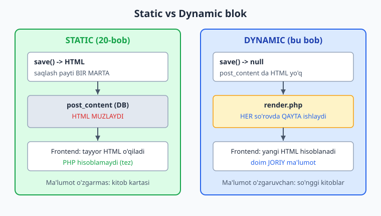
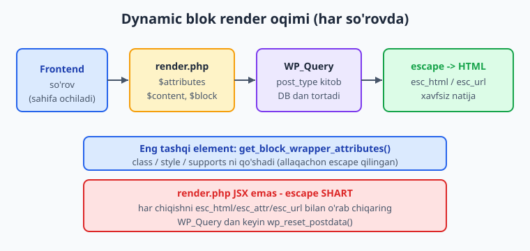
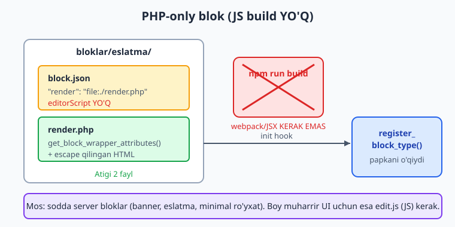

# 21 — Dynamic blok va PHP-only registratsiya

[⬅️ Oldingi: 20 — Static blok: edit, save, attributes](./20-static-blok.md) · [🏠 README](./README.md) · [Keyingi: 22 — Blok variations, styles, InnerBlocks, patterns ➡️](./22-blok-kengaytmalar.md)

> **Bu bobda:** dynamic (dinamik) blokni 0 dan to'liq quramiz — static blokdan farqli ravishda HTML `post_content` ga muzlatilmaydi, balki **har so'rovda** server tomonida `render.php` orqali qaytadan hisoblanadi (o'zgaruvchan ma'lumot, masalan "so'nggi 5 kitob" uchun); `block.json` dagi `"render": "file:./render.php"` (afzal yo'l) va muqobil `register_block_type(..., ['render_callback' => ...])` ni, `save` ning `null` qaytarishi (yoki umuman bo'lmasligi)ni, `render.php` ga ochiq `$attributes`/`$content`/`$block` (WP_Block) o'zgaruvchilarini, `get_block_wrapper_attributes()` wrapperini, `WP_Query` bilan ma'lumot olib kontekst bo'yicha escape qilishni, muharrirda natijani ko'rsatuvchi `ServerSideRender` (`@wordpress/server-side-render`) komponentini, hamda **PHP-only blok registratsiya** (faqat `block.json` + `render.php`, JS build'siz — sodda server bloklar uchun) usulini o'rganamiz va izchil namuna plugin'imizga "So'nggi kitoblar" dynamic blokini qo'shamiz.

---

## Muammo: ma'lumot doim o'zgaradi

20-bobda "Kitob kartasi" static blokini yozdik. U a'lo ishlaydi — chunki kartadagi ma'lumot (kitob nomi, muallif) **bir marta** kiritiladi va o'zgarmaydi. `save()` HTML ni `post_content` ga muzlatadi, sahifa ochilganda PHP hech narsa hisoblamaydi: tez va sodda.

Endi boshqa vazifa. Bloggerimiz har sahifaga "Eng so'nggi qo'shilgan 5 ta kitob" ro'yxatini chiqarmoqchi. Muammo aniq: bu ro'yxat **vaqt o'tishi bilan o'zgaradi**. Bugun yangi `kitob` (07-bobdagi CPT) qo'shsangiz — ertaga ro'yxat boshqacha bo'lishi kerak. Lekin static blok HTML ni saqlash payti **muzlatadi**: blok joylashtirilgan kungi 5 ta kitob u yerda abadiy qotib qoladi. Yangi kitob qo'shsangiz ham eski ro'yxat ko'rinaveradi.

Yechim — **dynamic blok**: HTML ni saqlash payti emas, balki **har so'rovda** (sahifa ochilganda) PHP qayta hisoblaydi. Foydalanuvchi blokni bir marta joylashtiradi, ammo ro'yxat doim joriy ma'lumotni ko'rsatadi.

📌 **Tub farq — HTML qayerda hisoblanadi.** Static: `save()` HTML ni `post_content` ga **yozadi** (muzlatadi). Dynamic: `save()` `null` qaytaradi, HTML ni **`render.php`** har so'rovda **qaytadan** ishlab chiqaradi.



---

## Static vs dynamic: qachon qaysi?

Tanlov ma'lumotning **tabiatiga** bog'liq, dizayniga emas.

| | Static blok (20-bob) | Dynamic blok (bu bob) |
|---|---|---|
| HTML qayerda | `post_content` (DB matni) | har so'rovda `render.php` |
| `save()` | HTML qaytaradi | `null` (yoki yo'q) |
| Frontend ish | PHP hisoblamaydi (tez) | PHP har so'rovda ishlaydi |
| Ma'lumot | o'zgarmas | o'zgaruvchan / tashqi |
| "Block validation" xatosi | bo'lishi mumkin (`save` muzlatilgan) | YO'Q (`save` bo'sh) |
| Misol | kitob kartasi, iqtibos | so'nggi kitoblar, hisoblagich |

- **Static tanlang**, agar ma'lumot bir marta kiritilsa va o'zgarmasa: kitob kartasi, ogohlantirish qutisi, iqtibos, qo'lda yozilgan bo'lim. Tezroq (PHP frontda hisoblamaydi) va serverga yuk kam.
- **Dynamic tanlang**, agar ma'lumot **vaqt o'tishi bilan yoki boshqa joydan** o'zgarsa: so'nggi postlar/kitoblar, foydalanuvchi ma'lumoti, hisoblagich, narx, ob-havo, REST'dan kelgan ma'lumot. Ma'lumotni bitta joyda (DB, CPT) saqlab, har so'rovda yangi ko'rsatasiz.

💡 **Yana bir afzallik: validation muammosi yo'q.** Dynamic blokda `save()` `null` bo'lgani uchun WordPress saqlangan markupni joriy `save()` bilan taqqoslamaydi — 20-bobdagi "block validation" xatosi (markup mos kelmasligi) **umuman bo'lmaydi**. Markup'ni o'zgartirsangiz, `render.php` ni o'zgartirasiz, vassalom. Shuning uchun murakkab yoki tez-tez yangilanadigan ko'rinish uchun dynamic ko'pincha **soddaroq** ham bo'ladi.

⚠️ **Lekin tekin emas.** Dynamic blok har sahifa so'rovida `render.php` ni ishga tushiradi (`WP_Query` ham qiladi). Static esa tayyor HTML ni o'qiydi. Shuning uchun "o'zgarmas" ma'lumotni dynamic qilish — keraksiz server yuki. Avval "ma'lumot haqiqatan o'zgaradimi?" deb so'rang.

---

## Dynamic blokni ro'yxatdan o'tkazish: ikki yo'l

Dynamic blok HTML ni `render.php` (yoki bir callback funksiya) orqali server tomonida hisoblaydi. WordPress'ga "render mantig'i qayerda" deb ikki usulda aytasiz.

### 1-yo'l (afzal): `block.json` dagi `"render"`

`block.json` ga bir qator qo'shasiz:

```json
{
	"$schema": "https://schemas.wp.org/trunk/block.json",
	"apiVersion": 3,
	"name": "oqil/songgi-kitoblar",
	"title": "So'nggi kitoblar",
	"category": "widgets",
	"icon": "book-alt",
	"textdomain": "kitoblar-katalogi",
	"editorScript": "file:./index.js",
	"render": "file:./render.php"
}
```

`"render": "file:./render.php"` — WordPress shu faylni har frontend so'rovida ishga tushiradi va natijasini blok HTML'i sifatida ishlatadi.

ℹ️ Bu qiymat `file:` prefiksli **yo'l** (developer.wordpress.org Block Metadata hujjatida tasdiqlangan). `render.php` `build/` papkaga ham nusxalanadi (`@wordpress/scripts` `--webpack-copy-php` bilan), shuning uchun `register_block_type( __DIR__ . '/build/songgi-kitoblar' )` uni topadi.

📌 **`save` YO'Q.** Dynamic blok `index.js` da faqat `edit` registratsiya qiladi (`save` umuman berilmaydi yoki `() => null`). HTML ni `render.php` ishlab chiqargani uchun `save()` ga ehtiyoj yo'q.

```js
import { registerBlockType } from '@wordpress/blocks';
import Edit from './edit';
import metadata from './block.json';

registerBlockType( metadata.name, {
	edit: Edit,
	// save yo'q — dynamic blok HTML ni render.php dan oladi
} );
```

### 2-yo'l (muqobil): `render_callback`

`block.json` dagi `"render"` o'rniga (yoki `block.json`'siz eski uslubda) PHP'da callback berasiz:

```php
namespace Oqil\KitobKatalog;

add_action( 'init', __NAMESPACE__ . '\\register_callback_blok' );

function register_callback_blok(): void {
	register_block_type(
		__DIR__ . '/build/songgi-kitoblar',
		array(
			'render_callback' => __NAMESPACE__ . '\\render_songgi_kitoblar',
		)
	);
}

function render_songgi_kitoblar( array $attributes, string $content, \WP_Block $block ): string {
	// HTML stringni QAYTARING (echo qilmang)
	return '<p ' . get_block_wrapper_attributes() . '>'
		. esc_html__( 'So\'nggi kitoblar', 'kitoblar-katalogi' ) . '</p>';
}
```

ℹ️ `render_callback` developer.wordpress.org dynamic-blocks qo'llanmasida tasdiqlangan: callback `$attributes`, `$content` argumentlarini oladi (uchinchi argument — `WP_Block` instansiyasi) va HTML **stringni qaytaradi**.

⚠️ **`render.php` `echo` qiladi, `render_callback` `return` qiladi.** `render.php` ichida output to'g'ridan-to'g'ri **bosib chiqariladi** (`echo`/`?>...<?php`). `render_callback` funksiyasi esa HTML stringni **qaytaradi** (`return`) — `echo` qilsa, blok o'rni noto'g'ri chiqadi. Ikki mexanizm, ikki qoida.

💡 **Qaysi birini tanlash?** Yangi loyiha — `block.json` `"render"` (toza, deklarativ, fayl alohida). `render_callback` — kod dinamik bo'lsa (callback nomi shartli aniqlanadi) yoki bir blokni bir nechta marta turli render bilan ro'yxatdan o'tkazsangiz kerak bo'ladi. Ikkalasi bir vaqtda berilsa, `render_callback` ustun keladi.

---

## `render.php` ichida nima bor?

`render.php` — oddiy PHP fayl. WordPress uni ishga tushirayotganda **uchta o'zgaruvchini** avtomatik ochadi (siz e'lon qilmaysiz):

| O'zgaruvchi | Tip | Nima |
|---|---|---|
| `$attributes` | `array` | blok atributlari (`block.json` dagi `attributes`, joriy qiymatlar bilan) |
| `$content` | `string` | blokning ichki kontenti (InnerBlocks bo'lsa — 22-bob) |
| `$block` | `WP_Block` | blok instansiyasi (kontekst, `$block->context` va h.k.) |

ℹ️ Bu uch o'zgaruvchi developer.wordpress.org Block Metadata hujjatida aynan shunday hujjatlangan: "`$attributes` (array): The block attributes. `$content` (string): The block default content. `$block` (WP_Block): The block instance." Scaffold qilingan `render.php` ham aynan shu izohni o'z ichiga oladi.

### `get_block_wrapper_attributes()`: wrapper

Static blokda `useBlockProps.save()` eng tashqi elementga yadro `class`, `id`, rang, bo'shliq atributlarini qo'shardi. `render.php` da JS yo'q — buning **PHP ekvivalenti `get_block_wrapper_attributes()`**. U tayyor, escape qilingan atribut **stringini** qaytaradi:

```php
<div <?php echo get_block_wrapper_attributes(); ?>>
	<!-- blok kontenti -->
</div>
```

ℹ️ Signatura developer.wordpress.org bilan tasdiqlangan: `get_block_wrapper_attributes( string[] $extra_attributes = array() ): string`. Natija — `class="wp-block-oqil-songgi-kitoblar ..." style="..."` kabi **allaqachon escape qilingan** HTML atributlar stringi. Shuning uchun uni `echo` qilasiz, qaytadan escape **qilmaysiz**.

📌 **Eng tashqi elementga `get_block_wrapper_attributes()` bering.** Busiz `supports` (rang, bo'shliq, tekislash) qiymatlari markupga tushmaydi va frontend stili buziladi — bu `render.php` dagi eng ko'p uchraydigan kamchilik. Qo'shimcha atribut kerak bo'lsa massiv beriladi: `get_block_wrapper_attributes( [ 'class' => 'kitkat-songgi' ] )` (yadro class'lari bilan **birlashadi**, ustiga yozmaydi).

### Output escape — bu yerda ham SHART

`render.php` — sof PHP HTML chiqaradi (JSX'ning avtomatik escape'i YO'Q). Shuning uchun 12-bobdagi qoida to'liq kuchda: **har bir o'zgaruvchini kontekst bo'yicha escape qiling**.

- Matn → `esc_html()`
- HTML atribut → `esc_attr()`
- URL → `esc_url()`
- Ruxsat berilgan HTML (post kontenti) → `wp_kses_post()`
- Tarjima + escape → `esc_html__()`, `esc_html_e()`

⚠️ **`render.php` da escape unutilsa — XSS.** `$attributes` foydalanuvchidan keladi (muharrir orqali) va `WP_Query` natijasi ham ishonchli emas (sarlavhada teg bo'lishi mumkin). Hech qachon `echo $attributes['janr']` qilmang — `echo esc_html( $attributes['janr'] )`.



---

## Muharrirda ko'rinish: `ServerSideRender`

Static blokda `edit()` JSX bilan blok ko'rinishini muharrirda **o'zi** chizardi. Dynamic blokda esa "haqiqiy" HTML faqat serverda (`render.php`) hosil bo'ladi — muharrir uni qanday ko'rsatadi?

Eng oddiy yo'l — **`ServerSideRender`** komponenti (`@wordpress/server-side-render` paketi). U `render.php` ni REST orqali serverga yuborib **chaqiradi** va natijasini muharrirda ko'rsatadi — ya'ni muharrirda ham frontenddagi bilan **bir xil** ko'rinadi.

```jsx
import { __ } from '@wordpress/i18n';
import { useBlockProps, InspectorControls } from '@wordpress/block-editor';
import { PanelBody, TextControl, RangeControl } from '@wordpress/components';
import ServerSideRender from '@wordpress/server-side-render';

export default function Edit( { attributes, setAttributes } ) {
	const { janr, soni } = attributes;
	const blockProps = useBlockProps();

	return (
		<>
			<InspectorControls>
				<PanelBody title={ __( 'Ro\'yxat sozlamalari', 'kitoblar-katalogi' ) }>
					<TextControl
						label={ __( 'Janr slug (bo\'sh = barchasi)', 'kitoblar-katalogi' ) }
						value={ janr }
						onChange={ ( v ) => setAttributes( { janr: v } ) }
					/>
					<RangeControl
						label={ __( 'Nechta kitob', 'kitoblar-katalogi' ) }
						value={ soni }
						onChange={ ( v ) => setAttributes( { soni: v } ) }
						min={ 1 }
						max={ 10 }
					/>
				</PanelBody>
			</InspectorControls>

			<div { ...blockProps }>
				<ServerSideRender
					block="oqil/songgi-kitoblar"
					attributes={ attributes }
				/>
			</div>
		</>
	);
}
```

- `block` — blok nomi (`block.json` dagi `name` bilan bir xil).
- `attributes` — joriy atributlar; o'zgartirilsa, `ServerSideRender` `render.php` ni **qayta chaqiradi** (yangi natija ko'rinadi).

ℹ️ `ServerSideRender` importi va ishlatilishi developer.wordpress.org dynamic-blocks qo'llanmasida tasdiqlangan: `import ServerSideRender from '@wordpress/server-side-render';` va `<ServerSideRender block="..." attributes={ ... } />`.

💡 **`ServerSideRender` — sodda, lekin kamtarona.** U `render.php` ni REST orqali chaqiradi, demak har atribut o'zgarganda server so'rovi ketadi (sekinroq) va muharrirda interaktivlik (RichText kabi) bo'lmaydi — faqat tayyor HTML ko'rsatiladi. Murakkab muharrir tajribasi kerak bo'lsa, `edit()` ni JSX bilan **alohida** chizib (frontend `render.php` bilan farqlanishi mumkin), `ServerSideRender` o'rniga `@wordpress/data` (23-bob) bilan ma'lumotni JS'da olasiz. Ko'p hollarda `ServerSideRender` yetarli.

⚠️ **`ServerSideRender` — alohida paket.** U `@wordpress/block-editor` ichida **emas**, balki `@wordpress/server-side-render` paketida. Import qatorini to'g'ri yozing; `npm install @wordpress/server-side-render` kerak bo'lishi mumkin (build bog'liqlik sifatida aniqlaydi).

---

## To'liq namuna: "So'nggi kitoblar" dynamic bloki

Endi hammasini birlashtiramiz. Izchil namuna plugin'imiz `kitoblar-katalogi` ga dynamic blok qo'shamiz: `kitob` CPT'sidan eng so'nggi N ta kitobni (ixtiyoriy `janr` taksonomiyasi bo'yicha) ro'yxatga oladi.

### `block.json`

```json
{
	"$schema": "https://schemas.wp.org/trunk/block.json",
	"apiVersion": 3,
	"name": "oqil/songgi-kitoblar",
	"version": "0.1.0",
	"title": "So'nggi kitoblar",
	"category": "widgets",
	"icon": "book-alt",
	"description": "Eng so'nggi qo'shilgan kitoblarni ko'rsatuvchi dynamic blok.",
	"attributes": {
		"janr": { "type": "string", "default": "" },
		"soni": { "type": "number", "default": 5 }
	},
	"supports": {
		"html": false
	},
	"textdomain": "kitoblar-katalogi",
	"editorScript": "file:./index.js",
	"editorStyle": "file:./index.css",
	"style": "file:./style-index.css",
	"render": "file:./render.php"
}
```

📌 `janr` va `soni` — sozlama atributlari, `source`siz (20-bob): ular HTML'da emas, blok izohida JSON sifatida saqlanadi va `render.php` ga `$attributes` orqali yetib boradi.

### `render.php`

```php
<?php
/**
 * Dynamic blok server-render fayli.
 *
 * Mavjud o'zgaruvchilar:
 *   $attributes (array): blok atributlari.
 *   $content (string): blok ichki kontenti.
 *   $block (WP_Block): blok instansiyasi.
 */

$soni = isset( $attributes['soni'] ) ? absint( $attributes['soni'] ) : 5;
$janr = isset( $attributes['janr'] ) ? sanitize_title( $attributes['janr'] ) : '';

$args = array(
	'post_type'      => 'kitob',
	'posts_per_page' => $soni,
	'post_status'    => 'publish',
	'orderby'        => 'date',
	'order'          => 'DESC',
);

if ( '' !== $janr ) {
	$args['tax_query'] = array(
		array(
			'taxonomy' => 'janr',
			'field'    => 'slug',
			'terms'    => $janr,
		),
	);
}

$soulgi = new WP_Query( $args );

if ( ! $soulgi->have_posts() ) {
	echo '<p ' . get_block_wrapper_attributes() . '>'
		. esc_html__( 'Hozircha kitob yo\'q.', 'kitoblar-katalogi' )
		. '</p>';
	return;
}
?>
<div <?php echo get_block_wrapper_attributes(); ?>>
	<ul class="kitkat-songgi">
		<?php while ( $soulgi->have_posts() ) : $soulgi->the_post(); ?>
			<li class="kitkat-songgi__item">
				<a href="<?php echo esc_url( get_permalink() ); ?>">
					<?php echo esc_html( get_the_title() ); ?>
				</a>
			</li>
		<?php endwhile; ?>
	</ul>
</div>
<?php
wp_reset_postdata();
```

Diqqat qiling:

- `absint()` va `sanitize_title()` — `$attributes` dan kelgan qiymatlarni **tozalaydi** (`soni` musbat butun son, `janr` slug shakliga).
- `WP_Query` (`query_posts()` EMAS — 10-bobdagi qoida) bilan `kitob` CPT'dan tortamiz; `tax_query` bilan `janr` filtri ixtiyoriy.
- `get_permalink()`/`get_the_title()` natijasini `esc_url()`/`esc_html()` bilan escape qilamiz.
- `wp_reset_postdata()` — global `$post` ni tiklaydi (custom `WP_Query` dan keyin SHART, aks holda sahifaning qolgan qismi buziladi).

⚠️ **`wp_reset_postdata()` ni unutmang.** `the_post()` global `$post` ni o'zgartiradi. Tiklamasangiz, blokdan keyingi kontent (boshqa bloklar, izohlar) noto'g'ri postni ko'rsatadi.

### `edit.js` (yuqorida) va `index.js`

`edit.js` — yuqoridagi `ServerSideRender` li komponent. `index.js` faqat `edit` registratsiya qiladi (`save` yo'q):

```js
import { registerBlockType } from '@wordpress/blocks';
import './style.scss';
import Edit from './edit';
import metadata from './block.json';

registerBlockType( metadata.name, { edit: Edit } );
```

### PHP tomoni: ro'yxatdan o'tkazish

```php
namespace Oqil\KitobKatalog;

add_action( 'init', __NAMESPACE__ . '\\register_kitkat_dynamic_bloklar' );

function register_kitkat_dynamic_bloklar(): void {
	register_block_type( __DIR__ . '/build/songgi-kitoblar' );
}
```

ℹ️ `register_block_type( string|WP_Block_Type $block_type, array $args = array() ): WP_Block_Type|false` — birinchi argument `block.json` joylashgan papka yo'li bo'lishi mumkin (developer.wordpress.org bilan tasdiqlangan). `block.json` dagi `"render"` avtomatik o'qiladi — bu yerda `render_callback` berish **shart emas**.

ℹ️ **O'z saytingizda sinab ko'ring.** Bu kod sintaktik to'g'ri (`php -l` dan o'tdi) va blok `npm run build` bilan **haqiqatan qurildi**, lekin natijani ko'rish uchun `kitob` CPT'da nechta nashr etilgan post va **ishlab turgan WordPress sayt** kerak (02-bobdagi `wp-env`). Plugin'ni aktivatsiya qiling, bir nechta `kitob` qo'shing, postga "So'nggi kitoblar" blokini joylashtiring — muharrirda `ServerSideRender` ro'yxatni ko'rsatadi, frontendda har so'rovda yangilanadi.

---

## PHP-only blok registratsiya (JS build'siz)

Yuqoridagi blok `ServerSideRender` (`edit.js`) ishlatadi, demak JS build kerak. Lekin ko'p **sodda server bloklarida** muharrir tajribasi murakkab emas — shunchaki render natijasini ko'rsatish kifoya. Bunday hollarda 2026 da **JS build umuman shart emas**: faqat `block.json` + `render.php` bilan blok yaratasiz.

Siri shunda: `block.json` dagi **`editorScript` ixtiyoriy**. Agar uni bermasangiz va `"render": "file:./render.php"` bersangiz, blok **JS'siz** ro'yxatdan o'tadi. Muharrirda WordPress (yetarlicha yangi versiyalarda) `render.php` natijasini o'zi server orqali ko'rsatadi.

### Fayl tuzilishi (faqat ikki fayl)

```text
kitoblar-katalogi/
  bloklar/
    eslatma/
      block.json     <- editorScript YO'Q
      render.php     <- HTML
```

### `block.json` (JS yo'q)

```json
{
	"$schema": "https://schemas.wp.org/trunk/block.json",
	"apiVersion": 3,
	"name": "oqil/eslatma",
	"title": "Eslatma qutisi",
	"category": "widgets",
	"icon": "info",
	"textdomain": "kitoblar-katalogi",
	"render": "file:./render.php"
}
```

📌 `editorScript`, `index.js`, `edit.js`, `save.js` — **birortasi ham yo'q**. Webpack ham, `npm run build` ham kerak emas. `block.json` + `render.php` — vassalom.

### `render.php`

```php
<?php
/**
 * PHP-only blok: faqat block.json + shu fayl.
 */
?>
<div <?php echo get_block_wrapper_attributes(); ?>>
	<p><?php esc_html_e( 'Bu kitob tahririyat tavsiyasi.', 'kitoblar-katalogi' ); ?></p>
</div>
```

### Ro'yxatdan o'tkazish (build papkasiz)

```php
namespace Oqil\KitobKatalog;

add_action( 'init', __NAMESPACE__ . '\\register_php_only_blok' );

function register_php_only_blok(): void {
	register_block_type( __DIR__ . '/bloklar/eslatma' );
}
```

ℹ️ Bu yo'l empirik tasdiqlangan: `@wordpress/create-block <nom> --variant dynamic --no-plugin` **aynan shunday** strukturani (`block.json` + `render.php`, package.json/build YO'Q) yaratadi. `register_block_type` papkadan `block.json` ni o'qiydi, `"render"` `render.php` ga ishora qiladi — JS qadami umuman bo'lmaydi.



📌 **Qachon PHP-only mos?** Muharrirda murakkab tahrirlash kerak bo'lmaganda: statik eslatma/banner, "so'nggi N ta post" kabi sozlamasiz yoki minimal sozlamali ro'yxat, qisqa server-render fragment. PHP biluvchi, lekin React/build ishtiyoqi yo'q dasturchi uchun ideal kirish nuqtasi.

⚠️ **Cheklov.** PHP-only blokda boy muharrir UI (RichText, sudralib o'zgaradigan InspectorControls) yo'q — atributlarni boshqarish uchun baribir JS (`edit.js`) kerak bo'ladi. Atributli, muharrirda sozlanadigan blok kerak bo'lsa — yuqoridagi `ServerSideRender` li to'liq variant. PHP-only — eng sodda holatlar uchun.

---

## Build qilish va tekshirish

`ServerSideRender` li variant JSX ishlatadi, shuning uchun `@wordpress/scripts` bilan quriladi:

```bash
npm install @wordpress/server-side-render
npm run build
```

💡 **Bu bobning kodi haqiqatan tekshirilgan.** Dynamic blok `@wordpress/create-block@latest songgi-kitoblar --namespace oqil --variant dynamic` bilan scaffold qilindi (u `render.php` ni avtomatik yaratadi — `$attributes`/`$content`/`$block` izohi bilan). Yuqoridagi `edit.js` (`ServerSideRender` bilan), `render.php` (`WP_Query`) va `block.json` joylanib, `@wordpress/server-side-render` o'rnatilgach `npm run build` ishga tushirildi — webpack **`compiled successfully`** qaytardi. `build/songgi-kitoblar/index.asset.php` ichida bog'liqliklar paydo bo'ldi: `wp-block-editor`, `wp-blocks`, `wp-components`, `wp-i18n` va **`wp-server-side-render`** (bu — `ServerSideRender` importi to'g'riligining ishonchli tasdig'i; JSX'ni `node --check` topa olmaydi). `render.php` `build/` ga nusxalandi va `php -l` dan xatosiz o'tdi.

---

## Xulosa

- **Dynamic blok** HTML ni `post_content` ga muzlatmaydi — **har so'rovda** `render.php` (yoki `render_callback`) qaytadan hisoblaydi. O'zgaruvchan/tashqi ma'lumot uchun.
- **Static vs dynamic**: ma'lumot o'zgarmasa → static (tez); o'zgarsa → dynamic. Dynamicda "block validation" muammosi yo'q (`save` `null`).
- **Ikki registratsiya yo'li**: `block.json` `"render": "file:./render.php"` (afzal, deklarativ) yoki `register_block_type(..., ['render_callback' => ...])`. `render.php` **echo** qiladi, `render_callback` **return** qiladi.
- **`render.php` o'zgaruvchilari**: `$attributes` (array), `$content` (string), `$block` (WP_Block) — avtomatik ochiq.
- **`get_block_wrapper_attributes()`** — eng tashqi elementga (PHP'dagi `useBlockProps.save()` ekvivalenti); natija allaqachon escape qilingan.
- **Escape SHART**: `render.php` JSX emas — `esc_html`/`esc_attr`/`esc_url` bilan har chiqishni escape qiling. `WP_Query` dan keyin `wp_reset_postdata()`.
- **`ServerSideRender`** (`@wordpress/server-side-render`) — muharrirda `render.php` natijasini ko'rsatadi.
- **PHP-only blok** (2026): faqat `block.json` (`editorScript`siz) + `render.php`, **JS build'siz** — sodda server bloklar uchun.

Keyingi bobda blokni kengaytiramiz: variations (bir blokning bir nechta tayyor varianti), styles (uslublar), InnerBlocks (blok ichida blok) va patterns (blok andozalari).

---

## 21-bob mashqlari

> Mashqlar `kitoblar-katalogi` plugini ustida ishlaydi (nom `oqil/songgi-kitoblar`, namespace `Oqil\KitobKatalog`). Dynamic blokni `@wordpress/create-block ... --variant dynamic` bilan scaffold qiling, `render.php` ni `php -l` bilan, butun blokni `npm run build` bilan tekshiring; natijani `kitob` CPT'li `wp-env` saytingizda sinang.

### Oson

1. **(Oson)** Static va dynamic blok orasidagi tub farqni bir jumlada ayting: HTML qayerda va qachon hisoblanadi?
2. **(Oson)** Dynamic blokda `save()` nima qaytaradi? Nega `index.js` da `save` bermasangiz ham bo'ladi?
3. **(Oson)** `render.php` ga avtomatik ochiladigan uchta o'zgaruvchini va ularning tipini ayting.
4. **(Oson)** `render.php` da eng tashqi elementga qaysi funksiyani qo'shasiz va u nima qaytaradi? Bu static blokdagi qaysi narsaning ekvivalenti?
5. **(Oson)** "So'nggi 5 kitob" ro'yxati uchun static yoki dynamic blok kerak? Nega?
6. **(Oson)** `ServerSideRender` qaysi paketdan import qilinadi va u muharrirda nima qiladi?

### O'rta

7. **(O'rta)** `block.json` ga `"render": "file:./render.php"` qo'shing va `render.php` da `get_block_wrapper_attributes()` bilan o'ralgan oddiy "Salom" matnini chiqaring (escape bilan).

<details markdown="1"><summary>Yechim</summary>

`block.json` (qisman):

```json
"render": "file:./render.php"
```

`render.php`:

```php
<div <?php echo get_block_wrapper_attributes(); ?>>
	<?php esc_html_e( 'Salom, dynamic blok!', 'kitoblar-katalogi' ); ?>
</div>
```

`get_block_wrapper_attributes()` allaqachon escape qilingan atribut stringini qaytaradi (qaytadan escape kerak emas), matnni esa `esc_html_e()` bilan tarjima qilib escape qilamiz.
</details>

8. **(O'rta)** `render.php` da `$attributes['soni']` (raqam) va `$attributes['janr']` (slug) ni xavfsiz o'qing. Qaysi sanitize funksiyalarini ishlatasiz va nega?

<details markdown="1"><summary>Yechim</summary>

```php
$soni = isset( $attributes['soni'] ) ? absint( $attributes['soni'] ) : 5;
$janr = isset( $attributes['janr'] ) ? sanitize_title( $attributes['janr'] ) : '';
```

`absint()` — manfiy yoki kasr sonlardan himoya, musbat butun son beradi (`posts_per_page` uchun). `sanitize_title()` — qiymatni slug shakliga keltiradi (taksonomiya `slug` solishtiruvi uchun). `$attributes` foydalanuvchidan keladi, shuning uchun ishonib bo'lmaydi.
</details>

9. **(O'rta)** `render_callback` va `block.json` `"render"` orasidagi farqni ayting: qaysi biri `echo`, qaysi biri `return` qiladi? Qaysi vaziyatda `render_callback` qulayroq?

<details markdown="1"><summary>Yechim</summary>

- `block.json` `"render": "file:./render.php"` — `render.php` to'g'ridan-to'g'ri output **echo** qiladi (`?>...<?php` yoki `echo`).
- `render_callback` — `register_block_type` ga berilgan PHP funksiya; u HTML stringni **return** qiladi (echo qilsa, blok o'rni buziladi).

`render_callback` qulayroq: render mantig'i sinf metodi/dinamik aniqlanadigan callback bo'lsa, bir blokni turli render bilan bir necha bor ro'yxatdan o'tkazsangiz, yoki `block.json`'siz eski uslubda. Yangi loyihada deklarativ `"render"` afzal.
</details>

10. **(O'rta)** Quyidagi `render.php` xato beradi. Sababini toping va to'g'rilang:
```php
<?php
$q = new WP_Query( [ 'post_type' => 'kitob', 'posts_per_page' => 3 ] );
while ( $q->have_posts() ) {
	$q->the_post();
	echo '<p>' . get_the_title() . '</p>';
}
```

<details markdown="1"><summary>Yechim</summary>

Uch muammo:

1. **`get_block_wrapper_attributes()` yo'q** — wrapper elementi yo'q, `supports`/class markupga tushmaydi.
2. **Escape yo'q** — `get_the_title()` sarlavhasida HTML bo'lishi mumkin (XSS). `esc_html()` kerak.
3. **`wp_reset_postdata()` yo'q** — global `$post` tiklanmaydi, sahifaning qolgani buziladi.

To'g'risi:

```php
<?php
$q = new WP_Query( array( 'post_type' => 'kitob', 'posts_per_page' => 3 ) );
?>
<div <?php echo get_block_wrapper_attributes(); ?>>
	<?php while ( $q->have_posts() ) : $q->the_post(); ?>
		<p><?php echo esc_html( get_the_title() ); ?></p>
	<?php endwhile; ?>
</div>
<?php wp_reset_postdata();
```
</details>

11. **(O'rta)** `edit.js` da `ServerSideRender` ga `block` va `attributes` props'larini bering. `attributes` o'zgarganda nima sodir bo'ladi?

<details markdown="1"><summary>Yechim</summary>

```jsx
import ServerSideRender from '@wordpress/server-side-render';
// ...
<ServerSideRender
	block="oqil/songgi-kitoblar"
	attributes={ attributes }
/>
```

`attributes` o'zgarganda (masalan foydalanuvchi `soni` ni yangilasa) `ServerSideRender` `render.php` ni REST orqali **qayta chaqiradi** va muharrirda yangi natijani ko'rsatadi. Shuning uchun muharrir ko'rinishi frontend bilan bir xil bo'ladi.
</details>

12. **(O'rta)** Dynamic blokda nega "block validation" xatosi umuman bo'lmaydi? Buni static blok bilan solishtiring.

<details markdown="1"><summary>Yechim</summary>

"Block validation" xatosi WordPress saqlangan HTML'ni joriy `save()` chiqargani bilan taqqoslaganda mos kelmasa yuzaga keladi (static blok). Dynamic blokda `save()` `null` qaytaradi — `post_content` ga muzlatilgan markup yo'q, demak **taqqoslanadigan narsa yo'q**. HTML har so'rovda `render.php` da yangi hosil bo'ladi, shuning uchun markupni o'zgartirish (faqat `render.php` ni tahrirlash) eski postlarni buzmaydi. Static blokda esa `save()` o'zgarishi `deprecated`/migratsiya talab qiladi.
</details>

### Qiyin

13. **(Qiyin)** To'liq "So'nggi kitoblar" dynamic blokini yozing: `block.json` (`janr`, `soni` atributlari, `"render"`), `render.php` (`WP_Query` `kitob` CPT, ixtiyoriy `janr` `tax_query`, escape, `wp_reset_postdata`), `edit.js` (`ServerSideRender` + InspectorControls), `index.js` (`save`siz).

<details markdown="1"><summary>Yechim</summary>

`block.json`:

```json
{
	"$schema": "https://schemas.wp.org/trunk/block.json",
	"apiVersion": 3,
	"name": "oqil/songgi-kitoblar",
	"title": "So'nggi kitoblar",
	"category": "widgets",
	"icon": "book-alt",
	"textdomain": "kitoblar-katalogi",
	"attributes": {
		"janr": { "type": "string", "default": "" },
		"soni": { "type": "number", "default": 5 }
	},
	"supports": { "html": false },
	"editorScript": "file:./index.js",
	"render": "file:./render.php"
}
```

`render.php`:

```php
<?php
$soni = isset( $attributes['soni'] ) ? absint( $attributes['soni'] ) : 5;
$janr = isset( $attributes['janr'] ) ? sanitize_title( $attributes['janr'] ) : '';
$args = array(
	'post_type'      => 'kitob',
	'posts_per_page' => $soni,
	'post_status'    => 'publish',
);
if ( '' !== $janr ) {
	$args['tax_query'] = array(
		array( 'taxonomy' => 'janr', 'field' => 'slug', 'terms' => $janr ),
	);
}
$q = new WP_Query( $args );
if ( ! $q->have_posts() ) {
	echo '<p ' . get_block_wrapper_attributes() . '>'
		. esc_html__( 'Kitob yo\'q.', 'kitoblar-katalogi' ) . '</p>';
	return;
}
?>
<ul <?php echo get_block_wrapper_attributes(); ?>>
	<?php while ( $q->have_posts() ) : $q->the_post(); ?>
		<li><a href="<?php echo esc_url( get_permalink() ); ?>"><?php echo esc_html( get_the_title() ); ?></a></li>
	<?php endwhile; ?>
</ul>
<?php wp_reset_postdata();
```

`edit.js`:

```jsx
import { __ } from '@wordpress/i18n';
import { useBlockProps, InspectorControls } from '@wordpress/block-editor';
import { PanelBody, TextControl, RangeControl } from '@wordpress/components';
import ServerSideRender from '@wordpress/server-side-render';

export default function Edit( { attributes, setAttributes } ) {
	const { janr, soni } = attributes;
	return (
		<>
			<InspectorControls>
				<PanelBody title={ __( 'Sozlamalar', 'kitoblar-katalogi' ) }>
					<TextControl label={ __( 'Janr slug', 'kitoblar-katalogi' ) }
						value={ janr } onChange={ ( v ) => setAttributes( { janr: v } ) } />
					<RangeControl label={ __( 'Nechta', 'kitoblar-katalogi' ) }
						value={ soni } onChange={ ( v ) => setAttributes( { soni: v } ) }
						min={ 1 } max={ 10 } />
				</PanelBody>
			</InspectorControls>
			<div { ...useBlockProps() }>
				<ServerSideRender block="oqil/songgi-kitoblar" attributes={ attributes } />
			</div>
		</>
	);
}
```

`index.js`:

```js
import { registerBlockType } from '@wordpress/blocks';
import Edit from './edit';
import metadata from './block.json';
registerBlockType( metadata.name, { edit: Edit } );
```

`npm install @wordpress/server-side-render` so'ng `npm run build` bilan tekshiring — `index.asset.php` da `wp-server-side-render` bo'lishi kerak.
</details>

14. **(Qiyin)** PHP-only blok yozing: faqat `block.json` (`editorScript`siz, `"render"` bilan) + `render.php`, hech qanday JS build'siz. `register_block_type` bilan ro'yxatdan o'tkazing. Bu yondashuv qachon mos, qachon mos emas?

<details markdown="1"><summary>Yechim</summary>

`bloklar/eslatma/block.json`:

```json
{
	"$schema": "https://schemas.wp.org/trunk/block.json",
	"apiVersion": 3,
	"name": "oqil/eslatma",
	"title": "Eslatma qutisi",
	"category": "widgets",
	"icon": "info",
	"textdomain": "kitoblar-katalogi",
	"render": "file:./render.php"
}
```

`bloklar/eslatma/render.php`:

```php
<div <?php echo get_block_wrapper_attributes(); ?>>
	<p><?php esc_html_e( 'Tahririyat tavsiyasi.', 'kitoblar-katalogi' ); ?></p>
</div>
```

Ro'yxatdan o'tkazish:

```php
add_action( 'init', function (): void {
	register_block_type( __DIR__ . '/bloklar/eslatma' );
} );
```

`editorScript` yo'q, demak `index.js`/`edit.js`/webpack ham yo'q — `npm run build` kerak emas. **Mos:** sodda server-render bloklar (banner, eslatma, sozlamasiz/minimal sozlamali ro'yxat), PHP biluvchi build'siz dasturchi. **Mos emas:** boy muharrir UI (RichText, sudralib o'zgaradigan sozlamalar) kerak bo'lsa — atributlarni boshqarish uchun baribir `edit.js` (JS) kerak.
</details>

15. **(Qiyin)** `render_callback` versiyasini yozing: `register_block_type` ga `render_callback` bering, callback `array $attributes, string $content, \WP_Block $block` qabul qilsin va HTML **string return** qilsin (echo emas). Nega `render.php` `echo`, lekin `render_callback` `return` qiladi?

<details markdown="1"><summary>Yechim</summary>

```php
namespace Oqil\KitobKatalog;

add_action( 'init', __NAMESPACE__ . '\\register_callback_blok' );

function register_callback_blok(): void {
	register_block_type(
		__DIR__ . '/build/songgi-kitoblar',
		array( 'render_callback' => __NAMESPACE__ . '\\render_songgi' )
	);
}

function render_songgi( array $attributes, string $content, \WP_Block $block ): string {
	$soni = absint( $attributes['soni'] ?? 5 );
	$q = new \WP_Query( array(
		'post_type' => 'kitob', 'posts_per_page' => $soni, 'post_status' => 'publish',
	) );
	if ( ! $q->have_posts() ) {
		return '<p ' . get_block_wrapper_attributes() . '>'
			. esc_html__( 'Kitob yo\'q.', 'kitoblar-katalogi' ) . '</p>';
	}
	$html = '<ul ' . get_block_wrapper_attributes() . '>';
	while ( $q->have_posts() ) {
		$q->the_post();
		$html .= '<li><a href="' . esc_url( get_permalink() ) . '">'
			. esc_html( get_the_title() ) . '</a></li>';
	}
	$html .= '</ul>';
	wp_reset_postdata();
	return $html;
}
```

`render.php` WordPress tomonidan output buffer ichida `include` qilinadi — chiqargan hamma narsa (echo) blok HTML'i bo'ladi. `render_callback` esa oddiy funksiya: WordPress uning **qaytargan qiymatini** (`return`) blok HTML'i sifatida oladi. Callback `echo` qilsa, output noto'g'ri joyda (boshqa bloklardan oldin) chiqadi.
</details>

16. **(Qiyin)** Bir blokni dynamic qilish kerakmi yoki static qoldirish — qaror daraxti tuzing. Kamida 4 mezon (ma'lumot o'zgaruvchanligi, server yuki, validation xatari, muharrir tajribasi) bo'yicha tahlil qiling va har biriga misol bering.

<details markdown="1"><summary>Yechim</summary>

- **Ma'lumot o'zgaruvchanligimi?** O'zgarsa (so'nggi postlar, narx, hisoblagich) → dynamic; o'zgarmasa (iqtibos, kitob kartasi) → static.
- **Server yuki.** Static — frontda PHP hisoblamaydi (tez, keshlanadi). Dynamic — har so'rovda `render.php` + `WP_Query`. Yuqori trafikli "o'zgarmas" blokni dynamic qilish — keraksiz yuk; static afzal.
- **Validation xatari.** Static `save()` "muzlatilgan kontrakt" — markup o'zgarishi eski postlarni buzadi (`deprecated`/migratsiya kerak). Dynamic `save() = null` — bu xatar **yo'q**, markupni `render.php` da bemalol o'zgartirasiz.
- **Muharrir tajribasi.** Murakkab tahrirlash (RichText, inline tahrir) kerak bo'lsa — static `edit()`/`save()` qulay; dynamic'da `ServerSideRender` faqat natijani ko'rsatadi (tahrir yo'q).

Qaror: ma'lumot o'zgarsa → dynamic. O'zgarmasa, lekin markup tez-tez yangilanadi yoki migratsiyadan qochmoqchi bo'lsangiz → dynamic ham mantiqiy. O'zgarmas + yuqori trafik + boy muharrir tahriri → static. Aralash (qisman o'zgaruvchan) → 22-23-boblardagi InnerBlocks yoki `@wordpress/data` bilan gibrid.
</details>

17. **(Qiyin)** Quyidagi dynamic blok muharrirda bo'sh ko'rinadi (frontendda ishlaydi). Sababini toping. `edit.js`:
```jsx
import { useBlockProps } from '@wordpress/block-editor';
export default function Edit() {
	return <div { ...useBlockProps() }></div>;
}
```

<details markdown="1"><summary>Yechim</summary>

Muammo: `edit()` muharrirda **hech narsa render qilmaydi** — bo'sh `<div>`. Dynamic blokda "haqiqiy" HTML faqat serverda (`render.php`) hosil bo'ladi; muharrir uni avtomatik chaqirmaydi. Natijada muharrirda blok bo'sh ko'rinadi (garchi frontendda `render.php` ishlasa ham).

Yechim — muharrirda render natijasini ko'rsatish uchun `ServerSideRender`:

```jsx
import { useBlockProps } from '@wordpress/block-editor';
import ServerSideRender from '@wordpress/server-side-render';

export default function Edit( { attributes } ) {
	return (
		<div { ...useBlockProps() }>
			<ServerSideRender block="oqil/songgi-kitoblar" attributes={ attributes } />
		</div>
	);
}
```

Endi muharrir `render.php` ni REST orqali chaqirib, frontenddagi bilan bir xil ko'rinishni ko'rsatadi. (Yoki PHP-only blok bo'lsa — `editorScript` umuman bermay, WordPress render natijasini o'zi ko'rsatadi.)
</details>

---

[⬅️ Oldingi: 20 — Static blok: edit, save, attributes](./20-static-blok.md) · [🏠 README](./README.md) · [Keyingi: 22 — Blok variations, styles, InnerBlocks, patterns ➡️](./22-blok-kengaytmalar.md)
