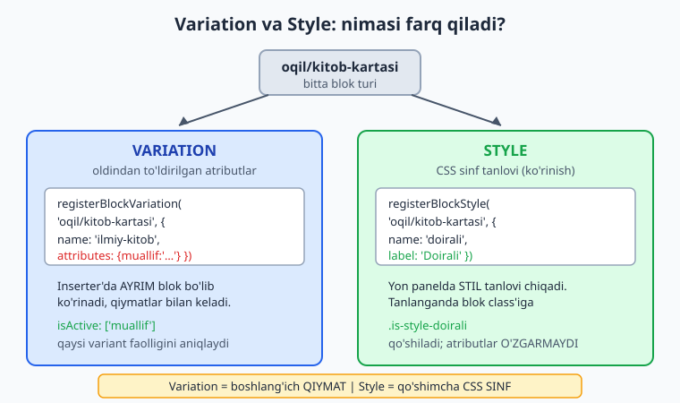
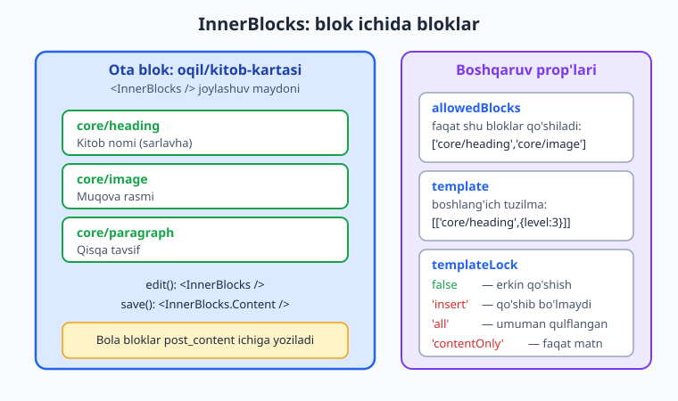
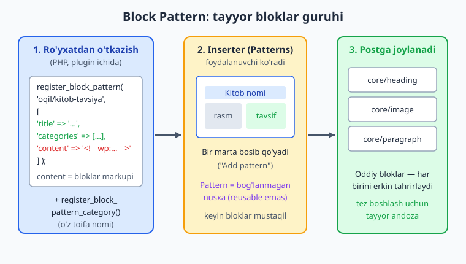

# 22 — Blok variations, styles, InnerBlocks, patterns

[⬅️ Oldingi: 21 — Dynamic blok va PHP-only registratsiya](./21-dynamic-blok.md) · [🏠 README](./README.md) · [Keyingi: 23 — Sidebar plugin, SlotFill va @wordpress/data ➡️](./23-sidebar-slotfill-data.md)

> **Bu bobda:** bitta blokdan ko'p foyda olishni o'rganamiz — **block variations** (`registerBlockVariation`, `@wordpress/blocks`) bir blokni oldindan to'ldirilgan atributlar bilan "ilmiy kitob" kabi variantga aylantiradi va `isActive` qaysi variant faolligini aniqlaydi; **block styles** (`registerBlockStyle` JS yoki `register_block_style` PHP) blokka "doirali"/"soyali" kabi CSS sinf tanlovini qo'shadi (foydalanuvchi yon panelda tanlaydi); **InnerBlocks** (`<InnerBlocks>` edit'da, `<InnerBlocks.Content>` save'da) blok ichiga boshqa bloklarni joylaydi va `allowedBlocks`/`template`/`templateLock` bilan boshqariladi; **block patterns** (`register_block_pattern` + `register_block_pattern_category`) tayyor bloklar guruhini beradi (foydalanuvchi bir marta qo'shadi); hamda **core (yadro) bloklarni kengaytirish** — `blocks.registerBlockType` va `blocks.getSaveContent.extraProps` filtrlari bilan boshqalar yozgan blokga atribut/prop qo'shamiz. Natijada izchil namuna plugin'imiz `kitoblar-katalogi` ga kartochka variantlari, stillar, ichma-ich tuzilma va tayyor andoza qo'shamiz.

---

## Muammo: bitta blok, ko'p ehtiyoj

20-21-boblarda "Kitob kartasi" blokini yozdik. Lekin hayotda bir nechta ehtiyoj paydo bo'ladi:

- Blogger **ilmiy kitoblar** uchun har safar "Muallif" maydoniga "Ilmiy nashriyot" yozadi — har safar qo'lda. Buni **oldindan to'ldirilgan** variant qilib bersa-chi?
- Ba'zi kartalar **doirali burchakli**, ba'zilari **soyali** bo'lishi kerak — yangi blok yozmasdan, faqat ko'rinishni almashtirib.
- Kartani **qattiq markup** bilan emas, ichiga foydalanuvchi xohlagan sarlavha/rasm/matn bloklarini **erkin joylash** bilan qurish kerak.
- Marketing jamoasi har postda bir xil "kitob tavsiyasi" blokini qo'shadi — uni **bitta bosishda** tayyor guruh sifatida bersa-chi?
- Va nihoyat: yadro `core/quote` blokiga o'z stilimizni qo'shmoqchimiz — uni **qaytadan yozmasdan**.

Bu beshta ehtiyoj uchun beshta vosita bor. Hammasini **yangi blok yozmasdan** hal qilamiz — mavjud bloklarni *kengaytiramiz*. Bu bob — "blok ekotizimida fuqaro bo'lish" haqida.

📌 **Asosiy farq (eslab qoling):** **variation** = oldindan to'ldirilgan *atributlar* (qiymat); **style** = qo'shimcha *CSS sinf* (ko'rinish). Ular ko'pincha chalkashtiriladi, lekin tubdan boshqacha — variation blokning *ma'lumotini*, style esa *ko'rinishini* o'zgartiradi.

---

## Block Variations: oldindan sozlangan variant

**Variation** (variant) — bu bitta blokning, oldindan to'ldirilgan atributlar (va ixtiyoriy ichki bloklar) bilan keladigan "tayyor sozlamasi". Foydalanuvchi inserter'da uni alohida element sifatida ko'radi, bosadi — va blok shu qiymatlar bilan paydo bo'ladi. Yangi blok turi emas — **bir xil blok**, faqat boshqa boshlang'ich holatda.

`registerBlockVariation` `@wordpress/blocks` paketidan keladi:

```js
import { registerBlockVariation } from '@wordpress/blocks';
import { __ } from '@wordpress/i18n';

registerBlockVariation( 'oqil/kitob-kartasi', {
	name: 'ilmiy-kitob',
	title: __( 'Ilmiy kitob', 'kitoblar-katalogi' ),
	description: __( 'Ilmiy kitoblar uchun oldindan sozlangan karta.', 'kitoblar-katalogi' ),
	icon: 'welcome-learn-more',
	attributes: { muallif: 'Ilmiy nashriyot' },
	isActive: [ 'muallif' ],
} );
```

Variation obyektining kalitlari (Block Editor Handbook bilan tasdiqlangan):

- **`name`** — variantning yagona identifikatori (slug).
- **`title`** / **`description`** — inserter'da ko'rinadigan nom va izoh.
- **`icon`** — ixtiyoriy ikona (Dashicon nomi yoki SVG).
- **`attributes`** — variant tanlanganda blok oladigan **boshlang'ich atributlar** obyekti. Bu — variation'ning yuragi.
- **`innerBlocks`** — ixtiyoriy: variant uchun oldindan tayyor ichki bloklar (InnerBlocks bilan birga, pastda).
- **`scope`** — qayerda ko'rinishi: `[ 'inserter' ]` (blok qo'shish ro'yxatida), `[ 'block' ]` (mavjud blokni boshqa variantga almashtirish menyusida), `[ 'transform' ]` (o'zgartirish menyusida). Bo'sh qoldirsangiz hamma joyda.
- **`isDefault`** — `true` bo'lsa, bu variant blokning *sukutdagi* holati bo'ladi.
- **`isActive`** — pastda batafsil.



### `isActive`: qaysi variant faol?

Blok tanlanganda WordPress "bu qaysi variant?" deb so'raydi — toolbar/yon panelda to'g'ri nomni ko'rsatish uchun. **`isActive`** shu savolga javob beradi. Ikki shaklda bo'ladi:

1. **Atribut nomlari massivi** (tavsiya etiladi):
   ```js
   isActive: [ 'muallif' ]
   ```
   WordPress blokning `muallif` atributini variantning `attributes.muallif` bilan solishtiradi. Mos kelsa — variant faol. (WordPress 6.6+ da `'query.postType'` kabi ichma-ich yo'l ham ishlaydi.)

2. **Funksiya** (murakkab mantiq uchun):
   ```js
   isActive: ( blockAttributes, variationAttributes ) =>
       blockAttributes.muallif === variationAttributes.muallif,
   ```

📌 **Iloji boricha massiv shaklini ishlating.** U aniqroq va WordPress bir nechta variant orasidan "eng mos kelganini" tanlaydi. Funksiya esa faqat `true`/`false` qaytaradi — bir nechta variant bir vaqtda `true` desa chalkashlik bo'ladi.

⚠️ **`isActive` ni unutmang.** Usiz blok tanlanganda WordPress qaysi variant ekanini bilolmaydi va doim asosiy blok nomini ko'rsatadi (variant nomi yon panelda ko'rinmaydi). Bu — eng ko'p uchraydigan variation xatosi.

### Core blokga ham variation

Variation faqat o'z blokingiz uchun emas — **yadro bloklarga** ham qo'shasiz. Masalan `core/group` ga "Katalog banneri" varianti:

```js
registerBlockVariation( 'core/group', {
	name: 'kitkat-banner',
	title: __( 'Katalog banneri', 'kitoblar-katalogi' ),
	attributes: { className: 'kitkat-banner' },
	scope: [ 'inserter' ],
} );
```

Endi foydalanuvchi inserter'da "Katalog banneri" ni topadi — bu aslida `core/group`, lekin `kitkat-banner` class'i bilan keladi (siz CSS yozasiz).

💡 **Variation qachon, CPT yoki yangi blok qachon?** Agar markup va xulq bir xil bo'lib, faqat boshlang'ich qiymatlar farq qilsa — variation (eng arzon). Markup tubdan boshqacha bo'lsa — yangi blok.

---

## Block Styles: CSS sinf tanlovi

**Style** (stil) — blokning ko'rinishini almashtiruvchi nomli CSS sinf. Foydalanuvchi blokni tanlaydi, yon panelda "Styles" bo'limidan birini bosadi — WordPress blok root elementiga `.is-style-<nom>` class qo'shadi. Atributlar **o'zgarmaydi**, faqat ko'rinish. Stilni ikki joyda ro'yxatdan o'tkazasiz: JS yoki PHP.

### JS bilan: `registerBlockStyle`

```js
import { registerBlockStyle } from '@wordpress/blocks';
import { __ } from '@wordpress/i18n';

registerBlockStyle( 'oqil/kitob-kartasi', {
	name: 'doirali',
	label: __( 'Doirali', 'kitoblar-katalogi' ),
} );

registerBlockStyle( 'oqil/kitob-kartasi', {
	name: 'soyali',
	label: __( 'Soyali', 'kitoblar-katalogi' ),
	isDefault: true,
} );
```

- **`name`** — stil slug'i. Tanlanganda blokka `.is-style-doirali` class qo'shiladi.
- **`label`** — yon panelda ko'rinadigan nom.
- **`isDefault`** — `true` bo'lsa, hech narsa tanlanmaganda shu stil faol hisoblanadi.

So'ng CSS'ni yozasiz (`style.scss` yoki tema CSS):

```css
.wp-block-oqil-kitob-kartasi.is-style-doirali {
	border-radius: 16px;
	overflow: hidden;
}
.wp-block-oqil-kitob-kartasi.is-style-soyali {
	box-shadow: 0 4px 12px rgba( 0, 0, 0, 0.12 );
}
```

ℹ️ **Stilni o'chirish.** Yadro blokning keraksiz stilini olib tashlash uchun `unregisterBlockStyle( 'core/quote', 'large' )` ishlatiladi (`@wordpress/blocks`). Ammo uni `domReady` ichida chaqiring — blok hali ro'yxatdan o'tmagan bo'lsa xato beradi.

### PHP bilan: `register_block_style`

JS o'rniga (yoki bilan birga) PHP'da ro'yxatdan o'tkazsangiz, CSS'ni **inline** berishingiz mumkin — alohida fayl yoki enqueue shart emas:

```php
namespace Oqil\KitobKatalog;

add_action( 'init', __NAMESPACE__ . '\\register_kitkat_styles' );

function register_kitkat_styles(): void {
	register_block_style(
		'oqil/kitob-kartasi',
		[
			'name'         => 'doirali',
			'label'        => __( 'Doirali', 'kitoblar-katalogi' ),
			'inline_style' => '.is-style-doirali { border-radius: 16px; overflow: hidden; }',
		]
	);

	register_block_style(
		'oqil/kitob-kartasi',
		[
			'name'         => 'soyali',
			'label'        => __( 'Soyali', 'kitoblar-katalogi' ),
			'is_default'   => true,
			'inline_style' => '.is-style-soyali { box-shadow: 0 4px 12px rgba(0,0,0,.12); }',
		]
	);
}
```

`register_block_style( string $block_name, array $style_properties )` kalitlari (Code Reference bilan tasdiqlangan): **`name`** va **`label`** majburiy; qolganlaridan biri kerak — **`inline_style`** (xom CSS string), **`style_handle`** (ro'yxatdan o'tgan stylesheet handle) yoki **`style_data`** (massiv shaklidagi stil); **`is_default`** ixtiyoriy.

📌 **JS yoki PHP?** Inline CSS va frontend + admin'da bir xil ishlashi kerak bo'lsa — **PHP** (`inline_style`) soddaroq. Stil JS mantiqiga bog'liq bo'lsa yoki blok paketingiz JS-markaziy bo'lsa — JS. Ikkalasi bir blokda **birga** ishlamaydi (bir nom ikki marta ro'yxatdan o'tmasin) — bittasini tanlang.

### Core blokga PHP stil

`register_block_style` ham yadro bloklar uchun ishlaydi — `core/quote` ga "Kitob iqtibosi" stilini qo'shamiz:

```php
register_block_style(
	'core/quote',
	[
		'name'         => 'kitkat-iqtibos',
		'label'        => __( 'Kitob iqtibosi', 'kitoblar-katalogi' ),
		'inline_style' => '.is-style-kitkat-iqtibos { border-left: 4px solid #2563eb; padding-left: 16px; }',
	]
);
```

---

## InnerBlocks: blok ichida bloklar

Hozirgacha "Kitob kartasi" markupini biz qattiq yozdik (`RichText` sarlavha, `RichText` tavsif). Lekin foydalanuvchi kartaga **rasm**, **tugma**, yana bir **paragraf** qo'shmoqchi bo'lsa-chi? Har ehtimolni qo'lda yozish — cheksiz. Yechim: kartani **konteyner** qilib, ichiga foydalanuvchi xohlagan bloklarni joylashga ruxsat berish. Bu — **InnerBlocks**.

`InnerBlocks` `@wordpress/block-editor` dan keladi. Asosiy qoida 20-bobdagi `edit`/`save` juftligiga o'xshaydi:

- **`edit()` da `<InnerBlocks />`** — muharrirda ichki bloklar joylanadigan tahrirlanadigan maydon.
- **`save()` da `<InnerBlocks.Content />`** — ichki bloklarning saqlangan HTML'i shu yerga qo'yiladi.



### `edit.js` va `save.js`

```jsx
import { __ } from '@wordpress/i18n';
import { useBlockProps, InnerBlocks } from '@wordpress/block-editor';

const RUXSAT = [ 'core/heading', 'core/image', 'core/paragraph' ];

const ANDOZA = [
	[ 'core/heading', { level: 3, placeholder: __( 'Kitob nomi…', 'kitoblar-katalogi' ) } ],
	[ 'core/image', {} ],
	[ 'core/paragraph', { placeholder: __( 'Qisqa tavsif…', 'kitoblar-katalogi' ) } ],
];

export default function Edit() {
	const blockProps = useBlockProps( { className: 'kitkat-karta' } );
	return (
		<div { ...blockProps }>
			<InnerBlocks
				allowedBlocks={ RUXSAT }
				template={ ANDOZA }
				templateLock={ false }
			/>
		</div>
	);
}
```

```jsx
import { useBlockProps, InnerBlocks } from '@wordpress/block-editor';

export default function save() {
	const blockProps = useBlockProps.save( { className: 'kitkat-karta' } );
	return (
		<div { ...blockProps }>
			<InnerBlocks.Content />
		</div>
	);
}
```

### Boshqaruv prop'lari

`InnerBlocks` ning eng muhim prop'lari (component README bilan tasdiqlangan):

- **`allowedBlocks`** — ichkariga qo'shish mumkin bo'lgan bloklar ro'yxati (massiv) yoki `true` (hamma). Masalan `[ 'core/heading', 'core/image', 'core/paragraph' ]` — boshqa hech narsa qo'shilmaydi.
- **`template`** — blok birinchi qo'shilganda paydo bo'ladigan **boshlang'ich tuzilma**: `[ [ blokNomi, atributlar ], ... ]`. Har element bir bola blokni e'lon qiladi (ixtiyoriy o'z ichki bloklari bilan).
- **`templateLock`** — andozani o'zgartirish ruxsati:
  - **`false`** — erkin: qo'shish, o'chirish, surish mumkin (sukut).
  - **`'insert'`** — yangi blok **qo'shib bo'lmaydi** va o'chirib bo'lmaydi, lekin mavjudlarini surish/tahrirlash mumkin.
  - **`'all'`** — to'liq qulflangan: qo'shib, o'chirib, surib bo'lmaydi (faqat tahrir).
  - **`'contentOnly'`** — faqat matn/media kontenti tahrirlanadi; tuzilma o'zgarmaydi.
- **`orientation`** — `'horizontal'` yoki `'vertical'` (chizish/surish yo'nalishi).
- **`renderAppender`** — pastdagi "blok qo'shish" tugmasini moslash (yoki `false` — yashirish).

📌 **`allowedBlocks` + `template` + `templateLock` birga.** Masalan "kitob kartasi" da sarlavha + rasm + tavsif **doim shu tartibda** bo'lsin, lekin matn tahrirlanaversin: `template` bilan tuzilmani bering, `templateLock: 'contentOnly'` bilan qulflang. Foydalanuvchi blok qo'sha olmaydi, lekin matnni o'zgartiradi.

⚠️ **InnerBlocks li blok validation'i.** `save()` da `<InnerBlocks.Content />` ni unutmang — usiz ichki bloklar `post_content` ga yozilmaydi va keyingi yuklashda yo'qoladi. `useBlockProps.save()` ham root elementga shart (20-bobdagi qoida bu yerda ham amal qiladi).

ℹ️ **Dynamic blokda InnerBlocks.** 21-bobdagi dynamic (server-render) blokda ichki bloklarni `render.php` ichida `$content` o'zgaruvchisi orqali chiqarasiz (`echo $content;`) — `InnerBlocks.Content` o'rniga. Bunda `save` baribir `<InnerBlocks.Content />` qaytaradi (faqat ichki bloklar uchun), tashqi markup esa PHP'dan keladi.

---

## Block Patterns: tayyor bloklar guruhi

Variation bitta blokni sozlaydi. Lekin marketing jamoasi har postda **bir nechta blok** dan iborat bir xil tuzilmani qo'yadi: sarlavha + rasm + tavsif + tugma. Buni har safar qo'lda yig'ish zerikarli. **Pattern** (andoza) — tayyor bloklar guruhi: foydalanuvchi inserter'dan bir marta bosadi, hamma bloklar joylanadi, keyin har birini erkin tahrir qiladi.

⚠️ **Pattern ≠ reusable (sinxron) blok.** Pattern qo'yilgach, u **bog'lanmagan oddiy nusxa** — har postda mustaqil tahrirlanadi, manbasi o'zgarsa eskilari o'zgarmaydi. Reusable/sinxron blok esa bir manbaga bog'langan (bittasini o'zgartirsangiz hammasi o'zgaradi). Pattern — "boshlang'ich nuqta", reusable — "yagona haqiqat manbai".



### `register_block_pattern` (PHP)

```php
namespace Oqil\KitobKatalog;

add_action( 'init', __NAMESPACE__ . '\\register_kitkat_patterns' );

function register_kitkat_patterns(): void {
	register_block_pattern_category(
		'kitoblar-katalogi',
		[ 'label' => __( 'Kitoblar katalogi', 'kitoblar-katalogi' ) ]
	);

	register_block_pattern(
		'oqil/kitob-tavsiya',
		[
			'title'       => __( 'Kitob tavsiyasi', 'kitoblar-katalogi' ),
			'description' => __( 'Sarlavha, rasm va tavsifli tayyor kitob kartasi.', 'kitoblar-katalogi' ),
			'categories'  => [ 'kitoblar-katalogi' ],
			'keywords'    => [ 'kitob', 'tavsiya', 'karta' ],
			'content'     => '<!-- wp:oqil/kitob-kartasi {"muallif":"Oqil Imomnazarov"} -->'
				. '<div class="wp-block-oqil-kitob-kartasi kitkat-karta">'
				. '<!-- wp:heading {"level":3} --><h3>Kitob nomi</h3><!-- /wp:heading -->'
				. '<!-- wp:paragraph --><p>Qisqa tavsif.</p><!-- /wp:paragraph -->'
				. '</div>'
				. '<!-- /wp:oqil/kitob-kartasi -->',
		]
	);
}
```

`register_block_pattern( string $pattern_name, array $pattern_properties )` kalitlari (Code Reference bilan tasdiqlangan): **`title`** va **`content`** majburiy; **`description`**, **`categories`**, **`keywords`**, **`viewportWidth`** ixtiyoriy. Avval `register_block_pattern_category( $name, [ 'label' => ... ] )` bilan o'z toifangizni e'lon qiling, so'ng pattern'ni shu toifaga bog'lang.

📌 **`content` — blok markupining o'zi.** U inserter'da ko'rsatiladigan, postga joylanadigan **xom blok HTML'i** (`<!-- wp:... -->` izohlari bilan). Eng oson yo'l: muharrirda bloklarni yig'ib, "Code editor" rejimiga o'tib, markupni nusxalash va shu yerga qo'yish.

### `/patterns` papka: oddiyroq usul

WordPress 6.0+ da pattern'ni PHP yozmasdan ham ro'yxatdan o'tkazasiz: plugin ildizida **`/patterns`** papka yarating va har pattern uchun `.php` fayl qo'ying. Fayl boshida maxsus izoh-sarlavha (header) — qolgani esa blok markupi:

```php
<?php
/**
 * Title: Kitob tavsiyasi
 * Slug: oqil/kitob-tavsiya
 * Categories: kitoblar-katalogi
 * Keywords: kitob, tavsiya, karta
 * Description: Sarlavha, rasm va tavsifli tayyor kitob kartasi.
 */
?>
<!-- wp:heading {"level":3} --><h3>Kitob nomi</h3><!-- /wp:heading -->
<!-- wp:image --><figure class="wp-block-image"></figure><!-- /wp:image -->
<!-- wp:paragraph --><p>Qisqa tavsif.</p><!-- /wp:paragraph -->
```

WordPress `/patterns` papkasini **avtomatik skan qiladi** — `register_block_pattern` chaqirmaysiz. Bu — eng toza usul: dizayn (markup) PHP mantig'idan ajraydi. (Header dagi `Categories` toifasini baribir `register_block_pattern_category` bilan oldindan e'lon qilish kerak, agar o'z toifangiz bo'lsa.)

💡 **`block.json` `patterns` maydoni.** Blok bilan bog'liq pattern'lar uchun `block.json` da `"patterns"` massivini ham e'lon qilish mumkin — lekin alohida fayllar yoki PHP eng keng tarqalgan va moslashuvchan usul.

---

## Core (yadro) bloklarni filtr bilan kengaytirish

Oxirgi va eng kuchli vosita: boshqalar (yoki WordPress yadrosi) yozgan blokga **qaytadan yozmasdan** atribut yoki prop qo'shish. Buni **filtrlar** (`@wordpress/hooks`, `addFilter`) qiladi. Bu — server filtrlari emas, **muharrir (JS) filtrlari**.

### `blocks.registerBlockType`: atribut/supports qo'shish

Bu filtr har blok ro'yxatdan o'tayotganda uning sozlamalarini (`settings`) o'zgartirishga imkon beradi. Masalan **hamma paragraf** blokiga "kitob ID" atributini qo'shamiz:

```js
import { addFilter } from '@wordpress/hooks';

function kitkatParagrafAtribut( settings, name ) {
	if ( name !== 'core/paragraph' ) {
		return settings;        // boshqa bloklarga tegmaymiz
	}
	return {
		...settings,
		attributes: {
			...settings.attributes,
			kitobId: { type: 'number', default: 0 },
		},
	};
}

addFilter(
	'blocks.registerBlockType',
	'kitoblar-katalogi/paragraf-kitob-id',
	kitkatParagrafAtribut
);
```

- Filtr ikki argument oladi: **`settings`** (blok sozlamalari obyekti) va **`name`** (blok nomi).
- Doim **yangi obyekt qaytaring** (`...settings` bilan tarqatib) — asl obyektni mutatsiya qilmang.
- `addFilter` ning ikkinchi argumenti — **noyob namespace** (`plugin-slug/maqsad`). Bu — sizning filtringizni keyin olib tashlash/aniqlash uchun.

⚠️ **`supports` qo'shsangiz.** Yadro blokga yangi atribut/`supports` qo'shish — kuchli, lekin ehtiyot bo'ling: agar atribut markupga ta'sir qilsa (`save` chiqishini o'zgartirsa), eski postlarda validation buzilishi mumkin. Faqat metadata (markupga chiqmaydigan) atribut qo'shish xavfsiz.

### `blocks.getSaveContent.extraProps`: save root'iga prop

Bu filtr **hamma blok** ning `save` chiqishidagi root elementga qo'shimcha prop (masalan class) qo'shadi:

```js
import { addFilter } from '@wordpress/hooks';

function kitkatExtraProps( props, blockType, attributes ) {
	if ( blockType.name === 'oqil/kitob-kartasi' ) {
		return {
			...props,
			'data-kitkat': 'karta',
		};
	}
	return props;
}

addFilter(
	'blocks.getSaveContent.extraProps',
	'kitoblar-katalogi/extra-props',
	kitkatExtraProps
);
```

⚠️ **Bu filtr validation xavfi tug'diradi.** `extraProps` save markupini o'zgartirgani uchun, mavjud postlardagi blok endi yangi markupga mos kelmaydi — "block validation" xatosi (20-bob). Shuning uchun uni **yangi** bloklarga yoki o'z plugingiz bloklariga, ehtiyotkorlik bilan qo'llang; yadro bloklarda imkon qadar qochining.

📌 **Filtr nomlari (docs bilan tasdiqlangan):** `'blocks.registerBlockType'` (registratsiyada sozlamalarni filtrlash) va `'blocks.getSaveContent.extraProps'` (save root'iga prop). Ikkalasi ham `@wordpress/hooks` `addFilter` bilan. Bu filtrlarni o'z chiqaradigan skriptingizda (`editorScript`) ro'yxatdan o'tkazasiz.

---

## Hammasini birga: `index.js`

Izchil namuna plugin'imizning blok `index.js` siga style va variation registratsiyasini qo'shamiz (20-bobdagi `registerBlockType` bilan birga):

```js
import { registerBlockType, registerBlockStyle, registerBlockVariation } from '@wordpress/blocks';
import { __ } from '@wordpress/i18n';
import './style.scss';
import Edit from './edit';
import save from './save';
import metadata from './block.json';

registerBlockType( metadata.name, { edit: Edit, save } );

// Styles
registerBlockStyle( 'oqil/kitob-kartasi', { name: 'doirali', label: __( 'Doirali', 'kitoblar-katalogi' ) } );
registerBlockStyle( 'oqil/kitob-kartasi', { name: 'soyali', label: __( 'Soyali', 'kitoblar-katalogi' ), isDefault: true } );

// Variation
registerBlockVariation( 'oqil/kitob-kartasi', {
	name: 'ilmiy-kitob',
	title: __( 'Ilmiy kitob', 'kitoblar-katalogi' ),
	icon: 'welcome-learn-more',
	attributes: { muallif: 'Ilmiy nashriyot' },
	isActive: [ 'muallif' ],
} );
```

ℹ️ **O'z saytingizda sinab ko'ring.** Bu `index.js` (InnerBlocks li `edit.js`/`save.js` bilan) `@wordpress/create-block` scaffold'iga joylanib, `npm run build` bilan **haqiqatan qurildi** — webpack `compiled successfully` qaytardi va `index.asset.php` da `wp-blocks`, `wp-block-editor`, `wp-components`, `wp-i18n` bog'liqliklari paydo bo'ldi (importlar to'g'riligining tasdig'i). Ammo variantning inserter'da ko'rinishi, stilni yon panelda tanlash, InnerBlocks ga blok joylash, pattern'ni qo'shish — **ishlab turgan WordPress saytini** talab qiladi (02-bobdagi `wp-env`). Plugin'ni aktivatsiya qiling, postga "Kitob kartasi" qo'shing, yon paneldan stil/variantni sinang.

---

## Xulosa

- **Variation** (`registerBlockVariation`, `@wordpress/blocks`): bitta blokning oldindan to'ldirilgan **atributlar** bilan keladigan varianti. Kalitlar: `name`, `title`, `icon`, `attributes`, `scope`, `isDefault`, **`isActive`** (qaysi variant faolligini aniqlaydi — massiv yoki funksiya). Yadro blokga ham qo'shiladi.
- **Style** (`registerBlockStyle` JS yoki `register_block_style` PHP): blokka `.is-style-<nom>` **CSS sinf** tanlovini qo'shadi (atributlar o'zgarmaydi). PHP'da `inline_style` bilan CSS shu yerda. `is_default`/`isDefault` sukut stilni belgilaydi.
- **InnerBlocks** (`@wordpress/block-editor`): `<InnerBlocks>` edit'da, `<InnerBlocks.Content>` save'da. `allowedBlocks` (ruxsat), `template` (boshlang'ich tuzilma), `templateLock` (`false`/`'insert'`/`'all'`/`'contentOnly'`).
- **Pattern** (`register_block_pattern` + `register_block_pattern_category`, yoki `/patterns` papka): tayyor bloklar guruhi, bir marta qo'shiladi, keyin oddiy bloklar. Reusable/sinxron blokdan farqli — bog'lanmagan nusxa.
- **Core bloklarni kengaytirish** (filtrlar, `@wordpress/hooks`): `blocks.registerBlockType` (atribut/supports qo'shish) va `blocks.getSaveContent.extraProps` (save root'iga prop — validation xavfi bilan).

Keyingi bobda muharrirning o'zini kengaytirishga o'tamiz: sidebar plugin, **SlotFill** mexanizmi va `@wordpress/data` do'koni bilan blokdan tashqaridagi UI quramiz.

---

## 22-bob mashqlari

> Mashqlar `kitoblar-katalogi` plugini ustida ishlaydi (blok `oqil/kitob-kartasi`, namespace `Oqil\KitobKatalog`, text domain `kitoblar-katalogi`). JS kodini `@wordpress/create-block` scaffold'iga joylab `npm run build` bilan tekshiring; PHP'ni `php -l` bilan; ko'rinishni o'z `wp-env` saytingizda sinang.

### Oson

1. **(Oson)** **Variation** va **style** farqini bir jumlada ayting: qaysi biri atributlarni, qaysi biri ko'rinishni (CSS sinf) o'zgartiradi?
2. **(Oson)** `registerBlockVariation` va `registerBlockStyle` qaysi paketdan import qilinadi?
3. **(Oson)** InnerBlocks da `edit()` qaysi komponentni, `save()` qaysisini ishlatadi (`<InnerBlocks>` va `<InnerBlocks.Content>`)?
4. **(Oson)** `register_block_style` ning ikkita majburiy kaliti qaysi? Inline CSS qaysi kalit orqali beriladi?
5. **(Oson)** Pattern va reusable (sinxron) blokning asosiy farqi nima — pattern qo'yilgach bloklar bir-biriga bog'liqmi?
6. **(Oson)** `isActive` nima uchun kerak? Uni qoldirsangiz nima yo'qoladi?

### O'rta

7. **(O'rta)** `oqil/kitob-kartasi` ga "Badiiy kitob" varianti qo'shing: `muallif` "Badiiy nashriyot", `isActive` to'g'ri sozlangan.

<details markdown="1"><summary>Yechim</summary>

```js
import { registerBlockVariation } from '@wordpress/blocks';
import { __ } from '@wordpress/i18n';

registerBlockVariation( 'oqil/kitob-kartasi', {
	name: 'badiiy-kitob',
	title: __( 'Badiiy kitob', 'kitoblar-katalogi' ),
	attributes: { muallif: 'Badiiy nashriyot' },
	isActive: [ 'muallif' ],
} );
```

`isActive: [ 'muallif' ]` blokning `muallif` atributini variant `attributes.muallif` bilan solishtiradi — mos kelsa yon panelda "Badiiy kitob" ko'rinadi.
</details>

8. **(O'rta)** `oqil/kitob-kartasi` ga "Soyali" stilini PHP'da `inline_style` bilan ro'yxatdan o'tkazing va uni sukut qiling.

<details markdown="1"><summary>Yechim</summary>

```php
namespace Oqil\KitobKatalog;

add_action( 'init', static function (): void {
	register_block_style(
		'oqil/kitob-kartasi',
		[
			'name'         => 'soyali',
			'label'        => __( 'Soyali', 'kitoblar-katalogi' ),
			'is_default'   => true,
			'inline_style' => '.is-style-soyali { box-shadow: 0 4px 12px rgba(0,0,0,.12); }',
		]
	);
} );
```

`is_default => true` hech narsa tanlanmaganda shu stilni faol qiladi; `inline_style` CSS'ni shu yerda beradi (alohida fayl shart emas). `php -l` dan o'tadi.
</details>

9. **(O'rta)** InnerBlocks li blokda foydalanuvchi faqat `core/heading` va `core/paragraph` qo'shsin, boshqa bloklar man qilinsin. Qaysi prop'ni qanday sozlaysiz?

<details markdown="1"><summary>Yechim</summary>

```jsx
<InnerBlocks
	allowedBlocks={ [ 'core/heading', 'core/paragraph' ] }
/>
```

`allowedBlocks` massivi inserter'da faqat shu ikki blokni ko'rsatadi. `true` bersangiz — hamma bloklar; massiv bersangiz — faqat ro'yxatdagilar.
</details>

10. **(O'rta)** Kartada sarlavha + rasm + tavsif **doim shu tartibda** turishi, lekin matn tahrirlanaversin — bloklar qo'shilmasin/o'chmasin. `template` va `templateLock` ni qanday sozlaysiz?

<details markdown="1"><summary>Yechim</summary>

```jsx
const ANDOZA = [
	[ 'core/heading', { level: 3 } ],
	[ 'core/image', {} ],
	[ 'core/paragraph', {} ],
];

<InnerBlocks
	template={ ANDOZA }
	templateLock="contentOnly"
/>
```

`template` boshlang'ich tuzilmani beradi; `templateLock="contentOnly"` faqat matn/media tahririga ruxsat beradi — tuzilma (bloklar tartibi, soni) qulflanadi. `'all'` bo'lsa hatto matn ham qulflanardi.
</details>

11. **(O'rta)** Quyidagi `save` xato beradi (ichki bloklar yo'qoladi). Sababini toping va to'g'rilang:
```jsx
export default function save() {
	return <div className="kitkat-karta"><InnerBlocks /></div>;
}
```

<details markdown="1"><summary>Yechim</summary>

Ikki xato:

1. `save()` da `<InnerBlocks />` emas, **`<InnerBlocks.Content />`** bo'lishi kerak — aks holda ichki bloklar markupi `post_content` ga yozilmaydi.
2. `useBlockProps.save()` ishlatilmagan — root elementga majburiy.

To'g'risi:

```jsx
import { useBlockProps, InnerBlocks } from '@wordpress/block-editor';

export default function save() {
	const blockProps = useBlockProps.save( { className: 'kitkat-karta' } );
	return (
		<div { ...blockProps }>
			<InnerBlocks.Content />
		</div>
	);
}
```
</details>

12. **(O'rta)** `unregisterBlockStyle` bilan `core/quote` blokining "large" stilini olib tashlang. Nega `domReady` ichida chaqirish kerak?

<details markdown="1"><summary>Yechim</summary>

```js
import { unregisterBlockStyle } from '@wordpress/blocks';
import domReady from '@wordpress/dom-ready';

domReady( () => {
	unregisterBlockStyle( 'core/quote', 'large' );
} );
```

`unregisterBlockStyle` blok va stil allaqachon ro'yxatdan o'tgan bo'lishini talab qiladi. `domReady` (`@wordpress/dom-ready`) yadro bloklar ro'yxatdan o'tib bo'lgach ishga tushadi — aks holda "stil topilmadi" xatosi bo'lishi mumkin.
</details>

### Qiyin

13. **(Qiyin)** To'liq InnerBlocks li "Kitob kartasi" blokini yozing: `edit` (`allowedBlocks` = heading/image/paragraph, `template` shu tartibda, `templateLock: false`) va `save` (`InnerBlocks.Content` bilan), `useBlockProps` to'g'ri. `npm run build` bilan tekshiriladigan darajada to'liq.

<details markdown="1"><summary>Yechim</summary>

`edit.js`:

```jsx
import { __ } from '@wordpress/i18n';
import { useBlockProps, InnerBlocks } from '@wordpress/block-editor';

const RUXSAT = [ 'core/heading', 'core/image', 'core/paragraph' ];
const ANDOZA = [
	[ 'core/heading', { level: 3, placeholder: __( 'Kitob nomi…', 'kitoblar-katalogi' ) } ],
	[ 'core/image', {} ],
	[ 'core/paragraph', { placeholder: __( 'Qisqa tavsif…', 'kitoblar-katalogi' ) } ],
];

export default function Edit() {
	const blockProps = useBlockProps( { className: 'kitkat-karta' } );
	return (
		<div { ...blockProps }>
			<InnerBlocks allowedBlocks={ RUXSAT } template={ ANDOZA } templateLock={ false } />
		</div>
	);
}
```

`save.js`:

```jsx
import { useBlockProps, InnerBlocks } from '@wordpress/block-editor';

export default function save() {
	const blockProps = useBlockProps.save( { className: 'kitkat-karta' } );
	return (
		<div { ...blockProps }>
			<InnerBlocks.Content />
		</div>
	);
}
```

`edit` da `<InnerBlocks>`, `save` da `<InnerBlocks.Content>`; ikkalasida `useBlockProps` root'ga. Bu aniq tuzilma `@wordpress/create-block` scaffold'ida `npm run build` bilan muvaffaqiyatli quriladi.
</details>

14. **(Qiyin)** "Kitob tavsiyasi" pattern'ini ikki usulda ro'yxatdan o'tkazing: (a) `register_block_pattern` PHP bilan; (b) `/patterns/kitob-tavsiya.php` fayli bilan. Ikkala usulning afzalligini ayting.

<details markdown="1"><summary>Yechim</summary>

(a) PHP:

```php
add_action( 'init', static function (): void {
	register_block_pattern_category( 'kitoblar-katalogi', [ 'label' => __( 'Kitoblar katalogi', 'kitoblar-katalogi' ) ] );
	register_block_pattern( 'oqil/kitob-tavsiya', [
		'title'      => __( 'Kitob tavsiyasi', 'kitoblar-katalogi' ),
		'categories' => [ 'kitoblar-katalogi' ],
		'content'    => '<!-- wp:heading {"level":3} --><h3>Kitob nomi</h3><!-- /wp:heading -->'
			. '<!-- wp:paragraph --><p>Qisqa tavsif.</p><!-- /wp:paragraph -->',
	] );
} );
```

(b) `/patterns/kitob-tavsiya.php`:

```php
<?php
/**
 * Title: Kitob tavsiyasi
 * Slug: oqil/kitob-tavsiya
 * Categories: kitoblar-katalogi
 */
?>
<!-- wp:heading {"level":3} --><h3>Kitob nomi</h3><!-- /wp:heading -->
<!-- wp:paragraph --><p>Qisqa tavsif.</p><!-- /wp:paragraph -->
```

**Afzalliklar:** (a) PHP — shartli (masalan faqat ma'lum sharoitda ro'yxatdan o'tkazish) mantiq kerak bo'lsa moslashuvchan. (b) `/patterns` papka — WordPress avtomatik skan qiladi, dizayn (markup) PHP mantig'idan ajraydi, eng toza va o'qiladigan. Ko'p hollarda (b) afzal. (Toifa baribir oldindan `register_block_pattern_category` bilan e'lon qilinadi.)
</details>

15. **(Qiyin)** `blocks.registerBlockType` filtri bilan **hamma `core/image`** blokga `manba` (`type: 'string'`, default `''`) atributini qo'shing. Filtr to'g'ri yozilganmi, tekshirib bering: boshqa bloklarga tegmasligi, yangi obyekt qaytarishi, noyob namespace.

<details markdown="1"><summary>Yechim</summary>

```js
import { addFilter } from '@wordpress/hooks';

function kitkatRasmManba( settings, name ) {
	if ( name !== 'core/image' ) {
		return settings;
	}
	return {
		...settings,
		attributes: {
			...settings.attributes,
			manba: { type: 'string', default: '' },
		},
	};
}

addFilter(
	'blocks.registerBlockType',
	'kitoblar-katalogi/rasm-manba',
	kitkatRasmManba
);
```

- `if ( name !== 'core/image' )` — boshqa bloklarga tegmaymiz (filtr **hamma** blokda ishlaydi).
- `{ ...settings, attributes: { ...settings.attributes, ... } }` — asl obyekt mutatsiya qilinmaydi, yangi obyekt qaytadi.
- Namespace `'kitoblar-katalogi/rasm-manba'` — noyob, plugin-slug bilan.

⚠️ Bu atribut markupga chiqmasa (faqat metadata) xavfsiz; `save` ga ta'sir qilsa eski postlar validation buzilishi mumkin.
</details>

16. **(Qiyin)** `blocks.getSaveContent.extraProps` filtri nima qiladi, qaysi argumentlarni oladi va nima uchun **validation xavfi** tug'diradi? Qachon ishlatish xavfsiz?

<details markdown="1"><summary>Yechim</summary>

- **Nima qiladi:** hamma blok (`save` da WP Element qaytaradigan) ning **root** elementiga qo'shimcha prop (class, `data-*`, id) qo'shadi.
- **Argumentlar:** `props` (joriy root prop'lari), `blockType` (blok turi obyekti), `attributes` (blok atributlari). Yangi prop obyekti qaytariladi.
- **Validation xavfi:** filtr `save` chiqishini (markupni) o'zgartiradi. Mavjud postlardagi saqlangan HTML eski (prop'siz) markup bilan yozilgan — yangi `save` (prop bilan) unga mos kelmaydi → "block validation" xatosi (20-bob).
- **Qachon xavfsiz:** yangi loyihada, o'z bloklaringizda, boshidan qo'llanganda (eski kontent yo'q). Yadro bloklarda mavjud kontent ustida ishlatishdan qochish kerak.

Misol:

```js
import { addFilter } from '@wordpress/hooks';

addFilter(
	'blocks.getSaveContent.extraProps',
	'kitoblar-katalogi/extra-props',
	( props, blockType ) =>
		blockType.name === 'oqil/kitob-kartasi'
			? { ...props, 'data-kitkat': 'karta' }
			: props
);
```
</details>

17. **(Qiyin)** `isActive` ning massiv shakli (`[ 'muallif' ]`) va funksiya shakli o'rtasidagi farqni tushuntiring. Nega massiv shakli tavsiya etiladi? Bir nechta variant bo'lganda qaysi biri to'g'ri tanlanadi?

<details markdown="1"><summary>Yechim</summary>

- **Massiv shakli** (`isActive: [ 'muallif' ]`): WordPress blokning sanab o'tilgan atributlarini har variantning `attributes` dagi mos qiymatlari bilan solishtiradi. Bir nechta variant bo'lsa, **eng ko'p atribut mos kelganini** ("eng aniq" mosligini) tanlaydi — to'g'ri natija.
- **Funksiya shakli** (`( blockAttributes, variationAttributes ) => boolean`): faqat `true`/`false` qaytaradi. Murakkab mantiq (masalan diapazon, hisoblangan qiymat) uchun kerak, lekin agar bir nechta variantning funksiyasi bir vaqtda `true` desa — WordPress qaysini tanlashini bilolmaydi (birinchi mos kelgani), chalkashlik bo'ladi.

**Nega massiv afzal:** aniqroq (eng yaxshi moslikni tanlaydi), tezroq (funksiya chaqirilmaydi) va deklarativ. WordPress 6.6+ da `'query.postType'` kabi ichma-ich yo'llarni ham qo'llaydi. Funksiyani faqat massiv ifodalay olmaydigan mantiq uchun saqlang.
</details>

---

[⬅️ Oldingi: 21 — Dynamic blok va PHP-only registratsiya](./21-dynamic-blok.md) · [🏠 README](./README.md) · [Keyingi: 23 — Sidebar plugin, SlotFill va @wordpress/data ➡️](./23-sidebar-slotfill-data.md)
