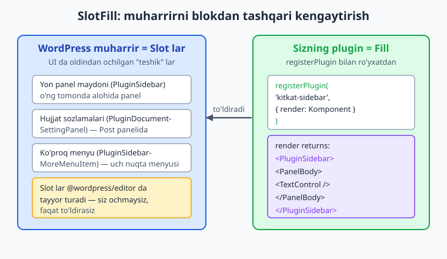
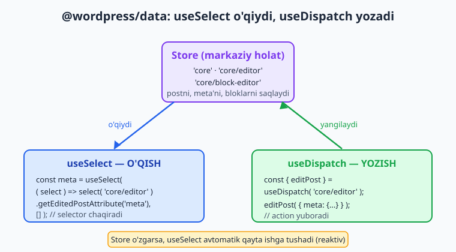
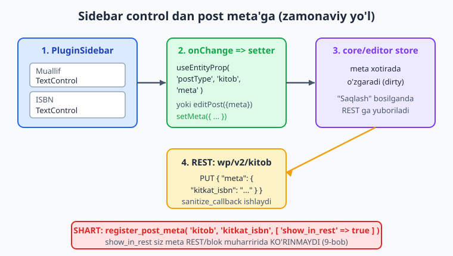

# 23 — Sidebar plugin, SlotFill va @wordpress/data

[⬅️ Oldingi: 22 — Blok variations, styles, InnerBlocks, patterns](./22-blok-kengaytmalar.md) · [🏠 README](./README.md) · [Keyingi: 24 — i18n va lokalizatsiya ➡️](./24-i18n-lokalizatsiya.md)

> **Bu bobda:** muharrirni *blokdan tashqari* kengaytirishni o'rganamiz — `registerPlugin()` (@wordpress/plugins) bilan butun muharrir UI ga o'z panelimizni qo'shamiz; SlotFill mexanizmini (WordPress UI da tayyor turgan "Slot" larni plugin "Fill" bilan to'ldiradi) va uning amaliy komponentlarini — `PluginSidebar`, `PluginSidebarMoreMenuItem`, `PluginDocumentSettingPanel` (@wordpress/editor) — ishlatamiz; `@wordpress/data` ning Redux-uslubidagi store'ini chuqur o'rganamiz: `useSelect` bilan o'qish (`getEditedPostAttribute`), `useDispatch` bilan yozish (`editPost`), asosiy store'lar `core`, `core/editor`, `core/block-editor`; va nihoyat post meta'ni `useEntityProp('postType', 'kitob', 'meta')` orqali sidebar control'ga bog'lab, eski meta box o'rniga zamonaviy React-asosli yon panel quramiz (meta `register_post_meta` da `show_in_rest => true` bo'lishi shartligini 9-bobdan eslab).

---

## Muammo: blok yetmaydi, butun muharrirga kerak

19-22 boblarda biz bloklar qurdik — kontent ichiga joylashtiriladigan "qadoq" lar. Lekin ba'zi narsalar blok emas. Tasavvur qiling: `kitob` postini tahrirlayotganda muallif va ISBN ni kiritish kerak. Bu ma'lumot kontent *ichida* emas — u postning **meta**'si (9-bobda meta box bilan qilganmiz). Klassik yo'l — `add_meta_box` bilan post tagida eski uslubdagi quti chizish. Lekin blok muharririda bu quti ko'rimsiz, pastda yashiringan, React holatidan ajralgan.

Zamonaviy yechim: muharrirning **o'ng yon paneliga** o'z bo'limimizni qo'shish. Foydalanuvchi yulduzcha (yoki pin) belgisini bosadi — yonda chiroyli panel ochiladi: "Muallif", "ISBN" maydonlari, hammasi React bilan, postning qolgan holati bilan jonli bog'langan.

Buni qanday qilamiz? Blok emas — blok faqat kontent ichida yashaydi. Bizga muharrir UI'ning **o'zini** kengaytiruvchi mexanizm kerak. U **SlotFill** deyiladi.

📌 **Blok vs muharrir kengaytmasi.** Blok — `registerBlockType`, kontent ichida. Muharrir kengaytmasi — `registerPlugin`, butun muharrir UI'sida (yon panel, hujjat sozlamalari, toolbar). Ikkalasi bir plugin ichida birga yashashi mumkin.



---

## SlotFill: WordPress UI'dagi "teshik"lar

SlotFill — React'ning bir komponent boshqasining ichiga "uzoqdan" render qilish patterni. WordPress muharriri UI'ning ma'lum joylarida **Slot** (uya) ochib qo'ygan: o'ng yon panel, hujjat sozlamalari paneli, "ko'proq" menyusi va h.k. Sizning plugin'ingiz **Fill** (to'ldiruvchi) beradi — WordPress uni o'sha Slot'ga olib borib qo'yadi.

O'xshatish: WordPress muharriri — devorida tayyor rozetkalar (Slot) bo'lgan uy. Siz simni (Fill) rozetkaga ulaysiz — toki shu rozetka qayerda turganini bilishingiz shart emas, faqat ulaysiz. WordPress sizning UI'ngizni to'g'ri joyga olib boradi.

Eng muhimi: siz Slot'larni **ochmaysiz** — ular `@wordpress/editor` paketida tayyor. Siz faqat tegishli Fill komponentini render qilasiz:

| Fill komponenti | Qayerga tushadi | Paket |
|---|---|---|
| `PluginSidebar` | Mustaqil o'ng yon panel (o'z belgisi bilan) | `@wordpress/editor` |
| `PluginSidebarMoreMenuItem` | Yuqori-o'ng "uch nuqta" menyusidagi element | `@wordpress/editor` |
| `PluginDocumentSettingPanel` | Post (Document) panelidagi yangi bo'lim | `@wordpress/editor` |
| `PluginPostStatusInfo` | "Holat va ko'rinish" qutisidagi qator | `@wordpress/editor` |
| `PluginBlockSettingsMenuItem` | Blokning kontekst menyusi | `@wordpress/editor` |

ℹ️ **Paket eslatmasi.** Avval bu komponentlar `@wordpress/edit-post` da edi. Zamonaviy WordPress'da (sayt muharriri bilan birlashtirilgandan keyin) ular **`@wordpress/editor`** dan import qilinadi — bu Post muharririda ham, Sayt muharririda ham ishlaydi. Yangi kod uchun `@wordpress/editor` ni ishlating.

⚠️ **`@wordpress/edit-post` eskirmoqda.** Eski qo'llanmalarda `import { PluginSidebar } from '@wordpress/edit-post'` ko'rasiz. U hali ishlaydi, lekin yangi kodda `@wordpress/editor` afzal — chunki Post va Sayt muharrirlari uchun yagona.

---

## `registerPlugin`: muharrirga ulanish nuqtasi

Blok `registerBlockType` bilan ro'yxatdan o'tgani kabi, muharrir kengaytmasi **`registerPlugin`** bilan ro'yxatdan o'tadi. Imzosi:

```js
import { registerPlugin } from '@wordpress/plugins';

registerPlugin( 'kitkat-sidebar', {
	render: KitkatSidebar,  // komponent — Fill'larni qaytaradi
	icon: pencil,           // ixtiyoriy
} );
```

- **birinchi argument** — noyob nom (string). Barcha ro'yxatdan o'tgan plugin'lar orasida takrorlanmasin. Prefiks bilan: `kitkat-...`.
- **`render`** — React komponent. Muharrir yuklanganda WordPress shuni render qiladi. U **Fill** komponentlarini qaytaradi (`PluginSidebar` va h.k.).
- **`icon`** — ixtiyoriy, plugin'ning umumiy belgisi.
- **`scope`** — ixtiyoriy, plugin'ni faqat ma'lum "plugin maydoni"da ko'rsatish uchun (ilg'or holatlar).

📌 **`render` qiymat *qaytaradi*, ekranga to'g'ridan chizmaydi.** U Fragment ichida bir nechta Fill bo'lishi mumkin — har biri o'z Slot'iga boradi. Komponentning o'zi hech narsa "ko'rinmaydi"; ko'rinadigan narsa — Fill'lar ichidagi UI.

💡 **`pencil` qayerdan?** `@wordpress/icons` paketidan: `import { pencil } from '@wordpress/icons'`. Bu yerda haqiqiy eksport nomini ishlating — masalan `pencil`, `postList`, `book` emas (`book` bu paketda **yo'q**; build ogohlantirish beradi). Dashicon slug (masalan `'smiley'`) ni string sifatida ham berish mumkin.

---

## @wordpress/data: Redux muharrirning ichida

Endi eng muhim qism: panel ma'lumotni **qayerdan** oladi va **qayerga** yozadi? Javob — `@wordpress/data`, WordPress muharririning markaziy holat (state) boshqaruvi. U Redux pattern'iga asoslangan: bitta katta **store** (ombor) bor, undan **selector**'lar bilan o'qiysiz va **action**'lar bilan yozasiz.

Muharrirda bir nechta nomli store bor:

| Store nomi | Nima saqlaydi |
|---|---|
| `core` | WordPress ma'lumotlari: postlar, foydalanuvchilar, taksonomiyalar (REST orqali) |
| `core/editor` | **Hozir tahrirlanayotgan** post: sarlavha, kontent, meta, status |
| `core/block-editor` | Kanvasdagi bloklar: tanlangan blok, blok ro'yxati |
| `core/notices` | Muharrirdagi xabarnomalar (toast) |



### `useSelect`: store'dan o'qish

`useSelect` — React hook. Unga **selector funksiyasi** berasiz; u store'dan kerakli qismni oladi. Store o'zgarsa, hook **avtomatik** qayta ishga tushadi (reaktivlik) — komponent yangilanadi.

```js
import { useSelect } from '@wordpress/data';
import { store as editorStore } from '@wordpress/editor';

const meta = useSelect(
	( select ) => select( editorStore ).getEditedPostAttribute( 'meta' ),
	[]
);
```

- `select( editorStore )` — `core/editor` store'ining selector'larini beradi.
- `getEditedPostAttribute( 'meta' )` — postning bir atributini qaytaradi, **saqlanmagan tahrirni** afzal ko'rib (ya'ni foydalanuvchi hozir kiritgan, lekin hali "Saqlash" bosilmagan qiymatni). `'title'`, `'content'`, `'status'` ham shu yo'l bilan o'qiladi.
- ikkinchi argument `[]` — bog'liqlik massivi (`useMemo` kabi). Bu yerda doimiy bo'lgani uchun bo'sh.

💡 **String store nomi ham ishlaydi:** `select( 'core/editor' )`. Lekin import qilingan `store` obyektini ishlatish (`editorStore`) ko'proq tavsiya etiladi — IDE topadi, xato kamayadi.

### `useDispatch`: store'ga yozish

`useDispatch` — store'ning **action**'larini beradi. Action chaqirilganda store o'zgaradi.

```js
import { useDispatch } from '@wordpress/data';
import { store as editorStore } from '@wordpress/editor';

const { editPost } = useDispatch( editorStore );

// Meta'ni yangilash:
editPost( { meta: { kitkat_isbn: '978-0-13-468599-1' } } );
```

- `editPost( edits )` — post atributlarini "tahrirlangan" deb belgilaydi. Bu **saqlamaydi** — faqat saqlanmagan o'zgarish (dirty state) qiladi. Foydalanuvchi "Saqlash"/"Yangilash" bosganda WordPress hammani birga REST orqali yuboradi.
- `editPost` har doim mavjud o'zgarishlarni **ustiga qo'shadi** (merge emas, atribut darajasida almashtiradi) — shuning uchun `meta` ni butunlay yangilaganda eski meta kalitlarni ham qo'shib yuboring: `editPost( { meta: { ...eskiMeta, kitkat_isbn: yangi } } )`.

⚠️ **`editPost` saqlamaydi.** U faqat muharrir holatini o'zgartiradi. Saqlash — `savePost` action'i (yoki foydalanuvchi tugmasi) ishi. Sidebar control odatda `editPost`/`setMeta` ishlatadi; saqlashni WordPress'ning o'ziga qoldiradi.

---

## Post meta'ni panelga bog'lash

Endi hammasini birlashtiramiz. Maqsad: `kitob` postining `kitkat_muallif` va `kitkat_isbn` meta'sini yon paneldan tahrirlash. Ikki yo'l bor — ikkalasi ham to'g'ri:

1. **`getEditedPostAttribute('meta')` + `editPost({ meta })`** — past darajali, aniq nazorat.
2. **`useEntityProp('postType', 'kitob', 'meta')`** — yuqori darajali, qulay getter/setter. Ichida aynan shu store ishlaydi, lekin kamroq kod.

### Birinchi shart: meta REST'da ko'rinishi kerak

📌 Sidebar control meta'ni REST orqali o'qiydi/yozadi. Shuning uchun meta **`register_post_meta`** da `show_in_rest => true` bilan ro'yxatdan o'tgan bo'lishi **shart** (9-bobda ko'rganmiz). Aks holda `getEditedPostAttribute('meta')` ham, `useEntityProp` ham bu kalitni **ko'rmaydi**.

```php
namespace Oqil\KitobKatalog;

add_action( 'init', __NAMESPACE__ . '\\register_kitob_sidebar_meta' );

function register_kitob_sidebar_meta(): void {
	register_post_meta(
		'kitob',
		'kitkat_muallif',
		[
			'show_in_rest'      => true,                 // REST + blok muharririga ochiq
			'single'            => true,
			'type'              => 'string',
			'default'           => '',
			'sanitize_callback' => 'sanitize_text_field',
			'auth_callback'     => static fn(): bool => current_user_can( 'edit_posts' ),
		]
	);

	register_post_meta(
		'kitob',
		'kitkat_isbn',
		[
			'show_in_rest'      => true,
			'single'            => true,
			'type'              => 'string',
			'default'           => '',
			'sanitize_callback' => static function ( string $xom ): string {
				// ISBN: faqat raqam, X va tire qoldiramiz
				return preg_replace( '/[^0-9Xx-]/', '', $xom );
			},
			'auth_callback'     => static fn(): bool => current_user_can( 'edit_posts' ),
		]
	);
}
```

ℹ️ **Bu yerda `_` siz kalit ishlatdik** (`kitkat_muallif`, `kitkat_isbn`). 9-bobdagi `_kitob_muallif` kabi `_` bilan boshlangan "himoyalangan" kalit REST'da `auth_callback` talab qiladi va `useEntityProp`/blok muharriri bilan ishlash murakkabroq. Sidebar uchun `_` siz, prefiksli kalit (`kitkat_`) afzal. `auth_callback` baribir foydali — kim yangilashini cheklaymiz.

### Ikkinchi shart: skriptni faqat muharrirga ulash

```php
namespace Oqil\KitobKatalog;

add_action( 'init', __NAMESPACE__ . '\\register_sidebar_asset' );

function register_sidebar_asset(): void {
	$asset_file = plugin_dir_path( __FILE__ ) . 'build/index.asset.php';

	if ( ! file_exists( $asset_file ) ) {
		return;
	}

	$asset = require $asset_file;  // @wordpress/scripts yozgan: dependencies + version

	wp_register_script(
		'kitkat-sidebar',
		plugins_url( 'build/index.js', __FILE__ ),
		$asset['dependencies'],  // wp-editor, wp-data, wp-core-data, wp-components...
		$asset['version'],
		true
	);

	wp_set_script_translations( 'kitkat-sidebar', 'kitoblar-katalogi' );
}

add_action( 'enqueue_block_editor_assets', __NAMESPACE__ . '\\enqueue_sidebar_in_editor' );

function enqueue_sidebar_in_editor(): void {
	wp_enqueue_script( 'kitkat-sidebar' );  // FAQAT blok muharririda
}
```

📌 **`enqueue_block_editor_assets`** — skriptni *faqat* blok muharririda yuklaydigan hook (14-bobdagi `wp_enqueue_scripts` frontend uchun edi). Sidebar plugin frontendda kerak emas. `$asset['dependencies']` ichida `@wordpress/scripts` aniqlagan `wp-editor`, `wp-data`, `wp-core-data`, `wp-components`, `wp-plugins`, `wp-i18n` bor — biz ularni qo'lda yozmaymiz.



---

## To'liq JS: sidebar panel komponenti

Endi `src/kitkat-sidebar/index.js`. Bu kod `@wordpress/create-block` scaffold'i ichida `npm run build` (`@wordpress/scripts`) bilan **haqiqatan qurildi** — webpack `wp-editor`/`wp-data`/`wp-core-data`/`wp-components`/`wp-plugins` ni externals sifatida hal qildi va xatosiz kompilyatsiya qildi.

```jsx
import { registerPlugin } from '@wordpress/plugins';
import {
	PluginSidebar,
	PluginSidebarMoreMenuItem,
	PluginDocumentSettingPanel,
	store as editorStore,
} from '@wordpress/editor';
import { useSelect, useDispatch } from '@wordpress/data';
import { useEntityProp } from '@wordpress/core-data';
import { TextControl, PanelBody } from '@wordpress/components';
import { __ } from '@wordpress/i18n';
import { pencil } from '@wordpress/icons';

// Meta'ni tahrirlovchi ichki komponent (ikki Slot'da qayta ishlatamiz)
const KitobMaydonlari = () => {
	// O'QISH: joriy post turi + saqlanmagan meta (core/editor store'dan)
	const postType = useSelect(
		( select ) => select( editorStore ).getCurrentPostType(),
		[]
	);

	// useEntityProp — meta uchun qulay getter/setter (ichida shu store)
	const [ meta, setMeta ] = useEntityProp( 'postType', postType, 'meta' );

	// Faqat 'kitob' postida ko'rsatamiz
	if ( postType !== 'kitob' ) {
		return null;
	}

	return (
		<>
			<TextControl
				label={ __( 'Muallif', 'kitoblar-katalogi' ) }
				value={ meta?.kitkat_muallif ?? '' }
				onChange={ ( qiymat ) =>
					setMeta( { ...meta, kitkat_muallif: qiymat } )
				}
			/>
			<TextControl
				label={ __( 'ISBN', 'kitoblar-katalogi' ) }
				value={ meta?.kitkat_isbn ?? '' }
				onChange={ ( qiymat ) =>
					setMeta( { ...meta, kitkat_isbn: qiymat } )
				}
			/>
		</>
	);
};

// registerPlugin uchun asosiy komponent — Fill'larni qaytaradi
const KitkatSidebar = () => (
	<>
		<PluginSidebarMoreMenuItem target="kitkat-sidebar" icon={ pencil }>
			{ __( 'Kitob maydonlari', 'kitoblar-katalogi' ) }
		</PluginSidebarMoreMenuItem>

		<PluginSidebar
			name="kitkat-sidebar"
			title={ __( 'Kitob maydonlari', 'kitoblar-katalogi' ) }
			icon={ pencil }
		>
			<PanelBody title={ __( 'Asosiy', 'kitoblar-katalogi' ) }>
				<KitobMaydonlari />
			</PanelBody>
		</PluginSidebar>

		{/* Post panelida ham tezkor kirish bo'limi */}
		<PluginDocumentSettingPanel
			name="kitkat-hujjat-panel"
			title={ __( 'Kitob (tezkor)', 'kitoblar-katalogi' ) }
			className="kitkat-hujjat-panel"
		>
			<KitobMaydonlari />
		</PluginDocumentSettingPanel>
	</>
);

registerPlugin( 'kitkat-sidebar', { render: KitkatSidebar, icon: pencil } );
```

Asosiy nuqtalar:

- **`KitobMaydonlari`** — UI mantig'i bir joyda. Uni ikki Slot'da (`PluginSidebar` va `PluginDocumentSettingPanel`) ishlatdik — DRY.
- **`useEntityProp('postType', postType, 'meta')`** — `[meta, setMeta]` qaytaradi. `setMeta` ichida `editPost({ meta })` ni chaqiradi, lekin biz uchun soddalashtirilgan.
- **`meta?.kitkat_isbn ?? ''`** — meta hali yuklanmagan bo'lsa (`undefined`), bo'sh string. Controlled input uchun `value` hech qachon `undefined` bo'lmasligi kerak.
- **`postType !== 'kitob'`** — panel faqat kitob postida ma'noli. Boshqa post turida `null` qaytaramiz (Slot'ga hech narsa tushmaydi).

💡 **`PluginSidebarMoreMenuItem`** ning `target` propi `PluginSidebar` ning `name` i bilan **bir xil** bo'lishi kerak (`"kitkat-sidebar"`) — menyu elementi bosilganda aynan shu sidebar ochiladi.

⚠️ **`null` qaytarish vs panelni butunlay ro'yxatdan o'tkazmaslik.** Yuqorida panel har doim ro'yxatdan o'tadi, faqat `kitob` da kontent ko'rsatadi. Agar boshqa post turlarida menyuda nom ham ko'rinmasin desangiz, `registerPlugin` ni shartli chaqiring yoki butun komponentdan `null` qaytaring. Soddalik uchun ichki tekshiruv yetarli.

---

## getEditedPostAttribute + editPost: past darajali muqobil

`useEntityProp` qulay, lekin nima sodir bo'layotganini ko'rish uchun bevosita store bilan ham yozish foydali. Quyidagi `KitobMaydonlari` ning aynan o'sha xulqi, lekin `useSelect`/`useDispatch` bilan:

```jsx
import { useSelect, useDispatch } from '@wordpress/data';
import { store as editorStore } from '@wordpress/editor';
import { TextControl } from '@wordpress/components';
import { __ } from '@wordpress/i18n';

const KitobMaydonlariPast = () => {
	// O'QISH: post turi va meta birgalikda
	const { postType, meta } = useSelect( ( select ) => {
		const ed = select( editorStore );
		return {
			postType: ed.getCurrentPostType(),
			meta: ed.getEditedPostAttribute( 'meta' ),
		};
	}, [] );

	// YOZISH: editPost action
	const { editPost } = useDispatch( editorStore );

	const yangilaMeta = ( kalit, qiymat ) =>
		editPost( { meta: { ...meta, [ kalit ]: qiymat } } );

	if ( postType !== 'kitob' ) {
		return null;
	}

	return (
		<TextControl
			label={ __( 'ISBN', 'kitoblar-katalogi' ) }
			value={ meta?.kitkat_isbn ?? '' }
			onChange={ ( v ) => yangilaMeta( 'kitkat_isbn', v ) }
		/>
	);
};
```

📌 **Taqqoslash.** `useEntityProp` — kamroq kod, REST entity'ni o'zi biladi. `getEditedPostAttribute` + `editPost` — ko'proq nazorat, bir nechta atributni birga o'qish oson (`title` + `meta` + `status`). Ikkalasi ham bir xil store'ga boradi — natija bir xil saqlanadi.

💡 **Ko'p tanlash.** `useSelect` ichida bir nechta selector chaqirib obyekt qaytarish odatiy: bitta hook, bir nechta qiymat. Bog'liqlik massivi (`[]`) selector ichida tashqi o'zgaruvchi ishlatsangiz kerak bo'ladi.

---

## "O'z saytingizda sinab ko'ring"

Quyidagilar jonli muharrirni talab qiladi — offline kod tekshiruvi ularni qoplay olmaydi, shuning uchun **o'z WordPress saytingizda** tekshiring (02-bobdagi `wp-env` yoki real sayt):

1. Plugin'ni faollashtiring, `kitob` postini oching.
2. Yuqori-o'ngdagi pin/yulduzcha (yoki uch nuqta menyusidan "Kitob maydonlari") ni bosing — yon panel ochiladi.
3. "Muallif" va "ISBN" ni kiriting. Muharrir "saqlanmagan o'zgarish" holatiga o'tishini ("Saqlash" tugmasi faollashishini) ko'rasiz.
4. "Yangilash" bosing — meta REST orqali saqlanadi. `wp/v2/kitob/<ID>?_fields=meta` REST so'rovi bilan tekshiring: `kitkat_isbn` JSON'da ko'rinadi.
5. `Document` (Post) panelida "Kitob (tezkor)" bo'limi ham paydo bo'ladi.

ℹ️ Panel ko'rinmasa, eng tez-tez sabab: meta'da `show_in_rest => true` yo'q, yoki skript `enqueue_block_editor_assets` da ulanmagan, yoki brauzer konsolida JS xatosi (build qilinmagan). Avval `build/index.js` mavjudligini va konsolni tekshiring.

---

## 23-bob mashqlari

> Eslatma: muharrir kengaytmasini har safar `npm run build` qilib, `enqueue_block_editor_assets` da ulang. Jonli ko'rinishni o'z saytingizda sinang.

1. **(Oson)** `registerPlugin` ning imzosini yozing va `render`, `icon`, `scope` propularining vazifasini bir-bir tushuntiring.

2. **(Oson)** SlotFill nima? "Slot" va "Fill" ni o'z so'zingiz bilan ta'riflang va `PluginSidebar` qaysisiga misol ekanini ayting.

3. **(Oson)** `useSelect` va `useDispatch` farqi nimada? Qaysi biri o'qiydi, qaysi biri yozadi?

4. **(Oson)** `core`, `core/editor`, `core/block-editor` store'lari nimani saqlaydi? Har biriga bittadan misol.

5. **(Oson)** Nega meta `register_post_meta` da `show_in_rest => true` bo'lmasa, sidebar paneli uni ko'rmaydi?

6. **(O'rta)** `kitob` postiga `kitkat_sahifa_soni` (integer) meta'sini `register_post_meta` bilan REST'ga oching, so'ng uni sidebar paneliga `useEntityProp` bilan `TextControl type="number"` qilib qo'shing.

<details markdown="1"><summary>Yechim</summary>

PHP (`register_post_meta`):

```php
register_post_meta( 'kitob', 'kitkat_sahifa_soni', [
	'show_in_rest'      => true,
	'single'            => true,
	'type'              => 'integer',
	'default'           => 0,
	'sanitize_callback' => 'absint',
	'auth_callback'     => static fn(): bool => current_user_can( 'edit_posts' ),
] );
```

JS (sidebar control):

```jsx
const [ meta, setMeta ] = useEntityProp( 'postType', postType, 'meta' );

<TextControl
	label={ __( 'Sahifa soni', 'kitoblar-katalogi' ) }
	type="number"
	value={ meta?.kitkat_sahifa_soni ?? 0 }
	onChange={ ( v ) =>
		setMeta( { ...meta, kitkat_sahifa_soni: parseInt( v, 10 ) || 0 } )
	}
/>
```

`type="integer"` REST'da bo'lgani uchun JS'da `parseInt` bilan songa aylantiramiz; `absint` PHP tomonda himoya beradi.
</details>

7. **(O'rta)** `PluginDocumentSettingPanel` va `PluginSidebar` farqini tushuntiring: qaysi joyda ko'rinadi, qachon qaysisini tanlaysiz?

<details markdown="1"><summary>Yechim</summary>

- **`PluginSidebar`** — mustaqil, o'z belgisi bo'lgan **alohida** yon panel (boshqa panellar bilan almashadi). Ko'p maydon yoki murakkab UI uchun joy ko'p. Foydalanuvchi belgini bosib ochadi.
- **`PluginDocumentSettingPanel`** — Post (Document) panelidagi **bir bo'lim** (kategoriyalar, teglar yonida). Kichik, post bilan bevosita bog'liq sozlama uchun (1-2 maydon). Har doim Document panelida ko'rinadi.

Tanlash: murakkab/katta UI -> `PluginSidebar`; postning tabiiy "xususiyati" bo'lgan kichik sozlama -> `PluginDocumentSettingPanel`. Ikkalasini birga ham ishlatish mumkin (bu bobda qildik).
</details>

8. **(O'rta)** `useSelect` ning ikkinchi argumenti (bog'liqlik massivi) nima uchun? Bo'sh `[]` qachon to'g'ri, qachon noto'g'ri?

<details markdown="1"><summary>Yechim</summary>

Bog'liqlik massivi `useMemo`/`useCallback` dagi kabi: selector funksiyasini **qachon qayta yaratish** kerakligini aytadi. Agar selector ichida faqat `select(...)` natijasiga tayansangiz (tashqi prop/holat yo'q), `[]` to'g'ri. Agar selector ichida komponent propi yoki state ishlatsangiz (masalan `select(...).getEntityRecord('postType','kitob', props.id)` — bu yerda `props.id`), uni massivga qo'shing: `[ props.id ]`. Aks holda eski qiymat "yopilib" qoladi (stale closure) va o'zgarishga reaksiya bermaydi.
</details>

9. **(O'rta)** `editPost({ meta: { kitkat_isbn: x } })` da nega eski meta'ni ham (`...meta`) qo'shish kerak? Qo'shmasangiz nima bo'ladi?

<details markdown="1"><summary>Yechim</summary>

`editPost` `meta` atributini berilgan obyekt bilan almashtiradi (atribut darajasida). Agar `{ meta: { kitkat_isbn: x } }` deb faqat bitta kalit bersangiz, o'sha tahrirda boshqa meta kalitlar (`kitkat_muallif`...) **tushib qolishi** mumkin — saqlanmagan tahrir holatida ular yo'qoladi. Shuning uchun `{ meta: { ...meta, kitkat_isbn: x } }` — eski kalitlarni saqlab, faqat birini o'zgartiramiz. `useEntityProp` ning `setMeta` i ham ko'pincha shu sababdan `setMeta( { ...meta, ... } )` chaqiriladi.
</details>

10. **(O'rta)** Skriptni nega `enqueue_block_editor_assets` da ulaymiz, `wp_enqueue_scripts` da emas? `index.asset.php` ning roli nima?

<details markdown="1"><summary>Yechim</summary>

`enqueue_block_editor_assets` skriptni **faqat blok muharririda** yuklaydi — sidebar plugin frontendda (sayt mehmoniga) kerak emas, `wp_enqueue_scripts` esa frontendga ulaydi. `index.asset.php` ni `@wordpress/scripts` (build) avtomatik yaratadi: ichida `dependencies` (masalan `wp-editor`, `wp-data`, `wp-core-data`, `wp-components`, `wp-plugins`, `wp-i18n`) va `version` (kesh-buster hash) bor. Uni `wp_register_script` ning 3- va 4-argumentiga uzatsak, WordPress kerakli `@wordpress/*` skriptlarni avtomatik birga yuklaydi — biz qo'lda sanab o'tirmaymiz.
</details>

11. **(O'rta)** `@wordpress/edit-post` va `@wordpress/editor` farqini ayting. Yangi kodda qaysi biridan `PluginSidebar` import qilinadi va nega?

<details markdown="1"><summary>Yechim</summary>

Tarixan SlotFill komponentlari (`PluginSidebar` va h.k.) `@wordpress/edit-post` da edi — u faqat **Post** muharririga tegishli edi. Sayt muharriri (Site Editor) paydo bo'lgach, ular `@wordpress/editor` ga ko'chirildi — bu paket Post va Sayt muharrirlari uchun **yagona**. Yangi kodda `@wordpress/editor` dan import qiling: shunda kengaytmangiz ikkala muharrirda ham ishlaydi. `@wordpress/edit-post` hali ishlaydi (orqaga moslik), lekin eskirayotgan yo'l.
</details>

12. **(O'rta)** `meta?.kitkat_isbn ?? ''` da `?.` va `??` nega kerak? Olib tashlasangiz qanday xato chiqishi mumkin?

<details markdown="1"><summary>Yechim</summary>

Post yuklanayotganda `meta` bir lahza `undefined` bo'lishi mumkin. `meta.kitkat_isbn` (optional chaining'siz) `undefined` ustida o'qishga urinib **TypeError** beradi. `meta?.kitkat_isbn` esa `meta` yo'q bo'lsa `undefined` qaytaradi. Keyin `?? ''` uni bo'sh stringga aylantiradi — chunki `<TextControl value={undefined}>` controlled-input'ni uncontrolled qilib React ogohlantirishini keltirib chiqaradi. Ya'ni `value` har doim aniq string bo'lishi kerak.
</details>

13. **(Qiyin)** To'liq ishlaydigan sidebar plugin'ining ikki qismini yozing: (a) `register_post_meta` + `enqueue_block_editor_assets` PHP, (b) `registerPlugin` + `PluginSidebar` + `useEntityProp` JS. `kitkat_muallif` (string) va `kitkat_yil` (integer) meta'lari bo'lsin, panel faqat `kitob` postida ko'rinsin.

<details markdown="1"><summary>Yechim</summary>

PHP:

```php
namespace Oqil\KitobKatalog;

add_action( 'init', __NAMESPACE__ . '\\register_kitob_panel_meta' );
function register_kitob_panel_meta(): void {
	register_post_meta( 'kitob', 'kitkat_muallif', [
		'show_in_rest'      => true,
		'single'            => true,
		'type'              => 'string',
		'default'           => '',
		'sanitize_callback' => 'sanitize_text_field',
		'auth_callback'     => static fn(): bool => current_user_can( 'edit_posts' ),
	] );
	register_post_meta( 'kitob', 'kitkat_yil', [
		'show_in_rest'      => true,
		'single'            => true,
		'type'              => 'integer',
		'default'           => 0,
		'sanitize_callback' => 'absint',
		'auth_callback'     => static fn(): bool => current_user_can( 'edit_posts' ),
	] );
}

add_action( 'enqueue_block_editor_assets', __NAMESPACE__ . '\\enqueue_kitob_panel' );
function enqueue_kitob_panel(): void {
	$asset = require plugin_dir_path( __FILE__ ) . 'build/index.asset.php';
	wp_enqueue_script(
		'kitkat-panel',
		plugins_url( 'build/index.js', __FILE__ ),
		$asset['dependencies'],
		$asset['version'],
		true
	);
}
```

JS (`src/index.js`):

```jsx
import { registerPlugin } from '@wordpress/plugins';
import { PluginSidebar } from '@wordpress/editor';
import { useSelect } from '@wordpress/data';
import { store as editorStore } from '@wordpress/editor';
import { useEntityProp } from '@wordpress/core-data';
import { PanelBody, TextControl } from '@wordpress/components';
import { __ } from '@wordpress/i18n';
import { pencil } from '@wordpress/icons';

const Panel = () => {
	const postType = useSelect(
		( s ) => s( editorStore ).getCurrentPostType(),
		[]
	);
	const [ meta, setMeta ] = useEntityProp( 'postType', postType, 'meta' );
	if ( postType !== 'kitob' ) {
		return null;
	}
	return (
		<PluginSidebar name="kitkat-panel" title={ __( 'Kitob', 'kitoblar-katalogi' ) } icon={ pencil }>
			<PanelBody>
				<TextControl
					label={ __( 'Muallif', 'kitoblar-katalogi' ) }
					value={ meta?.kitkat_muallif ?? '' }
					onChange={ ( v ) => setMeta( { ...meta, kitkat_muallif: v } ) }
				/>
				<TextControl
					label={ __( 'Yil', 'kitoblar-katalogi' ) }
					type="number"
					value={ meta?.kitkat_yil ?? 0 }
					onChange={ ( v ) => setMeta( { ...meta, kitkat_yil: parseInt( v, 10 ) || 0 } ) }
				/>
			</PanelBody>
		</PluginSidebar>
	);
};

registerPlugin( 'kitkat-panel', { render: Panel, icon: pencil } );
```

`npm run build` qilib, `build/` ni plugin papkasiga qo'ying. PHP `index.asset.php` ni o'qib bog'liqliklarni avtomatik ulaydi.
</details>

14. **(Qiyin)** Sidebar'da "Saqlangan post statusini" (`getEditedPostAttribute('status')`) o'qib ko'rsatadigan va uni `editPost({ status })` bilan "draft"/"publish" ga o'zgartiradigan `SelectControl` qo'shing. Faqat o'qish vs yozish oqimini izohlang.

<details markdown="1"><summary>Yechim</summary>

```jsx
import { useSelect, useDispatch } from '@wordpress/data';
import { store as editorStore } from '@wordpress/editor';
import { SelectControl } from '@wordpress/components';
import { __ } from '@wordpress/i18n';

const StatusControl = () => {
	// O'QISH
	const status = useSelect(
		( s ) => s( editorStore ).getEditedPostAttribute( 'status' ),
		[]
	);
	// YOZISH
	const { editPost } = useDispatch( editorStore );

	return (
		<SelectControl
			label={ __( 'Status', 'kitoblar-katalogi' ) }
			value={ status }
			options={ [
				{ label: 'Qoralama', value: 'draft' },
				{ label: 'Nashr', value: 'publish' },
			] }
			onChange={ ( yangi ) => editPost( { status: yangi } ) }
		/>
	);
};
```

Oqim: `useSelect` `status` ni store'dan o'qiydi (saqlanmagan tahrirni afzal ko'rib). `onChange` `editPost({ status })` yuboradi — bu **saqlamaydi**, faqat tahrir holatini o'zgartiradi. Foydalanuvchi "Yangilash" bosganda WordPress status'ni boshqa o'zgarishlar bilan birga saqlaydi.
</details>

15. **(Qiyin)** Bir nechta atributni bitta `useSelect` da o'qing (`title`, `status`, `meta`) va obyekt qaytaring. Nega bitta `useSelect` ko'p qiymat uchun afzal? Performance jihatdan tushuntiring.

<details markdown="1"><summary>Yechim</summary>

```jsx
const { title, status, meta } = useSelect( ( select ) => {
	const ed = select( editorStore );
	return {
		title: ed.getEditedPostAttribute( 'title' ),
		status: ed.getEditedPostAttribute( 'status' ),
		meta: ed.getEditedPostAttribute( 'meta' ),
	};
}, [] );
```

Bitta `useSelect` afzal, chunki: (1) bitta store-obuna — uchta alohida `useSelect` o'rniga bitta tinglovchi; (2) `useSelect` qaytgan obyektni sayoz (shallow) solishtiradi — qaytgan qiymatlardan hech biri o'zgarmasa, komponent **qayta render bo'lmaydi**. Uchta alohida hook esa har biri mustaqil obuna bo'lib, ko'proq tekshiruv qiladi. Diqqat: har render'da yangi obyekt qaytadi, lekin ichidagi qiymatlar bir xil bo'lsa `useSelect` ortiqcha render'ni oldini oladi.
</details>

16. **(Qiyin)** Plugin'ni `@wordpress/create-block` bilan scaffold qilib, sidebar `index.js` ni joylab `npm run build` ni o'zingiz ishga tushiring. `build/index.asset.php` ichidagi `dependencies` massivini oching va har bir element (`wp-editor`, `wp-data`...) qaysi import'dan kelganini ulang.

<details markdown="1"><summary>Yechim</summary>

```bash
npx @wordpress/create-block@latest kitkat-sidebar --namespace oqil
cd kitkat-sidebar
# src/kitkat-sidebar/index.js ni sidebar kodi bilan almashtiring
npm run build
cat build/kitkat-sidebar/index.asset.php
```

Natija (tartib o'zgarishi mumkin):

```php
<?php return array('dependencies' => array(
	'react-jsx-runtime', 'wp-components', 'wp-core-data',
	'wp-data', 'wp-editor', 'wp-i18n', 'wp-plugins', 'wp-primitives'
), 'version' => '...');
```

Bog'lanish:

- `wp-plugins` <- `import { registerPlugin } from '@wordpress/plugins'`
- `wp-editor` <- `import { PluginSidebar, store as editorStore } from '@wordpress/editor'`
- `wp-data` <- `import { useSelect, useDispatch } from '@wordpress/data'`
- `wp-core-data` <- `import { useEntityProp } from '@wordpress/core-data'`
- `wp-components` <- `import { TextControl, PanelBody } from '@wordpress/components'`
- `wp-i18n` <- `import { __ } from '@wordpress/i18n'`
- `wp-primitives` <- `@wordpress/icons` ichki ravishda ishlatadi (SVG primitivlar)
- `react-jsx-runtime` <- JSX kompilyatsiyasi (`@wordpress/scripts` qo'shadi)

`@wordpress/scripts` har `@wordpress/*` import'ni externals'ga aylantiradi (bundle ichiga kiritmaydi) va `index.asset.php` ga yozadi — WordPress shu ro'yxat asosida kerakli skriptlarni avval yuklaydi.
</details>

17. **(Qiyin)** `useEntityProp` o'rniga butunlay `getEntityRecord`/`saveEntityRecord` (`core` store) bilan post meta'ni o'qish/yozishning farqini tushuntiring. Sidebar control uchun nega `editPost`/`useEntityProp` afzalroq?

<details markdown="1"><summary>Yechim</summary>

- `getEntityRecord( 'postType', 'kitob', id )` (`core` store) — **saqlangan** yozuvni REST'dan oladi (saqlanmagan tahrirni bilmaydi). `saveEntityRecord` esa darhol REST'ga **yozadi** (saqlaydi).
- `getEditedPostAttribute`/`useEntityProp` (`core/editor` konteksti) — **joriy muharrir** holatini, saqlanmagan tahrirni ham hisobga oladi; `editPost`/`setMeta` esa muharrir holatini o'zgartiradi, saqlashni "Yangilash" tugmasiga qoldiradi.

Sidebar control uchun `editPost`/`useEntityProp` afzal: foydalanuvchi har harf yozganda darhol REST'ga yozmaymiz (`saveEntityRecord` har onChange'da og'ir va noto'g'ri UX). O'rniga muharrir holatini "iflos" qilamiz va WordPress'ning yagona "Saqlash" oqimiga qo'shilamiz — autosave, revizatsiya, validatsiya hammasi bepul keladi.
</details>

18. **(Qiyin)** `kitkat_isbn` meta'ga JS tomonda (kiritish payti) oddiy validatsiya qo'shing: faqat raqam, `X` va tire ruxsat etilsin; noto'g'ri belgi kiritilsa `Notice` ko'rsating (`core/notices` store, `createErrorNotice`). PHP `sanitize_callback` bilan JS validatsiya farqini izohlang.

<details markdown="1"><summary>Yechim</summary>

```jsx
import { useSelect, useDispatch } from '@wordpress/data';
import { store as editorStore } from '@wordpress/editor';
import { store as noticesStore } from '@wordpress/notices';
import { useEntityProp } from '@wordpress/core-data';
import { TextControl } from '@wordpress/components';
import { __ } from '@wordpress/i18n';

const IsbnControl = () => {
	const postType = useSelect(
		( s ) => s( editorStore ).getCurrentPostType(),
		[]
	);
	const [ meta, setMeta ] = useEntityProp( 'postType', postType, 'meta' );
	const { createErrorNotice } = useDispatch( noticesStore );

	const onChange = ( v ) => {
		if ( /[^0-9Xx-]/.test( v ) ) {
			createErrorNotice(
				__( 'ISBN faqat raqam, X va tire bo\'lishi mumkin', 'kitoblar-katalogi' ),
				{ type: 'snackbar', isDismissible: true }
			);
			return; // noto'g'ri belgini qabul qilmaymiz
		}
		setMeta( { ...meta, kitkat_isbn: v } );
	};

	if ( postType !== 'kitob' ) {
		return null;
	}
	return (
		<TextControl
			label={ __( 'ISBN', 'kitoblar-katalogi' ) }
			value={ meta?.kitkat_isbn ?? '' }
			onChange={ onChange }
		/>
	);
};
```

Farq: **JS validatsiya — UX** (foydalanuvchiga darhol bildirish, qulay), lekin uni chetlab o'tish mumkin (REST'ga to'g'ridan so'rov). **PHP `sanitize_callback` — xavfsizlik darvozasi**: REST/blok yo'lidan kelgan har qiymatni server tomonda tozalaydi va uni **hech kim chetlab o'tolmaydi**. Shuning uchun ikkalasi ham kerak: JS qulaylik uchun, PHP — ishonchli himoya uchun (12-bob: hech qachon faqat klient validatsiyasiga ishonma).
</details>

---

Endi muharrirni blokdan tashqari ham — yon panel, hujjat sozlamalari va `@wordpress/data` store orqali — kengaytirishni bilamiz. Bu bilan kitoblar katalogimiz zamonaviy, React-asosli tahrirlash tajribasiga ega bo'ldi. Keyingi bobda plugin'imizni ko'p tilli qilamiz: PHP va JS tomonda i18n, text domain, `wp i18n make-pot`.

[⬅️ Oldingi: 22 — Blok variations, styles, InnerBlocks, patterns](./22-blok-kengaytmalar.md) · [🏠 README](./README.md) · [Keyingi: 24 — i18n va lokalizatsiya ➡️](./24-i18n-lokalizatsiya.md)
