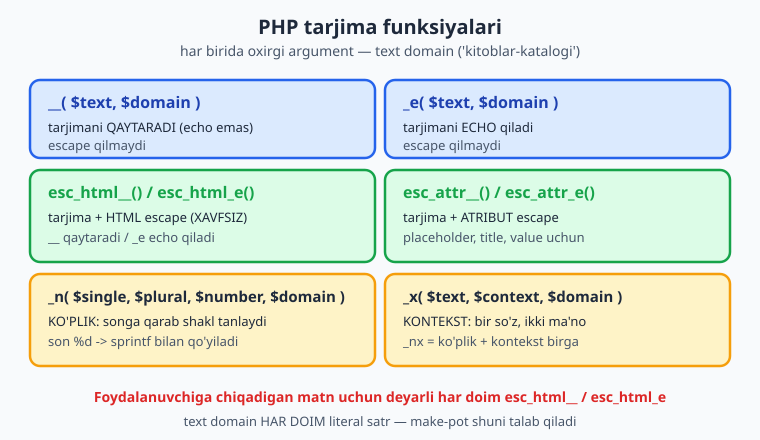
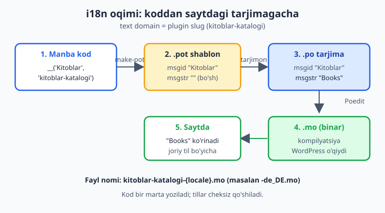
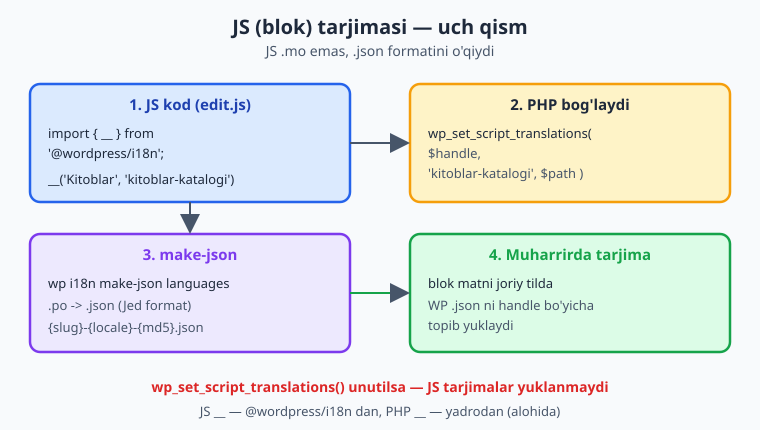

# 24 — i18n va lokalizatsiya

[⬅️ Oldingi: 23 — Sidebar plugin, SlotFill va @wordpress/data](./23-sidebar-slotfill-data.md) · [🏠 README](./README.md) · [Keyingi: 25 — Testlash: PHPUnit, wp-env, PHPCS/WPCS ➡️](./25-testlash.md)

> **Bu bobda:** plugin'ingizdagi har bir foydalanuvchi ko'radigan matnni tarjima qilinadigan qilishni — ya'ni i18n (internationalization) ni — o'rganamiz: nega "Books" yoki "Kitoblar" deb to'g'ridan-to'g'ri yozish noto'g'ri ekanini; **text domain** nima va nega u plugin slug bilan bir xil (`kitoblar-katalogi`) bo'lishini; PHP tarjima funksiyalarini (`__()` qaytaradi, `_e()` echo qiladi, `esc_html__()`/`esc_html_e()`/`esc_attr__()` tarjima **va** escape ni birga bajaradi, `_n()` ko'plikni, `_x()` kontekstni, `_nx()` ikkalasini) imzolari bilan; nega har bir chaqiruvda text domain **literal satr** bo'lishi shartligini (`make-pot` shuni talab qiladi); `load_plugin_textdomain()` qachon kerak, qachon kerak emasligini; tarjima fayllari zanjirini (`.pot` shablon → `.po` tarjima → `.mo` kompilyatsiya, `languages/` papkada) va `wp i18n make-pot` WP-CLI buyrug'ini; JS tomonda `@wordpress/i18n` ning `__()` ini, `wp_set_script_translations()` ni va `wp i18n make-json` orqali JSON tarjima fayllarini; "just-in-time" tarjima yuklashni va RTL haqida qisqacha — hammasi "Kitoblar katalogi" plugin'imizni o'zbek, ingliz yoki istalgan tilga tarjima qilinadigan qilib quradi.

---

## Muammo: plugin'ingiz faqat bitta tilni biladi

Tasavvur qiling, "Kitoblar katalogi" plugin'ingizni Germaniyadagi kutubxona ishlatmoqchi. Admin panelida ular shu matnlarni ko'radi:

```php
echo '<h2>Kitoblar</h2>';
echo '<button>Yangi kitob qoshish</button>';
echo '<p>Jami 5 ta kitob</p>';
```

Bu matnlar **kodga qotirilgan** (hardcoded). Nemis foydalanuvchi ularni hech qachon o'z tilida ko'ra olmaydi — buning uchun u sizning PHP faylingizni ochib, har bir satrni qo'lda tahrirlashi kerak. Plugin yangilansa, o'zgartirishlari yo'qoladi. Bu — boshi berk ko'cha.

Yechim — **i18n** (internationalization, "internationalization" so'zidagi i va n orasida 18 ta harf bor, shundan qisqartma). Bu — kodni shunday yozishki, undagi matnlar **tarjima qilinishi mumkin** bo'lsin, lekin kodning o'zi o'zgarmasin. Keyin **l10n** (localization, lokalizatsiya) — har bir tilga aniq tarjima berish — alohida fayllarda amalga oshiriladi. Kod bir marta yoziladi; tillar cheksiz qo'shiladi.

📌 **i18n va l10n farqi.** *i18n* — kodni tarjimaga **tayyorlash** (dasturchining ishi). *l10n* — aniq bir tilga **tarjima qilish** (tarjimonning ishi, kodga tegmasdan). Bu bobda asosan i18n bilan shug'ullanamiz — plugin'ni tarjima qilinadigan qilamiz.

Asosiy g'oya bitta jumla: foydalanuvchi ko'radigan **har bir matnni** maxsus funksiya ichiga o'rab qo'yamiz. Keyin WordPress ushbu matnni ishga tushish paytida joriy til tarjimasiga almashtiradi.

```php
// ❌ Yomon: kodga qotirilgan, hech qachon tarjima qilinmaydi.
echo '<h2>Kitoblar</h2>';

// ✅ Yaxshi: tarjima funksiyasi ichida, matn domeni bilan.
echo '<h2>' . esc_html__( 'Kitoblar', 'kitoblar-katalogi' ) . '</h2>';
```

> ℹ️ **Tayanch.** Bu bob PHP funksiyalari va satrlar bilan ishlaydi (siz buni [PHP kitobi](../php/README.md) dan bilasiz). Xavfsizlik (escape) tomoni 12-bobda chuqur ko'rilgan — bu yerda escape va tarjimani **birga** qiladigan funksiyalarni o'rganamiz.

---

## Text domain — plugin'ingizning tarjima "kaliti"

Har bir tarjima funksiyasining oxirgi argumenti — **text domain**. Bu — sizning plugin'ingiz matnlarini boshqa plugin va WordPress yadrosining matnlaridan ajratib turadigan yagona nom.

📌 **Text domain qoidasi: u plugin slug bilan AYNAN bir xil bo'lishi kerak.** Bizning plugin'imiz `kitoblar-katalogi`, demak text domain ham `kitoblar-katalogi`. Bu — WordPress.org standarti: tarjima tizimi `.mo` fayl nomini shu slug asosida topadi (`kitoblar-katalogi-de_DE.mo`).

Text domain'ni plugin header'ida ham e'lon qilasiz (3-bobdan eslang):

```php
<?php
/**
 * Plugin Name:       Kitoblar katalogi
 * Description:        Kitoblar katalogi: CPT, taksonomiya va bloklar.
 * Version:           1.0.0
 * Requires at least: 7.0
 * Requires PHP:      8.3
 * Text Domain:       kitoblar-katalogi
 * Domain Path:       /languages
 *
 * @package Oqil\KitobKatalog
 */
```

- **`Text Domain`** — plugin'ning matn domeni. Slug bilan bir xil.
- **`Domain Path`** — `.mo` fayllar joylashgan papka (plugin papkasiga nisbatan). Odatda `/languages`.

⚠️ **Text domain har doim LITERAL satr bo'lsin — o'zgaruvchi EMAS.** Bu eng tez-tez uchraydigan xato:

```php
// ❌ Yomon: domen o'zgaruvchida — make-pot uni TOPOLMAYDI.
$domen = 'kitoblar-katalogi';
echo __( 'Kitoblar', $domen );

// ❌ Yomon: konstanta ham yaramaydi.
echo __( 'Kitoblar', MENING_DOMENIM );

// ✅ Yaxshi: literal satr.
echo __( 'Kitoblar', 'kitoblar-katalogi' );
```

Sababi: tarjima shablonini generatsiya qiladigan asbob (`wp i18n make-pot`) kodni **statik** o'qiydi — u kodni **ishga tushirmaydi**, faqat matnini skanerlaydi. U `__( '...', 'kitoblar-katalogi' )` ko'rinishini qidiradi. Agar domen o'zgaruvchi bo'lsa, asbob uning qiymatini bilmaydi va o'sha matnni tarjima ro'yxatiga **qo'shmaydi**. Tarjima qilinadigan matn ham literal bo'lishi kerak (o'zgaruvchini tarjima qilib bo'lmaydi).

---

## PHP tarjima funksiyalari

Bu funksiyalar — i18n'ning yuragi. Hammasi `wp-includes/l10n.php` da yashaydi va WordPress ishga tushganda mavjud bo'ladi. Asosiy farq: ba'zilari matnni **qaytaradi**, ba'zilari darhol **echo** qiladi, ba'zilari tarjima ustiga **escape** ham qo'shadi.



### `__()` — tarjimani qaytaradi

Eng asosiy funksiya. Matnni tarjima qiladi va **qaytaradi** (echo qilmaydi).

```php
__( string $text, string $domain = 'default' ): string
```

```php
$sarlavha = __( 'Kitoblar', 'kitoblar-katalogi' );
// $sarlavha endi joriy til tarjimasini tutadi (yoki tarjima yo'q bo'lsa, asl matnni).
```

Qaytarilgan qiymatni o'zgaruvchiga solasiz, boshqa funksiyaga uzatasiz yoki birlashtirasiz. **Diqqat:** `__()` o'zi escape **qilmaydi** — agar natijani HTML'ga chiqarsangiz, escape qo'shing (pastga qarang).

### `_e()` — tarjimani echo qiladi

`__()` ning echo qiladigan varianti. Qaytarmaydi, darhol bosib chiqaradi.

```php
_e( string $text, string $domain = 'default' ): void
```

```php
// Bu ikkisi teng:
echo __( 'Saqlash', 'kitoblar-katalogi' );
_e( 'Saqlash', 'kitoblar-katalogi' );
```

⚠️ `_e()` ham escape qilmaydi. HTML kontekstida xavfsizroq variant — `esc_html_e()`.

### `esc_html__()`, `esc_html_e()`, `esc_attr__()` — tarjima + escape (xavfsizlik bilan)

Bular — eng ko'p ishlatadigan funksiyalaringiz. Ular tarjimani **va** kontekstga mos escape ni **bitta chaqiruvda** birlashtiradi. 12-bobdan eslang: foydalanuvchiga chiqadigan har matn escape qilinishi kerak. Tarjima ham foydalanuvchiga chiqadi, demak u ham escape qilinishi shart.

| Funksiya | Ekvivalenti | Qaytaradimi? | Qachon |
|---|---|---|---|
| `esc_html__()` | `esc_html( __() )` | Ha, qaytaradi | HTML matn (qaytarish kerak bo'lsa) |
| `esc_html_e()` | `echo esc_html( __() )` | Yo'q, echo qiladi | HTML matn (darhol chiqarish) |
| `esc_attr__()` | `esc_attr( __() )` | Ha, qaytaradi | HTML atribut qiymati |
| `esc_attr_e()` | `echo esc_attr( __() )` | Yo'q, echo qiladi | Atribut, darhol |

```php
// HTML matn ichida — esc_html_e (echo) yoki esc_html__ (qaytaradi):
echo '<h2>' . esc_html__( 'Kitoblar', 'kitoblar-katalogi' ) . '</h2>';
?>
<h2><?php esc_html_e( 'Kitoblar', 'kitoblar-katalogi' ); ?></h2>

<?php
// HTML atribut ichida — esc_attr__:
?>
<input type="text" placeholder="<?php echo esc_attr__( 'Kitob nomini kiriting', 'kitoblar-katalogi' ); ?>">
<button title="<?php esc_attr_e( 'Kitobni saqlash', 'kitoblar-katalogi' ); ?>">
    <?php esc_html_e( 'Saqlash', 'kitoblar-katalogi' ); ?>
</button>
```

📌 **Qoida.** Foydalanuvchiga chiqadigan tarjimalar uchun **deyarli har doim** `esc_html__`/`esc_html_e`/`esc_attr__` ishlating — sof `__`/`_e` ni faqat natija boshqa joyda qayta escape qilinadigan bo'lsa (masalan, `WP_Error` xabari yoki keyinroq escape qilinadigan o'zgaruvchi). Bu — xavfsizlik (12-bob) va i18n birga ishlaydigan joy.

### `_n()` — ko'plik (singular/plural)

Tillar sonni har xil ifodalaydi. Inglizchada "1 book" / "2 books"; o'zbekchada "1 ta kitob" / "5 ta kitob"; ba'zi tillarda esa uch yoki undan ko'p ko'plik shakli bor. `_n()` to'g'ri shaklni tanlaydi.

```php
_n( string $single, string $plural, int $number, string $domain = 'default' ): string
```

```php
$soni = 5;
$matn = sprintf(
    /* translators: %d — kitoblar soni */
    _n( '%d ta kitob', '%d ta kitob', $soni, 'kitoblar-katalogi' ),
    number_format_i18n( $soni )
);
echo esc_html( $matn );
// Ingliz tarjimasida: "5 books"; o'zbekchada: "5 ta kitob".
```

💡 **`_n()` faqat to'g'ri shaklni TANLAYDI — sonni o'ZI qo'ymaydi.** `%d` o'rniga sonni `sprintf()` bilan qo'yasiz. `number_format_i18n()` esa sonni joriy tilning raqam formatida ko'rsatadi.

⚠️ `_n()` echo qilmaydi va escape qilmaydi — natijani `sprintf` bilan formatlab, so'ng `esc_html()` bilan o'rab chiqaring.

### `_x()` — kontekst (bir so'z, ikki ma'no)

Ba'zan bitta so'z turli joyda turli ma'no beradi va turlicha tarjima qilinishi kerak. Inglizcha "Book" — ot (kitob) ham, fe'l (band qilmoq) ham bo'lishi mumkin. Tarjimon kontekstni bilmasa, xato qiladi. `_x()` tarjimonga **kontekst izohi** beradi.

```php
_x( string $text, string $context, string $domain = 'default' ): string
```

```php
// Ikkala holatda ham asl matn "Kitob", lekin kontekst boshqacha:
echo esc_html_x( 'Kitob', 'CPT nomi (ot)', 'kitoblar-katalogi' );
echo esc_html_x( 'Band qilish', 'tugma harakati (fel)', 'kitoblar-katalogi' );
```

Kontekst tarjima fayliga ham yoziladi, shuning uchun tarjimon ikkita "Kitob"ni ajrata oladi. `esc_html_x()` va `esc_attr_x()` — escape qiladigan variantlari.

### `_nx()` — ko'plik + kontekst birga

`_n()` va `_x()` ning birlashmasi: ko'plik shakli **va** kontekst.

```php
_nx( string $single, string $plural, int $number, string $context, string $domain = 'default' ): string
```

```php
$matn = sprintf(
    _nx( '%d ta janr', '%d ta janr', $soni, 'taksonomiya hisobi', 'kitoblar-katalogi' ),
    number_format_i18n( $soni )
);
```

📌 **Eslatma: `translators:` izohi.** `%d`, `%s` kabi placeholder'lar bo'lsa, funksiya **ustidagi** qatorga `/* translators: ... */` izohini yozing. `make-pot` bu izohni tarjima fayliga ko'chiradi — tarjimon har bir `%s` nimani anglatishini biladi. Bu — professional plugin belgisi.

---

## `load_plugin_textdomain()` — kerakmi yoki yo'qmi?

Klassik usulda plugin tarjimalarni yuklash uchun `init` hook'da shu funksiyani chaqirardi:

```php
load_plugin_textdomain( string $domain, string|false $deprecated = false, string|false $plugin_rel_path = false ): bool
```

```php
function kitkat_load_textdomain(): void {
    load_plugin_textdomain(
        'kitoblar-katalogi',                 // text domain (slug bilan bir xil)
        false,                               // eskirgan parametr — har doim false
        dirname( plugin_basename( __FILE__ ) ) . '/languages' // languages/ papka yo'li
    );
}
add_action( 'init', 'kitkat_load_textdomain' );
```

📌 **Lekin 2026-da ko'p hollarda bu KERAK EMAS.** WordPress 4.6 dan beri, agar plugin'ingiz **WordPress.org katalogida** bo'lsa, WordPress tarjimalarni translate.wordpress.org dan **avtomatik** topib yuklaydi — `load_plugin_textdomain()` ni o'zingiz chaqirishingiz shart emas. Bundan tashqari, WordPress 6.7 dan beri tarjimalar "**just-in-time**" (kerak bo'lganda) yuklanadi.

💡 **Qachon hali ham kerak?** Plugin'ingiz WordPress.org da **bo'lmasa** (masalan, premium yoki shaxsiy plugin) va `.mo` fayllaringizni o'z plugin papkangizda saqlasangiz — o'shanda `load_plugin_textdomain()` ni chaqirib, `languages/` papkani ko'rsatish kerak. Aks holda WordPress sizning `.mo` faylingizni qaerdan izlashini bilmaydi.

> ⚠️ **"Just-in-time" va `_load_textdomain_just_in_time` ogohlantirishi.** WordPress 6.7+ da tarjima funksiyasini (`__()` va h.k.) `init` hook'idan **oldin** chaqirsangiz, "notice" ogohlantirishi chiqadi. Sabab: tarjimalar `init` da yuklanadi. Yechim — tarjima funksiyalarini har doim `init` yoki undan keyingi hook'larda (masalan `admin_menu`, `wp_loaded`) chaqiring, plugin fayli tepasida "yalang'och" emas.

---

## Tarjima fayllari: `.pot` → `.po` → `.mo`

Tarjima jarayoni uch turdagi fayl orqali kechadi. Ularning nomlari chalkash, lekin mantiq sodda.



| Fayl | Nima | Kim yaratadi |
|---|---|---|
| **`.pot`** | **Shablon** (Portable Object Template). Plugin'dagi barcha tarjima qilinadigan matnlar ro'yxati, hali tarjimasiz. | Dasturchi (`wp i18n make-pot`) |
| **`.po`** | Bir **tilning tarjimasi** (Portable Object). `.pot` dan nusxa olib, har matn yoniga tarjima yoziladi. Inson o'qiy oladigan matn fayl. | Tarjimon (yoki Poedit, GlotPress) |
| **`.mo`** | **Kompilyatsiya** (Machine Object). `.po` ning binar, tez o'qiladigan varianti. WordPress aynan shuni o'qiydi. | `.po` dan generatsiya (Poedit avtomatik, yoki `wp i18n make-mo`) |

Fayl nomlari va joylashuvi:

```text
kitoblar-katalogi/
├── kitoblar-katalogi.php
└── languages/
    ├── kitoblar-katalogi.pot          ← shablon (barcha matnlar)
    ├── kitoblar-katalogi-de_DE.po     ← nemis tarjimasi (manba)
    ├── kitoblar-katalogi-de_DE.mo     ← nemis (kompilyatsiya, WP o'qiydi)
    ├── kitoblar-katalogi-uz_UZ.po     ← o'zbek tarjimasi
    └── kitoblar-katalogi-uz_UZ.mo
```

📌 **Fayl nomi formati: `{slug}-{locale}.mo`.** Masalan `kitoblar-katalogi-de_DE.mo`. WordPress joriy tilni (`de_DE`, `uz_UZ`) aniqlab, shu nomdagi `.mo` ni qidiradi. Til kodi noto'g'ri bo'lsa, tarjima ishlamaydi.

### `.pot` shablonini WP-CLI bilan generatsiya qilish

`.pot` faylini qo'lda yozmaysiz — **WP-CLI** uni kod ichidagi barcha tarjima funksiyalarini skanerlash orqali avtomatik tuzadi:

```bash
wp i18n make-pot . languages/kitoblar-katalogi.pot
```

- **`.`** — manba papka (plugin ildizi).
- **`languages/kitoblar-katalogi.pot`** — natija fayli.

Bu buyruq plugin'ingizdagi har bir PHP va JS faylni o'qiydi, `__()`, `_e()`, `esc_html__()`, `_n()`, `_x()` va boshqa funksiyalarning **literal** argumentlarini topadi va ularni `.pot` ga yozadi. Mana shu yerda "text domain literal bo'lsin" qoidasi ahamiyatga ega bo'ladi — `make-pot` faqat literal matnlarni topa oladi.

Hosil bo'lgan `.pot` faylning bir bo'lagi shunday ko'rinadi (illustrativ):

```text
#: includes/admin.php:42
msgid "Kitoblar"
msgstr ""

#: includes/admin.php:55
#, translators: %d — kitoblar soni
msgid "%d ta kitob"
msgid_plural "%d ta kitob"
msgstr[0] ""
msgstr[1] ""
```

`msgid` — asl matn, `msgstr` — tarjima (shablonda bo'sh). Tarjimon `.po` da `msgstr` larni to'ldiradi:

```text
#: includes/admin.php:42
msgid "Kitoblar"
msgstr "Books"
```

💡 **Poedit** — eng mashhur grafik tarjima dasturi. U `.pot` ni ochib, tarjimani qulay interfeysda yozish va saqlashda avtomatik `.mo` ni generatsiya qilishni ta'minlaydi. Tarjimonlaringizga `.pot` faylini bering — qolganini Poedit qiladi.

> ℹ️ **Jonli sinov (o'z saytingizda).** Tarjima haqiqatda ko'rinishini ko'rish uchun ishlab turgan WordPress kerak: `wp-admin → Settings → General → Site Language` ni o'zgartiring (yoki `wp-config.php` da `WPLANG`), to'g'ri nomli `.mo` faylni `languages/` ga qo'ying va admin sahifangizni yangilang. `.pot`/`.mo` generatsiyasini esa lokal'da WP-CLI bilan sinab ko'rasiz.

---

## JS tarjimasi: bloklar va admin skriptlar

Blok muharriri (19-23 boblar) JavaScript'da ishlaydi, demak blokdagi matnlar ham tarjima qilinishi kerak. JS tomonda `@wordpress/i18n` paketi xuddi PHP'dagidek `__()`, `_n()`, `_x()` beradi.



### 1-qadam: JS kodida `@wordpress/i18n`

```js
import { __, _n, sprintf } from '@wordpress/i18n';

// Blok title yoki edit.js ichida:
const sarlavha = __( 'Kitoblar ro\'yxati', 'kitoblar-katalogi' );

const soni = 5;
const hisob = sprintf(
    /* translators: %d — kitoblar soni */
    _n( '%d ta kitob', '%d ta kitob', soni, 'kitoblar-katalogi' ),
    soni
);
```

📌 Bu yerdagi `__()` — PHP'niki **emas**, `@wordpress/i18n` paketidan import qilingan JS funksiyasi. Argumentlari bir xil: matn va text domain. Text domain bu yerda ham plugin slug — `kitoblar-katalogi`.

### 2-qadam: PHP'da `wp_set_script_translations()`

JS faylingiz tarjima fayllarini qaerdan olishini WordPress'ga aytishingiz kerak. Buni PHP'da, skriptni enqueue qilgandan keyin qilasiz:

```php
wp_set_script_translations( string $handle, string $domain = 'default', string $path = '' ): bool
```

```php
function kitkat_enqueue_blok_skript(): void {
    $handle = 'kitkat-blok-editor';
    wp_enqueue_script(
        $handle,
        plugins_url( 'build/index.js', __FILE__ ),
        array( 'wp-blocks', 'wp-element', 'wp-i18n' ),
        '1.0.0',
        true
    );

    // JS tarjimalarini shu handle'ga bog'laydi.
    wp_set_script_translations(
        $handle,                                  // skript handle
        'kitoblar-katalogi',                      // text domain (slug)
        plugin_dir_path( __FILE__ ) . 'languages' // JSON fayllar papkasi
    );
}
add_action( 'enqueue_block_editor_assets', 'kitkat_enqueue_blok_skript' );
```

💡 **Blok `register_block_type( __DIR__ . '/build' )` bilan ro'yxatga olingan bo'lsa**, `wp-i18n` bog'liqlik avtomatik qo'shiladi, lekin `wp_set_script_translations()` ni **baribir** chaqirishingiz kerak — aks holda JS tarjimalar yuklanmaydi. `block.json` da `textdomain` maydoni to'g'ri ekanini tekshiring.

### 3-qadam: `.json` tarjima fayllarini generatsiya qilish

JS PHP'dagidek `.mo` ni o'qiy olmaydi — u tarjimalarni **JSON** formatida kutadi. `.po` faylingizdan JSON'ni WP-CLI generatsiya qiladi:

```bash
wp i18n make-json languages --no-purge
```

- **`languages`** — `.po` fayllar joylashgan papka.
- **`--no-purge`** — `.po` fayllarni saqlab qoladi (aks holda JS satrlar `.po` dan o'chiriladi).

Bu har til uchun JSON fayl yaratadi, nomi `{slug}-{locale}-{md5}.json` ko'rinishida (masalan `kitoblar-katalogi-de_DE-a1b2c3.json`). `md5` — JS fayl yo'lining xeshi; WordPress qaysi JSON qaysi skriptga tegishli ekanini shu orqali topadi. To'liq i18n quvuri shunday:

```bash
# 1) Barcha matnlarni (PHP + JS) shablon .pot ga yig'ish
wp i18n make-pot . languages/kitoblar-katalogi.pot

# 2) (Tarjimon .po fayllarni to'ldiradi va .mo ni saqlaydi — Poedit bilan)

# 3) JS uchun .po dan JSON generatsiya
wp i18n make-json languages --no-purge
```

---

## RTL — o'ngdan-chapga tillar (qisqacha)

Arab, ibroniy, fors kabi tillar **o'ngdan-chapga** (RTL — right-to-left) yoziladi. WordPress bunday tilni aniqlaganda `<html dir="rtl">` qo'yadi va `is_rtl()` `true` qaytaradi. Plugin'ingiz CSS'ida yo'nalishga bog'liq qiymatlarni (masalan `margin-left`) qattiq qotirmang — buning o'rniga CSS mantiqiy xossalaridan (`margin-inline-start`) foydalaning, shunda RTL'da avtomatik aks etadi.

```php
if ( is_rtl() ) {
    // RTL tilga maxsus moslama (kerak bo'lsa).
}
```

💡 RTL — alohida katta mavzu, lekin asosiy qoida sodda: matnlarni i18n qiling va CSS'da mantiqiy xossalar ishlating, qolganini WordPress hal qiladi.

---

## To'liq misol: i18n qilingan admin bo'lagi

Hamma narsani birlashtiramiz — "Kitoblar katalogi" plugin'imizning kichik admin bo'lagi, to'liq i18n va escape bilan:

```php
<?php
declare( strict_types = 1 );

/**
 * Kitoblar ro'yxati admin bo'lagini chiqaradi (i18n + escape bilan).
 *
 * @param int $soni Katalogdagi kitoblar soni.
 */
function kitkat_render_admin_xulosa( int $soni ): void {
    ?>
    <div class="kitkat-xulosa">
        <h2><?php esc_html_e( 'Kitoblar katalogi', 'kitoblar-katalogi' ); ?></h2>

        <p>
            <?php
            printf(
                /* translators: %s — kitoblar soni (formatlangan) */
                esc_html( _n( 'Katalogda %s ta kitob bor.', 'Katalogda %s ta kitob bor.', $soni, 'kitoblar-katalogi' ) ),
                esc_html( number_format_i18n( $soni ) )
            );
            ?>
        </p>

        <button
            type="button"
            class="button button-primary"
            title="<?php esc_attr_e( 'Yangi kitob qo\'shish', 'kitoblar-katalogi' ); ?>">
            <?php esc_html_e( 'Qo\'shish', 'kitoblar-katalogi' ); ?>
        </button>
    </div>
    <?php
}
```

Diqqat qiling:

- Har bir matn tarjima funksiyasida, text domain `'kitoblar-katalogi'` **literal**.
- Har bir matn kontekstga mos escape qilingan (`esc_html_e`, `esc_attr_e`, yoki `_n` natijasi `esc_html()` bilan).
- Ko'plik `_n()` bilan, son `number_format_i18n()` orqali.
- `printf` placeholder'lari ustida `translators:` izohi.

📌 **Bu kod `php -l` dan o'tadi** — sintaksis to'g'ri. WP funksiyalari (`esc_html_e`, `_n`, `number_format_i18n`, `printf`) faqat ishlab turgan WordPress'da bajariladi, lekin imzolari rasmiy hujjat bilan tekshirilgan.

---

## Tez-tez uchraydigan xatolar

⚠️ **Text domain o'zgaruvchida.** `__( 'Matn', $domen )` — `make-pot` bu matnni topmaydi. Har doim literal: `__( 'Matn', 'kitoblar-katalogi' )`.

⚠️ **Slug bilan mos kelmaydigan text domain.** Plugin slug `kitoblar-katalogi`, lekin kodda `__( 'Matn', 'kitkat' )` deb yozish. `.mo` fayl topilmaydi, tarjima ishlamaydi. Domen = slug.

⚠️ **`init` dan oldin tarjima funksiyasini chaqirish.** WP 6.7+ da "just-in-time" ogohlantirishi chiqadi. Tarjimani `init` yoki keyingi hook'da chaqiring.

⚠️ **Tarjima natijasini escape qilmaslik.** `_e( 'Matn', '...' )` HTML'ga to'g'ridan-to'g'ri chiqadi — XSS xavfi. `esc_html_e()` ishlating.

⚠️ **JS uchun `wp_set_script_translations()` unutilgan.** JS tarjimalar yuklanmaydi. PHP'da har bir tarjima qilinadigan skript uchun chaqiring va `.json` larni `make-json` bilan generatsiya qiling.

⚠️ **`%d`/`%s` ni tarjima matniga qo'shib yuborish.** `__( "5 ta kitob", ... )` — son qotirilgan. To'g'ri: `sprintf( __( '%d ta kitob', ... ), $soni )`, son alohida.

---

## Xulosa

- **i18n** — kodni tarjimaga tayyorlash; **l10n** — aniq tilga tarjima. Foydalanuvchi ko'radigan har matnni tarjima funksiyasiga o'rang.
- **Text domain** plugin slug bilan **aynan bir xil** (`kitoblar-katalogi`) va har doim **literal satr** bo'lsin — `make-pot` shuni talab qiladi.
- PHP funksiyalari: `__()` qaytaradi, `_e()` echo qiladi, `esc_html__()`/`esc_html_e()`/`esc_attr__()` tarjima **va** escape ni birga qiladi (xavfsizlik), `_n()` ko'plik, `_x()` kontekst, `_nx()` ikkalasi.
- `load_plugin_textdomain()` — WordPress.org plugin'lari uchun ko'pincha kerak emas (4.6+ avtomatik); shaxsiy/premium plugin'larda `languages/` ni ko'rsatish uchun kerak.
- Tarjima fayllari: **`.pot`** (shablon, `wp i18n make-pot`) → **`.po`** (tarjima) → **`.mo`** (kompilyatsiya, WP o'qiydi); nomi `{slug}-{locale}.mo`.
- JS i18n: `@wordpress/i18n` ning `__()`, PHP'da `wp_set_script_translations( $handle, $domain, $path )`, va `wp i18n make-json` orqali `.json` tarjima fayllari.
- "Just-in-time" yuklash — tarjimalar `init` da yuklanadi; RTL uchun matnlarni i18n qiling va CSS mantiqiy xossalaridan foydalaning.

Keyingi bobda plugin'imizni **testlash**ga o'tamiz: PHPUnit bilan birlik testlari, `wp-env` muhitida integratsiya, va PHPCS/WPCS bilan kod sifati tekshiruvi.

---

## 24-bob mashqlari

> Mashqlarni "Kitoblar katalogi" plugin'ingizda bajaring. PHP kodni `php -l` bilan, JS'ni `node --check` bilan tekshiring; `.pot`/`.json` generatsiyasini lokal WP-CLI da sinab ko'ring.

**1 (Oson).** i18n va l10n orasidagi farqni bir jumlada ayting. Qaysi biri dasturchining, qaysi biri tarjimonning ishi?

**2 (Oson).** "Kitoblar katalogi" plugin'ining text domeni nima va u nima uchun aynan shunday bo'lishi kerak?

**3 (Oson).** `__()` va `_e()` orasidagi farq nima? Qaysi biri qiymat qaytaradi, qaysi biri echo qiladi?

**4 (Oson).** `esc_html__()` `__()` dan nimasi bilan farq qiladi va nega HTML'ga chiqadigan tarjimalar uchun `esc_html__`/`esc_html_e` afzal?

**5 (Oson).** `.pot`, `.po`, `.mo` fayllarining har birini bir jumlada izohlang. WordPress qaysi birini o'qiydi?

**6 (O'rta).** Quyidagi kod nega noto'g'ri? Tuzating.

```php
$domen = 'kitoblar-katalogi';
echo __( 'Janrlar', $domen );
```

<details markdown="1">
<summary>Yechim</summary>

Text domen **o'zgaruvchida** (`$domen`). `wp i18n make-pot` kodni statik o'qiydi (ishga tushirmaydi), shuning uchun `$domen` ning qiymatini bilmaydi va "Janrlar" matnini `.pot` ga **qo'shmaydi** — natijada bu matn hech qachon tarjima qilinmaydi. Yana, natija escape ham qilinmagan. To'g'risi:

```php
echo esc_html__( 'Janrlar', 'kitoblar-katalogi' );
```

Text domain har doim **literal satr** bo'lishi shart.
</details>

**7 (O'rta).** `_n()` funksiyasining to'rt argumentini tartibi bilan sanang. Nega son `%d` orqali emas, balki `sprintf()` bilan qo'yiladi?

<details markdown="1">
<summary>Yechim</summary>

```php
_n( string $single, string $plural, int $number, string $domain = 'default' ): string
```

1. `$single` — birlik shakli, 2. `$plural` — ko'plik shakli, 3. `$number` — qaysi shaklni tanlashni belgilovchi son, 4. `$domain` — text domain.

`_n()` faqat to'g'ri **shaklni tanlaydi** (`$number` ga qarab), lekin sonning o'zini matnga qo'ymaydi. Shuning uchun `%d` placeholder qoldiriladi va son keyin `sprintf()` bilan joylashtiriladi:

```php
$matn = sprintf(
    _n( '%d ta kitob', '%d ta kitob', $soni, 'kitoblar-katalogi' ),
    number_format_i18n( $soni )
);
echo esc_html( $matn );
```

Bu tillarning ko'plik qoidalari turlicha bo'lishiga imkon beradi (ba'zi tillarda 3+ shakl bor).
</details>

**8 (O'rta).** `_x()` qachon kerak? Bitta inglizcha so'z ikki xil tarjima talab qiladigan misol keltiring (faqat lotin yozuvda).

<details markdown="1">
<summary>Yechim</summary>

`_x()` tarjimonga **kontekst** beradi, shunda bir xil yozilgan so'z turli joyda turlicha tarjima qilinadi. Klassik misol — inglizcha "Book":

```php
// Ot: katalogdagi kitob.
echo esc_html_x( 'Book', 'noun: catalog item', 'kitoblar-katalogi' );

// Fe'l: joy band qilish tugmasi.
echo esc_html_x( 'Book', 'verb: reserve action', 'kitoblar-katalogi' );
```

Ikkala `msgid` ham "Book", lekin `context` farqli, shuning uchun `.po` faylda ular ikkita alohida yozuv bo'ladi va tarjimon birinchisini "Kitob", ikkinchisini "Band qilish" deb tarjima qila oladi.
</details>

**9 (O'rta).** Plugin'ingiz WordPress.org katalogida bo'lsa, `load_plugin_textdomain()` ni chaqirish kerakmi? Qachon u baribir kerak bo'ladi?

<details markdown="1">
<summary>Yechim</summary>

WordPress.org katalogidagi plugin'lar uchun **ko'pincha kerak emas**: WordPress 4.6 dan beri tarjimalar translate.wordpress.org dan avtomatik (just-in-time) yuklanadi, faqat text domain to'g'ri (slug bilan bir xil, literal) bo'lsa kifoya.

`load_plugin_textdomain()` hali kerak bo'ladigan holat: plugin WordPress.org da **emas** (premium, shaxsiy yoki ichki plugin) va `.mo` fayllaringizni o'z plugin papkangizdagi `languages/` da saqlasangiz. U holda WordPress `.mo` faylni qaerdan izlashini bilishi uchun yo'lni ko'rsatasiz:

```php
add_action( 'init', function (): void {
    load_plugin_textdomain(
        'kitoblar-katalogi',
        false,
        dirname( plugin_basename( __FILE__ ) ) . '/languages'
    );
} );
```
</details>

**10 (Qiyin).** "Kitoblar katalogi" plugin'i uchun to'liq WP-CLI i18n quvurini yozing: `.pot` shablonini generatsiya qilish va JS uchun `.json` larni generatsiya qilish buyruqlarini, har birini izohlab.

<details markdown="1">
<summary>Yechim</summary>

```bash
# 1) Plugin ildizida: barcha PHP va JS fayllardagi tarjima funksiyalarini
#    skanerlab, shablon .pot faylini languages/ ga yozadi.
wp i18n make-pot . languages/kitoblar-katalogi.pot

# 2) (Bu oraliqda tarjimon .pot dan har til uchun .po yaratadi va to'ldiradi:
#    kitoblar-katalogi-de_DE.po, kitoblar-katalogi-uz_UZ.po ...
#    va .mo ga kompilyatsiya qiladi — odatda Poedit bilan.)

# 3) JS (blok/admin skript) uchun .po fayllardan JSON tarjimalarni hosil qiladi.
#    --no-purge .po fayllardagi JS satrlarni o'chirmaydi.
wp i18n make-json languages --no-purge
```

Tushuntirish:
- `make-pot <source> <dest>` — manba papkani skanerlaydi, `__()`/`_e()`/`_n()`/`_x()` va h.k. ning **literal** argumentlarini topib, `.pot` shablonga yozadi (`msgstr` bo'sh).
- `make-json <source>` — `.po` fayllardan JS uchun mo'ljallangan satrlarni ajratib, har til/skript uchun `{slug}-{locale}-{md5}.json` fayl yaratadi. Bu fayllarni `wp_set_script_translations()` topadi.

PHP tarjimalari `.mo` orqali (WP avtomatik o'qiydi), JS tarjimalari `.json` orqali ishlaydi.
</details>

**11 (Qiyin).** Blok edit.js da tarjima qilingan matn ishlatib, PHP'da uni to'g'ri ulaganingizni ko'rsating: JS'da `@wordpress/i18n` import, skript enqueue va `wp_set_script_translations()`.

<details markdown="1">
<summary>Yechim</summary>

JS tomon (`src/edit.js` yoki o'xshash):

```js
import { __ } from '@wordpress/i18n';
import { useBlockProps } from '@wordpress/block-editor';

export default function Edit() {
    const blockProps = useBlockProps();
    return (
        <div { ...blockProps }>
            { __( 'Kitoblar ro\'yxati', 'kitoblar-katalogi' ) }
        </div>
    );
}
```

PHP tomon — skriptni enqueue qilib, tarjimalarni bog'laydi:

```php
<?php
declare( strict_types = 1 );

function kitkat_blok_editor_assets(): void {
    $handle = 'kitkat-blok-editor';
    wp_enqueue_script(
        $handle,
        plugins_url( 'build/index.js', __FILE__ ),
        array( 'wp-blocks', 'wp-element', 'wp-block-editor', 'wp-i18n' ),
        '1.0.0',
        true
    );

    // JS tarjimalarni shu handle'ga bog'laydi: .json fayllar languages/ da.
    wp_set_script_translations(
        $handle,
        'kitoblar-katalogi',
        plugin_dir_path( __FILE__ ) . 'languages'
    );
}
add_action( 'enqueue_block_editor_assets', 'kitkat_blok_editor_assets' );
```

So'ng `wp i18n make-json languages --no-purge` bilan `.json` larni generatsiya qilasiz. `wp_set_script_translations()` ni chaqirmasangiz, JS matnlari tarjima qilinmaydi — bu eng tez-tez unutiladigan qadam.
</details>

**12 (Qiyin).** Quyidagi admin bo'lakdagi barcha i18n va xavfsizlik xatolarini toping va tuzating.

```php
function kitkat_xato_blok( $soni ) {
    echo '<h2>Kitoblar</h2>';
    echo '<p>Jami ' . $soni . ' ta kitob</p>';
    echo '<input placeholder="Qidirish">';
}
```

<details markdown="1">
<summary>Yechim</summary>

Xatolar: (1) matnlar kodga qotirilgan, tarjima qilinmaydi; (2) escape yo'q (`$soni` to'g'ridan-to'g'ri chiqadi); (3) ko'plik `_n()` ishlatilmagan; (4) placeholder atributi tarjima va `esc_attr` qilinmagan; (5) tip e'lonlari yo'q. Tuzatilgan:

```php
<?php
declare( strict_types = 1 );

function kitkat_togri_blok( int $soni ): void {
    echo '<h2>' . esc_html__( 'Kitoblar', 'kitoblar-katalogi' ) . '</h2>';

    echo '<p>';
    printf(
        /* translators: %s — kitoblar soni */
        esc_html( _n( 'Jami %s ta kitob', 'Jami %s ta kitob', $soni, 'kitoblar-katalogi' ) ),
        esc_html( number_format_i18n( $soni ) )
    );
    echo '</p>';

    printf(
        '<input placeholder="%s">',
        esc_attr__( 'Qidirish', 'kitoblar-katalogi' )
    );
}
```

Har matn tarjima funksiyasida (literal domain bilan), kontekstga mos escape qilingan, son `_n()` + `number_format_i18n()` bilan, atribut `esc_attr__()` bilan.
</details>

**13 (Qiyin).** RTL til (masalan, arab) uchun plugin'ingiz nimaga e'tibor berishi kerak? Kodda `is_rtl()` ni qachon ishlatasiz va CSS'da qaysi yondashuv afzal?

<details markdown="1">
<summary>Yechim</summary>

RTL (right-to-left) tillarda matn o'ngdan chapga oqadi. Asosiy e'tibor — **yo'nalishga bog'liq CSS**. `margin-left`, `padding-right`, `text-align: left` kabi qattiq qotirilgan qiymatlar RTL'da noto'g'ri ko'rinadi. Yechim — CSS **mantiqiy xossalari**:

```css
.kitkat-xulosa {
    margin-inline-start: 16px;  /* LTR'da chap, RTL'da o'ng — avtomatik */
    text-align: start;          /* yo'nalishga moslashadi */
}
```

`is_rtl()` ni PHP'da faqat **maxsus mantiq** kerak bo'lganda ishlatasiz (masalan, RTL uchun boshqa rasm yoki tartib):

```php
if ( is_rtl() ) {
    // RTL'ga xos moslama.
}
```

Lekin ko'p hollarda matnlarni i18n qilish va CSS mantiqiy xossalari yetarli — WordPress `dir="rtl"` ni o'zi qo'yadi.
</details>

---

[⬅️ Oldingi: 23 — Sidebar plugin, SlotFill va @wordpress/data](./23-sidebar-slotfill-data.md) · [🏠 README](./README.md) · [Keyingi: 25 — Testlash: PHPUnit, wp-env, PHPCS/WPCS ➡️](./25-testlash.md)
