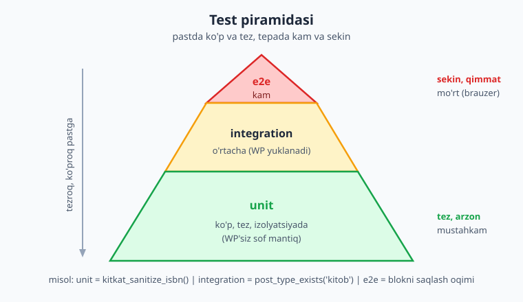
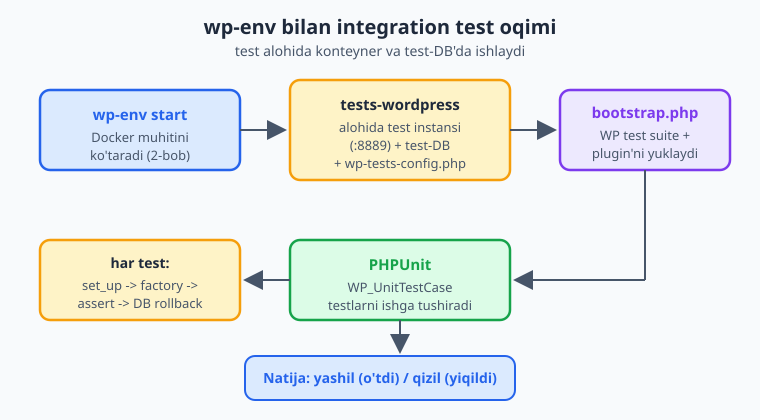
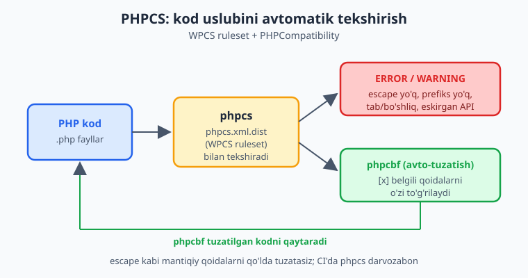

# 25 — Testlash: PHPUnit, wp-env, PHPCS/WPCS

[⬅️ Oldingi: 24 — i18n va lokalizatsiya](./24-i18n-lokalizatsiya.md) · [🏠 README](./README.md) · [Keyingi: 26 — Performance va keshlash ➡️](./26-performance.md)

> **Bu bobda:** plugin'ni qo'lda emas, **avtomatik** sinashni o'rganamiz — nega testlar regressiyani (ishlaydigan kodning keyingi o'zgarishdan buzilishini) oldini olishini va kodga ishonch berishini ko'ramiz; **test piramidasi** (ko'p unit, o'rtacha integration, kam e2e) bilan qancha va qaysi testni yozishni rejalashtiramiz; `wp-env` (2-bobdagi muhitimiz) ichidagi `tests-wordpress` konteyneri va WordPress test suite (`bootstrap.php`, `wp-tests-config.php`) qanday ishlashini tushunamiz; `WP_UnitTestCase` bilan `setUp`/`tearDown`, `$this->factory` va har testda DB rollback'ni ko'rsatamiz; `kitkat_sanitize_isbn()` uchun **unit test** va CPT `kitob` ro'yxatdan o'tganini tekshiradigan **integration test** yozamiz; blok `edit` komponentini `@wordpress/scripts`ning `test-unit-js` (Jest) bilan sinaymiz; va `phpcs.xml.dist` + **WordPress Coding Standards (WPCS)** + **PHPCompatibility** sozlab, `phpcs`/`phpcbf` bilan kod uslubi va `Requires PHP` mosligini avtomatik tekshiramiz — yakunida hammasini GitHub Actions CI'da ishga tushiramiz.

---

## Muammo: "men o'zgartirdim, endi nimadir buzildi"

Tasavvur qiling: "Kitoblar katalogi" plugin'imiz oylar davomida ishlab turibdi. CPT `kitob`, ISBN tozalovchi funksiya, REST endpoint, blok — hammasi joyida. Endi siz `kitkat_sanitize_isbn()` ga yangi qoida qo'shasiz (defis va bo'shliqni olib tashlash). Deploy qilasiz. Bir hafta o'tib mijoz yozadi: "13 raqamli ISBN endi qabul qilinmayapti." O'zgartirishingiz eski mantiqni buzgan.

Bu — **regressiya**: ilgari ishlagan narsa keyingi o'zgartirishdan keyin ishlamay qoladi. Qo'lda sinash bilan buni tutib bo'lmaydi — har deploy oldidan plugin'ning **har bir** funksiyasini qo'lda bosib chiqolmaysiz.

Yechim — **avtomatik testlar**: kod yozadigan kod. Bir marta "ISBN `978-0-13` `9780013` ga aylanishi kerak" deb yozasiz; keyin har o'zgartirishdan so'ng bitta buyruq bilan **barcha** shart bir necha soniyada tekshiriladi. Test yiqilsa — buzdingiz, deploy'dan oldin bilasiz.

📌 **Test nima beradi.** (1) **Regressiyadan himoya** — eski xatti-harakat doim tekshiriladi. (2) **Ishonch bilan refaktoring** — kodni qayta yozasiz, testlar yashil bo'lsa, mantiq saqlangan. (3) **Tirik hujjat** — test funksiyaning kutilgan xatti-harakatini aniq ko'rsatadi. (4) **Tezroq xato topish** — xatoni mijoz emas, siz topasiz.

> ℹ️ **Tayanch.** Avtomatik testlash umumiy tushunchasi (assertion, unit/integration farqi, TDD) til-mustaqil. Bu bobda WordPress'ga xos qismga (`WP_UnitTestCase`, `wp-env` test konteyneri, WPCS) e'tibor beramiz; PHP test asoslariga [PHP Expert kitobi](../php-expert/README.md) chuqurroq kiradi.

---

## Test piramidasi: qancha va qaysi test

Hamma testni bir xil yozish — xato. Testlar **piramida** shaklida taqsimlanadi: poydevorda ko'p, tez, arzon testlar; tepada kam, sekin, qimmat testlar.



- **Unit test (poydevor, ko'p).** Bitta funksiya yoki metodni **izolyatsiyada** tekshiradi — WordPress yuklanmaydi, DB yo'q. Sof mantiq: `kitkat_sanitize_isbn('978-0-13')` `'978013'` qaytaradimi? Mikrosoniyalarda ishlaydi. Yuzlab yozishingiz mumkin.
- **Integration test (o'rta).** Bir necha qismning **birga ishlashini** tekshiradi — bu yerda WordPress **yuklanadi**, DB bor. `register_post_type('kitob')` haqiqatan CPT ro'yxatga oldimi? `kitkat_save_book()` post va meta'ni to'g'ri saqlaydimi? Sekinroq (WP yuklanadi), lekin haqiqiy WP xatti-harakatini tekshiradi.
- **E2E (end-to-end, tepada, kam).** Brauzerda butun oqimni tekshiradi: foydalanuvchi blokni qo'shadi, janr tanlaydi, saqlaydi, frontend'da kitoblar chiqadi. Eng haqiqiy, lekin eng sekin va eng mo'rt (UI o'zgarsa buziladi). WordPress'da bu Playwright (`@wordpress/e2e-test-utils-playwright`) bilan qilinadi; bu bobda biz unit va integration'ga e'tibor beramiz.

📌 **Asosiy qoida:** ko'pchilik mantiqni unit testga sof, WP'siz funksiyalarga ajratib yozing (tez, ko'p), WP bilan o'zaro ta'sirni integration testga qoldiring (o'rtacha), e2e'ni faqat eng muhim foydalanuvchi oqimlariga saqlang. Piramida teskari bo'lib qolsa (ko'p sekin e2e, kam unit) — test to'plami sekin va mo'rt bo'ladi.

💡 **Loyihalash maslahati:** `kitkat_sanitize_isbn()` ataylab WordPress funksiyalariga bog'liq emas (sof PHP). Shu sababli uni unit test bilan WP'siz, mikrosoniyada sinash mumkin. Kodni shunday — sof mantiq alohida, WP "yelimi" alohida — yozsangiz, testlash osonlashadi.

---

## WordPress test muhiti: nima va qayerda

Sof PHP funksiyani sinash oson — `php` va PHPUnit yetadi. Lekin `register_post_type()` yoki `$wpdb` ishlatadigan kodni sinash uchun **tirik WordPress** kerak: yuklangan core, ulangan DB. Buni qo'lda sozlash mashaqqatli, shuning uchun WordPress **test suite** beradi.



Ikki bo'lak bor:

1. **Test muhiti (konteyner + DB).** 2-bobdagi `wp-env` ikkita WordPress'ni ko'taradi: oddiy ish uchun `localhost:8888` va **alohida test instansi** `tests-wordpress` (`localhost:8889`). Test test-DB'da ishlaydi — sizning ish ma'lumotlaringizga tegmaydi.
2. **WordPress test kutubxonasi.** `WP_UnitTestCase` bazaviy sinfi, `factory` va boshqalar shu kutubxonadan keladi. U `wp-env` o'rnatilganda avtomatik mavjud bo'ladi.

PHPUnit ishga tushganda **bootstrap fayli** (`tests/bootstrap.php`) WordPress test funksiyalarini yuklaydi va plugin'ingizni **`muplugins_loaded`** hook'da faollashtirib qo'yadi. `wp-tests-config.php` esa test-DB ulanishini ko'rsatadi (buni `wp-env` o'zi yaratadi).

📌 **`wp-env` afzalligi:** test-DB'ni, WordPress yuklamasini, `wp-tests-config.php`'ni siz qo'lda sozlamaysiz — `wp-env` Docker konteynerda hammasini tayyorlaydi. Sizga faqat `bootstrap.php` va test sinflarini yozish qoladi.

⚠️ Test **alohida** DB'da ishlaydi va har test oxirida o'zgarishlarni **bekor qiladi** (rollback). Shunga qaramay, testni doim **ishlab chiqarish (production) saytiga emas, lokal/test muhitida** ishga tushiring. Test DB'ni butunlay tozalashi mumkin.

### Loyiha tuzilishi

Test fayllari odatda alohida `tests/` papkasida turadi:

```text
kitoblar-katalogi/
├── kitoblar-katalogi.php
├── includes/
│   └── functions.php          ← kitkat_sanitize_isbn(), CPT ro'yxati
├── composer.json
├── phpcs.xml.dist             ← kod uslubi qoidalari
├── phpunit.xml.dist           ← PHPUnit konfiguratsiyasi
├── .wp-env.json               ← wp-env (2-bob)
└── tests/
    ├── bootstrap.php          ← WP test suite'ni yuklaydi
    ├── unit/
    │   └── test-sanitize-isbn.php
    └── integration/
        └── test-cpt-kitob.php
```

---

## `WP_UnitTestCase`: setUp, tearDown, factory, rollback

WordPress integration testlari `WP_UnitTestCase` sinfidan meros oladi (bu o'zi PHPUnit'ning `TestCase`'ini kengaytiradi). U uchta muhim narsa beradi:

- **`set_up()` / `tear_down()`** — har test metodi oldidan/keyinidan ishlaydigan tayyorlash va tozalash. (Eski `setUp`/`tearDown` ham ishlaydi; WP 5.9+ da snake_case `set_up`/`tear_down` tavsiya etiladi. Ota metodni chaqiring: `parent::set_up()`.)
- **`$this->factory`** — test ma'lumotlarini tez yaratish vositasi: `$this->factory()->post->create()`, `->user->create()`, `->term->create()`. Qo'lda massiv to'ldirib o'tirmaysiz.
- **Avtomatik DB rollback.** `WP_UnitTestCase` har testni **DB tranzaksiyasi** ichida ishga tushiradi va test tugagach uni **bekor qiladi (rollback)**. Shuning uchun bir testda yaratgan postingiz keyingi testga **ta'sir qilmaydi** — har test toza holatdan boshlanadi. Bu izolyatsiyani sizga bepul beradi.

📌 **`factory()` chaqiruv shakli.** Zamonaviy WP'da `$this->factory()` — **metod** (qavs bilan), statik `self::factory()` ham bor. Eski `$this->factory` (qavssiz xossa) ham ishlaydi, lekin yangi kodda `$this->factory()->post->create()` ko'rinishini tanlang.

💡 `factory()->post->create()` post ID qaytaradi; `factory()->post->create_and_get()` to'liq `WP_Post` obyektini qaytaradi. Atributlarni uzatish mumkin: `create( [ 'post_type' => 'kitob', 'post_title' => 'Test kitob' ] )`.

---

## Namuna 1: `kitkat_sanitize_isbn()` unit testi

Avval sinaladigan funksiyani ko'raylik. U sof PHP — WordPress'ga bog'liq emas, shuning uchun **unit** test (WP yuklanmaydi):

```php
<?php
// includes/functions.php (qism)

/**
 * ISBN'ni tozalaydi: faqat raqam (va oxirgi X) qoldiradi,
 * defis/bo'shliqni olib tashlaydi. Yaroqsiz bo'lsa bo'sh satr.
 */
function kitkat_sanitize_isbn( string $isbn ): string {
    // Faqat 0-9 va katta X (ISBN-10 nazorat raqami) qoldiramiz.
    $clean = preg_replace( '/[^0-9X]/', '', strtoupper( $isbn ) );

    // ISBN-10 (10 belgi) yoki ISBN-13 (13 raqam) bo'lishi kerak.
    return match ( strlen( $clean ) ) {
        10, 13 => $clean,
        default => '',
    };
}
```

Endi unit test. PHPUnit'ning sof `TestCase`'idan meros olamiz (WP kerak emas):

```php
<?php
// tests/unit/test-sanitize-isbn.php

use PHPUnit\Framework\TestCase;

require_once dirname( __DIR__, 2 ) . '/includes/functions.php';

final class Test_Sanitize_Isbn extends TestCase {

    public function test_defis_va_boshliq_olib_tashlanadi(): void {
        $this->assertSame( '9780131103627', kitkat_sanitize_isbn( '978-0-13-110362-7' ) );
        $this->assertSame( '9780131103627', kitkat_sanitize_isbn( '978 0 13 110362 7' ) );
    }

    public function test_isbn10_ohirgi_x_saqlanadi(): void {
        // ISBN-10 nazorat raqami X bo'lishi mumkin.
        $this->assertSame( '097522980X', kitkat_sanitize_isbn( '0-9752298-0-x' ) );
    }

    public function test_notogri_uzunlik_bosh_qaytaradi(): void {
        $this->assertSame( '', kitkat_sanitize_isbn( '123' ) );      // juda qisqa
        $this->assertSame( '', kitkat_sanitize_isbn( '' ) );          // bo'sh
        $this->assertSame( '', kitkat_sanitize_isbn( 'salom' ) );     // harf
    }

    /**
     * Bir nechta holatni bitta provider bilan tekshirish.
     * @dataProvider yaroqli_isbn_provider
     */
    public function test_yaroqli_isbnlar( string $kirish, string $kutilgan ): void {
        $this->assertSame( $kutilgan, kitkat_sanitize_isbn( $kirish ) );
    }

    public static function yaroqli_isbn_provider(): array {
        return [
            'ISBN-13 defisli' => [ '978-0-596-52068-7', '9780596520687' ],
            'ISBN-10 oddiy'   => [ '0596520689', '0596520689' ],
        ];
    }
}
```

📌 **Nima bo'lyapti.** `assertSame()` qiymat **va tip** mosligini tekshiradi (`===`). `@dataProvider` bitta test metodini har xil kirish bilan ko'p marta ishga tushiradi — ko'p holatni qisqa yozish. Bu test WordPress'siz, faqat `php`+PHPUnit bilan ishlaydi (chunki funksiya sof PHP).

💡 **`@dataProvider` o'rniga zamonaviy atribut.** PHPUnit 11+ da `#[DataProvider('yaroqli_isbn_provider')]` atributini ham ishlatish mumkin. Eski `@dataProvider` doc-bloki hozircha qo'llab-quvvatlanadi — kitobda uni ishlatdik, chunki WP test suite hali keng PHPUnit 9–10 diapazonida ishlaydi.

---

## Namuna 2: CPT `kitob` integration testi

Endi WordPress **yuklanishi** kerak bo'lgan test: CPT haqiqatan ro'yxatdan o'tganini va post yaratish ishlashini tekshiramiz. `WP_UnitTestCase`'dan meros olamiz:

```php
<?php
// tests/integration/test-cpt-kitob.php

final class Test_Cpt_Kitob extends WP_UnitTestCase {

    public function set_up(): void {
        parent::set_up();
        // Plugin bootstrap'da yuklangan; CPT 'init' da ro'yxatga olingan.
        // Ehtiyot uchun init'ni qayta ishga tushiramiz:
        do_action( 'init' );
    }

    public function test_kitob_cpt_royxatdan_otgan(): void {
        // post_type_exists() — CPT mavjudligini tekshiruvchi rasmiy funksiya.
        $this->assertTrue( post_type_exists( 'kitob' ) );
    }

    public function test_kitob_cpt_public_va_rest_yoqilgan(): void {
        $obj = get_post_type_object( 'kitob' );
        $this->assertInstanceOf( WP_Post_Type::class, $obj );
        $this->assertTrue( $obj->public );
        $this->assertTrue( $obj->show_in_rest ); // blok muharririda kerak
    }

    public function test_kitob_postini_yaratish(): void {
        // factory bilan tez test ma'lumoti yaratamiz.
        $post_id = self::factory()->post->create( [
            'post_type'  => 'kitob',
            'post_title' => 'Test kitob',
            'post_status'=> 'publish',
        ] );

        $this->assertIsInt( $post_id );
        $this->assertGreaterThan( 0, $post_id );

        $post = get_post( $post_id );
        $this->assertSame( 'kitob', $post->post_type );
        $this->assertSame( 'Test kitob', $post->post_title );
        // Bu post test tugagach DB'dan ROLLBACK bilan o'chadi — toza qoladi.
    }

    public function test_janr_taksonomiyasi_kitobga_boglangan(): void {
        $this->assertTrue( taxonomy_exists( 'janr' ) );
        $this->assertContains( 'janr', get_object_taxonomies( 'kitob' ) );
    }
}
```

📌 **Unit vs integration farqi shu yerda ko'rinadi:** bu testda `post_type_exists()`, `get_post_type_object()`, `WP_Post_Type`, `factory()`, `get_post()` — barchasi **tirik WordPress** talab qiladi. Shuning uchun u `WP_UnitTestCase`'dan meros oladi va `wp-env` test konteynerida ishlaydi, sof `php` bilan emas.

⚠️ `do_action( 'init' )`'ni `set_up()`da chaqirdik, chunki ba'zi test bootstrap'larida CPT'ni ro'yxatga oladigan plugin kodi avtomatik ishga tushadi, ba'zilarida yo'q. Plugin'ingiz CPT'ni `add_action( 'init', 'kitkat_register_kitob_cpt' )` bilan ulagani uchun `init`ni chaqirsak, ro'yxat kafolatlanadi.

### Bootstrap fayli

Integration testlar ishlashi uchun PHPUnit WordPress test suite'ni yuklashi va plugin'ni faollashtirishi kerak. Bu `tests/bootstrap.php`da bo'ladi:

```php
<?php
// tests/bootstrap.php — WP test suite va plugin'ni yuklaydi.

// wp-env test suite yo'lini WP_TESTS_DIR muhit o'zgaruvchisidan oladi.
$_tests_dir = getenv( 'WP_TESTS_DIR' );
if ( ! $_tests_dir ) {
    $_tests_dir = rtrim( sys_get_temp_dir(), "/\\" ) . '/wordpress-tests-lib';
}

// WP test funksiyalari (tests_add_filter, ...).
require_once $_tests_dir . '/includes/functions.php';

// Plugin'ni muplugins_loaded'da yuklaymiz — WP testlarni boshlamasdan oldin.
tests_add_filter( 'muplugins_loaded', function (): void {
    require dirname( __DIR__ ) . '/kitoblar-katalogi.php';
} );

// WP test muhitini ishga tushiramiz (oxirgi qator).
require $_tests_dir . '/includes/bootstrap.php';
```

📌 `tests_add_filter( 'muplugins_loaded', ... )` — plugin'ni WordPress test yuklanishidan **oldin** ulashning standart usuli (bu hook har qanday boshqa plugin'dan oldin ishlaydi). `WP_TESTS_DIR`'ni `wp-env` test konteyner ichida avtomatik beradi.

### PHPUnit konfiguratsiyasi

`phpunit.xml.dist` PHPUnit'ga bootstrap'ni va qaysi papkalarda test borligini aytadi:

```xml
<?xml version="1.0"?>
<phpunit
    bootstrap="tests/bootstrap.php"
    colors="true"
    failOnWarning="true"
    failOnDeprecation="true">
    <testsuites>
        <testsuite name="unit">
            <directory>tests/unit</directory>
        </testsuite>
        <testsuite name="integration">
            <directory>tests/integration</directory>
        </testsuite>
    </testsuites>
</phpunit>
```

Testlarni ishga tushirish (o'z muhitingizda, `wp-env` ko'tarilgandan keyin):

```bash
# wp-env test konteyneri ichida PHPUnit ishga tushirish:
wp-env run tests-cli --env-cwd=wp-content/plugins/kitoblar-katalogi vendor/bin/phpunit

# faqat unit to'plamini (WP'siz tez):
wp-env run tests-cli --env-cwd=wp-content/plugins/kitoblar-katalogi vendor/bin/phpunit --testsuite unit
```

⚠️ **Bu buyruqlar illustrativ** — haqiqiy natija sizning lokal muhitingizga bog'liq (Docker, `wp-env`, o'rnatilgan vendor paketlari). Yuqoridagi test sinflari sintaksisi tekshirilgan, lekin ularni siz **o'z muhitingizda** `wp-env start` qilib ishga tushirasiz. Kitob ishlab chiqarish saytida test ishga tushirilmaydi.

---

## JS test: blok `edit` komponentini Jest bilan sinash

Blokimizning `edit` komponenti — React. Uni `@wordpress/scripts`ning **`test-unit-js`** (ichida Jest + React Testing Library) bilan sinaymiz. Avval `package.json`'ga skript qo'shamiz:

```json
{
  "scripts": {
    "build": "wp-scripts build",
    "start": "wp-scripts start",
    "test:unit:js": "wp-scripts test-unit-js"
  }
}
```

Sof mantiqni test qilish eng oson. Aytaylik blok yordamchi funksiyasi bor — janr yorlig'ini formatlaydi:

```js
// src/utils.js
export function formatJanrLabel( janr ) {
    if ( ! janr ) {
        return 'Barcha janrlar';
    }
    return janr.charAt( 0 ).toUpperCase() + janr.slice( 1 );
}
```

Test fayli (`@wordpress/scripts` `*.test.js` fayllarini avtomatik topadi):

```js
// src/utils.test.js
import { formatJanrLabel } from './utils';

describe( 'formatJanrLabel', () => {
    test( 'bo\'sh qiymat uchun "Barcha janrlar"', () => {
        expect( formatJanrLabel( '' ) ).toBe( 'Barcha janrlar' );
        expect( formatJanrLabel( null ) ).toBe( 'Barcha janrlar' );
    } );

    test( 'birinchi harfni katta qiladi', () => {
        expect( formatJanrLabel( 'roman' ) ).toBe( 'Roman' );
        expect( formatJanrLabel( 'fantastika' ) ).toBe( 'Fantastika' );
    } );
} );
```

React komponentining o'zini test qilish uchun `@wordpress/scripts` Jest preset'i React Testing Library'ni ham beradi:

```jsx
// src/edit.test.jsx
import { render, screen } from '@testing-library/react';
import { Edit } from './edit';

test( 'Edit komponenti janr tanlovchini ko\'rsatadi', () => {
    const attributes = { janr: '', soni: 5 };
    render(
        <Edit
            attributes={ attributes }
            setAttributes={ () => {} }
        />
    );
    expect( screen.getByText( 'Barcha janrlar' ) ).toBeInTheDocument();
} );
```

Ishga tushirish (o'z muhitingizda):

```bash
npm run test:unit:js
```

📌 `wp-scripts test-unit-js` — zero-config: Jest, Babel (JSX uchun), va WordPress paketlari uchun mock'lar oldindan sozlangan. O'zingiz `jest.config.js` yozishingiz shart emas. `--watch` bilan o'zgartirishda avtomatik qayta ishlaydi.

⚠️ **Illustrativ:** komponent testi sizning `edit.jsx`'ingizga (props, ko'rsatadigan matn) bog'liq. Yuqoridagi misol `@wordpress/components`dan `SelectControl` ishlatadigan tipik `edit` uchun mos; o'z komponentingizga moslang. JS sintaksisi tekshirilgan, lekin Jest'ni siz **o'z loyihangizda** ishga tushirasiz.

---

## PHPCS + WPCS + PHPCompatibility: kod uslubini avtomatik tekshirish

Testlar kod **to'g'ri ishlashini** tekshiradi. **PHP_CodeSniffer (PHPCS)** esa kod **to'g'ri yozilganini** — uslub, xavfsizlik amaliyoti, mosligini — tekshiradi. WordPress'da maxsus qoidalar to'plami bor: **WordPress Coding Standards (WPCS)**.



- **`phpcs`** — kodni **tekshiradi**, qoidabuzarliklarni (xato va ogohlantirish) ko'rsatadi.
- **`phpcbf`** (PHP Code Beautifier and Fixer) — avtomatik **tuzatiladigan** qoidabuzarliklarni (bo'shliq, qavs joylashuvi) o'zi **tuzatadi**.
- **WPCS** beradigan tekshiruvlar: nomlash (`snake_case` funksiya), prefiks (global funksiya `kitkat_` bilan boshlanishi), `$wpdb->prepare()` ishlatilishi, output escape qilinganligi, nonce tekshiruvi, eskirgan funksiyalar (`query_posts`, `extract`).
- **PHPCompatibility** — kodingiz e'lon qilgan **`Requires PHP`** versiyasiga mosligini tekshiradi: `enum`, `readonly`, `match`'ni PHP 8.0'da ishlatib, header'da `Requires PHP: 7.4` deb yozsangiz — ogohlantiradi.

### O'rnatish (Composer dev-bog'liqliklari)

```bash
composer require --dev squizlabs/php_codesniffer wp-coding-standards/wpcs phpcompatibility/phpcompatibility-wp dealerdirect/phpcodesniffer-composer-installer
```

📌 `dealerdirect/phpcodesniffer-composer-installer` — o'rnatilgan barcha standartlarni (WPCS, PHPCompatibility) PHPCS'ga **avtomatik ro'yxatga oladi**, qo'lda `--config-set installed_paths` qilish shart emas.

`composer.json`'da qulay skriptlar:

```json
{
  "require-dev": {
    "squizlabs/php_codesniffer": "^3.9",
    "wp-coding-standards/wpcs": "^3.1",
    "phpcompatibility/phpcompatibility-wp": "^2.1",
    "dealerdirect/phpcodesniffer-composer-installer": "^1.0"
  },
  "scripts": {
    "lint": "phpcs",
    "lint:fix": "phpcbf"
  },
  "config": {
    "allow-plugins": {
      "dealerdirect/phpcodesniffer-composer-installer": true
    }
  }
}
```

### `phpcs.xml.dist` ruleset

Loyiha ildizidagi `phpcs.xml.dist` qaysi fayllarni, qaysi qoidalar bilan tekshirishni belgilaydi:

```xml
<?xml version="1.0"?>
<ruleset name="Kitoblar katalogi">
    <description>Kitoblar katalogi plugin uchun kodlash standartlari.</description>

    <!-- Tekshiriladigan fayllar -->
    <file>.</file>

    <!-- E'tiborga olinmaydigan papkalar -->
    <exclude-pattern>/vendor/*</exclude-pattern>
    <exclude-pattern>/node_modules/*</exclude-pattern>
    <exclude-pattern>/build/*</exclude-pattern>
    <exclude-pattern>/tests/*</exclude-pattern>

    <!-- Faqat PHP fayllar, parallel, rang -->
    <arg name="extensions" value="php"/>
    <arg name="colors"/>
    <arg value="ps"/>
    <arg name="parallel" value="8"/>

    <!-- WordPress standart to'plami -->
    <rule ref="WordPress">
        <!-- Fayl nomlash qoidasini yumshatamiz (ixtiyoriy) -->
        <exclude name="WordPress.Files.FileName"/>
    </rule>

    <!-- Prefiks: barcha global nomlar kitkat_ bilan -->
    <rule ref="WordPress.NamingConventions.PrefixAllGlobals">
        <properties>
            <property name="prefixes" type="array">
                <element value="kitkat"/>
                <element value="Oqil\KitobKatalog"/>
            </property>
        </properties>
    </rule>

    <!-- Text domain: i18n funksiyalarda doim shu domain -->
    <rule ref="WordPress.WP.I18n">
        <properties>
            <property name="text_domain" type="array">
                <element value="kitoblar-katalogi"/>
            </property>
        </properties>
    </rule>

    <!-- Minimal qo'llab-quvvatlanadigan WP versiyasi -->
    <config name="minimum_wp_version" value="7.0"/>

    <!-- PHPCompatibility: Requires PHP 8.3 mosligi -->
    <config name="testVersion" value="8.3-"/>
    <rule ref="PHPCompatibilityWP"/>
</ruleset>
```

📌 **`.dist` qo'shimchasi nima?** `phpcs.xml.dist` — loyiha bilan birga keladigan **standart** ruleset. Har bir dasturchi xohlasa, uni `phpcs.xml` ga nusxalab (gitignore'da) o'zi uchun moslashi mumkin. PHPCS avval `phpcs.xml`'ni, bo'lmasa `phpcs.xml.dist`'ni o'qiydi.

💡 **`testVersion="8.3-"`** — "8.3 va undan yuqori" degani; PHPCompatibility plugin headeringizdagi `Requires PHP: 8.3` bilan mos kodni tekshiradi. Agar PHP 8.4 sintaksisini (`8.3`da yo'q) ishlatsangiz, ogohlantiradi.

### Ishga tushirish

```bash
# tekshirish (xato va ogohlantirishlarni ko'rsatadi):
composer lint
# yoki to'g'ridan: vendor/bin/phpcs

# avto-tuzatish (bo'shliq, qavs va h.k.):
composer lint:fix
# yoki to'g'ridan: vendor/bin/phpcbf
```

`phpcs` chiqishi taxminan shunday ko'rinadi (illustrativ):

```text
FILE: includes/functions.php
----------------------------------------------------------------------
FOUND 2 ERRORS AND 1 WARNING AFFECTING 2 LINES
----------------------------------------------------------------------
 12 | ERROR   | All output should be run through an escaping function
 12 | ERROR   | [x] Tabs must be used to indent lines; spaces are not allowed
 30 | WARNING | $wpdb->prepare() bilan ishlatilishi kerak
----------------------------------------------------------------------
PHPCBF CAN FIX THE 1 MARKED SNIFF AUTOMATICALLY
----------------------------------------------------------------------
```

`[x]` belgili qatorlar — `phpcbf` avtomatik tuzata oladiganlar. Escape kabi mantiqiy qoidalarni qo'lda tuzatasiz.

⚠️ **Bu chiqish illustrativ** — haqiqiy natija kodingizga bog'liq. Ruleset (`phpcs.xml.dist`) va `composer.json` strukturasi tekshirilgan; ularni siz o'z loyihangizda `composer install` qilib, `composer lint` bilan ishga tushirasiz.

---

## CI: GitHub Actions'da avtomatik tekshirish

Testlar va PHPCS faqat sizning kompyuteringizda emas, har push'da **avtomatik** ishlashi kerak. Buni **GitHub Actions** qiladi: `.github/workflows/ci.yml` faylida har push'da PHPUnit, Jest va PHPCS ishga tushadi.

```yaml
# .github/workflows/ci.yml (soddalashtirilgan)
name: CI
on: [ push, pull_request ]
jobs:
  test:
    runs-on: ubuntu-latest
    steps:
      - uses: actions/checkout@v4
      - uses: shivammathur/setup-php@v2
        with:
          php-version: '8.3'
          tools: composer
      - run: composer install --no-progress
      - name: PHPCS (WPCS + PHPCompatibility)
        run: composer lint
      - name: PHPUnit (wp-env)
        run: |
          npm ci
          npm run wp-env start
          npm run test:php
```

📌 PR ochilganda Actions yashil (o'tdi) yoki qizil (yiqildi) belgi ko'rsatadi. Qizil bo'lsa — merge qilmaysiz. Bu — jamoaga ishonchli "darvozabon".

> ℹ️ **Tayanch.** GitHub Actions, workflow YAML va CI/CD oqimi [Git va GitHub kitobi](../git-github/README.md)da chuqurroq ochiladi. Bu yerda asosiy g'oya: lokal testlaringiz **avtomatik, har o'zgartirishda** ishlasin.

⚠️ Yuqoridagi workflow **illustrativ** (haqiqiy `wp-env` CI sozlamasi loyihangizga bog'liq, masalan `test:php` skripti) — uni o'z repozitoriyangizda sinab moslang.

---

## Yaxshi amaliyotlar (qisqacha)

- 📌 **Sof mantiqni ajrating.** `kitkat_sanitize_isbn()` kabi WP'siz funksiyalar — unit testga oson. WP "yelimi"ni alohida saqlang.
- 💡 **Test nomi tushuntirsin.** `test_notogri_uzunlik_bosh_qaytaradi` — nom o'zi nimani sinashini aytadi.
- 📌 **Har bug uchun avval test.** Xato topilsa, uni **takrorlaydigan** test yozing (qizil), keyin tuzating (yashil). Shu bug qaytmaydi (regressiya himoyasi).
- ⚠️ **Testni production'da ishga tushirmang.** Test DB'ni tozalashi mumkin — faqat lokal/CI muhitida.
- 💡 **PHPCS'ni CI'ga qo'shing.** Uslub bahslarini kod sharhida emas, avtomatik mashinaga hal qildiring.
- 📌 **`factory()` ishlating.** Test ma'lumotini qo'lda emas, `self::factory()->post->create()` bilan tez yarating; rollback uni o'zi tozalaydi.

---

## 25-bob mashqlari

> Quyidagi mashqlar "Kitoblar katalogi" plugin'i ustida. Test va lint'ni **o'z muhitingizda** (`wp-env`, `composer`) ishga tushiring — kitob ularni ishlab chiqarish saytida ishlatmaydi.

### Oson

1. **(Oson)** Test piramidasining uch qatlamini (unit / integration / e2e) o'z so'zlaringiz bilan ta'riflang va har biriga "Kitoblar katalogi"dan bittadan misol keltiring.
2. **(Oson)** `composer require --dev` buyrug'ini yozing: PHPCS, WPCS, PHPCompatibility va composer-installer'ni o'rnatadigan.
3. **(Oson)** `package.json`'ga `test:unit:js` skriptini qo'shing (`wp-scripts test-unit-js`).
4. **(Oson)** `WP_UnitTestCase` integration testlarda `set_up()` ichida birinchi qator nima bo'lishi kerak va nega?

<details markdown="1"><summary>4-mashq yechimi</summary>

Birinchi qator `parent::set_up();` bo'lishi kerak. `WP_UnitTestCase::set_up()` har testni DB tranzaksiyasi ichida boshlaydi, global holatni tozalaydi va boshqa tayyorlashni qiladi. Agar ota metodni chaqirmasangiz, DB rollback va izolyatsiya **ishlamaydi** — bir testdagi o'zgartirish boshqasiga oqib o'tadi.

```php
public function set_up(): void {
    parent::set_up(); // SHART — rollback va tozalashni yoqadi
    // ... o'z tayyorlashingiz
}
```
</details>

### O'rta

5. **(O'rta)** `kitkat_sanitize_isbn()` uchun yana ikkita unit test yozing: (a) kichik `x` katta `X` ga aylanishi, (b) 11 belgili kirish bo'sh satr qaytarishi.

<details markdown="1"><summary>Yechim</summary>

```php
public function test_kichik_x_katta_x_ga_aylanadi(): void {
    // funksiya strtoupper qiladi, shuning uchun x -> X
    $this->assertSame( '097522980X', kitkat_sanitize_isbn( '097522980x' ) );
}

public function test_11_belgi_bosh_qaytaradi(): void {
    // 11 belgi — na 10, na 13, demak yaroqsiz
    $this->assertSame( '', kitkat_sanitize_isbn( '12345678901' ) );
}
```
`strtoupper()` `x`ni `X`ga aylantirgani uchun (a) o'tadi; `match` faqat 10 va 13'ni qoldirgani uchun 11 belgi `default => ''` ga tushadi.
</details>

6. **(O'rta)** Integration test yozing: `janr` taksonomiyasi ro'yxatdan o'tganini va u `kitob` CPT'ga bog'langanini tekshiradigan.

<details markdown="1"><summary>Yechim</summary>

```php
public function test_janr_taxonomiyasi_kitobga_boglangan(): void {
    do_action( 'init' ); // taksonomiya init'da ro'yxatga olinadi
    $this->assertTrue( taxonomy_exists( 'janr' ) );

    $taxonomies = get_object_taxonomies( 'kitob' );
    $this->assertContains( 'janr', $taxonomies );
}
```
`taxonomy_exists()` — taksonomiya mavjudligini, `get_object_taxonomies()` esa qaysi taksonomiyalar `kitob`ga ulanganini qaytaradi (rasmiy WP funksiyalari).
</details>

7. **(O'rta)** `phpcs.xml.dist`'da `PrefixAllGlobals` qoidasiga `kitkat` prefiksini qo'shing va nega bu WPCS uchun muhimligini tushuntiring.

<details markdown="1"><summary>Yechim</summary>

```xml
<rule ref="WordPress.NamingConventions.PrefixAllGlobals">
    <properties>
        <property name="prefixes" type="array">
            <element value="kitkat"/>
            <element value="Oqil\KitobKatalog"/>
        </property>
    </properties>
</rule>
```
WordPress'da barcha plugin'lar bitta global makonni baham ko'radi. Prefiks'siz `register()` yoki `$config` kabi global nom boshqa plugin bilan **to'qnashishi** mumkin. WPCS'ning `PrefixAllGlobals` qoidasi har global funksiya/sinf/konstanta sizning unikal prefiksingiz (`kitkat_`) bilan boshlanishini majburlaydi — to'qnashuvni oldini oladi.
</details>

8. **(O'rta)** `@dataProvider` ishlatib, `kitkat_sanitize_isbn()` uchun beshta holatni bitta test metodida sinaydigan provider yozing.

<details markdown="1"><summary>Yechim</summary>

```php
/**
 * @dataProvider isbn_holatlari
 */
public function test_isbn_holatlari( string $kirish, string $kutilgan ): void {
    $this->assertSame( $kutilgan, kitkat_sanitize_isbn( $kirish ) );
}

public static function isbn_holatlari(): array {
    return [
        'ISBN-13 defisli' => [ '978-0-13-110362-7', '9780131103627' ],
        'ISBN-10 oddiy'   => [ '0596520689', '0596520689' ],
        'ISBN-10 X bilan' => [ '097522980x', '097522980X' ],
        'juda qisqa'      => [ '123', '' ],
        'bo\'sh'          => [ '', '' ],
    ];
}
```
`@dataProvider` har massiv elementi uchun test metodini bir marta ishga tushiradi; kalit (`'ISBN-13 defisli'`) yiqilgan holatni nomlaydi, shuning uchun xato xabari aniq bo'ladi.
</details>

9. **(O'rta)** `composer.json`'ga `lint` va `lint:fix` skriptlarini qo'shing va `allow-plugins`'da composer-installer'ga ruxsat bering. Nega `allow-plugins` kerak?

<details markdown="1"><summary>Yechim</summary>

```json
{
  "scripts": {
    "lint": "phpcs",
    "lint:fix": "phpcbf"
  },
  "config": {
    "allow-plugins": {
      "dealerdirect/phpcodesniffer-composer-installer": true
    }
  }
}
```
Composer 2.2+ xavfsizlik sababli boshqa kod ishga tushiradigan paketlarni (plugin) **bloklaydi**, agar ularga aniq ruxsat berilmasa. `phpcodesniffer-composer-installer` o'rnatish paytida PHPCS'ga standartlarni ro'yxatga olish uchun kod ishlatadi — shuning uchun `allow-plugins`'da `true` qilish kerak, aks holda WPCS PHPCS'ga ulanmaydi.
</details>

### Qiyin

10. **(Qiyin)** `kitkat_save_book_meta()` funksiyasi uchun integration test yozing: u post yaratib, ISBN meta'sini saqlasin va test `get_post_meta()` bilan to'g'ri saqlanganini tekshirsin. (Funksiya `update_post_meta( $post_id, 'kitkat_isbn', kitkat_sanitize_isbn( $raw ) )` qiladi deb faraz qiling.)

<details markdown="1"><summary>Yechim</summary>

```php
final class Test_Save_Book_Meta extends WP_UnitTestCase {

    public function test_isbn_meta_tozalanib_saqlanadi(): void {
        // 1. factory bilan kitob postini yaratamiz
        $post_id = self::factory()->post->create( [
            'post_type' => 'kitob',
        ] );

        // 2. xom ISBN'ni saqlovchi funksiyani chaqiramiz
        kitkat_save_book_meta( $post_id, '978-0-13-110362-7' );

        // 3. meta haqiqatan tozalangan holda saqlanganini tekshiramiz
        $saqlangan = get_post_meta( $post_id, 'kitkat_isbn', true );
        $this->assertSame( '9780131103627', $saqlangan );
    }

    public function test_notogri_isbn_bosh_saqlanadi(): void {
        $post_id = self::factory()->post->create( [ 'post_type' => 'kitob' ] );
        kitkat_save_book_meta( $post_id, 'xato' );
        $this->assertSame( '', get_post_meta( $post_id, 'kitkat_isbn', true ) );
    }
}
```
Bu **integration** test, chunki `update_post_meta`/`get_post_meta` tirik WP+DB talab qiladi. `factory()` post yaratadi, rollback test oxirida uni va meta'ni tozalaydi — keyingi testga toza holat qoladi. Sof tozalash mantiqini (unit) va saqlash oqimini (integration) ajratib sinash — piramidaning amaliy ko'rinishi.
</details>

11. **(Qiyin)** Blok `Edit` komponenti uchun React Testing Library testi yozing: u `soni` atributi 5 bo'lganda "5 ta kitob" matnini ko'rsatishini tekshirsin. (Komponent `<p>{ soni } ta kitob</p>` ko'rsatadi deb faraz qiling.)

<details markdown="1"><summary>Yechim</summary>

```jsx
// src/edit.test.jsx
import { render, screen } from '@testing-library/react';
import { Edit } from './edit';

test( 'soni atributi matnda ko\'rsatiladi', () => {
    render(
        <Edit
            attributes={ { janr: '', soni: 5 } }
            setAttributes={ () => {} }
        />
    );
    expect( screen.getByText( '5 ta kitob' ) ).toBeInTheDocument();
} );

test( 'soni o\'zgarsa matn ham o\'zgaradi', () => {
    render(
        <Edit
            attributes={ { janr: '', soni: 10 } }
            setAttributes={ () => {} }
        />
    );
    expect( screen.getByText( '10 ta kitob' ) ).toBeInTheDocument();
} );
```
`@wordpress/scripts` `test-unit-js` Jest + React Testing Library'ni oldindan sozlaydi. `render()` komponentni virtual DOM'ga chizadi, `screen.getByText()` matnni qidiradi, `toBeInTheDocument()` topilganini tasdiqlaydi. Bu **unit** darajadagi test (haqiqiy brauzer emas, jsdom). Ishga tushirish: `npm run test:unit:js`.
</details>

12. **(Qiyin)** To'liq `phpcs.xml.dist` yozing: WordPress standartini ishlatsin, `vendor`/`node_modules`/`build`/`tests`'ni chetlatsin, `kitkat` prefiksini majburlasin, text domain `kitoblar-katalogi` bo'lsin, va PHPCompatibility bilan `testVersion="8.3-"` tekshirsin.

<details markdown="1"><summary>Yechim</summary>

```xml
<?xml version="1.0"?>
<ruleset name="Kitoblar katalogi">
    <description>Kitoblar katalogi uchun WPCS + PHPCompatibility ruleset.</description>

    <file>.</file>
    <exclude-pattern>/vendor/*</exclude-pattern>
    <exclude-pattern>/node_modules/*</exclude-pattern>
    <exclude-pattern>/build/*</exclude-pattern>
    <exclude-pattern>/tests/*</exclude-pattern>

    <arg name="extensions" value="php"/>
    <arg name="colors"/>
    <arg value="ps"/>
    <arg name="parallel" value="8"/>

    <rule ref="WordPress"/>

    <rule ref="WordPress.NamingConventions.PrefixAllGlobals">
        <properties>
            <property name="prefixes" type="array">
                <element value="kitkat"/>
                <element value="Oqil\KitobKatalog"/>
            </property>
        </properties>
    </rule>

    <rule ref="WordPress.WP.I18n">
        <properties>
            <property name="text_domain" type="array">
                <element value="kitoblar-katalogi"/>
            </property>
        </properties>
    </rule>

    <config name="minimum_wp_version" value="7.0"/>
    <config name="testVersion" value="8.3-"/>
    <rule ref="PHPCompatibilityWP"/>
</ruleset>
```
`<file>.</file>` butun loyihani tekshiradi; `exclude-pattern` uchinchi tomon va generatsiya qilingan kodni chetlatadi. `WordPress` to'plami uslub+xavfsizlik qoidalarini beradi; `PrefixAllGlobals` to'qnashuvni, `WP.I18n` noto'g'ri text domain'ni, `PHPCompatibilityWP` esa `testVersion` mosligini tutadi.
</details>

13. **(Qiyin)** GitHub Actions workflow yozing: har push'da PHP 8.3 o'rnatib, `composer install` qilib, `composer lint` (PHPCS) ishga tushirsin. Nega CI'da lint juda foydali?

<details markdown="1"><summary>Yechim</summary>

```yaml
name: Lint
on: [ push, pull_request ]
jobs:
  phpcs:
    runs-on: ubuntu-latest
    steps:
      - uses: actions/checkout@v4
      - uses: shivammathur/setup-php@v2
        with:
          php-version: '8.3'
          tools: composer
      - name: Bog'liqliklarni o'rnatish
        run: composer install --no-progress --prefer-dist
      - name: PHPCS (WPCS + PHPCompatibility)
        run: composer lint
```
CI'da lint **darvozabon**: har push va PR'da kod uslubi va PHP-mosligi avtomatik tekshiriladi. Bu (1) uslub bahslarini kod sharhidan olib tashlaydi — mashina hal qiladi; (2) hech kim "unutib" tekshirmasdan merge qilolmaydi; (3) `Requires PHP` mos kelmagan sintaksisni ishlab chiqarishga chiqmasdan tutadi. Qizil belgi — merge bloklanadi.
</details>

14. **(Qiyin)** Tushuntiring: nega `kitkat_sanitize_isbn()` unit test bilan, lekin `kitkat_register_kitob_cpt()` integration test bilan sinaladi? Har biri qaysi muhitda (sof `php` yoki `wp-env`) ishlaydi va nega?

<details markdown="1"><summary>Yechim</summary>

`kitkat_sanitize_isbn()` — **sof PHP**: faqat `preg_replace`, `strtoupper`, `match` ishlatadi, WordPress funksiyasi yoki DB chaqirmaydi. Shuning uchun uni **unit test** bilan, faqat `php` + PHPUnit'ning `TestCase`'i bilan, **WordPress yuklamasdan** sinash mumkin. Tez (mikrosoniya), ko'p yozsa bo'ladi — piramidaning keng poydevori.

`kitkat_register_kitob_cpt()` esa `register_post_type()` ni chaqiradi — bu **tirik WordPress** talab qiladi (CPT registratsiya tizimi, global `$wp_post_types`). Natijani `post_type_exists()` bilan tekshirish ham WP yuklangan bo'lishini talab qiladi. Shuning uchun u **integration test**: `WP_UnitTestCase`'dan meros oladi va `wp-env` test konteynerida (`tests-wordpress`, real WP+DB) ishlaydi. Sekinroq, lekin haqiqiy WP integratsiyasini tasdiqlaydi — piramidaning o'rta qatlami.

Asosiy saboq: kodni shunday **loyihalang** — sof mantiqni (oson, tez sinaladigan) WP yelimi(integration kerak)dan ajrating. Bu test piramidasini sog'lom (ko'p unit, o'rtacha integration) saqlaydi.
</details>

---

[⬅️ Oldingi: 24 — i18n va lokalizatsiya](./24-i18n-lokalizatsiya.md) · [🏠 README](./README.md) · [Keyingi: 26 — Performance va keshlash ➡️](./26-performance.md)
