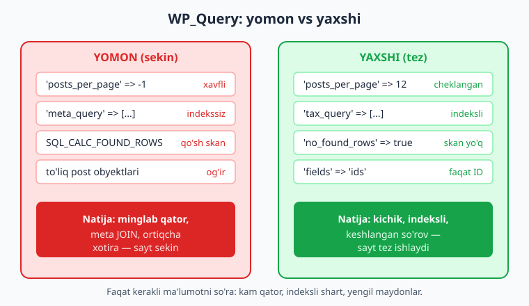
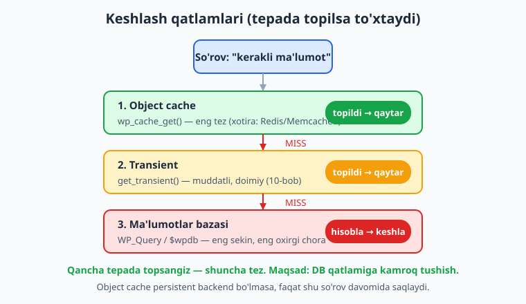
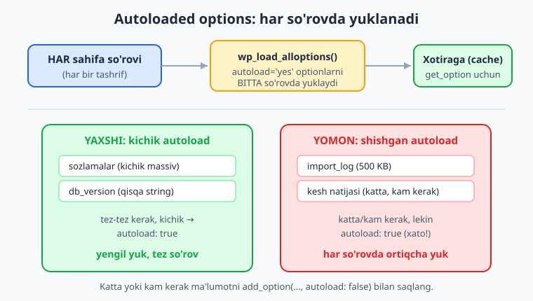

# 26 — Performance va keshlash

[⬅️ Oldingi: 25 — Testlash: PHPUnit, wp-env, PHPCS/WPCS](./25-testlash.md) · [🏠 README](./README.md) · [Keyingi: 27 — WooCommerce kengaytirish (HPOS) ➡️](./27-woocommerce.md)

> **Bu bobda:** plugin nima uchun saytni sekinlashtirishini (ko'p va og'ir so'rovlar, keshlanmagan tashqi chaqiruvlar, shishib ketgan autoload) tushunib, `WP_Query` ni `posts_per_page`, `no_found_rows`, `fields => 'ids'` va `update_post_*_cache` bilan optimallashtirishni; `meta_query` o'rniga taxonomiya ishlatishni; object cache (`wp_cache_get`/`wp_cache_set`/`wp_cache_delete`) va uning transient'dan farqini; autoloaded options yukini va `add_option(..., autoload: false)` ni; tsikldagi N+1 so'rovlardan qochishni va `pre_get_posts` bilan asosiy query'ni o'zgartirishni; hamda Query Monitor va `SAVEQUERIES` bilan o'lchashni o'rganamiz.

---

## Muammo: plugin saytni nega sekinlashtiradi?

"Kitoblar katalogi" plugin'ingiz mahalliy testda bir zumda ishladi: 10 ta kitob, hammasi tez. Lekin mijoz saytida 8000 ta kitob, 50000 ta ko'rish yozuvi va og'ir trafik bor. Endi katalog sahifasi 4 sekundda ochiladi, admin panel sekin, hosting "siz juda ko'p MySQL so'rov yuborayapsiz" deb ogohlantiradi.

Plugin sekinligi deyarli har doim shu uch sababdan biri:

1. **Juda ko'p yoki og'ir so'rovlar** — `posts_per_page => -1` bilan butun jadvalni tortib olish, tsiklda har element uchun yangi so'rov (N+1), indekslanmagan `meta_query`.
2. **Keshlanmagan takroriy ish** — har sahifa yuklanishida bir xil og'ir hisoblashni yoki bir xil tashqi API chaqiruvini qayta-qayta bajarish.
3. **Autoload shishishi** — katta yoki kam kerak bo'ladigan ma'lumotni `autoload = true` bilan saqlash, natijada u **har** so'rovda xotiraga yuklanadi.

📌 **Oltin qoida:** tezlikni "his qilib" emas, **o'lchab** tuzating. Avval Query Monitor (pastda) bilan qaysi so'rov sekin ekanini toping, keyin aynan shuni optimallashtiring. Ko'r-ko'rona "optimizatsiya" — vaqt isrofi.

ℹ️ Bu bob 10-bobning (`$wpdb`, options, transients) va 07-08-boblarning (CPT, taxonomiya) davomi — o'sha mexanizmlarni endi **tez** ishlatamiz.

---

## `WP_Query` ni optimallashtirish

`WP_Query` (07-bob) qulay, lekin **default sozlamalari ko'p ortiqcha ish bajaradi**: har so'rovda topilgan qatorlar umumiy sonini hisoblaydi (paginatsiya uchun), barcha postlarning meta va term keshini oldindan to'ldiradi. Agar sizga bularning hammasi kerak bo'lmasa — o'chiring.



### Eng muhim performance argumentlari

Quyidagi argumentlarning hammasi `WP_Query` (va `get_posts()`) tomonidan rasmiy qo'llab-quvvatlanadi:

| Argument | Default | Nima qiladi | Qachon o'zgartiring |
|---|---|---|---|
| `posts_per_page` | `10` | Nechta post olinadi | Har doim aniq cheklang; `-1` dan saqlaning |
| `no_found_rows` | `false` | `true` — umumiy qatorlar sonini hisoblamaydi | Paginatsiya **kerak emas** bo'lsa `true` |
| `fields` | `'all'` | `'ids'` — faqat ID massivi; `'id=>parent'` | Faqat ID kerak bo'lsa `'ids'` |
| `update_post_meta_cache` | `true` | Postlar meta keshini oldindan to'ldiradi | Meta o'qimasangiz `false` |
| `update_post_term_cache` | `true` | Postlar term keshini oldindan to'ldiradi | Term o'qimasangiz `false` |
| `ignore_sticky_posts` | `false` | `true` — yopishtirilgan postlarni aralashtirmaydi | O'z ro'yxatlaringizda `true` |
| `cache_results` | `true` | Post natijalarini object cache'ga yozadi | Odatda `true` qoldiring |

⚠️ **`posts_per_page => -1` xavfli.** U "hamma postni ol" degani. 10 ta postda muammo yo'q, lekin 8000 ta kitobda bu butun jadvalni xotiraga tortadi — sayt qotadi yoki PHP xotira limiti tugaydi. Har doim mantiqiy chegara qo'ying (masalan `100`); haqiqatan ko'p kerak bo'lsa, paginatsiya yoki partiyalab (`batch`) o'qing.

### Yaxshi vs yomon — bir misol

```php
// ❌ YOMON: hamma kitobni, meta va term keshi bilan, qatorlar sonini hisoblab oladi
$query = new \WP_Query( [
	'post_type'      => 'kitob',
	'posts_per_page' => -1, // butun jadval — xavfli
	'meta_query'     => [ // indekslanmagan postmeta JOIN — sekin
		[ 'key' => 'tavsiya', 'value' => '1' ],
	],
] );
```

```php
// ✅ YAXSHI: faqat ID kerak (havola yasash uchun), paginatsiya kerak emas
$ids = ( new \WP_Query( [
	'post_type'              => 'kitob',
	'post_status'            => 'publish',
	'posts_per_page'         => 12,        // aniq cheklov
	'no_found_rows'          => true,      // paginatsiya kerak emas -> sonni hisoblamaymiz
	'fields'                 => 'ids',     // faqat ID massivi -> yengil
	'update_post_meta_cache' => false,     // meta o'qimaymiz
	'update_post_term_cache' => false,     // term o'qimaymiz
	'ignore_sticky_posts'    => true,      // o'z ro'yxatimiz, sticky aralashmasin
	'tax_query'              => [          // meta_query o'rniga taxonomiya (indeksli)
		[ 'taxonomy' => 'janr', 'field' => 'slug', 'terms' => 'ilmiy' ],
	],
] ) )->posts; // 'fields' => 'ids' bilan ->posts endi ID massivi
```

💡 `no_found_rows => true` `SQL_CALC_FOUND_ROWS` (yoki uning o'rnini bosuvchi qo'shimcha `COUNT` so'rovini) o'chiradi. Bu — "Sahifa 1 / 47" kabi paginatsiya kerak bo'lmagan har bir ro'yxat (sidebar, widget, "tegishli kitoblar") uchun bepul tezlik.

### `meta_query` nega sekin — taxonomiyani afzal ko'ring

`wp_postmeta` jadvali **kalit-qiymat** (10-bob): har post uchun ko'p qator, `meta_value` ustuni indekslanmagan (uzun matn). `meta_query` bilan filtrlash `wp_postmeta` ga `JOIN` qiladi va indekssiz qatorlarni skanlaydi — minglab postda bu juda sekin.

📌 **Agar biror maydon bo'yicha tez-tez filtrlasangiz** (masalan "ilmiy" kitoblar), uni meta emas, **taxonomiya** qiling (08-bob). Taxonomiya `term_taxonomy_id` orqali indeksli `JOIN` qiladi — `meta_query` dan ancha tez. Meta'ni faqat post bilan birga **ko'rsatish** uchun saqlang, **filtrlash/saralash** uchun emas.

⚠️ `'orderby' => 'meta_value'` (yoki `meta_value_num`) ayniqsa og'ir — u `JOIN` ustiga saralash qo'shadi. Mumkin bo'lsa, saralanadigan qiymatni taxonomiya yoki o'z jadval ustuni (10-bob) qiling.

---

## `pre_get_posts`: asosiy query'ni to'g'ri o'zgartirish

Ko'pincha katalog sahifasida `post_type=kitob` chiqishini yoki "har sahifada 12 ta" bo'lishini xohlaysiz. Yangi `WP_Query` yaratish — **ikkinchi** so'rov degani (asosiy so'rov baribir ishlaydi). To'g'ri yo'l — WordPress allaqachon bajaradigan **asosiy so'rovni** `pre_get_posts` action'i bilan o'zgartirish.

`pre_get_posts` — so'rov o'zgaruvchilari yaratilgandan **keyin**, lekin so'rov bajarilishidan **oldin** ishlaydigan action. Callback'ga `WP_Query` obyekti **havola orqali** (`&`) keladi — uni o'zgartirsangiz, asosiy so'rov o'zgaradi.

```php
add_action( 'pre_get_posts', function ( \WP_Query $query ): void {
	// MUHIM: faqat front-end ASOSIY query'ni o'zgartiramiz
	if ( is_admin() || ! $query->is_main_query() ) {
		return; // admin so'rovlariga va ikkilamchi WP_Query'larga tegmaymiz
	}

	// Masalan, janr arxivida har sahifada 12 ta kitob ko'rsatamiz
	if ( $query->is_tax( 'janr' ) ) {
		$query->set( 'posts_per_page', 12 );
		$query->set( 'ignore_sticky_posts', true );
	}
} );
```

⚠️ **`is_admin()` va `is_main_query()` tekshiruvi SHART.** Ularni unutsangiz, admin paneldagi ro'yxatlarni yoki har bir ikkilamchi `WP_Query` ni ham o'zgartirib, saytni buzasiz. Va global `is_main_query()` o'rniga **passed obyekt** metodini ishlating — `$query->is_main_query()` — chunki global versiya `$wp_query` ga tekshiradi, qo'lingizdagi obyektga emas.

💡 `pre_get_posts` ikki foydadan beradi: (1) ikkinchi so'rovni yo'q qiladi (asosiy so'rovni qayta ishlatasiz), (2) WordPress paginatsiya, `is_paged()` va shablon mantiqini avtomatik to'g'ri tutadi.

---

## Tsiklda so'rov qilmang: N+1 muammosi

Eng yashirin sekinlik manbai — **N+1 so'rov**: bitta so'rov bilan N ta element olasiz, keyin har bir element uchun **yana bir** so'rov qilasiz. 100 ta kitob = 1 + 100 = 101 so'rov.

```php
// ❌ YOMON: N+1 — har kitob uchun alohida meta so'rovi
$kitoblar = get_posts( [ 'post_type' => 'kitob', 'posts_per_page' => 100 ] );
foreach ( $kitoblar as $kitob ) {
	// Har iteratsiyada DB ga boradi (agar meta keshi to'ldirilmagan bo'lsa)
	$isbn = get_post_meta( $kitob->ID, 'isbn', true );
	echo esc_html( $isbn );
}
```

📌 **Yechim — meta'ni oldindan keshlash.** `WP_Query`/`get_posts` default `update_post_meta_cache => true` bilan **bitta** so'rovda barcha postlarning meta'sini oldindan oladi. Keyin `get_post_meta()` keshdan o'qiydi — qo'shimcha so'rov yo'q. Demak yuqoridagi misolda agar `update_post_meta_cache` ni `false` qilib qo'ymagan bo'lsangiz, meta aslida keshdan keladi. Asosiy xato — uni `false` qilib, keyin tsiklda `get_post_meta` chaqirish:

```php
// ❌ ENG YOMON: meta keshini o'chirib, keyin tsiklda meta so'rash -> haqiqiy N+1
$kitoblar = get_posts( [
	'post_type'              => 'kitob',
	'posts_per_page'         => 100,
	'update_post_meta_cache' => false, // keshni o'chirdik...
] );
foreach ( $kitoblar as $kitob ) {
	$isbn = get_post_meta( $kitob->ID, 'isbn', true ); // ...endi har biri DB so'rovi!
}
```

💡 Qoida sodda: **agar tsiklda meta o'qisangiz, meta keshini O'CHIRMANG** (`update_post_meta_cache` ni `true` qoldiring). Agar meta o'qimasangiz — `false` qilib tezlashtiring. Ikkalasini bir vaqtda noto'g'ri kombinatsiya qilmang.

⚠️ Xuddi shu mantiq term'lar uchun: tsiklda `get_the_terms()`/`wp_get_post_terms()` chaqirsangiz, `update_post_term_cache` ni `true` qoldiring; aks holda har post uchun alohida term so'rovi ketadi. Agar bir nechta ID ro'yxati uchun meta kerak bo'lsa, `update_meta_cache( 'post', $ids )` bilan ham qo'lda oldindan to'ldira olasiz.

---

## Object cache: `wp_cache_*`

10-bobda transient'ni ko'rdik. Object cache — uning "ukasi": **so'rov davomida** (yoki persistent backend bo'lsa, so'rovlararo) ma'lumotni xotirada saqlaydi. WordPress yadrosi uni keng ishlatadi (postlar, meta, options shu yerda keshlanadi).



```php
namespace Oqil\KitobKatalog;

class Stats {

	const CACHE_GROUP = 'kitoblar_katalogi';

	public static function kitob_korishlari( int $kitob_id ): int {
		$kalit = 'korishlar_' . $kitob_id;

		// 1) Object cache'dan o'qish. $found havola orqali HIT/MISS ni aniq aytadi.
		$soni = wp_cache_get( $kalit, self::CACHE_GROUP, false, $found );
		if ( $found ) {
			return (int) $soni; // KESH HIT — DB ga bormaymiz
		}

		// 2) MISS -> og'ir so'rov (10-bobdagi o'z jadval)
		global $wpdb;
		$jadval = $wpdb->prefix . 'kitob_korishlar';
		$soni   = (int) $wpdb->get_var(
			$wpdb->prepare(
				"SELECT COUNT(*) FROM {$jadval} WHERE kitob_id = %d",
				$kitob_id
			)
		);

		// 3) Keshga yozamiz (so'rov davomida; persistent backend bo'lsa uzoqroq)
		wp_cache_set( $kalit, $soni, self::CACHE_GROUP, HOUR_IN_SECONDS );

		return $soni;
	}

	// Yangi ko'rish yozilganda keshni bekor qilamiz
	public static function keshni_tozala( int $kitob_id ): void {
		wp_cache_delete( 'korishlar_' . $kitob_id, self::CACHE_GROUP );
	}
}
```

📌 Funksiya imzolari (rasmiy hujjat):

- `wp_cache_get( int|string $key, string $group = '', bool $force = false, bool|null &$found = null ): mixed|false`
- `wp_cache_set( int|string $key, mixed $data, string $group = '', int $expire = 0 ): bool`
- `wp_cache_delete( int|string $key, string $group = '' ): bool`

💡 **`$found` parametrini ishlating.** `wp_cache_get` MISS'da `false` qaytaradi — lekin keshlangan haqiqiy qiymat ham `false`, `0` yoki `''` bo'lishi mumkin. To'rtinchi `$found` (havola) MISS'ni "qiymat aslida false" dan ajratadi. Bu — transient'dagi `false !== $kesh` muammosining object cache versiyasi.

⚠️ **`$group` doim bering** (masalan plugin slug'i). Guruh — kesh "papkasi"; u nomlar to'qnashuvining oldini oladi (sizning `korishlar_5` boshqa plugin'ning `korishlar_5` bilan aralashmaydi).

### Object cache va Transient farqi

| | **Object cache** (`wp_cache_*`) | **Transient** (`set_transient`) |
|---|---|---|
| Doimiylik | Persistent backend (Redis/Memcached) bo'lsagina so'rovlararo qoladi; aks holda **faqat shu so'rov** | Har doim **doimiy** (object cache bo'lmasa `wp_options`'da) |
| Qayerda | Xotirada (yoki backend) | `wp_options` (yoki object cache bo'lsa o'sha yerda) |
| Muddat | `$expire` (persistent backend uchun) | `$expiration` har doim hurmat qilinadi |
| Qachon | Bitta so'rovda takror hisoblash; yadro/meta keshi | Og'ir hisob/tashqi API natijasini soatlarga saqlash |

ℹ️ **Qoidaning ixchami:** natija **server qayta ishga tushsa ham** qolishi kerak bo'lsa (tashqi API, og'ir hisob) — **transient**. Natija **shu bitta so'rov ichida** bir necha marta kerak bo'lsa — **`wp_cache_*`**. Redis/Memcached o'rnatilgan saytda ikkalasi ham xotiradan ishlaydi va transient avtomatik tezlashadi — kodingiz o'zgarmaydi.

---

## Tashqi chaqiruvlarni keshlang

18-bobda `wp_remote_get()` bilan tashqi HTTP so'rovni ko'rdik. **Har sahifa yuklanishida** tashqi API ga chiqish — falokat: tarmoq sekinligi sizning saytingiz sekinligiga aylanadi, API tushsa — sizning sahifangiz ham qotadi.

```php
function kitoblar_katalogi_valyuta_kursi(): ?float {
	$kalit = 'kitoblar_katalogi_usd_kurs';

	$kesh = get_transient( $kalit );
	if ( false !== $kesh ) {
		return (float) $kesh; // KESH HIT — tashqi API ga bormaymiz
	}

	// MISS -> tashqi API (18-bob). Timeout qo'ying, aks holda sahifa kutib qoladi.
	$javob = wp_remote_get( 'https://example.com/api/usd', [ 'timeout' => 5 ] );
	if ( is_wp_error( $javob ) || 200 !== wp_remote_retrieve_response_code( $javob ) ) {
		// Xato bo'lsa qisqa muddatga keshlab, API ni "tinch qo'yamiz" (negative cache)
		set_transient( $kalit, '0', 5 * MINUTE_IN_SECONDS );
		return null;
	}

	$kurs = (float) wp_remote_retrieve_body( $javob );
	set_transient( $kalit, $kurs, 6 * HOUR_IN_SECONDS ); // 6 soatga keshlaymiz
	return $kurs;
}
```

⚠️ **Halol eslatma:** `wp_remote_get` natijasi va kesh xatti-harakati faqat **ishlab turgan saytda** ko'rinadi. Yuqoridagi kod docs'ga mos va sintaktik to'g'ri; uni o'z saytingizda Query Monitor'ning "HTTP API Calls" panelida kuzating — kesh ishlasa, ikkinchi yuklashda chaqiruv yo'qoladi.

---

## Autoloaded options: yashirin yuk

Bu — 10-bobda tegib o'tgan, lekin chuqurroq tushuntirishga arzigulik mavzu. WordPress **har sahifa so'rovida** `wp_load_alloptions()` orqali `autoload = 'yes'` belgilangan **barcha** options'ni **bitta** so'rovda o'qib, xotiraga oladi. Bu tez-tez kerak bo'ladigan kichik sozlamalar uchun zo'r — har bittasi uchun alohida so'rov ketmaydi.



⚠️ **Muammo:** agar siz **katta** (keshlangan API javobi, import log, uzun ro'yxat) yoki **kam kerak bo'ladigan** ma'lumotni `autoload = true` bilan saqlasangiz, u **har** so'rovda — hatto kerak bo'lmasa ham — xotiraga yuklanadi. `alloptions` shishadi (megabaytlarga yetishi mumkin), har sahifa sekinlashadi. Bu — keng tarqalgan, ammo ko'rinmas performance muammosi.

```php
// ✅ Tez-tez kerak, kichik -> autoload: true (default heuristika ham buni tanlaydi)
update_option( 'kitoblar_katalogi_sozlamalar', $kichik_sozlamalar, true );

// ✅ Katta yoki kam kerak -> autoload: false (faqat get_option chaqirilganda yuklanadi)
add_option( 'kitoblar_katalogi_import_log', $katta_log, '', false );
```

📌 `add_option` imzosi (rasmiy hujjat): `add_option( string $option, mixed $value = '', string $deprecated = '', bool|null $autoload = null )`. To'rtinchi argument `$autoload`:

- `true` — har so'rovda yukla (kichik, tez-tez kerak uchun).
- `false` — faqat `get_option()` chaqirilganda yukla (katta/kam kerak uchun).
- `null` — WordPress o'zi heuristika bilan qaror qilsin (6.7.0 dan yangi standart).

⚠️ Eski `'yes'`/`'no'` **string** qiymatlari 6.7.0 dan eskirgan — `bool|null` ishlating.

💡 **Tekshirish.** O'z saytingizda autoload yukini WP-CLI bilan o'lchang:

```bash
# Eng katta autoloaded option'larni topish (o'z saytingizda)
wp option list --fields=option_name,size_bytes --autoload=on --orderby=size_bytes --order=desc | head -20
```

Agar plugin'ingizning katta option'i ro'yxat tepasida bo'lsa — uni `autoload = false` ga o'tkazing. Mavjud option uchun (WP 6.7+): `wp_set_option_autoload( 'nom', false )` yoki o'sha qiymatni `add_option` bilan qayta yozing.

---

## O'lchash: Query Monitor va `SAVEQUERIES`

"O'lchamasdan optimallashtirma." WordPress'da bunda ikki asosiy asbob bor.

### `SAVEQUERIES`

`wp-config.php` ga (faqat **dev** muhitda — produksiyada emas, u sekinlashtiradi va xotira yeydi) quyidagini qo'shsangiz, WordPress har so'rovni, uning vaqtini va chaqiruv stekini `$wpdb->queries` ga yozadi:

```php
// wp-config.php (faqat development) — har SQL so'rovni qayd qiladi
define( 'SAVEQUERIES', true );
```

```php
// So'rovlarni dasturiy ko'rish (masalan footer'da, faqat dev'da)
add_action( 'wp_footer', function (): void {
	if ( ! defined( 'SAVEQUERIES' ) || ! SAVEQUERIES || ! current_user_can( 'manage_options' ) ) {
		return;
	}
	global $wpdb;
	error_log( 'Jami so\'rovlar: ' . count( $wpdb->queries ) );
	// Har element: [0] => SQL, [1] => vaqt (sekund), [2] => chaqiruv steki
}, 999 );
```

### Query Monitor plugin

Amalda eng qulay asbob — **Query Monitor** (bepul plugin, o'z saytingizga o'rnatasiz). U admin panelda har so'rovni, uning vaqtini, qaysi plugin/funksiya chaqirganini, sekin so'rovlarni (qizil bilan), HTTP API chaqiruvlarini, object cache HIT/MISS statistikasini va PHP xatolarni ko'rsatadi.

📌 **Ish jarayoni:**

1. Query Monitor'ni o'rnating, katalog sahifasini oching.
2. "Queries by Component" da sizning plugin'ingiz nechta so'rov qilganini ko'ring.
3. Sekin (qizil) so'rovni toping — odatda `meta_query` yoki keshlanmagan takror.
4. Yuqoridagi usullar bilan tuzating: `tax_query`, `no_found_rows`, `fields => 'ids'`, transient/object cache.
5. Sahifani qayta oching — so'rovlar soni va vaqti kamayganini tasdiqlang.

⚠️ **Halol eslatma:** jonli profiling raqamlari (so'rovlar soni, millisekundlar, kesh HIT nisbati) faqat **ishlab turgan saytda** ko'rinadi — bu bobdagi raqamlar illyustrativ. Query Monitor'ni o'z saytingizda ishlatib, **oldin/keyin** ni o'zingiz o'lchang. Maqsad — aniq son emas, **tendentsiya**: so'rovlar kamaydimi, sekin so'rovlar yo'qoldimi.

💡 `WP_DEBUG`, `WP_DEBUG_LOG` (02-bob) bilan birga Query Monitor — plugin tezligini tushunishning eng tez yo'li. Optimallashtirishni har doim shu o'lchovdan boshlang.

---

## Birga qo'yamiz: tezlik nazorat ro'yxati

"Kitoblar katalogi" plugin'i endi har bir performance nuqtasini hisobga oladi:

- **`WP_Query`** — `posts_per_page` cheklangan, paginatsiya kerakmas joyda `no_found_rows => true`, faqat ID kerak joyda `fields => 'ids'`, meta/term o'qilmasa keshlar `false`.
- **Filtrlash** — `meta_query` o'rniga `janr` taxonomiyasi (indeksli).
- **Asosiy query** — yangi `WP_Query` emas, `pre_get_posts` (`is_admin`/`is_main_query` tekshiruvi bilan).
- **N+1 yo'q** — tsiklda so'rov qilinmaydi; meta keshi to'g'ri ishlatiladi.
- **Keshlash** — og'ir hisob va tashqi API transient bilan, so'rov-ichi takror `wp_cache_*` bilan.
- **Autoload** — katta/kam kerak option'lar `autoload: false`.
- **O'lchov** — Query Monitor + `SAVEQUERIES` bilan oldin/keyin tasdiqlangan.

Keyingi bobda WooCommerce'ni (HPOS — High-Performance Order Storage) kengaytiramiz; u o'z jadval va so'rov optimizatsiyasi g'oyalarini katta miqyosda qo'llaydi.

---

## 26-bob mashqlari

### Oson

1. **(Oson)** `WP_Query` argumentlaridan qaysilari performance'ga ta'sir qiladi va nima qiladi: `no_found_rows`, `fields`, `update_post_meta_cache`? Har biriga bir jumla.
2. **(Oson)** Nega `'posts_per_page' => -1` xavfli? Uning o'rniga nima qilasiz?
3. **(Oson)** Paginatsiya kerak bo'lmagan "tegishli kitoblar" ro'yxati uchun qaysi bitta argumentni `true` qilasiz va nega?
4. **(Oson)** Faqat kitob ID'lari kerak bo'lsa (havola yasash uchun), qaysi argumentni qanday qiymat bilan berasiz? Natijada `->posts` nima qaytaradi?
5. **(Oson)** Object cache (`wp_cache_*`) va transient (`set_transient`) orasidagi asosiy farqni (doimiylik bo'yicha) bir jumlada ayting.
6. **(Oson)** `define( 'SAVEQUERIES', true )` ni qayerga qo'yasiz va nega faqat development muhitida?

### O'rta

7. **(O'rta)** `meta_query` nega `tax_query` dan sekin? Qachon meta'ni taxonomiyaga aylantirish kerak?
8. **(O'rta)** `pre_get_posts` callback'ida nega `is_admin()` va `$query->is_main_query()` tekshiruvi shart? Birini unutsa nima bo'ladi?

    <details markdown="1"><summary>Yechim</summary>

    `pre_get_posts` saytning **har** so'rovida (front-end ham, admin ham) va **har** `WP_Query` namunasida ishlaydi. Agar `is_admin()` ni tekshirmasangiz, admin paneldagi postlar ro'yxati so'rovini ham o'zgartirib qo'yasiz (masalan admin'da kitoblar yo'qolib qoladi). Agar `$query->is_main_query()` ni tekshirmasangiz, sahifadagi har bir ikkilamchi `WP_Query` (widget, "tegishli postlar") ham o'zgaradi. Ikkalasi birga faqat front-end asosiy so'rovni ajratadi. Global `is_main_query()` emas, **passed obyekt** metodini (`$query->is_main_query()`) ishlatish kerak — global versiya `$wp_query` ga tekshiradi, qo'lingizdagi obyektga emas.

    ```php
    add_action( 'pre_get_posts', function ( \WP_Query $query ): void {
    	if ( is_admin() || ! $query->is_main_query() ) {
    		return;
    	}
    	if ( $query->is_post_type_archive( 'kitob' ) ) {
    		$query->set( 'posts_per_page', 12 );
    	}
    } );
    ```
    </details>

9. **(O'rta)** N+1 so'rov nima? Tsiklda `get_post_meta` chaqiradigan kod qachon N+1 ga aylanadi va qachon aylanmaydi?

    <details markdown="1"><summary>Yechim</summary>

    N+1 — bitta so'rov bilan N ta element olib, keyin har biri uchun **yana bir** so'rov qilish (jami 1 + N). `WP_Query`/`get_posts` default `update_post_meta_cache => true` bilan barcha postlar meta'sini **bitta** so'rovda oldindan keshlaydi — shu holatda tsikldagi `get_post_meta()` keshdan o'qiydi, qo'shimcha so'rov **yo'q**. Lekin agar `update_post_meta_cache => false` qilib qo'yib, keyin tsiklda `get_post_meta()` chaqirsangiz — har iteratsiya alohida DB so'rovi bo'ladi (haqiqiy N+1). Qoida: tsiklda meta o'qisangiz meta keshini o'chirmang; o'qimasangiz — `false` qilib tezlashtiring.
    </details>

10. **(O'rta)** `wp_cache_get` ning to'rtinchi `$found` parametri nima uchun kerak? `if ( $natija )` bilan tekshirsangiz qanday qiymatlar muammo keltiradi?

    <details markdown="1"><summary>Yechim</summary>

    `wp_cache_get` MISS'da `false` qaytaradi, lekin keshlangan **haqiqiy** qiymat ham `false`, `0` yoki `''` bo'lishi mumkin. `if ( $natija )` bularni "yo'q" deb hisoblab, har safar og'ir so'rovni qayta bajaradi (kesh ishlamaydi). To'rtinchi `$found` (havola orqali) MISS'ni qiymatdan aniq ajratadi:

    ```php
    $soni = wp_cache_get( 'korishlar_5', 'kitoblar_katalogi', false, $found );
    if ( $found ) {
    	return (int) $soni; // hatto $soni === 0 bo'lsa ham HIT
    }
    // MISS -> hisobla va wp_cache_set bilan keshla
    ```
    Bu — transient'dagi `false !== $kesh` mantiqining object cache analogi.
    </details>

11. **(O'rta)** Autoloaded options nima va `alloptions` shishishi nima uchun saytni sekinlashtiradi? Katta option'ni qanday saqlaysiz?
12. **(O'rta)** Query Monitor'da plugin'ingiz qaysi so'rovlarni qilganini va sekin so'rovni qanday topasiz? Optimallashtirishdan oldin nega o'lchash kerak?

### Qiyin

13. **(Qiyin)** Bosh sahifadagi "Tavsiya etilgan kitoblar" ro'yxatini (faqat sarlavha + havola, paginatsiya kerak emas, "tavsiya" janri) **optimal** `WP_Query` bilan yozing: cheklangan, `no_found_rows`, meta/term keshsiz, taxonomiya bilan.

    <details markdown="1"><summary>Yechim</summary>

    ```php
    namespace Oqil\KitobKatalog;

    function tavsiya_kitoblar( int $limit = 6 ): array {
    	$query = new \WP_Query( [
    		'post_type'              => 'kitob',
    		'post_status'            => 'publish',
    		'posts_per_page'         => $limit,   // aniq cheklov, -1 emas
    		'no_found_rows'          => true,     // paginatsiya kerak emas
    		'update_post_meta_cache' => false,    // meta o'qimaymiz (faqat sarlavha)
    		'update_post_term_cache' => false,    // term o'qimaymiz
    		'ignore_sticky_posts'    => true,     // o'z ro'yxatimiz
    		'tax_query'              => [         // meta_query emas — indeksli taxonomiya
    			[ 'taxonomy' => 'janr', 'field' => 'slug', 'terms' => 'tavsiya' ],
    		],
    	] );

    	$natija = [];
    	foreach ( $query->posts as $post ) {
    		$natija[] = [
    			'title' => get_the_title( $post ),
    			'url'   => get_permalink( $post ),
    		];
    	}
    	return $natija;
    }
    ```

    **Tushuntirish:** `posts_per_page => $limit` butun jadvalni tortmaydi. `no_found_rows => true` umumiy son hisobini o'chiradi (paginatsiya yo'q). `update_post_meta_cache`/`update_post_term_cache => false` — biz faqat sarlavha va havola olamiz, demak meta/term keshini oldindan to'ldirish ortiqcha. `tax_query` `janr` taxonomiyasini indeksli `JOIN` bilan ishlatadi — `meta_query` dan tez. `ignore_sticky_posts => true` o'z ro'yxatimizga yopishtirilgan postlar aralashmasligi uchun.
    </details>

14. **(Qiyin)** Kitob ko'rishlari sonini qaytaradigan funksiyani **object cache** (`wp_cache_*`) bilan yozing: avval keshdan (`$found` bilan), MISS'da `$wpdb` so'rovi, so'ng keshga yozish; va yangi ko'rish yozilganda keshni tozalovchi funksiya.

    <details markdown="1"><summary>Yechim</summary>

    ```php
    namespace Oqil\KitobKatalog;

    const CACHE_GROUP = 'kitoblar_katalogi';

    function kitob_korishlari( int $kitob_id ): int {
    	$kalit = 'korishlar_' . $kitob_id;

    	$soni = wp_cache_get( $kalit, CACHE_GROUP, false, $found );
    	if ( $found ) {
    		return (int) $soni; // HIT (0 bo'lsa ham hurmat qilinadi)
    	}

    	global $wpdb;
    	$jadval = $wpdb->prefix . 'kitob_korishlar';
    	$soni   = (int) $wpdb->get_var(
    		$wpdb->prepare(
    			"SELECT COUNT(*) FROM {$jadval} WHERE kitob_id = %d",
    			$kitob_id
    		)
    	);

    	wp_cache_set( $kalit, $soni, CACHE_GROUP, HOUR_IN_SECONDS );
    	return $soni;
    }

    function korish_yozildi( int $kitob_id ): void {
    	// Yangi ko'rish -> kesh eskirdi, bekor qilamiz (keyingi so'rov qayta hisoblaydi)
    	wp_cache_delete( 'korishlar_' . $kitob_id, CACHE_GROUP );
    }
    ```

    **Tushuntirish:** `$found` (havola) MISS'ni "qiymat 0" dan ajratadi. `$group` (`kitoblar_katalogi`) nomlar to'qnashuvining oldini oladi. `wp_cache_set` ning `$expire` (HOUR_IN_SECONDS) faqat persistent backend (Redis/Memcached) bo'lsa ahamiyatli — backend bo'lmasa kesh shu so'rov oxirida yo'qoladi (bu ham foydali: bitta so'rovda takror chaqiruvni tejaydi). `wp_cache_delete` — cache invalidation: ma'lumot o'zgarganda eski keshni bekor qiladi.
    </details>

15. **(Qiyin)** `pre_get_posts` bilan `kitob` arxiv sahifasini optimallashtirib o'zgartiring: har sahifada 12 ta, faqat `publish`, sticky aralashmasin — lekin admin va ikkilamchi so'rovlarga tegmasin. Nega yangi `WP_Query` o'rniga `pre_get_posts` afzal?

    <details markdown="1"><summary>Yechim</summary>

    ```php
    add_action( 'pre_get_posts', function ( \WP_Query $query ): void {
    	// Faqat front-end asosiy so'rov
    	if ( is_admin() || ! $query->is_main_query() ) {
    		return;
    	}

    	// Faqat kitob CPT arxivi
    	if ( $query->is_post_type_archive( 'kitob' ) ) {
    		$query->set( 'posts_per_page', 12 );
    		$query->set( 'post_status', 'publish' );
    		$query->set( 'ignore_sticky_posts', true );
    	}
    } );
    ```

    **Tushuntirish:** `pre_get_posts` WordPress allaqachon bajaradigan **asosiy** so'rovni o'zgartiradi — demak ikkinchi (qo'shimcha) `WP_Query` so'rovi yaratilmaydi, bitta so'rov tejaladi. Bundan tashqari paginatsiya, `is_paged()`, shablon ierarxiyasi avtomatik to'g'ri ishlaydi (yangi `WP_Query` da bularning hammasini qo'lda boshqarish kerak bo'lardi). `is_admin()` admin paneldagi ro'yxatni himoya qiladi; `$query->is_main_query()` ikkilamchi so'rovlarni chetlab o'tadi; `is_post_type_archive( 'kitob' )` faqat kerakli sahifani nishonlaydi.
    </details>

16. **(Qiyin)** Tashqi valyuta API'sidan kursni 6 soatga keshlovchi funksiya yozing: transient bilan, `wp_remote_get` da `timeout`, xato bo'lsa qisqa "negative cache". Nega xatoni ham keshlaymiz?

    <details markdown="1"><summary>Yechim</summary>

    ```php
    function kitoblar_katalogi_kurs(): ?float {
    	$kalit = 'kitoblar_katalogi_usd_kurs';

    	$kesh = get_transient( $kalit );
    	if ( false !== $kesh ) {
    		return ( '0' === $kesh ) ? null : (float) $kesh; // HIT (xato ham keshlangan)
    	}

    	$javob = wp_remote_get( 'https://example.com/api/usd', [ 'timeout' => 5 ] );
    	if ( is_wp_error( $javob ) || 200 !== wp_remote_retrieve_response_code( $javob ) ) {
    		// Negative cache: xatoni 5 daqiqaga saqlaymiz
    		set_transient( $kalit, '0', 5 * MINUTE_IN_SECONDS );
    		return null;
    	}

    	$kurs = (float) wp_remote_retrieve_body( $javob );
    	set_transient( $kalit, $kurs, 6 * HOUR_IN_SECONDS );
    	return $kurs;
    }
    ```

    **Tushuntirish:** `false !== $kesh` HIT/MISS ni to'g'ri ajratadi (10-bob). `timeout => 5` — API sekin bo'lsa sahifa cheksiz kutib qolmaydi. **Negative cache** (xatoni qisqa muddatga keshlash) muhim: agar API tushgan bo'lsa, har sahifa yuklanishida unga qayta-qayta urinish (har biri 5 sekund kutib) saytni butunlay sekinlashtiradi. Xatoni 5 daqiqaga keshlab, API ga bosimni kamaytiramiz va saytni himoyalaymiz. Muvaffaqiyatli javob 6 soatga keshlanadi.
    </details>

17. **(Qiyin)** Plugin'ingiz katta import logini (`autoload = true` bilan) saqlab, har sahifani sekinlashtiryapti. Muammoni `add_option` / `wp_set_option_autoload` bilan tuzating va WP-CLI'da eng katta autoloaded option'larni qanday topishni ko'rsating.

    <details markdown="1"><summary>Yechim</summary>

    ```php
    // ❌ Muammo: katta log autoload = true bilan -> har so'rovda yuklanadi
    // update_option( 'kitoblar_katalogi_import_log', $katta_log ); // default autoload

    // ✅ Tuzatish 1: yangi saqlashda autoload = false
    add_option( 'kitoblar_katalogi_import_log', $katta_log, '', false );

    // ✅ Tuzatish 2: mavjud option'ning autoload'ini o'zgartirish (WP 6.7+)
    wp_set_option_autoload( 'kitoblar_katalogi_import_log', false );
    ```

    ```bash
    # Eng katta autoloaded option'larni topish (o'z saytingizda, WP-CLI)
    wp option list --fields=option_name,size_bytes --autoload=on --orderby=size_bytes --order=desc | head -20
    ```

    **Tushuntirish:** `autoload = true` option'lar `wp_load_alloptions()` orqali **har** sahifa so'rovida xotiraga yuklanadi. Katta (yoki kam kerak) ma'lumot uchun bu ortiqcha yuk — `alloptions` shishadi. `autoload = false` esa option faqat `get_option()` chaqirilganda yuklanadi. Yangi qiymat uchun `add_option(..., autoload: false)`, mavjud qiymat uchun `wp_set_option_autoload()` (6.7+). WP-CLI buyrug'i eng og'ir autoloaded option'larni saralab ko'rsatadi — plugin'ingiznikini topib, `false` ga o'tkazasiz. (Eski `'yes'`/`'no'` string'lar 6.7.0 dan eskirgan.)
    </details>

18. **(Qiyin)** Bir nechta kitob ID ro'yxati uchun meta kerak. N+1'dan qochish uchun meta keshini **bitta** so'rovda qanday oldindan to'ldirasiz? Kodni yozing va nega bu N+1'dan tez ekanini tushuntiring.

    <details markdown="1"><summary>Yechim</summary>

    ```php
    function kitoblar_isbnlari( array $kitob_ids ): array {
    	// Bitta so'rovda barcha ID'lar uchun meta keshini to'ldiramiz
    	update_meta_cache( 'post', $kitob_ids );

    	$natija = [];
    	foreach ( $kitob_ids as $id ) {
    		// Endi get_post_meta keshdan o'qiydi — qo'shimcha so'rov YO'Q
    		$natija[ $id ] = get_post_meta( $id, 'isbn', true );
    	}
    	return $natija;
    }
    ```

    **Tushuntirish:** `update_meta_cache( 'post', $ids )` barcha berilgan post'lar meta'sini **bitta** `WHERE post_id IN (...)` so'rovida olib, object cache'ga yozadi. So'ng tsikldagi har `get_post_meta()` chaqiruvi shu keshdan o'qiydi — DB ga bormaydi. N+1'da 100 ta ID = 100 ta so'rov bo'lardi; bu yerda **1** ta so'rov. (`WP_Query` ID emas, to'liq post olganda buni `update_post_meta_cache => true` orqali avtomatik qiladi — bu funksiya esa sizda faqat ID ro'yxati bo'lganda foydali.)
    </details>

---

[⬅️ Oldingi: 25 — Testlash: PHPUnit, wp-env, PHPCS/WPCS](./25-testlash.md) · [🏠 README](./README.md) · [Keyingi: 27 — WooCommerce kengaytirish (HPOS) ➡️](./27-woocommerce.md)
