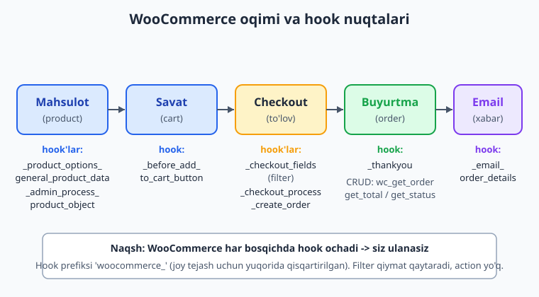
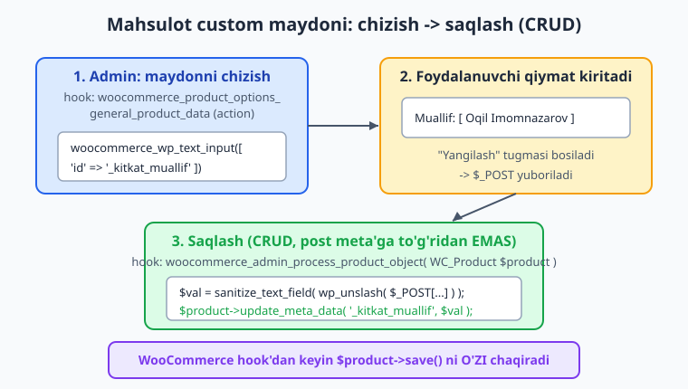
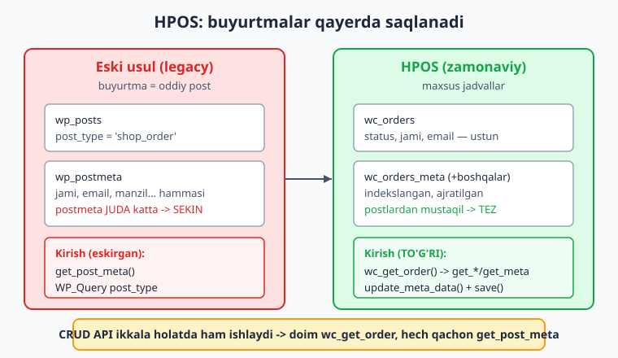

# 27 — WooCommerce kengaytirish (HPOS)

[⬅️ Oldingi: 26 — Performance va keshlash](./26-performance.md) · [🏠 README](./README.md) · [Keyingi: 28 — Distribution: readme.txt, SVN, yangilanish ➡️](./28-distribution.md)

> **Bu bobda:** plugin'ingizni dunyodagi eng mashhur e-commerce plugin'i — **WooCommerce** ustiga quramiz: avval WooCommerce o'rnatilganini xavfsiz tekshirish (`class_exists('WooCommerce')` va yangi `Requires Plugins` header), so'ng WooCommerce'ning hook nuqtalarini (product → cart → checkout → order → email) o'rganib mahsulotga custom maydon (`woocommerce_product_options_general_product_data` + `woocommerce_admin_process_product_object`) va custom data tab (`woocommerce_product_data_tabs` filter + `woocommerce_product_data_panels`) qo'shamiz, checkout'ga o'z maydonimizni (`woocommerce_checkout_fields`) ulab validatsiya qilamiz, eng muhimi — **HPOS (High-Performance Order Storage)** bilan ishlashni: buyurtmalar endi post meta'da emas, maxsus jadvallarda saqlanishini, plugin'imiz muvofiqligini `FeaturesUtil::declare_compatibility('custom_order_tables', __FILE__)` bilan e'lon qilishni va buyurtmalarni post meta o'rniga **CRUD API** (`wc_get_order`, `$order->get_*/update_meta_data/save`) bilan o'qib-yozishni o'rganamiz — "Kitoblar katalogi" g'oyamizni kitobni WooCommerce mahsuloti sifatida sotish va har mahsulotga "muallif" maydonini qo'shish orqali amalda qilib chiqamiz.

---

## Muammo: WooCommerce — boshqa plugin, lekin uni kengaytirish kerak

Tasavvur qiling, "Kitoblar katalogi" plugin'imiz mashhur bo'ldi va sayt egasi endi kitoblarni **sotmoqchi**. To'lov tizimi, savat, soliq, yetkazib berish — bularning hammasini noldan yozish — bir necha yillik ish. Yaxshiyamki, buni allaqachon kimdir qilgan: **WooCommerce** — WordPress uchun eng mashhur e-commerce plugin'i (millionlab saytda ishlaydi).

Lekin WooCommerce — **alohida plugin**, WordPress core emas. Demak siz uni:

- WooCommerce **o'rnatilganini tekshirib** ishlatishingiz kerak (yo'q bo'lsa, sizning kodingiz fatal error bermasligi shart),
- WooCommerce ochib qo'ygan **hook'lari** (action/filter) va **API**'si orqali kengaytirishingiz kerak — uning fayllarini tahrirlash mumkin emas (bu — 01-bobdagi "core'ni tahrirlama" qoidasining aynan o'zi, faqat boshqa plugin uchun).

📌 **Asosiy g'oya:** WooCommerce'ni kengaytirish — bu WordPress'ni kengaytirishning aynan o'zi: hook'lar (4-bob), CPT (07-bob), meta (09-bob), xavfsizlik (12-bob). Yangi narsa faqat **WooCommerce'ning o'z hook nomlari va CRUD API'si**. Sizning bilimingiz to'liq qo'l keladi.

⚠️ **Halol eslatma:** bu bobdagi kodlar docs bilan tasdiqlangan va sintaktik to'g'ri (`php -l` dan o'tgan), lekin WooCommerce bu mashinada o'rnatilmagan, shuning uchun **jonli xatti-harakat illustrativ** — buyurtma sahifasi, mahsulot tahriri, checkout, email faqat **WooCommerce o'rnatilgan saytda** ishlaydi. Har kodni "o'z saytingizda" ohangida o'qing.



---

## 1-qadam: WooCommerce o'rnatilganini tekshirish (dependency)

Sizning plugin'ingiz WooCommerce'ga **bog'liq** (dependency). Agar siz `wc_get_product()` ni WooCommerce o'rnatilmagan saytda chaqirsangiz — `Fatal error: undefined function`. Sayt oqqa aylanadi. Buni oldini olishning ikki yo'li bor.

### Klassik yo'l: `class_exists('WooCommerce')`

WooCommerce o'zining asosiy sinfini `WooCommerce` deb e'lon qiladi. Uni `plugins_loaded` hook'idan **keyin** (barcha plugin'lar yuklangach) tekshiring:

```php
namespace Oqil\KitobKatalog;

// Plugin'lar yuklangach tekshiramiz (WooCommerce ham shu paytda yuklangan bo'ladi)
add_action( 'plugins_loaded', __NAMESPACE__ . '\\woo_integratsiya_boshla' );

function woo_integratsiya_boshla(): void {
    // WooCommerce yo'qmi? -> jim qaytamiz (fatal error YO'Q)
    if ( ! class_exists( 'WooCommerce' ) ) {
        add_action( 'admin_notices', __NAMESPACE__ . '\\woo_yoq_ogohlantirish' );
        return;
    }

    // WooCommerce bor -> integratsiya kodimizni ulaymiz
    add_action( 'woocommerce_product_options_general_product_data', __NAMESPACE__ . '\\muallif_maydoni' );
    add_action( 'woocommerce_admin_process_product_object', __NAMESPACE__ . '\\muallif_saqla' );
}

// Admin'ga WooCommerce kerakligini xushmuomalalik bilan aytamiz
function woo_yoq_ogohlantirish(): void {
    if ( ! current_user_can( 'activate_plugins' ) ) {
        return;
    }
    printf(
        '<div class="notice notice-warning"><p>%s</p></div>',
        esc_html__( 'Kitoblar katalogi: sotish funksiyasi uchun WooCommerce o\'rnating va faollashtiring.', 'kitoblar-katalogi' )
    );
}
```

📌 **`class_exists('WooCommerce')` — `function_exists` emas.** WooCommerce asosiy sinf (`WooCommerce`) bilan aniqlanadi. Ba'zilar `function_exists('WC')` ni ham ishlatadi (`WC()` — global WooCommerce instansiyasiga qaytaruvchi funksiya), lekin sinf tekshiruvi standart usul.

⚠️ Tekshiruvni **`plugins_loaded`'gacha qilmang.** Plugin'lar alifbo tartibida yuklanadi; sizning plugin'ingiz WooCommerce'dan oldin yuklanishi mumkin va o'sha paytda `WooCommerce` sinfi hali mavjud emas. `plugins_loaded` — barcha plugin'lar yuklangach ishlaydigan hook (3-bob).

### Zamonaviy yo'l: `Requires Plugins` header (WP 6.5+)

WordPress 6.5'dan (developer.wordpress.org bilan tasdiqlangan) plugin header'ida **`Requires Plugins`** maydoni paydo bo'ldi. Unga wordpress.org slug'larini vergul bilan yozasiz:

```php
<?php
/**
 * Plugin Name:     Kitoblar katalogi
 * Requires at least: 7.0
 * Requires PHP:    8.3
 * Requires Plugins: woocommerce
 * Text Domain:     kitoblar-katalogi
 */
```

Bu bo'lganda, WordPress **WooCommerce o'rnatilmagan/faolsiz bo'lsa sizning plugin'ingizni faollashtirishga yo'l qo'ymaydi** (admin'da tushunarli xabar ko'rsatadi). Bu — eng toza yechim.

📌 **Ikkalasini birga ishlating:** `Requires Plugins` header faollashuvni boshqaradi (sayt egasiga), `class_exists` tekshiruvi esa kodingizni xavfsiz qiladi (eski WP yoki qirra holatlar uchun). Header — "qo'shimcha tasma", `class_exists` — "asosiy kamar".

💡 `Requires Plugins` faqat **wordpress.org katalogidagi** plugin'lar uchun ishlaydi (slug — katalogdagi nom). Maxsus/premium dependency uchun `class_exists` qoladi.

---

## 2-qadam: WooCommerce hook'lari — qayerga ulanish mumkin

WooCommerce — ulkan hook to'plami. Mahsulot sahifasi, savat, checkout, buyurtma, email — har bir nuqtada o'nlab `do_action`/`apply_filters` bor. Ularning hammasini yodlash shart emas; **naqshni** tushuning: WooCommerce oqimning har bosqichida "shu yerga qo'shimcha qo'shing" deb hook ochib qo'yadi.

Eng ko'p ishlatiladigan hook nuqtalari (barchasi rasmiy WooCommerce manbalari bilan tasdiqlangan):

| Bosqich | Hook | Turi | Vazifa |
|---|---|---|---|
| Mahsulot (admin) | `woocommerce_product_options_general_product_data` | action | "General" tabga custom maydon chizish |
| Mahsulot (admin) | `woocommerce_admin_process_product_object` | action | Custom maydonni saqlash (CRUD bilan) |
| Mahsulot (admin) | `woocommerce_product_data_tabs` | filter | Yangi data tab qo'shish |
| Mahsulot (admin) | `woocommerce_product_data_panels` | action | Tab paneli mazmunini chizish |
| Mahsulot (front) | `woocommerce_before_add_to_cart_button` | action | "Savatga" tugmasidan oldin chizish |
| Checkout | `woocommerce_checkout_fields` | filter | Checkout maydonlarini o'zgartirish |
| Checkout | `woocommerce_after_order_notes` | action | Izoh maydonidan keyin maydon chizish |
| Checkout | `woocommerce_checkout_process` | action | Yuborishda validatsiya |
| Checkout | `woocommerce_checkout_update_order_meta` | action | Buyurtmaga ma'lumot saqlash |
| Buyurtma | `woocommerce_thankyou` | action | "Rahmat" sahifasida ishlash |
| Email | `woocommerce_email_order_details` | action | Email mazmuniga qo'shish |

📌 **Filter qiymat qaytaradi, action qaytarmaydi** (4-bob). `woocommerce_checkout_fields` — **filter**: maydonlar massivini olib, o'zgartirib **qaytarasiz**. `woocommerce_thankyou` — **action**: shunchaki bajarasiz, qiymat qaytarmaysiz.

💡 To'liq ro'yxat: WooCommerce Code Reference'dagi **hooks** sahifasi (`woocommerce.github.io/code-reference/hooks/hooks.html`). Shubha bo'lsa, hook nomini ixtiro qilmang — shu yerdan izlang.

---

## 3-qadam: Mahsulotga custom maydon — "muallif"

Endi har bir kitob-mahsulotga **"Muallif"** maydonini qo'shamiz. Bu ikki bosqich: (1) admin'da maydonni **chizish**, (2) saqlanganda qiymatni **olib saqlash**.

### Maydonni chizish

WooCommerce maydon chizish uchun tayyor yordamchi funksiyalar beradi (`woocommerce_wp_text_input`, `woocommerce_wp_checkbox` — ular label, escaping, razmetkani o'zlari qiladi). "General" tabga maydon qo'shish uchun `woocommerce_product_options_general_product_data` hook'iga ulanamiz:

```php
namespace Oqil\KitobKatalog;

function muallif_maydoni(): void {
    woocommerce_wp_text_input( [
        'id'          => '_kitkat_muallif', // meta kalit (pastki chiziq = yashirin meta)
        'label'       => __( 'Muallif', 'kitoblar-katalogi' ),
        'placeholder' => __( 'Masalan: Oqil Imomnazarov', 'kitoblar-katalogi' ),
        'desc_tip'    => true,
        'description' => __( 'Kitob muallifining ismi.', 'kitoblar-katalogi' ),
    ] );
}
```

ℹ️ `woocommerce_wp_text_input` joriy qiymatni **o'zi** o'qiydi (kontekstdagi `$post`/product orqali) va inputni escaping bilan chizadi. Shuning uchun bu yerda alohida `esc_attr` yozmaysiz — WooCommerce o'z yordamchisida buni bajaradi. Maxsus razmetka kerak bo'lsa, qo'lda yozganda `esc_attr`'ni o'zingiz qo'shasiz.

### Qiymatni saqlash — CRUD bilan, post meta'ga to'g'ridan EMAS

Saqlashda eski usul `update_post_meta($post_id, ...)` edi. **Endi bunday qilmang.** WooCommerce mahsuloti — `WC_Product` obyekti (CRUD). To'g'ri usul — `woocommerce_admin_process_product_object` hook'i: u sizga `WC_Product` obyektini beradi, siz `update_meta_data` qilasiz, WooCommerce keyin `save()` ni o'zi chaqiradi:

```php
namespace Oqil\KitobKatalog;

function muallif_saqla( \WC_Product $product ): void {
    // 1) Input bormi? -> WordPress slash'larini olib, sanitize qilamiz (12-bob)
    if ( ! isset( $_POST['_kitkat_muallif'] ) ) {
        return;
    }

    $muallif = sanitize_text_field( wp_unslash( $_POST['_kitkat_muallif'] ) );

    // 2) post meta'ga TO'G'RIDAN emas -> CRUD obyekt orqali
    $product->update_meta_data( '_kitkat_muallif', $muallif );

    // 3) save() ni O'ZIMIZ chaqirmaymiz: WooCommerce bu hook'dan keyin saqlaydi
}
```

⚠️ **Nonce haqida:** `woocommerce_admin_process_product_object` mahsulotni saqlash oqimi ichida ishlaydi — WooCommerce o'z metabox nonce'sini allaqachon tekshirgan, shuning uchun bu yerda alohida nonce qo'shmaysiz. Lekin `$_POST`'ni **doim** `wp_unslash` + `sanitize_*` bilan tozalang (12-bob) — bu ishonchni almashtirmaydi.

📌 **Nega `update_post_meta` emas?** HPOS va mahsulot CRUD'da WooCommerce ma'lumotni o'z modeli orqali boshqaradi (kesh, sinxronizatsiya, kelajakda jadval o'zgarishi). `$product->update_meta_data()` to'g'ri qatlamdan o'tadi; `update_post_meta` esa modelni chetlab o'tadi va keshni eskirtirishi mumkin.



### Qiymatni front'da o'qish

Mahsulot sahifasida muallifni ko'rsatmoqchimisiz? Mahsulotni `wc_get_product()` bilan oling va `get_meta()` bilan o'qing:

```php
namespace Oqil\KitobKatalog;

add_action( 'woocommerce_single_product_summary', __NAMESPACE__ . '\\muallif_korsat', 25 );

function muallif_korsat(): void {
    global $product;

    // Ehtiyot: $product har doim WC_Product bo'lmasligi mumkin
    if ( ! $product instanceof \WC_Product ) {
        $product = wc_get_product( get_the_ID() );
    }
    if ( ! $product ) {
        return;
    }

    $muallif = $product->get_meta( '_kitkat_muallif' );
    if ( '' === $muallif ) {
        return;
    }

    printf(
        '<p class="kitkat-muallif"><strong>%1$s</strong> %2$s</p>',
        esc_html__( 'Muallif:', 'kitoblar-katalogi' ),
        esc_html( $muallif ) // OUTPUT escape (12-bob)
    );
}
```

📌 `wc_get_product()` — `get_post()` o'rniga. U `WC_Product` obyekti yoki mahsulot bo'lmasa `false`/`null` qaytaradi. `$product->get_meta('kalit')` — `get_post_meta()` o'rniga (CRUD o'qish). Output'da `esc_html` SHART — meta'da nima borligini hech qachon ishonib bo'lmaydi.

---

## 4-qadam: Custom product data tab (qisqacha)

Bitta maydon "General" tabga sig'adi. Lekin kitob uchun bir nechta maydon (ISBN, sahifalar soni, nashriyot) kerak bo'lsa — alohida **tab** chiroyliroq. Ikki hook: `woocommerce_product_data_tabs` (filter — tab qo'shish) va `woocommerce_product_data_panels` (action — panel mazmuni):

```php
namespace Oqil\KitobKatalog;

// 1) Tab qo'shamiz (FILTER -> massivni o'zgartirib QAYTARAMIZ)
add_filter( 'woocommerce_product_data_tabs', __NAMESPACE__ . '\\kitob_tab' );

function kitob_tab( array $tabs ): array {
    $tabs['kitkat'] = [
        'label'    => __( 'Kitob', 'kitoblar-katalogi' ),
        'target'   => 'kitkat_product_data', // panel id (pastdagi div id'si bilan mos)
        'class'    => [ 'show_if_simple' ],   // faqat oddiy mahsulotda ko'rsat
        'priority' => 65,
    ];
    return $tabs; // filter -> QAYTARISH shart
}

// 2) Panel mazmuni (ACTION)
add_action( 'woocommerce_product_data_panels', __NAMESPACE__ . '\\kitob_panel' );

function kitob_panel(): void {
    // div id = tab'dagi 'target' bilan mos bo'lishi SHART
    echo '<div id="kitkat_product_data" class="panel woocommerce_options_panel">';

    woocommerce_wp_text_input( [
        'id'    => '_kitkat_isbn',
        'label' => __( 'ISBN', 'kitoblar-katalogi' ),
    ] );

    woocommerce_wp_text_input( [
        'id'                => '_kitkat_sahifalar',
        'label'             => __( 'Sahifalar soni', 'kitoblar-katalogi' ),
        'type'              => 'number',
        'custom_attributes' => [ 'min' => '1', 'step' => '1' ],
    ] );

    echo '</div>';
}
```

Saqlash — yana o'sha `woocommerce_admin_process_product_object` (har maydon uchun `update_meta_data`). Tab faqat admin UI'ni tartiblaydi; saqlash mantiqi bir xil qoladi.

💡 **Custom product TYPE** ham mumkin (masalan `kitob` deb yangi mahsulot turi — `simple`/`variable` qatorida). Bu `product_type_selector` filter + `WC_Product_*` sinfini kengaytirish bilan qilinadi va ancha kengroq mavzu. Ko'p hollarda **oddiy mahsulot + custom maydon/tab** yetarli — yangi tur murakkablikni faqat zarur bo'lganda qo'shing.

---

## 5-qadam: Checkout maydoni va validatsiya

Aytaylik, kitob sovg'a sifatida sotib olinganda **"Sovg'a yozuvi"** maydonini checkout'da so'ramoqchimiz. Checkout maydonlari `woocommerce_checkout_fields` **filter**i orqali boshqariladi:

```php
namespace Oqil\KitobKatalog;

// 1) Checkout'ga maydon qo'shamiz (FILTER)
add_filter( 'woocommerce_checkout_fields', __NAMESPACE__ . '\\sovga_maydoni' );

function sovga_maydoni( array $fields ): array {
    $fields['order']['_kitkat_sovga_yozuvi'] = [
        'type'        => 'textarea',
        'label'       => __( 'Sovg\'a yozuvi (ixtiyoriy)', 'kitoblar-katalogi' ),
        'placeholder' => __( 'Kitob bilan birga yuboriladi', 'kitoblar-katalogi' ),
        'required'    => false,
        'priority'    => 120,
    ];
    return $fields; // filter -> QAYTARISH shart
}
```

### Validatsiya

Foydalanuvchi maydonni to'ldirsa, uzunligini cheklaymiz. Validatsiya — `woocommerce_checkout_process` action'ida; xato bo'lsa `wc_add_notice(..., 'error')` bilan xabar berasiz (WooCommerce checkout'ni to'xtatadi):

```php
namespace Oqil\KitobKatalog;

add_action( 'woocommerce_checkout_process', __NAMESPACE__ . '\\sovga_validatsiya' );

function sovga_validatsiya(): void {
    if ( empty( $_POST['_kitkat_sovga_yozuvi'] ) ) {
        return; // ixtiyoriy maydon -> bo'sh bo'lsa OK
    }

    $matn = sanitize_textarea_field( wp_unslash( $_POST['_kitkat_sovga_yozuvi'] ) );

    if ( mb_strlen( $matn ) > 200 ) {
        wc_add_notice(
            __( 'Sovg\'a yozuvi 200 belgidan oshmasligi kerak.', 'kitoblar-katalogi' ),
            'error'
        );
    }
}
```

### Buyurtmaga saqlash — CRUD bilan

Endi maydonni **buyurtmaga** saqlaymiz. `woocommerce_checkout_create_order` hook'i bizga `WC_Order` obyektini beradi — CRUD bilan yozamiz:

```php
namespace Oqil\KitobKatalog;

add_action( 'woocommerce_checkout_create_order', __NAMESPACE__ . '\\sovga_saqla', 10, 2 );

function sovga_saqla( \WC_Order $order, array $data ): void {
    if ( empty( $_POST['_kitkat_sovga_yozuvi'] ) ) {
        return;
    }

    $matn = sanitize_textarea_field( wp_unslash( $_POST['_kitkat_sovga_yozuvi'] ) );

    // post meta'ga EMAS -> WC_Order CRUD orqali
    $order->update_meta_data( '_kitkat_sovga_yozuvi', $matn );
    // save() ni o'zimiz chaqirmaymiz: WooCommerce checkout oqimi saqlaydi
}
```

📌 **Bu yerda HPOS naqshi ko'rinadi:** `woocommerce_checkout_create_order` `WC_Order` obyektini beradi va siz `update_meta_data` qilasiz. `update_post_meta($order_id, ...)` ishlatsangiz — HPOS yoqilgan saytda ma'lumot **noto'g'ri joyga** yozilishi yoki sinxrondan chiqishi mumkin. CRUD — yagona to'g'ri yo'l.

---

## 6-qadam: HPOS — buyurtmalar endi maxsus jadvalda

Bu — bobning eng muhim qismi. Yillar davomida WooCommerce buyurtmalarni WordPress'ning oddiy postlari sifatida saqlardi: `wp_posts` jadvalida `shop_order` turi, ma'lumot esa `wp_postmeta`'da. Bu **sekin** edi (postmeta katta saytlarda jud katta bo'lib ketadi).

**HPOS (High-Performance Order Storage)** buni o'zgartirdi: buyurtmalar endi **maxsus jadvallarda** (`wc_orders`, `wc_orders_meta` va boshqalar) saqlanadi — postlar va postmeta'dan ajratilgan, indekslangan, tezroq.



### Plugin'ingiz uchun bu nimani anglatadi?

Ikki narsa:

**(1) Muvofiqlikni e'lon qilish.** WooCommerce HPOS'ni o'chirib qo'ymasligi uchun, plugin'ingiz HPOS bilan **mos** ekanini e'lon qilishi kerak. Buni `before_woocommerce_init` hook'ida `FeaturesUtil::declare_compatibility` bilan qilasiz (developer.woocommerce.com bilan tasdiqlangan):

```php
namespace Oqil\KitobKatalog;

add_action( 'before_woocommerce_init', __NAMESPACE__ . '\\hpos_muvofiqlik' );

function hpos_muvofiqlik(): void {
    // Sinf mavjudligini tekshiramiz (eski WooCommerce'da bo'lmasligi mumkin)
    if ( class_exists( \Automattic\WooCommerce\Utilities\FeaturesUtil::class ) ) {
        \Automattic\WooCommerce\Utilities\FeaturesUtil::declare_compatibility(
            'custom_order_tables', // feature kaliti
            __FILE__,              // PLUGIN ASOSIY fayli (shu funksiya joylashgan fayl emas, bootstrap fayl)
            true                   // true = mos (mos emas bo'lsa false)
        );
    }
}
```

⚠️ **`__FILE__` — plugin'ning ASOSIY (bootstrap) faylini ko'rsatishi kerak.** Agar bu kod alohida `includes/` faylida bo'lsa, `__FILE__` noto'g'ri yo'lni beradi. To'g'ri yo'l: asosiy plugin faylida konstanta saqlang (`define('KITKAT_FILE', __FILE__)`) yoki bu hook'ni asosiy faylda ro'yxatdan o'tkazing.

**(2) Post meta'ga to'g'ridan EMAS — CRUD API.** HPOS yoqilganda buyurtma `wp_postmeta`'da bo'lmaydi. `get_post_meta($order_id, ...)` **bo'sh** qaytaradi. Siz CRUD'dan foydalanishingiz **shart**.

### Buyurtmani CRUD bilan o'qish (HPOS-xavfsiz)

Buyurtmani `wc_get_order()` bilan oling, ma'lumotni getter'lar bilan o'qing:

```php
namespace Oqil\KitobKatalog;

function buyurtma_xulosasi( int $order_id ): array|false {
    $order = wc_get_order( $order_id ); // get_post() EMAS

    if ( ! $order instanceof \WC_Order ) {
        return false; // buyurtma topilmadi
    }

    return [
        // Standart getter'lar (rasmiy WC_Order metodlari)
        'id'      => $order->get_id(),
        'status'  => $order->get_status(),          // 'processing', 'completed', ...
        'jami'    => $order->get_total(),           // float
        'email'   => $order->get_billing_email(),
        'ism'     => $order->get_billing_first_name(),
        'tolov'   => $order->get_payment_method(),
        // Bizning custom meta'mizni CRUD bilan o'qiymiz
        'sovga'   => $order->get_meta( '_kitkat_sovga_yozuvi' ),
        // Buyurtmadagi mahsulotlar
        'mahsulot_soni' => count( $order->get_items() ),
    ];
}
```

📌 **Eslab qoling — getter'lar:** `get_id()`, `get_status()`, `get_total()`, `get_billing_email()`, `get_billing_first_name()`, `get_payment_method()`, `get_meta($key)`, `get_items()`. Bularning hammasi `WC_Order` (va ota-sinflari) public metodlari — WooCommerce Code Reference bilan tasdiqlangan. Custom meta uchun `get_meta()`, yozish uchun `update_meta_data()` + `save()`.

### Buyurtmani CRUD bilan yangilash

Buyurtmaga ma'lumot **yozsangiz** — `update_meta_data()` qiling va `save()` ni chaqiring (checkout oqimidan tashqarida o'zingiz yozsangiz):

```php
namespace Oqil\KitobKatalog;

function buyurtmaga_belgi_qoy( int $order_id, string $belgi ): bool {
    $order = wc_get_order( $order_id );
    if ( ! $order instanceof \WC_Order ) {
        return false;
    }

    $order->update_meta_data( '_kitkat_yetkazish_belgisi', sanitize_text_field( $belgi ) );
    $order->save(); // DB ga yozadi (HPOS yoqilgan bo'lsa wc_orders_meta ga)

    return true;
}
```

⚠️ **`save()` ni unutmang.** `update_meta_data()` ma'lumotni faqat **xotiradagi** obyektga qo'yadi. `save()` ni chaqirmasangiz, DB ga yozilmaydi (checkout hook'larida WooCommerce o'zi `save()` qiladi, lekin mustaqil kodingizda — siz chaqirasiz).

💡 **HPOS'ni qanday tekshirish?** Kod ichida HPOS yoqilganini bilish kerak bo'lsa: `\Automattic\WooCommerce\Utilities\OrderUtil::custom_orders_table_usage_is_enabled()`. Lekin CRUD'ni to'g'ri ishlatsangiz — HPOS yoqilgan yoki yo'qligidan **qat'i nazar** kodingiz ishlaydi. Aynan shuning uchun CRUD afzal: bitta kod ikkala holatda ham to'g'ri.

📌 **HPOS qoidasini bitta jumlada:** buyurtma bilan ishlaganda `get_post`/`get_post_meta`/`update_post_meta`/`WP_Query`'ni **unuting** — `wc_get_order` + getter'lar + `update_meta_data`/`save` (va so'rov uchun `wc_get_orders()`). Shunda kodingiz HPOS-tayyor bo'ladi.

---

## Birga qo'yamiz: integratsiya sinfi

Email, maydon, HPOS — hammasini bitta sinfga yig'amiz. Bu — "Kitoblar katalogi" plugin'ining WooCommerce qatlami:

```php
// kitoblar-katalogi/includes/class-woo-integratsiya.php
namespace Oqil\KitobKatalog;

class WooIntegratsiya {

    /** Asosiy plugin faylida define qilingan konstanta (HPOS __FILE__ uchun). */
    public static function boshla(): void {
        // HPOS muvofiqligi -> before_woocommerce_init (ASOSIY faylda yoki konstanta bilan)
        add_action( 'before_woocommerce_init', [ self::class, 'hpos_muvofiqlik' ] );

        // WooCommerce bormi? -> integratsiyani ulaymiz
        add_action( 'plugins_loaded', [ self::class, 'ulang' ] );
    }

    public static function hpos_muvofiqlik(): void {
        if ( class_exists( \Automattic\WooCommerce\Utilities\FeaturesUtil::class )
            && defined( 'KITKAT_FILE' ) ) {
            \Automattic\WooCommerce\Utilities\FeaturesUtil::declare_compatibility(
                'custom_order_tables',
                KITKAT_FILE, // asosiy plugin fayli
                true
            );
        }
    }

    public static function ulang(): void {
        if ( ! class_exists( 'WooCommerce' ) ) {
            return; // WooCommerce yo'q -> jim qaytamiz
        }

        add_action( 'woocommerce_product_options_general_product_data', [ self::class, 'muallif_maydoni' ] );
        add_action( 'woocommerce_admin_process_product_object', [ self::class, 'muallif_saqla' ] );
        add_action( 'woocommerce_single_product_summary', [ self::class, 'muallif_korsat' ], 25 );
    }

    public static function muallif_maydoni(): void {
        woocommerce_wp_text_input( [
            'id'    => '_kitkat_muallif',
            'label' => __( 'Muallif', 'kitoblar-katalogi' ),
        ] );
    }

    public static function muallif_saqla( \WC_Product $product ): void {
        if ( ! isset( $_POST['_kitkat_muallif'] ) ) {
            return;
        }
        $product->update_meta_data(
            '_kitkat_muallif',
            sanitize_text_field( wp_unslash( $_POST['_kitkat_muallif'] ) )
        );
    }

    public static function muallif_korsat(): void {
        global $product;
        if ( ! $product instanceof \WC_Product ) {
            return;
        }
        $muallif = $product->get_meta( '_kitkat_muallif' );
        if ( '' !== $muallif ) {
            printf(
                '<p class="kitkat-muallif"><strong>%1$s</strong> %2$s</p>',
                esc_html__( 'Muallif:', 'kitoblar-katalogi' ),
                esc_html( $muallif )
            );
        }
    }
}
```

Asosiy plugin faylida (bootstrap): `define( 'KITKAT_FILE', __FILE__ );` so'ng `\Oqil\KitobKatalog\WooIntegratsiya::boshla();`.

💡 Bu sinf to'rt g'oyani birlashtiradi: (1) HPOS muvofiqligi (`before_woocommerce_init` + `FeaturesUtil`), (2) xavfsiz dependency tekshiruvi (`plugins_loaded` + `class_exists`), (3) mahsulot custom maydoni (CRUD bilan saqlash), (4) front'da escaping bilan ko'rsatish. Aynan shu — ishonchli WooCommerce kengaytmasining skeleti.

---

## Xulosa

- **Dependency:** WooCommerce — alohida plugin. `plugins_loaded` hook'ida `class_exists('WooCommerce')` bilan tekshiring (fatal error'dan saqlaydi) + zamonaviy `Requires Plugins: woocommerce` header (WP 6.5+, faollashuvni boshqaradi). Ikkalasini birga.
- **Hook'lar:** WooCommerce oqimning har bosqichida hook ochadi — mahsulot (`woocommerce_product_options_general_product_data`, `woocommerce_admin_process_product_object`, `woocommerce_product_data_tabs` filter, `woocommerce_product_data_panels`), checkout (`woocommerce_checkout_fields` filter, `woocommerce_checkout_process`, `woocommerce_checkout_create_order`), buyurtma (`woocommerce_thankyou`), email. Hook nomini ixtiro qilmang — Code Reference'dan izlang.
- **Mahsulot maydoni:** `woocommerce_wp_text_input` bilan chizing, `woocommerce_admin_process_product_object` (sizga `WC_Product` beradi) da `sanitize` qilib `update_meta_data` bilan saqlang (post meta'ga to'g'ridan EMAS), o'qishda `wc_get_product()` + `get_meta()`, output'da `esc_html`.
- **HPOS:** buyurtmalar maxsus jadvallarda. (1) `before_woocommerce_init` da `FeaturesUtil::declare_compatibility('custom_order_tables', __FILE__, true)` bilan muvofiqlik e'lon qiling, (2) buyurtma bilan **faqat CRUD**: `wc_get_order`, `get_*` getter'lar, `update_meta_data` + `save()` — `get_post`/`get_post_meta`/`update_post_meta` ishlatmang. Shunda kodingiz HPOS yoqilgan/o'chirilgan ikkala holatda ham ishlaydi.

Keyingi bobda plugin'ingizni **tarqatishga** o'tamiz: `readme.txt`, wordpress.org SVN repozitoriysi va avtomatik yangilanish mexanizmi.

---

## 27-bob mashqlari

### Oson

1. **(Oson)** WooCommerce o'rnatilganini qaysi sinf bilan tekshirasiz? Bu tekshiruvni qaysi hook'dan keyin qilish kerak va nega `plugins_loaded`'gacha qilmaslik kerak?
2. **(Oson)** Plugin header'ida WooCommerce'ni dependency qilib e'lon qiluvchi qatorni yozing. Bu maydon qaysi WP versiyasidan boshlab ishlaydi va qanaqa slug kerak?
3. **(Oson)** Filter va action farqini WooCommerce misolida ayting: `woocommerce_checkout_fields` va `woocommerce_thankyou` — qaysi biri qiymat qaytaradi, qaysi biri yo'q?
4. **(Oson)** HPOS nima va u buyurtmalarni qayerda saqlaydi (eski usuldan farqi)? Plugin'ingiz buyurtmani o'qiganda qaysi funksiyani ishlatishi kerak: `get_post()` yoki `wc_get_order()`?
5. **(Oson)** `WC_Order` obyektidan buyurtma jami summasi, statusi va billing emailini oluvchi uchta getter metodini yozing.
6. **(Oson)** Nega buyurtma meta'siga `update_post_meta()` o'rniga `$order->update_meta_data()` + `$order->save()` ishlatish kerak (HPOS kontekstida)?

### O'rta

7. **(O'rta)** `plugins_loaded`'da WooCommerce yo'qligini tekshirib, yo'q bo'lsa admin'ga `notice-warning` ko'rsatuvchi to'liq funksiya yozing. `current_user_can` bilan ruxsatni tekshiring va matnni escape qiling.
8. **(O'rta)** Mahsulotning "General" tabiga `woocommerce_wp_text_input` bilan "ISBN" maydonini qo'shuvchi funksiya va uni hook'ga ulovchi `add_action` yozing.
9. **(O'rta)** `woocommerce_admin_process_product_object` hook'iga ulanib, ISBN maydonini `sanitize_text_field` + `wp_unslash` bilan tozalab CRUD orqali saqlovchi funksiya yozing. Nega bu yerda `save()` ni o'zingiz chaqirmaysiz?
10. **(O'rta)** `woocommerce_checkout_fields` filteriga "Sovg'a yozuvi" (textarea, ixtiyoriy) maydonini qo'shuvchi funksiya yozing. Filter nimani qaytarishi shart?

### Qiyin

11. **(Qiyin)** Plugin'ingiz HPOS bilan mos ekanini e'lon qiluvchi to'liq kodni yozing: to'g'ri hook, `class_exists` tekshiruvi, `FeaturesUtil::declare_compatibility` to'g'ri uch argumenti bilan. `__FILE__` muammosini izohlang.

    <details markdown="1"><summary>Yechim</summary>

    ```php
    namespace Oqil\KitobKatalog;

    // Bu kod plugin'ning ASOSIY (bootstrap) faylida bo'lishi kerak,
    // chunki __FILE__ asosiy plugin faylini ko'rsatishi SHART.
    add_action( 'before_woocommerce_init', __NAMESPACE__ . '\\hpos_muvofiqlik' );

    function hpos_muvofiqlik(): void {
        if ( class_exists( \Automattic\WooCommerce\Utilities\FeaturesUtil::class ) ) {
            \Automattic\WooCommerce\Utilities\FeaturesUtil::declare_compatibility(
                'custom_order_tables', // feature kaliti
                __FILE__,              // asosiy plugin fayli
                true                   // true = mos
            );
        }
    }
    ```

    **Tushuntirish:** muvofiqlik `before_woocommerce_init` hook'ida e'lon qilinishi shart — WooCommerce o'z featurelarini shu paytda yig'adi. `class_exists` tekshiruvi eski WooCommerce'da `FeaturesUtil` bo'lmasligi mumkinligi uchun. Uchinchi argument `true` — mos, `false` — mos emas (WooCommerce HPOS'ni majburlamaydi). `__FILE__` muammosi: agar bu kod `includes/` ichidagi faylda bo'lsa, `__FILE__` o'sha faylni ko'rsatadi — WooCommerce esa plugin'ning **asosiy** faylini kutadi. Yechim: bu hook'ni asosiy faylda ro'yxatdan o'tkazing yoki asosiy faylda `define('KITKAT_FILE', __FILE__)` qilib, shu konstantani uzating.
    </details>

12. **(Qiyin)** Buyurtmani CRUD bilan to'liq o'qiydigan funksiya yozing: `wc_get_order`, obyekt tekshiruvi, id/status/jami/email getter'lari va bizning custom meta'miz (`_kitkat_sovga_yozuvi`) ni `get_meta` bilan. HPOS-xavfsiz bo'lsin (post meta YO'Q).

    <details markdown="1"><summary>Yechim</summary>

    ```php
    namespace Oqil\KitobKatalog;

    function buyurtma_malumoti( int $order_id ): array|false {
        $order = wc_get_order( $order_id ); // get_post() EMAS

        if ( ! $order instanceof \WC_Order ) {
            return false; // buyurtma topilmadi
        }

        return [
            'id'     => $order->get_id(),
            'status' => $order->get_status(),
            'jami'   => $order->get_total(),
            'email'  => $order->get_billing_email(),
            // custom meta -> get_post_meta EMAS, CRUD get_meta
            'sovga'  => $order->get_meta( '_kitkat_sovga_yozuvi' ),
        ];
    }
    ```

    **Tushuntirish:** `wc_get_order()` HPOS yoqilgan yoki yo'qligidan qat'i nazar to'g'ri `WC_Order` obyektini qaytaradi — shuning uchun bitta kod ikkala holatda ishlaydi. `instanceof \WC_Order` tekshiruvi: `wc_get_order` mavjud bo'lmasa `false` qaytaradi. Getter'lar (`get_id`, `get_status`, `get_total`, `get_billing_email`) — `WC_Order` public metodlari. Custom meta uchun `get_meta()` — `get_post_meta()` HPOS'da bo'sh qaytaradi, shuning uchun ishlatilmaydi.
    </details>

13. **(Qiyin)** Checkout maydonini buyurtmaga CRUD bilan saqlovchi to'liq oqimni yozing: maydonni qo'shish (`woocommerce_checkout_fields`), validatsiya (`woocommerce_checkout_process`, 200 belgidan kam), va saqlash (`woocommerce_checkout_create_order` — `WC_Order` CRUD).

    <details markdown="1"><summary>Yechim</summary>

    ```php
    namespace Oqil\KitobKatalog;

    // 1) Maydon qo'shamiz (FILTER)
    add_filter( 'woocommerce_checkout_fields', __NAMESPACE__ . '\\sovga_qosh' );
    function sovga_qosh( array $fields ): array {
        $fields['order']['_kitkat_sovga_yozuvi'] = [
            'type'     => 'textarea',
            'label'    => __( 'Sovg\'a yozuvi', 'kitoblar-katalogi' ),
            'required' => false,
        ];
        return $fields; // filter -> QAYTARISH shart
    }

    // 2) Validatsiya (ACTION)
    add_action( 'woocommerce_checkout_process', __NAMESPACE__ . '\\sovga_tekshir' );
    function sovga_tekshir(): void {
        if ( empty( $_POST['_kitkat_sovga_yozuvi'] ) ) {
            return; // ixtiyoriy
        }
        $matn = sanitize_textarea_field( wp_unslash( $_POST['_kitkat_sovga_yozuvi'] ) );
        if ( mb_strlen( $matn ) > 200 ) {
            wc_add_notice(
                __( 'Sovg\'a yozuvi 200 belgidan oshmasin.', 'kitoblar-katalogi' ),
                'error'
            );
        }
    }

    // 3) Buyurtmaga saqlash (ACTION -> WC_Order CRUD)
    add_action( 'woocommerce_checkout_create_order', __NAMESPACE__ . '\\sovga_yoz', 10, 2 );
    function sovga_yoz( \WC_Order $order, array $data ): void {
        if ( empty( $_POST['_kitkat_sovga_yozuvi'] ) ) {
            return;
        }
        $matn = sanitize_textarea_field( wp_unslash( $_POST['_kitkat_sovga_yozuvi'] ) );
        $order->update_meta_data( '_kitkat_sovga_yozuvi', $matn ); // CRUD
        // save() ni o'zimiz chaqirmaymiz: checkout oqimi saqlaydi
    }
    ```

    **Tushuntirish:** uch bosqich uch xil hook turi. Maydon qo'shish — **filter** (`woocommerce_checkout_fields`), massivni o'zgartirib qaytarasiz. Validatsiya — **action** (`woocommerce_checkout_process`), xato bo'lsa `wc_add_notice(..., 'error')` checkout'ni to'xtatadi. Saqlash — **action** (`woocommerce_checkout_create_order`) sizga `WC_Order` beradi; `update_meta_data` CRUD bilan yozasiz (post meta'ga to'g'ridan emas — HPOS-xavfsiz). Har bosqichda `wp_unslash` + `sanitize_*` (12-bob).
    </details>

14. **(Qiyin)** Custom product data **tab** qo'shing: `woocommerce_product_data_tabs` filteri bilan "Kitob" tab, `woocommerce_product_data_panels` action'i bilan ichida ISBN va sahifalar soni maydonlari. Panel `id` va tab `target` mosligini izohlang.

    <details markdown="1"><summary>Yechim</summary>

    ```php
    namespace Oqil\KitobKatalog;

    // 1) Tab (FILTER)
    add_filter( 'woocommerce_product_data_tabs', __NAMESPACE__ . '\\kitob_tab' );
    function kitob_tab( array $tabs ): array {
        $tabs['kitkat'] = [
            'label'    => __( 'Kitob', 'kitoblar-katalogi' ),
            'target'   => 'kitkat_product_data', // panel div id'si bilan MOS
            'class'    => [ 'show_if_simple' ],
            'priority' => 65,
        ];
        return $tabs;
    }

    // 2) Panel (ACTION)
    add_action( 'woocommerce_product_data_panels', __NAMESPACE__ . '\\kitob_panel' );
    function kitob_panel(): void {
        echo '<div id="kitkat_product_data" class="panel woocommerce_options_panel">';
        woocommerce_wp_text_input( [
            'id'    => '_kitkat_isbn',
            'label' => __( 'ISBN', 'kitoblar-katalogi' ),
        ] );
        woocommerce_wp_text_input( [
            'id'                => '_kitkat_sahifalar',
            'label'             => __( 'Sahifalar soni', 'kitoblar-katalogi' ),
            'type'              => 'number',
            'custom_attributes' => [ 'min' => '1', 'step' => '1' ],
        ] );
        echo '</div>';
    }
    ```

    **Tushuntirish:** tab'dagi `target` (`kitkat_product_data`) va panel `<div>`ning `id`si **bir xil bo'lishi SHART** — WooCommerce tab bosilganda shu id'li panelni ko'rsatadi; mos kelmasa panel ochilmaydi. `class => ['show_if_simple']` — tab faqat "Oddiy mahsulot" turida ko'rinadi. Tab — **filter** (massiv qaytariladi), panel — **action** (HTML chiqariladi). Saqlash o'sha `woocommerce_admin_process_product_object` orqali (har `_kitkat_*` maydon uchun `update_meta_data`).
    </details>

15. **(Qiyin)** Sof-PHP funksiya yozing (WordPress/WooCommerce'siz ishlaydi): buyurtma statusini qabul qilib, "to'langan" deb hisoblanadigan statuslar (`processing`, `completed`) ro'yxatida bo'lsa `true` qaytarsin. Buni `php -r` bilan haqiqatan ishga tushiring.

    <details markdown="1"><summary>Yechim</summary>

    ```php
    function tolangan_status( string $status ): bool {
        // WooCommerce statuslari 'wc-' prefiksisiz keladi (get_status() shunaqa qaytaradi)
        $tolangan = [ 'processing', 'completed', 'on-hold' ];
        return in_array( $status, $tolangan, true );
    }

    // Test (php -r bilan ishlaydi, WooCommerce kerak emas):
    var_dump( tolangan_status( 'completed' ) );  // bool(true)
    var_dump( tolangan_status( 'processing' ) ); // bool(true)
    var_dump( tolangan_status( 'pending' ) );    // bool(false)
    var_dump( tolangan_status( 'cancelled' ) );  // bool(false)
    ```

    **Tushuntirish:** bu funksiya WooCommerce'ga tayanmaydi — sof PHP mantiq, shuning uchun `php -r` bilan haqiqatan tekshirish mumkin (`wc_get_order` esa WooCommerce'ni talab qiladi, faqat `php -l` bilan). `WC_Order::get_status()` statusni `wc-` prefiksisiz qaytaradi (masalan `wc-completed` emas, `completed`) — shuning uchun ro'yxatda prefiks yo'q. `in_array(..., true)` — qat'iy taqqoslash (tip ham mos kelishi). Bu — buyurtma statusi mantiqini izolyatsiya qilib testlash usuli.
    </details>

---

[⬅️ Oldingi: 26 — Performance va keshlash](./26-performance.md) · [🏠 README](./README.md) · [Keyingi: 28 — Distribution: readme.txt, SVN, yangilanish ➡️](./28-distribution.md)
