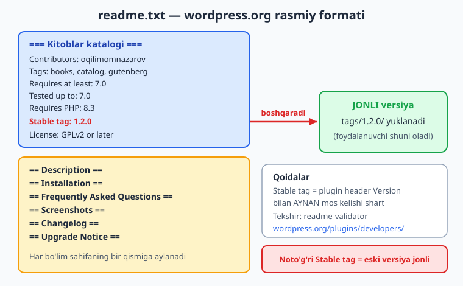
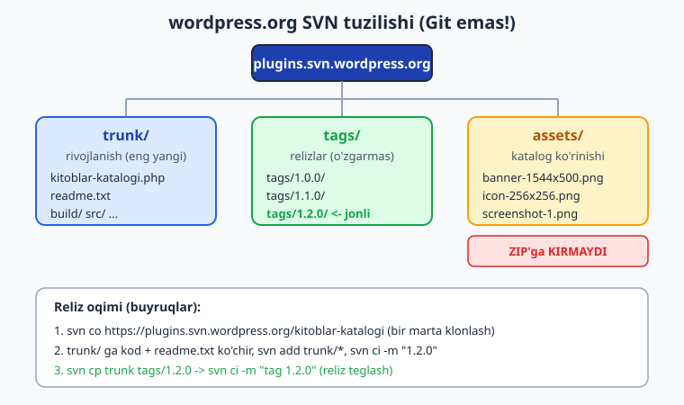
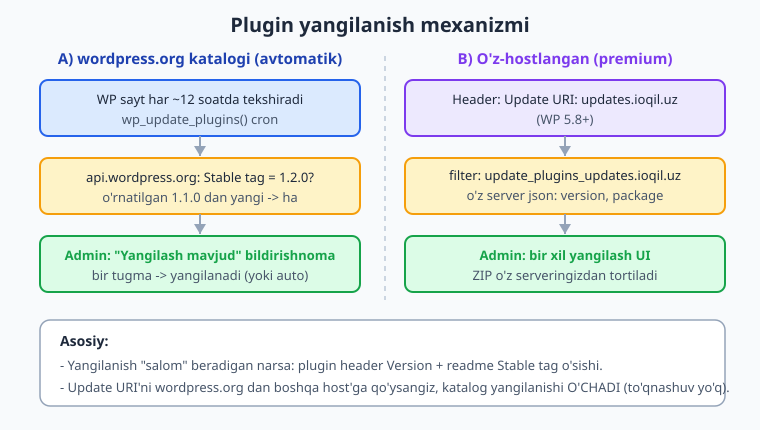

# 28 — Distribution: readme.txt, SVN, yangilanish

[⬅️ Oldingi: 27 — WooCommerce kengaytirish (HPOS)](./27-woocommerce.md) · [🏠 README](./README.md) · [Keyingi: 29 — Xavfsizlik auditi (chuqur) ➡️](./29-xavfsizlik-audit.md)

> **Bu bobda:** "Kitoblar katalogi" plugin'ini dunyoga chiqarishni — tarqatish (distribution) — to'liq o'rganamiz: uch yo'l (wordpress.org bepul katalogi, o'z saytdan premium sotish, GitHub), wordpress.org talab qiladigan RASMIY `readme.txt` formati (`=== Plugin Name ===` header, `Contributors`/`Tags`/`Requires at least`/`Tested up to`/`Requires PHP`/`Stable tag`/`License`, va `== Description ==` ... `== Upgrade Notice ==` bo'limlari), `Stable tag` qaysi versiya jonli ekanini qanday boshqarishi va readme validator, wordpress.org Git emas **SVN** ekani (`trunk/`, `tags/<versiya>/`, `assets/` — `svn co`/`add`/`ci`/`cp` oqimi), semver bo'yicha versiyalash va plugin header `Version` bilan readme `Stable tag` mosligi, hamda yangilanish mexanizmi — wordpress.org avtomatik version-check va o'z-hostlangan plugin uchun `Update URI` header (WP 5.8+) + `update_plugins_{hostname}` filter — natijada plugin'ni professional tarqatib, yangilashga tayyor qilamiz.

---

## Muammo: plugin tayyor — endi uni odamlarga qanday yetkazasiz?

27 bobda "Kitoblar katalogi" plugin'i deyarli to'liq: CPT `kitob`, `janr` taksonomiyasi, sozlamalar, REST endpoint, Gutenberg blok, hatto WooCommerce integratsiyasi ham bor. U sizning kompyuteringizda `wp-content/plugins/kitoblar-katalogi/` papkasida turibdi. Lekin u faqat **sizda**.

Endi savol: boshqa odamlar buni qanday o'rnatadi? Va eng muhimi — siz `1.2.0` versiyasini chiqarsangiz, ulardagi `1.1.0` qanday qilib **avtomatik** yangilanadi?

Bu — **distribution** (tarqatish). Bu bob koddan emas, **jarayon va format**dan iborat: qaysi kanal, qanday paket, qanday yangilanish. Buni noto'g'ri qilsangiz — yaxshi plugin'ingiz hech kimga yetib bormaydi yoki yangilanmay qoladi.

📌 **Distribution = koddan keyingi ish.** Plugin'ning sifati uni qancha odam ishlatishini belgilamaydi — uni qanday tarqatganingiz belgilaydi. Bu bobni o'tkazib yubormang.

---

## Uch tarqatish yo'li

Plugin'ni odamlarga yetkazishning uchta asosiy yo'li bor. Ko'pincha bir necha yo'l birga ishlatiladi.

| Yo'l | Kim uchun | Yangilanish | Pul |
|---|---|---|---|
| **wordpress.org katalogi** | Bepul plugin'lar, eng katta auditoriya | Avtomatik (wordpress.org API) | Bepul |
| **O'z saytdan (premium)** | Pullik / yopiq plugin'lar | O'z server + `Update URI` | Pullik |
| **GitHub** | Ochiq kod, dasturchilar | Qo'lda yoki maxsus kutubxona | Bepul |

- **wordpress.org** — eng katta do'kon. Foydalanuvchi wp-admin > "Plugins > Add New" dan qidirib, bir tugma bilan o'rnatadi. Yangilanish ham avtomatik. Sharti: kod GPL-mos bo'lishi va review'dan o'tishi. Bepul plugin'lar uchun standart.
- **O'z saytdan** — premium (pullik) plugin'lar shunday sotiladi. Foydalanuvchi ZIP yuklab, qo'lda o'rnatadi; yangilanish uchun siz o'z update serveringizni qurasiz (`Update URI`, pastda).
- **GitHub** — manba kod uchun. Dasturchilar `git clone` yoki Release ZIP bilan oladi. Oddiy foydalanuvchi uchun qulay emas (avtomatik yangilanish yo'q), lekin ko'pincha wordpress.org bilan **birga** ishlatiladi (rivojlanish GitHub'da, reliz wordpress.org'da).

💡 Eng keng tarqalgan kombinatsiya: **rivojlanish GitHub'da** (issue, pull request, jamoa), **reliz wordpress.org'da** (foydalanuvchilar va avtomatik yangilanish). Premium qism alohida o'z saytdan.

---

## `readme.txt` — wordpress.org rasmiy formati

Bu bobning yuragi. `readme.txt` — bu oddiy matn fayli **emas**: wordpress.org buni o'qib, sizning katalog sahifangizni (tavsif, skrinshot, changelog, "Add New" qidiruvi) generatsiya qiladi. Format **qat'iy** — Markdown emas, wordpress.org'ning o'z varianti.

⚠️ Bu fayl nomi aniq `readme.txt` (kichik harf, `.txt`). `README.md` emas — u GitHub uchun. Plugin papkasining ildizida turishi shart.



### Header (eng tepasi)

Fayl `=== Plugin Name ===` bilan boshlanadi (uch teng belgi har tomonda), so'ng `Maydon: qiymat` qatorlari:

```text
=== Kitoblar katalogi ===
Contributors: oqilimomnazarov
Donate link: https://ioqil.uz/donate
Tags: books, catalog, cpt, library, gutenberg
Requires at least: 7.0
Tested up to: 7.0
Requires PHP: 8.3
Stable tag: 1.2.0
License: GPLv2 or later
License URI: https://www.gnu.org/licenses/gpl-2.0.html

Kitoblar katalogini yuritish: kitob CPT, janr taksonomiyasi, REST API va Gutenberg blok.
```

Header maydonlari (developer.wordpress.org Plugin Handbook bilan tasdiqlangan):

| Maydon | Ma'nosi |
|---|---|
| `Contributors` | wordpress.org foydalanuvchi nomlari (vergul bilan). Email yoki to'liq ism EMAS. |
| `Donate link` | Ixtiyoriy: xayriya havolasi. |
| `Tags` | Qidiruv teglari (vergul bilan), maksimum 5 ta hisobga olinadi. |
| `Requires at least` | Minimal WordPress versiyasi (`7.0`). |
| `Tested up to` | Siz sinab ko'rgan eng so'nggi WP versiyasi. |
| `Requires PHP` | Minimal PHP versiyasi (`8.3`). |
| `Stable tag` | **Eng muhim** — qaysi versiya jonli (pastda alohida). |
| `License` | `GPLv2 or later` (WordPress ekotizimi talabi). |
| `License URI` | Litsenziya matni havolasi. |
| `Requires Plugins` | Ixtiyoriy: bog'liq plugin'lar slug'lari (WP 6.5+). |

Header'dan keyingi bir qator — **qisqa tavsif** (150 belgigacha), qidiruv natijasida ko'rinadi.

### Bo'limlar (`== ... ==`)

Header'dan so'ng bo'limlar keladi, har biri `== Bo'lim nomi ==` bilan. wordpress.org tan oladigan asosiy bo'limlar:

```text
== Description ==

Kitoblar katalogi plugin'i saytingizga to'liq kitob katalogi qo'shadi.

* Kitob uchun maxsus post turi (CPT `kitob`)
* Janr taksonomiyasi
* REST endpoint: `/wp-json/kitkat/v1/kitoblar`
* Gutenberg blok: kitoblar ro'yxati

== Installation ==

1. Plugin papkasini `/wp-content/plugins/` ga nusxalang.
2. "Plugins" menyusidan faollashtiring.
3. "Kitoblar" menyusidan kitob qo'shing.

== Frequently Asked Questions ==

= Necha kitob qo'sha olaman? =

Cheklov yo'q.

= REST endpoint ochiqmi? =

Ha, o'qish uchun ochiq.

== Screenshots ==

1. Kitoblar ro'yxati admin'da.
2. Gutenberg blok muharrirda.

== Changelog ==

= 1.2.0 =
* Yangi: Gutenberg blok qo'shildi.

= 1.1.0 =
* Yangi: REST endpoint.

= 1.0.0 =
* Birinchi reliz.

== Upgrade Notice ==

= 1.2.0 =
Gutenberg blok qo'shildi. Yangilash xavfsiz.
```

Har bo'lim haqida:

- **`== Description ==`** — katalog sahifasidagi asosiy matn. Markdown-ga o'xshash: `*` ro'yxat, `` ` `` kod, `**qalin**`.
- **`== Installation ==`** — o'rnatish bosqichlari.
- **`== Frequently Asked Questions ==`** — har savol `= Savol? =` ko'rinishida ichki sarlavha.
- **`== Screenshots ==`** — raqamli ro'yxat; har raqam `assets/screenshot-1.png`, `screenshot-2.png` faylga mos keladi (pastda SVN'da).
- **`== Changelog ==`** — har versiya `= 1.2.0 =` ichki sarlavhasi ostida o'zgarishlar. **Eng yangi tepada.**
- **`== Upgrade Notice ==`** — qisqa (300 belgigacha) yangilash ogohlantirishi; admin'da "details" da ko'rinadi. "Bu yangilanishda nima muhim?" degan savolga javob.

ℹ️ Bo'limlar tartibi ixtiyoriy, lekin yuqoridagi tartib odat. `Screenshots` raqamlari `assets/` dagi fayl nomlari bilan bir xil tartibda bo'lishi shart.

### `Stable tag` — eng nozik maydon

Bu maydon **qaysi versiya foydalanuvchiga yetkaziladi**ni belgilaydi. Tushunish uchun SVN tuzilishini eslang (pastda): kodingiz `trunk/` da rivojlanadi, har reliz `tags/1.2.0/` ga nusxalanadi. wordpress.org `trunk/readme.txt` dagi `Stable tag` ni o'qiydi va aytadi: "jonli versiya — `tags/1.2.0/`".

📌 **Qoida:** `Stable tag: 1.2.0` bo'lsa, foydalanuvchi `tags/1.2.0/` papkasidagi kodni oladi — `trunk/` ni emas. Demak relizni teglashni unutsangiz (faqat `trunk/` ga yangiladingiz, lekin `tags/` yaratmadingiz), `Stable tag` mavjud bo'lmagan tegga ishora qiladi va yangilanish **buziladi**.

⚠️ **`Stable tag` plugin header `Version` bilan AYNAN mos kelishi shart.** Plugin asosiy faylida `Version: 1.2.0`, readme'da `Stable tag: 1.2.0`. Mos kelmasa — yangilanish noto'g'ri ishlaydi yoki umuman ishlamaydi. Bu eng ko'p uchraydigan distribution xatosi.

Maxsus holat: `Stable tag: trunk` — wordpress.org `tags/` ni inkor qilib, to'g'ridan `trunk/` ni jonli versiya qiladi. **Tavsiya etilmaydi** — teglangan reliz aniq va orqaga qaytarish (rollback) oson; `trunk` esa beqaror bo'lishi mumkin.

### readme validator

Yozganingizdan keyin formatni **tekshiring**. wordpress.org rasmiy validator beradi: `https://wordpress.org/plugins/developers/readme-validator/`. readme.txt'ni o'sha yerga qo'ying — u maydonlar, bo'limlar va keng tarqalgan xatolarni topadi.

💡 Lokal tekshiruv ham foydali: `readme.txt` strukturasini skript bilan tasdiqlang — header `===`, barcha majburiy maydonlar, `Stable tag` mavjudligi, `== ==` bo'limlari. (Bu kitobni tayyorlashda aynan shunday qilingan — readme namunasi yozilib, struktura dasturiy tekshirilgan.)

---

## wordpress.org SVN — Git emas!

Eng ko'p hayron qoldiradigan narsa: wordpress.org plugin katalogi **SVN** (Subversion) ishlatadi, Git emas. 2026-da ham shunday. GitHub'da rivojlansangiz ham, wordpress.org'ga reliz qilish uchun SVN bilan ishlaysiz.

Plugin'ingiz tasdiqlanganda, wordpress.org sizga shaxsiy SVN ombori beradi: `https://plugins.svn.wordpress.org/kitoblar-katalogi`. Uning uchta papkasi bor:



| Papka | Nima turadi | Foydalanuvchiga yetadimi? |
|---|---|---|
| **`trunk/`** | Eng so'nggi (rivojlanish) kod. Asosiy plugin fayli to'g'ridan shu yerda. | Faqat `Stable tag: trunk` bo'lsa |
| **`tags/<versiya>/`** | Har reliz alohida papka: `tags/1.0.0/`, `tags/1.2.0/`. O'zgarmas. | Ha — `Stable tag` ko'rsatgani |
| **`assets/`** | Banner, ikonka, skrinshot — katalog **sahifasi** ko'rinishi. | **Yo'q — ZIP'ga kirmaydi** |

📌 **`assets/` foydalanuvchiga yuborilmaydi.** Banner (`banner-1544x500.png`), ikonka (`icon-256x256.png`) va skrinshot (`screenshot-1.png`) — bular faqat wordpress.org **katalog sahifasi** uchun. Foydalanuvchi yuklaydigan ZIP'ga kirmaydi, shuning uchun ular yuklab olish hajmini oshirmaydi. Skrinshotlar `readme.txt`'dagi `== Screenshots ==` raqamlariga mos keladi.

### SVN reliz oqimi

Birinchi marta omborni klonlaysiz (`co` = checkout):

```bash
# 1) Omborni klonlash (bir marta)
svn co https://plugins.svn.wordpress.org/kitoblar-katalogi kitkat-svn
cd kitkat-svn
```

Yangi reliz (masalan `1.2.0`) chiqarish:

```bash
# 2) Kod + readme.txt ni trunk/ ga ko'chiring (build qilingan plugin)
#    (qurilgan fayllarni qo'lda yoki skript bilan trunk/ ga nusxalang)
svn add trunk/* --force          # yangi fayllarni qo'shish
svn ci -m "1.2.0: Gutenberg blok qo'shildi"   # commit (ci)

# 3) Relizni teglash: trunk -> tags/1.2.0
svn cp trunk tags/1.2.0
svn ci -m "Tag 1.2.0"
```

Buyruqlar:

- **`svn co <url> <papka>`** — checkout (klonlash). Bir marta.
- **`svn add <fayl>`** — yangi fayllarni kuzatuvga qo'shish (Git `add` kabi, lekin bir martalik).
- **`svn ci -m "..."`** — commit (`ci`) — to'g'ridan markaziy serverga yuboriladi. Git'dan farqi: lokal commit yo'q, har `ci` darrov serverga ketadi va wordpress.org ZIP'larni qayta quradi.
- **`svn cp trunk tags/1.2.0`** — `trunk` ni `tags/1.2.0` ga nusxalash (copy) — reliz teglash. SVN'da teg — bu shunchaki nusxa papka.

⚠️ **`svn ci` darrov jonli bo'ladi.** Git'da `commit` lokal, `push` keyin. SVN'da `ci` to'g'ridan serverga yuboradi va wordpress.org darrov yangi ZIP'ni quradi. Demak faqat **tugatilgan** ishni commit qiling — yarim ish jonli foydalanuvchilarga ketadi.

📌 **To'liq reliz tartibi:** (1) plugin header `Version` ni oshiring, (2) `readme.txt` `Stable tag` ni mos qiling va `Changelog` ga yozing, (3) `trunk/` ni yangilang va `ci`, (4) `svn cp trunk tags/1.2.0` va `ci`. Shundagina yangilanish to'g'ri tarqaladi.

ℹ️ SVN buyruqlari va wordpress.org'ga topshirish — bu **illustrativ** (o'z plugin'ingiz tasdiqlangach o'z omboringizda bajarasiz). Bu kitobda real wordpress.org SVN omboriga commit qilinmagan — bular developer.wordpress.org Plugin Handbook bilan tasdiqlangan namunalar.

---

## Versiyalash: Semver va ikki joyda moslik

Versiya raqami ikki joyda yashaydi va **mos kelishi shart**:

1. Plugin asosiy faylidagi header — `Version: 1.2.0`.
2. `readme.txt` dagi `Stable tag: 1.2.0`.

Raqamlash uchun **Semantic Versioning (semver)** ishlating: `MAJOR.MINOR.PATCH`.

| Qism | Qachon oshadi | Misol |
|---|---|---|
| **PATCH** (`1.2.0` -> `1.2.1`) | Xato tuzatish, orqaga mos | bug fix |
| **MINOR** (`1.2.0` -> `1.3.0`) | Yangi imkoniyat, orqaga mos | yangi blok qo'shildi |
| **MAJOR** (`1.2.0` -> `2.0.0`) | Orqaga mos EMAS o'zgarish | eski hook olib tashlandi |

PHP'ning `version_compare()` funksiyasi versiyalarni to'g'ri taqqoslaydi (wordpress.org va WP yadrosi ham shuni ishlatadi):

```php
// Sof PHP mantiq — WordPress'siz ishlaydi
version_compare( '1.0.0', '1.0.1' );  // -1  (chap kichik)
version_compare( '1.2.0', '1.2.0' );  //  0  (teng)
version_compare( '2.0.0', '1.9.9' );  //  1  (chap katta)

// Yangilanish kerakmi? Yangi versiya o'rnatilgandan KATTA bo'lsa
$kerak = version_compare( $yangi, $ornatilgan, '>' );
```

💡 Plugin asosiy faylida versiyani **konstanta** sifatida ham e'lon qiling (`define('KITKAT_VERSION', '1.2.0')`) va assetlarni shu bilan versiyalang (14-bobdagi `wp_enqueue_script(..., KITKAT_VERSION)`) — yangilanganda brauzer keshi yangilanadi. Lekin "haqiqat manbai" — header `Version` va readme `Stable tag`.

---

## Yangilanish mexanizmi

Endi sehrning o'zi: siz `1.2.0` ni chiqarasiz, foydalanuvchidagi `1.1.0` qanday "biladi" va yangilanadi?



### A) wordpress.org katalogi — avtomatik

Agar plugin'ingiz wordpress.org katalogida bo'lsa, **hech narsa qilmaysiz** — WordPress yadrosi buni o'zi boshqaradi:

1. Har WordPress sayti taxminan har 12 soatda (`wp_update_plugins()` cron orqali) `api.wordpress.org` dan o'rnatilgan plugin'larning eng so'nggi versiyasini so'raydi.
2. wordpress.org `readme.txt` dagi `Stable tag` ni qaytaradi. Agar u o'rnatilgandan **kattaroq** bo'lsa (`version_compare`), WP "yangilanish bor" deb belgilaydi.
3. Admin panelida "Plugins" sahifasida "yangilash mavjud" bildirishnomasi chiqadi. Foydalanuvchi bir tugma bosadi (yoki auto-update yoqilgan bo'lsa — o'zi yangilanadi).

📌 Shuning uchun wordpress.org'da yangilanishni "ishga tushirish" — bu shunchaki `Stable tag` (va header `Version`) ni oshirib, `tags/<yangi>/` ni teglash. Boshqa hech narsa.

### B) O'z-hostlangan plugin — `Update URI` + filter

Premium yoki yopiq plugin wordpress.org'da bo'lmaydi. U holda yangilanishni **o'zingiz** yetkazasiz. WordPress 5.8 dan beri buning toza yo'li bor: plugin header'ga `Update URI` qo'shasiz, so'ng `update_plugins_{$hostname}` filter'ini ulaysiz.

`Update URI` dagi **host** filter nomiga aylanadi. Masalan `Update URI: https://updates.ioqil.uz/...` bo'lsa, filter `update_plugins_updates.ioqil.uz` bo'ladi:

```php
<?php
/**
 * Plugin Name:       Kitoblar katalogi
 * Plugin URI:        https://ioqil.uz/kitoblar-katalogi
 * Description:       Kitob CPT, janr, REST va Gutenberg blok.
 * Version:           1.2.0
 * Requires at least: 7.0
 * Requires PHP:      8.3
 * Author:            Oqil Imomnazarov
 * License:           GPLv2 or later
 * Text Domain:       kitoblar-katalogi
 * Update URI:        https://updates.ioqil.uz/kitoblar-katalogi
 */

namespace Oqil\KitobKatalog;

if ( ! defined( 'ABSPATH' ) ) {
    exit;
}

// Update URI hostidan filter nomi: update_plugins_updates.ioqil.uz
add_filter( 'update_plugins_updates.ioqil.uz', __NAMESPACE__ . '\\tekshir_yangilanish', 10, 3 );

function tekshir_yangilanish( $update, array $plugin_data, string $plugin_file ): array|false {
    // Faqat o'z plugin'imiz uchun (boshqa plugin'lar ham shu host'da bo'lishi mumkin)
    if ( 'kitoblar-katalogi/kitoblar-katalogi.php' !== $plugin_file ) {
        return $update;
    }

    // O'z update serveringizdan info olib kelamiz (18-bobdagi wp_remote_get)
    $javob = wp_remote_get(
        'https://updates.ioqil.uz/kitoblar-katalogi/info.json',
        [ 'timeout' => 10 ]
    );
    if ( is_wp_error( $javob ) ) {
        return $update;  // tarmoq xatosi - hech narsani o'zgartirma
    }

    $tana = json_decode( wp_remote_retrieve_body( $javob ), true );
    if ( ! is_array( $tana ) || empty( $tana['version'] ) ) {
        return $update;
    }

    // Server versiyasi o'rnatilgandan KATTA bo'lmasa - yangilanish yo'q
    if ( version_compare( $tana['version'], $plugin_data['Version'], '<=' ) ) {
        return $update;
    }

    // Yangilanish ma'lumotini qaytaramiz (developer.wordpress.org bilan tasdiqlangan struktura)
    return [
        'slug'         => 'kitoblar-katalogi',
        'version'      => sanitize_text_field( $tana['version'] ),
        'url'          => esc_url_raw( $tana['url'] ),       // tafsilot sahifasi
        'package'      => esc_url_raw( $tana['package'] ),   // yangi ZIP havolasi
        'requires'     => '7.0',
        'requires_php' => '8.3',
    ];
}
```

Filter callback qaytaradigan massiv majburiy maydonlari (developer.wordpress.org bilan tasdiqlangan): `slug`, `version`, `url` (tafsilot sahifasi), `package` (yangi versiya ZIP havolasi). Yangilanish bo'lmasa, o'zgarmagan `$update` ni (odatda `false`) qaytaring.

⚠️ **`package` havolasini himoyalang.** Premium plugin'da ZIP havolasiga litsenziya kaliti yoki vaqtinchalik token qo'shing — aks holda har kim yuklab oladi. Va `wp_remote_get` javobidan kelgan har qiymatni `sanitize_*`/`esc_url_raw` bilan tozalang (12-bob): tashqi serverdan kelgan ma'lumotga ishonmang.

📌 **`Update URI` to'qnashuvni oldini oladi.** Agar `Update URI` host'i wordpress.org'dan boshqa bo'lsa, WP yadrosi shu plugin uchun wordpress.org'dan yangilanish **so'ramaydi** — slug to'qnashuvi (sizning slug'ingiz katalogdagi boshqa plugin bilan bir xil bo'lib qolishi) xavfi yo'qoladi. Maxsus qiymat `Update URI: false` — yangilanishni butunlay o'chiradi.

ℹ️ Update serveriga real so'rov, admin'da yangilanish tugmasi va ZIP o'rnatish — bular **jonli** ishlar (o'z saytingizda update serveringiz bilan sinab ko'rasiz). Yuqoridagi kod `php -l` dan o'tgan va docs bilan tasdiqlangan, lekin natijani ko'rish uchun real WordPress sayt + update server kerak.

---

## Litsenziya, review va xavfsizlik e'loni

wordpress.org katalogiga qo'shilishning bir necha **qoidasi** bor — buzilsa, plugin tasdiqlanmaydi yoki olib tashlanadi.

- **GPL litsenziya majburiy.** WordPress yadrosi GPLv2 da, shuning uchun plugin ham **GPL-mos** bo'lishi shart (`GPLv2 or later` yoki mos litsenziya). Kiritilgan kutubxonalar (JS, PHP) ham GPL-mos bo'lishi kerak. Bu — falsafiy emas, huquqiy talab: WordPress kodi ustida qurilgan narsa GPL "merosini" oladi.
- **Plugin review.** Birinchi topshirishda wordpress.org jamoasi kodingizni qo'lda ko'rib chiqadi: xavfsizlik (escape/sanitize/nonce — 12-bob), GPL-moslik, "shubhali" xatti-harakatlar (yashirin kod, ruxsatsiz tashqi so'rovlar). Asosiy tavsiya: **barcha input'ni sanitize, barcha output'ni escape** qiling; tashqi xizmatlardan foydalansangiz buni `readme.txt`'da oshkor qiling.
- **Xavfsizlik zaifligini topib qolsangiz** — uni jimgina, tezkor tuzating va **`Upgrade Notice`** da foydalanuvchini darrov yangilashga undang. Wordpress.org'ning xavfsizlik jamoasi va Patchstack kabi tashkilotlar bilan muvofiqlashtirilgan oshkor qilish (coordinated disclosure) amaliyoti bor — zaiflikni ommaga e'lon qilishdan oldin tuzatishni chiqaring.

💡 29-bobda (keyingi) plugin xavfsizligi auditi — kodni chiqarishdan oldin tizimli tekshirish — chuqur ko'riladi. Distribution va xavfsizlik birga yuradi: jonli plugin = ko'proq foydalanuvchi = xato qimmatga tushadi.

---

## Hammasi birga: "Kitoblar katalogi" relizi

Mana `1.1.0` dan `1.2.0` ga (Gutenberg blok qo'shildi) reliz qilishning to'liq tartibi:

1. **Kod tayyor** — blok qurilgan (`npm run build`, 20-bob), `php -l` toza.
2. **Versiyani oshir** — plugin asosiy faylida `Version: 1.2.0`, `define('KITKAT_VERSION', '1.2.0')`.
3. **readme.txt** — `Stable tag: 1.2.0` (header `Version` bilan AYNAN mos), `Tested up to: 7.0`, `== Changelog ==` ga `= 1.2.0 =` yozuvi, `== Upgrade Notice ==` ga qisqa eslatma.
4. **Validator** — readme'ni wordpress.org readme validator'dan o'tkaz.
5. **SVN** — `trunk/` ni yangila, `svn ci`; `svn cp trunk tags/1.2.0`, `svn ci`.
6. **Tekshir** — bir necha soatdan keyin katalog sahifasida `1.2.0` ko'rinishi va test saytda yangilanish bildirishnomasi chiqishini ko'r.

Shu bilan plugin'ingiz dunyoga to'liq tayyor.

---

## 28-bob mashqlari

> Plugin: `kitoblar-katalogi`, namespace `Oqil\KitobKatalog`, prefiks `kitkat_`. Mashqlardagi readme va PHP namunalarini lokal mktemp faylga yozib struktura/sintaksisni tekshiring; SVN va wordpress.org topshirish illustrativ (o'z plugin'ingizda bajarasiz).

### Oson

1. **(Oson)** "Kitoblar katalogi" uchun `readme.txt` header blokini yozing: `=== Kitoblar katalogi ===`, `Contributors`, `Tags` (5 ta), `Requires at least: 7.0`, `Requires PHP: 8.3`, `Stable tag: 1.2.0`, `License: GPLv2 or later`.

2. **(Oson)** `Stable tag` maydoni nimani belgilaydi? Bir-ikki jumla bilan tushuntiring.

3. **(Oson)** wordpress.org Git'mi yoki SVN'mi? `trunk/`, `tags/`, `assets/` papkalaridan har biri nima saqlaydi?

4. **(Oson)** Semver bo'yicha: bug tuzatdingiz — `1.4.2` qaysi raqamga o'zgaradi? Yangi blok qo'shdingiz-chi? Eski hook'ni olib tashladingiz-chi?

### O'rta

5. **(O'rta)** `assets/` papkasidagi fayllar foydalanuvchi yuklab oladigan ZIP'ga kiradimi? Nega? Banner va ikonka fayl nomlari qanday bo'lishi kerak?

<details markdown="1"><summary>Yechim</summary>

`assets/` fayllari ZIP'ga **kirmaydi**. Ular faqat wordpress.org **katalog sahifasi** ko'rinishi uchun (banner, ikonka, skrinshot). Foydalanuvchi yuklaydigan plugin ZIP'iga kiritilmaydi, shuning uchun yuklab olish hajmini oshirmaydi. Standart nomlar:

- Banner: `banner-1544x500.png` (yoki `banner-772x250.png` kichik).
- Ikonka: `icon-256x256.png` (yoki `icon-128x128.png`).
- Skrinshot: `screenshot-1.png`, `screenshot-2.png` ... `readme.txt`'dagi `== Screenshots ==` raqamlariga mos.

Skrinshotlar `readme.txt`'dagi raqamli ro'yxat tartibiga bog'liq: 1-qator -> `screenshot-1.png`.
</details>

6. **(O'rta)** `Stable tag` va plugin header `Version` mos kelmasa nima bo'ladi? Misol bilan tushuntiring.

<details markdown="1"><summary>Yechim</summary>

Ular **aynan mos** kelishi shart. Masalan plugin faylida `Version: 1.2.0`, lekin readme'da `Stable tag: 1.1.0` qolsa:

- wordpress.org foydalanuvchiga `tags/1.1.0/` ni jonli versiya sifatida beradi — yangi `1.2.0` kodingiz hech kimga yetmaydi (siz uni `trunk/`'ga qo'ygan bo'lsangiz ham).
- Aksincha, `Stable tag: 1.2.0` lekin `tags/1.2.0/` papkasini teglamasangiz — `Stable tag` mavjud bo'lmagan tegga ishora qiladi, yangilanish buziladi.

To'g'ri tartib: header `Version` ni oshir -> readme `Stable tag` ni mos qil -> `tags/1.2.0/` ni teglab `ci` qil. Uchchovi bir xil `1.2.0`.
</details>

7. **(O'rta)** `readme.txt` `== Changelog ==` bo'limini `1.2.0`, `1.1.0`, `1.0.0` versiyalari uchun yozing. Tartib qanday (yangi tepadami, pastdami)?

<details markdown="1"><summary>Yechim</summary>

```text
== Changelog ==

= 1.2.0 =
* Yangi: Gutenberg "Kitoblar ro'yxati" bloki qo'shildi.
* Tuzatildi: REST endpoint'da janr filtri.

= 1.1.0 =
* Yangi: /wp-json/kitkat/v1/kitoblar REST endpoint.

= 1.0.0 =
* Birinchi reliz: kitob CPT, janr taksonomiyasi, sozlamalar sahifasi.
```

Tartib: **eng yangi versiya tepada**. Har versiya `= x.y.z =` ichki sarlavhasi ostida `*` bilan ro'yxat. Foydalanuvchi avval so'nggi o'zgarishlarni ko'radi.
</details>

8. **(O'rta)** Uchta tarqatish yo'lini (wordpress.org, o'z saytdan, GitHub) — har biri kim uchun mosligini va yangilanishi qanday ishlashini taqqoslang.

<details markdown="1"><summary>Yechim</summary>

- **wordpress.org**: bepul plugin'lar, eng katta auditoriya. Yangilanish — to'liq avtomatik (WP yadrosi `api.wordpress.org` dan `Stable tag` ni tekshiradi). Sharti: GPL + review.
- **O'z saytdan (premium)**: pullik/yopiq plugin'lar. Foydalanuvchi ZIP yuklab qo'lda o'rnatadi; yangilanish uchun siz `Update URI` + `update_plugins_{hostname}` filter bilan o'z update serveringizni qurasiz.
- **GitHub**: ochiq kod, dasturchilar uchun. `git clone` yoki Release ZIP; avtomatik yangilanish yo'q (maxsus kutubxonasiz). Ko'pincha rivojlanish uchun, reliz esa wordpress.org'da.

Amalda: rivojlanish GitHub'da + reliz wordpress.org'da + premium qism o'z saytdan.
</details>

9. **(O'rta)** SVN reliz oqimi buyruqlarini tartibda yozing: omborni klonlash, `trunk/` ni yangilash, `1.2.0` ni teglash.

<details markdown="1"><summary>Yechim</summary>

```bash
# 1) Bir marta klonlash
svn co https://plugins.svn.wordpress.org/kitoblar-katalogi kitkat-svn
cd kitkat-svn

# 2) trunk/ ga qurilgan kod + readme.txt ni ko'chir
svn add trunk/* --force
svn ci -m "1.2.0: Gutenberg blok qo'shildi"

# 3) Relizni teglash: trunk -> tags/1.2.0
svn cp trunk tags/1.2.0
svn ci -m "Tag 1.2.0"
```

Eslatma: `svn ci` to'g'ridan markaziy serverga yuboradi (Git'dagi lokal commit yo'q) va wordpress.org darrov ZIP'ni qayta quradi — faqat tugatilgan ishni commit qiling.
</details>

### Qiyin

10. **(Qiyin)** O'z-hostlangan plugin uchun `Update URI` header va `update_plugins_{hostname}` filter bilan yangilanish tekshiruvini yozing. Filter o'z update serveringizdan versiyani olib kelsin, joriy versiyadan katta bo'lsa yangilanish massivini qaytarsin.

<details markdown="1"><summary>Yechim</summary>

```php
<?php
/**
 * Plugin Name: Kitoblar katalogi
 * Version:     1.2.0
 * Update URI:  https://updates.ioqil.uz/kitoblar-katalogi
 * Text Domain: kitoblar-katalogi
 */

namespace Oqil\KitobKatalog;

if ( ! defined( 'ABSPATH' ) ) {
    exit;
}

// Update URI host -> filter nomi: update_plugins_updates.ioqil.uz
add_filter( 'update_plugins_updates.ioqil.uz', __NAMESPACE__ . '\\tekshir_yangilanish', 10, 3 );

function tekshir_yangilanish( $update, array $plugin_data, string $plugin_file ): array|false {
    if ( 'kitoblar-katalogi/kitoblar-katalogi.php' !== $plugin_file ) {
        return $update;  // boshqa plugin - tegmaymiz
    }

    $javob = wp_remote_get(
        'https://updates.ioqil.uz/kitoblar-katalogi/info.json',
        [ 'timeout' => 10 ]
    );
    if ( is_wp_error( $javob ) ) {
        return $update;  // tarmoq xatosi - o'zgartirmaymiz
    }

    $tana = json_decode( wp_remote_retrieve_body( $javob ), true );
    if ( ! is_array( $tana ) || empty( $tana['version'] ) ) {
        return $update;
    }

    // Yangi versiya o'rnatilgandan katta bo'lmasa - yangilanish yo'q
    if ( version_compare( $tana['version'], $plugin_data['Version'], '<=' ) ) {
        return $update;
    }

    return [
        'slug'         => 'kitoblar-katalogi',
        'version'      => sanitize_text_field( $tana['version'] ),
        'url'          => esc_url_raw( $tana['url'] ),
        'package'      => esc_url_raw( $tana['package'] ),  // himoyalangan ZIP havolasi
        'requires'     => '7.0',
        'requires_php' => '8.3',
    ];
}
```

Asosiy nuqtalar: (1) filter nomi `Update URI` host'idan keladi; (2) faqat o'z `$plugin_file` ingiz uchun ishlang; (3) tashqi javobni `is_wp_error`, `json_decode` tekshiruvi va `sanitize`/`esc_url_raw` bilan ehtiyot qiling (12, 18-boblar); (4) `version_compare` bilan faqat yangiroq versiyada massiv qaytaring; (5) majburiy maydonlar — `slug`, `version`, `url`, `package`.
</details>

11. **(Qiyin)** Lokal "readme.txt validatori" yozing (PHP yoki Python): faylni o'qib `=== Plugin Name ===` header qatori, majburiy maydonlar (`Stable tag`, `Requires at least`, `Requires PHP`, `License`) va `== Description ==`, `== Changelog ==` bo'limlari mavjudligini tekshirsin.

<details markdown="1"><summary>Yechim</summary>

```php
<?php
// readme.txt'ni minimal tekshirish (sof PHP - WordPress'siz ishlaydi)
function kitkat_readme_tekshir( string $yol ): array {
    $xatolar = [];
    $matn    = file_get_contents( $yol );
    $qatorlar = explode( "\n", $matn );

    // 1) Header qatori
    if ( ! preg_match( '/^=== .+ ===$/', trim( $qatorlar[0] ) ) ) {
        $xatolar[] = 'Birinchi qator "=== Plugin Name ===" bo\'lishi kerak';
    }

    // 2) Majburiy header maydonlari
    foreach ( [ 'Stable tag', 'Requires at least', 'Requires PHP', 'License' ] as $maydon ) {
        if ( ! preg_match( '/^' . preg_quote( $maydon, '/' ) . ':\s*\S/m', $matn ) ) {
            $xatolar[] = "Maydon yo'q: {$maydon}";
        }
    }

    // 3) Majburiy bo'limlar
    foreach ( [ 'Description', 'Changelog' ] as $bolim ) {
        if ( ! preg_match( '/^== ' . preg_quote( $bolim, '/' ) . ' ==$/m', $matn ) ) {
            $xatolar[] = "Bo'lim yo'q: == {$bolim} ==";
        }
    }

    return $xatolar;
}

$xatolar = kitkat_readme_tekshir( __DIR__ . '/readme.txt' );
echo $xatolar ? implode( "\n", $xatolar ) : "readme.txt struktura OK\n";
```

Bu skript `php` bilan to'g'ridan ishga tushadi (WP funksiyalari yo'q). Real loyihada `readme.txt`'ni `trunk/`'ga qo'yishdan oldin shu tekshiruvni CI'da (25-bob) bajaring va wordpress.org readme validator'dan ham o'tkazing.
</details>

12. **(Qiyin)** To'liq reliz nazorat ro'yxatini (checklist) tuzing: `1.1.0` dan `1.2.0` ga o'tishda nimalarni qaysi tartibda o'zgartirish kerak (kod, versiya, readme, SVN, tekshiruv)?

<details markdown="1"><summary>Yechim</summary>

1. **Kod**: yangi imkoniyat tayyor, blok qurilgan (`npm run build`), `php -l` va PHPCS (25-bob) toza, testlar o'tdi.
2. **Versiya — header**: plugin asosiy faylida `Version: 1.1.0` -> `1.2.0`; `define('KITKAT_VERSION', '1.2.0')`.
3. **Versiya — readme**: `Stable tag: 1.2.0` (header bilan AYNAN mos); `Tested up to` ni so'nggi WP'ga yangila.
4. **Changelog + Upgrade Notice**: `== Changelog ==` ga `= 1.2.0 =` yozuvi (eng yangi tepada); `== Upgrade Notice ==` ga qisqa eslatma.
5. **Validator**: readme'ni wordpress.org readme validator'dan o'tkaz.
6. **SVN**: `trunk/` ni yangila + `svn ci`; `svn cp trunk tags/1.2.0` + `svn ci`.
7. **Tekshiruv**: katalog sahifasida `1.2.0` ko'rinishini va test saytda yangilanish bildirishnomasi chiqishini tasdiqla.

Semver eslatma: bu MINOR (yangi imkoniyat, orqaga mos) — shuning uchun `1.1.0` -> `1.2.0`, `2.0.0` emas.
</details>

13. **(Qiyin)** Nega wordpress.org GPL litsenziyani majburiy qiladi? Plugin'ingizda GPL-mos bo'lmagan JS kutubxona ishlatsangiz nima bo'ladi? Premium plugin GPL bo'lishi mumkinmi?

<details markdown="1"><summary>Yechim</summary>

- **Nega GPL majburiy**: WordPress yadrosi GPLv2 da litsenziyalangan. GPL "copyleft" — undan kelib chiqqan (derivative) ishlar ham GPL-mos bo'lishi shart. Plugin WordPress API'lari ustida quriladi, demak huquqiy jihatdan derivative hisoblanadi. Shuning uchun wordpress.org katalogi GPL-mos litsenziyani talab qiladi.
- **GPL-mos bo'lmagan kutubxona**: agar plugin'ingizga proprietar (yopiq) JS/PHP kutubxona kiritsangiz, plugin GPL-moslikni buzadi va wordpress.org tasdiqlamaydi yoki olib tashlaydi. Yechim — GPL-mos muqobil kutubxonani tanlash.
- **Premium GPL bo'lishi mumkinmi**: Ha. GPL pulga sotishni taqiqlamaydi — u kodni olgan kishiga uni qayta tarqatish erkinligini beradi. Premium plugin'lar GPL ostida sotiladi; siz **xizmat, qo'llab-quvvatlash va yangilanish kanalini** (litsenziya kaliti) sotasiz, kodga huquqni emas. Shuning uchun premium yangilanish `Update URI` + himoyalangan `package` havolasi bilan ishlaydi.
</details>

---

[⬅️ Oldingi: 27 — WooCommerce kengaytirish (HPOS)](./27-woocommerce.md) · [🏠 README](./README.md) · [Keyingi: 29 — Xavfsizlik auditi (chuqur) ➡️](./29-xavfsizlik-audit.md)
