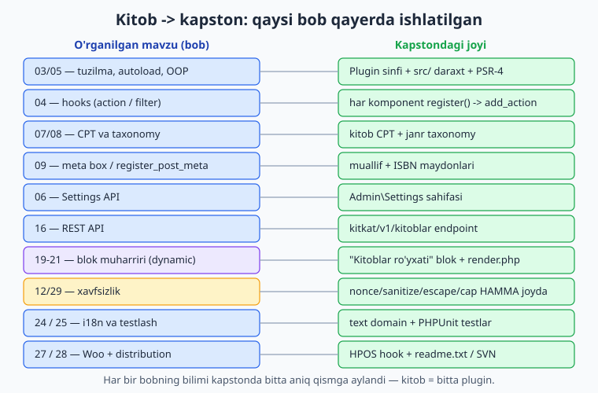
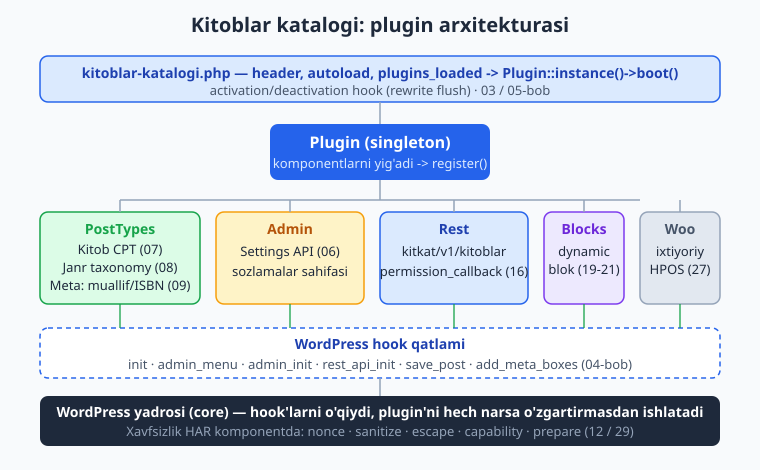
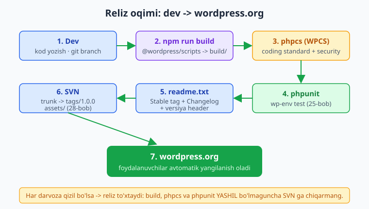

# 30 — Yakuniy kapston: to'liq professional plugin

[⬅️ Oldingi: 29 — Xavfsizlik auditi (chuqur)](./29-xavfsizlik-audit.md) · [🏠 README](./README.md)

> **Bu bobda:** butun kitob bo'ylab bo'lak-bo'lak qurgan barcha narsani bitta **professional, distribution-ready** plugin'ga birlashtiramiz — `kitoblar-katalogi`: PSR-4 autoload va DI'siz singleton orkestrator `Plugin` sinfi (03/05), `kitob` CPT + `janr` taxonomy (07/08), muallif/ISBN meta box + `register_post_meta` (09), Settings API sozlamalari (06), `kitkat/v1/kitoblar` REST endpoint (16), dynamic Gutenberg blok "Kitoblar ro'yxati" (19-21), ixtiyoriy WooCommerce/HPOS hook (27), hamma joyda nonce/sanitize/escape/capability/prepare (12/29), i18n (24), PHPUnit testlar (25) va `readme.txt` + SVN reliz (28) — to'liq fayl daraxti, RUNBOOK va o'sish yo'li bilan; kitob yakuni.

---

## Muammo: 29 bob bilim, lekin bitta plugin emas

Siz 29 bob davomida har bir mavzuni alohida o'rgandingiz: bir bobda CPT, boshqasida REST, uchinchisida blok. Har biri alohida ishladi. Lekin **real plugin** — bu alohida parchalar to'plami emas, balki **bir butun tizim**: komponentlar bir-biriga toza ulanadi, bitta kirish nuqtasi hammasini ishga tushiradi, xavfsizlik har qatlamda, va u **yangilanishga, testlashga, tarqatishga** tayyor.

Bu bob — **kapston**. Biz `kitoblar-katalogi` plugin'ini **boshidan oxirigacha** professional tarzda yig'amiz. Har bir qadam yonida qaysi bobdan kelganini ko'rsatamiz — bu bob butun kitobning **xaritasi**.



ℹ️ **Halol eslatma.** Quyidagi **PHP fayllar** `php -l` (PHP 8.4) bilan sintaktik tekshirilgan, **dynamic blok** esa `@wordpress/create-block` bilan yaratilib `npm run build` (`@wordpress/scripts`, Node 24) bilan **haqiqatan qurilgan**. Ammo plugin'ni **aktivatsiya qilish, wp-admin'da ko'rish, jonli REST javoblari, blok muharririda ishlatish va WooCommerce** — bularning hammasi **ishlab turgan WordPress saytini** talab qiladi. Shuning uchun "ishga tushirish" qadamlari **"o'z saytingizda sinab ko'ring"** ohangida. Lokal WP'ni `wp-env` bilan oson ko'tarasiz (02-bob).

---

## Umumiy ko'rinish: arxitektura

Avval **butun plugin'ning** xaritasini ko'raylik. Bitta `Plugin` sinfi — orkestrator: u barcha komponentlarni yig'adi va har biriga "o'zingni ro'yxatdan o'tkaz" deydi. Har komponent o'z hook'larini WordPress'ga ulaydi. Yadro hech narsani o'zgartirmaymiz — faqat hook (01-bobning falsafasi).



Asosiy g'oya: **har komponent mustaqil**. CPT komponentini o'chirsangiz, REST komponenti baribir kompilyatsiya bo'ladi. Bu — toza, kengaytiriladigan dizayn (05-bob).

---

## To'liq fayl daraxti

Mana professional plugin'ning to'liq tuzilishi. Har papka aniq mas'uliyatga ega:

```text
kitoblar-katalogi/
├── kitoblar-katalogi.php        # Kirish nuqtasi: header, autoload, boot (03/05)
├── uninstall.php                # O'chirilganda tozalash (03)
├── composer.json                # PSR-4 autoload + dev (phpcs, phpunit)
├── readme.txt                   # wordpress.org formati (28)
├── package.json                 # @wordpress/scripts (blok build) (19)
├── phpcs.xml.dist               # WordPress Coding Standards (25)
├── phpunit.xml.dist             # Test konfiguratsiyasi (25)
├── .gitignore                   # vendor/, node_modules/, build/
├── src/                         # Sof PHP, PSR-4 (Oqil\KitobKatalog\)
│   ├── Plugin.php               # Orkestrator (singleton)
│   ├── Autoloader.php           # Composer'siz zaxira autoloader
│   ├── PostTypes/
│   │   ├── KitobPostType.php    # CPT (07)
│   │   ├── JanrTaxonomy.php     # Taxonomy (08)
│   │   └── KitobMeta.php        # Meta box + register_post_meta (09)
│   ├── Admin/
│   │   └── Settings.php         # Settings API (06)
│   ├── Rest/
│   │   └── KitoblarController.php  # REST endpoint (16)
│   ├── Blocks/
│   │   └── KitobRoyxatBlock.php    # Dynamic blok PHP qismi (21)
│   └── Integrations/
│       └── WooCommerce.php      # Ixtiyoriy WC/HPOS hook (27)
├── blok-src/                    # Blok JSX manbasi (build oldidan)
│   └── kitob-royxat/
│       ├── block.json           # apiVersion 3, dynamic (19/21)
│       ├── edit.js              # Muharrir UI (20)
│       └── render.php           # Server-render (21)
├── build/                       # npm run build chiqishi (commit qilinadi yoki .distignore)
│   └── kitob-royxat/ ...
├── languages/                   # .pot / .po / .mo (24)
│   └── kitoblar-katalogi.pot
└── tests/                       # PHPUnit (25)
    └── KitobMetaTest.php
```

📌 **Nima uchun `src/` va `blok-src/` alohida?** `src/` — sof PHP, Composer PSR-4 bilan yuklanadi. Blok JSX'i esa `@wordpress/scripts` bilan **kompilyatsiya** qilinadi va `build/` ga chiqadi. PHP yuklovchi blok manbasini ko'rmasligi kerak — shuning uchun ular ajratilgan.

---

## 1-qadam: kirish nuqtasi va header (03 / 05)

Plugin **header**'i — WordPress'ga "men plugin'man" deb aytadi. So'ng autoload va bitta `boot()` chaqiruvi:

```php
<?php
/**
 * Plugin Name:       Kitoblar katalogi
 * Plugin URI:        https://ioqil.uz/plugins/kitoblar-katalogi
 * Description:       Kitoblarni CPT, janr, REST va Gutenberg blok bilan boshqaradi.
 * Version:           1.0.0
 * Requires at least: 7.0
 * Requires PHP:      8.3
 * Author:            Oqil Imomnazarov
 * License:           GPL-2.0-or-later
 * License URI:       https://www.gnu.org/licenses/gpl-2.0.html
 * Text Domain:       kitoblar-katalogi
 * Domain Path:       /languages
 *
 * @package Oqil\KitobKatalog
 */

namespace Oqil\KitobKatalog;

defined( 'ABSPATH' ) || exit; // To'g'ridan-to'g'ri kirishni to'sish.

const VERSIYA = '1.0.0';
define( __NAMESPACE__ . '\\FAYL', __FILE__ );
define( __NAMESPACE__ . '\\YOL', plugin_dir_path( __FILE__ ) );
define( __NAMESPACE__ . '\\URL', plugin_dir_url( __FILE__ ) );

// Composer autoload (yoki o'z zaxira yuklovchimiz).
$autoload = __DIR__ . '/vendor/autoload.php';
if ( is_readable( $autoload ) ) {
	require $autoload;
} else {
	require __DIR__ . '/src/Autoloader.php';
	( new Autoloader( __NAMESPACE__, __DIR__ . '/src' ) )->register();
}

register_activation_hook( __FILE__, [ Plugin::class, 'aktivatsiya' ] );
register_deactivation_hook( __FILE__, [ Plugin::class, 'deaktivatsiya' ] );

add_action(
	'plugins_loaded',
	static function (): void {
		Plugin::instance()->boot();
	}
);
```

💡 **Nega `plugins_loaded`?** Bu — barcha plugin'lar yuklangach ishlaydigan eng erta xavfsiz hook. CPT/taxonomy esa ichkarida `init` hook'iga ulanadi (WordPress shuni talab qiladi).

Zaxira **autoloader** (Composer bo'lmaganda — PSR-4 mantiq, 05-bob):

```php
<?php
namespace Oqil\KitobKatalog;

defined( 'ABSPATH' ) || exit;

final class Autoloader {
	public function __construct(
		private readonly string $prefiks,
		private readonly string $asos_yol,
	) {}

	public function register(): void {
		spl_autoload_register( [ $this, 'yukla' ] );
	}

	public function yukla( string $sinf ): void {
		if ( ! str_starts_with( $sinf, $this->prefiks . '\\' ) ) {
			return; // Faqat o'z namespace'imiz.
		}
		$nisbiy = substr( $sinf, strlen( $this->prefiks ) + 1 );
		$fayl   = $this->asos_yol . '/' . str_replace( '\\', '/', $nisbiy ) . '.php';
		if ( is_readable( $fayl ) ) {
			require $fayl;
		}
	}
}
```

ℹ️ Bu `readonly` xossali konstruktor promotion va `str_starts_with()` — PHP 8.3+ idiomi (05-bob). Ishlab chiqarishda **Composer** autoload'ni afzal ko'ring; bu zaxira — faqat `vendor/` bo'lmaganda.

---

## 2-qadam: orkestrator `Plugin` sinfi (05)

Bu — plugin'ning **yuragi**. Singleton (bitta namuna), komponentlarni yig'adi, har biriga `register()` deydi:

```php
<?php
namespace Oqil\KitobKatalog;

use Oqil\KitobKatalog\PostTypes\KitobPostType;
use Oqil\KitobKatalog\PostTypes\JanrTaxonomy;
use Oqil\KitobKatalog\PostTypes\KitobMeta;
use Oqil\KitobKatalog\Admin\Settings;
use Oqil\KitobKatalog\Rest\KitoblarController;
use Oqil\KitobKatalog\Blocks\KitobRoyxatBlock;
use Oqil\KitobKatalog\Integrations\WooCommerce;

defined( 'ABSPATH' ) || exit;

final class Plugin {

	private static ?Plugin $instance = null;

	/** @var array<int, object> */
	private array $komponentlar = [];

	private function __construct() {}

	public static function instance(): Plugin {
		return self::$instance ??= new self();
	}

	public function boot(): void {
		$this->komponentlar = [
			new KitobPostType(),
			new JanrTaxonomy(),
			new KitobMeta(),
			new Settings(),
			new KitoblarController(),
			new KitobRoyxatBlock(),
		];

		// WooCommerce faqat aktiv bo'lsa (ixtiyoriy integratsiya).
		if ( class_exists( \WooCommerce::class ) ) {
			$this->komponentlar[] = new WooCommerce();
		}

		foreach ( $this->komponentlar as $komponent ) {
			if ( method_exists( $komponent, 'register' ) ) {
				$komponent->register();
			}
		}

		add_action( 'init', [ $this, 'tarjimani_yukla' ] );
	}

	public function tarjimani_yukla(): void {
		load_plugin_textdomain(
			'kitoblar-katalogi',
			false,
			dirname( plugin_basename( FAYL ) ) . '/languages'
		);
	}

	public static function aktivatsiya(): void {
		( new KitobPostType() )->royxat();
		( new JanrTaxonomy() )->royxat();
		flush_rewrite_rules(); // Slug'lar darhol ishlashi uchun.
	}

	public static function deaktivatsiya(): void {
		flush_rewrite_rules();
	}
}
```

📌 **Aktivatsiyada CPT/taxonomy'ni qo'lda ro'yxatdan o'tkazib, keyin `flush_rewrite_rules()`.** Aks holda yangi `kitoblar/...` URL'lari 404 beradi, foydalanuvchi sozlamalarni qayta saqlamaguncha. `flush_rewrite_rules()` **qimmat** — uni faqat aktivatsiya/deaktivatsiyada chaqiring, har so'rovda emas.

💡 **Singleton vs DI konteyner.** Bu yerda sodda singleton ishlatdik. Yirik plugin'da to'liq **DI konteyner** (masalan `league/container`) afzal — komponentlarni test paytida almashtirish osonroq. Boshlash uchun singleton yetarli.

---

## 3-qadam: CPT `kitob` va taxonomy `janr` (07 / 08)

```php
<?php
namespace Oqil\KitobKatalog\PostTypes;

defined( 'ABSPATH' ) || exit;

final class KitobPostType {

	public const SLUG = 'kitob';

	public function register(): void {
		add_action( 'init', [ $this, 'royxat' ] );
	}

	public function royxat(): void {
		register_post_type(
			self::SLUG,
			[
				'labels'       => [
					'name'          => __( 'Kitoblar', 'kitoblar-katalogi' ),
					'singular_name' => __( 'Kitob', 'kitoblar-katalogi' ),
					'add_new_item'  => __( 'Yangi kitob qo\'shish', 'kitoblar-katalogi' ),
				],
				'public'       => true,
				'has_archive'  => true,
				'menu_icon'    => 'dashicons-book-alt',
				'rewrite'      => [ 'slug' => 'kitoblar' ],
				'supports'     => [ 'title', 'editor', 'thumbnail', 'excerpt', 'custom-fields' ],
				'show_in_rest' => true,        // Blok muharriri + REST uchun SHART.
				'rest_base'    => 'kitoblar',
			]
		);
	}
}
```

Taxonomy `janr` — ierarxik (kategoriyaga o'xshash):

```php
<?php
namespace Oqil\KitobKatalog\PostTypes;

defined( 'ABSPATH' ) || exit;

final class JanrTaxonomy {

	public const SLUG = 'janr';

	public function register(): void {
		add_action( 'init', [ $this, 'royxat' ] );
	}

	public function royxat(): void {
		register_taxonomy(
			self::SLUG,
			KitobPostType::SLUG,
			[
				'labels'            => [
					'name'          => __( 'Janrlar', 'kitoblar-katalogi' ),
					'singular_name' => __( 'Janr', 'kitoblar-katalogi' ),
				],
				'public'            => true,
				'hierarchical'      => true,
				'show_admin_column' => true,
				'show_in_rest'      => true,
				'rewrite'           => [ 'slug' => 'janr' ],
			]
		);
	}
}
```

⚠️ **`show_in_rest => true` ni unutmang.** Usiz CPT/taxonomy blok muharririda ko'rinmaydi va REST API'da yo'q. Zamonaviy WordPress'da bu deyarli har doim kerak.

---

## 4-qadam: meta box va `register_post_meta` (09)

Muallif va ISBN maydonlari. Ikki marta ro'yxatdan o'tamiz: `register_post_meta` (REST/blok uchun) **va** meta box (klassik tahrirlovchi uchun). Saqlashda **xavfsizlik uch darvozasi**: nonce + capability + sanitize.

```php
<?php
namespace Oqil\KitobKatalog\PostTypes;

defined( 'ABSPATH' ) || exit;

final class KitobMeta {

	public const MUALLIF = '_kitkat_muallif';
	public const ISBN    = '_kitkat_isbn';

	public function register(): void {
		add_action( 'init', [ $this, 'meta_royxat' ] );
		add_action( 'add_meta_boxes', [ $this, 'meta_box' ] );
		add_action( 'save_post_' . KitobPostType::SLUG, [ $this, 'saqla' ], 10, 2 );
	}

	public function meta_royxat(): void {
		register_post_meta(
			KitobPostType::SLUG,
			self::MUALLIF,
			[
				'type'              => 'string',
				'single'            => true,
				'show_in_rest'      => true,
				'sanitize_callback' => 'sanitize_text_field',
				'auth_callback'     => static fn(): bool => current_user_can( 'edit_posts' ),
			]
		);
		register_post_meta(
			KitobPostType::SLUG,
			self::ISBN,
			[
				'type'              => 'string',
				'single'            => true,
				'show_in_rest'      => true,
				'sanitize_callback' => [ self::class, 'isbn_tozala' ],
				'auth_callback'     => static fn(): bool => current_user_can( 'edit_posts' ),
			]
		);
	}

	/** ISBN faqat raqam, X va defis. Sof-PHP mantiq — WP'siz ham ishlaydi. */
	public static function isbn_tozala( string $xom ): string {
		return preg_replace( '/[^0-9X-]/i', '', $xom ) ?? '';
	}

	public function meta_box(): void {
		add_meta_box(
			'kitkat_kitob_maydonlari',
			__( 'Kitob ma\'lumotlari', 'kitoblar-katalogi' ),
			[ $this, 'meta_box_chiqar' ],
			KitobPostType::SLUG,
			'side'
		);
	}

	public function meta_box_chiqar( \WP_Post $post ): void {
		wp_nonce_field( 'kitkat_meta_saqla', 'kitkat_meta_nonce' );
		$muallif = (string) get_post_meta( $post->ID, self::MUALLIF, true );
		$isbn    = (string) get_post_meta( $post->ID, self::ISBN, true );
		?>
		<p>
			<label for="kitkat_muallif"><?php esc_html_e( 'Muallif', 'kitoblar-katalogi' ); ?></label>
			<input type="text" id="kitkat_muallif" name="kitkat_muallif"
				value="<?php echo esc_attr( $muallif ); ?>" class="widefat" />
		</p>
		<p>
			<label for="kitkat_isbn"><?php esc_html_e( 'ISBN', 'kitoblar-katalogi' ); ?></label>
			<input type="text" id="kitkat_isbn" name="kitkat_isbn"
				value="<?php echo esc_attr( $isbn ); ?>" class="widefat" />
		</p>
		<?php
	}

	public function saqla( int $post_id, \WP_Post $post ): void {
		// 1) Nonce (CSRF).
		if ( ! isset( $_POST['kitkat_meta_nonce'] )
			|| ! wp_verify_nonce( sanitize_key( wp_unslash( $_POST['kitkat_meta_nonce'] ) ), 'kitkat_meta_saqla' ) ) {
			return;
		}
		// 2) Avtosaqlashni o'tkazib yuborish.
		if ( defined( 'DOING_AUTOSAVE' ) && DOING_AUTOSAVE ) {
			return;
		}
		// 3) Capability.
		if ( ! current_user_can( 'edit_post', $post_id ) ) {
			return;
		}
		// 4) Sanitize + saqlash.
		$muallif = sanitize_text_field( wp_unslash( $_POST['kitkat_muallif'] ?? '' ) );
		$isbn    = self::isbn_tozala( (string) wp_unslash( $_POST['kitkat_isbn'] ?? '' ) );
		update_post_meta( $post_id, self::MUALLIF, $muallif );
		update_post_meta( $post_id, self::ISBN, $isbn );
	}
}
```

⚠️ **`auth_callback` REST orqali yozishni nazorat qiladi.** `register_post_meta` `show_in_rest => true` bo'lganda, har kim REST orqali meta'ni o'zgartira olmasligi uchun `auth_callback` bilan capability tekshiring. Meta box esa o'z nonce + `current_user_can` darvozasiga ega — ikkalasi mustaqil himoya (defense-in-depth, 29-bob).

---

## 5-qadam: Settings API sozlamalari (06)

Plugin'ning sozlamalar sahifasi — `Sozlamalar > Kitoblar katalogi`:

```php
<?php
namespace Oqil\KitobKatalog\Admin;

defined( 'ABSPATH' ) || exit;

final class Settings {

	public const OPTION_GROUP = 'kitkat_settings';
	public const OPTION_NAME  = 'kitkat_options';

	public function register(): void {
		add_action( 'admin_menu', [ $this, 'menu' ] );
		add_action( 'admin_init', [ $this, 'sozlamalar' ] );
	}

	public function menu(): void {
		add_options_page(
			__( 'Kitoblar katalogi sozlamalari', 'kitoblar-katalogi' ),
			__( 'Kitoblar katalogi', 'kitoblar-katalogi' ),
			'manage_options',
			'kitkat-settings',
			[ $this, 'sahifa' ]
		);
	}

	public function sozlamalar(): void {
		register_setting(
			self::OPTION_GROUP,
			self::OPTION_NAME,
			[
				'type'              => 'array',
				'sanitize_callback' => [ $this, 'tozala' ],
				'default'           => [ 'son' => 10 ],
			]
		);
		add_settings_section( 'kitkat_asosiy', __( 'Asosiy', 'kitoblar-katalogi' ), '__return_false', 'kitkat-settings' );
		add_settings_field(
			'kitkat_son',
			__( 'Har sahifadagi kitoblar soni', 'kitoblar-katalogi' ),
			[ $this, 'son_maydoni' ],
			'kitkat-settings',
			'kitkat_asosiy'
		);
	}

	public function son_maydoni(): void {
		$opt = (array) get_option( self::OPTION_NAME, [] );
		$son = isset( $opt['son'] ) ? absint( $opt['son'] ) : 10;
		printf(
			'<input type="number" min="1" max="100" name="%s[son]" value="%d" />',
			esc_attr( self::OPTION_NAME ),
			(int) $son
		);
	}

	/** Sof-PHP sanitize: 1..100 oralig'iga qisadi. */
	public function tozala( mixed $xom ): array {
		$xom = is_array( $xom ) ? $xom : [];
		$son = isset( $xom['son'] ) ? absint( $xom['son'] ) : 10;
		return [ 'son' => max( 1, min( 100, $son ) ) ];
	}

	public function sahifa(): void {
		if ( ! current_user_can( 'manage_options' ) ) {
			return;
		}
		?>
		<div class="wrap">
			<h1><?php echo esc_html( get_admin_page_title() ); ?></h1>
			<form action="options.php" method="post">
				<?php
				settings_fields( self::OPTION_GROUP );     // nonce + group.
				do_settings_sections( 'kitkat-settings' );
				submit_button();
				?>
			</form>
		</div>
		<?php
	}
}
```

💡 `settings_fields()` o'zi nonce'ni qo'shadi, va WordPress sanitizatsiyani `sanitize_callback` orqali bajaradi — Settings API'ning kuchi shu. Lekin sahifani ko'rsatishdan oldin `current_user_can('manage_options')` ni baribir tekshiring.

---

## 6-qadam: REST endpoint `kitkat/v1/kitoblar` (16)

Janr bo'yicha filtrlanadigan, public (faqat o'qish) endpoint:

```php
<?php
namespace Oqil\KitobKatalog\Rest;

use Oqil\KitobKatalog\PostTypes\KitobPostType;
use Oqil\KitobKatalog\PostTypes\JanrTaxonomy;
use Oqil\KitobKatalog\PostTypes\KitobMeta;

defined( 'ABSPATH' ) || exit;

final class KitoblarController {

	public const NS    = 'kitkat/v1';
	public const ROUTE = '/kitoblar';

	public function register(): void {
		add_action( 'rest_api_init', [ $this, 'route_royxat' ] );
	}

	public function route_royxat(): void {
		register_rest_route(
			self::NS,
			self::ROUTE,
			[
				'methods'             => \WP_REST_Server::READABLE, // GET
				'callback'            => [ $this, 'kitoblar' ],
				'permission_callback' => '__return_true', // Ataylab ochiq: faqat nashr etilgan public ma'lumot.
				'args'                => [
					'janr' => [
						'type'              => 'string',
						'sanitize_callback' => 'sanitize_title',
					],
					'son'  => [
						'type'              => 'integer',
						'default'           => 10,
						'sanitize_callback' => 'absint',
						'validate_callback' => static fn( $v ): bool => is_numeric( $v ) && (int) $v > 0 && (int) $v <= 100,
					],
				],
			]
		);
	}

	public function kitoblar( \WP_REST_Request $request ): \WP_REST_Response {
		$args = [
			'post_type'      => KitobPostType::SLUG,
			'post_status'    => 'publish',
			'posts_per_page' => absint( $request['son'] ),
			'no_found_rows'  => true, // Sahifalash kerak emas -> tezroq (26-bob).
		];

		if ( ! empty( $request['janr'] ) ) {
			$args['tax_query'] = [
				[
					'taxonomy' => JanrTaxonomy::SLUG,
					'field'    => 'slug',
					'terms'    => $request['janr'],
				],
			];
		}

		$query  = new \WP_Query( $args );
		$natija = [];
		foreach ( $query->posts as $post ) {
			$natija[] = [
				'id'      => $post->ID,
				'nom'     => get_the_title( $post ),
				'havola'  => get_permalink( $post ),
				'muallif' => (string) get_post_meta( $post->ID, KitobMeta::MUALLIF, true ),
				'isbn'    => (string) get_post_meta( $post->ID, KitobMeta::ISBN, true ),
			];
		}

		return new \WP_REST_Response( $natija, 200 );
	}
}
```

📌 **`permission_callback => '__return_true'` bu yerda ATAYLAB.** Endpoint faqat **nashr etilgan** (`publish`) kitoblarni qaytaradi — bu allaqachon ommaviy ma'lumot. Lekin agar endpoint ma'lumot **o'zgartirsa** (POST/DELETE) yoki maxfiy maydon qaytarsa — `'__return_true'` halokat bo'lardi (29-bob). Ochiq endpoint ataylab ochiq bo'lsagina, izoh bilan.

⚠️ **`son` ni cheklang.** `validate_callback` 1..100 oralig'ini majburlaydi. Usiz hujumchi `?son=999999` bilan saytni DoS qila oladi. Cheklov — performance va xavfsizlik (26/29).

> **Jonli sinov (o'z saytingizda):** brauzerda `https://sayt.uz/wp-json/kitkat/v1/kitoblar?janr=ilmiy&son=5` ni oching — JSON massiv qaytadi. Jonli javob WordPress ishlab turishini talab qiladi.

---

## 7-qadam: dynamic Gutenberg blok "Kitoblar ro'yxati" (19-21)

Blok ikki qismdan iborat: **JS muharrir** qismi (`edit.js`, `block.json`) va **PHP server-render** (`render.php`). `block.json` — manifest:

```json
{
	"$schema": "https://schemas.wp.org/trunk/block.json",
	"apiVersion": 3,
	"name": "oqil/kitob-royxat",
	"version": "1.0.0",
	"title": "Kitoblar ro'yxati",
	"category": "widgets",
	"icon": "book-alt",
	"description": "Tanlangan janr bo'yicha kitoblar ro'yxatini ko'rsatadi.",
	"textdomain": "kitoblar-katalogi",
	"attributes": {
		"son":  { "type": "number", "default": 5 },
		"janr": { "type": "string", "default": "" }
	},
	"supports": { "html": false },
	"editorScript": "file:./index.js",
	"editorStyle": "file:./index.css",
	"style": "file:./style-index.css",
	"render": "file:./render.php"
}
```

Muharrir UI (`edit.js`) — `InspectorControls` bilan son/janr sozlamasi (20-bob):

```jsx
import { __ } from '@wordpress/i18n';
import { useBlockProps, InspectorControls } from '@wordpress/block-editor';
import { PanelBody, RangeControl, TextControl } from '@wordpress/components';
import './editor.scss';

export default function Edit( { attributes, setAttributes } ) {
	const { son, janr } = attributes;
	const blockProps = useBlockProps();

	return (
		<>
			<InspectorControls>
				<PanelBody title={ __( 'Sozlamalar', 'kitoblar-katalogi' ) }>
					<RangeControl
						label={ __( 'Kitoblar soni', 'kitoblar-katalogi' ) }
						value={ son }
						onChange={ ( q ) => setAttributes( { son: q } ) }
						min={ 1 } max={ 20 }
					/>
					<TextControl
						label={ __( 'Janr (slug)', 'kitoblar-katalogi' ) }
						value={ janr }
						onChange={ ( q ) => setAttributes( { janr: q } ) }
					/>
				</PanelBody>
			</InspectorControls>
			<div { ...blockProps }>
				<p>{ __( 'Kitoblar ro\'yxati:', 'kitoblar-katalogi' ) } { son }
					{ janr && ` (${ janr })` }</p>
			</div>
		</>
	);
}
```

Server-render (`render.php`) — front-end'da haqiqiy kitoblar (21-bob). Bu yerda **escape** kontekst bo'yicha:

```php
<?php
/**
 * Dynamic blok render. Mavjud: $attributes, $content, $block.
 */
$son  = isset( $attributes['son'] ) ? absint( $attributes['son'] ) : 5;
$janr = isset( $attributes['janr'] ) ? sanitize_title( (string) $attributes['janr'] ) : '';

$args = [
	'post_type'      => 'kitob',
	'post_status'    => 'publish',
	'posts_per_page' => $son,
	'no_found_rows'  => true,
];
if ( '' !== $janr ) {
	$args['tax_query'] = [
		[ 'taxonomy' => 'janr', 'field' => 'slug', 'terms' => $janr ],
	];
}

$query = new WP_Query( $args );
if ( ! $query->have_posts() ) {
	printf( '<p %s>%s</p>', get_block_wrapper_attributes(), esc_html__( 'Kitob topilmadi.', 'kitoblar-katalogi' ) );
	return;
}
?>
<ul <?php echo get_block_wrapper_attributes(); ?>>
	<?php foreach ( $query->posts as $post ) : ?>
		<?php $muallif = (string) get_post_meta( $post->ID, '_kitkat_muallif', true ); ?>
		<li>
			<a href="<?php echo esc_url( get_permalink( $post ) ); ?>"><?php echo esc_html( get_the_title( $post ) ); ?></a>
			<?php if ( '' !== $muallif ) : ?>&mdash; <?php echo esc_html( $muallif ); ?><?php endif; ?>
		</li>
	<?php endforeach; ?>
</ul>
```

Blok'ning PHP registratsiyasi (orkestrator chaqiradi, 21-bob):

```php
<?php
namespace Oqil\KitobKatalog\Blocks;

defined( 'ABSPATH' ) || exit;

final class KitobRoyxatBlock {
	public function register(): void {
		add_action( 'init', [ $this, 'blok_royxat' ] );
	}

	public function blok_royxat(): void {
		// build/ ichidagi block.json'ni o'qiydi (apiVersion 3, dynamic).
		register_block_type( YOL . 'build/kitob-royxat' );
	}
}
```

📌 **`register_block_type()` ga build papkasi yo'lini bering.** U o'sha papkadagi `block.json`'ni o'qiydi va `render` maydonidagi `render.php`'ni avtomatik server-render uchun ishlatadi. JS faylni qo'lda enqueue qilish shart emas — `block.json` hammasini hal qiladi (19-bob).

> **Jonli sinov (o'z saytingizda):** blok muharririda "Kitoblar ro'yxati" blokini qo'shing, o'ng paneldan son/janr ni o'zgartiring va sahifani ko'ring. Blok muharriri faqat ishlab turgan WordPress'da ishlaydi.

---

## 8-qadam: ixtiyoriy WooCommerce hook (27)

Faqat WooCommerce aktiv bo'lsa yuklanadi (orkestratordagi `class_exists` shart bilan). Mahsulot sahifasiga ISBN tab qo'shadi va HPOS muvofiqligini e'lon qiladi:

```php
<?php
namespace Oqil\KitobKatalog\Integrations;

use Oqil\KitobKatalog\PostTypes\KitobMeta;

defined( 'ABSPATH' ) || exit;

final class WooCommerce {

	public function register(): void {
		add_action( 'before_woocommerce_init', [ $this, 'hpos_muvofiq' ] );
		add_filter( 'woocommerce_product_tabs', [ $this, 'isbn_tab' ] );
	}

	public function hpos_muvofiq(): void {
		if ( class_exists( \Automattic\WooCommerce\Utilities\FeaturesUtil::class ) ) {
			\Automattic\WooCommerce\Utilities\FeaturesUtil::declare_compatibility(
				'custom_order_tables',
				plugin_basename( \Oqil\KitobKatalog\FAYL ),
				true
			);
		}
	}

	/** @param array<string, array<string, mixed>> $tabs */
	public function isbn_tab( array $tabs ): array {
		global $product;
		if ( ! $product instanceof \WC_Product ) {
			return $tabs; // Filter HAR DOIM qiymat qaytaradi (04-bob).
		}
		$isbn = (string) get_post_meta( $product->get_id(), KitobMeta::ISBN, true );
		if ( '' === $isbn ) {
			return $tabs;
		}
		$tabs['kitkat_isbn'] = [
			'title'    => __( 'ISBN', 'kitoblar-katalogi' ),
			'priority' => 25,
			'callback' => static function () use ( $isbn ): void {
				echo '<p>' . esc_html( $isbn ) . '</p>';
			},
		];
		return $tabs;
	}
}
```

⚠️ **HPOS muvofiqligini `before_woocommerce_init` da e'lon qiling.** WooCommerce 8.2+ HPOS (High-Performance Order Storage) ishlatadi; muvofiqlikni e'lon qilmasangiz, admin ogohlantirish chiqaradi (27-bob). `class_exists` tekshiruvi — WC o'rnatilmagan saytda fatal xatoning oldini oladi.

---

## 9-qadam: i18n (24) va tozalash (uninstall)

Barcha foydalanuvchiga ko'rinadigan matn `__()`, `esc_html__()`, `_e()` ichida, **bir xil text domain** `'kitoblar-katalogi'` bilan (yuqorida ko'rdingiz). `.pot` faylni yarating:

```bash
wp i18n make-pot . languages/kitoblar-katalogi.pot
```

`uninstall.php` — plugin **o'chirilganda** (deaktivatsiya emas, butunlay o'chirilganda) ma'lumotni tozalaydi:

```php
<?php
// Faqat WordPress o'chirish jarayonida chaqiriladi.
defined( 'WP_UNINSTALL_PLUGIN' ) || exit;

delete_option( 'kitkat_options' );
// Eslatma: CPT post'lari va meta'sini o'chirish — siyosat masalasi.
// Foydalanuvchi ma'lumotini ataylab saqlab qolishingiz ham mumkin.
```

📌 **`uninstall.php` da har doim `WP_UNINSTALL_PLUGIN` ni tekshiring.** Bu konstanta faqat WordPress o'chirish paytida aniqlanadi — to'g'ridan-to'g'ri kirishni to'sadi.

---

## 10-qadam: testlar (25)

PHPUnit bilan sof-PHP mantiqni (masalan ISBN sanitizatsiya) testlash:

```php
<?php
namespace Oqil\KitobKatalog\Tests;

use PHPUnit\Framework\TestCase;
use Oqil\KitobKatalog\PostTypes\KitobMeta;

final class KitobMetaTest extends TestCase {

	public function test_isbn_faqat_raqam_va_defis(): void {
		$this->assertSame( '978-5-09', KitobMeta::isbn_tozala( 'ISBN: 978-5-09 abc' ) );
	}

	public function test_isbn_X_belgisini_saqlaydi(): void {
		$this->assertSame( '0-306-40615-X', KitobMeta::isbn_tozala( '0-306-40615-X' ) );
	}

	public function test_bosh_qiymat(): void {
		$this->assertSame( '', KitobMeta::isbn_tozala( '!!!' ) );
	}
}
```

💡 **Sof mantiqni WP'siz test qiling.** `isbn_tozala` WordPress funksiyalariga tayanmaydi — uni oddiy PHPUnit bilan, ishlab turgan WP'siz sinash mumkin. CPT/REST kabi WP'ga tayangan kodni esa `wp-env` + WP PHPUnit integration testi bilan sinaysiz (25-bob).

---

## RUNBOOK: qurish, tekshirish, reliz

Endi plugin tayyor — uni qanday **qurish va chiqarish**? Quyidagi ketma-ketlik — har relizda bajaradigan **darvozalar**. Bittasi qizil bo'lsa, reliz to'xtaydi.



```bash
# 0) Bog'liqliklarni o'rnatish (bir marta)
composer install
npm install

# 1) Blokni qurish (JSX -> build/)
npm run build

# 2) Coding standard tekshiruvi (WordPress Coding Standards + security sniff)
composer exec phpcs

# 3) Testlar (sof-PHP + wp-env integration)
composer exec phpunit
#   yoki WP integration uchun:
#   wp-env start && composer exec phpunit

# 4) Versiyani oshirish: header "Version" + readme.txt "Stable tag" BIR XIL bo'lsin

# 5) Tarjima fayli yangilash
wp i18n make-pot . languages/kitoblar-katalogi.pot

# 6) wordpress.org SVN (28-bob)
#   svn checkout / cp -> trunk/ ; svn cp trunk tags/1.0.0 ; svn ci -m "1.0.0"
```

📌 **"Stable tag" = reliz tugmasi.** wordpress.org `readme.txt`'dagi `Stable tag` qaysi `tags/` papkasini foydalanuvchiga berishni hal qiladi. Header `Version` bilan **bir xil** bo'lishi shart — aks holda yangilanish chalkashadi (28-bob).

⚠️ **`build/` va `vendor/` ni reliz'ga qo'shing, `node_modules/` ni QO'SHMANG.** wordpress.org foydalanuvchisi `npm install` qilmaydi — unga **qurib bo'lingan** `build/` kerak. `.gitignore`'da `build/` bo'lsa ham, SVN'ga uni qo'shing (yoki CI build'da yarating).

---

## "Keyingi qadamlar": expertdan keyin nima?

Siz endi to'liq plugin yoza olasiz. O'sish yo'li:

- **Composer paketlari.** Umumiy kodni (logger, settings abstraksiyasi, REST helper) alohida Composer paketga ajrating va bir nechta plugin'da qayta ishlating.
- **CI/CD.** GitHub Actions: har push'da `phpcs` + `phpunit` + `npm run build`; teg qo'yilganda avtomatik SVN deploy (`10up/action-wordpress-plugin-deploy`).
- **DI konteyner.** Singleton'dan to'liq dependency injection konteynerga o'ting — testlash va kengaytirish osonroq.
- **Premium model.** Bepul "core" + pullik "pro" qo'shimcha plugin (freemium); litsenziya serveri va yangilanish API'si.
- **Blok kutubxonasi.** Bir nechta bog'liq blokni bitta plugin'da (`block.json` har biriga), umumiy komponentlar bilan.
- **Ko'p-plugin ekotizimi.** O'z hook'laringiz (`do_action('kitkat_...')`, `apply_filters('kitkat_...')`) bilan boshqa dasturchilarga sizning plugin'ingizni **kengaytirish** imkonini bering — siz qilgandek, ular ham yadroga tegmasdan.

---

## Tabrik — yo'l yakuni

Siz `functions.php`'ga kod tashlaydigan havaskordan **toza, xavfsiz, testlangan, tarqatishga tayyor** plugin yozadigan muhandisga aylandingiz. 01-bobda "yadroni o'zgartirma, hook ishlat" falsafasidan boshlab, bu kapstonda **bitta professional plugin**da: CPT, taxonomy, meta, Settings API, REST, Gutenberg blok, WooCommerce, xavfsizlik, i18n, test va distribution — hammasini birlashtirdingiz.

Endi navbat **sizniki**: o'z g'oyangizni oling, `wp-env` bilan lokal sayt ko'taring, va **yozib o'rganing** — plugin o'qib emas, qurib o'rganiladi. Rasmiy [Plugin Handbook](https://developer.wordpress.org/plugins/) va [Block Editor Handbook](https://developer.wordpress.org/block-editor/) — eng ishonchli hamrohingiz. Omad, va WordPress jamoasiga hissangizni qo'shing.

---

## 30-bob mashqlari

> Mashqlar `kitoblar-katalogi` plugini ustida ishlaydi (namespace `Oqil\KitobKatalog`, prefiks `kitkat_`, CPT `kitob`, taxonomy `janr`, REST `kitkat/v1`, blok `oqil/`). Sof-PHP mashqlarni `php` bilan, WP kodini `wp-env` bilan o'z test saytingizda sinang.

### Oson

1. **(Oson)** Plugin header'ida `Requires PHP` va `Requires at least` nima uchun kerak? Birini noto'g'ri qo'ysangiz nima bo'ladi?
2. **(Oson)** Orkestrator `Plugin` sinfi nima vazifani bajaradi? Nega har komponentni alohida emas, bir joydan `register()` qilamiz?
3. **(Oson)** `flush_rewrite_rules()` ni nega faqat aktivatsiyada chaqiramiz, har so'rovda emas?
4. **(Oson)** Fayl daraxtida `src/` va `build/` papkalari nima uchun ajratilgan? Qaysi biri JSX manbasi, qaysi biri kompilyatsiya natijasi?
5. **(Oson)** REST endpoint'da `permission_callback => '__return_true'` qachon to'g'ri, qachon halokat? Bizning `kitkat/v1/kitoblar` uchun nega to'g'ri?
6. **(Oson)** `uninstall.php` da `WP_UNINSTALL_PLUGIN` ni tekshirish nega muhim? U deaktivatsiyada ham chaqiriladimi?

### O'rta

7. **(O'rta)** Orkestrator `boot()` da WooCommerce komponentini `class_exists(\WooCommerce::class)` shart bilan qo'shamiz. Nega? Shartsiz qo'shsangiz, WC o'rnatilmagan saytda nima bo'ladi?

<details markdown="1"><summary>Yechim</summary>

`WooCommerce` komponenti `\WC_Product` va `\Automattic\WooCommerce\Utilities\FeaturesUtil` kabi WC sinflariga tayanadi. Agar WC o'rnatilmagan bo'lsa, bu sinflar mavjud emas. Komponentni shartsiz yuklasangiz va u WC sinfini ishlatsa — **fatal error** (`Class not found`), butun sayt ishlamay qoladi.

```php
if ( class_exists( \WooCommerce::class ) ) {
	$this->komponentlar[] = new WooCommerce();
}
```

`class_exists` darvozasi — integratsiyani **ixtiyoriy** qiladi: WC bor bo'lsa ishlaydi, yo'q bo'lsa jim turadi. Bu — har qanday tashqi plugin integratsiyasining standart naqshi.
</details>

8. **(O'rta)** `KitobMeta::saqla()` da to'rt tekshiruv bor (nonce, autosave, capability, sanitize). Har birini olib tashlasangiz qaysi zaiflik/xato ochiladi? Tartibni tushuntiring.

<details markdown="1"><summary>Yechim</summary>

- **Nonce yo'q** -> CSRF: boshqa sayt foydalanuvchi brauzeri orqali soxta `save_post` so'rovi yuboradi.
- **Autosave tekshiruvi yo'q** -> WordPress avtosaqlashida `$_POST['kitkat_muallif']` bo'sh bo'ladi, mavjud qiymat ustiga bo'sh yoziladi (ma'lumot yo'qoladi).
- **Capability yo'q** -> ruxsatsiz foydalanuvchi (yoki boshqa post egasi) meta'ni o'zgartiradi (IDOR).
- **Sanitize yo'q** -> XSS: tozalanmagan `$_POST` to'g'ridan-to'g'ri bazaga, keyin chiqishda zarar.

Tartib muhim: nonce va autosave **erta** qaytaradi (keraksiz ishni qilmaymiz), capability ruxsatni tekshiradi, sanitize esa eng oxirida ma'lumotni tozalaydi. `wp_unslash` sanitizatsiyadan **oldin** — WordPress qo'shgan slash'larni olib tashlaydi.
</details>

9. **(O'rta)** `register_post_meta` da `show_in_rest => true` va `auth_callback` bor. Bu ikkalasi birga nima qiladi? `auth_callback` ni olib tashlasangiz xavf nima?

<details markdown="1"><summary>Yechim</summary>

`show_in_rest => true` meta'ni REST API orqali **o'qish va yozish** uchun ochadi (blok muharriri shuni ishlatadi). `auth_callback` esa **yozishni** kim qila olishini nazorat qiladi:

```php
'auth_callback' => static fn(): bool => current_user_can( 'edit_posts' ),
```

Olib tashlasangiz, WordPress standart `auth_callback`'ni ishlatadi (post tahrirlash huquqiga bog'liq), lekin uni aniq belgilash — niyatni ravshan qiladi va xavfsizroq. Eng yomon holat: noto'g'ri sozlangan meta REST orqali ruxsatsiz yozilishi mumkin. Har doim aniq `auth_callback` bering.
</details>

10. **(O'rta)** REST endpoint'da `son` argumentiga `validate_callback` qo'ydik (1..100). Nega `sanitize_callback => 'absint'` o'zi yetarli emas? Ikkalasi qanday farq qiladi?

<details markdown="1"><summary>Yechim</summary>

- `sanitize_callback` qiymatni **o'zgartiradi** (xom -> toza). `absint` `-5` ni `5` ga, `"abc"` ni `0` ga aylantiradi — lekin baribir **qabul qiladi**.
- `validate_callback` qiymatni **rad etadi** (noto'g'ri bo'lsa `400` xato). Bu yerda `(int) $v > 0 && (int) $v <= 100` cheklovini majburlaydi.

`absint` o'zi `?son=999999` ni `999999` qilib o'tkazadi — DoS xavfi. `validate_callback` 100 dan oshganini rad etadi. Ikkalasi birga: validate (chegara) + sanitize (tur). Bu defense-in-depth (29-bob): bir qatlam tursa, ikkinchisi himoya qiladi.
</details>

11. **(O'rta)** `kitkat/v1/kitoblar` endpoint'iga `format` argumenti qo'shing: `format=qisqa` bo'lsa faqat `id` va `nom` qaytsin, aks holda to'liq. `validate_callback` bilan ruxsat etilgan qiymatlarni cheklang.

<details markdown="1"><summary>Yechim</summary>

```php
'args' => [
	// ... mavjud janr, son ...
	'format' => [
		'type'              => 'string',
		'default'           => 'toliq',
		'enum'              => [ 'toliq', 'qisqa' ],
		'sanitize_callback' => 'sanitize_key',
	],
],
```

`enum` — REST'ning o'zi ruxsat etilgan qiymatlarni cheklaydigan eng sodda yo'li (`validate_callback` o'rniga). Callback ichida:

```php
$format = $request['format'];
foreach ( $query->posts as $post ) {
	$satr = [ 'id' => $post->ID, 'nom' => get_the_title( $post ) ];
	if ( 'toliq' === $format ) {
		$satr['havola']  = get_permalink( $post );
		$satr['muallif'] = (string) get_post_meta( $post->ID, KitobMeta::MUALLIF, true );
		$satr['isbn']    = (string) get_post_meta( $post->ID, KitobMeta::ISBN, true );
	}
	$natija[] = $satr;
}
```

`enum` — schema darajasidagi allowlist; noto'g'ri qiymat avtomatik `400` oladi.
</details>

12. **(O'rta)** Settings API'da `tozala()` sof-PHP funksiyasi `['son' => '555']` ni nimaga aylantiradi? `'-3'` chi? `'abc'` chi? Mantiqni tushuntiring.

<details markdown="1"><summary>Yechim</summary>

```php
public function tozala( mixed $xom ): array {
	$xom = is_array( $xom ) ? $xom : [];
	$son = isset( $xom['son'] ) ? absint( $xom['son'] ) : 10;
	return [ 'son' => max( 1, min( 100, $son ) ) ];
}
```

- `['son' => '555']` -> `absint` 555 -> `min(100, 555)` = 100 -> **100**.
- `['son' => '-3']` -> `absint` 3 (musbat) -> `max(1, 3)` = 3 -> **3**. (`absint` belgini olib tashlaydi.)
- `['son' => 'abc']` -> `absint('abc')` = 0 -> `max(1, 0)` = 1 -> **1**.
- `'abc'` (massiv emas) -> `is_array` false -> `[]` -> `son` yo'q -> default 10 -> **10**.

`max(1, min(100, $son))` — qiymatni 1..100 oralig'iga "qisadi" (clamp). Bu sof-PHP mantiq, WP'siz `php` bilan test qilinadi.
</details>

### Qiyin

13. **(Qiyin)** Orkestratorga **o'z hook'ingizni** qo'shing: kitob saqlangach `do_action('kitkat_kitob_saqlandi', $post_id, $muallif)` ishga tushsin. Boshqa dasturchi bu hook'ga ulanib log yozsin. Filter va action farqini ko'rsating.

<details markdown="1"><summary>Yechim</summary>

`KitobMeta::saqla()` oxirida (saqlash muvaffaqiyatli bo'lgach):

```php
update_post_meta( $post_id, self::MUALLIF, $muallif );
update_post_meta( $post_id, self::ISBN, $isbn );

// O'z action hook'imiz — boshqa dasturchilar ulanishi mumkin.
do_action( 'kitkat_kitob_saqlandi', $post_id, $muallif );
```

Boshqa plugin/tema ulanadi (masalan log yozadi):

```php
add_action(
	'kitkat_kitob_saqlandi',
	static function ( int $post_id, string $muallif ): void {
		error_log( sprintf( 'Kitob %d saqlandi, muallif: %s', $post_id, $muallif ) );
	},
	10,
	2 // accepted_args = 2 (post_id + muallif).
);
```

**Action vs filter:** `do_action` — "hodisa yuz berdi" e'loni; qaytaruvchi qiymat yo'q (yon ta'sir: log, email). Agar saqlashdan **oldin** muallifni o'zgartirmoqchi bo'lsangiz — `apply_filters('kitkat_muallif', $muallif, $post_id)` ishlatasiz, u **o'zgartirilgan qiymat** qaytaradi. Bu — sizning plugin'ingizni **kengaytiriladigan** qiladi (boshqalar yadroga tegmasdan o'zgartiradi) — 04-bobning to'liq aylanasi.
</details>

14. **(Qiyin)** GitHub Actions CI yarating: har push'da `composer install`, `npm install && npm run build`, `phpcs` va `phpunit` ishga tushsin. Bittasi qizil bo'lsa, build to'xtasin.

<details markdown="1"><summary>Yechim</summary>

`.github/workflows/ci.yml`:

```yaml
name: CI
on: [push, pull_request]
jobs:
  test:
    runs-on: ubuntu-latest
    steps:
      - uses: actions/checkout@v4
      - uses: shivammathur/setup-php@v2
        with:
          php-version: '8.4'
          tools: composer
      - uses: actions/setup-node@v4
        with:
          node-version: '24'
      - run: composer install --no-progress
      - run: npm ci
      - run: npm run build
      - run: composer exec phpcs
      - run: composer exec phpunit
```

Har qadam ketma-ket; biror qadam nol bo'lmagan kod bilan tugasa (phpcs xato topsa, test yiqilsa), GitHub Actions butun job'ni **qizil** belgilaydi va keyingi qadamlar ishlamaydi. Bu — reliz darvozasini avtomatlashtirish (RUNBOOK'dagi 1-3 qadamlar). `npm ci` — `npm install`'dan tezroq va `package-lock.json`'ga qat'iy amal qiladi (CI uchun afzal).
</details>

15. **(Qiyin)** `KitoblarController` ni **to'liq** yozing (REST endpoint), so'ng `WP_REST_Request`'ni mock qilib `kitoblar()` callback'ini test qiling (WP integration testi). Nima sof-PHP, nima WP'ga tayanadi?

<details markdown="1"><summary>Yechim</summary>

To'liq controller yuqorida (6-qadam). WP integration testi (`wp-env` + WP PHPUnit, 25-bob):

```php
<?php
namespace Oqil\KitobKatalog\Tests;

use WP_UnitTestCase;
use Oqil\KitobKatalog\Rest\KitoblarController;

final class KitoblarControllerTest extends WP_UnitTestCase {

	public function test_publish_kitoblar_qaytadi(): void {
		// Test ma'lumoti yaratamiz (factory WP'da mavjud).
		self::factory()->post->create( [ 'post_type' => 'kitob', 'post_status' => 'publish', 'post_title' => 'Test kitob' ] );

		$request = new \WP_REST_Request( 'GET', '/kitkat/v1/kitoblar' );
		$request->set_param( 'son', 5 );

		$controller = new KitoblarController();
		$response   = $controller->kitoblar( $request );

		$this->assertSame( 200, $response->get_status() );
		$data = $response->get_data();
		$this->assertNotEmpty( $data );
		$this->assertSame( 'Test kitob', $data[0]['nom'] );
	}
}
```

**Sof-PHP vs WP:** `kitoblar()` callback'i `WP_Query`, `get_the_title`, `get_post_meta` ga tayanadi — bular **faqat ishlab turgan WP**da mavjud. Shuning uchun bu **integration** testi (`WP_UnitTestCase`, `wp-env` ichida ishlaydi), sof unit emas. `isbn_tozala` kabi mantiqni esa WP'siz test qilardik. Test piramidasi: ko'p sof unit (tez), kamroq integration (sekin, lekin haqiqiy) — 25-bob.
</details>

16. **(Qiyin)** Plugin'ni butunlay **bitta CPT registratsiyasidan** boshlab, fayl daraxtini yarating, `composer.json` PSR-4 ni sozlang, va `composer dump-autoload` bilan autoload ishlashini tasdiqlang. To'liq minimal "skelet" bering.

<details markdown="1"><summary>Yechim</summary>

`composer.json`:

```json
{
	"name": "oqil/kitoblar-katalogi",
	"type": "wordpress-plugin",
	"license": "GPL-2.0-or-later",
	"require": { "php": ">=8.3" },
	"autoload": {
		"psr-4": { "Oqil\\KitobKatalog\\": "src/" }
	}
}
```

Minimal skelet:

```text
kitoblar-katalogi/
├── kitoblar-katalogi.php   # header + require vendor/autoload.php + boot
├── composer.json
└── src/
    ├── Plugin.php
    └── PostTypes/KitobPostType.php
```

`kitoblar-katalogi.php` ichida:

```php
require __DIR__ . '/vendor/autoload.php';
add_action( 'plugins_loaded', static fn() => \Oqil\KitobKatalog\Plugin::instance()->boot() );
```

Tasdiqlash:

```bash
composer dump-autoload   # vendor/autoload.php ni qayta yaratadi
php -r "require 'vendor/autoload.php'; var_dump(class_exists('Oqil\\KitobKatalog\\PostTypes\\KitobPostType'));"
# bool(true)  -> PSR-4 autoload ishlaydi
```

PSR-4: namespace `Oqil\KitobKatalog\PostTypes\KitobPostType` -> fayl `src/PostTypes/KitobPostType.php`. Composer namespace prefiksini `src/` papkasiga moslaydi. Bu sof-PHP — WordPress'siz `php -r` bilan tekshiriladi.
</details>

17. **(Qiyin)** `readme.txt` ni to'liq yozing (wordpress.org formati) va `Stable tag`, header `Version` va SVN `tags/` papkasi qanday bog'lanishini tushuntiring. Reliz jarayonini bosqichma-bosqich bering.

<details markdown="1"><summary>Yechim</summary>

`readme.txt` (28-bob):

```text
=== Kitoblar katalogi ===
Contributors: ioqil
Tags: books, catalog, custom post type, gutenberg, rest-api
Requires at least: 7.0
Tested up to: 7.0
Requires PHP: 8.3
Stable tag: 1.0.0
License: GPLv2 or later
License URI: https://www.gnu.org/licenses/gpl-2.0.html

Kitoblarni CPT, janr, REST va Gutenberg blok bilan boshqaradigan plugin.

== Description ==
Kitoblar katalogi: kitob CPT, janr taxonomy, muallif/ISBN meta, REST endpoint va "Kitoblar ro'yxati" bloki.

== Changelog ==
= 1.0.0 =
* Birinchi reliz.
```

**Bog'lanish:** wordpress.org `Stable tag: 1.0.0` ni o'qiydi -> `tags/1.0.0/` papkasidagi kodni foydalanuvchiga beradi. Plugin header'idagi `Version: 1.0.0` `tags/1.0.0` bilan **bir xil** bo'lishi shart.

**Reliz bosqichlari:**
1. Kodni tayyorla, `npm run build`, `phpcs`, `phpunit` -> yashil.
2. Header `Version` va readme `Stable tag` ni `1.0.0` ga qo'y.
3. SVN: `trunk/` ga nusxala, `svn ci`.
4. `svn cp trunk tags/1.0.0` -> teg yarat.
5. `svn ci -m "1.0.0 reliz"`.

wordpress.org `Stable tag`'ni ko'rib, `tags/1.0.0` ni tarqatadi. Header bilan mos kelmasa — yangilanish ko'rsatkichi buziladi.
</details>

18. **(Qiyin)** Premium ("pro") qo'shimcha plugin g'oyasini loyihalang: bepul `kitoblar-katalogi` "core" hook'lar chiqarsin, "pro" plugin ularga ulanib qo'shimcha xususiyat (masalan kitob reytingi) qo'shsin. Core'da qanday hook'lar kerak?

<details markdown="1"><summary>Yechim</summary>

**Freemium arxitektura:** "core" plugin'da kengaytirish nuqtalari (hook'lar) bo'lishi kerak — xuddi WordPress yadrosi sizga bergandek.

Core'da (`kitoblar-katalogi`):

```php
// REST javobini kengaytirish uchun filter:
$satr = apply_filters( 'kitkat_rest_kitob_satr', $satr, $post->ID );

// Blok render'idan keyin qo'shimcha kontent uchun action:
do_action( 'kitkat_blok_kitobdan_keyin', $post->ID );

// Meta box maydonlarini kengaytirish uchun action:
do_action( 'kitkat_meta_box_maydonlar', $post );
```

"Pro" plugin (`kitoblar-katalogi-pro`) ulanadi:

```php
// Reytingni REST javobiga qo'shadi:
add_filter( 'kitkat_rest_kitob_satr', static function ( array $satr, int $id ): array {
	$satr['reyting'] = (float) get_post_meta( $id, '_kitkat_reyting', true );
	return $satr;
}, 10, 2 );
```

**Talablar:** (1) Core hook'larni hujjatlang (boshqa dasturchilar ham ishlatadi). (2) Hook nomlarini **barqaror** saqlang (o'zgartirish — buzilish). (3) Pro plugin core mavjudligini tekshirsin (`is_plugin_active` yoki `class_exists`). (4) Litsenziya/yangilanish API'si pro uchun alohida (wordpress.org pulli plugin'ni qabul qilmaydi — o'z serveringizdan tarqatasiz). Bu — sizning plugin'ingizni **platformaga** aylantiradi: 04-bobning hook falsafasi to'liq doira bo'lib qaytadi.
</details>

---

[⬅️ Oldingi: 29 — Xavfsizlik auditi (chuqur)](./29-xavfsizlik-audit.md) · [🏠 README](./README.md)
